

# Пополнение складских запасов

<table><tr><td><b>Время чтения:</b> 20 мин.</td><td><b>Обновлено:</b> 08.10.2024</td></tr></table>

Источник: https://www.5systems.ru/help/popolnenie-skladskikh-zapasov

## Содержание

- [Введение](#введение)
- [Параметры расчета](#параметры-расчета)
- [Цель расчета](#цель-расчета)
- [Выбор товаров для заказа](#выбор-товаров-для-заказа)
  - [Основные колонки списка товаров](#основные-колонки-списка-товаров)
  - [Задание дополнительных реквизитов](#задание-дополнительных-реквизитов)
- [Выбор варианта поставки товара](#выбор-варианта-поставки-товара)
- [Создание документов (сохранение результатов)](#создание-документов-сохранение-результатов)
- [Видео по теме](#видео-по-теме)

## Введение

Обработка *"Расчет внутренних потребностей"* позволяет производить пополнение складских запасов. Анализ необходимости пополнения складских запасов производится на основе данных продаж товаров за выбранный период и/или минимально допустимого остатка на складе.

Обработка располагается в меню программы *Запчасти и склад → Снабжение → Управление запасами → Расчет внутренних потребностей\*:*

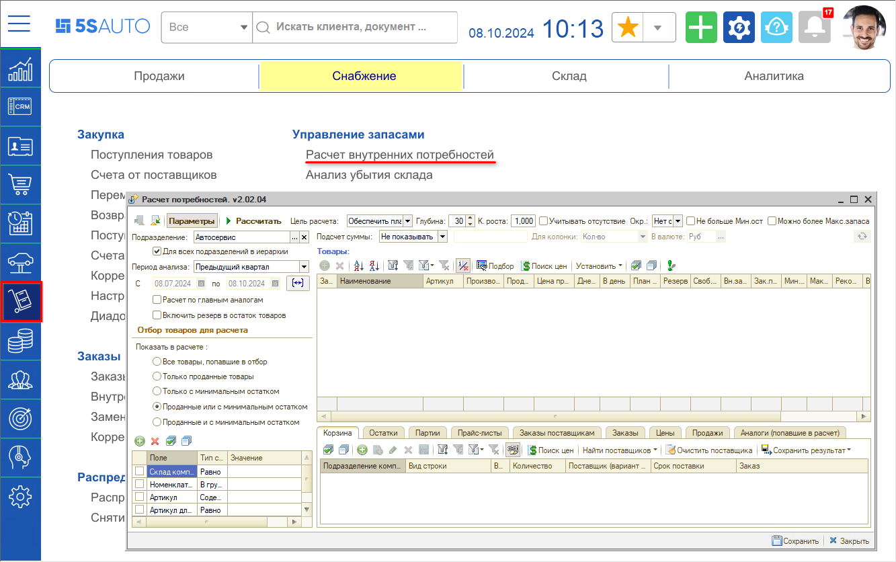

*\*Примечание: В случае если данного пункта меню нет на рабочем столе, можно добавить его вручную – см. статью "[Настройка рабочего стола](https://www.5systems.ru/help/nastroyka-rabochego-stola#nastrrazdelov)".*

Для пополнения складских запасов с помощью обработки следует выполнить следующие шаги:

1. Установить *параметры расчета*.
2. Рассчитать потребности в товаре, нажав кнопку "Рассчитать потребности".
3. Уточнить *цель расчета*.
4. *Выбрать товар для заказа*.
5. Установить *вариант поставки* для выбранных товаров.
6. *Создать документы*.

## Параметры расчета

Параметры собраны на левой панели обработки, после установки всех необходимых параметров можно скрыть данную панель нажатием на кнопку "Параметры".

**1. Подразделение**

Производится выбор подразделения, для которого будет производится расчет внутренних потребностей.

**2. Период анализа**

Следует установить период, за который будет производиться анализ продаж товаров.

Можно выбрать предопределенные периоды (Предыдущий месяц, Предыдущий квартал, Аналогичный месяц предыдущего года и т.д.):

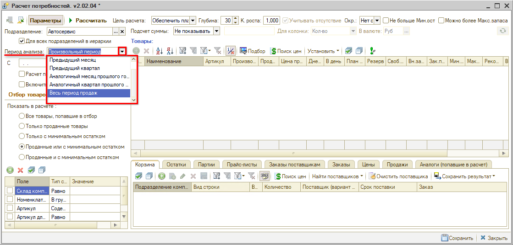

Либо задать произвольный период или интервал дат:

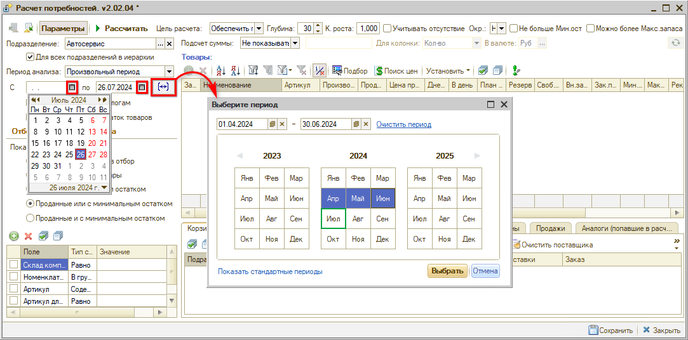

**3. Фильтр товаров**

Есть возможность произвести отбор товаров для анализа продаж:

1. Флажок *"Расчет по главным аналогам"* – в расчет будут добавлены все аналоги номенклатуры, отобранной для расчета потребностей.
2. Флажок *"Включить резерв в остаток товаров"* – при расчете рекомендации резерв товара на складе будет включен в текущий остаток.
3. Варианты отбора по продажам и минимальному остатку:
   1. *Все товары попавшие в отбор* - анализироваться будут все товары без учета того, продавались ли они, или задан ли для них минимальный остаток.
   2. *Только проданные товары* - анализироваться будут только те товары, по которым были продажи за указанный период.
   3. *Только с минимальным остатком* - анализироваться будут только те товары, для которых задан минимальный остаток.
   4. *Проданные или с минимальным остатком* – анализироваться будут товары, которые были проданы за указанный период, а также те, для которых задан минимальный остаток.
   5. *Проданные и с минимальным остатком* - анализироваться будут только те товары, которые были проданы за указанный период, и для которых при этом задан минимальный остаток.
4. *Отбор по реквизитам товара* - позволяет установить отбор товаров для анализа согласно заданным критериям:

   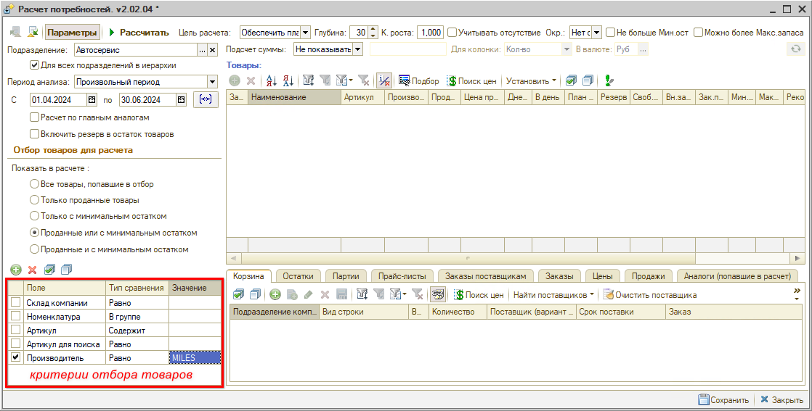

После установки всех нужных параметров следует нажать кнопку "Рассчитать".

## Цель расчета

Результаты расчета потребностей выводятся в таблицу "Товары". В колонке "Рекомендуем" указывается количество товара, которое рекомендуется приобрести исходя из проведенного анализа потребностей:

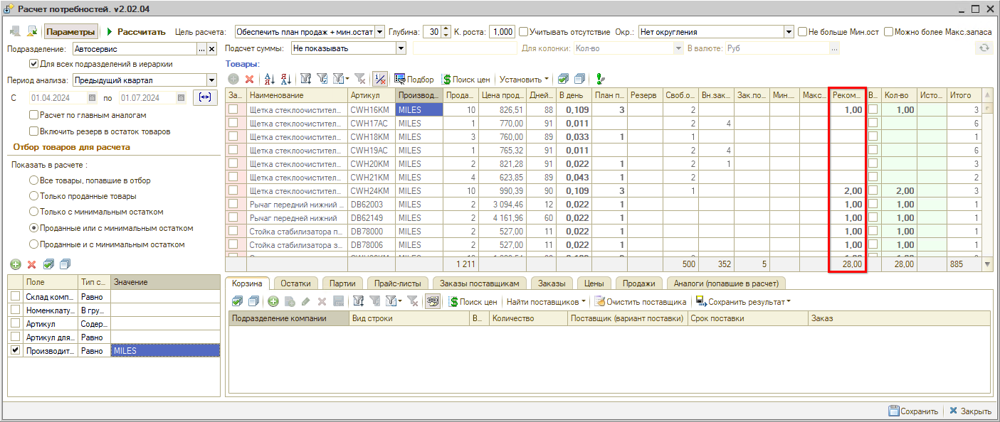

Анализ потребностей рассчитываются согласно установленной *Цели расчета*:

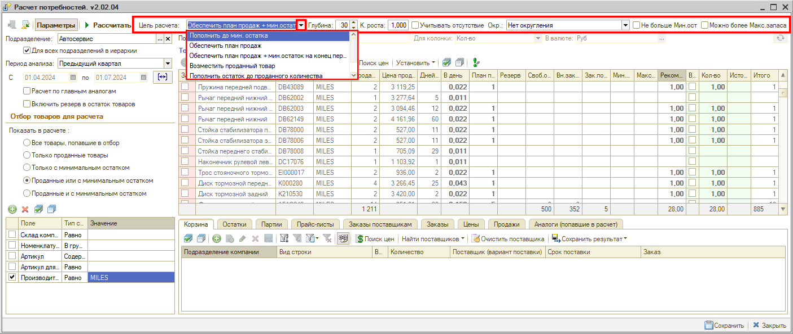

Параметры цели расчета:

1. *Цель расчета* - следует выбрать из списка значений:
   1. *Пополнить до мин. остатка* - будет рекомендовано количество товара для пополнения минимального остатка.
   2. *Обеспечить план продаж* - будет рекомендовано количество товара для обеспечения прогноза продаж с учетом параметров цели (глубина, коэффициент роста и т.п.).
   3. *Обеспечить план продаж + Мин. остаток на конец периода* - будет рекомендовано количество товара для обеспечения прогноза продаж с учетом параметров цели (глубина, коэффициент роста и т.п.) + для пополнения минимального остатка.
   4. *Возместить проданный товар* - будет рекомендовано количество товара, которое возместит продажи за период (количество "Рекомендовано" = количество "Продано").
   5. *Пополнить остаток до проданного количества* – будет рекомендовано количество товара, которое дополнит остаток до того количества, которое было продано за период (количество "Рекомендовано" = количество "Продано" – количество "Остаток").
2. *Глубина* - количество дней для прогноза продаж.
3. *К. роста* - предполагаемый коэффициент роста продаж (во сколько раз будут увеличены продажи).
4. *Учитывать отсутствие* - если активизирован параметр, то при вычислении средней продажи в день будут исключены дни, в которые товар отсутствовал на складе.
5. *Окр.* - выбор порядка округления значения для колонки "Рекомендуем".
6. *Не больше Мин. ост.* - если активизирован параметр, то значение в колонке "Рекомендуем" не будет превышать минимальный остаток. Если минимальный остаток не установлен, то будет рекомендовано 0 товаров.
7. *Можно более Макс. запаса* - если параметр не активизирован, то значение в колонке "Рекомендуем" не будет больше, чем заданный максимальный запас для товара.

## Выбор товаров для заказа

Варианты выбора товара для заказа:

1. Анализировать построчно рекомендации на основе данных *в колонках*, выбрать товар и откорректировать количество для заказа при необходимости:

   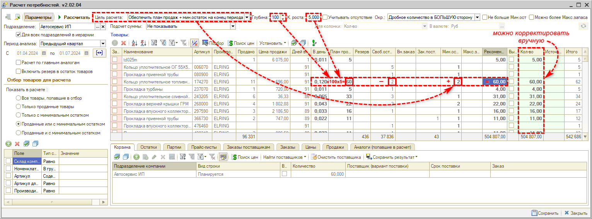

   Если количество для добавления в документ будет равно рекомендованному, то оно выделяется зеленым цветом шрифта; если меньше рекомендованного, то красным цветом шрифта; если больше рекомендованного, то синим цветом шрифта.
2. Выполнить поиск цен по товару и добавить подходящее значение для заказа:

   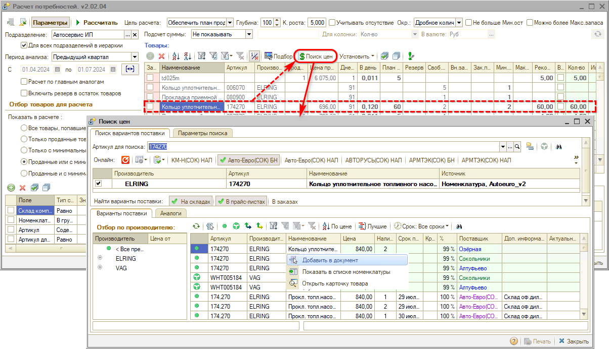
3. Часть значений откорректировать построчно (см п. 1 и 2), остальные рекомендации выбрать как есть:

   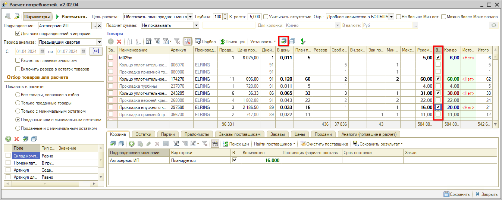
4. Выбрать все значения, по которым рекомендовано пополнение автоматически (при этом количество заказа станет равным рекомендованному количеству и введенные вручную данные будут перезаписаны):

   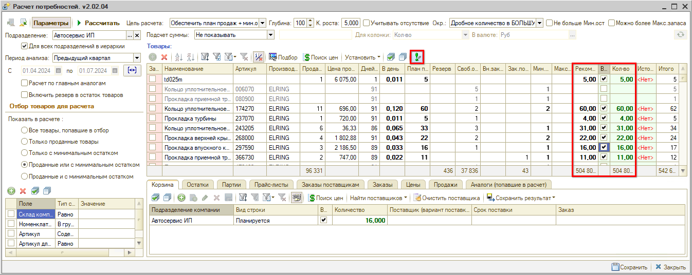

Товары, которые не требуется заказывать, можно удалить:

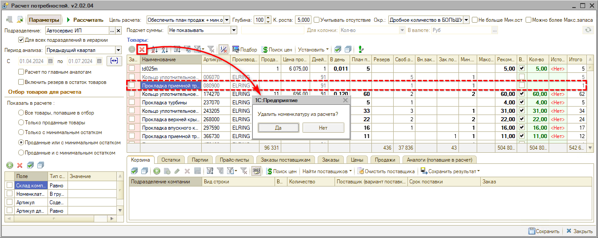

### Основные колонки списка товаров

| Колонка | Описание |
| --- | --- |
| Продано | Сколько всего товаров продано за указанный период |
| Цена продажи | Цена продажи в подразделении |
| Дней в продаже | Количество дней, которые товар был в наличии на складе |
| В день | Среднее количество продаж в день  Если активизирован параметр цели расчета "Учитывать отсутствие", то вычисляется как "Продано"/"Дней в продаже", иначе: "Продано"/*Количество дней указанного периода расчета потребностей*. |
| План продаж | Рассчитанный прогноз продаж  Вычисляется, если в цели расчета стоит "Обеспечить план продаж" или "Обеспечить план продаж + мин. остаток". Формула расчета: "В день"\**Глубина*\**К.роста*, где *Глубина* и *К.роста* берутся из заданных параметров цели расчета. |
| Мин. остаток | Минимальный остаток товара на складе (для обеспечения продаж на время поставки)  Значение в поле можно указать вручную, при этом оно сохранится в реквизитах товара. При необходимости можно массово установить новые значения или установить значения по формуле (см. *Задание дополнительных реквизитов товара*). |
| Резерв | Текущий резерв на складах |
| Свободный остаток | Количество товара на складе на текущую дату |
| Внутренний заказ | Не обеспеченный внутренний заказ подразделения  Считается, что товар по внутреннему заказу будет поставлен в ближайшее время, учитывается при расчете рекомендаций. |
| Заказано поставщикам | Свободный заказ поставщикам, в котором не указано распределение по внутренним заказам или заказам покупателей  Считается, что товар по заказу поставщику будет поставлен в ближайшее время, учитывается при расчете рекомендаций. |
| Макс. запас | Максимально допустимый запас товара на складах подразделения  Значение в поле можно указать вручную, при этом оно сохранится в реквизитах товара. При необходимости можно массово установить новые значения или установить значения по формуле (см. *Задание дополнительных реквизитов*). |
| Квант поставки | Квант поставки товара для подразделения  Значение в поле можно указать вручную, при этом оно сохранится в реквизитах товара. При необходимости можно массово установить новые значения или установить значения по формуле (см. *Задание дополнительных реквизитов*). |
| Рекомендуем | Количество, рекомендованное для внутреннего заказа |
| Выбран | Признак добавления товара в документ для заказа |
| Кол-во | Количество товара для заказа, т.е. для добавления в документ  При выборе товара значение в колонке выделяется цветом: если количество для добавления в документ равно рекомендованному, то оно выделяется зеленым цветом шрифта; если меньше рекомендованного, то красным цветом шрифта; если больше рекомендованного, то синим цветом шрифта. |
| Источник | Метка, выбран или нет вариант поставки - источник обеспечения |
| Итого | Количество товара, которое в итоге будет на складе после пополнения |

### Задание дополнительных реквизитов

Дополнительные реквизиты товара: минимальный остаток, максимальный запас, квант поставки.

Если нужно для нескольких товаров установить одинаковые значения дополнительного реквизита, то:

1. Выберите значения дополнительного реквизита (например, мин. остаток).
2. Перейдите к указанию нового значения реквизита:

   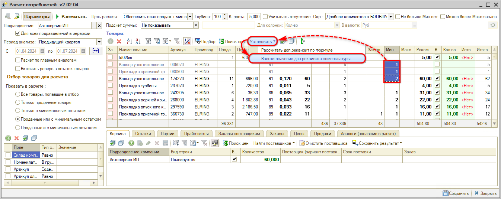
3. Задайте новое значение и подтвердите его нажатием на кнопку "ОК":

   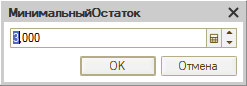

Если нужно для одного или нескольких товаров задать значение дополнительного реквизита по формуле (например, мин. остаток = количество проданных товаров), то:

1. Выберите товары, у которых будут изменяться дополнительные реквизиты.
2. Перейдите к созданию формулы:

   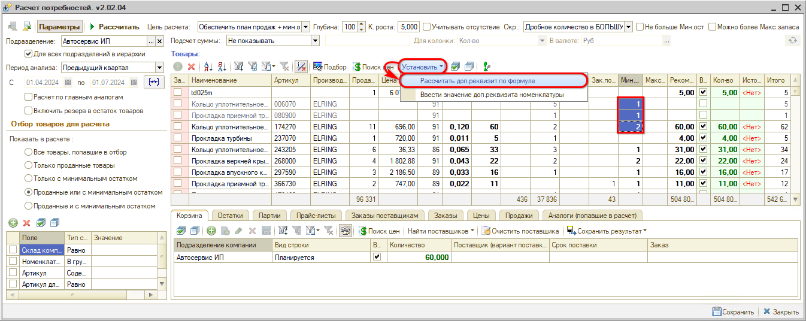
3. Установите формулу и примените ее:

   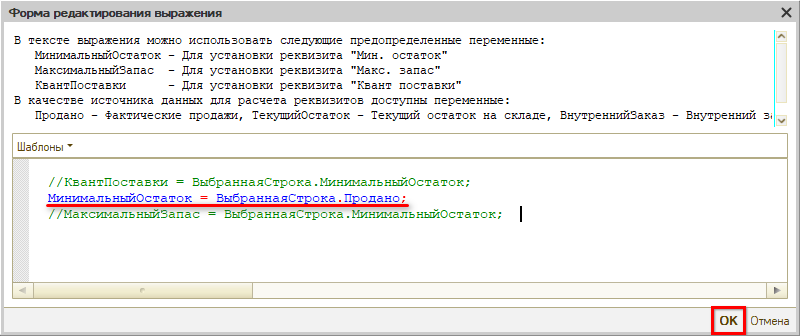

## Выбор варианта поставки товара

После того, как выбраны товары для добавления в документ, необходимо определить вариант поставки для каждого товара, по которому в колонке "Источник" указано "<Нет>".

После того как выбран вариант поставки, в колонке "Источник" появляется значение "<Ок>":

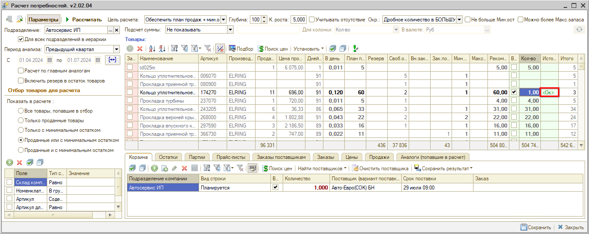

При выделении строки с товаром отображаются дополнительные данные в контексте данной товарной позиции в нижней части обработки. Информация собрана на нескольких вкладках.

#### 1. Выбор поставщика в корзине

На вкладке "Корзина" отображается, в какое подразделение какое количество товара необходимо поставить:

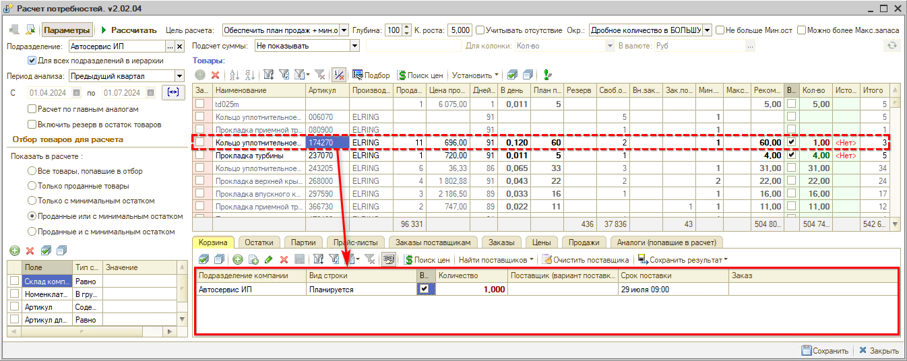

Если известно заранее, где разместить заказ, то можно выбрать вариант поставки в колонке "Поставщик" корзины. Для этого следует:

1. Выбрать тип данных:

   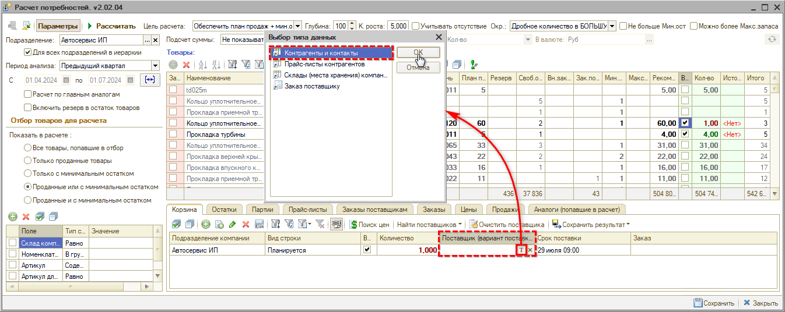
2. Выбрать нужное значение:

   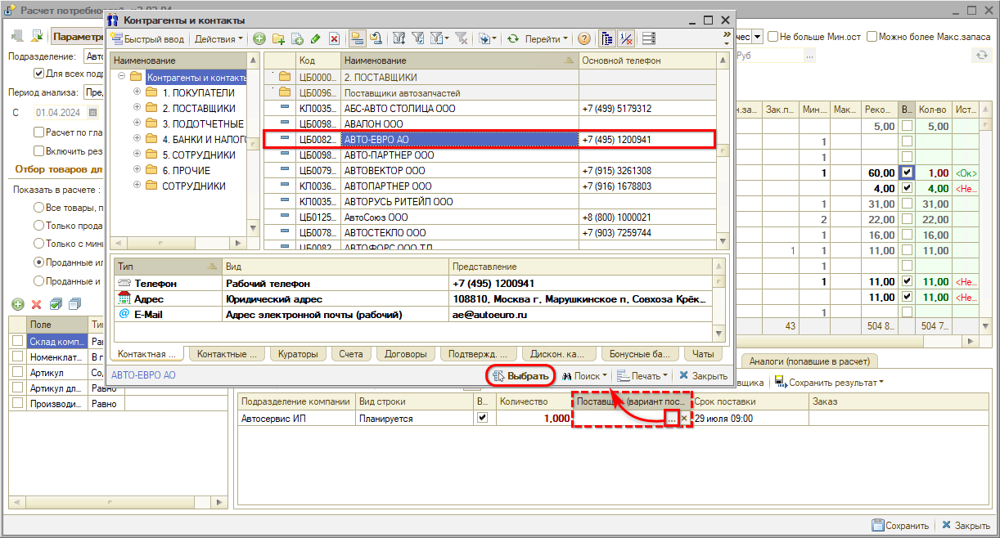

#### 2. Выбор поставщика среди поступивших партий

На вкладке "Партии" отображается, откуда ранее поступал товар:

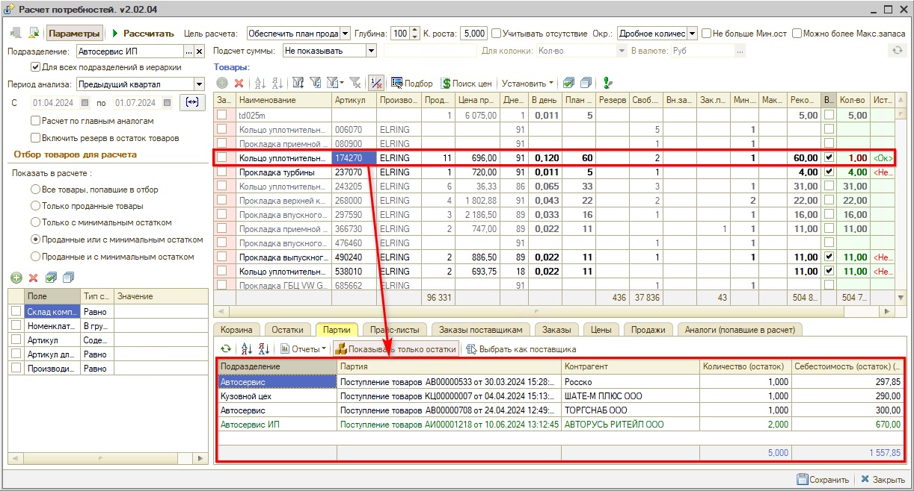

Для добавления поставщика из партии необходимо активизировать партию и нажать кнопку "Выбрать как поставщика":

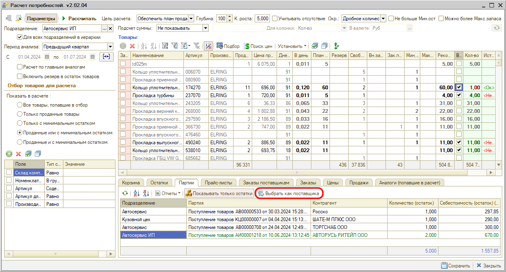

#### 3. Выбор поставщика среди прайс-листов

На вкладке "Прайс-листы" отображаются все загруженные из файла прайс-листы, в которых присутствует выбранный товар:

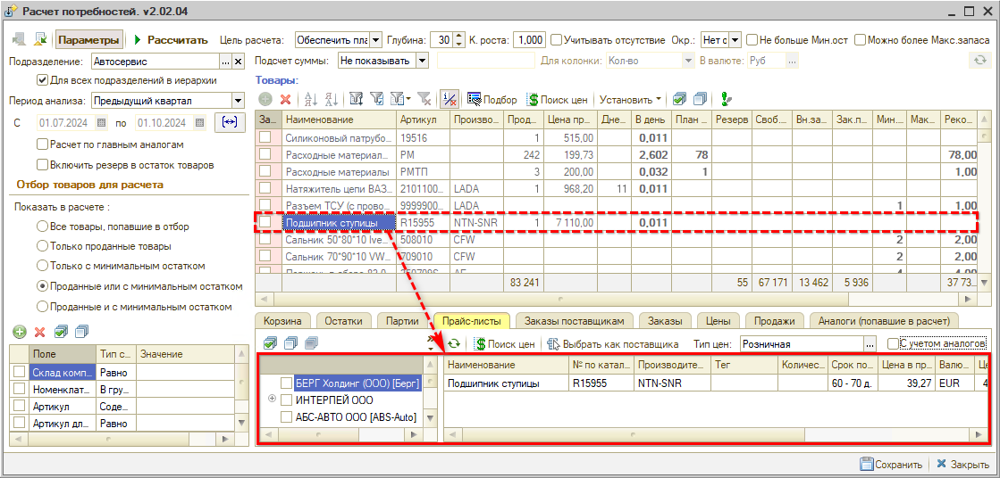

Для добавления поставщика из заказа прайс-листа необходимо активизировать прайс-лист и нажать кнопку "Выбрать как поставщика":

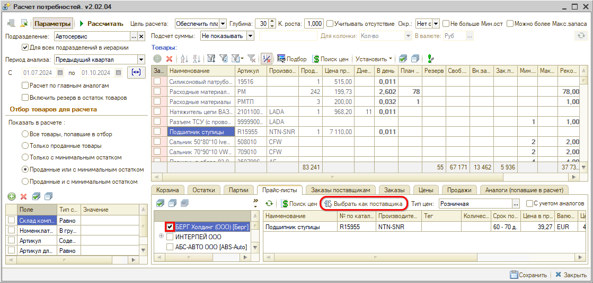

#### 4. Выбор поставщика среди заказов поставщику

На вкладке "Заказы поставщикам" отображается, у каких поставщиков заказывался ранее товар:

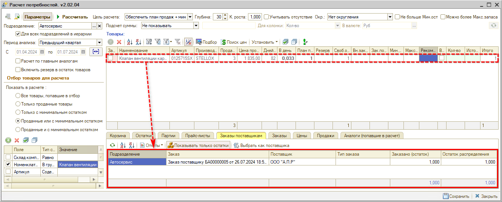

Для добавления поставщика из заказа поставщику необходимо активизировать заказ и нажать кнопку "Выбрать как поставщика":

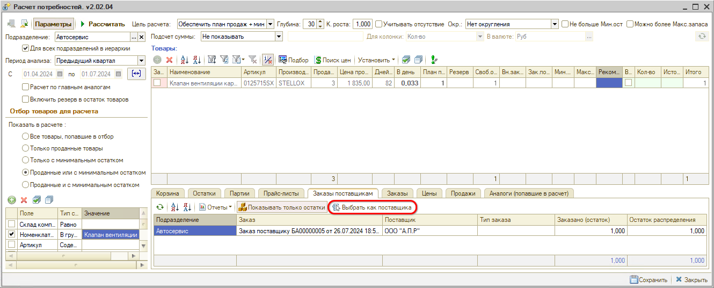

#### 5. Выбор поставщика через поиск в прайс-листах

По всем товарам, выбранным для заказа, можно заполнить вариант поставки из прайс-листов, загруженных из файла. Для этого:

1. На вкладке "Корзина" нажмите кнопку "Заполнить по прайс-листам":

   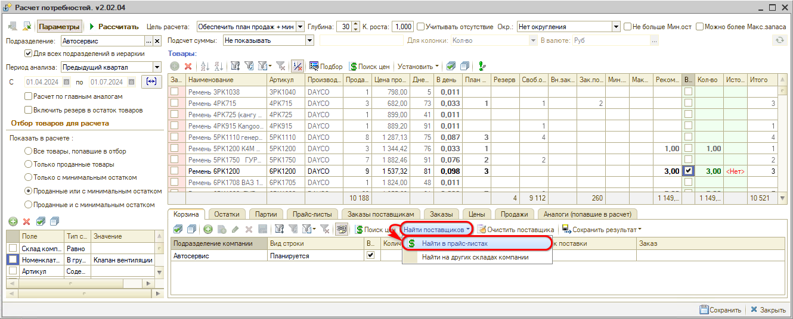
2. Выберите вариант поиска:

   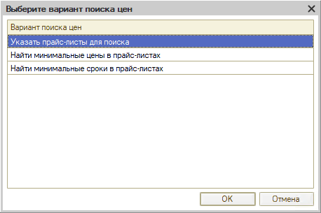

После выбора варианта поиска для всех товаров, найденных в прайс-листах, заполнятся варианты поставки.

#### 6. Выбор поставщика с помощью Поиска цен

По товарам, выбранным для заказа, можно заполнить вариант поставки через обработку "Поиск цен". В частности можно сделать заказ из Веб прайс-листов. Для этого выберите товар в корзине и нажмите кнопку "Поиск цен":

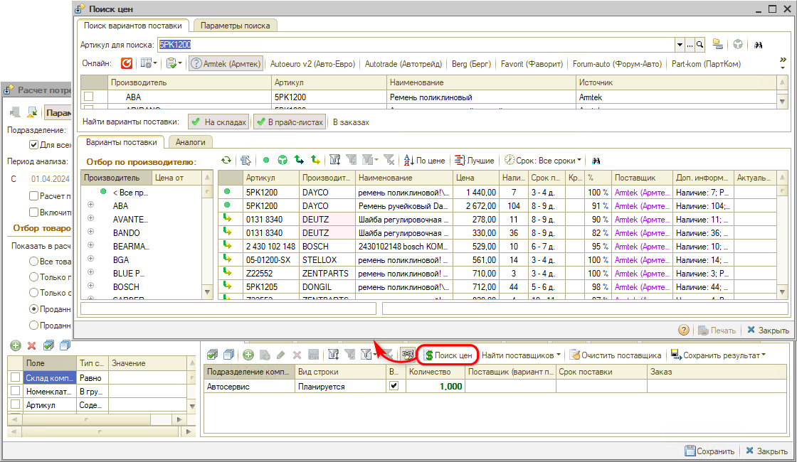

Описание работы с обработкой см. в статье "[Поиск цен](../../Проценка%20запчастей%20и%20работ/Поиск%20цен/poisk-cen.md)".

## Создание документов (сохранение результатов)

Выбранные для заказа товары можно сохранить:

1. В виде внутреннего заказа - создать документ "Заказ и резервирование внутренние".
2. В виде документа "Заказ поставщику" - создать столько заказов поставщику, сколько вариантов поставки выбрано для товаров.

Для сохранения результата:

1. Кликните на меню "Сохранить результат" и выберите, какой документ создать:

   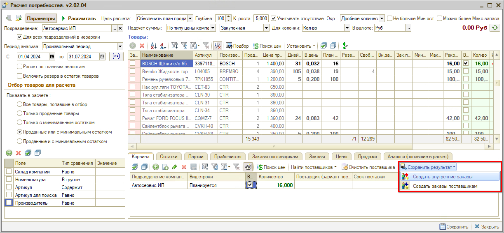
2. Для создания внутреннего заказа выберите склад, куда поступят товары.
3. Для создания заказов поставщикам выберите поставщика.

В результате будет предложено открыть созданные документы для обработки и проведения:

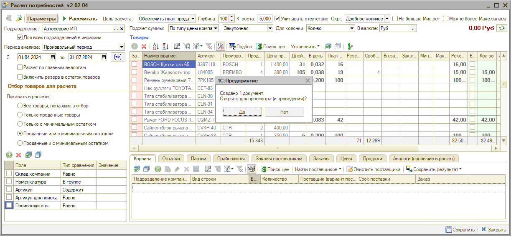

Пример созданного внутреннего заказа:

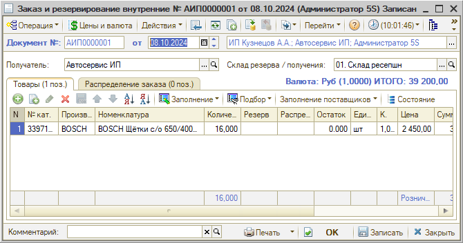

Товары, сохраненные в документы, исчезнут из списка результатов расчета потребностей.

## Видео по теме

**[Вебинар](https://youtu.be/NAVaNKj-WvQ) по теме «Пополнение складских запасов»:**

[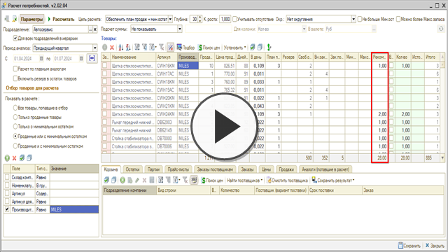](https://edu.5systems.ru/video/archive/Poplnenie_skladskih_zapasov_–_Vebinar_5_SYSTEMS_25.11.2020.mp4)

---

**Теги:** пополнение складских запасов, расчет внутренних потребностей, мин. остаток, макс. запас, заказ поставщику, внутренний заказ

