

# Признаки номенклатуры

<table><tr><td><b>Время чтения:</b> 20 мин.</td><td><b>Обновлено:</b> 19.06.2024</td></tr></table>

Источник: https://www.5systems.ru/help/priznaki-nomenklatury

> *Функционал доступен начиная с релиза 2.7.2.*

## Содержание

1. [Введение](#введение)
2. [Интерфейсы программы](#интерфейсы-программы)
3. [Предопределенные признаки](#предопределенные-признаки)
4. [Установка признаков](#установка-признаков)
5. [Добавление новых признаков](#добавление-новых-признаков)
6. [Настройка выделения](#настройка-выделения)
7. [Право для документов](#право-для-документов)
8. [Отбор по признакам](#отбор-по-признакам)
9. [Отчет](#отчет)

## Введение

В программе есть возможность назначения различных *признаков* для товаров, которая помогает упростить работу со справочником "Номенклатура" на этапах подбора запчастей, проценки и оформления документов.

*Варианты признаков для выделения:*

- товары определенной товарной группы – например, моторные масла конкретного производителя;
- акционный товар – например, товар, закупленный у поставщика по акции;
- уценка/дефект – товар c незначительным дефектом, не позволяющим продать его за полную стоимость, но не влияющим на его основные качества;
- неликвид – для приоритетной продажи труднореализуемых товаров, которые были заказаны под конкретный а/м, но остались не востребованы;
- сезонный товар – для распродажи в несезон товаров с ограниченным сроком хранения.

Также в системе есть следующие *предопределенные признаки* — описание см. [*ниже*](#предопределенные-признаки)*:*

- "Есть резерв";
- "Важный комментарий";
- "Приоритет при продаже";
- "Запрет закупки";
- "Запрет продажи";
- "Снята с производства";
- "Прослеживаемый товар".

Если на номенклатурную позицию назначено два или несколько признаков, то она будет выделяться цветом того признака, который выше по приоритету – см. [*ниже*](#2-приоритет-признаков)*.*

## Интерфейсы программы

### 1. Справочник "Номенклатура"

Пример выделения номенклатуры в справочнике:

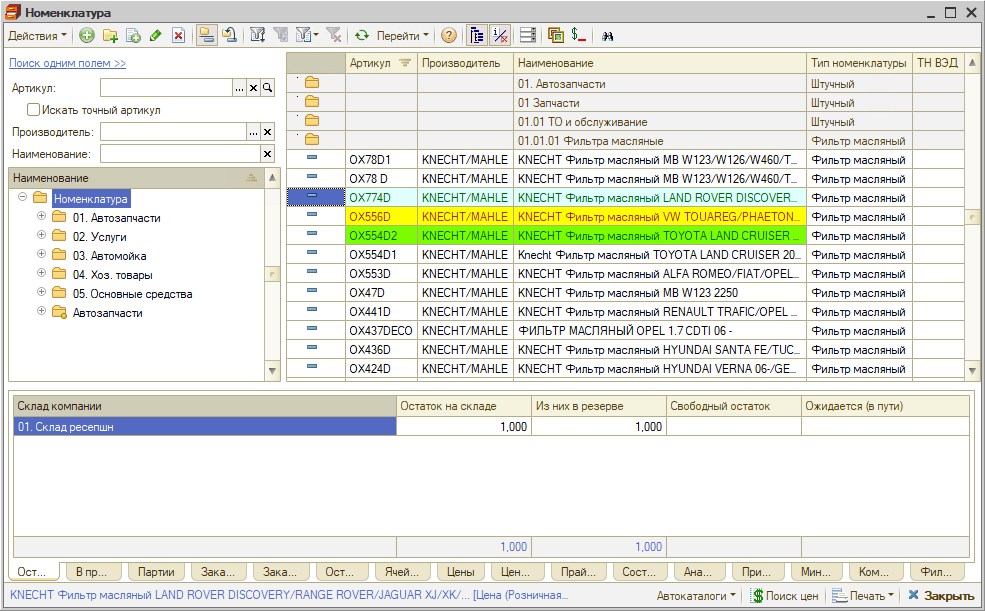

### 2. Корзина

Подсветка отображается в следующих областях [АРМ "Корзина"](../../Проценка%20запчастей%20и%20работ/Работа%20в%20АРМ%20Корзина/rabota-v-arm-korzina.md):

**1)** Страница *"Товары"* панели "Товары и работы":

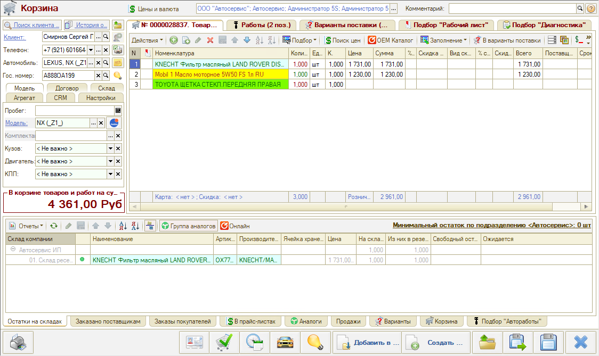

**2)** П*одбор "Рабочий лист"* – форма добавления товара:

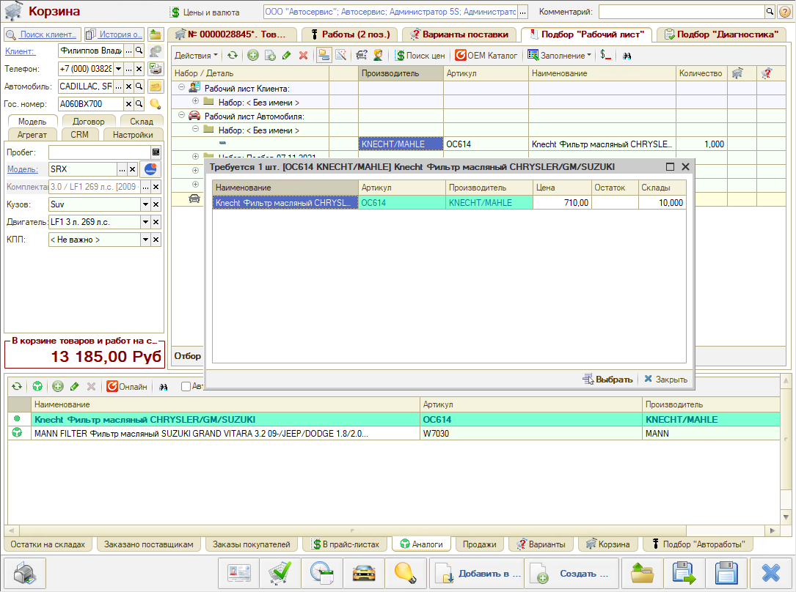

**3)** Вкладка *"Остатки на складах"* информационной панели:

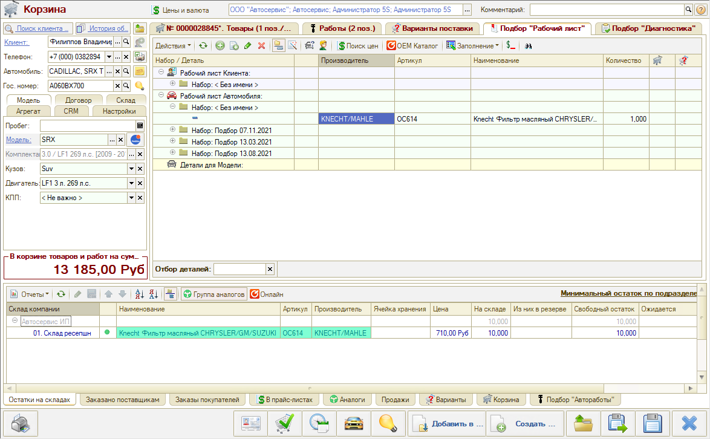

**4)** Вкладка *"Аналоги"* информационной панели:

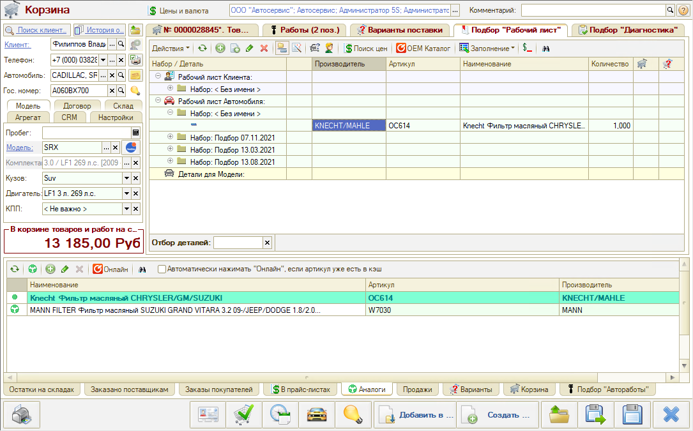

### 3. Документы

Подсветка номенклатуры отображается в следующих *документах* в программе:

- Заказ-наряд;
- Поступление товаров;
- Реализация товаров;
- Заказ поставщику;
- Заказ покупателя.

Пример отображения подсветки номенклатуры в Заказ-наряде:

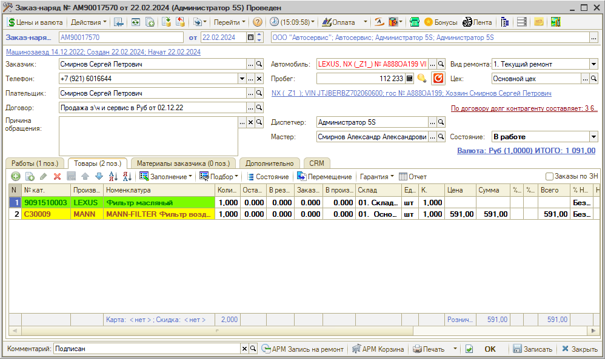

В подборе номенклатуры также отображается подсветка:

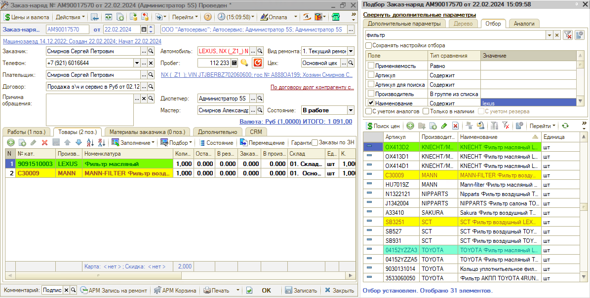

### 4. Поиск цен

Подсветка отображается в [Поиске цен](../../Проценка%20запчастей%20и%20работ/Поиск%20цен/poisk-cen.md) на вкладке "Варианты поставки":

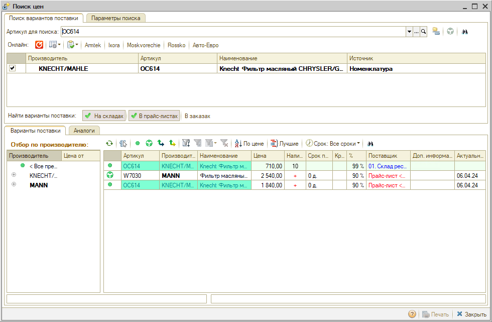

## Предопределенные признаки

Предусмотрено выделение номенклатуры по нескольким **предопределенным признакам**. Также есть возможность добавить свои произвольные признаки для выделения – см. [ниже](#добавление-новых-признаков).

### 1. "Есть резерв"

Номенклатура будет подсвечена по признаку *"Есть резерв",* если некоторое количество данного товара зарезервировано под определенные заказы:

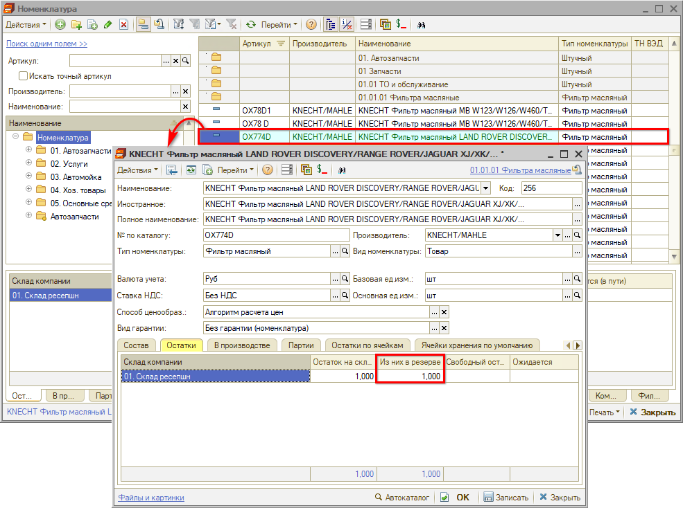

Выделение по этому признаку предусмотрено для того, чтобы не продать зарезервированный товар другим клиентам.

Проверить резервирование можно в справочнике "Номенклатура" либо в карточке номенклатуры – на вкладке "Остатки" в колонке "Из них в резерве" отображается количество зарезервированного товара.

### 2. "Важный комментарий"

Номенклатура будет подсвечена по признаку *"Важный комментарий",* если соответствующий признак установлен в карточке номенклатуры на вкладке "Комментарий" либо активирован на вкладке "Признаки":

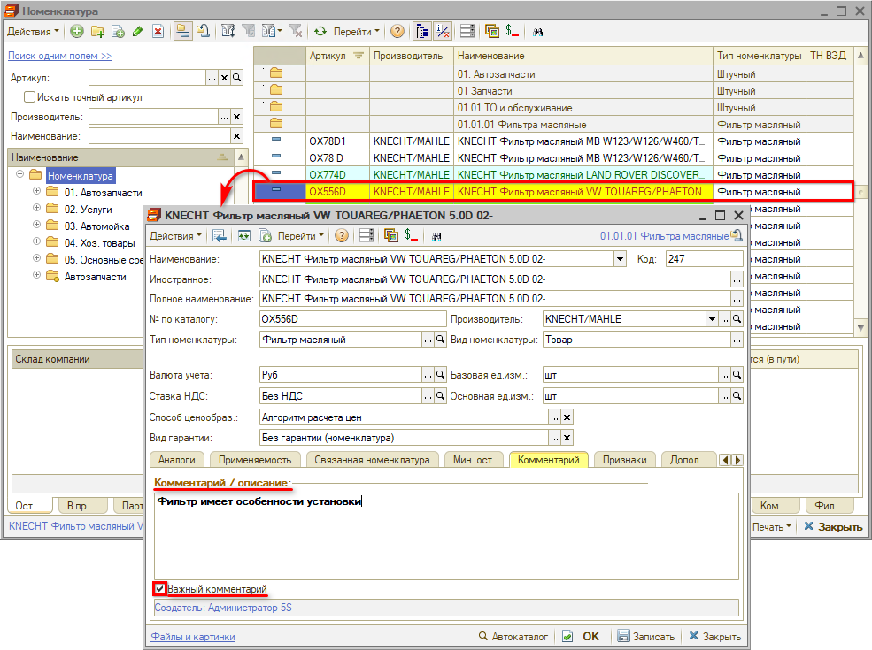

Признак "Важный комментарий" позволяет обратить внимание пользователя на то, что товар имеет какие-либо особенности: если номенклатура подсвечена по данному признаку, следует открыть карточку товара либо в справочнике "Номенклатура" перейти на вкладку "Комментарий" и прочитать описание.

### 3. "Приоритет при продаже"

Признак *"Приоритет при продаже"* устанавливается для выделения номенклатуры, которую следует реализовывать в первую очередь.

***Дополнительно*** предусмотрено расширение логики выделения по признаку *приоритета при продаже* для интерфейса "Поиск цен" – есть возможность задать *приоритет продажи по производителю.* Для установки данного признака следует перейти в карточку производителя:

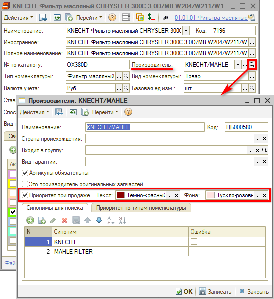

В данном поле можно настроить желаемые цвета текста и фона выделения.

Выделение по данному признаку работает в справочнике "Производители" и в обработке "[Поиск цен](../../Проценка%20запчастей%20и%20работ/Поиск%20цен/poisk-cen.md)":

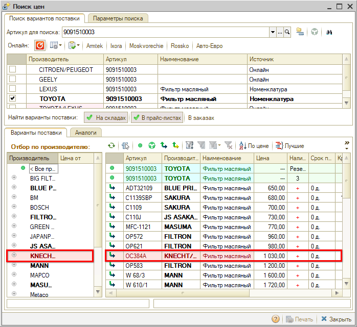

Приоритет выделения по производителю выше, чем у признака "Приоритет при продаже".

### 4. "Запрет закупки"

Признак *"Запрет закупки"* устанавливается для блокировки возможности закупки данной номенклатуры, проверяется системой при попытке добавления товара в следующие документы:

- "Заказ поставщику" – программа *блокирует* добавление товара с признаком "Запрет закупки" и выводит *предупреждение,* при переходе из документа в справочник "Номенклатура" данная товарная позиция *не будет отображаться* для выбора\*; *\*Примечание:* При переходе в справочник из других интерфейсов или из меню программы товар будет отображаться с цветовым выделением, установленным для данного признака.
- "Заказ покупателя" и "Поступление товаров" – программа выводит *предупреждение* о том, что номенклатура *блокирована для закупки,* но есть возможность добавить ее в документ.

### 5. "Запрет продажи"

Признак *"Запрет продажи"* устанавливается для блокировки возможности реализации данной номенклатуры, проверяется системой при добавлении товара в следующие документы и интерфейсы:

- "Заказ покупателя", "Заказ-наряд", "Реализацию товаров" – программа блокирует добавление товара с признаком "Запрет продажи" и выводит предупреждение, при переходе из документа в справочник "Номенклатура" данная товарная позиция *не будет отображаться* для выбора\*; *\*Примечание:* При переходе в справочник из других интерфейсов или из меню программы товар будет отображаться с цветовым выделением, установленным для данного признака.
- АРМ "Корзина" – программа блокирует попытку добавления товара путем ввода артикула в строку, но добавить товар через поиск в справочнике можно.

### 6. "Снята с производства"

Признак *"Снята с производства"* устанавливается для запчастей, которые сняты с производства.

### 7. "Прослеживаемый товар"

Признак *"Прослеживаемый товар"* устанавливается для товара, по которому производится учет кодов маркировки.

## Установка признаков

Установка признаков производится *на вкладке "Признаки"* в карточке номенклатуры:

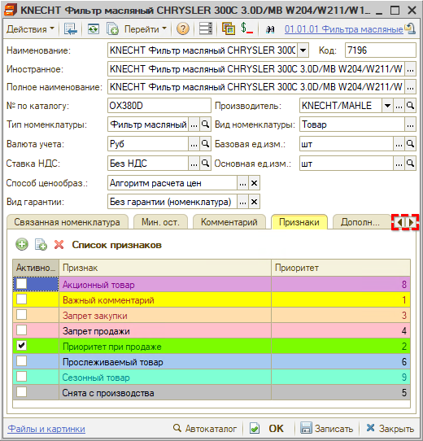

Для *активации* нужного признака у данного товара следует установить галочку в колонке *"Активность"* и записать изменения.

При добавлении признака "Важный комментарий" также необходимо заполнить текст комментария на соответствующей вкладке – см. [выше](#2-важный-комментарий).

*Примечание:* Предопределенный признак *"Есть резерв"* в данном перечне не выводится, т.к. данный признак устанавливается автоматически, и не предполагается его назначение вручную – см. [выше](#1-есть-резерв).

Неиспользуемые признаки можно *удалить* из данной таблицы в карточке нажатием на кнопку "Удалить текущий".

*Примечание:* Есть возможность *групповой установки признаков,* т.е. назначения определенного признака сразу для целой группы товаров. Описание способа выходит за рамки текущей статьи – осуществляется техническими специалистами компании 5SYSTEMS при помощи специальной обработки.

## Добавление новых признаков

Помимо предопределенных можно добавлять новые произвольные признаки для выделения номенклатуры. Для этого необходимо перейти в список "Признаки номенклатуры":

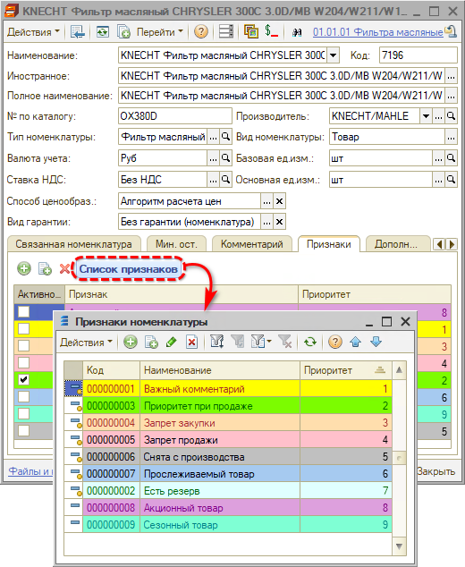

Для добавления нового элемента следует нажать кнопку "Добавить", ввести наименование для нового признака, установить порядковый номер по приоритету и записать:

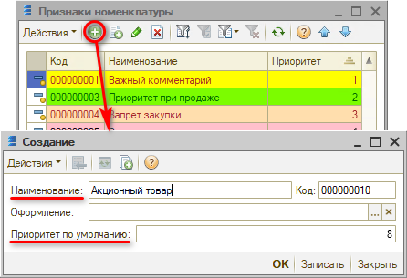

Затем необходимо настроить цвет выделения по этому признаку – см. [ниже](#настройка-выделения).

После настройки новые признаки можно также [устанавливать](#установка-признаков) для номенклатуры.

## Настройка выделения

Для предопределенных признаков номенклатуры оформление задано по умолчанию – есть возможность изменить его, а также следует настраивать оформление для новых добавляемых признаков.

### 1. Выбор оформления

Настройка выделения номенклатуры производится через справочник *"Статусы и состояния" → "Справочник номенклатура".* Переход к справочнику производится через форму настройки признака номенклатуры:

**1)** *при изменении предопределенного признака –* для этого следует в списке "Признаки номенклатуры" выделить нужный признак и нажать кнопку "Изменить":

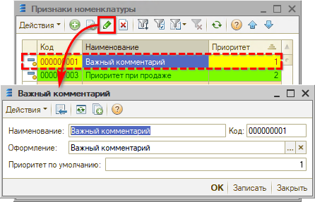

**2)** *при добавлении нового признака –* при *записи* нового признака появляется новая запись в справочнике "Статусы и состояния объектов" – строка с новым элементом оформления, который необходимо *настроить:*

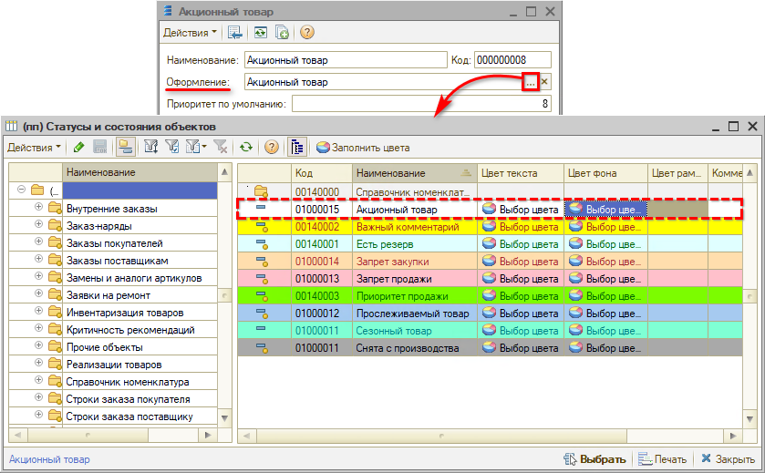

Также перейти в справочник можно через меню программы *Администрирование → Сервис → Интерфейс → Статусы и состояния.*

Необходимо выбрать *цвет фона и цвет текста* выделения – для этого следует дважды кликнуть соответствующую ячейку и выбрать желаемый цвет:

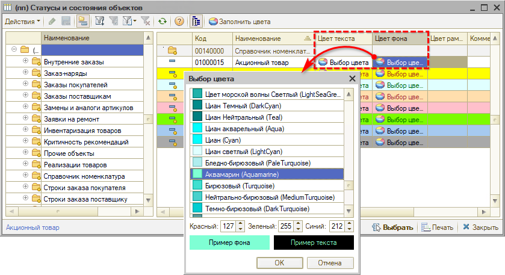

После того как заданы цвета оформления, следует нажать на нижней панели справочника кнопку "Выбрать" и *сохранить* настройки признака.

### 2. Приоритет признаков

Приоритет признака определяет, в какой цвет будет окрашиваться номенклатурная позиция, если для нее установлено два признака и более – строка с данной запчастью будет выделяться цветом того признака, у которого приоритет выше.

Для предопределенных признаков приоритеты заданы по умолчанию – есть возможность изменить предустановленную приоритетность, а также необходимо устанавливать приоритет для новых добавляемых признаков.

Для изменения приоритета признаков следует перейти к форме *списка признаков* и выстроить приоритеты при помощи кнопок "Добавить авторитет" / "Прибавить авторитет":

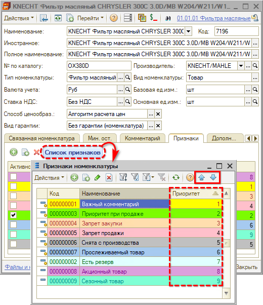

Также нужный порядковый номер по приоритету можно установить в карточке каждого признака:

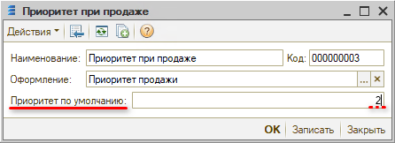

## Право для документов

Для использования подсветки в документах необходимо установить на пользователя право "Подсветка номенклатуры в документах":

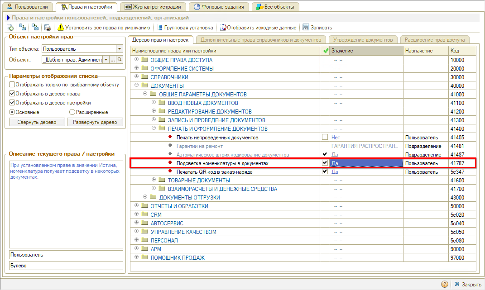

*Примечание:* Выделение в справочнике номенклатуры, в Корзине и в Поиске цен работает по умолчанию, без настройки дополнительных прав.

## Отбор по признакам

Для отбора номенклатуры по определенному признаку следует в справочнике "Номенклатура" перейти на вкладку "Фильтр", выбрать нужный признак в соответствующей строке и нажать кнопку "Установить отбор":

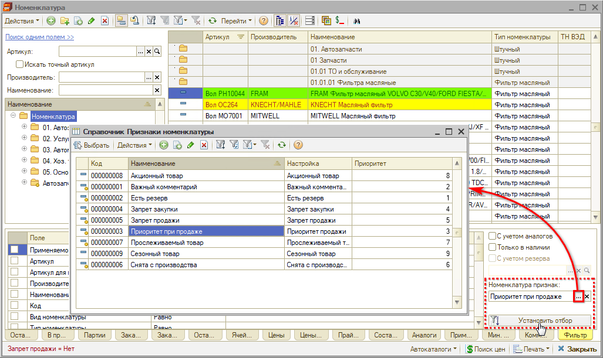

См. также описание работы с фильтрами в статье "[Номенклатура](../Номенклатура/nomenklatura.md#filtr)".

В результате в справочнике выводятся только те номенклатурные позиции, для которых был установлен данный признак:

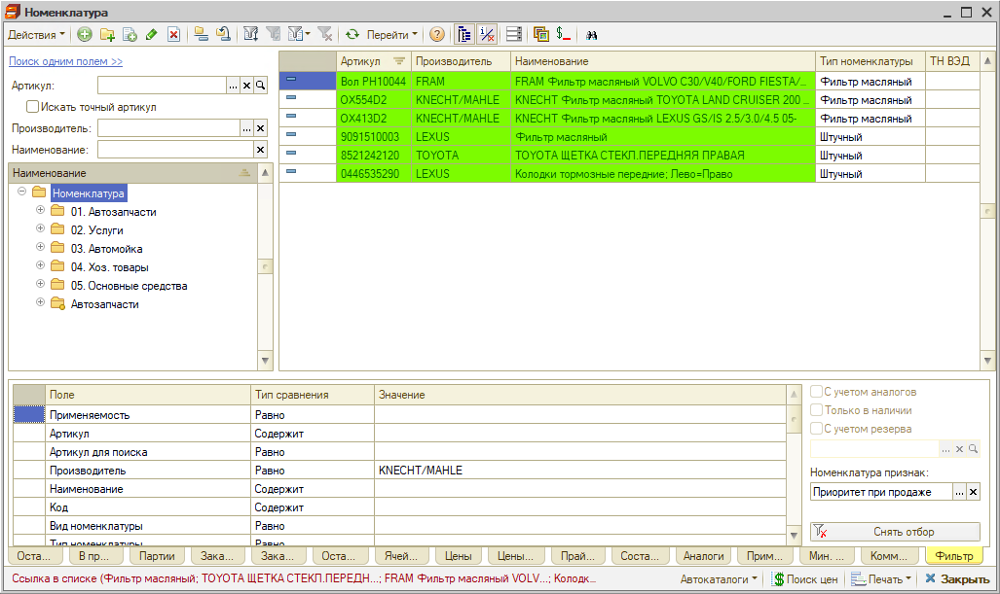

По завершении работы с отобранными позициями следует нажать кнопку *"Снять отбор".*

## Отчет

Проанализировать продажи по номенклатурным позициям с установленными признаками позволяет отчет "Анализ продаж и торговой наценки".

Для этого в настройках отчета следует задать отбор по нужному признаку номенклатуры:

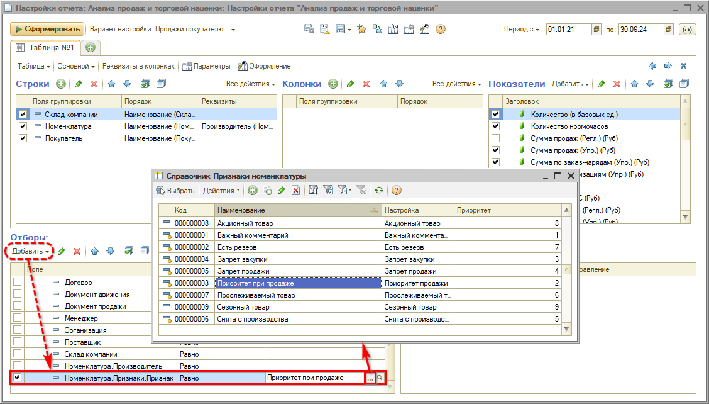

Например, есть возможность построить отчет по продажам товаров с признаком "Приоритет при продаже":

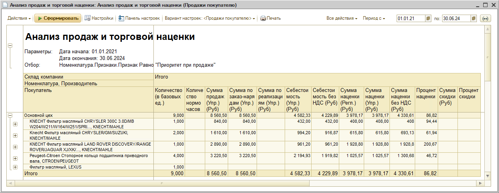

*Примечание 1:* По признаку "Есть резерв" отбор в отчете работать не будет.

*Примечание 2:* Если по товару с каким-либо признаком были продажи, а затем признак у этого товара был снят, то данный товар в отчет не попадет, независимо от заданного периода.

---

**Теги:** признаки номенклатуры, подсветка номенклатуры, предопределенные признаки, приоритет при продаже, запрет закупки, запрет продажи, отбор по признакам, статусы и состояния

