

# Автозаполнение применяемости из заказ-наряда

<table><tr><td><b>Время чтения:</b> 20 мин.</td><td><b>Обновлено:</b> 13.01.2025</td></tr></table>

Источник: https://www.5systems.ru/help/avtozapolnenie-primenyaemosti-iz-zakaz-naryada

> *Актуально начиная с версии релиза 2.6.1.1.*

## Содержание

1. [Введение](#введение)
2. [Добавление применяемости через заказ-наряд](#добавление-применяемости-через-заказ-наряд)
   - [1. Создание заказ-наряда в сделке](#1-создание-заказ-наряда-в-сделке)
   - [2. Добавление авторабот в заказ-наряд](#2-добавление-авторабот-в-заказ-наряд)
   - [3. Добавление товаров в заказ-наряд](#3-добавление-товаров-в-заказ-наряд)
     - [Цветовое обозначение деталей применяемости](#цветовое-обозначение-деталей-применяемости)
   - [4. Сохранение детали в применяемость](#4-сохранение-детали-в-применяемость)
     - [Сохранение основной детали](#сохранение-основной-детали)
     - [Добавление аналога](#добавление-аналога)
   - [5. Изменение основной детали](#5-изменение-основной-детали)
   - [6. Удаление артикула из группы аналогов](#6-удаление-артикула-из-группы-аналогов)
3. [Отчет "Новые детали применяемости"](#отчет-новые-детали-применяемости)
4. [Предварительные настройки](#предварительные-настройки)
   - [1. Привязка деталей применяемости к причинам обращения](#1-привязка-деталей-применяемости-к-причинам-обращения)
   - [2. Настройка вида ремонта](#2-настройка-вида-ремонта)
   - [3. Установка связи авторабот с деталями применяемости](#3-установка-связи-авторабот-с-деталями-применяемости)
   - [4. Настройка ролей пользователя](#4-настройка-ролей-пользователя)

## Введение

См. основную статью [Работа с применяемостью](../Работа%20с%20применяемостью/rabota-s-primenyaemostyu.md).

Инструмент *автозаполнения применяемости из заказ-нарядов* дает возможность в процессе работы с заказ-нарядами параллельно пополнять следующие данные:

1. Устанавливать связь номенклатуры с работами;
2. Наполнять данные по применяемости деталей к модификациям автомобилей;
3. Наполнять данные по аналогам деталей.

В результате данные о деталях применяемости, аналогах и связях работ с деталями отображаются в Корзине, что значительно увеличивает скорость подбора запчастей и авторабот:

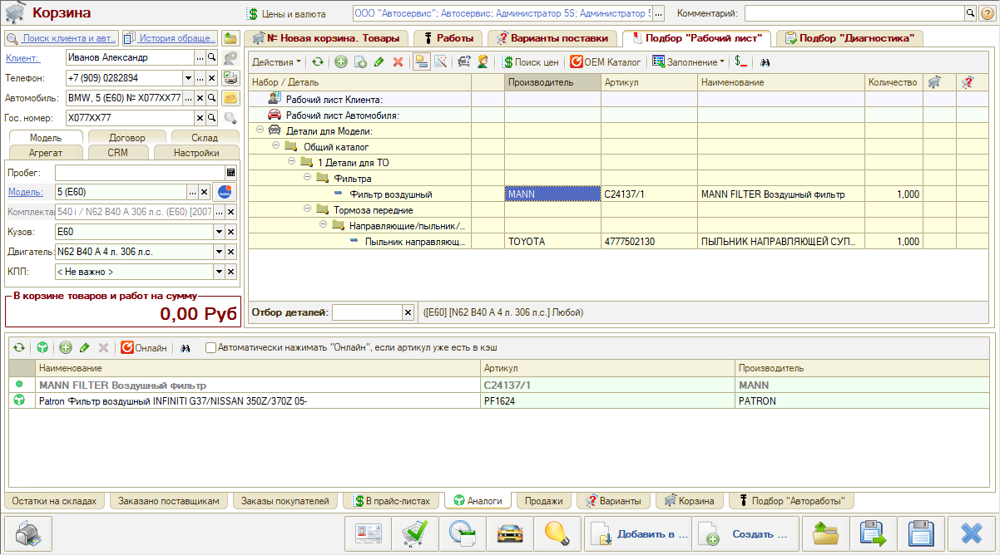

Подробнее о связи деталей с работами и работе с применяемостью см. в [статье](../Работа%20с%20применяемостью/rabota-s-primenyaemostyu.md#связь-деталей-и-работ).

Важно заполнять данные применяемости сразу корректно – для этого предусмотрено ограничение доступа к заполнению применяемости для неквалифицированных пользователей (см. [ниже](#4-настройка-ролей-пользователя)).

## Добавление применяемости через заказ-наряд

### 1. Создание заказ-наряда в сделке

При создании в Лиде или Сделке заказ-наряда следует:

**1.** Выбрать или создать контрагента;

**2.** Расшифровать автомобиль:

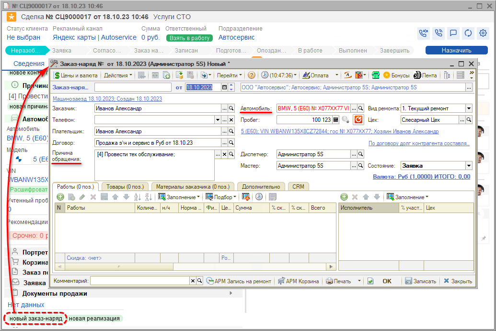

Если автомобиль в документе выделен красным шрифтом – значит, добавление применяемости не будет работать. Сначала следует расшифровать автомобиль: см. статью *[Расшифровка автомобиля по VIN](../../../Автосервис/Расшифровка%20автомобиля%20по%20VIN/rasshifrovka-avtomobilya-po-vin.md).*

После расшифровки выделение красным цветом автомобиля исчезает, и можно работать с применяемостью.

### 2. Добавление авторабот в заказ-наряд

Работы в создаваемый заказ-наряд подтягиваются автоматически из Заявки на ремонт либо добавляются вручную стандартными способами (см. видеоурок "[Как добавить работы в заказ-наряд](../../../Автосервис/Работа%20с%20Заказ-нарядами/Как%20добавить%20работы%20в%20Заказ-наряд/kak-dobavit-raboty-v-zakaz-naryad.md)"):

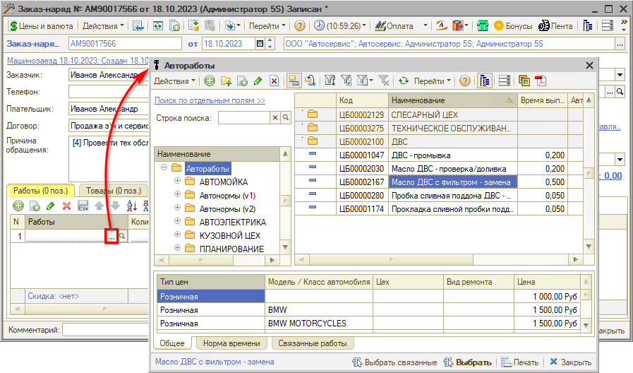

В таблице "Работы" отображается столбец "Деталь применяемости":

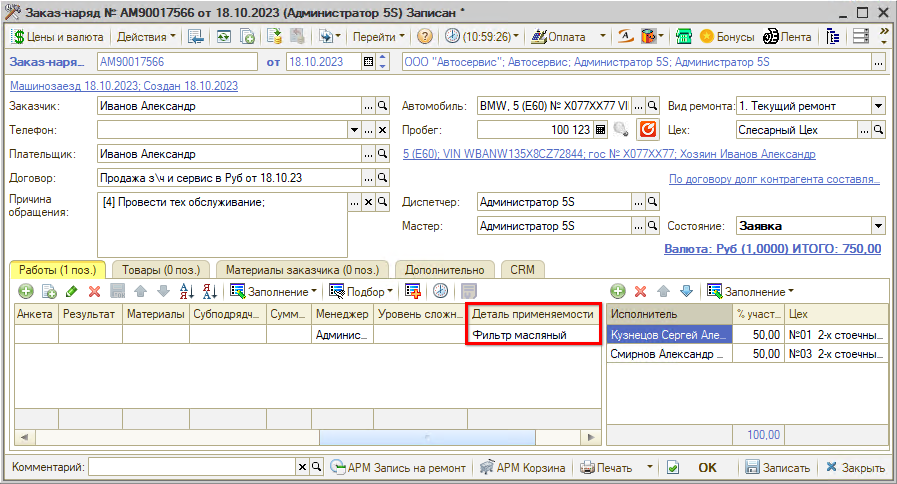

Чтобы данный столбец отображался, предварительно в настройке вида ремонта должна быть установлена галочка "Контролировать детали применяемости" (см. раздел "[Настройка вида ремонта](#2-настройка-вида-ремонта)").

Чтобы деталь применяемости автоматически подтягивалась в таблицу, автоработы должны быть связаны с деталями применяемости (см. раздел "[Установка связи авторабот с деталями применяемости](#3-установка-связи-авторабот-с-деталями-применяемости)").

Кнопка "Выбор" в столбце "Детали применяемости" открывает перечень деталей, связанных с причиной обращения (см. раздел "[Привязка деталей применяемости к причинам обращения](#1-привязка-деталей-применяемости-к-причинам-обращения)"):

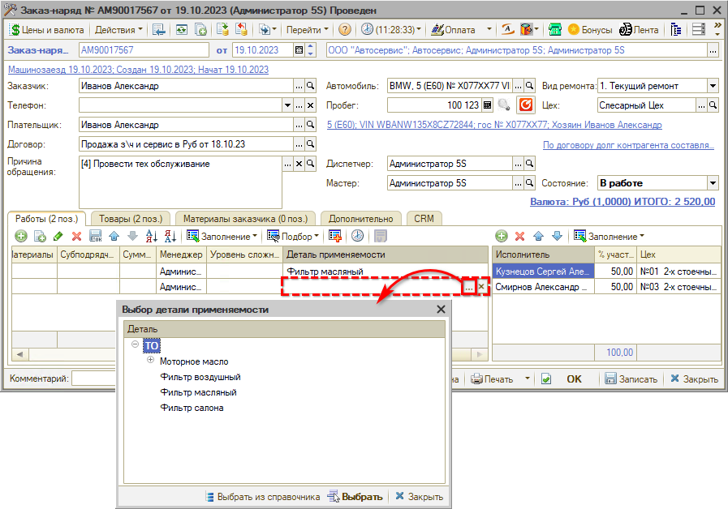

Можно выбрать нужную деталь вручную и установить ее связь с текущей автоработой.

### 3. Добавление товаров в заказ-наряд

Добавление товаров в заказ-наряд также производится стандартными способами на вкладке "Товары" из справочника "Номенклатура" (см. видеоурок "[Как добавить детали в Заказ-наряд](../../../Автосервис/Работа%20с%20Заказ-нарядами/Как%20добавить%20детали%20в%20Заказ-наряд/kak-dobavit-detali-v-zakaz-naryad.md)"):

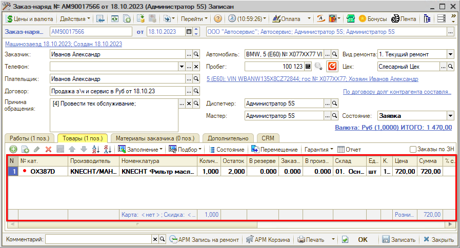

В таблицу подтягивается деталь применяемости и связанная работа:

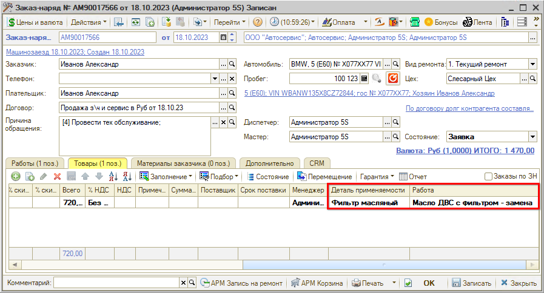

Программа "угадывает" деталь за счет того, что в детали применяемости указана группа номенклатуры, в которой содержится данная деталь.

Если значение стерлось, например, при добавлении новой работы или причины обращения либо удалили вручную, можно воспользоваться кнопкой *"Обновить детали применяемости":*

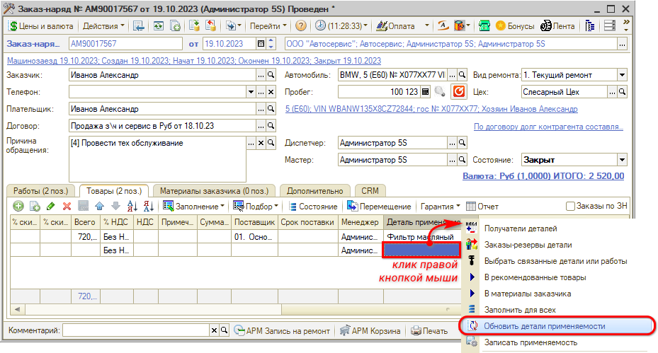

Если связь деталей применяемости с номенклатурой установлена, то деталь подтянется в таблицу.

Если деталь не добавилась автоматически, можно добавить нужную деталь вручную – аналогично действиям в таблице "Работы" (см. [выше](#vyborsvyazdetaley)).

#### Цветовое обозначение деталей применяемости

Цветовое обозначение деталей применяемости появляется только после расшифровки автомобиля.

Номенклатура обозначается одним из символов:

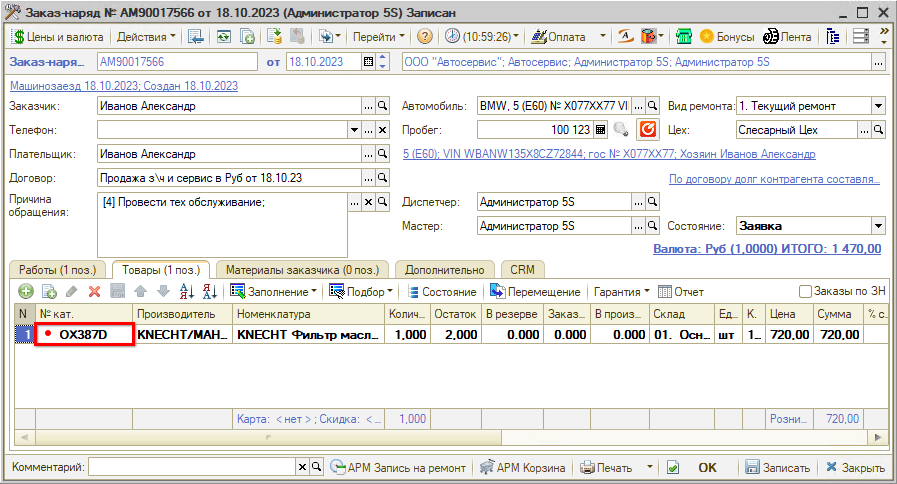

1. *Точка* – это основная деталь применяемости:

    – *нет данных о детали применяемости,* т.е. это первая деталь, которую можно добавить в применяемость для данного наименования детали – по умолчанию она установится как *основная,* после записи станет желтого цвета;  
    – *основная* деталь применяемости, добавленная *этим заказ-нарядом;*  
    – *основная* деталь применяемости, добавленная *другим заказ-нарядом.*
2. *Аналог* – все аналоги, добавленные *в дополнение* к основной детали:

    – в применяемости указана другая запчасть в качестве основной, текущую деталь *можно добавить* в аналоги;  
    – *аналог* детали применяемости, добавленный *этим заказ-нарядом;*  
    – *аналог* детали применяемости, добавленный *другим заказ-нарядом:*

   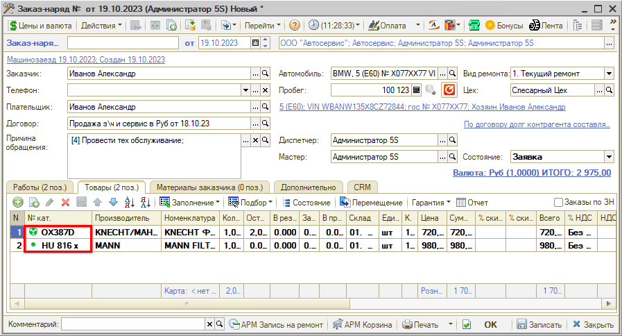

   Цвета:

   - *красный* – означает отсутствие информации о применяемости данной детали к данной модели автомобиля, т.е. деталь не добавлена в применяемость;
   - *желтый* – означает, что деталь записана в применяемость в рамках текущего заказ-наряда; при проведении и закрытии документа также останется желтым в нем, при повторном выборе в последующих заказ-нарядах будет выделена зеленым;
   - *зеленый* – означает, что деталь добавлена в применяемость к этой модели автомобиля ранее, в другом заказ-наряде.
3.  – аналог, который был добавлен в применяемость, а затем *удален как ошибочный.* Т.е. это деталь, которая не подходит в применяемость для данной модели – при попытке снова добавить ее в аналоги программа не позволит этого сделать и выдаст предупреждение: подробнее см. [ниже](#6-удаление-артикула-из-группы-аналогов).

### 4. Сохранение детали в применяемость

#### Сохранение основной детали

Для того, чтобы сохранить деталь из заказ-наряда в применяемость, необходимо кликнуть по ней правой кнопкой мыши и нажать в выпадающем меню кнопку "Записать применяемость":

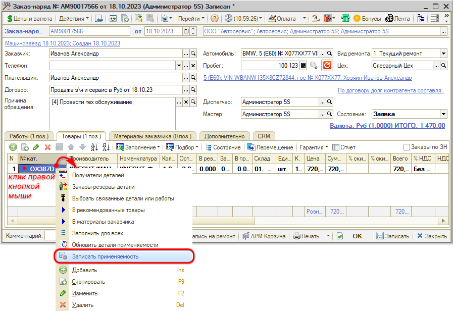

Программа предложит выбрать сторону установки – выбрать при необходимости или указать "Не требуется":

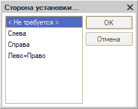

Открывается окно добавления применяемости:

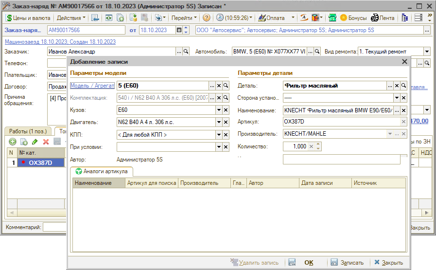

В нижней части формы находится таблица аналогов данной детали – если аналоги для данной детали не записаны, таблица будет пустой.

Можно изменить параметры автомобиля для добавления применяемости, например, установить применяемость для любого кузова и т.д., и нажать "ОК" для записи применяемости.

После добавления текущей детали в применяемость красный значок у номенклатуры становится желтыми, т.к. запись добавлена этим заказ-нарядом:

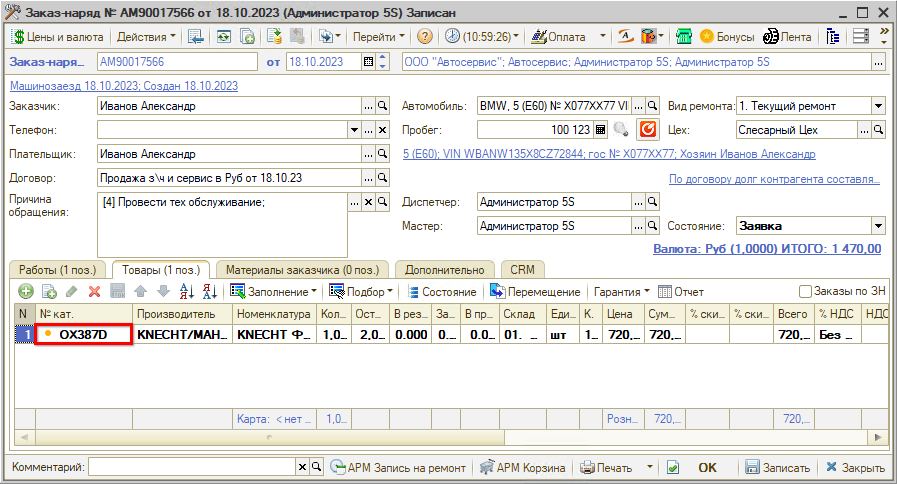

#### Добавление аналога

Для добавления аналога из заказ-наряда также следует кликнуть по нему правой кнопкой мыши и нажать в выпадающем меню кнопку "Записать применяемость":

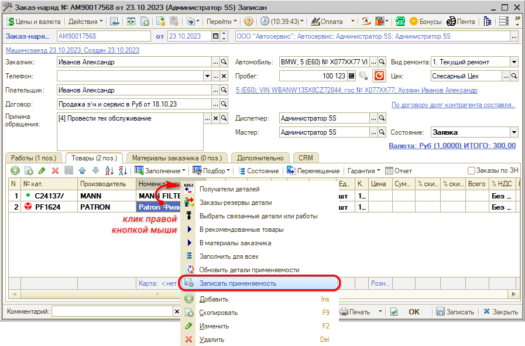

Открывается окно добавления применяемости по *основной,* ранее добавленной в применяемость детали. В нижней части формы находится таблица со всеми ранее добавленными аналогами основной детали:

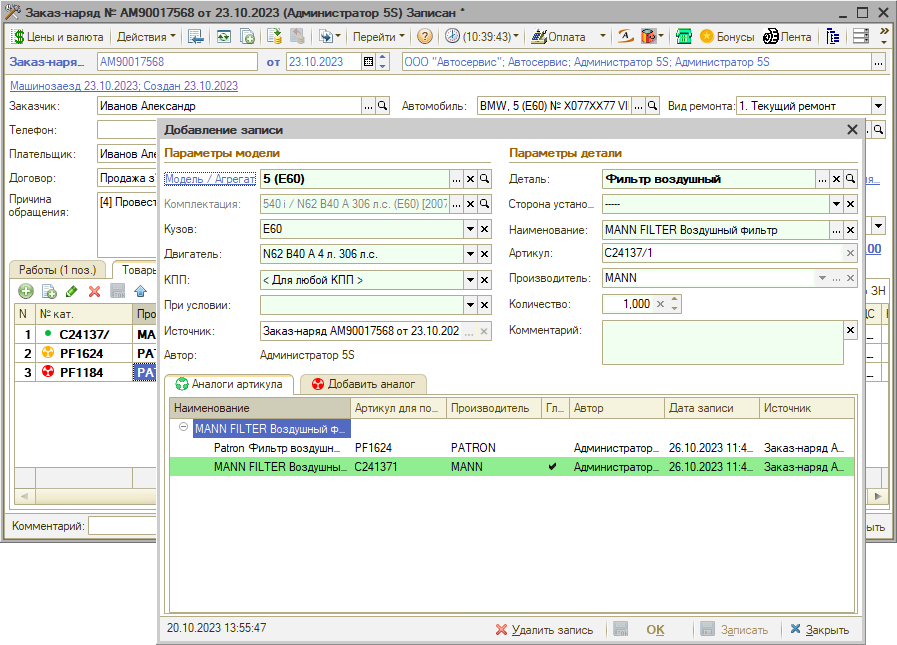

В таблице отображаются наименование, артикул, производитель, а также источник, дата и автор добавления записи. В столбце "Главный по группе" отмечена галочкой главная деталь в группе аналогов.

Основная деталь применяемости подсвечивается зеленым цветом.

*Примечание:* Основная деталь применяемости может не быть главной в группе аналогов. Главная деталь по группе аналогов – это деталь, которая используется в заказе поставщику при автоматическом расчете заказа на пополнении склада; а основная деталь применяемости – это наиболее подходящая деталь по версии автосервиса. Это не всегда одна и та же деталь.

Одна деталь может быть в нескольких группах аналогов. Текущий аналог, в контексте которого открыто окно добавления применяемости, подсвечивается желтым цветом. При необходимости можно перенести аналог в другую группу либо объединить группы аналогов:

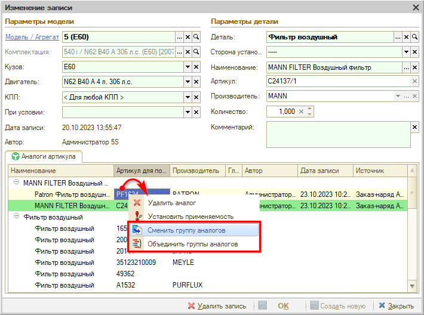

Для сохранения текущей детали в аналоги нужно перейти на вкладку "Аналоги" и нажать кнопку "Добавить в аналоги":

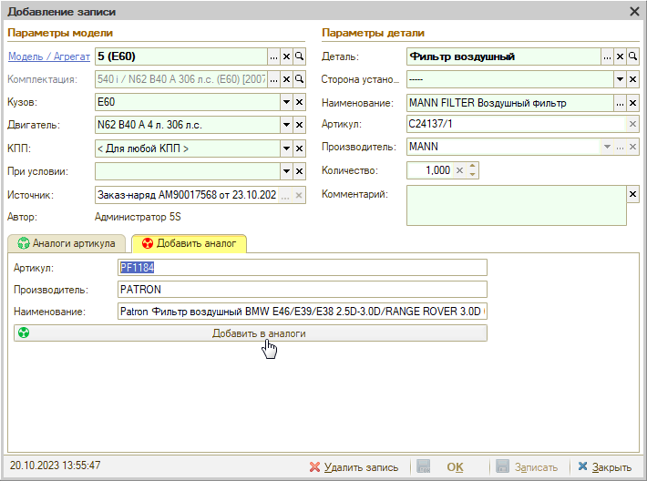

После этого вкладка добавления аналога закрывается и происходит автоматический переход на первую вкладку "Аналоги артикула", где появляется добавленный аналог с выделением желтым цветом:

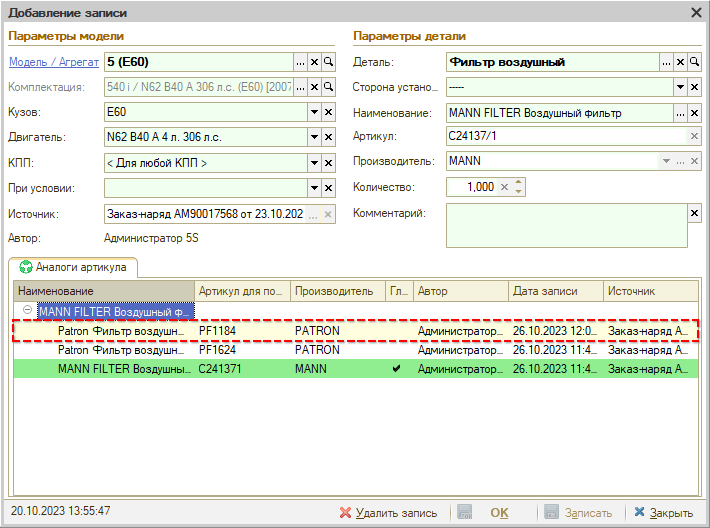

Теперь окно добавления применяемости можно закрыть. В заказ-наряде красный значок у номенклатуры становится желтым, т.к. запись добавлена этим заказ-нарядом:

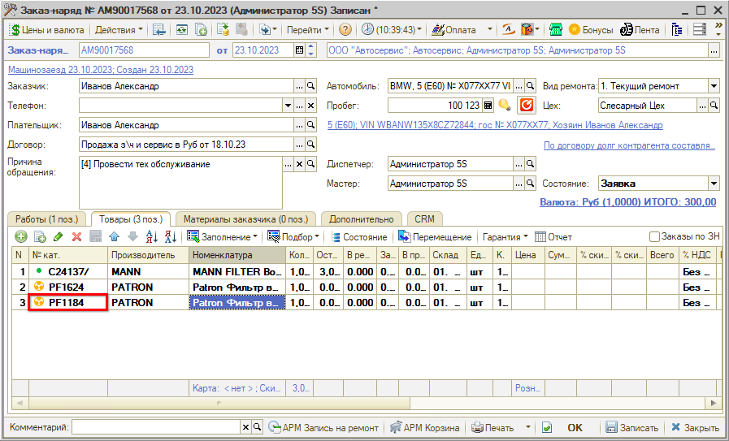

### 5. Изменение основной детали

Первая деталь в применяемость добавляется как основная, последующие – как аналоги, с соответствующими обозначениями. В качестве основной детали впоследствии можно будет выбрать другую, более подходящую.

Для этого следует в товарах заказ-наряда кликнуть правой кнопкой мыши по строке с аналогом, который нужно сделать основным, и перейти в окно добавления применяемости.

В списке аналогов строка с текущей деталью выделена желтой подсветкой – по ней также нужно кликнуть правой кнопкой мыши и нажать в выпадающем меню кнопку "Установить применяемость":

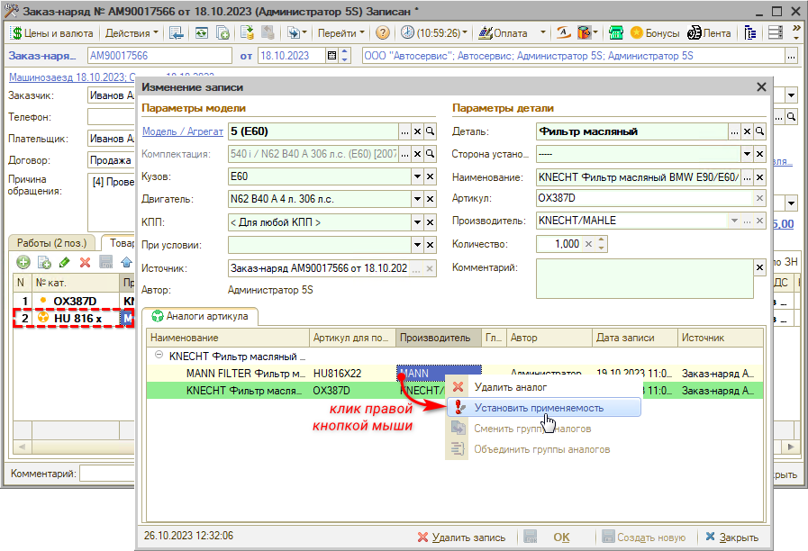

Затем на нижней панели окна изменения записи о применяемости нужно нажать кнопку "Изменить запись":

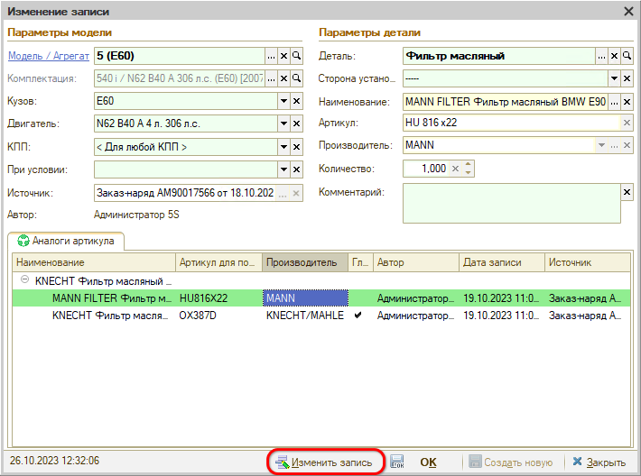

При этом значок у детали меняется с аналога на основную и становится желтым, т.к. изменили применяемость из текущего заказ-наряда.

*Примечание:* Можно предварительно заполнить оригинальные номера всех основных деталей применяемости из внешних каталогов, например, Laximo, а потом все последующие детали добавлять в аналоги.

### 6. Удаление артикула из группы аналогов

В случае ошибочно добавленной в применяемость детали можно удалить запись.

Для этого следует в окне изменения записи (см. выше [Изменение основной детали](#5-изменение-основной-детали)) нажать кнопку "Удалить аналог":

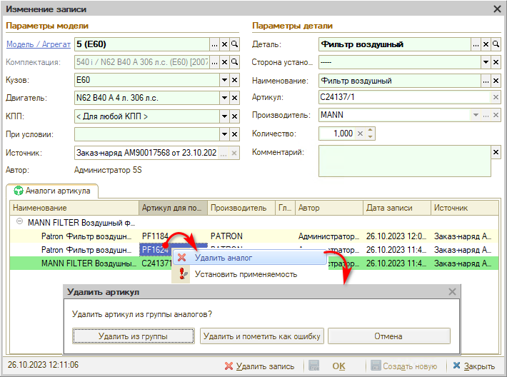

При этом программа задает уточняющий вопрос, как именно следует удалить аналог:

- *Удалить из группы* – при нажатии кнопки аналог просто будет удален из данной группы аналогов, значок у номенклатуры станет красным;
- *Удалить и пометить как ошибку* – вариант для удаления детали, которая точно не подходит в применяемость для данной модели. Удавленный из применяемости аналог будет отмечен в заказ-наряде знаком .

При последующем добавлении данной детали в заказ-наряд для такой же модели автомобиля она будет помечена этим же запрещающим значком. Снова добавить эту деталь в применяемость к этому автомобилю будет запрещено – программа выдаст предупреждение:

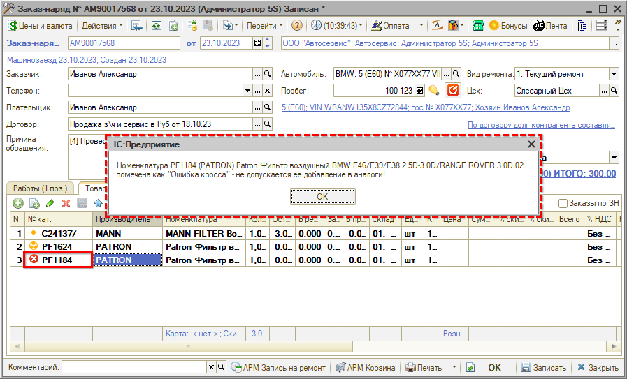

Также можно удалить саму запись применяемости *основной детали* со всеми ее аналогами к этой модели автомобиля – для этого нужно нажать кнопку на нижней панели "Удалить запись":

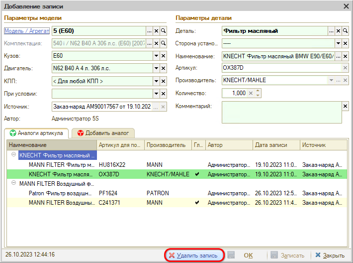

## Отчет "Новые детали применяемости"

Для отслеживания добавленных записей по применяемости в программе реализован отчет "Новые детали применяемости". В отчете можно отследить, какие детали применяемости были добавлены в заказ-наряды:

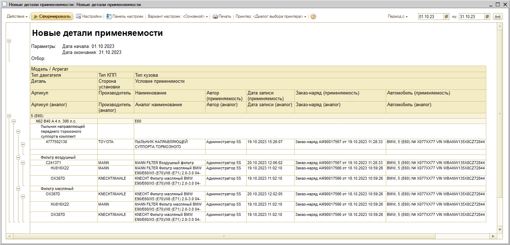

Есть возможность открыть из отчета любой заказ-наряд и отменить ошибочное добавление детали.

## Предварительные настройки

### 1. Привязка деталей применяемости к причинам обращения

При создании в CRM нового Лида в него подтягивается либо вводится вручную причина обращения.

В карточке каждой причины обращения привязываются наименования деталей применяемости, необходимых для проведения ремонта или обслуживания по выбранной причине обращения. Например, для технического обслуживания:

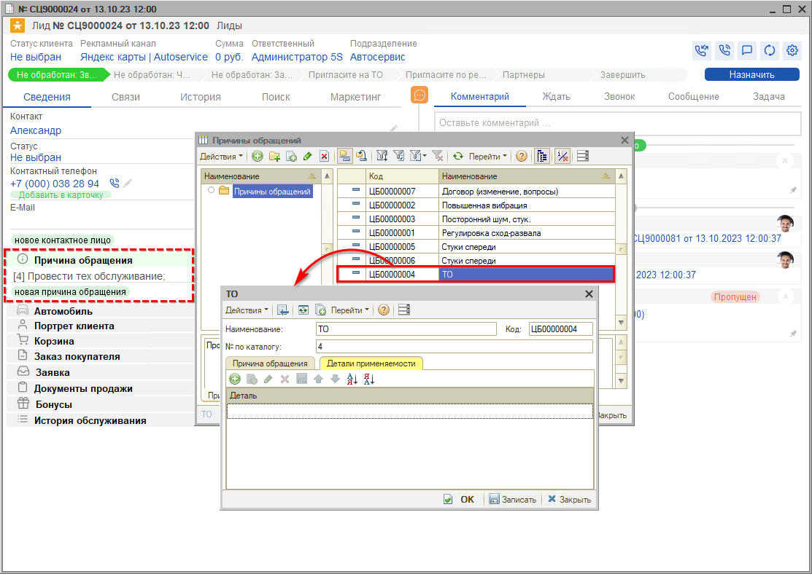

Справочник "Детали применяемости" содержит каталог запчастей с группировкой по узлам машины:

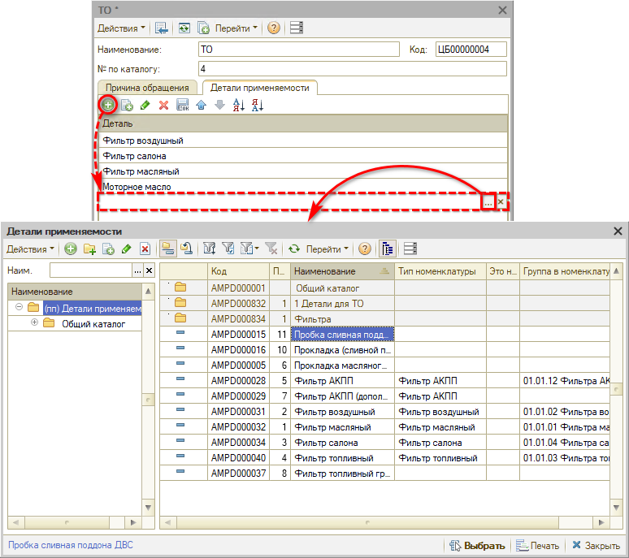

Можно добавлять отдельные детали либо группы деталей. После добавления всех необходимых деталей необходимо записать изменения в карточке причины обращения.

### 2. Настройка вида ремонта

В параметрах [вида ремонта](../../../Автосервис/Виды%20ремонта/vidy-remonta.md#дополнительные-реквизиты) должна быть установлена галочка "Контролировать детали применяемости":

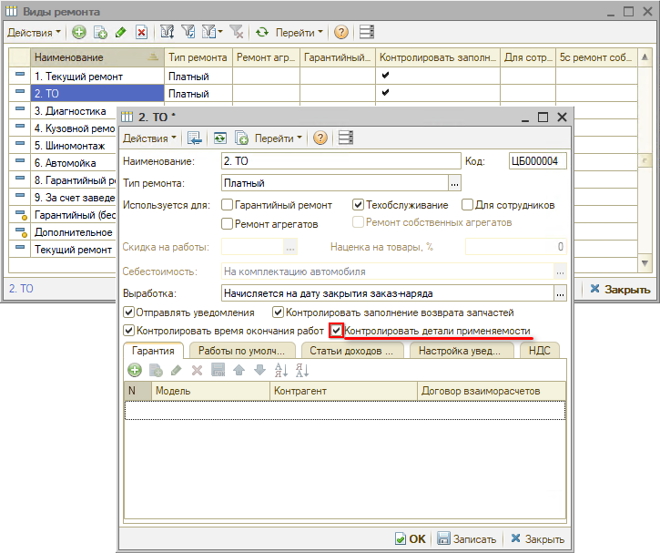

Установка данного параметра нужна для того, чтобы в заказ-наряде в таблице отображалась колонка "Деталь применяемости" – *см. раздел "[Добавление авторабот в заказ-наряд](#2-добавление-авторабот-в-заказ-наряд)".*

Можно устанавливать параметр не для всех видов ремонта – по некоторым видам ремонта контролировать заполнение применяемости не требуется.

### 3. Установка связи авторабот с деталями применяемости

Чтобы деталь применяемости подтягивалась в таблицу автоматически, автоработы должны быть связаны с деталями применяемости. Можно установить соответствие *группы* работ с *группой* деталей применяемости:

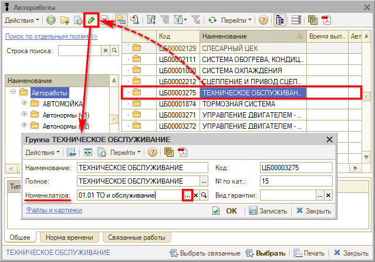

В карточке автоработы на вкладке "Связи → Связи с деталями" отражены связи с деталями применяемости:

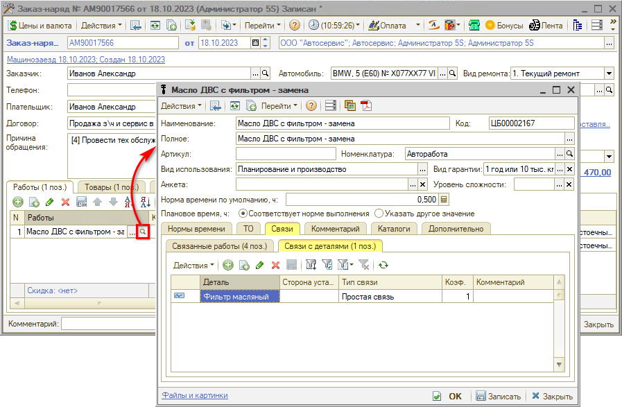

Если в данной таблице нет записей, то после добавления в заказ-наряде применяемости, а также *закрытия и проведения* данного заказ-наряда деталь сюда запишется автоматически.

Также можно добавить связи вручную.

### 4. Настройка ролей пользователя

Право записывать детали в применяемость дают следующие [роли пользователя](https://www.5systems.ru/help/roli-polzovateley) – "Редактирование применяемости запчастей" и "Редактирование аналогов":

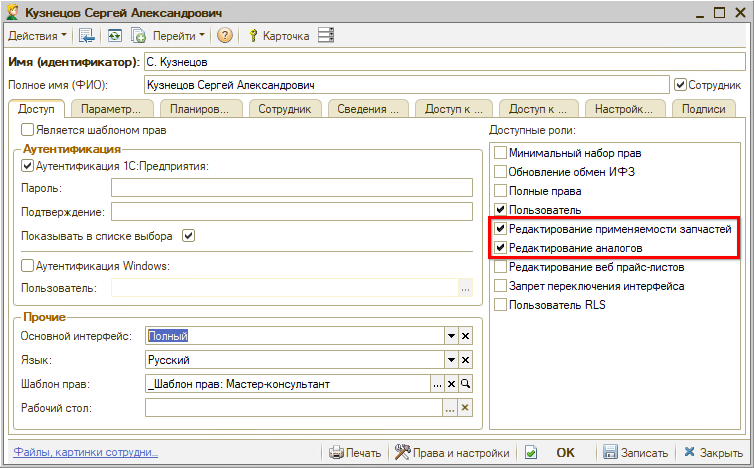

Для пользователей, которые являются неквалифицированными в данном вопросе либо непрофильными специалистами, рекомендуется снимать эти галочки, т.е. запретить им записывать детали в применяемость, т.к. может быть много ошибок.

---

**Теги:** Применяемость, Работа с Заказ-нарядом, автозаполнение применяемости, аналоги, детали применяемости, причина обращения, роли пользователя

