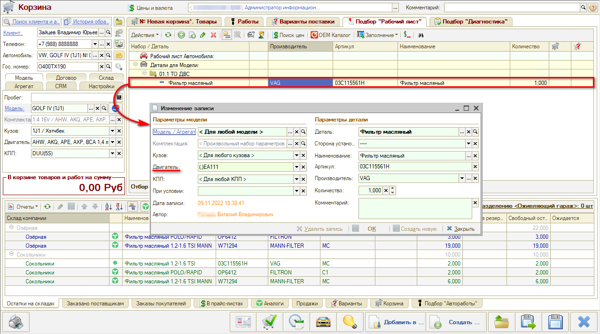
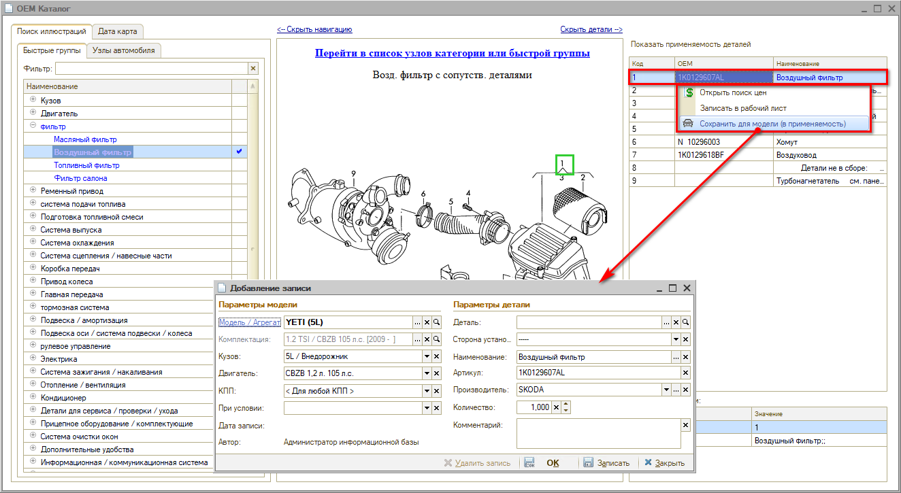
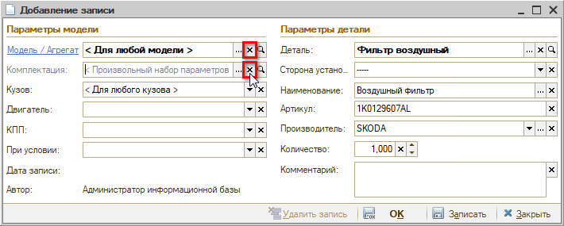
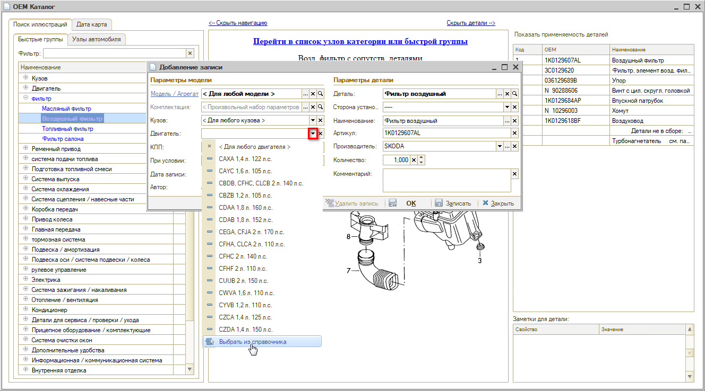
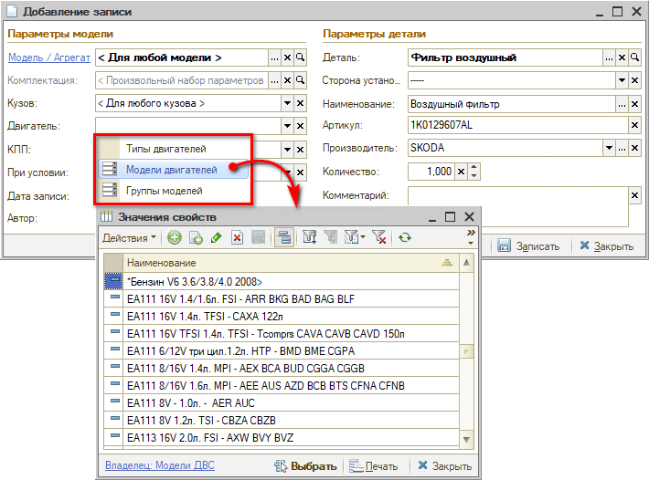
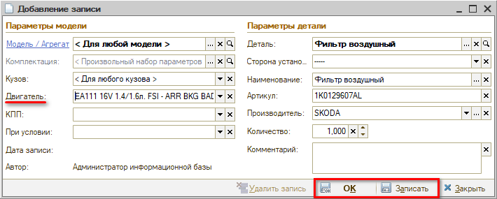
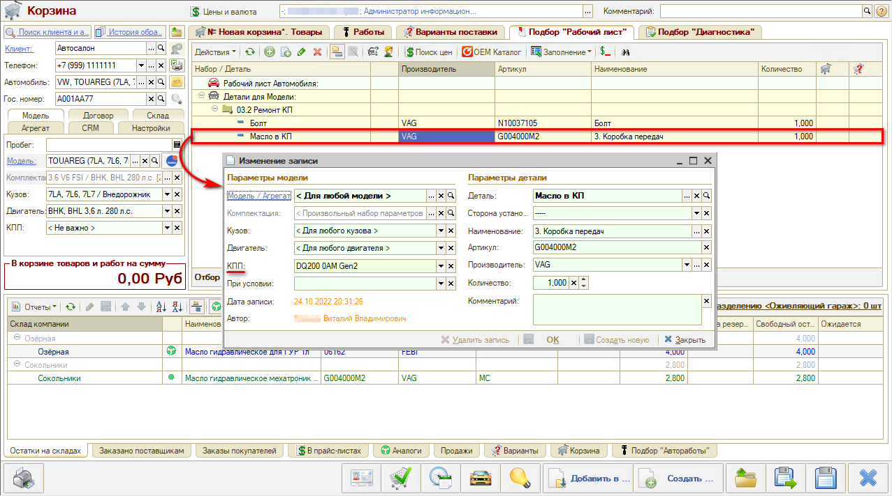

# Применяемость по типу двигателя и типу КПП

<table><tr><td><b>Время чтения:</b> 7 мин.</td><td><b>Обновлено:</b> 30.11.2022</td></tr></table>

Источник: https://www.5systems.ru/help/primenyaemost-po-tipu-dvigatelya-i-tipu-kpp

> *Функционал доступен с релиза 2.3.1.1.*

## Содержание

- [Введение](#введение)
- [Работа с применяемостью по типу двигателя и типу КПП](#работа-с-применяемостью-по-типу-двигателя-и-типу-кпп)
- [Добавление применяемости](#добавление-применяемости)
  - [Добавление применяемости по Типу двигателя](#добавление-применяемости-по-типу-двигателя)
  - [Добавление применяемости по Типу КПП](#добавление-применяемости-по-типу-кпп)

## Введение

О работе с применяемость см. основную статью: *[Работа с применяемостью](../Работа%20с%20применяемостью/rabota-s-primenyaemostyu.md)*.

Применяемость деталей может быть задана по разным параметрам: по модели автомобиля, по комплектации, по типу кузова, двигателя, КПП.

Для классификации и объединения однотипных моделей двигателей и КПП в систему введены понятия "Модель двигателя" и "Группа моделей двигателя", "Модель КПП" и "Группа моделей КПП".

Справочники "Типы двигателей" и "Типы КПП" привязаны к марке и модели автомобиля, но некоторые модели разных марок являются одинаковыми по конструкции и параметрам, и деталь подходит обеим моделям, независимо от марки (например, KIA и Hyundai, Citroën и Peugeot, ŠKODA и Volkswagen). Поэтому бывает целесообразно для подбора запчастей объединить типы двигателей или КПП в одну "модель".

Процесс *установки моделей двигателей и КПП как свойств* объектов описан в статье *[Модели двигателей и КПП](../../Автосервис/Модели%20двигателей%20и%20КПП/modeli-dvigateley-i-kpp.md)*.

## Работа с применяемостью по типу двигателя и типу КПП

Если задана применяемость деталей по типу двигателя или типу КПП, они будут выведены в "Подборе Рабочий лист" Корзины:

Применяемость в Корзине выводится согласно следующим заложенным в программе *приоритетам:*

1. По Модели автомобиля;
2. По Комплектации;
3. По Кузову;
4. По двигателю:
   1. По Типу двигателя;
   2. По Модели двигателя;
   3. По Группе моделей двигателя;
5. По КПП:
   1. По Типу КПП;
   2. По Модели КПП;
   3. По Группе моделей КПП.

То есть, если задана применяемость на группу моделей, на модель и на тип двигателя, то выводиться в Корзине будет самая точная применяемость – на тип двигателя. Если помимо этого задана применяемость по модели автомобиля, то выводиться будет данная применяемость как самая точная.

## Добавление применяемости

### Добавление применяемости по Типу двигателя

При добавлении детали в применяемость открывается окно "Добавление записи":

Необходимо задать нужные критерии: параметры модели автомобиля, для которой подходит деталь, и параметры детали – наименование, артикул, производитель и др.

Для установки применяемости по типу двигателя значение в полях "Модель" и "Комплектация" следует удалить:

Далее следует в поле выбора двигателя в выпадающем списке нажать кнопку "Выбрать из справочника":

В открывшемся контекстном меню выбрать один из заранее заполненных справочников – *Типы двигателей*, *Модели двигателей* либо *Группы моделей*:

Выбрать нужный *тип*, *модель* или *группу* моделей двигателей и записать применяемость:

### Добавление применяемости по Типу КПП

Применяемость к типу КПП задается аналогично:

---

**Теги:** Применяемость, тип двигателя, тип КПП, модель двигателя, группа моделей, приоритеты применяемости, Корзина

