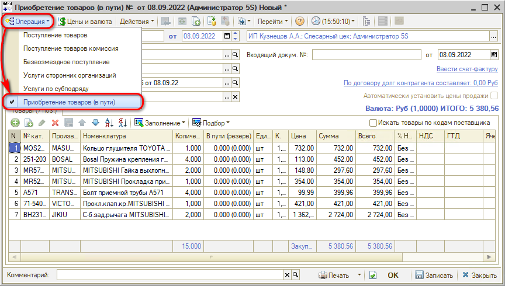
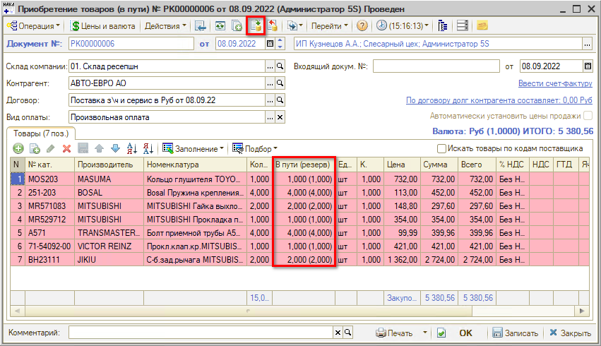
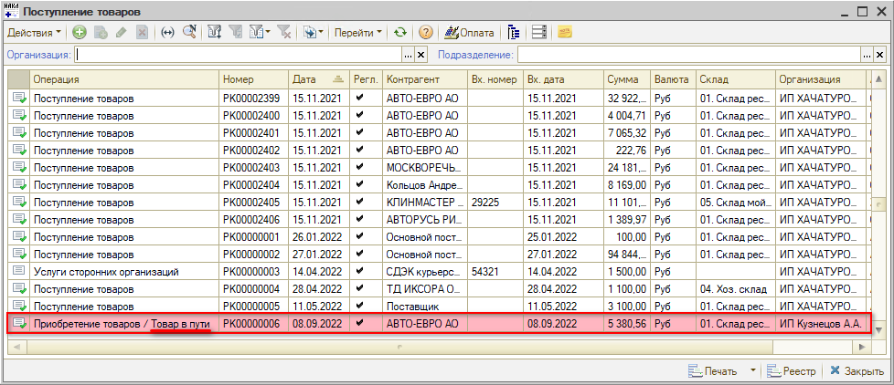
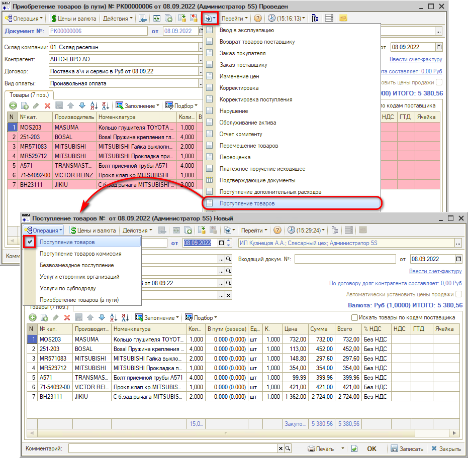
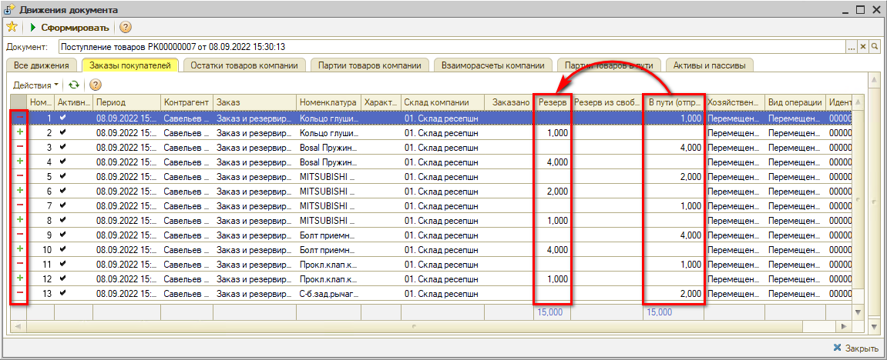
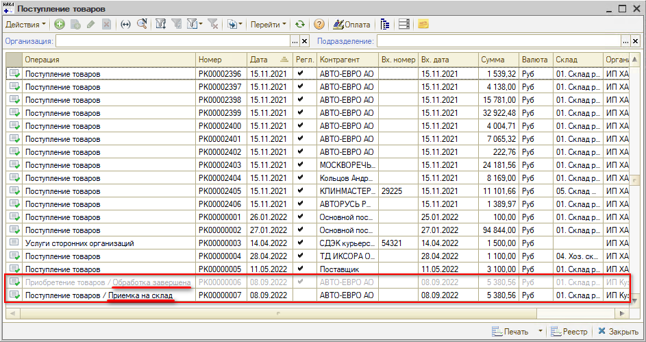
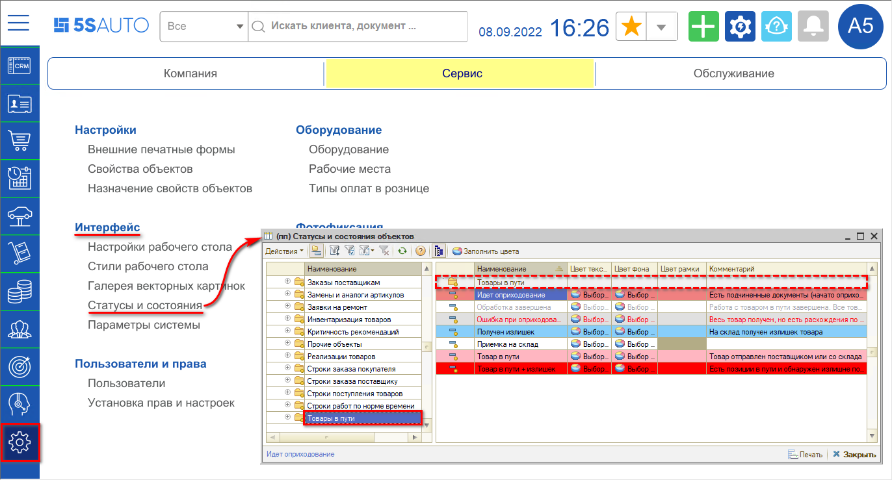
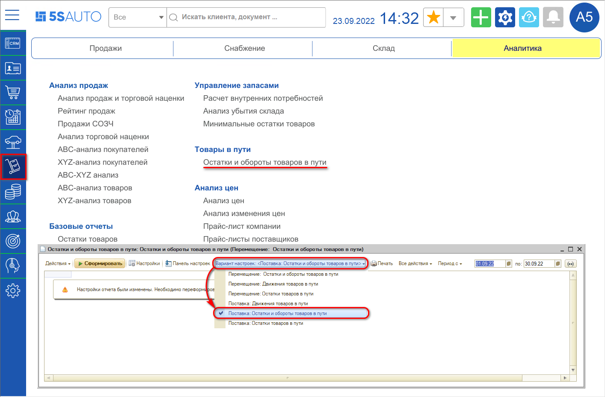
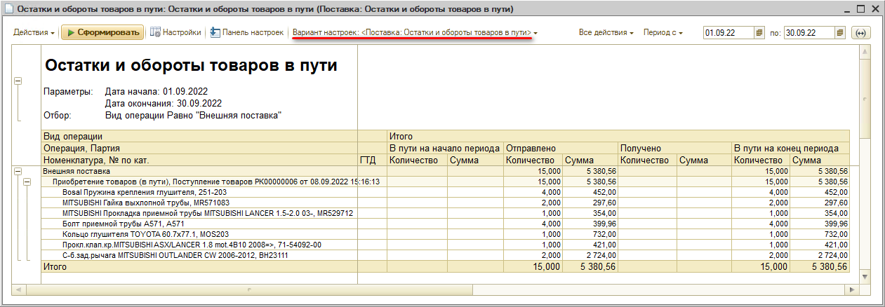
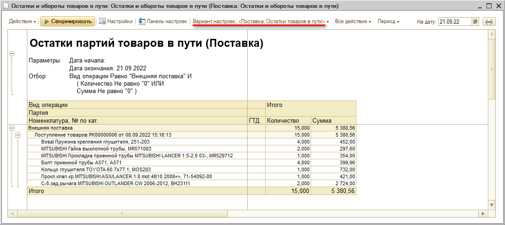

# Приобретение товаров (в пути)

<table><tr><td><b>Время чтения:</b> 8 мин.</td><td><b>Обновлено:</b> 21.09.2022</td></tr></table>

Источник: https://www.5systems.ru/help/priobretenie-tovarov-v-puti

> *Функционал доступен начиная с релиза 2.2.7.2.*

## Содержание

- [Введение](#введение)
- [Документ "Приобретение товаров (в пути)"](#документ-приобретение-товаров-в-пути)
- [Отчеты для отслеживания товаров в пути](#отчеты-для-отслеживания-товаров-в-пути)

## Введение

При заказе запчастей бывают ситуации, когда расчетные документы, отражающие переход права собственности на товары, уже поступили от поставщика, но сами заказанные товары еще находятся в пути. С целью учета в программе *товара в пути* используется документ ***"Приобретение товаров (в пути)"***. Период между переходом права собственности на товары и их фактическим поступлением на склад может длиться несколько дней или месяцев.

## Документ "Приобретение товаров (в пути)"

Документ *"Приобретение товаров (в пути)"* создается, как правило, на основании *Заказа поставщику*. В создаваемом документе необходимо выбрать хозяйственную операцию "Приобретение товаров (в пути)":

При создании на основании *Заказа и резервирования покупателя* документ *"Приобретение товаров (в пути)"* автоматически заполняется товарами – нужно проверить данные и провести документ. При проведении товары резервируются под покупателя (в колонке *"В пути (резерв)"* отображается количество товаров):

В реестре документов "Поступление товаров" созданный документ отображается с припиской *"Приобретение товаров / Товар в пути"*:

При поступлении товаров требуется на основании "Приобретения товаров (в пути)" создать документ "Поступление товаров":

При *проведении* данного документа товары снимаются с резерва партий "в пути" и резервируются на склад (см. *Перейти → Движения документа*):

Также при проведении "Поступления товаров" меняется отображение хоз. операций в реестре документов:

1. документ "Приобретение товаров" становится серого цвета, приписка "Товар в пути" изменяется на *"Обработка завершена"*;
2. у документа "Поступление товаров" появляется приписка *"Приемка на склад"*:

Цвета статусов можно настроить по своему усмотрению – это можно сделать в справочнике "Статусы и состояния" (*Администрирование → Сервис → Интерфейс → Статусы и состояния*), группа "Товары в пути":

## Отчеты для отслеживания товаров в пути

Для отслеживания товара, находящегося в пути, используется отчет *"Остатки и обороты товаров в пути"*, вариант настройки *"Поставка: Остатки и обороты товаров в пути"*. Отчет находится в меню интерфейса *Запчасти и склад → Аналитика → Товары в пути → Остатки и обороты товаров в пути*\*:

*\*Примечание: В случае если данного пункта меню нет на рабочем столе, можно добавить его вручную – см. статью "[Настройка рабочего стола](https://www.5systems.ru/help/nastroyka-rabochego-stola#nastrrazdelov)".*

Пример сформированного отчета:

После фактического поступления товаров и проведения документа "Поступление товаров" значения из столбца "В пути на конец периода" перейдут в столбец "Получено". Расхождения в количестве ожидаемого и поступившего товара сразу отобразятся в отчете.

Для просмотра количества товаров в пути на определенную дату используется этот же отчет с вариантом настройки *"Поставка: Остатки товаров в пути"*:

---

**Теги:** Складской учет, приобретение товаров, товар в пути, поступление товаров, заказ поставщику, резерв, статусы и состояния

