

# Работа с приложением 5S TSD

<table><tr><td><b>Время чтения:</b> 20 мин.</td><td><b>Обновлено:</b> 18.02.2026</td></tr></table>

Источник: https://www.5systems.ru/help/rabota-s-prilozheniem-5s-tsd

> *Функционал доступен начиная с релиза 5S AUTO 2.8.3*

## Содержание

1. [Введение](#введение)
2. [Первый запуск и установка](#первый-запуск-и-установка)
3. [Работа с 5S TSD](#работа-с-5s-tsd)
   - [Главное меню](#главное-меню)
   - [Принцип работы с документами](#принцип-работы-с-документами)
   - [Поиск документа](#поиск-документа)
   - [Блоки работы с 5S TSD](#блоки-работы-с-5s-tsd)
     - [1. Приемка товаров](#1-приемка-товаров)
     - [2. Выдача товара](#2-выдача-товара)
     - [3. Инвентаризация](#3-инвентаризация)
     - [4. Перемещение](#4-перемещение)
     - [5. Поиск остатков товаров на складах](#5-поиск-остатков-товаров-на-складах)
   - [Присвоение штрихкодов](#присвоение-штрихкодов)
4. [Взаимодействие с программой](#взаимодействие-с-программой)
   - [1. Состояния приема-выдачи товара](#1-состояния-приема-выдачи-товара)
   - [2. Отбор по состояниям](#2-отбор-по-состояниям)
   - [3. Контроль сканирования](#3-контроль-сканирования)
5. [Настройка](#настройка)
   - [1. Требования к оборудованию](#1-требования-к-оборудованию)
   - [2. Настройки в программе](#2-настройки-в-программе)
   - [3. Настройки в 5S TSD](#3-настройки-в-5s-tsd)

## Введение

***5S TSD*** – это вспомогательное приложение для пользователей программы 5S AUTO, предназначенное для автоматизации складских операций. Приложение позволяет работать со штрихкодами и [маркировкой "Честный Знак"](https://www.5systems.ru/help/markirovka-tovarov), минимизируя ручной ввод данных и снижая риск ошибок учета.

Главная задача *терминала сбора данных* – это подсчет товаров по штрихкоду: пользователь сканирует терминалом штрихкоды и маркировки на номенклатуре, и эта информация передается в программу.

***Основные функции TSD:***

- оформление поступлений от поставщиков, сверка с накладными;
- отслеживание недовоза товаров;
- контроль выдачи товаров по заказам и в производство;
- быстрый подсчет остатков путем сканирования;
- учет товаров при переводах между складами;
- просмотр актуальных складских остатков по штрихкоду или артикулу;
- ввод в программу кодов DataMatrix и их проверка на всех этапах учета.

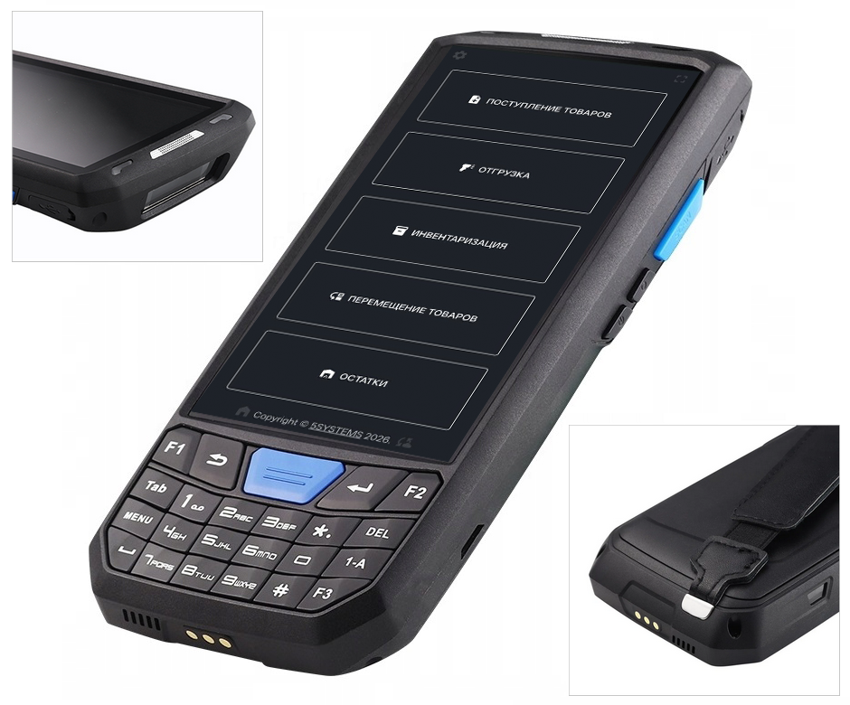

Для работы с приложением 5S TSD требуется 2D-сканер штрихкодов (обязательна поддержка DataMatrix для работы с маркировкой).
Приложение может быть установлено сотрудникам склада двумя способами:

**1)** на любое специализированное устройство сбора данных (ТСД) со встроенным сканером;
**2)** на смартфон, к которому с помощью bluetooth подключен 2D-сканер.

Интерфейс приложения синхронизирован с программой 5S AUTO – происходит мгновенный обмен данными.

Приложение запускается через браузер, требуется авторизация под учетной записью [5S Cloud](https://www.5systems.ru/help/sozdanie-i-redaktirovanie-polzovateley-5s-cloud). Есть возможность установить приложение на устройство и использовать ярлык для упрощенного запуска (см. [ниже](#первый-запуск-и-установка)).

*Для работы с функционалом предварительно должны быть сделаны следующие настройки:*

**1)** подключен сканер ш/к либо ТСД;
**2)** настроена интеграция с [API 5S AUTO](https://www.5systems.ru/help/api-5s-auto);
**3)** настроен пользователь [5S Cloud](https://www.5systems.ru/help/sozdanie-i-redaktirovanie-polzovateley-5s-cloud);
**4)** настроен доступ к складам у пользователя 1С;
**5)** [интеграция с "Честным Знаком"](https://www.5systems.ru/help/nastroyka-integracii-s-chestnym-znakom) для работы с маркированными товарами.

*Также рекомендуем для изучения статьи:*

- [Интерфейс для ТСД](../Интерфейс%20для%20ТСД/interfeys-dlya-tsd.md);
- [Подключение сканера штрихкодов](../Штрихкодирование%20номенклатуры/Подключение%20сканера%20штрихкодов/podklyuchenie-skanera-shtrikhkodov.md);
- [Сканирование штрихкодов товаров](../Штрихкодирование%20номенклатуры/Сканирование%20штрихкодов/skanirovanie-shtrikhkodov-tovarov.md#сканирование-в-интерфейсе-тсд) – о механизме распознавания товаров при сканировании штрих-кодов;
- статьи в разделе "[Маркировка](https://www.5systems.ru/taxonomy/term/240)" о работе с маркированными товарами.

## Первый запуск и установка

**Шаг 1. Авторизация**

Для первого запуска приложения следует открыть в браузере на устройстве страницу [https://tsd.5systems.ru/](https://tsd.5systems.ru/). Необходимо ввести учетные данные [5S Cloud](https://www.5systems.ru/help/sozdanie-i-redaktirovanie-polzovateley-5s-cloud):

 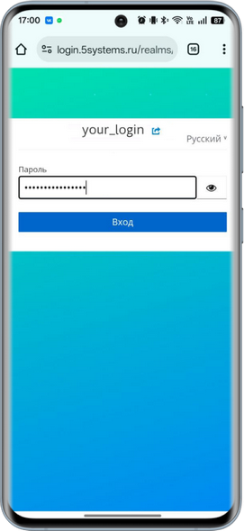

**Шаг 2. Установка ярлыка**

После входа приложение выполнит сбор данных об устройстве и предложит установить ярлык – следует нажать кнопку *"Добавить":*

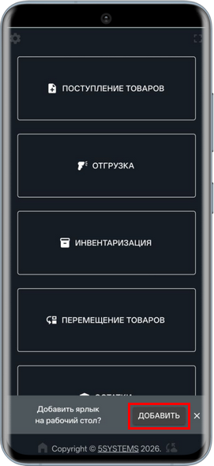

Затем подтвердить установку приложения:

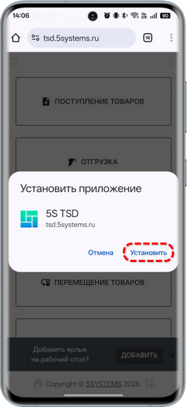

После успешной установки иконка приложения появится на рабочем столе устройства:

## Работа с 5S TSD

### Главное меню

При входе в приложение 5S TSD открывается основное меню:

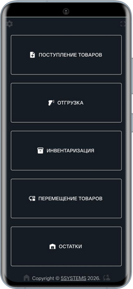

***Разделы основного меню:***

**1.** "Поступление товаров"
**2.** "Отгрузка"
**3.** "Инвентаризация"
**4.** "Перемещение товаров"
**5.** "Остатки"

### Принцип работы с документами

Сканирование товаров производится в документах:

- Поступление товаров;
- Приобретение товаров / В пути;
- Инвентаризация;
- Перемещение товаров;
- Реализация;
- Перемещение в производство;
    - а также в интерфейсе просмотра остатков товаров.

*Принцип работы с документами:*

**1)** Присутствие документа в интерфейсе приложения предполагает, что нужно его отработать, т.е. произвести с ним определенные действия. После завершения обработки документ исчезает из TSD и становится доступен для редактирования только в 5S AUTO

**2)** Предусмотрено два режима работы с документами:

- *Наполнение данными* – для непроведенных документов (состояние "Записан")
- *Проверка данных* – для проведенных документов (состояние "Проведен")

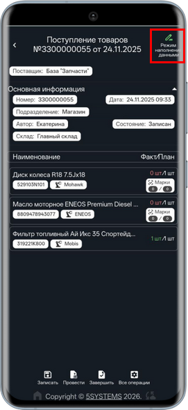 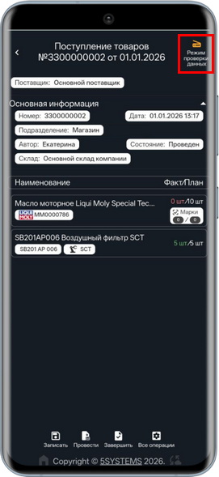

**3)** Предполагается, что база уже наполнена номенклатурой со штрихкодами и/или маркировками, но посредством ТСД можно присваивать штрихкод товару. Как правило, производится считывание штрихкода с каждой единицы товара либо можно сканировать один штрихкод по каждой номенклатурной единице и вводить количество товара вручную.

### Поиск документа

**1.** *По штрихкоду* – для поиска документа по штрихкоду следует отсканировать штрихкод нужного документа.

**2.** *По артикулу* – для ручного поиска следует ввести полностью или частично (минимум 3 цифры) номер документа в строку поиска и нажать на лупу или на кнопку подтверждения на клавиатуре устройства:

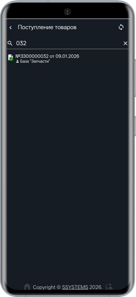

### Блоки работы с 5S TSD

#### 1. Приемка товаров

В разделе "Поступление товаров" выводятся документы, по которым требуется принять товар от поставщика.

***Возможны следующие сценарии работы с поступлениями в 5S TSD:***

**1.** *Сверка поступления с данными поставщика*
В программу загружается документ поступления от поставщика через ЭДО либо с помощью механизма [загрузки накладных](https://www.5systems.ru/help/zagruzka-nakladnykh-postavschikov) через электронную почту.
Затем путем сканирования штрихкодов производится проверка соответствия фактически поступившего товара полученным от поставщика данным.

**2.** *Ввод данных о поступившем товаре "с нуля"*
Сотрудник склада создает в 5S AUTO пустой документ "Поступление товаров" и записывает его.
Затем через приложение 5S TSD данный документ заполняется товарами путем сканирования штрихкодов или кодов маркировки.

**3.** *Проверка кодов маркировки*
В случае если в документе поставщика, загруженном через ЭДО или Email, содержатся коды маркировки, производится их сверка с фактически отсканированными через TSD маркировками и подтверждение соответствия.

**4.** *Ввод кодов маркировки*
В случае если в документе поставщика отсутствуют коды маркировки, можно ввести их в базу путем сканирования через TSD.

***Принцип вывода документов приема-выдачи***

В интерфейс приложения выводятся те документы, у которых *состояние приема-выдачи* в программе находится в значении "В работе" (см. [ниже](#1-состояния-приема-выдачи-товара)). Документы могут быть как непроведенные, так и проведенные, т.е. в статусах "Записан" или "Проведен":

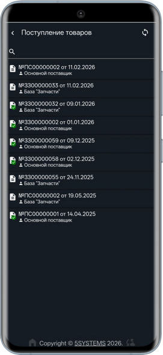

##### 1) Сверка поступления с данными поставщика

Для того, чтобы сопоставить фактически полученный товар с плановыми данными, необходимо открыть в приложении нужный документ:

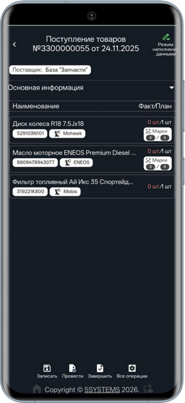

***Интерфейс документа***

Можно развернуть информацию по документу – система сохранит настройку для данного пользователя, и в дальнейшем все документы будут по умолчанию открываться с развернутым блоком "Основная информация":

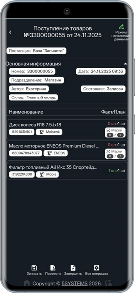

***Соответствие "Факт/План"***

В документе отражено наименование товара и количество – плановое и фактическое:

- *План* – ожидаемое количество товара по документу
- *Факт* – отсканированное в текущем документе в TSD

В новом документе значение "Факт" = 0 шт. При сканировании товаров добавляется количество в колонку "Факт".

*Примечание:* В случае если сканируемого товара не было в плановом документе, добавится новая строка со значением "0" в колонке "План" и введенным фактическим количеством в колонке "Факт".

Блок "Марки" отображается для сканирования товаров с маркировкой (см. [ниже](#3-проверка-кодов-маркировки)).

Количество товара можно изменить вручную нажатием на кнопку "+", также есть возможность ввести нужное значение числом – для этого следует кликнуть на значение количества, ввести число фактически поступившего товара и нажать кнопку "Установить":

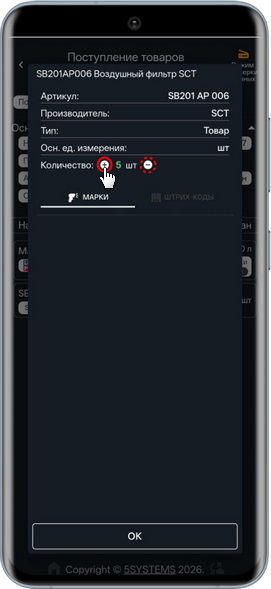 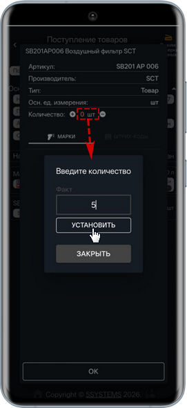

***Цветовая индикация*** соответствия введенного количества плановому:

- *красный* – Факт меньше Плана
- *зеленый* – Факт = План
- *синий* – Факт больше Плана

После этого документ можно провести нажатием на кнопку на нижней панели (подробнее см. [ниже](#knopki)). В случае если отсканировано не полное количество товара, введенные данные можно сохранить нажатием на кнопку *"Записать".*

***Функциональные кнопки формы***

На нижней панели расположены следующие кнопки:

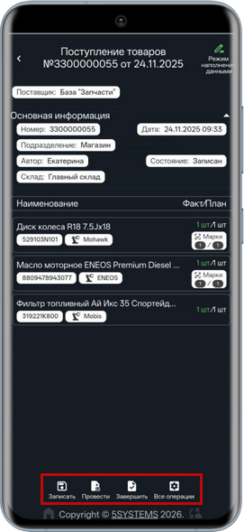

- *Записать* – сохранить промежуточные изменения в документе без проведения;
- *Провести* – провести документ, для подтверждения действия требуется повторное нажатие кнопки (проверка защищает от случайного нажатия, т.к. отменить проведение из приложения будет невозможно – только из программы):

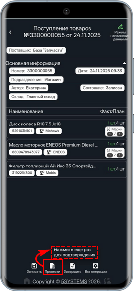

- *Завершить* – после успешной сверки или заполнения нового документа товарами следует нажать данную кнопку для подтверждения завершения работы с данным документом: при этом в программе устанавливается состояние приема-выдачи "Завершено", из интерфейса приложения документ исчезает, продолжить работу с ним можно будет только из программы;
- *Все операции* – в данном разделе, помимо вышеописанных кнопок "Записать", "Провести" и "Завершить", есть две дополнительные кнопки:
    - *Обновить* – при нажатии кнопки приложение заново подтянет данные из 1С. Автоматически данные обновляются 1 раз в час
    - *Отклонить* – при несоответствии поступившего товара фактически ожидаемому есть возможность отклонить документ в приложении, при этом работа с документом будет завершена без проверки, он удалится из приложения, а в программе для него установится статус "Отклонен":

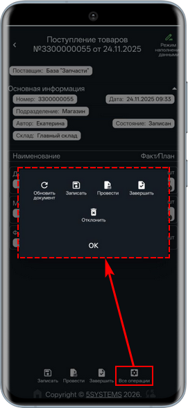

##### 2) Ввод данных о поступившем товаре

Для заполнения пустого документа "Поступление товаров" следует перейти в данный документ в приложении и отсканировать всю партию поступившего товара:

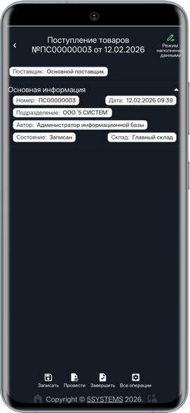

При сканировании добавляются новые строки с товаром, при дальнейшем сканировании одинаковых товарных позиций – добавляется количество.

##### 3) Проверка кодов маркировки

Для товаров с маркировкой в документах в приложении отображается блок "Марки":

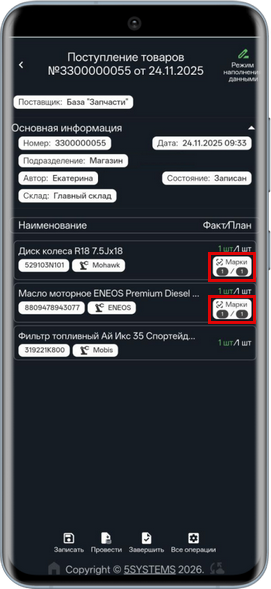

При сканировании товар добавляется как в количество товара, так и в количество кодов маркировки. На вкладке "Марки" в карточке номенклатуры отображаются все коды маркировки по ней:

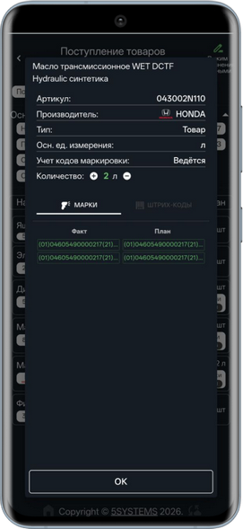

Система автоматически проверяет корректность и уникальность кодов.

##### 4) Ввод кодов маркировки

В случае если в документе, полученном от поставщика, отсутствуют коды маркировки для товаров, по которым ведется учет маркировок, плановое количество кодов маркировки в документе в TSD будет в значении "0".

Также есть возможность заполнять маркированными товарами пустой документ поступления, заранее созданный в программе (см. [выше](#2-ввод-данных-о-поступившем-товаре)).

При сканировании кодов маркировки на фактически поступивших товарах коды будут заноситься в базу, в приложении будут одновременно заполняться оба значения: "План" и "Факт".

#### 2. Выдача товара

В раздел "Отгрузка" выводятся документы "Реализация товаров" и "Перемещение в производство" по заказ-наряду. Суть работы с данными документами в TSD в том, чтобы фактические штрихкод или маркировка соответствовали планируемым – для контроля правильности выдачи товара.

В интерфейсе приложения так же, как при работе с поступлениями (см. [выше](#rezhimy)), отображаются непроведенные документы (режим наполнения данными), и проведенные (режим проверки данных):

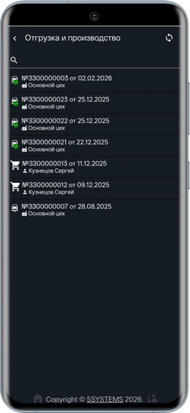

Для сканирования требуется открыть нужный документ:

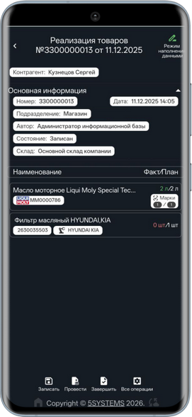

При сканировании товаров в документе заполняется фактическое количество – аналогично работе с поступлениями (см. [выше](#1-сверка-поступления-с-данными-поставщика)). При полном совпадении с планом – провести документ, затем завершить работу с документом нажатием на кнопку "Завершить".

#### 3. Инвентаризация

*Инвентаризация* — это процедура учета товара, находящегося на складе. При инвентаризации подсчитывается количество остатков товара и сверяется с данными в документах. Подробнее см. статью: [Инвентаризация](../Инвентаризация/inventarizaciya.md).

TSD значительно ускорят проведение инвентаризации. Устройство мгновенно сканирует штрихкоды товаров, подсчитывает их количество и передает информацию в программу. Оператор сравнивает количество товара по документам и фактические остатки.

При нажатии кнопки главного меню "Инвентаризация" выводится список документов в разбивке по складам, доступным пользователю.

*Примечание:* Доступные склады выводятся в соответствии с правами пользователя, к которому привязан аккаунт, через который выполнен вход в TSD.

Следует выбрать нужный склад:

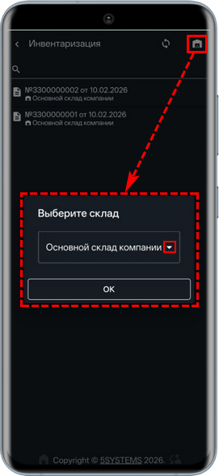

и открыть нужный документ:

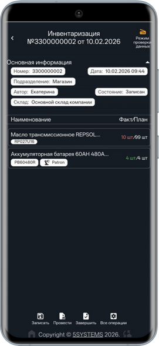

В колонке "Факт/План" отображается количество товара – *фактическое,* добавляемое при сканировании из текущего документа, и *планируемое* – расчетное количество единиц измерения номенклатуры согласно имеющимся данным в программе.

Далее необходимо отсканировать штрихкоды или коды маркировки всех товаров, подлежащих инвентаризации или ввести количество вручную – в поле "Факт" добавится фактически отсканированное количество товара.

Заполненный документ следует записать и провести, затем завершить работу с документом нажатием на кнопку "Завершить".

*Примечание:* В интерфейсе TSD отображаются только товары, которые есть в записи регистра "Считанные штрихкоды" по документу.

#### 4. Перемещение

*Раздел в разработке*

Функционал используется при поступлении на склад товаров, отправленных из другого филиала компании с использованием механизма "[Перемещение товаров между филиалами](../Перемещение%20товаров%20между%20филиалами/peremeschenie-tovarov-mezhdu-filialami.md)".

При нажатии кнопки меню "Перемещение" выводится список документов "Перемещение товаров" и "Перемещение в филиал" в разбивке по складам, доступным пользователю.

В интерфейс приложения выводятся непроведенные документы за последние 30 дней.

Следует выбрать склад и открыть нужный документ.

#### 5. Поиск остатков товаров на складах

Для работы с функционалом предварительно в базе должен быть заполнен справочник "Номенклатура" с артикулами и штрихкодами товаров.

При нажатии на кнопку "Остатки" открывается интерфейс поиска товаров:

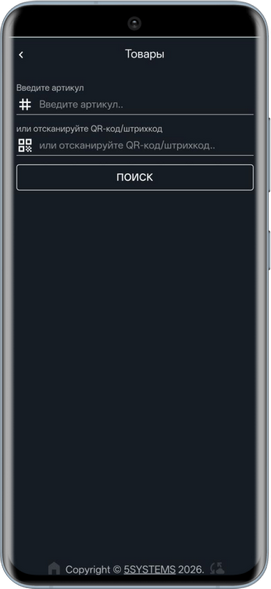

Реализовано два способа поиска товара:

- по артикулу;
- по штрихкоду или коду маркировки – путем сканирования.

Реализован "умный" поиск по артикулу – по частичному совпадению. Сначала выводятся первые 5 позиций, соответствующие поиску, т.е. содержащие в артикуле введенное значение. При нажатии кнопки "ЕЩЁ" выводятся следующие 5 позиций и так далее:

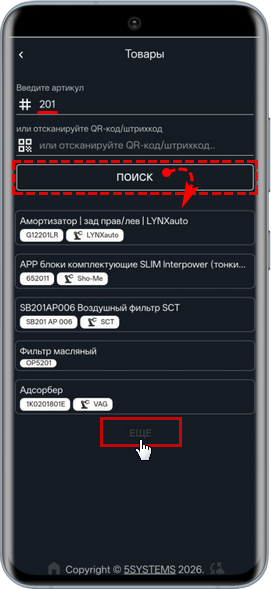 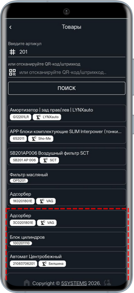

Для просмотра информации по остаткам следует открыть карточку товара:

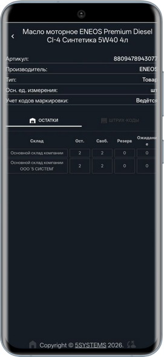

*Выводится информация по номенклатуре:*

- артикул;
- производитель;
- тип;
- основная единица измерения;
- признак ведения учета маркированного товара.

Доступен просмотр остатков на складах, включая свободный остаток, резерв и ожидание.

На вкладке "Штрих-коды" отображается список штрихкодов товара и кодов маркировки:

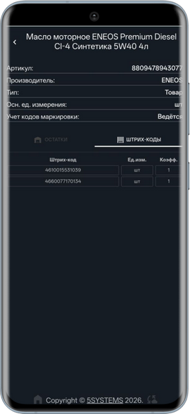

### Присвоение штрихкодов

*Функционал в разработке*

## Взаимодействие с программой

### 1. Состояния приема-выдачи товара

В документах "Поступление товаров", "Реализация товаров" и "Перемещение товаров в производство" имеется параметр "Состояние приема-выдачи", значение которого устанавливается на основании данных, полученных из приложения:

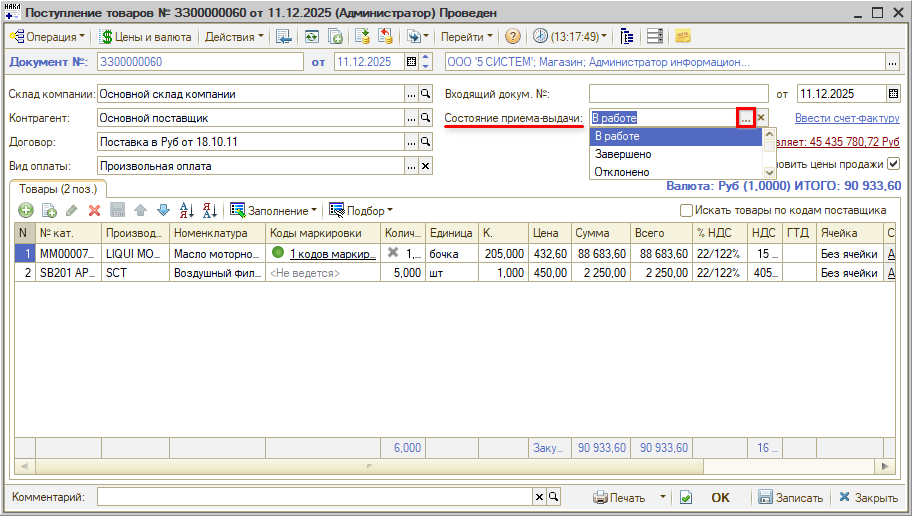

Данный параметр выводится автоматически после включения настройки склада "Контролировать состояние приема выдачи" для документов, создаваемых после указанной в настройках даты – см. [ниже](#настройка-контроля-состояний-складских-документов).

***Возможные значения статусов:***

- *В работе* – по документу еще ведется работа в TSD. В интерфейсе приложения выводятся только документы в данном статусе;
- *Завершен* – из TSD получен статус успешного завершения, т.е. пользователь нажал кнопку *"Завершить" (см. [выше](#kn_zaversh));*
- *Отклонено* – из приложения получен статус отмены, т.е. пользователь нажал в TSD кнопку *"Отклонить" (см. [выше](#kn_zaversh)).*

В списках документов "Поступление товаров", "Реализация товаров" и "Перемещение товаров в производство" отображается колонка *"Состояние приема-выдачи":*

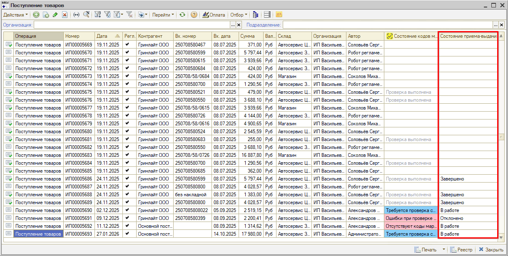

### 2. Отбор по состояниям

Есть возможность устанавливать *отборы* по состоянию приема-выдачи:

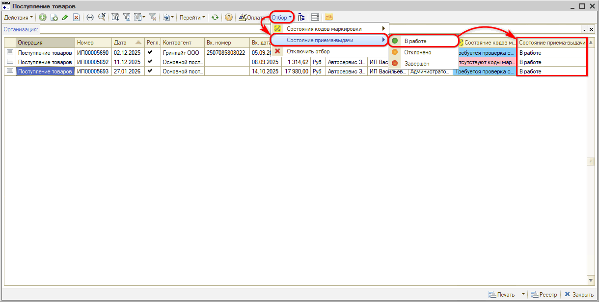

Для снятия отбора нужно нажать кнопку *"Отключить отбор"* либо снова нажать ту же кнопку отбора.

### 3. Контроль сканирования

Отсканированные штрихкоды и коды маркировки заносятся в программе в *регистры "Считанные штрихкоды"* и *"Считанные коды маркировки".*

Есть возможность перейти в данные регистры для проверки корректности сканирования товаров.

## Настройка

### 1. Требования к оборудованию

***Рекомендуемые требования к устройству:***

**1)** необходимое оборудование:
- смартфон;
- bluetooth сканер штрихкодов (включая линейные ШК, QR-коды и Data Matrix);

**2)** актуальная версия Google Chrome;
**3)** стабильный wi-fi;
**4)** отключение автоблокировки экрана (ухода в спящий режим через несколько минут бездействия).

***Рекомендации по настройке приложения:***

**1)** развернуть приложение на весь экран – нажать кнопку в правом верхнем углу (см. [ниже](#кнопка-на-весь-экран));
**2)** установить ярлык приложения на рабочий стол устройства (см. [выше](#yarlyk)).

### 2. Настройки в программе

#### Предварительные настройки

Для работы с функционалом предварительно должны быть сделаны следующие настройки.

**1) Настройка интеграции с API 5S AUTO**
Для работы с 5S TSD предварительно в программе должна быть настроена интеграция с [API 5S AUTO](https://www.5systems.ru/help/api-5s-auto).

**2) Настройка пользователя 5S Cloud**
Для доступа в приложение потребуется ввести логин и пароль пользователя [5S Cloud](https://www.5systems.ru/help/sozdanie-i-redaktirovanie-polzovateley-5s-cloud). Рекомендуется для каждого устройства создать отдельного пользователя в справочнике Пользователей 5S AUTO и зарегистрировать его в 5S Cloud.

**3) Подключение оборудования**
Требуются настройки подключения в программе сканера штрихкодов либо терминала сбора данных (ТСД) со встроенным сканером.
См. в статье: [Подключение сканера штрихкодов](../Штрихкодирование%20номенклатуры/Подключение%20сканера%20штрихкодов/podklyuchenie-skanera-shtrikhkodov.md).

**4) Интеграция с Честным Знаком**
В случае если компания является участником оборота маркированных товаров, необходима регистрация в системе "Честный знак" и настройка интеграции с данным сервисом в программе. Подробнее см. статьи "[Маркировка товаров](https://www.5systems.ru/help/markirovka-tovarov)", "[Регистрация в системе Честный знак](https://www.5systems.ru/help/registraciya-v-sisteme-chestnyy-znak)", "[Настройка интеграции с Честным знаком](https://www.5systems.ru/help/nastroyka-integracii-s-chestnym-znakom)" и другие статьи в разделе "[Маркировка](https://www.5systems.ru/taxonomy/term/240)".

**5) Настройки доступа у пользователя 1С**
Для пользователя 1С должен быть настроен доступ по подразделениям и по складам (см. описание настроек в статьях "[Настройка видимости складов](https://www.5systems.ru/help/nastroyka-vidimosti-skladov#polz)", "[Доступ к данным по подразделениям (RLS)](https://www.5systems.ru/help/dostup-k-dannym-po-podrazdeleniyam-rls#dost_polz)" и "[Права на редактирование документов](https://www.5systems.ru/help/prava-na-redaktirovanie-dokumentov#red_dok_opr_tipa)").

#### Настройка контроля состояний складских документов

Для вывода в документы параметра "Состояние приема-выдачи" (см. [выше](#1-состояния-приема-выдачи-товара)) у склада должна быть включена настройка *"Контролировать состояние приема-выдачи"* и установлена дата, начиная с которой будет производиться контроль состояний:

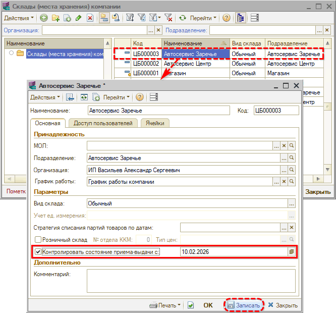

Настройка будет работать для новых документов, создаваемых начиная с установленной даты. Для уже существующих в программе документов состояния не будут заполнены.

*Примечание:* В приложение выводятся только документы с состоянием приема-выдачи "В работе".

### 3. Настройки в 5S TSD

#### Кнопка "На весь экран"

Рекомендуется развернуть приложение на весь экран с помощью специальной кнопки в правом верхнем углу:

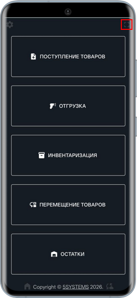

При этом скрывается интерфейс браузера.

#### Кнопка "Домой"

"Домой" – кнопка возврата в главное меню приложения:

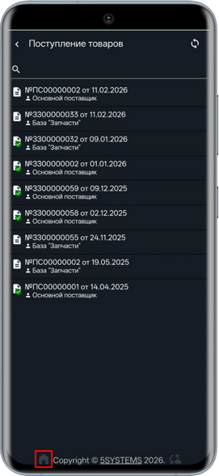 

#### Переход к настройкам приложения

Для перехода к настройкам приложения следует нажать на "шестеренку" в левом верхнем углу экрана:

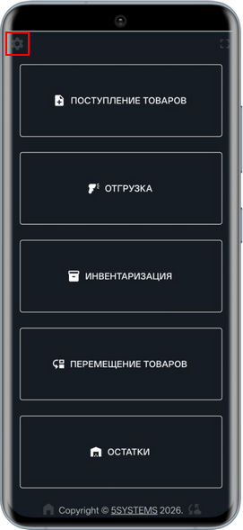 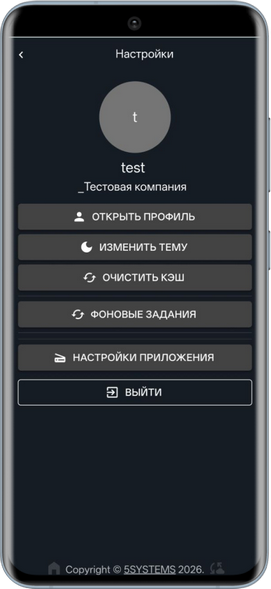

#### Настройки сканирования

В разделе *"Настройки приложения"* интерфейса TSD есть возможность задать параметры для более корректного сканирования кодов маркировки.

Данный раздел настроек предназначен для возможности адаптировать приложение 5S TSD под большее число сканеров, т.к. для разных сканеров существуют свои нюансы, возможности и ограничения настройки.

Для перехода к настройкам следует нажать кнопку *"Настройки приложения":*

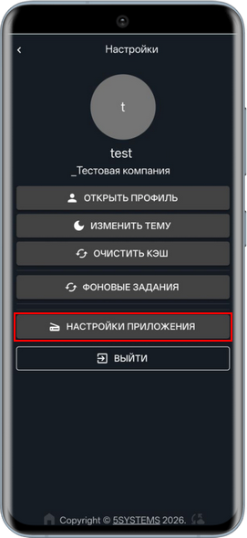 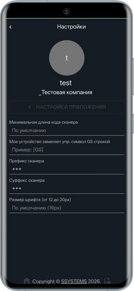

***Параметры сканирования:***

**1)** *Минимальная длина кода сканера* – настройка для игнорирования сканером коротких или ошибочных считываний
**2)** *Мое устройство заменяет упр. символ GS строкой* – удаление невидимых символов, замена символа [GS] на строку
**3)** *Префикс сканера* и *Суффикс сканера* – следует задать значение "+++" для того, чтобы 1С определяла сканируемые данные как штрихкод

***Установка размера шрифта:***

Параметр *"Размер шрифта"* регулирует масштаб текста в приложении. Значение по умолчанию – 16 px, можно установить значение от 12 до 20 px.

#### Прочие настройки

**1.** *Открыть профиль* – есть возможность изменить личную информацию, настроить аутентификацию, проверить активные устройства и прочие настройки безопасности:

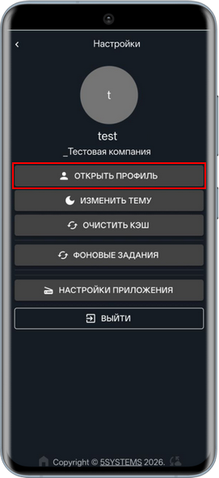 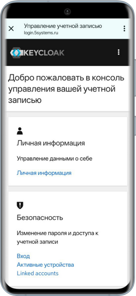

**2.** *Изменить тему* – при нажатии на кнопку меняются светлая и темная темы приложения:

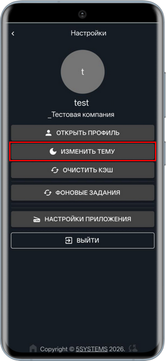 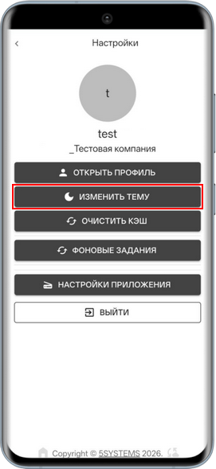

По умолчанию используется настройка основной темы браузера на устройстве. Настройка изменения темы сохраняется для текущего пользователя. В случае очистки кэша, а также выхода из учетной записи устанавливается тема по умолчанию.

**3.** *Очистить кэш* – обновление кэша приложения:

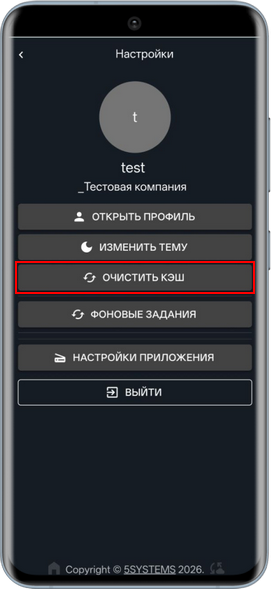

**4.** *Фоновые задания* – при нажатии на кнопку открывается список фоновых заданий:

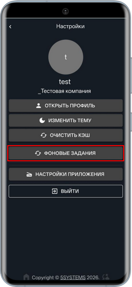 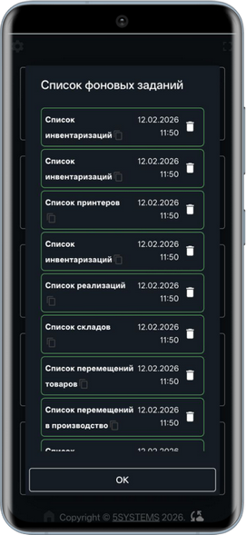

Также список фоновых заданий открывается при нажатии на кнопку загрузки внизу экрана. Когда происходит какой-либо процесс загрузки информации, на этой кнопке отображается индикатор – синий кружок:

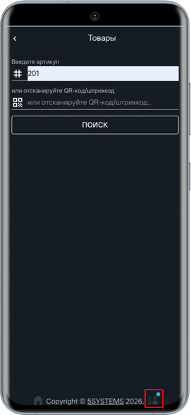

**5.** *Выйти* – кнопка выхода из учетной записи, после ее нажатия потребуется заново авторизоваться:

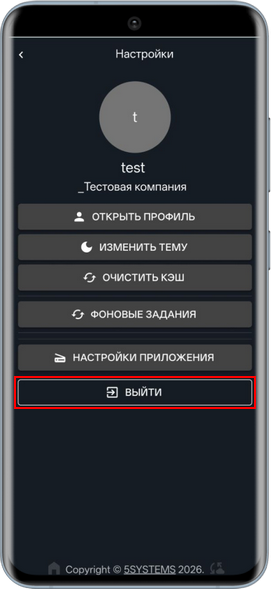

---

**Теги:** Складской учет, Маркировка, Торговое оборудование, 5S TSD, терминал сбора данных, коды маркировки, DataMatrix, приемка товаров, состояние приема-выдачи

