

# Работа с применяемостью

<table><tr><td><b>Время чтения:</b> 20 мин.</td><td><b>Обновлено:</b> 17.06.2022</td></tr></table>

Источник: https://www.5systems.ru/help/rabota-s-primenyaemostyu

## Содержание

- [Введение](#введение)
- [Создание применяемости](#создание-применяемости)
  - [Предварительные настройки](#предварительные-настройки)
  - [Заполнение применяемости из онлайн-каталога для модели автомобиля](#заполнение-применяемости-из-онлайн-каталога-для-модели-автомобиля)
  - [Применяемость "Для любой модели"](#применяемость-для-любой-модели)
  - [Применяемость по типу двигателя и типу КПП](#применяемость-по-типу-двигателя-и-типу-кпп)
- [Отображение применяемости в программе](#отображение-применяемости-в-программе)
  - [Отметки в онлайн-каталоге](#отметки-в-онлайн-каталоге)
  - [Отображение в Корзине](#отображение-в-корзине)
- [Заполнение применяемости вручную](#заполнение-применяемости-вручную)
- [Связь деталей и работ](#связь-деталей-и-работ)
  - [Привязка работы к детали применяемости](#привязка-работы-к-детали-применяемости)
  - [Норма времени работы для модели автомобиля](#норма-времени-работы-для-модели-автомобиля)
  - [Связанные с работой работы/детали](#связанные-с-работой-работыдетали)
  - [Типы связей](#типы-связей)
- [Использование применяемости для подбора](#использование-применяемости-для-подбора)
- [Применяемость для агрегатов](#применяемость-для-агрегатов)

## Введение

В программе предусмотрена возможность вести и использовать ***применяемость*** деталей к автомобилю, а также взаимосвязи деталей применяемости и авторабот, с целью быстрого подбора запчастей и работ для клиента в [АРМ "Корзина"](../../Проценка%20запчастей%20и%20работ/Работа%20в%20АРМ%20Корзина/rabota-v-arm-korzina.md).

Для того, чтобы появилась возможность быстро подбирать детали и работы с помощью применяемости (см. *[Использование применяемости для подбора](#использование-применяемости-для-подбора)*), для начала необходимо создать применяемость.

## Создание применяемости

### Предварительные настройки

> *Чтобы вести и создавать применяемость у пользователя должно быть установлено [право](https://5systems.ru/help/ustanovka-prav-i-nastroek-polzovatelya) "Разрешено редактировать все рабочие листы запчастей" (ПЯТЬ СИСТЕМ → ПОМОЩНИК ПРОДАЖ) = Да*

Для создания применяемости первоначально необходимо сформировать основной перечень деталей автомобиля. Делается это через справочник "Детали применяемости" (CRM → Помощник автосервиса → Детали (запчасти)):

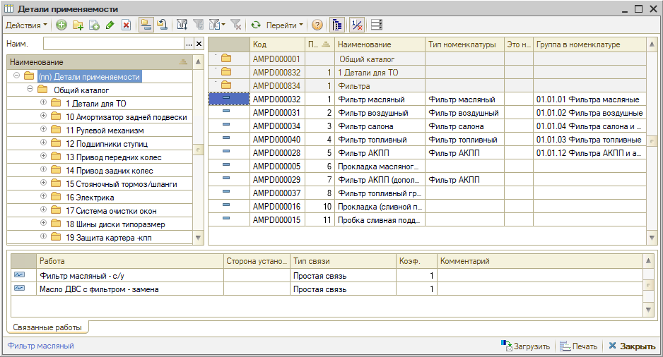

Далее заполняются артикулы деталей, подходящие для автомобиля, и привязываются работы. Артикулы деталей подбираются на конкретный автомобиль или модель автомобиля, а работы привязываются к детали применяемости.

Подобрать подходящие артикулы можно *[через OEM каталог](#заполнение-применяемости-из-онлайн-каталога-для-модели-автомобиля)* или *[заполнить вручную](#заполнение-применяемости-вручную)*. Как привязать работы к деталям применяемости см. *[Связь деталей и работ](#связь-деталей-и-работ)*.

См. также про создание применяемости в *[Видеоинструкции](https://youtu.be/_IqkqdI8VZ0)*.

### Заполнение применяемости из онлайн-каталога для модели автомобиля

Откройте OEM каталог по автомобилю. В OEM каталоге найдите оригинальную деталь и в меню (вызывается правой клавишей мыши на строку с деталью) выберите пункт "Сохранить для модели (в применяемости)":

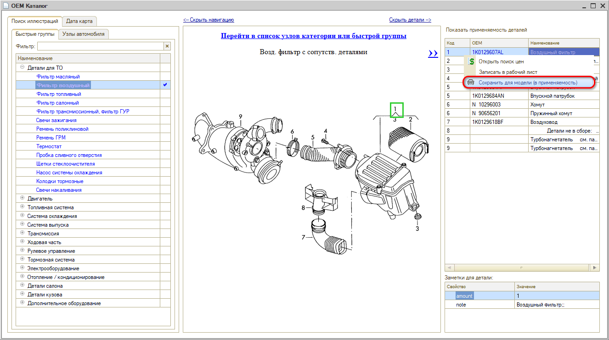

Среди деталей применяемости выберите значение для соответствия с деталью OEM каталога и нажмите кнопку "Выбрать":

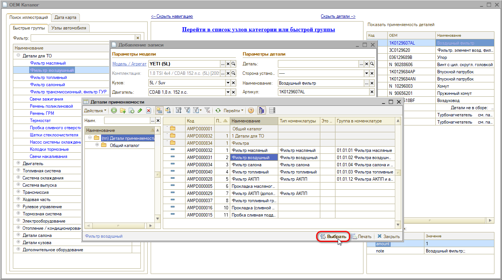

Выберите сторону установки детали:

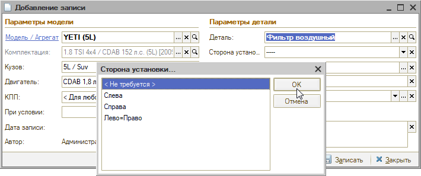

Уточните параметры применяемости:

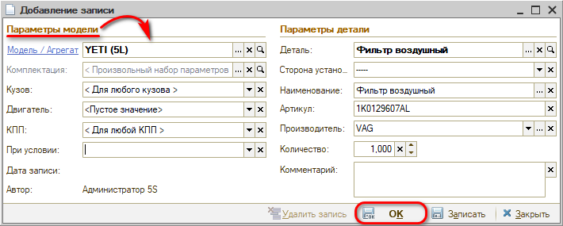

Применяемость деталей может быть задана по разным параметрам: по модели автомобиля, по комплектации, по типу кузова, двигателя, КПП.

### Применяемость "Для любой модели"

Привязка применяемости, как правило, устанавливается к модели автомобиля. Но некоторые запчасти применимы к двигателю, либо к кузову, и при этом могут подходить к разным моделям. Для таких случаев, чтобы не создавать применяемость для каждого сочетания параметров, создается применяемость ***"Для любой модели"** (функционал доступен начиная с релиза 2.2.7.2)*. Чтобы установить данный вариант, следует в поле "Модель" нажать кнопку "Очистить" и произвести привязку к нужному параметру – например, к двигателю:

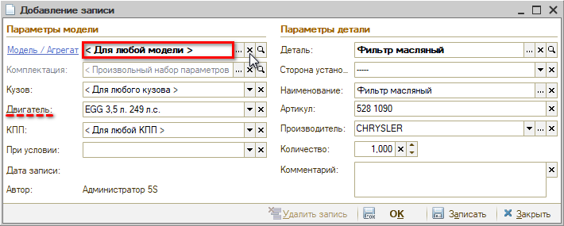

### Применяемость по типу двигателя и типу КПП

Некоторые модели разных марок автомобилей являются одинаковыми по конструкции и параметрам, и деталь подходит обеим моделям, независимо от марки. Для классификации и объединения однотипных моделей двигателей и КПП в систему введены понятия "Модель двигателя" и "Группа моделей двигателя", "Модель КПП" и "Группа моделей КПП".

При добавлении применяемости по типу или модели двигателя или КПП удаляются значение в полях "Модель" и "Комплектация", а в поле выбора двигателя производится выбор определенного значения из заранее заполненных справочников – *Типы двигателей*, *Модели двигателей* либо *Группы моделей.*

Подробнее см. статью *[Применяемость по типу двигателя и типу КПП](https://5systems.ru/help/primenyaemost-po-tipu-dvigatelya-i-tipu-kpp)*.

## Отображение применяемости в программе

### Отметки в онлайн-каталоге

После сохранения в OEM каталоге появится отметка о том, что деталь используется в применяемости. Чтобы увидеть эти отметки, следует нажать кнопку "Показать применяемость деталей":

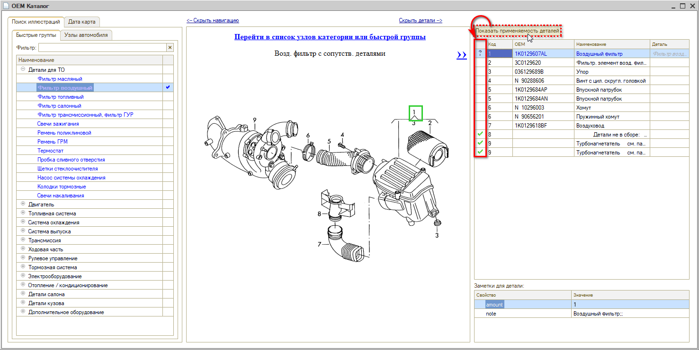

Если деталь добавлена в применяемость для определенной модели автомобиля, и в параметрах заполнен двигатель, то стоит обозначение .

Если сохранена применяемость "для любой модели" по определенным параметрам, либо для определенной модели с любыми параметрами, либо по типу двигателя / КПП, то появится обозначение . При клике на знак вопроса система предложит сохранить применяемость с названием детали из номенклатуры.

### Отображение в Корзине

Если теперь перейти в корзину и выбрать автомобиль модели, для которой добавили деталь применяемости, то заполненная деталь применяемости отобразится в подборе "Рабочий лист":

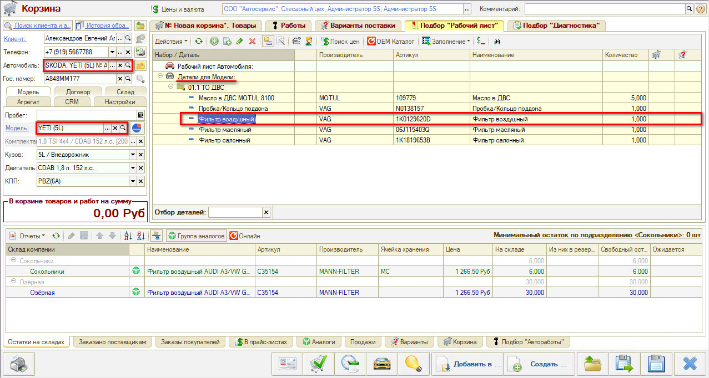

***Приоритеты при выводе применяемости в Корзине***

Применяемость в Корзине выводится согласно следующим заложенным в программе *приоритетам:*

1. По Модели автомобиля;
2. По Комплектации;
3. По Кузову;
4. По двигателю:
   1. По Типу двигателя;
   2. По Модели двигателя;
   3. По Группе моделей двигателя;
5. По КПП:
   1. По Типу КПП;
   2. По Модели КПП;
   3. По Группе моделей КПП.

То есть, если задана применяемость на группу моделей, на модель и на тип двигателя, то выводиться в Корзине будет самая точная применяемость – на тип двигателя. Если помимо этого задана применяемость по модели автомобиля, то выводиться будет данная применяемость как самая точная.

### Обучающий видеоролик

**[Обучающий видеоролик "Добавление детали в применяемость"](https://youtu.be/ST5MvO1xW5Y):**

[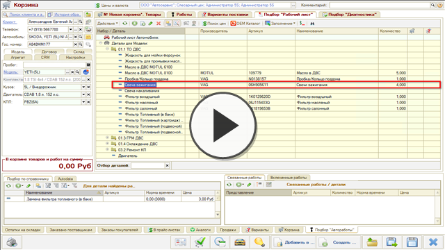](https://edu.5systems.ru/video/archive/5S_AUTO_Rabota_v_Korzine_Dobavlenie_detali_v_primenyaemost.mp4)

## Заполнение применяемости вручную

Вручную применяемость можно добавить через АРМ "Корзина". Для этого:

1. Перейдите в Корзину и выберите автомобиль, для которого планируете заполнить применяемость (можно просто выбрать модель автомобиля, а не конкретный автомобиль).
2. Перейдите на вкладку Подбор "Рабочий лист" и включите режим заполнения применяемости:

   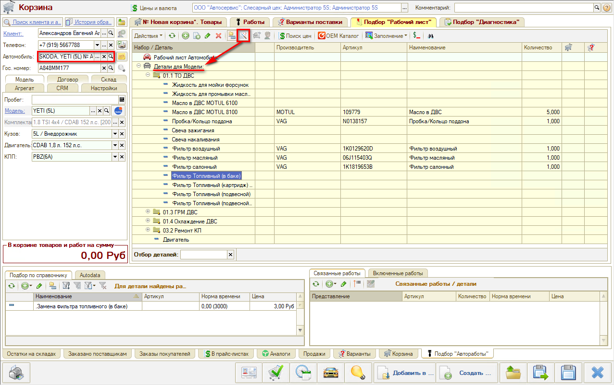

   В деталях автомобиля отображается структура из заполненного справочника "Детали применяемости" согласно заданному в нем порядку сортировки.
3. Выберите деталь применяемости (можно воспользоваться поиском детали с помощью поля ввода "Отбор деталей") и нажмите кнопку командного меню "Изменить".
   **Внимание!** Если по детали применяемости заполнено уже одно значение, то добавить еще одно значение можно, нажав кнопку "Добавить копированием" командного меню.
4. Выберите сторону:

   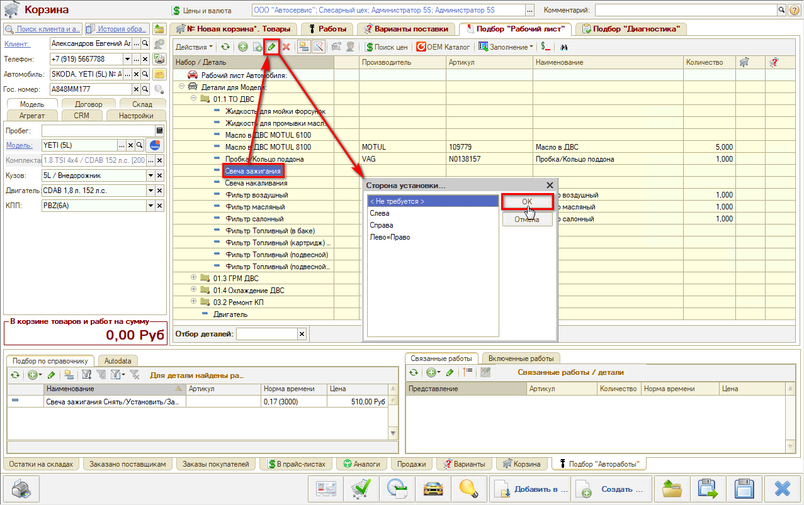
5. Заполните наименование, производителя и артикул детали и нажмите кнопку "ОК":

   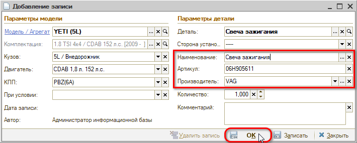

После добавления деталь отобразится в рабочем листе:

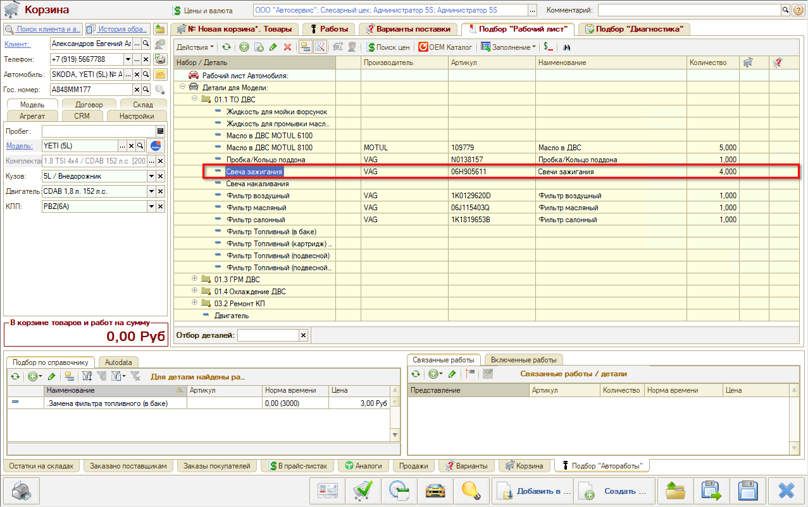

Добавленную деталь при желании можно отредактировать или удалить.

В окне Добавления/Изменения детали применяемости в области параметров модели можно задать условие, при которых деталь будет применима на автомобиль: наличие кондиционера, приобретение комплектом и т.д. В этом случает в рабочем листе возле артикула будет отображен знак вопроса и заданное условие:

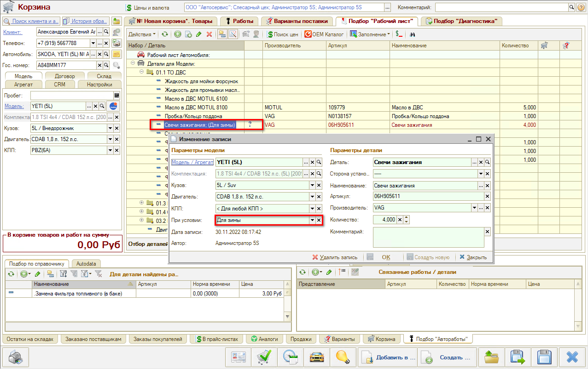

## Связь деталей и работ

### Привязка работы к детали применяемости

Созданные детали применяемости связываются с автоработами с целью быстрого подбора работ для автомобиля клиента. При этом связь работ к деталям применяемости единая для всех автомобилей. Чтобы добавить работу по детали применяемости:

1. Выберите любую модель автомобиля в Корзине (можно в справочнике "Модели автомобилей" завести значение "Любая модель").
2. Перейдите на вкладку Подбор "Рабочий лист" и активируйте режим применяемости с помощью командного меню.
3. Выберите деталь применяемости и перейдите на вкладку Подбор "Автоработы" нижней части окна Корзины.
4. В командном меню списка работ для детали нажмите кнопку "Создать связь детали с автоработой":

   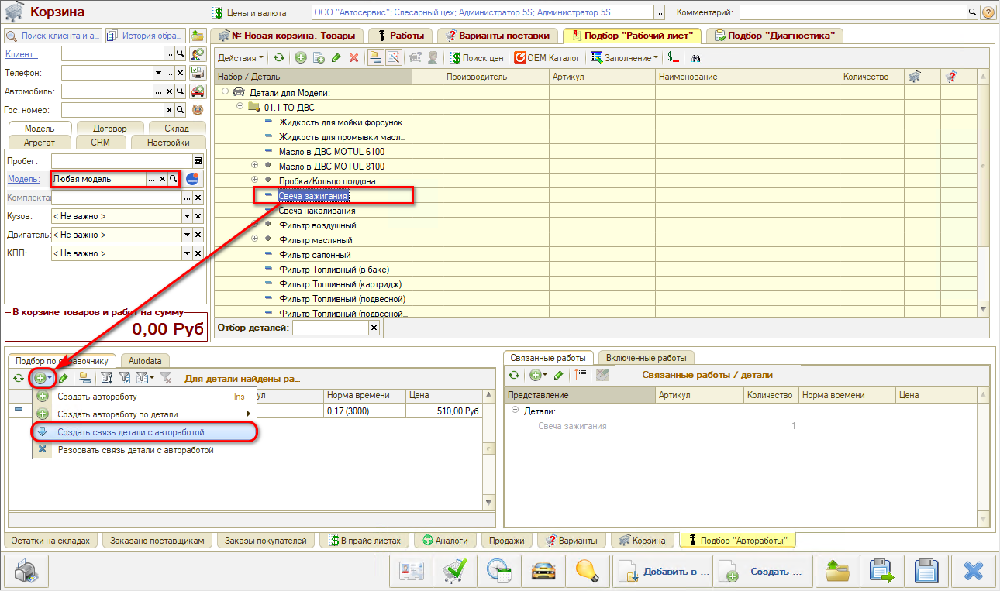
5. Выберите автоработу.
6. В окне "Связи деталей и работ" нажмите кнопку "Ок":

   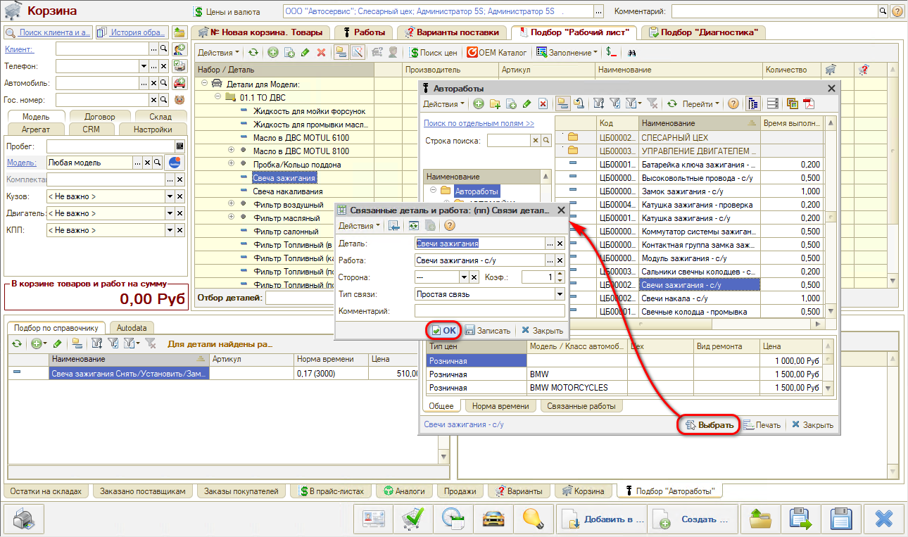

Связанная с деталью работа отображается в списке работ по детали, а в окне "Связанные работы/детали" отображается связь работы с деталью, т.е. деталь применяемости свяжется с работой, а работа свяжется с деталью применяемости (простая связь):

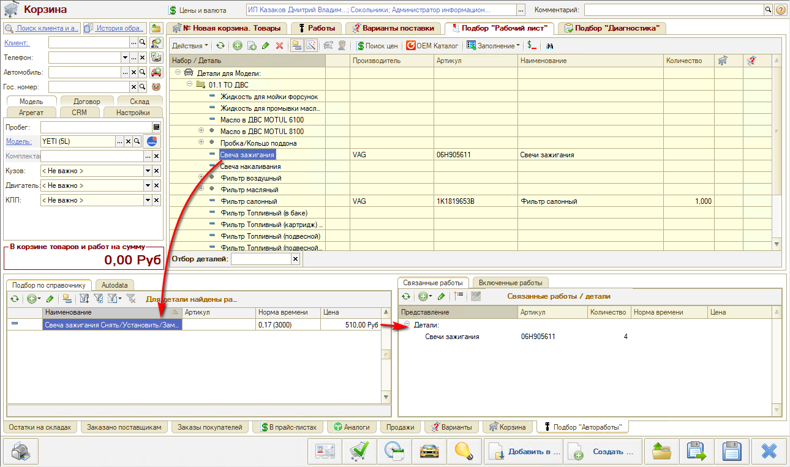

Подробное описание типов связи см. *[Типы связей](#типы-связей)*.

**Обратите внимание!** По выбранной детали применяемости происходит поиск авторабот, совпадающих по наименованию с деталью применяемости (ищется по началу строки с наименованием). Найденная по наименованию, но не связанная с деталью работа выделяется красным цветом:

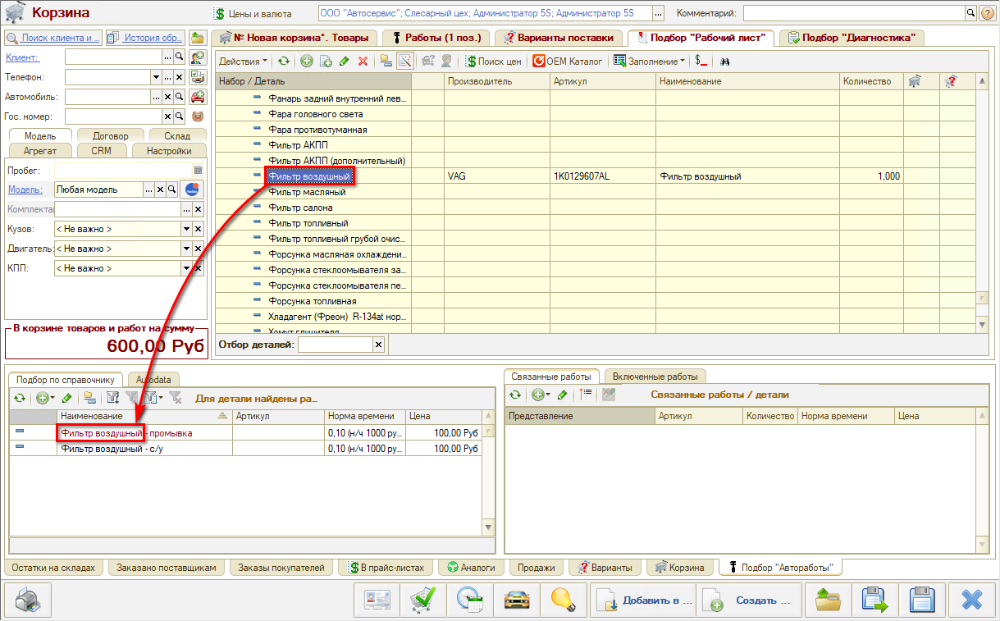

### Норма времени работы для модели автомобиля

Для конкретной модели автомобиля можно установить свою норму времени для работы. Для этого:

1. Дважды кликните мышью на значение нормы времени работы (можно сделать как среди найденных, так и в *связанных работах*).
2. В появившемся окне нажмите кнопку "Установить для модели".
3. Введите значение нормы времени и подтвердите ввод.
4. Просто закройте окно "Ввод количество и цены" (если нажать кнопку "Ок" работа добавится в Корзину):

   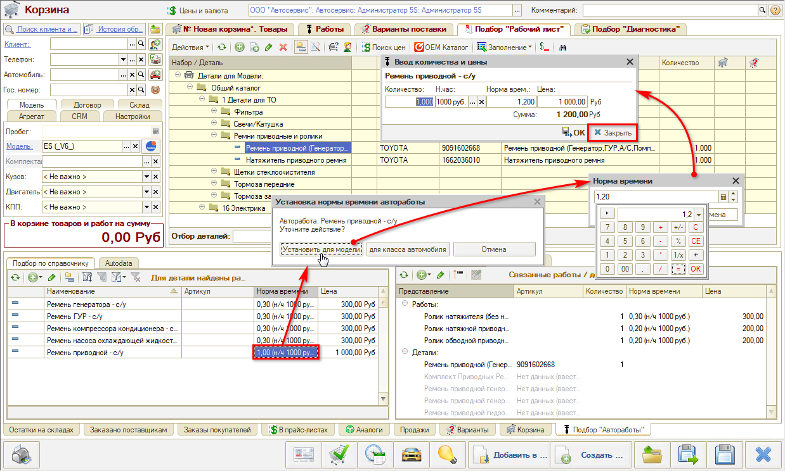

В результате для модели будет задана и выделена цветом своя норма времени:

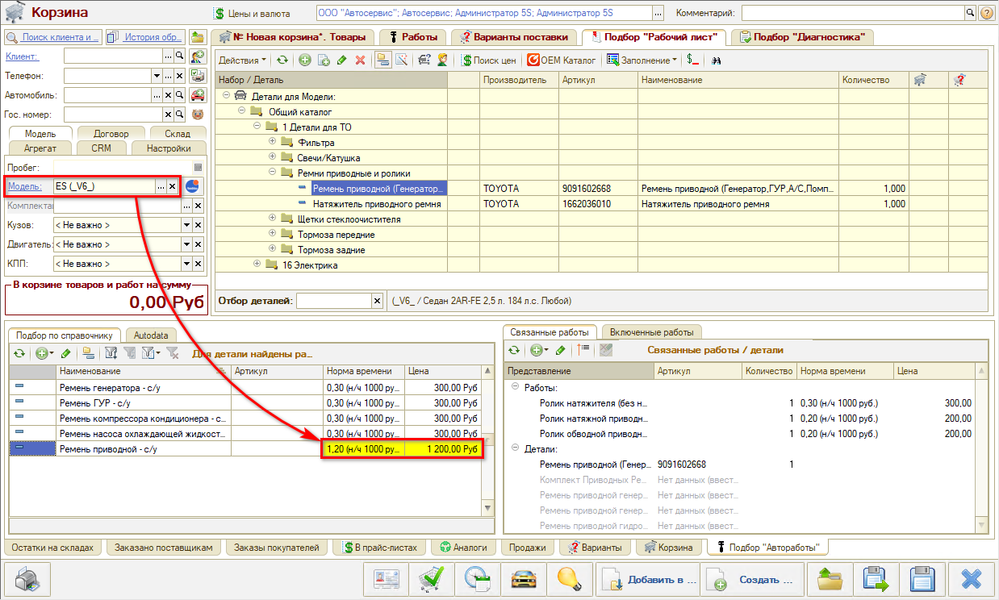

### Связанные с работой работы/детали

По работе можно добавить связи с другой работой, номенклатурой, деталью. Это будет связь с конкретной моделью автомобиля.

Добавление связи работы с другой работой:

1. В области "Связанные работы/детали" нажмите кнопку "Связать с автоработой или номенклатурой" командного меню:

   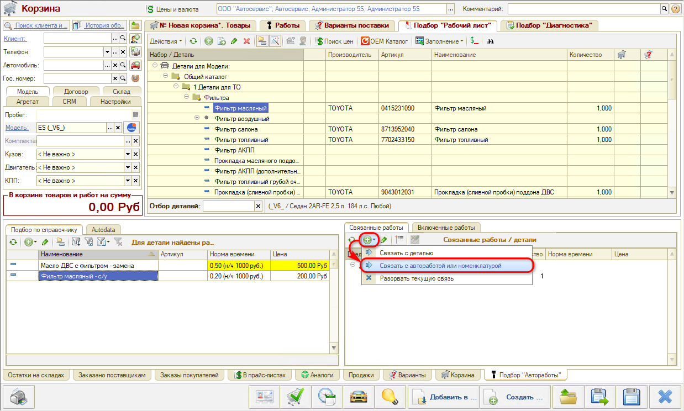
2. Выберите автоработу в поле "Связанная работа" и подтвердите создание связи:

   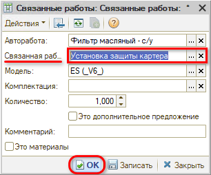

Созданная связь отображается в группе "Работы" области "Связанные работы/детали":

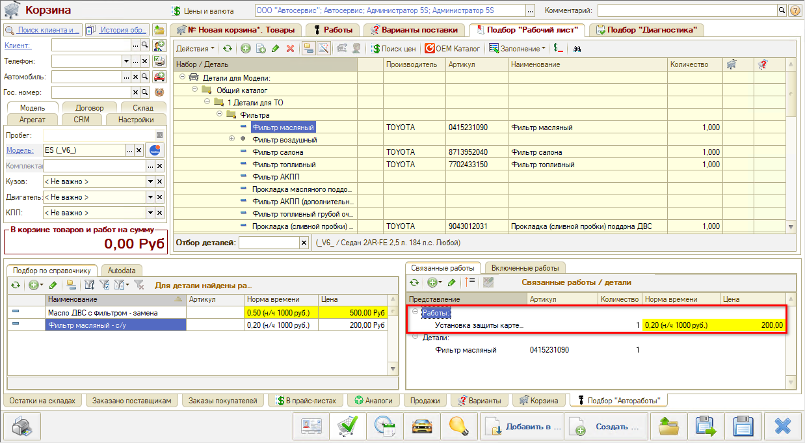

Добавление дополнительного предложения по работе:

1. В области "Связанные работы/детали" нажмите кнопку "Связать с автоработой или номенклатурой" командного меню:

   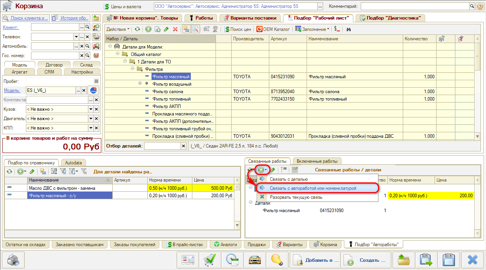
2. Выберите номенклатуру в поле "Связанная работа", установите флажок "Это дополнительное предложение" и подтвердите создание связи:

   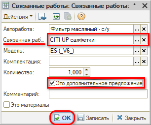

Созданная связь отображается в группе "Доп. предложения" области "Связанные работы/детали":

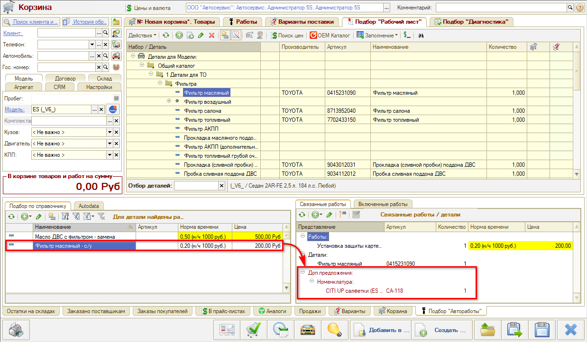

Добавление сопутствующей связи с деталью:

1. В области "Связанные работы/детали" нажмите кнопку "Связать с деталью" командного меню:

   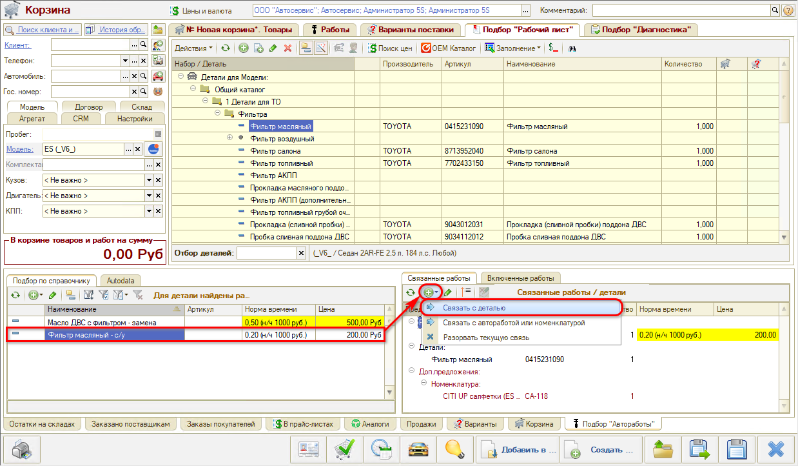
2. Выберите деталь для связи с работой, установите тип связи "Сопутствующая" и подтвердите создание связи:

   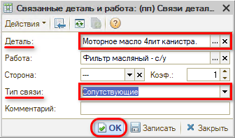

В итоге деталь по текущей работе не отображается, но работа отобразится в качестве сопутствующей для детали, с которой создана связь (выделяется синим цветом):

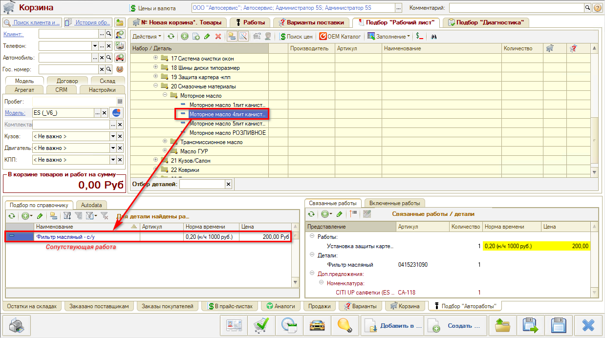

Описание типов связи детали и работы см. *[Типы связей](#типы-связей)*.

### Типы связей

- *Простая связь* - когда деталь связывается с работой, а работа с деталью (двусторонняя связь).
- *Сопутствующая связь* - когда деталь связывается с работой, а работа с деталью не связывается, или, когда работа связывается с деталью, а деталь с работой не связывается (односторонняя связь).
- *Для детали (доп. предложение)* - работа для детали сохраняется в качестве дополнительного предложения (в списке найденных работ дополнительное предложение по работе подсвечивается зеленым цветом).
- *Для работы (доп. предложение)* - по работе сохраняется доп. предложение по детали.

## Использование применяемости для подбора

Детали для модели из рабочего листа можно добавить в Корзину (см. *[Работа в АРМ Корзина → Добавление товаров в Корзину из Рабочего листа](../../Проценка%20запчастей%20и%20работ/Работа%20в%20АРМ%20Корзина/rabota-v-arm-korzina.md)*) или сохранить в качестве Вариантов поставки (см. *[Работа в АРМ Корзина → Страница "Варианты поставки"](../../Проценка%20запчастей%20и%20работ/Работа%20в%20АРМ%20Корзина/rabota-v-arm-korzina.md)*).

Кроме того, можно *добавить в Корзину* работу из списка найденных работ по детали применяемости или связанную работу из области "Связанные работы/детали", дважды кликнув по строке, и в появившемся окне подтвердить или подкорректировать и подтвердить стоимость работы:

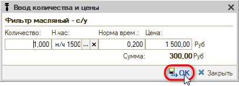

Связанные детали и номенклатуру также по двойному клику мыши можно добавить в Корзину, если они есть в наличии. Если детали или номенклатуры нет в наличии, то добавить их можно в Корзину через "Поиск цен" или сохранить в "Варианты поставки" (система предложит выбрать действие):

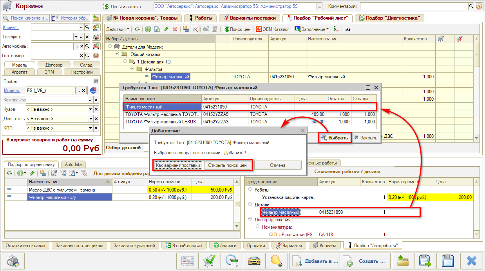

## Применяемость для агрегатов

В работе с применяемостью для [агрегатов](../../Автосервис/Ремонт%20агрегатов/Учет%20агрегатного%20ремонта/uchet-agregatnogo-remonta.md) существует особенность в том, что у агрегата может быть перечень аналогов. При добавлении новых деталей в применяемость можно выбрать, к какой номенклатуре необходимо ее привязать – к *главному по группе агрегату* или к *определенному аналогу*. Привязанные детали затем выводятся в Корзине в отдельных списках:

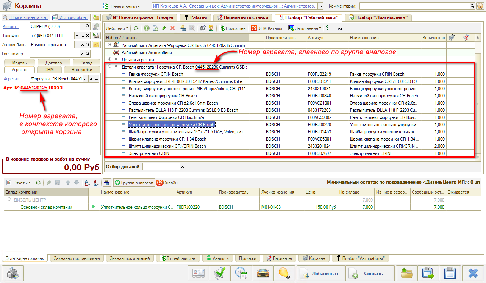

Подробнее см. статью *[Применяемость для агрегатов](../../Автосервис/Ремонт%20агрегатов/Применяемость%20для%20агрегатов/primenyaemost-dlya-agregatov.md)*.

---

**Теги:** Применяемость, Нормы времени, детали применяемости, ОЕМ каталог, связь деталей и работ, применяемость для агрегатов

