

# Создание и настройка прайс-листа контрагента

<table><tr><td><b>Время чтения:</b> 18 мин.</td><td><b>Обновлено:</b> 22.06.2022</td></tr></table>

Источник: https://www.5systems.ru/help/sozdanie-i-nastroyka-prays-lista-kontragenta

#### Введение

Файлы прайс-листов можно загружать в Систему следующими способами:

1. Непосредственно **из файла** как вручную, так и автоматически. В случае автоматической загрузки достаточно выкладывать прайс-лист с обновлениями в указанную при настройке папку, а Система будет автоматически осуществлять его загрузку.
2. **По e-mail** – если поставщик присылает вам прайс-листы на e-mail, то можно настроить загрузку прайс-листа с указанного в настройке e-mail. В этом случае Система будет проверять ваш почтовый сервер и в соответствии с настройками производить загрузку данных из файла прайс-листа, прикрепленного в письме.
3. **C ftp-сервера** - если файл с прайс-листом большого размера, можно выкладывать его на ftp-сервер и настроить загрузку оттуда.
4. **С http-сервера** - если прайс-лист публикуется на сайте, то можно настроить его загрузку с http(s).

#### Создание прайс-листа

Для осуществления загрузки прайс-листа необходимо для начала его создать в программе. Для этого:

1. В типовом меню программы перейдите в *Справочники → Идентификационные → Прайс-листы контрагентов*:

   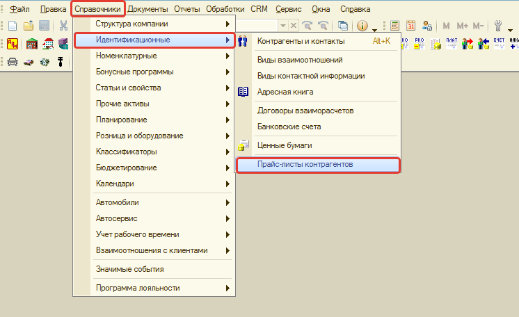
2. В открывшемся окне справочника, нажмите на кнопку «Добавить»:

   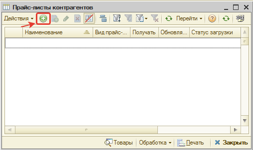
3. В открывшемся окне «Контрагенты и контакты» выберите поставщика прайс-листа. Для этого:
   1. Двойным кликом мыши перейдите в папку «Поставщики».
   2. Если поставщик уже создан, то двойным кликом мыши выберите его.
   3. Если ранее еще не создавали поставщика в Системе, то нажмите на кнопку «Добавить»:

      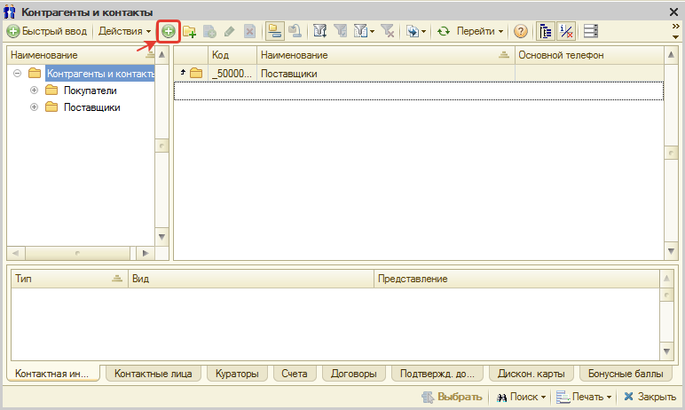
   4. В открывшемся окне создания контрагента обязательно заполните поля «Наименование» и «Полное наименование», остальные при необходимости:

      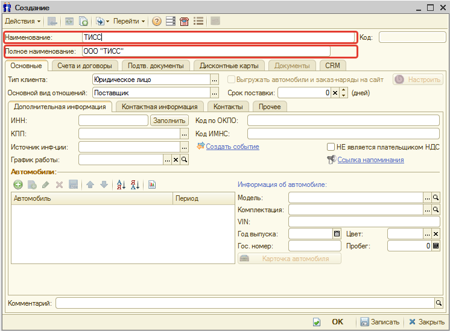
   5. Нажмите на кнопку «ОК».
      *Если появится окно с предупреждением о некорректности данных, просто подтвердите создание поставщика или откорректируйте данные*.
      После указания поставщика открывается окно создания прайс-листа. Чтобы удобнее было дальше настраивать, разверните окно на весь экран.
4. В отрывшемся окне создания прайс-листа откорректируйте наименование прайс-листа при необходимости, чтобы в дальнейшем было понятно, как идентифицировать прайс-лист.
5. Произведите настройку прайс-листа по шагам.

#### Настройка прайс-листа (Шаг 1). Основные параметры

На вкладке "Параметры подключения" задаются параметры файла прайс-листа и производится настройка соответствия колонок файла и реквизитов прайс-листа. Поля "Вид прайс-листа", "Размещение" оставьте без изменений. Кодировку в соответствующем поле поменяйте, если точно знаете в какой кодировке предоставляется файл. При необходимости измените валюту в поле "Валюта", в которой предоставляются цены в прайсе. После чего приступайте к сопоставлению колонок файла реквизитам прайс-листа следующим образом:

1. Загрузите образец файла прайс-листа. Для этого в поле «Образец файла» укажите файл прайс-листа:

   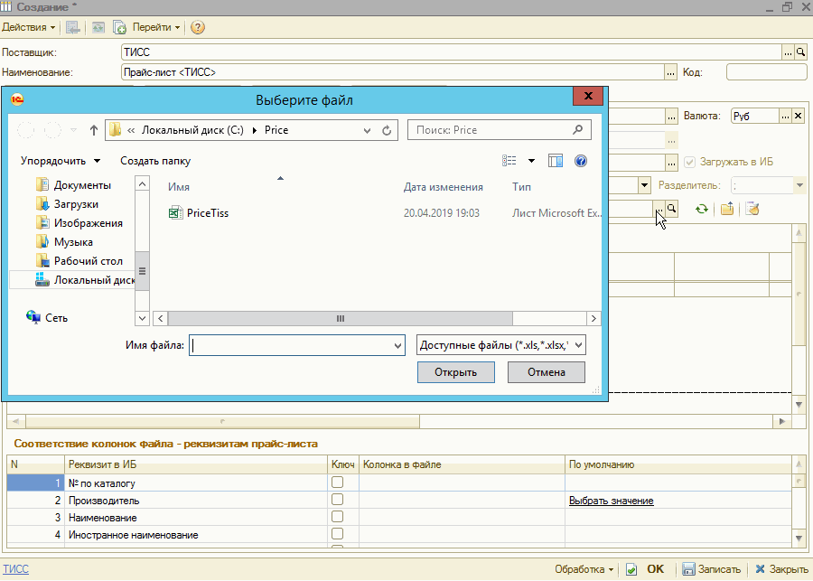
2. После выбора файла данные из файла предварительно отображаются в области интерактивной настройки соответствия колонок файла реквизитам прайс-листа

   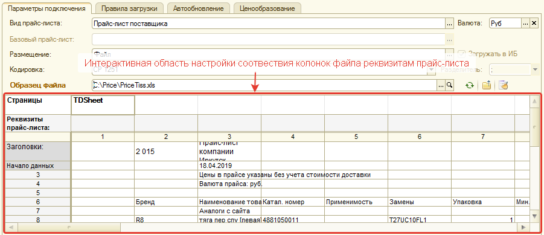
3. Для начала нужно определить область заголовка и область с данными.
4. Найдите строку с заголовками, в примере это строка 6. Двойным кликом мыши нажмите на строку с заголовками и в открывшемся контекстном меню выберите пункт «Строка с заголовками»:

   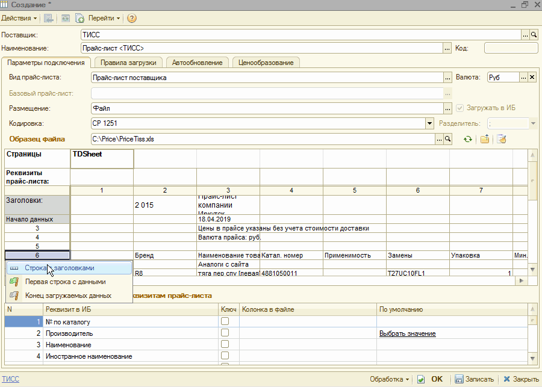
5. В появившемся окне нажмите "ОК" (подтверждение строки заголовка).Если в файле прайс-листа нет заголовков, то в данном окне укажите значение 0 и нажмите "ОК".
6. Теперь необходимо сопоставить колонки в файле и реквизиты прайс-листа. Для этого над колонками интерактивной настройки соответствия колонок файла реквизитам прайс-листа двойным кликом выставите сопоставления:

   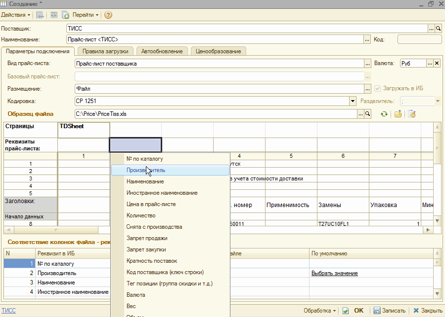

   Обязательно должны быть указаны сопоставления для реквизитов: Производитель, № по каталогу, Цена, - остальные реквизиты заполняются по наличию. Описание реквизитов см. *[Описание реквизитов прайс-листа](https://5systems.ru/help/opisanie-rekvizitov-prays-lista)*.

   **Обратите внимание!** Если прайс-лист сформирован по одному производителю и в файле производитель не указан, то можно в разделе "Сопоставление колонок файла - реквизитам прайс-листа" напротив реквизита "Производитель" указать значение по умолчанию, нажав на гиперссылку "Выбрать значение".
7. Чтобы в дальнейшем обновлять данные прайс-листа, необходимо задать ключевые реквизиты, по которым будет идентифицироваться уникальность позиции товара. По умолчанию Система считает ключевым реквизитом реквизит "Код поставщика". Если в прайс-листе не указан код поставщики для позиции товара, то необходимо изменить ключевые реквизиты. Для этого:
   1. снимите галочку "Ключ" возле реквизита "Код поставщика";
   2. установите галочку "Ключ" возле реквизитов "Производитель" и "№ по каталогу":

      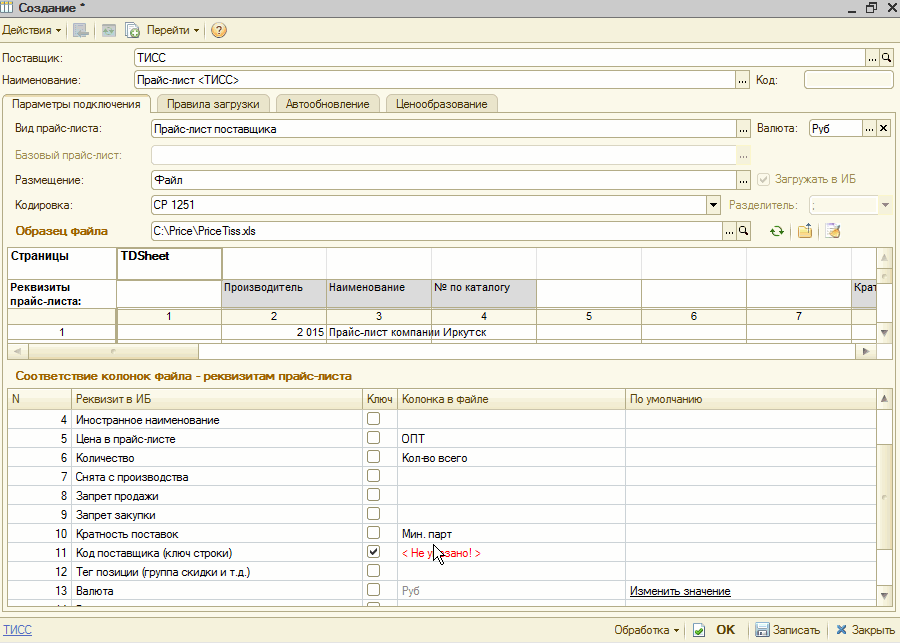
8. Основные настройки произведены, нажмите на кнопку "Записать":

   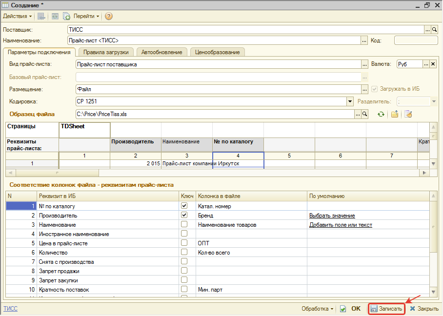

После задания основных параметров можно уже загрузить данные из файла прайс-листа вручную. Для этого:

1. Нажмите на кнопку "Обработка" и в появившемся контекстном меню выберите пункт "Загрузить прайс-лист (выбрать файл)":

   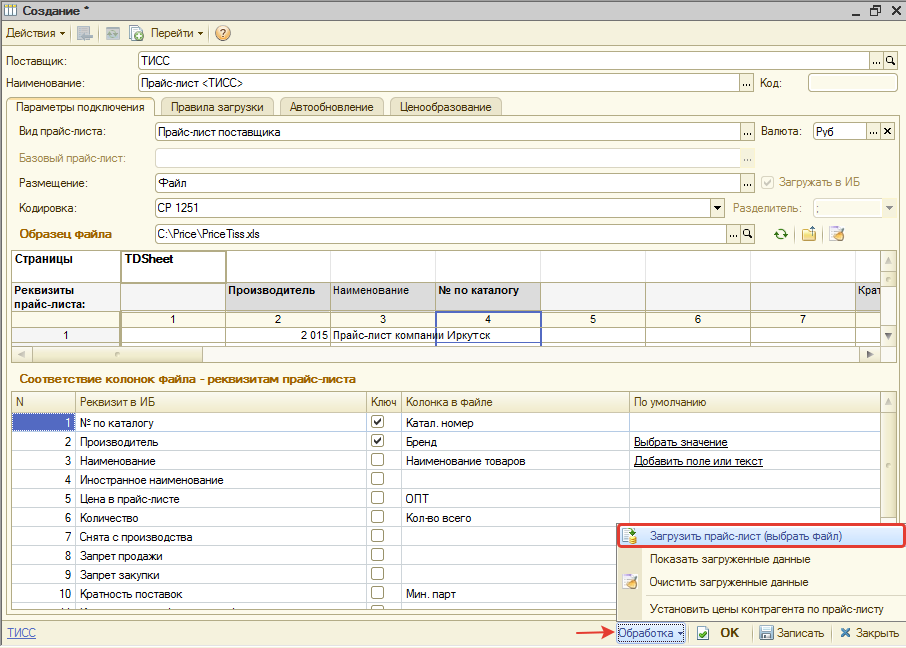
2. Выберите файл прайс-листа.

#### Настройка прайс-листа (Шаг 2). Доступ к прайс-листу

По умолчанию созданный прайс-лист сразу виден всем и по нему происходит поиск. Если необходимо пока скрыть прайс-лист (например, на время первоначальной настройки или в случае завершения работы с ним), то:

1. перейдите на вкладку "Ценообразование";
2. в разделе "Запрещен для поиска в подразделениях" установите соответствующие запреты;Установив галочку запрещено "Для всех", вы запретите поиск прайс-листа всем подразделениям. Если необходимо запретить поиск только для конкретных подразделений, то установите галочку напротив соответствующего подразделения, но снимите галочку напротив параметра "Для всех"
3. после изменений в настройках прайс-листа, нажмите кнопку "Записать".

#### Настройка прайс-листа (Шаг 3). Автообновление

Автоматическая загрузка и обновление прайс-листов настраивается на вкладке "Автообновление". Настройку необходимо производить только если есть желание, чтобы Система автоматически загружала все изменения по прайс-листам. В противном случае, можно просто каждый раз производить загрузку из файла вручную.

Но даже, если вы планируете каждый раз загружать прайс вручную, на вкладке "Автообновление" можно указать параметр "Актуальность данных". Данный параметр говорит о том, насколько часто поставщик обновляет прайс-листы и, если забыть загрузить обновления, то, по истечении указанного времени, позиции в прайс-листе будут подсвечены красным цветом. А, поставив галочку на параметр "Скрывать из поиска цен, если данные утратили актуальность" старые позиции вообще будут скрываться из поиска.

Для настройки автоматической загрузки для начала необходимо определить источник - откуда будет производится автообновление. Варианты загрузки были перечислены во введении. Для начала рассмотрим автоматическую загрузку из файла.

##### Настройка автоматической загрузки из файла

После настройки автоматической загрузки из файла достаточно будет просто обновлять файл с прайс-листом в указанной в настройках папке. Для настройки выполните следующие шаги:

1. Укажите сценарий проверки "Каталог на диске" - по умолчанию выбран данный сценарий.
2. Укажите сетевой путь к папке, из которой будет происходить автообновление:

   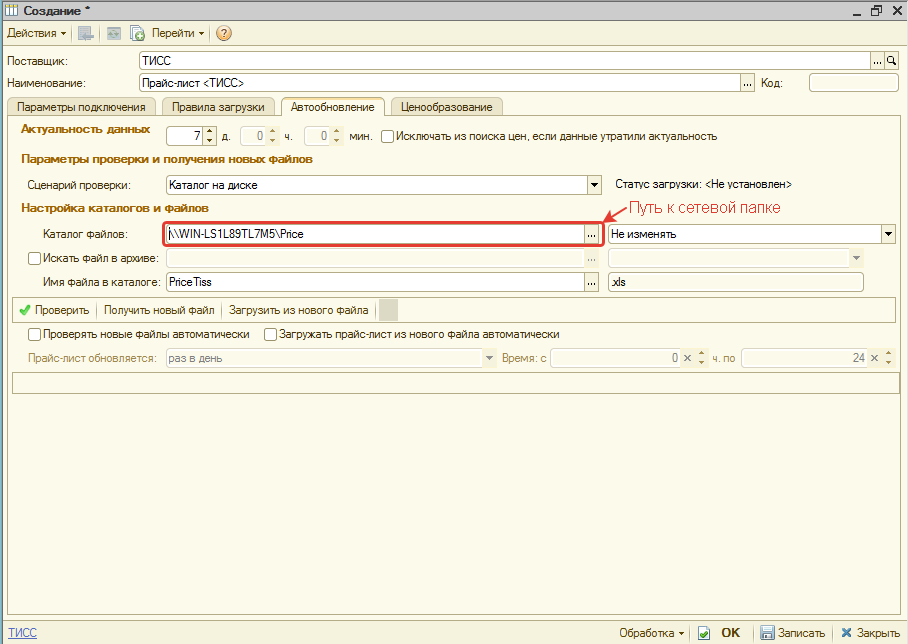

   По умолчанию указан путь из параметра "Образец файла", который был выбран при выполнении основных настроек. Но здесь важно, чтобы путь был задан именно *сетевой*, т.е. папка должна иметь общий доступ. Это важно потому, что автоматическая загрузка будет происходить со стороны сервера, а файл прайс-листа лежит на вашем локальном компьютере и, чтобы сервер мог получить доступ к нему, файл должен быть общедоступен.
3. После указания сетевого пути к папке нажмите на кнопку "Проверить":

   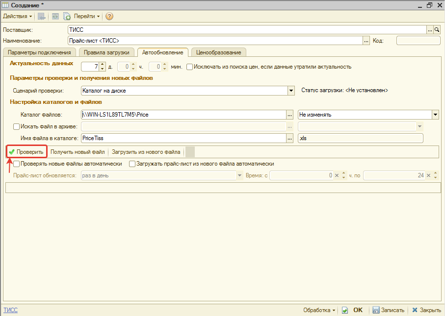
4. Если появилось окно с текстом "Каталог доступен", то сетевая папка доступна серверу и загрузка будет происходить без проблем с доступом.
5. Далее необходимо установить галочки "Проверять файлы автоматически", "Загружать прайс-лист из файла автоматически" и задать периодичность загрузки. Например, если известно, что прайс-лист будет обновляться раз в неделю, то можно установить параметр "Раз в неделю":

   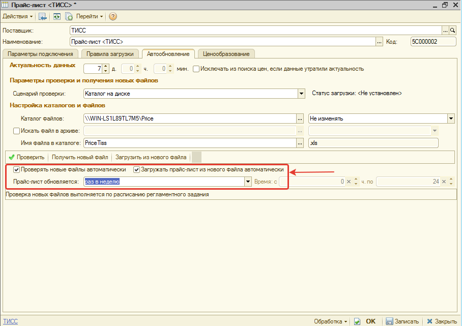
6. Нажмите на кнопку "Записать".

##### Настройка автоматической загрузки по e-mail

Для настройки загрузки по e-mail для начала необходимо определиться по какому протоколу подключаться к почтовому серверу: POP или IMAP. При подключении через POP в отличии от IMAP письма будут забираться с почтового сервера, а на самом почтовом сервере удаляться.

Рассмотрим подключение через протокол IMAP:

1. В поле «Сценарий проверки» выберите значение «Почтовый сервер (IMAP)».
2. После выбора значения отображается область настройки получения файлов c почтового сервера:

   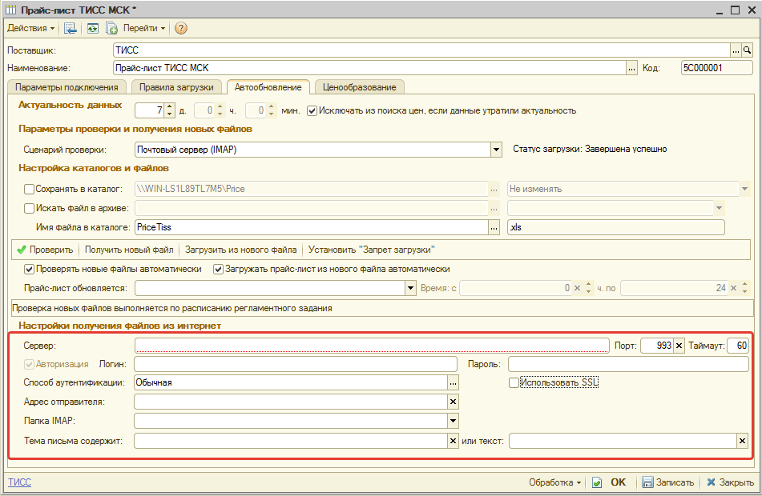
3. Укажите параметры почтового сервера для входящей почты. Параметры можно посмотреть в справке почтового сервера, где заведен e-mail. Например, для настройки почтового сервера на Яндексе можно посмотреть информацию здесь: [https://yandex.ru/support/mail/mail-clients.html](https://yandex.ru/support/mail/mail-clients.html). Исходя из данной справки можно произвести настройку следующим образом:

   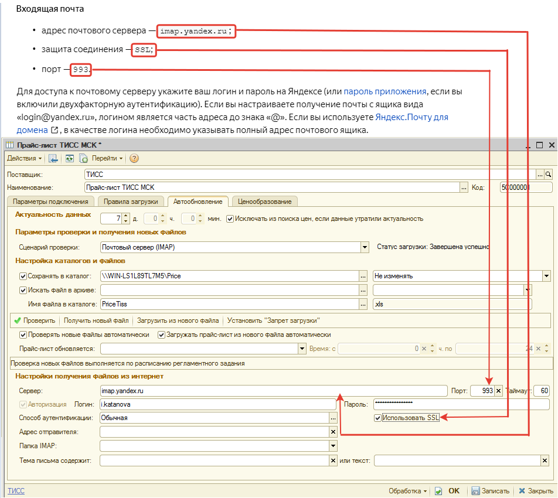
4. Далее необходимо указать фильтрацию для отбора писем. Для этого:
   1. В поле «Адрес отправителя» укажите почтовый адрес, с которого будут приходить письма поставщика с прайс-листом. При этом можно указать часть адреса, например, только логин или только домен.
   2. В поле «Папка IMAP» выберите папку, из которой забирать письма. Если не настроены свои папки для получения почты от поставщиков, то укажите папку «INBOX». Если настроена специальная папка, то выберите ее.
   3. В поле «Тема письма содержит» можно указать тему письма в виде маски, где допустимо использование спецсимволов «*», который обозначает любое число произвольных символов, и «?», который обозначает один произвольный символ.
   4. Можно также указать маску для отбора писем по содержанию письма. Для этого необходимо задать значение в поле «или текст». Пример настроенной фильтрации:

      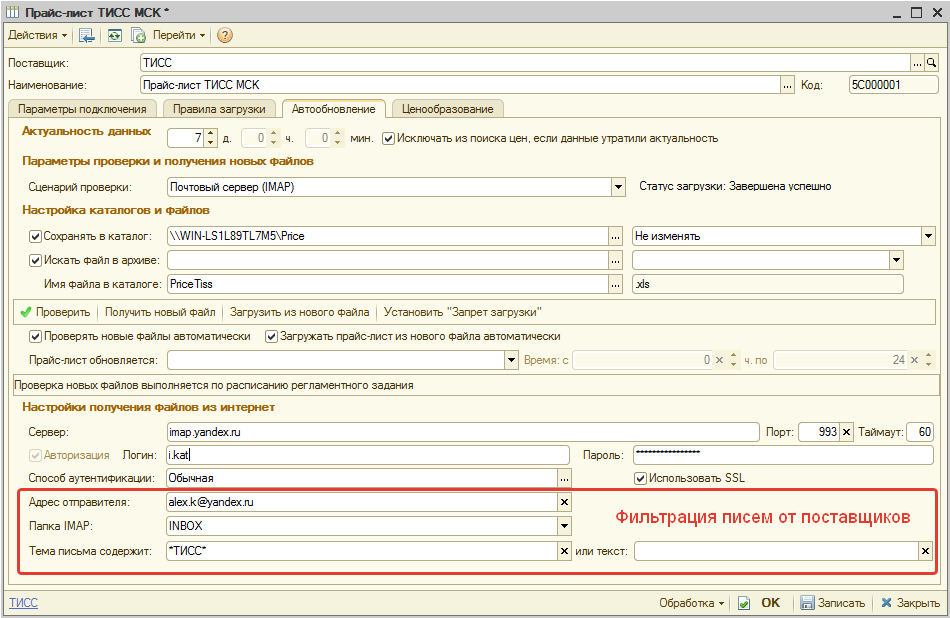
5. После задания параметров почтового сервера и параметров фильтрации писем можно проверить правильность произведенных настроек. Для этого необходимо нажать на кнопку «Проверить»:

   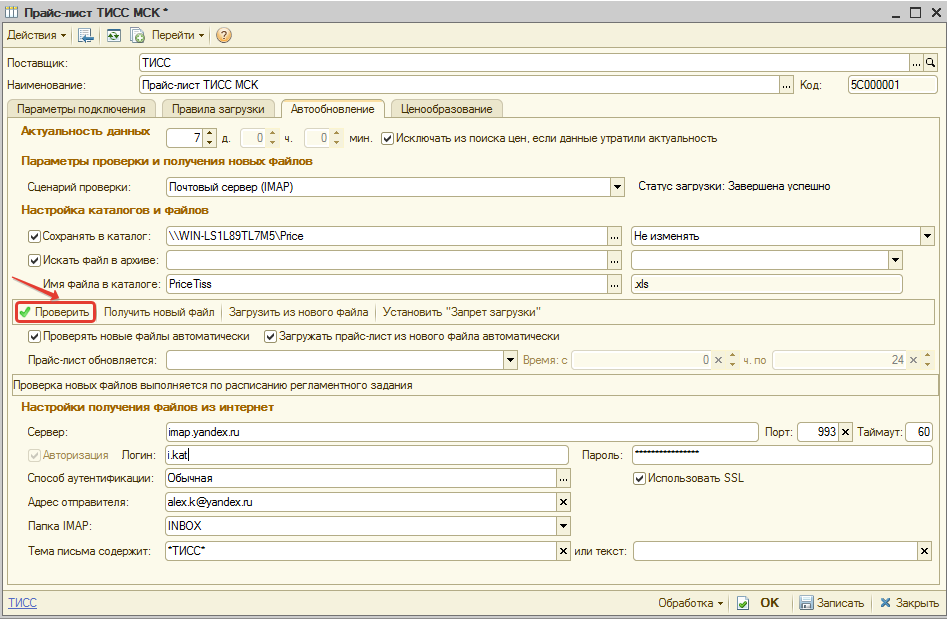
6. Если появилось сообщение об успешной проверке, то все настроено верно.
7. Кроме самих параметров почтового сервера необходимо произвести настройку каталогов и файлов. Для этого:
   1. Установите галочку «Сохранять в каталог» и укажите сетевую папку, куда будет производится загрузка с почтового сервера. Также рекомендуется проставлять опцию «Удалить файл», которая говорит о том, что файл удалится после завершения загрузки. Это рекомендуется настраивать, чтобы не загромождать дисковое пространство, а файлы итак сохраняются на почтовом сервере (если не хотите удалять, то можно выбрать опцию "Не изменять" или "в \Upload"):

      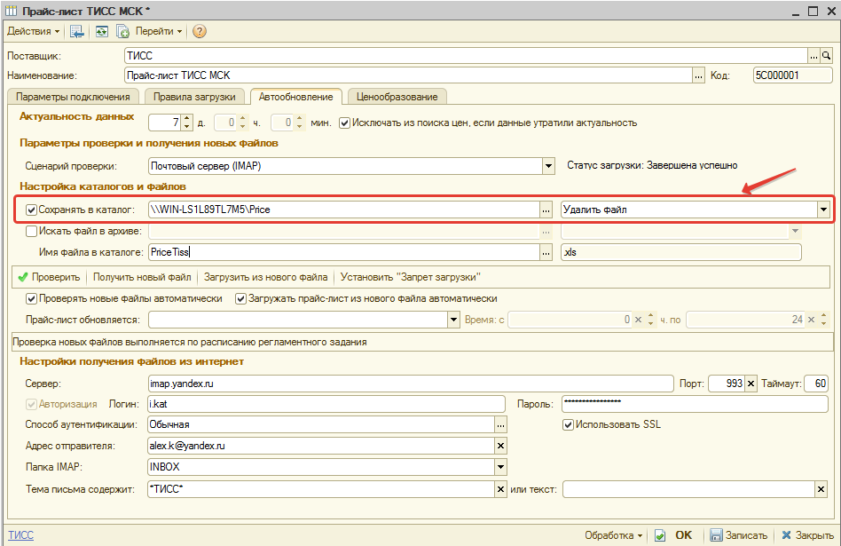
   2. Если файл прайс-листа приходит упакованный в архив, то нужно указать параметры архива. Для этого установите галочку «Искать файл в архиве» и выберите пример файла в архиве. При необходимости можно видоизменить имя архива, использую маску.
   3. При необходимости отредактируйте имя файла в каталоге (папке), также используя маску. Например, если файл приходит с указанием даты, то вместо даты можно использовать символ "*".
      **Обратите внимание!** Если файл упакован в архив, то в имени файла при использовании маски не должно быть кириллических (русских) символов. Лучше просто укажите символ "*"
8. Теперь можно запустить получение файла c почтового сервера вручную в указанный каталог, нажав на кнопку «Получить новый файл», чтобы проверить правильность произведенных настроек (для этого на указанном почтовом сервере должно быть непрочитанное письмо с заданными параметрами):

   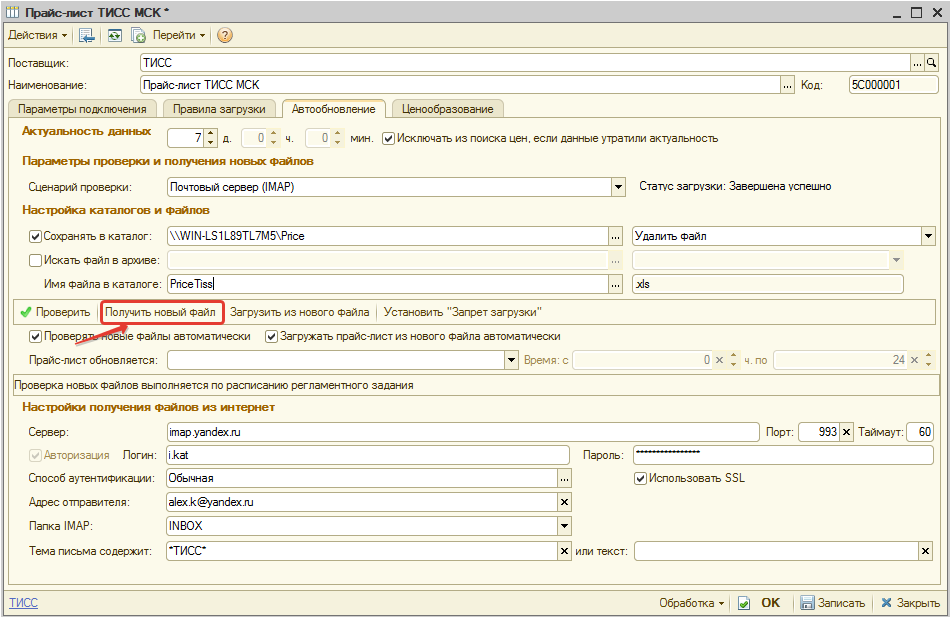
9. Также можно запустить загрузку вручную из полученного файла, нажав на кнопку «Загрузить из нового файла»:

   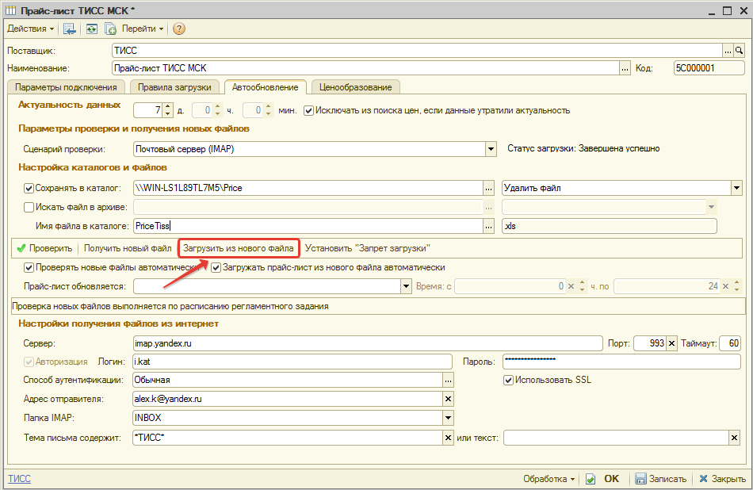
10. Для того, чтобы Система автоматически загружала новые прайс-листы, приходящие на почту, установите опции автообновления: "Проверять новые файлы автоматически" и "Загружать прайс-лист из нового файла автоматически". При этом не забудьте указать периодичность проверки. Например, раз в неделю в с 3 до 4 часов.Можно установить только автоматическую проверку без загрузки. Тогда Система, после получения нового файла, установит статус прайс-листа "Ожидает загрузку". В этом случае можете загрузить прайс-лист вручную из полученного файла, нажав на кнопку "Загрузить из нового файла" в карточке прайс-листа.

На этом настройка по e-mail завершена. Теперь при получении писем на указанный почтовый ящик будет автоматически обновляться прайс-лист.

##### Настройка автоматической загрузки с ftp-сервера

Для настройки загрузки с ftp-сервера для начала необходимо узнать параметры ftp-сервера. Их может предоставить тот, который настраивал его (например, системный администратор).

После этого можно приступать к настройке:

1. В поле «Сценарий проверки» выберите значение «Файловый сервер (FTP)» или «Файловый сервер (FTPS)» (в зависимости от протокола файлового сервера).
2. После выбора значения отображается область настройки получения файлов c файлового сервера:

   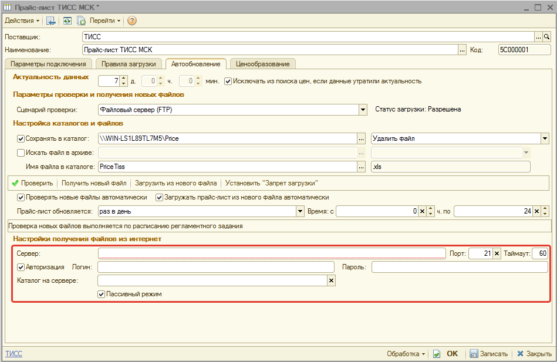
3. Укажите параметры сервера:
   1. Сервер - введите адрес файлового севера без указания протокола. Например, "avanta.ru".
   2. Порт - введите порт, если он отличается от значения по умолчанию.
   3. Авторизация - снимите галочку, если файловый сервер не предусматривает авторизацию.
   4. Логин/Пароль - введите параметры пользователя, если сервер предусматривает авторизацию и доступен определенному пользователю.
   5. Каталог на сервере - если прайс-листы будут располагаться не в корне файлового сервера, а в каком то каталоге, то укажите путь к этому каталогу. Например, "/prices/".
4. Далее настройка идентична настройкам загрузке по e-mail (см. *Настройка автоматической загрузки по e-mail* начиная с шага 5)

##### Настройка автоматической загрузки с http-сервера

Загрузка с http-сервера настраивается, если поставщик размещает свои прайс-листы на сайте и страница, на которой размещается прайс-лист имеет постоянный адрес.

Для настройки необходимо:

1. В поле «Сценарий проверки» выберите значение «Ссылку в интернет (HTTP)» или «Ссылку в интернет (HTTPS)» (в зависимости от протокола).
2. После выбора значения отображается область настройки получения файлов c http-сервера:

   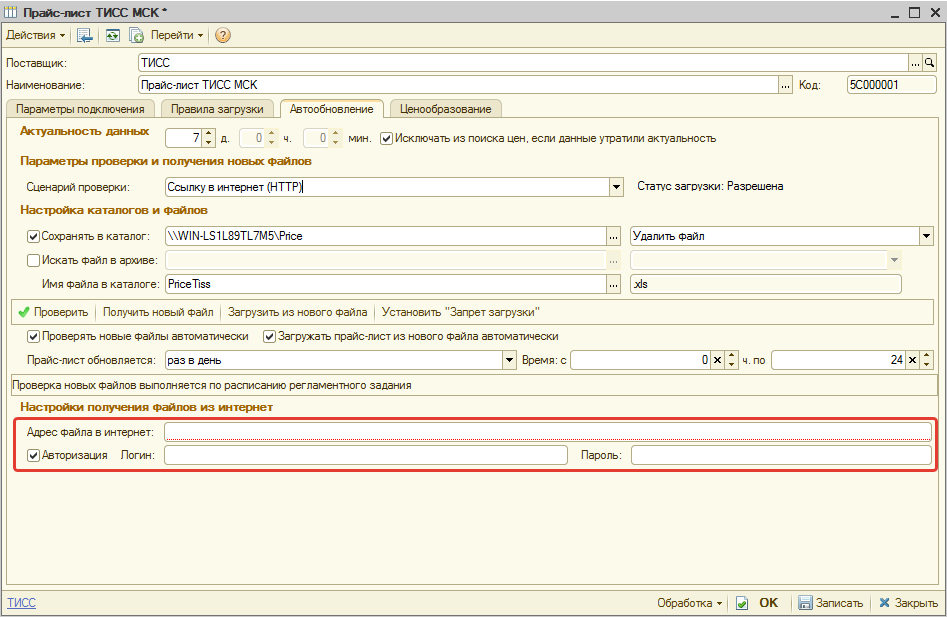
3. Укажите параметры сервера:
   1. Адрес файла в интернет - введите адрес страницы, где размещен прайс-лист.
   2. Авторизация - снимите галочку, если страница находится в общем доступе и не требует авторизации.
   3. Логин/Пароль - введите параметры пользователя, если для доступа к странице нужна авторизация.
4. Далее настройка идентична настройкам загрузке по e-mail (см. *Настройка автоматической загрузки по e-mail* начиная с шага 5)

---

**Теги:** прайс-лист, контрагент, загрузка прайс-листа, автообновление, e-mail, ftp, http

