

# Шинный отель

<table><tr><td><b>Время чтения:</b> 13 мин.</td><td><b>Обновлено:</b> 09.01.2025</td></tr></table>

Источник: https://www.5systems.ru/help/shinnyy-otel

## Содержание

1. [Введение](#введение)
2. [Логика процесса учета хранения шин](#логика-процесса-учета-хранения-шин)
   - [1. Оформление заявки](#1-оформление-заявки)
   - [2. Поступление шин на хранение](#2-поступление-шин-на-хранение)
   - [3. Возврат шин клиенту](#3-возврат-шин-клиенту)
   - [Отражение в финансовом учете](#отражение-в-финансовом-учете)
3. [АРМ "Шинный отель"](#арм-шинный-отель)
4. [Отчеты](#отчеты)
   - [1. Сроки хранения шин](#1-сроки-хранения-шин)
   - [2. Анализ выручки по услуге хранения шин](#2-анализ-выручки-по-услуге-хранения-шин)

## Введение

Учет оказания услуги сезонного хранения шин в системе выглядит следующим образом:

- приемка шин от клиента, осмотр на наличие повреждений;
- печать бирок для шин, выдача документов клиенту;
- прием оплаты за услугу хранения шин от клиента;
- перевозка шин на склад на хранение;
- по окончании срока хранения – выдача шин клиенту.

Все операции выполняются в рамках документа *"Заявка на хранение шин"* и создаваемых на его основании документов.

Для автоматизации учета сезонного хранения шин используется специальный *АРМ "Шинный отель"* – см. *[ниже](#арм-шинный-отель).*

## Логика процесса учета хранения шин

### 1. Оформление заявки

При поступлении заявки на хранение шин в системе оформляется документ "Заявка на хранение шин" – *меню Автосервис → Приемка → Хранение шин → Заявки на хранение шин:*

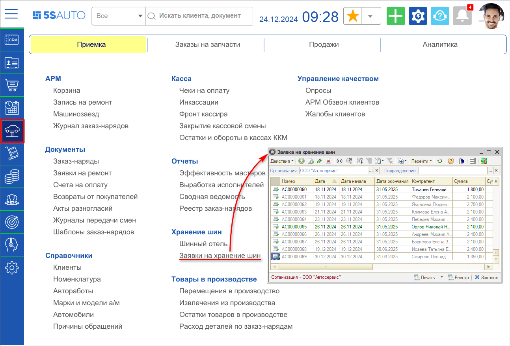

Для оформления предварительной заявки на хранение шин необходимо создать документ "Заявка на хранение шин":

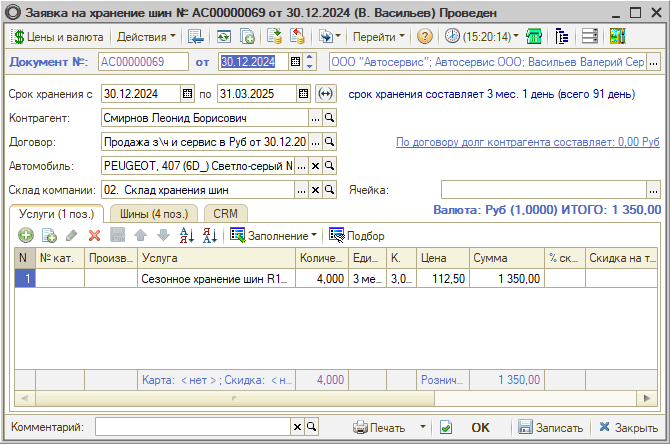

***Реквизиты документа:***

- *Срок хранения* – дата начала и дата окончания хранения шин.
- *Контрагент* – клиент, который сдает шины на хранение.
- *Договор* – договор взаиморасчетов с контрагентом.
- *Автомобиль* – автомобиль клиента, на который установлены шины.
- *Склад* – склад компании, на котором предположительно будут хранится шины. В дальнейшем в документе "Расходный складской ордер" может быть выбран другой склад. Вид склада должен быть "Ордерный и ячеистый" или "Ордерный" (см. статью *"[Виды склада](../Виды%20склада/vidy-sklada.md)").* Использование розничного склада запрещено.
- *Ячейка* – ячейка склада, в которой предположительно будут храниться шины. Заполняется, когда в правах выбрано хранение шин комплектами. В этом случае все шины в заявке располагаются в данной ячейке.

***Вкладки документа:***

Документ имеет две вкладки: "Услуги" и "Шины". На вкладке "Услуги" отражаются все услуги, которые были оказаны по хранению шин. На вкладке "Шины" указываются непосредственно шины. Можно использовать кнопки автозаполнения и подбора.

***Вкладка "Услуги"***

*Колонки таблицы:*

- *Номенклатура* – услуги, оказываемые в рамках заявки по хранению шин.
- *Количество* – количество оказываемых услуг.
- *Единица измерения* – единица измерения услуги.
- *Коэффициент* – коэффициент пересчета по отношению к базовой единице услуги.
- *Цена* – цена услуги по хранению.
- *Сумма* – сумма всегда равна Цена\*Количество, всегда без скидки, НДС входит в сумму если это указано в типе цен.
- *Процент скидки* – процент скидки на услугу.
- *Скидка* – сумма скидки по строке документа.
- *Всего* – итоговая сумма по строке документа со всеми налогами.
- *Процент НДС* – ставка НДС по услуге.
- *НДС* – сумма НДС по услуге.
- *Характеристика номенклатуры* – характеристика услуги.

***Вкладка "Шины"***

*Колонки таблицы:*

- *Номенклатура* – шина, принимаемая на хранение.
- *Диск* – вид диска, установленного вместе с шиной.
- *Количество* – количество шин.
- *Единица измерения* – единица измерения шины.
- *Коэффициент* – коэффициент пересчета по отношению к базовой единице.
- *Расположение шины* – расположение шины на автомобиле.
- *Характеристика номенклатуры* – характеристика шины в зависимости от выбранного способа учета характеристик для данной номенклатуры (вида номенклатуры).
- *Примечание* – описание шины, сдаваемой на хранение. В примечание могут быть добавлены повреждения – значения из справочника "Дефекты". Выбранные в справочнике значения добавляются в примечание в виде строки.
- *Ячейка* – ячейка хранения, в которой предполагается хранение шины. Заполняется, когда в правах запрещено хранение шин комплектами. В этом случае все шины в заявке могут располагаться в различных ячейках.

Дополнительно можно *прикрепить к документу фотографии.*

По умолчанию в таблицу на данной вкладке добавлено 5 строк с заполненной колонкой "Расположение". Для более быстрого заполнению можно воспользоваться кнопкой "Заполнение" → "Заполнить шинами по умолчанию".

*Цвет текста строк* таблицы "Шины" зависит от *состояния документа:*

- *Черный* – документ находится в состоянии "Новая заявка", шины на основании этой заявки еще не приходовались на склад и не выдавались клиенту.
- *Зеленый* – документ находится в состоянии "Шины приняты", на основании этой заявки был введен документ "Приходный складской ордер", оприходованным этим ордером шины числятся на складе.
- *Серый* – документ находится в состоянии "Шины выданы", когда все переданные на хранение по этой заявке шины были выданы клиенту.

***Печатные формы:***

- *Акт приема-передачи* – акт приема-передачи шин на сезонное хранение. Содержит перечень шин и их характеристики. Является частью договора на хранение шин.
- *Бирки* – бирки для хранения. Печатаются на каждую шину индивидуально, используются для маркировки шин на складе.
- *Договор хранения* – договор сезонного хранения шин.
- *Договор хранения (шаблон)* – договор сезонного хранения шин в виде шаблона печатной формы для Microsoft Office и Open Office.
- *Заявка на хранение шин* – бланк заявки для ручного заполнения мастером автосервиса.

Данный документ не делает движений по регистрам, а поэтому после оформления заявки в базе не возникает задолженности контрагента и не появляются остатки на складах.

### 2. Поступление шин на хранение

Передача шин на хранение и поступление их на склад оформляется документом *"Приходный складской ордер шин".*

При вводе на основании "Заявки на хранение шин" данный документ заполняется автоматически:

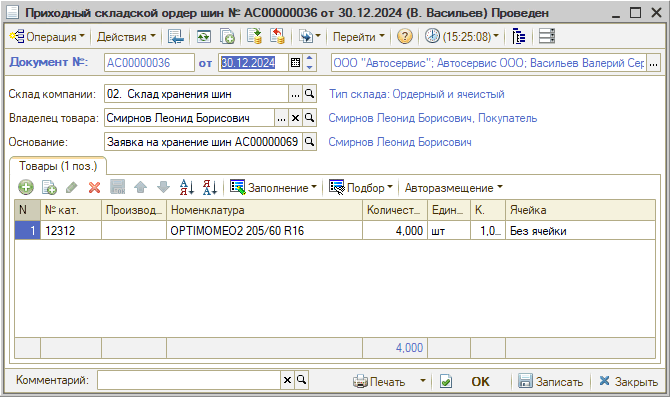

*Документ делает движения по регистру накопления "Остатки товаров ордерный склад" (кнопка "Перейти → Движения документа"):*

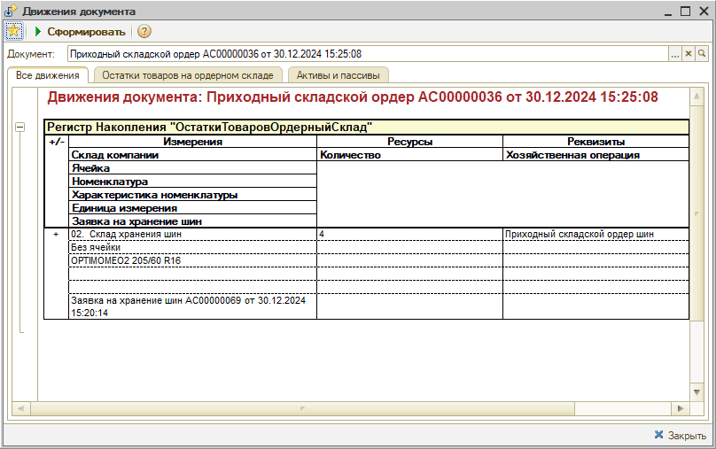

Шины приходуются только на ячеистый склад для того, чтобы не было возможности использовать их как товар. Т.е. для того чтобы пользователь не смог по ошибке продать взятые на хранение шины.

### 3. Возврат шин клиенту

Для возврата шин клиенту после окончания срока хранения на основании "Заявки на хранение шин" вводится документ *"Расходный складской ордер шин":*

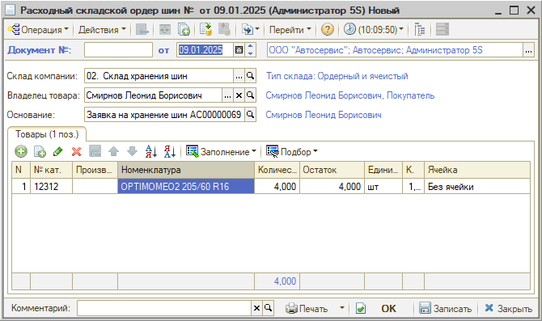

Данный документ также делает движения по регистру накопления "Остатки накопления ордерный склад" – списывает остатки с данного склада.

### Отражение в финансовом учете

Помимо складского учета важной является финансовая сторона учета хранения шин.

Факт оказания услуг по хранению шин отражается документом "Реализация товаров", при его формировании возникают взаиморасчеты с контрагентами.

Для приема оплаты необходимо на основании "Заявки на хранение шин" создать документ "Реализация товаров". В таком случае реализация автоматически формируется с хозяйственной операцией "Акт об оказании услуг" и заполняется данными:

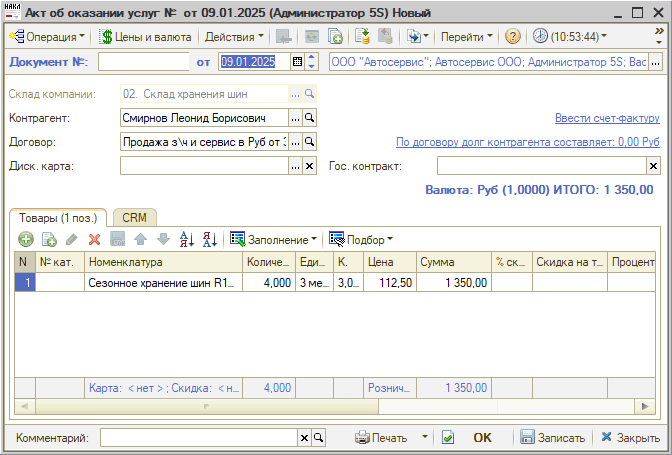

В случае необходимости на основании Акта также выписывается Счет-фактура.

Затем на основании "Акта об оказании услуг" вводится платежный документ (например, Приходный кассовый ордер, Расходный кассовый ордер, Банковская выписка) и закрываются взаиморасчеты с клиентом.

## АРМ "Шинный отель"

Для более быстрой и удобной работы по учету хранения шин в программе существует *АРМ "Шинный отель".*

*АРМ "Шинный отель"* представляет собой рабочее место мастера по приему и выдаче шин на сезонное хранение автосервиса. Предназначено для оформления Заявки на хранение шин, а также для ввода подчиненных документов.

Переход к АРМ осуществляется через меню *Автосервис → Приемка → Хранение шин → Шинный отель:*

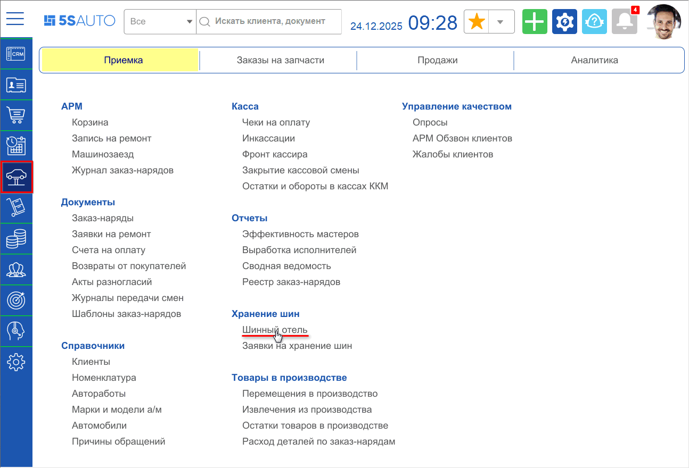

В окне АРМ следует открыть для редактирования имеющийся документ "Заявка на хранение шин" либо создать новый.

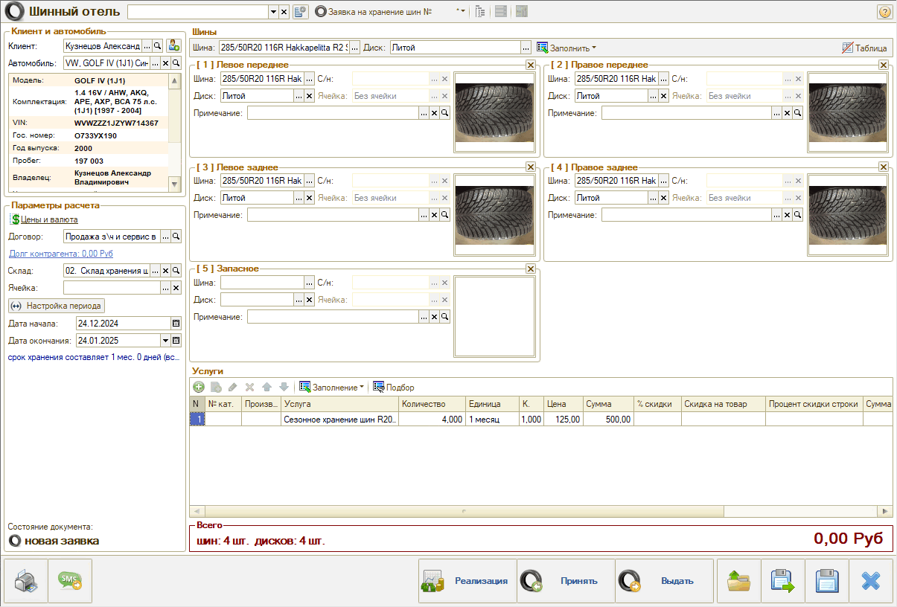

Для *поиска* используется строка заголовка АРМ. Есть возможность искать по различным критериям: по номеру документа, по наименованию контрагента, по наименованию, гос. номеру или VIN-коду автомобиля, а также по комментарию к документу.

Кнопка "Настройка полей поиска" служит для указания перечня полей, по которым производится поиск. В форме настройки полей поиска обязательно должно быть выбрано хотя бы одно поле.

Также можно воспользоваться кнопкой "Выбрать документ в списке и загрузить в АРМ" на нижней панели – при этом открывается список документов "Заявка на хранение шин".

При *создании новой заявки* через АРМ, так же как и в документе, необходимо указать клиента, автомобиль, сроки хранения и т.д. – заполнить параметры в *разделах **"Клиент и автомобиль"*** и ***"Параметры расчета".***

В *разделе **"Шины"*** следует выбрать шину и диск, затем нажать кнопку "Заполнить" и выбрать вариант, сколько шин принимается на хранение – 4 или 5. Ячейки будут заполнены указанными значениями.

Назначение реквизитов в ячейках эквивалентно содержимому таблицы документа "Заявка на хранение шин". В поле "Фотография шины" может быть добавлено фото.

Раздел "Шины" по умолчанию отображается в виде ячеек. При нажатии на кнопку *"Таблица / Ячейки"* можно переключиться на вид "Таблица" и обратно:

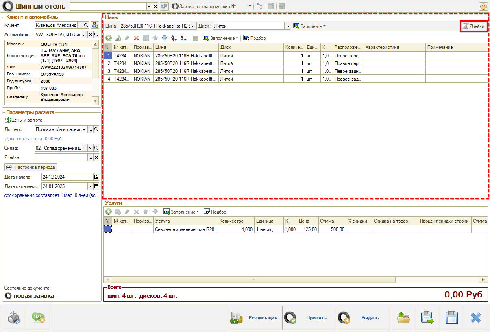

*Раздел **"Услуги"*** содержит таблицу вкладки "Услуги" документа "Заявка на хранение шин".

После заполнения всех полей необходимо ***сохранить*** заявку нажатием на дискету в правом нижнем углу экрана.

Далее следует нажатием на кнопку ***"Принять"*** создать "Приходный складской ордер".

Для отражения выдачи шин клиенту необходимо нажатием на кнопку ***"Выдать"*** создать "Расходный складской ордер".

Для формирования документа "Акт об оказании услуг" следует перейти по кнопке ***"Реализация".***

Нажатием на кнопку ***"Печать"*** в нижнем левом углу можно распечатать необходимые документы.

## Отчеты

### 1. Сроки хранения шин

Переход к отчету производится через типовое меню *Отчеты → Складской учет → Сроки хранения шин.* Отчет формируется на дату – автоматически устанавливается текущая.

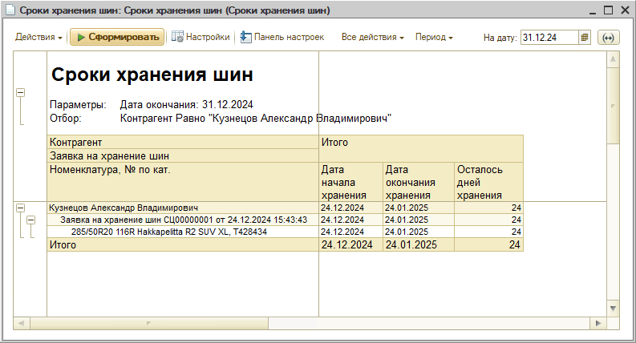

В настройках можно изменить порядок группировки строк и добавить нужные или убрать лишние колонки:

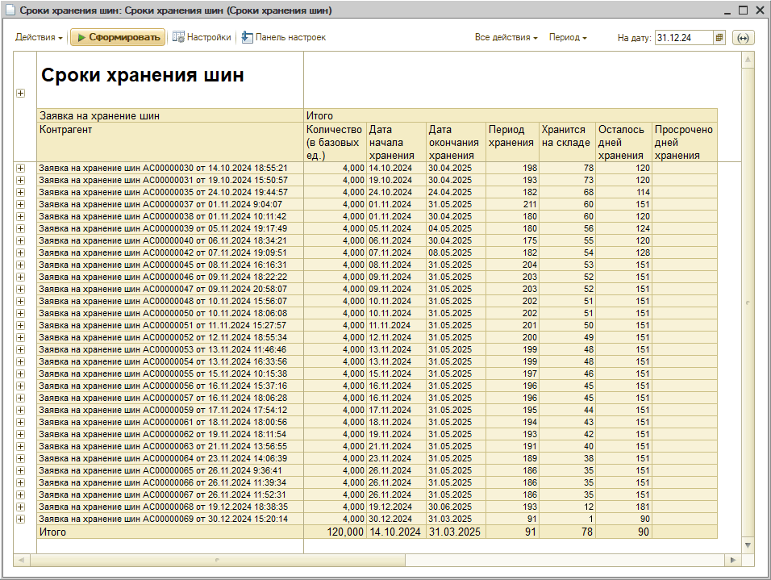

***Показатели отчета:***

- *Количество* – количество шин.
- *Дата начала хранения* – дата начала хранения шин.
- *Дата окончания хранения* – дата окончания хранения шин.
- *Период хранения* – период хранения шин.
- *Хранится на складе* – количество дней, прошедших с начала периода хранения шин на складе.
- *Осталось дней хранения* – количество дней, оставшихся до окончания периода хранения шин.
- *Просрочено дней хранения* – количество дней хранения шин, прошедших после даты окончания периода хранения шин.

В нижней строке ***"Итого"*** по периодам и датам отображается минимальное значение, т.е. можно увидеть, через сколько дней минимум освободится на складе место для хранения шин.

На основании данных отчета можно оповестить клиента, что у него заканчивается срок сезонного хранения и шин и заодно предложить услугу шиномонтажа.

### 2. Анализ выручки по услуге хранения шин

Проанализировать выручку по услуге хранения шин можно при помощи отчета *"Анализ продаж и торговой наценки"* (Автосервис → Аналитика → Базовые отчеты).

В настройках следует установить отбор по номенклатуре "Услуги по хранению шин", убрать лишние колонки (Себестоимость, Сумма по заказ-нарядам и др.), также можно добавить группировку строк по подразделению:

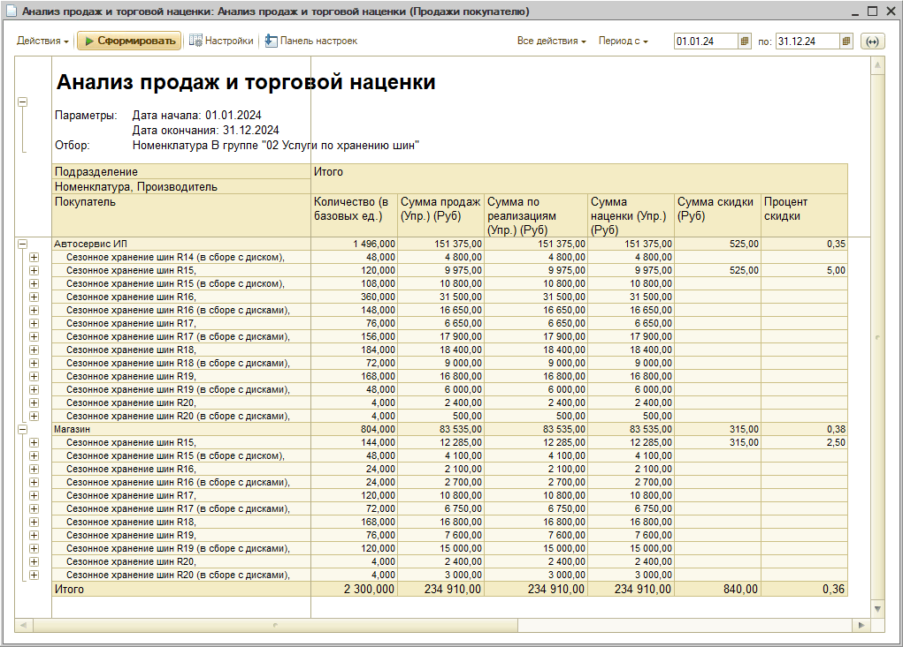

---

**Теги:** шинный отель, хранение шин, заявка на хранение шин, складской ордер, ячеистый склад, сроки хранения, акт об оказании услуг

