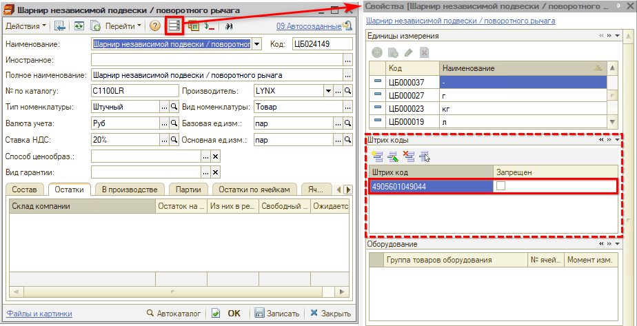
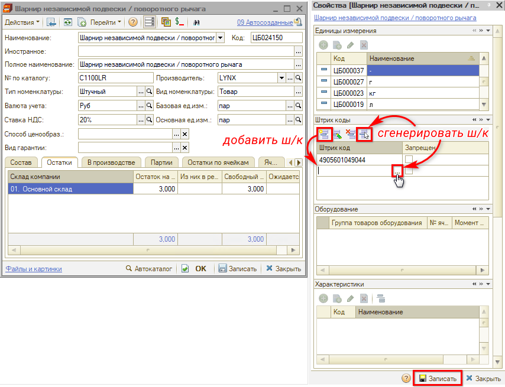

# Назначение штрихкодов товарам

<table><tr><td><b>Время чтения:</b> 4 мин.</td><td><b>Обновлено:</b> 30.10.2024</td></tr></table>

Источник: https://www.5systems.ru/help/naznachenie-shtrikhkodov-tovaram

## Содержание

- [Введение](#введение)
- [Присвоение штрихкода номенклатуре](#присвоение-штрихкода-номенклатуре)
- [Процесс сканирования](#процесс-сканирования)

## Введение

У номенклатуры в программе есть важный атрибут - ***штрихкод***. Штрихкоды помогают оперативно работать с товарными позициями при проведении различных операций: приемка, отгрузка, инвентаризация, возврат товаров и т.п. Оперативность работы достигается тем, что не нужно вручную искать товарные позиции, а достаточно считать штрихкод с помощью сканера ш/к, и необходимая позиция отобразится на экране автоматически.

Организовать работу со штрихкодами можно по-разному:

- использовать свои внутренние штрихкоды для товарных позиций,
- использовать заводские штрихкоды производителей и присваивать собственные, если у товара не задан заводской,
- комбинировать собственный и заводской штрихкоды.

Для начала работы со штрихкодами необходимо:

1. Присвоить штрихкоды номенклатуре.
2. Подключить сканер штрихкодов.
3. Организовать печать этикеток (см. *[Печать этикеток](https://5systems.ru/help/pechat-etiketok)*), если сканирование товаров планируется производить через сканеры штрихкодов, подключенные через COM-порт.

## Присвоение штрихкода номенклатуре

***Штрихкоды товаров отображаются*** на панели свойств в карточке [номенклатуры](../../Номенклатура/nomenklatura.md):

**Чтобы добавить штрихкод**:

- нажмите кнопку "Добавить штрихкод",
- в появившееся поле введите штрихкод вручную или нажмите кнопку выбора для автоматической генерации ш/к,
- либо нажмите кнопку "Сформировать штрихкод" — при этом ш/к сразу будет сгенерирован автоматически,
- *сохраните изменения*, нажав кнопку *"Записать"* на панели свойств номенклатуры.

Также есть возможность присваивать штрихкоды товарам в процессе работы с интерфейсом ТСД – см. в *[статье](https://www.5systems.ru/help/interfeys-dlya-tsd#prisvoenieshk).*

В случае использования функционала *распознавания товаров при сканировании ш/к* методом обращения к данным сервиса 5S Cloud полученный ш/к записывается в свойства номенклатуры автоматически — подробнее см. в статье *"[Сканирование штрихкодов товаров](../Сканирование%20штрихкодов/skanirovanie-shtrikhkodov-tovarov.md)".*

## Процесс сканирования

Для сканирования товара предварительно должен быть подключен сканер штрихкодов – см. статью *"[Подключение сканера штрихкодов](../Подключение%20сканера%20штрихкодов/podklyuchenie-skanera-shtrikhkodov.md)"*.

Если при сканировании товаров открыт *справочник "Номенклатура",* то на распознанную товарную позицию установится курсор.

Если при сканировании ш/к открыта *форма документа* с перечнем товарных позиций (Поступление товаров, Реализация товаров, Заказ-наряд и т. д.), то:

- если распознанный товар отсутствует в списке товарных позиций, то он добавится в количестве = 1;
- если распознанный товар присутствует в списке товарных позиций, то его количество увеличится на 1.

Если самому документу присвоен штрихкод, то при его сканировании и открытом списке документов (Поступление товаров, Реализация товаров, Заказ-наряд и т. д.) курсор установится на распознанный документ.

Также в программе реализован механизм *распознавания товаров при сканировании ш/к* методом обращения к данным сервиса 5S Cloud. Если ш/к не найден в программе, происходит получение артикула/производителя/наименования из данных сервиса:

- если по артикулу и производителю найдена соответствующая карточка в программе, то ш/к записывается в свойства номенклатуры;
- если соответствующий товар не найден в базе, программа создает новую карточку с данными, полученными из сервиса.

Подробнее см. в статье *"[Сканирование штрихкодов товаров](../Сканирование%20штрихкодов/skanirovanie-shtrikhkodov-tovarov.md)".*

---

**Теги:** штрихкод, назначение штрихкодов, номенклатура, сканирование

