

# Подключение сканера штрихкодов

<table><tr><td><b>Время чтения:</b> 8 мин.</td><td><b>Обновлено:</b> 05.02.2026</td></tr></table>

Источник: https://www.5systems.ru/help/podklyuchenie-skanera-shtrikhkodov

## Содержание

- [Введение](#введение)
- [Сканер, подключенный через COM-порт](#сканер-подключенный-через-com-порт)
- [Клавиатурный сканер штрихкодов](#клавиатурный-сканер-штрихкодов)

## Введение

В данной статье описан порядок подключения сканера штрихкодов.

О работе с функционалом сканирования штрихкодов см. статьи "[Сканирование штрихкодов товаров](../Сканирование%20штрихкодов/skanirovanie-shtrikhkodov-tovarov.md)", "[Назначение штрихкодов товарам](https://www.5systems.ru/help/naznachenie-shtrikhkodov-tovaram)", "<u>Штрихкодирование документов</u>" (в разработке). Также см. статью "[Интерфейс для ТСД](https://www.5systems.ru/help/interfeys-dlya-tsd)" о сканировании ш/к с помощью ТСД и его настройке.

## Сканер, подключенный через COM-порт

Для подключения сканера через COM-порт:

1. Перейдите в справочник "Оборудование" *(Администрирование → Сервис → Оборудование):*

   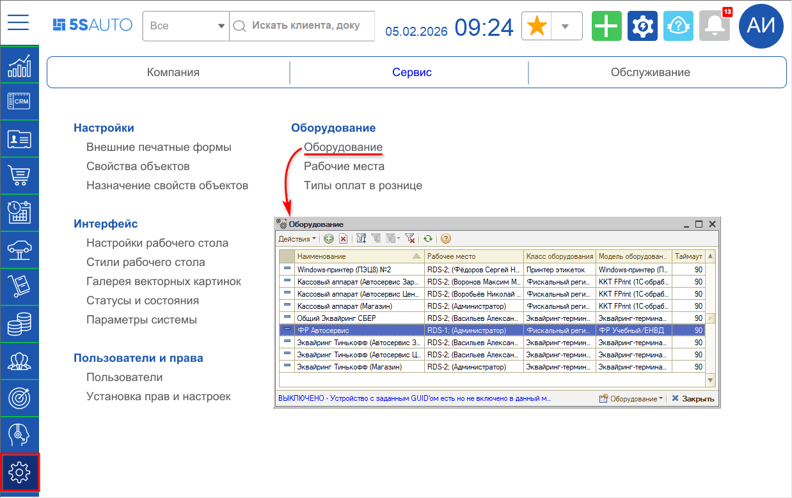
2. Перейдите в мастер добавления оборудования:

   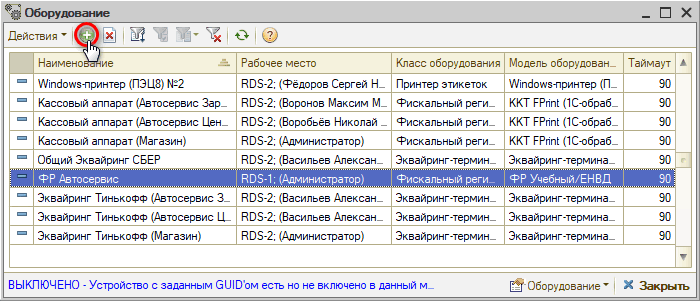
3. В мастере добавления оборудования:
   1. На первом шаге выберите интеграцию "Альфа-Авто" для перехода к настройке типового оборудования и нажмите "Далее":

      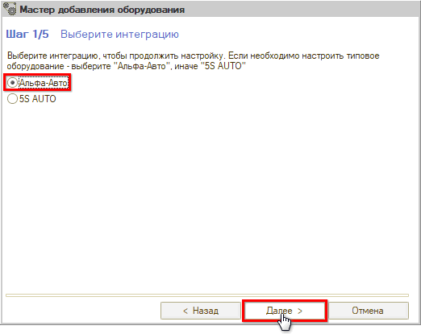
   2. На втором шаге выберите класс оборудования "Сканер штрихкодов, считыватель карт" и нажмите "Далее":

      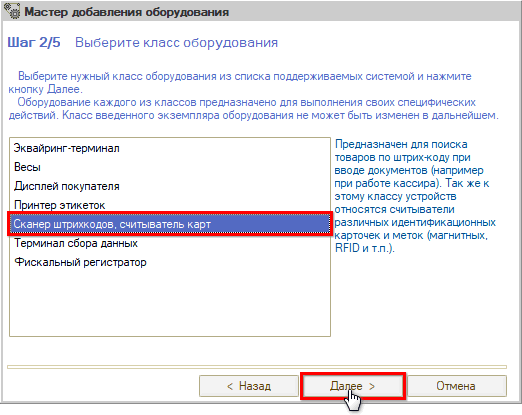
   3. На третьем шаге выберите модель оборудования "Сканер штрихкодов (RS-232)" и нажмите "Далее":

      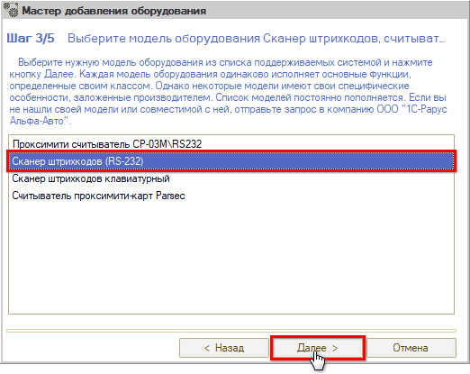
   4. На четвертом шаге выберите устройство "СОЗДАТЬ НОВОЕ УСТРОЙСТВО" и нажмите кнопку "Далее":

      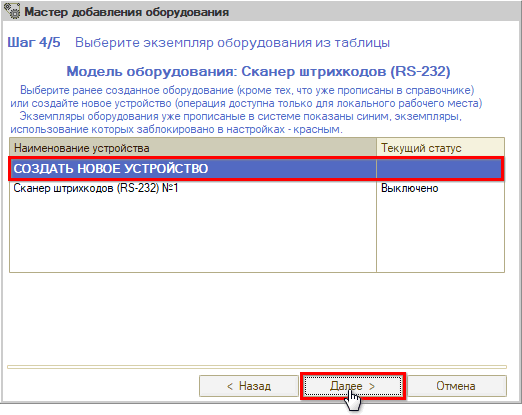
   5. В настройках оборудования обязательно укажите COM-порт, через который подключен сканер:

      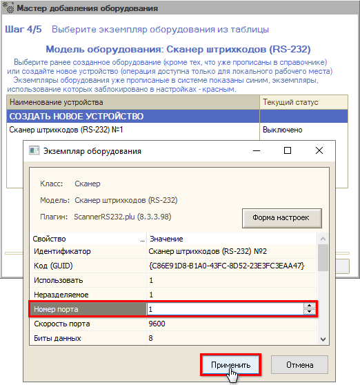
   6. На пятом шаге нажмите кнопку "ГОТОВО!" для завершения добавления:

      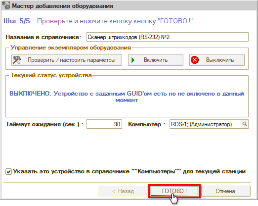

ГОТОВО! Сканер штрихкодов подключен через COM-порт. Теперь можно пробовать сканировать товары.

Сканер, подключенный через COM-порт, может работать в двух режимах: в режиме эмуляции COM-порта и как *клавиатурный*.

## Клавиатурный сканер штрихкодов

Подключение сканера штрихкодов в качестве клавиатурного позволяет воспринимать ввод цифр с клавиатуры в качестве считывания штрихкода.

Для подключения клавиатурного сканера штрихкодов:

1. Перейдите в справочник "Оборудование" *(Администрирование → Сервис → Оборудование):*

   
2. Перейдите в мастер добавления оборудования:

   
3. В мастере добавления оборудования:
   1. На первом шаге выберите интеграцию "Альфа-Авто" для перехода к настройке типового оборудования и нажмите "Далее":

      
   2. На втором шаге выберите класс оборудования "Сканер штрихкодов, считыватель карт" и нажмите "Далее":

      
   3. На третьем шаге выберите модель оборудования "Сканер штрихкодов клавиатурный" и нажмите "Далее":

      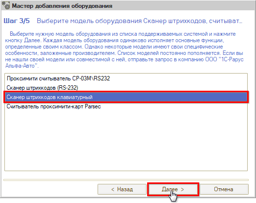
   4. На четвертом шаге выберите устройство "СОЗДАТЬ НОВОЕ УСТРОЙСТВО" и нажмите кнопку далее:

      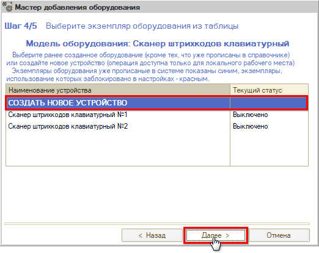
   5. В настройках оборудования определите префикс и постфикс для штрихкода, чтобы программа определяла, что вы вводите штрихкод:

      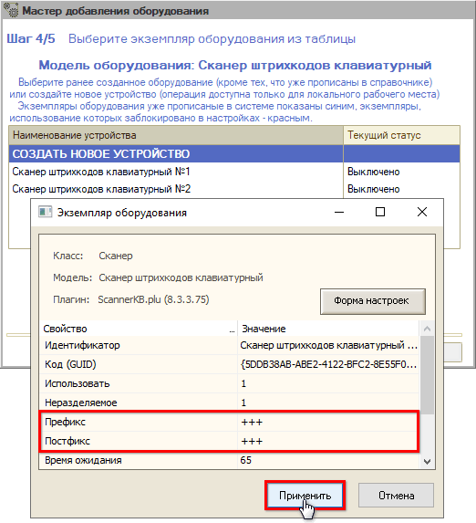
   6. На пятом шаге нажмите кнопку "ГОТОВО!" для завершения добавления:

      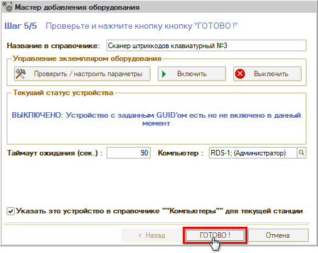

ГОТОВО! Клавиатурный сканер штрихкодов подключен.

Теперь необходимо убедиться, что на самом сканере настроены те же префиксы/постфиксы, что и в настройках программы. Для этого следуйте инструкции того оборудования, которое планируете использовать. Для примера см. [инструкцию](https://scancode.ru/upload/iblock/3fc/1170-manual.pdf) на стр. 15.

После проверки настроек самого оборудования, можете приступать к сканированию через ввод штрихкода с клавиатуры.

---

**Теги:** сканер штрихкодов, подключение оборудования, COM-порт, клавиатурный сканер

