

# Сканирование штрихкодов товаров

<table><tr><td><b>Время чтения:</b> 16 мин.</td><td><b>Обновлено:</b> 29.10.2024</td></tr></table>

Источник: https://www.5systems.ru/help/skanirovanie-shtrikhkodov-tovarov

*Актуально для релиза 2.8.1.*

## Содержание

- [Введение](#введение)
- [Сканирование в документе](#сканирование-в-документе)
- [Сканирование в справочнике номенклатуры](#сканирование-в-справочнике-номенклатуры)
- [Сканирование в интерфейсе ТСД](#сканирование-в-интерфейсе-тсд)
- [Настройки](#настройки)

## Введение

В программе реализован механизм *распознавания товаров при сканировании штрихкодов.*

Например, при сканировании товаров из открытой формы документа:

- если ш/к найден во внутреннем регистре сведений "Штрихкоды", товар сразу добавляется в документ;
- если ш/к не найден в программе, происходит получение артикула/производителя/наименования путем обращения к данным сервиса 5S Cloud;
- если товар по ш/к найден в данных сервиса, в программе создается новая карточка номенклатуры, и товар добавляется в документ.

Также реализована специальная методика для пополнения общей базы данных штрихкодов. При сканировании штрихкода поиск товара производится в соответствии со следующими приоритетами:

1. штрихкоды от производителей;
2. штрихкоды от поставщиков запчастей;
3. штрихкоды, загруженные от компаний–пользователей 5S AUTO.

Данная логика обеспечивает максимально корректное определение данных номенклатуры.

Для работы с функционалом предварительно должен быть [подключен сканер ш/к](../Подключение%20сканера%20штрихкодов/podklyuchenie-skanera-shtrikhkodov.md) либо [ТСД](https://www.5systems.ru/help/interfeys-dlya-tsd#nastrpodkloborud), настроена интеграция с [API 5S AUTO](https://www.5systems.ru/help/api-5s-auto), включено право *"Автоматическое создание номенклатуры при сканировании штрихкодов"* – см. *[ниже](#1-автоматическое-создание-номенклатуры-при-сканировании-штрихкодов),* а также настроено уведомление – см. *[ниже](#2-уведомление).*

## Сканирование в документе

Если при сканировании товаров открыта *форма документа* с перечнем товарных позиций (Поступление товаров, Реализация товаров, Заказ-наряд и т. д.), то могут быть следующие варианты:

#### 1. Штрихкод найден в базе

Если товар есть в базе, то он *добавляется в документ:*

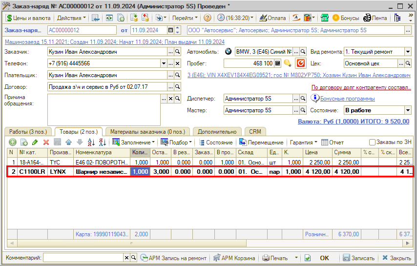

Если распознанный товар присутствует в списке товарных позиций, то при каждом повторном сканировании его *количество увеличится на 1.*

Также количество можно редактировать вручную. Кроме того, есть возможность включить настройку, чтобы при сканировании ш/к открывалось окно "Ввод параметров подбора", в котором можно сразу ввести нужное количество и цену товара – см. *[ниже](#vvod_param_podbora).*

#### 2. Штрихкод соответствует карточке товара

В случае если сканируемый штрихкод не был найден в программе, происходит обращение к внешней базе данных ш/к. Если в результате по артикулу и производителю найдена карточка номенклатуры в справочнике, то строка с товаром также *добавляется в документ* и появляется *уведомление* программы *"Штрих-код не найден":*

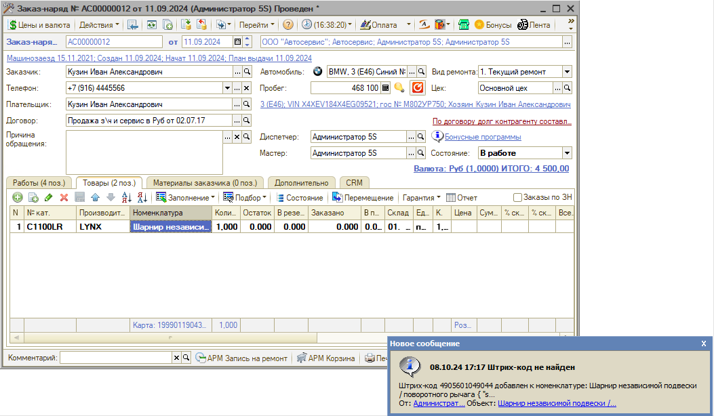

Отсканированный штрихкод при этом *записывается в свойства* найденной номенклатуры:

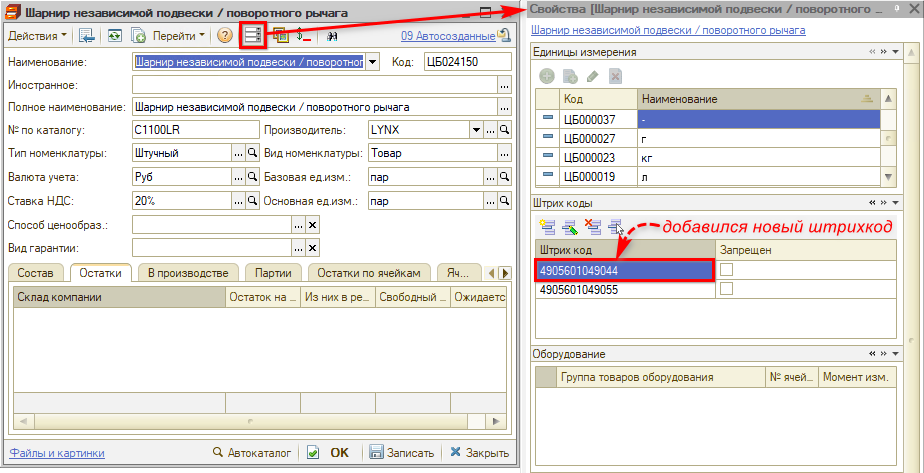

При повторном сканировании данного штрихкода товар сразу добавится в документ – см. *[выше](#1-штрихкод-найден-в-базе).*

#### 3. Штрихкод не найден

В случае если сканируемого штрихкода нет в базе, а найденный во внешней базе товар не соответствует по артикулу и производителю ни одной из карточек номенклатуры в справочнике, то выходит уведомление программы *"Штрих-код не найден. Создать номенклатуру?":*

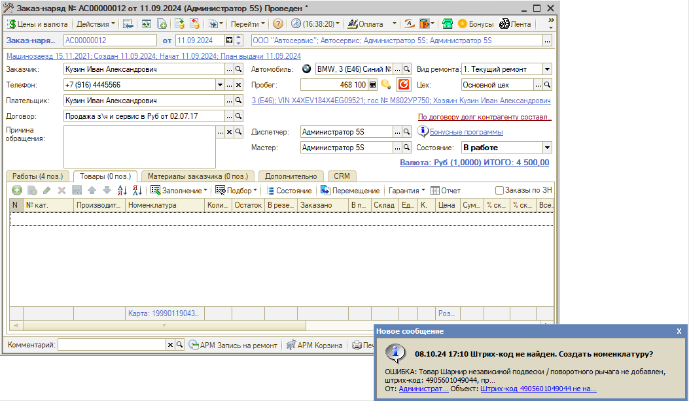

При *клике на ссылку* в тексте уведомления открывается окно *задачи* для создания новой номенклатуры. На данную форму подтягиваются артикул и производитель, а также наименование запчасти из внешней базы, если оно тоже было найдено:

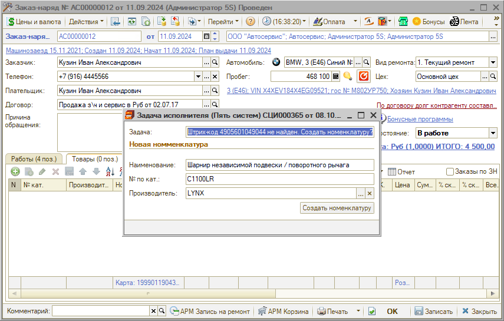

Следует проверить параметры и нажать кнопку *"Создать номенклатуру".*

В результате в справочнике "Номенклатура" создается новая карточка, штрихкод *записывается в свойства* объекта:

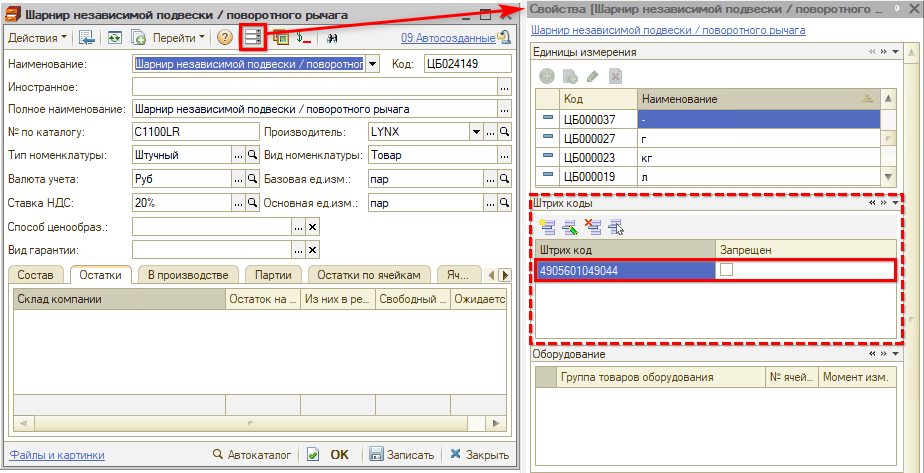

При повторном сканировании этого же штрихкода товар сразу добавится в документ – см. *[выше](#1-штрихкод-найден-в-базе).*

## Сканирование в справочнике Номенклатуры

Если при сканировании товаров открыт *справочник "Номенклатура",* могут быть следующие варианты:

#### 1. Штрихкод найден в базе

Если товар с таким штрихкодом *найден в базе,* произойдет *позиционирование на строке* с данным товаром в справочнике:

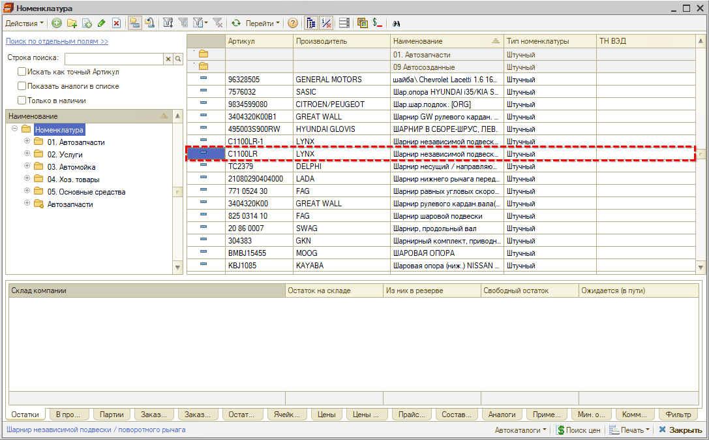

#### 2. Штрихкод соответствует карточке товара

Если сканируемого *штрихкода в программе нет,* но был *найден товар с соответствующим артикулом и наименованием,* то появляется окно с предложением добавить новый штрихкод в карточку номенклатуры, которая соответствует этому штрихкоду:

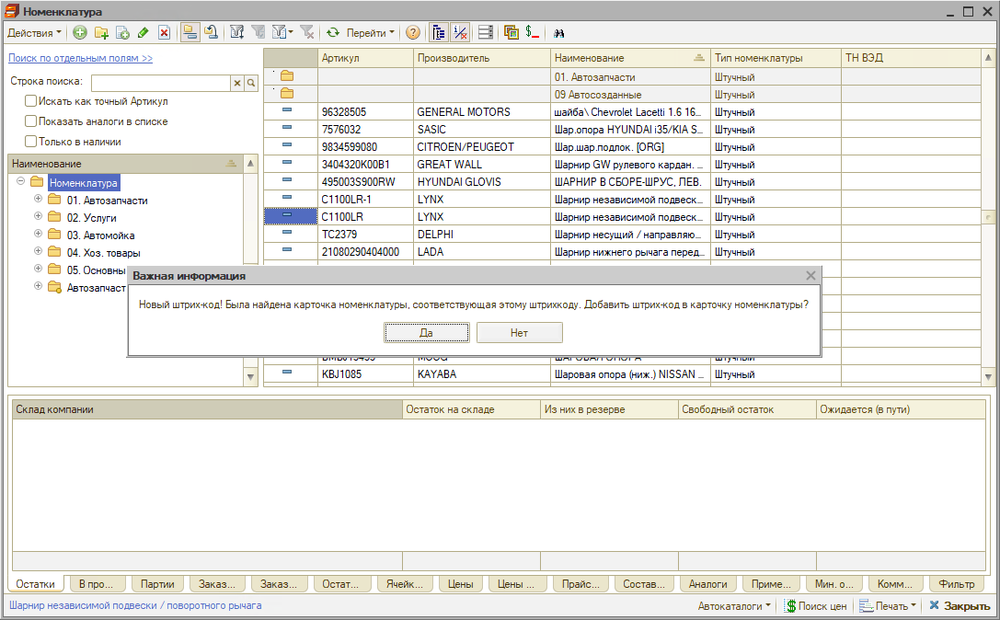

В случае согласия новый штрихкод добавляется в свойства найденной номенклатуры – см. скриншот *[выше](#shk_v_svoystva).*

#### 3. Штрихкод не найден

В случае если карточка номенклатуры, соответствующая сканируемому штрихкоду, не была найдена в базе, программа предлагает создать новую карточку:

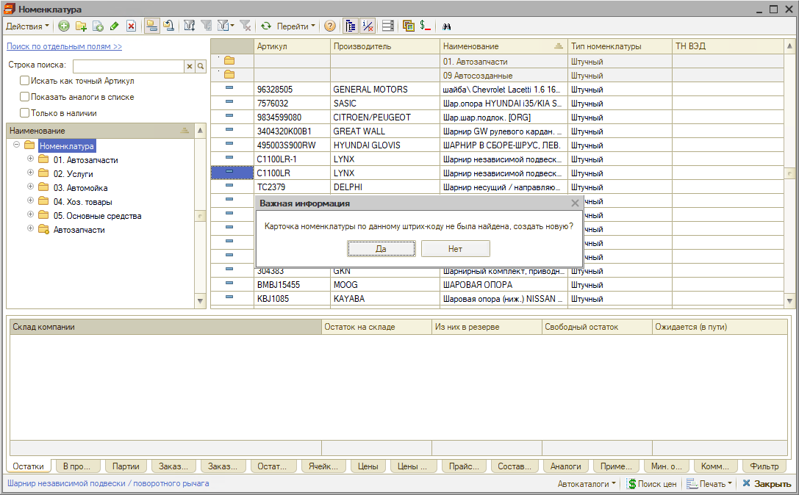

Следует нажать кнопку *"Да"* – в результате в справочник добавляется новая запись:

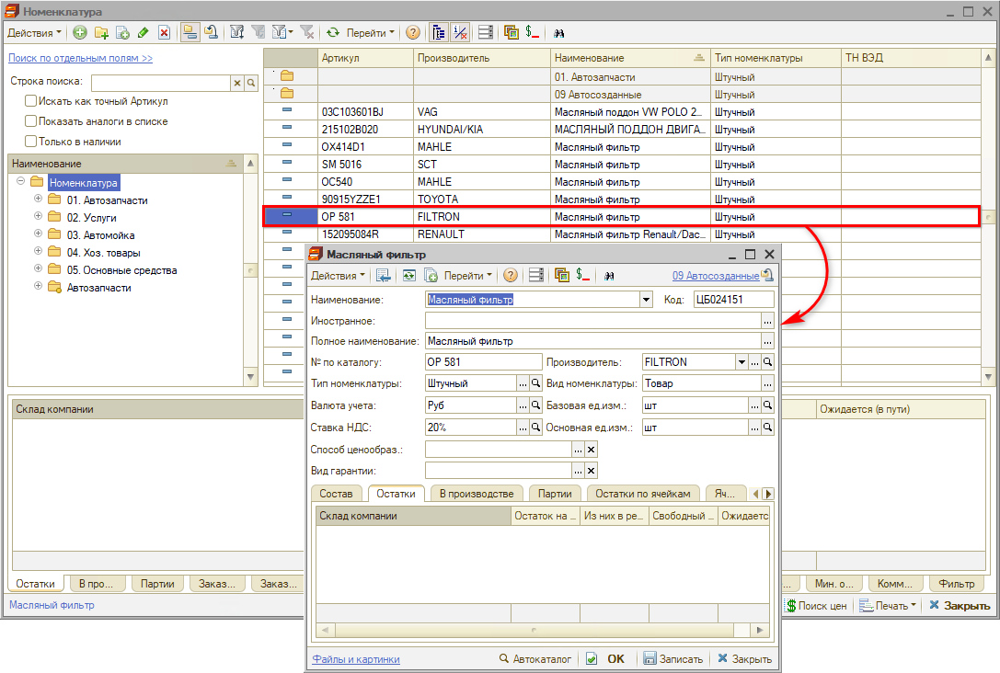

## Сканирование в интерфейсе ТСД

Сканировать штрихкоды товаров также можно через ТСД – терминал сбора данных, см. основную статью *"[Интерфейс для ТСД](https://www.5systems.ru/help/interfeys-dlya-tsd)".*

Предварительно у [пользователя ТСД](https://www.5systems.ru/help/interfeys-dlya-tsd#polzdlyatsd) должно быть включено право (настроено на используемый шаблон прав) автоматического создания номенклатуры при сканировании штрихкодов – см. *[ниже](#1-автоматическое-создание-номенклатуры-при-сканировании-штрихкодов).* Также для пользователя ТСД следует настроить *уведомление в виде фиксированного push-окна* – см. *[ниже](#uved_tsd).*

Сканирование товаров производится в документах "Поступление товаров", "Приобретение товаров / В пути", "Инвентаризация", "Перемещение товаров", а также в интерфейсе просмотра остатков товаров.

#### 1) Поступление товаров

При сканировании штрихкода в документе "Поступление товаров":

**1.** Если *штрихкод есть в базе,* то товар добавляется в документ, открывается окно ввода количества:

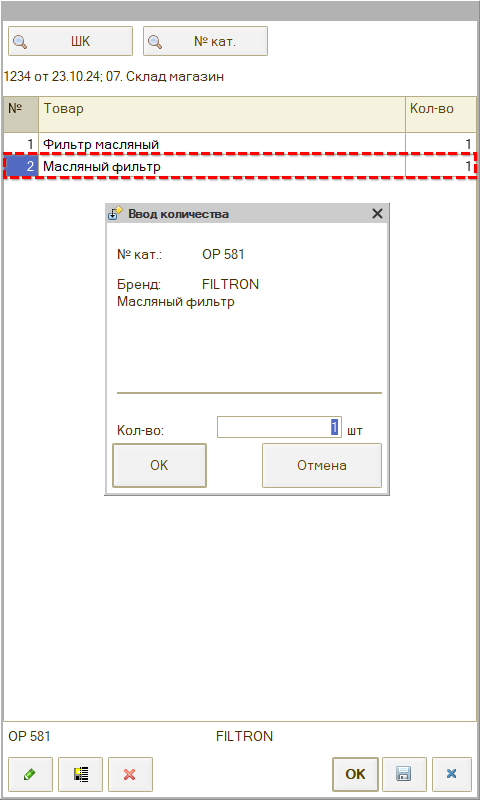

**2.** Если *штрихкода в базе нет,* но при обращении к внешней базе данных в справочнике *найден товар* с соответствующими артикулом и производителем, то выходит push-уведомление *"Штрихкод добавлен к номенклатуре",* товар также добавляется в документ и открывается окно ввода количества:

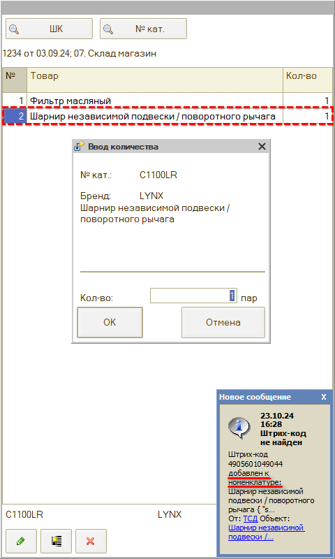

Штрихкод при этом сразу *записывается в свойства* номенклатуры – см. *[выше](#shk_v_svoystva).*

**3.** Если *товар по штрихкоду не найден,* появляется сообщение *"Штрихкод <xxxxxxxxxxxxx> не найден"* и выходит push-уведомление *"Штрихкод не найден. Создать номенклатуру?:*

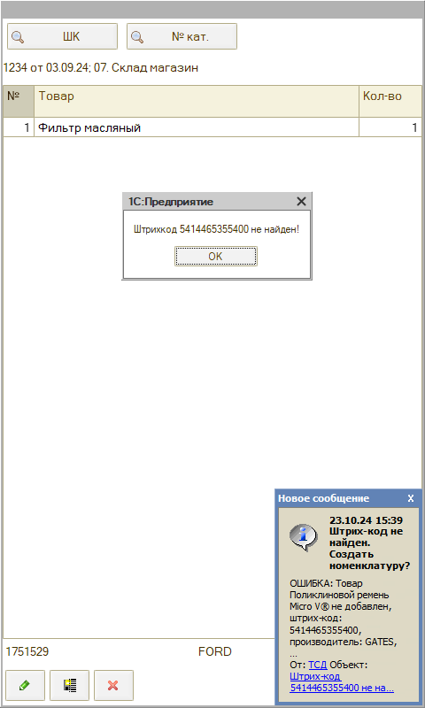

При *клике на ссылку* в уведомлении пользователь переходит в *задачу по созданию новой номенклатуры:*

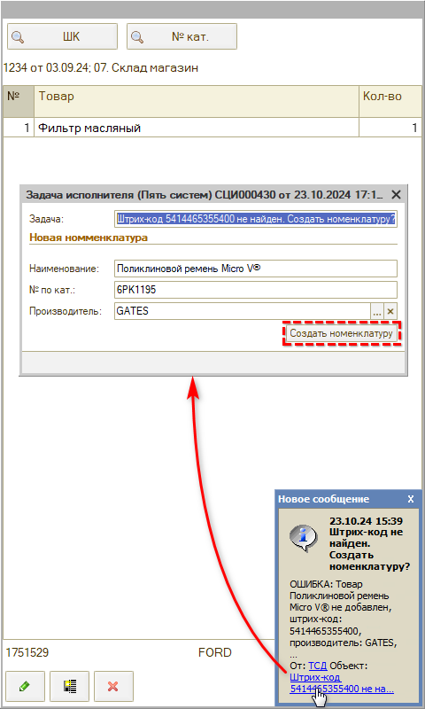

#### 2) Приобретение товаров / В пути

При сканировании штрихкода в документе "Приобретение товаров / В пути", а также в документе "Перемещение товаров":

**1.** Если *штрихкод найден в базе,* и товар есть в таблице – открывается окно ввода количества. Товар добавляется в столбце "Кол-во", значение в столбце "Недовоз" уменьшается на данное количество – см. в основной статье *"[Интерфейс для ТСД](https://www.5systems.ru/help/interfeys-dlya-tsd#dokpriobr)".*

Если сканируемого товара нет в таблице – программа предлагает добавить его:

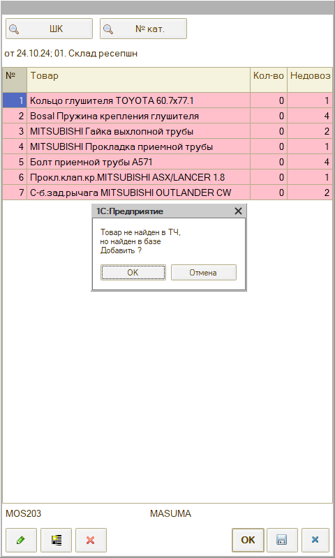

**2.** Если *штрихкод не найден* в программе, но найден во внешней базе данных ш/к и *соответствует карточке справочника номенклатуры* по артикулу и производителю, то товар также добавляется в документ, выходит окно ввода количества. При этом штрихкод сразу [*записывается в свойства*](#shk_v_svoystva) номенклатуры, и появляется push-уведомление о том, что *ш/к добавлен:*

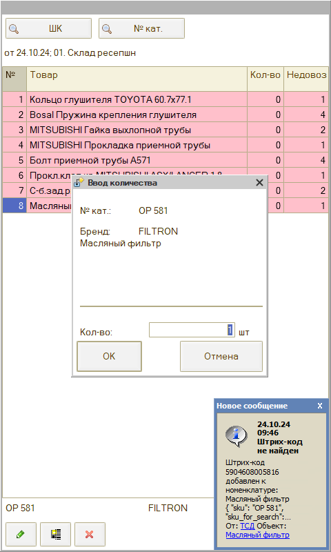

Если товара не было в таблице – код тоже записывается в свойства номенклатуры и выходит уведомление, а также программа предлагает добавить товар в таблицу.

**3.** Если товар по штрихкоду *не найден в базе* – всплывает такое же уведомление и сообщение, как при сканировании в документе "Поступление товаров" (см. *[выше](#v_tsd_ne_nayden)).*

#### 3) Инвентаризация

Если *штрихкод найден в базе,* и товар есть в таблице – открывается окно ввода количества. Товар добавляется в столбце "Факт." – см. в статье *"[Интерфейс для ТСД](https://www.5systems.ru/help/interfeys-dlya-tsd#inventariz)".* Если товар найден в базе, но его нет в таблице – программа предлагает добавить.

В случаях если товар по ш/к *не найден,* либо *найдена соответствующая* по артикулу и производителю *карточка номенклатуры,* в программе всплывают сообщения и уведомления аналогично рассмотренному [*выше*](#tsd_v_puti_ne_nayden) примеру работы с документом "Приобретение товаров / В пути".

#### 4) Остатки

При сканировании штрихкодов для просмотра остатков товаров на складах, если ш/к есть в программе, функционал работает по стандартному принципу – см. в [статье](https://www.5systems.ru/help/interfeys-dlya-tsd#ostatki).

В случае если *штрихкода нет в программе,* но *найдена соответствующая* по артикулу и производителю *карточка,* выходит такое же сообщение, как при сканировании в справочнике "Номенклатура" в программе – см. *[выше](#2-штрихкод-соответствует-карточке-товара-1):*

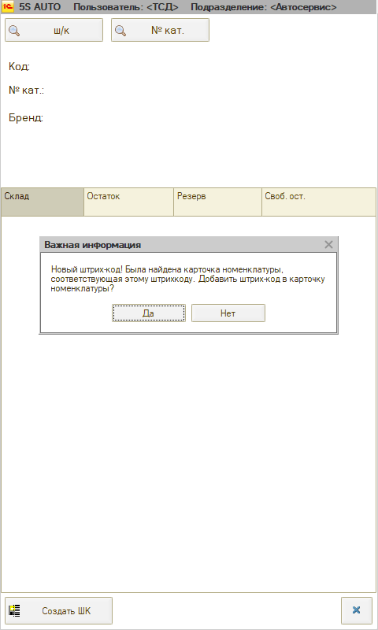

В случае если ш/к *не найден,* программа также предлагает создать новую карточку номенклатуры:

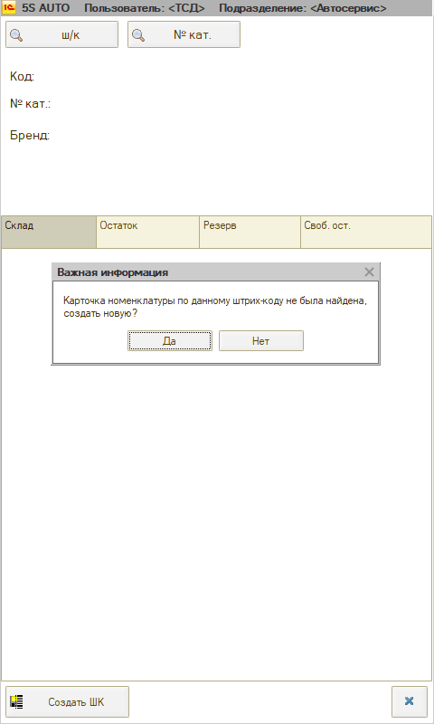

## Настройки

Для работы с функционалом предварительно должен быть *[подключен сканер ш/к](../Подключение%20сканера%20штрихкодов/podklyuchenie-skanera-shtrikhkodov.md)* либо *[ТСД](https://www.5systems.ru/help/interfeys-dlya-tsd#nastrpodkloborud),* а также настроена *интеграция с [API 5S AUTO](https://www.5systems.ru/help/api-5s-auto).*

#### 1. Настройки прав

О настройке прав см. статью *"[Установка прав и настроек пользователя](https://www.5systems.ru/help/ustanovka-prav-i-nastroek-polzovatelya)".*

##### 1) Автоматическое создание номенклатуры при сканировании штрихкодов

Для работы функционала должно быть включено право *"Автоматическое создание номенклатуры при сканировании штрихкодов":*

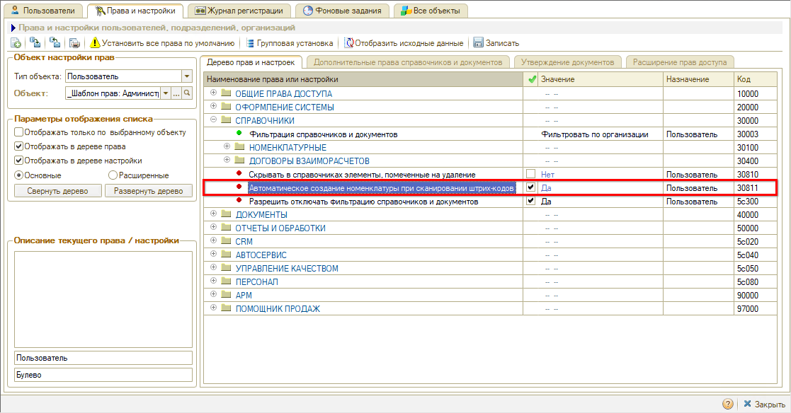

Если отключить данное право, то не будет использоваться микросервис для поиска товара по штрихкоду, т.е. не будет происходить обращение к данным сервиса 5S Cloud.

##### 2) Запрос количества при вводе товара со сканера ШК

Настройка *"Запрос количества при вводе товара со сканера ШК"* предназначена для вывода окна запроса количества товара, добавляемого в документ при сканировании ш/к:

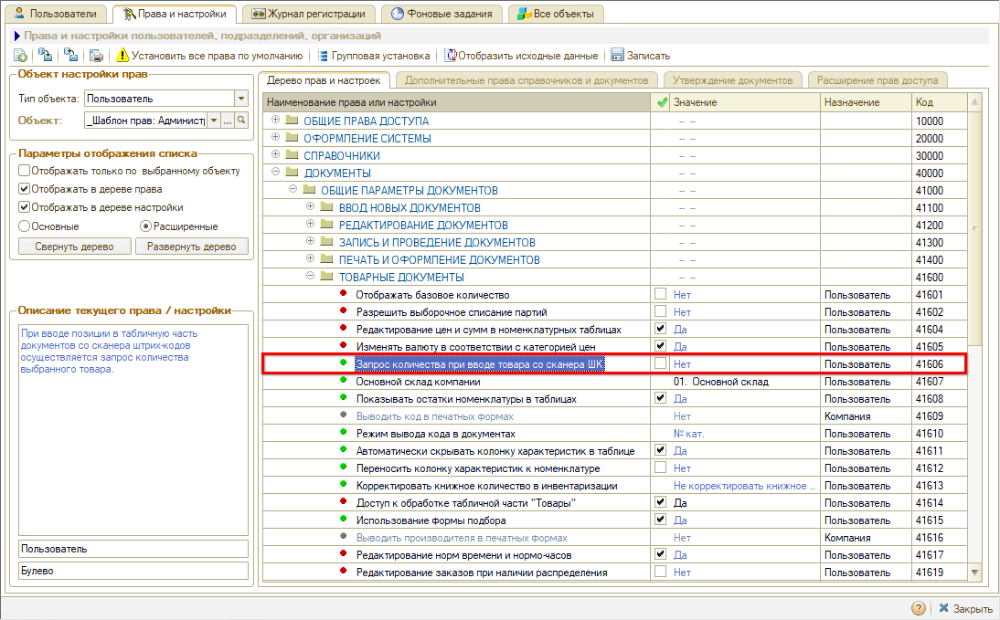

После активации данной настройки при [*сканировании товара в документе*](#1-штрихкод-найден-в-базе) помимо добавления строки в таблицу будет открываться окно *"Ввод параметров подбора",* в котором можно ввести нужное количество:

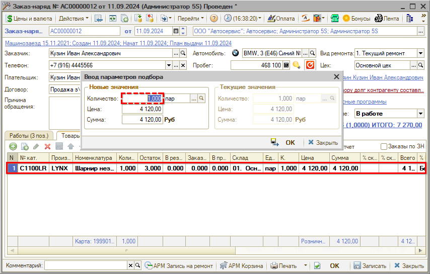

#### 2. Уведомление

Уведомление *"Не был найден штрихкод"* активировано в программе по умолчанию:

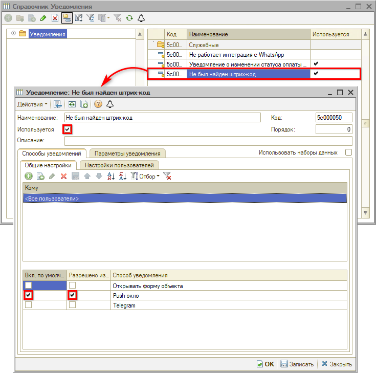

Пользователю следует настроить для себя *[способ уведомления.](https://www.5systems.ru/help/rabota-s-uvedomleniyami#nastrpoluch)* Подробнее см. статьи *"[Работа с уведомлениями](https://www.5systems.ru/help/rabota-s-uvedomleniyami)"* и *"[Настройка параметров уведомлений](https://www.5systems.ru/help/nastroyka-parametrov-uvedomleniy)".*

**Уведомление для ТСД**

Для *пользователя [ТСД](#сканирование-в-интерфейсе-тсд)* следует настроить [*фиксированное push-окно*](https://www.5systems.ru/help/rabota-s-uvedomleniyami#push) уведомления:

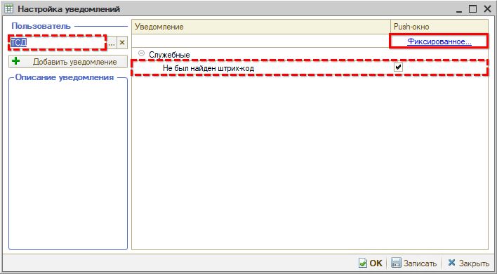

#### 3. Настройка регламентного задания

Для пополнения общей базы штрихкодов товаров должно быть активировано *регламентное задание "Обмен с микросервисом":*

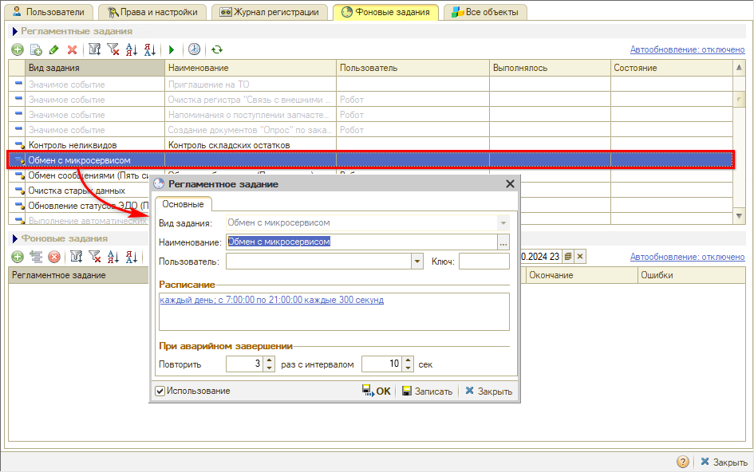

---

**Теги:** сканирование штрихкодов, штрихкод, ТСД, номенклатура, распознавание товаров

