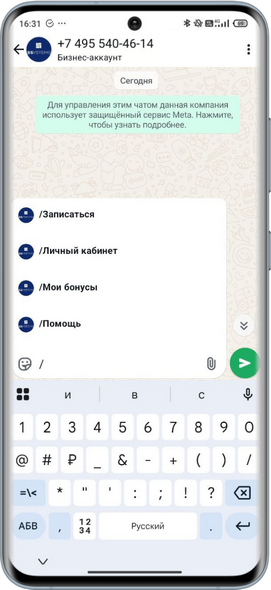
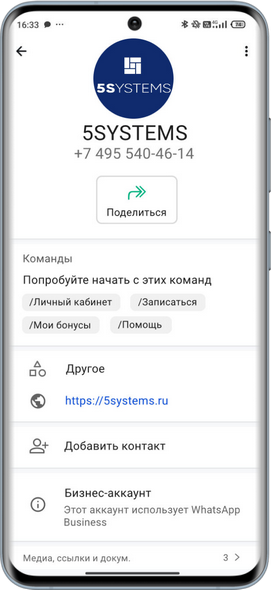
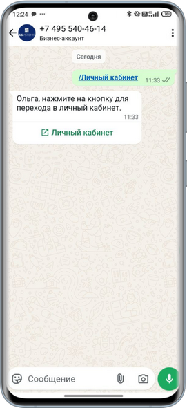
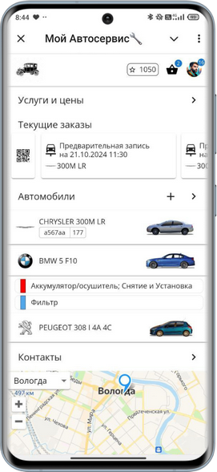
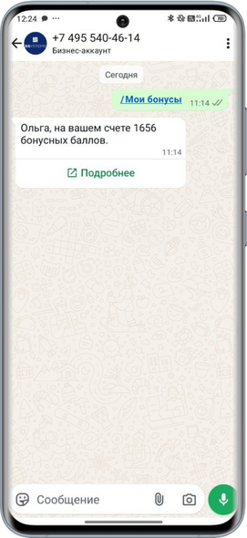
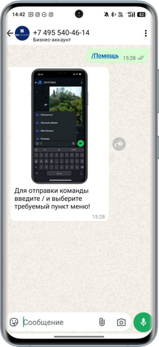

# Возможности бота WhatsApp Business API

<table><tr><td><b>Время чтения:</b> 5 мин.</td><td><b>Обновлено:</b> 13.05.2025</td></tr></table>

Источник: https://www.5systems.ru/help/vozmozhnosti-bota-whatsapp-business-api

> *Функционал доступен начиная с релиза 2.8.2 в рамках [отдельной подписки](https://www.5systems.ru/services/integraciya-s-whatsapp-business-api-waba) либо в рамках [комплексной подписки "Контакт-центр 5S Chat"](https://www.5systems.ru/services/kontakt-centr-5s-chat) (актуальные тарифы см. в [Каталоге услуг](https://www.5systems.ru/services?field_tags_target_id%5B21%5D=21&sort_by=created&sort_order=ASC))*

## Содержание

1. [Введение](#введение)
2. [Общая логика бота](#общая-логика-бота)
   - [1. Быстрые ответы для нового чата](#1-быстрые-ответы-для-нового-чата)
   - [2. Команды](#2-команды)
3. [Индивидуальная логика бота](#индивидуальная-логика-бота)

## Введение

***Боты WhatsApp Business API*** применяются для автоматизации обслуживания клиентов – они могут отвечать на стандартные вопросы пользователей моментально и в любое время суток, выдавать информацию по запросам, а также собирать от клиентов обратную связь.

Логика работы ботов задается в программе 5S AUTO механизмом [значимых событий](../../Настройка%20автоматической%20отправки%20сообщений%20через%20мессенджеры/nastroyka-avtomaticheskoy-otpravki-soobscheniy-cherez-messendzhery.md), а также на уровне [5S Cloud](https://www.5systems.ru/help/sozdanie-i-redaktirovanie-polzovateley-5s-cloud) (микросервис Воt API). Реализована *общая логика* работы бота сразу для всех пользователей программы – она подключается автоматически при [настройке интеграции 5S AUTO с WhatsApp Business API](../Настройка%20интеграции%20с%20WhatsApp%20Business%20API%20%28WABA%29/nastroyki-integracii-s-whatsapp-business-api.md). Есть возможность настройки *индивидуальной логики* работы бота отдельно под каждую компанию.

Также см. статьи:

- [Настройки интеграции с WhatsApp Business API](../Настройка%20интеграции%20с%20WhatsApp%20Business%20API%20%28WABA%29/nastroyki-integracii-s-whatsapp-business-api.md);
- [Оформление аккаунта WhatsApp Business API](../Оформление%20аккаунта%20WhatsApp%20Business%20API/oformlenie-akkaunta-whatsapp-business-api.md);
- [Способы перехода в WhatsApp-бот](../Способы%20перехода%20в%20чат%20WhatsApp/sposoby-perekhoda-v-chat-whatsapp.md) и другие статьи в разделе “[WhatsApp](https://www.5systems.ru/help/whatsapp)”.

Для работы с ботом WhatsApp Business API предварительно у клиентов должно быть установлено приложение WhatsApp.

## Общая логика бота

### 1. Быстрые ответы для нового чата

Для нового чата, в котором еще нет ни одного сообщения, выводится меню быстрых ответов. Пользователь может выбрать нужную команду:

Меню автоматически закроется если выбрать любой из его пунктов, либо если отправить произвольное сообщение. Описание команд см. [*ниже*](#2-команды)*.*

### 2. Команды

Вызвать меню команд можно вводом символа “/”:

Также список команд можно найти в профиле аккаунта:

*Доступны следующие команды:*

1. */Личный кабинет* – переход в ЛК приложения [5S Link](https://www.5systems.ru/help/nastroyka-prilozheniya-5s-link-v2), где клиент может: просматривать информацию о своих а/м, историю обслуживания, рекомендации, добавлять в корзину услуги и товары, отслеживать текущие заказы и заявки, оплачивать документы и т.д.:

    &nbsp;&nbsp;&nbsp;&nbsp;&nbsp;&nbsp;&nbsp; 

2. */Записаться* – переход к записи на ремонт через [5S Link](https://www.5systems.ru/help/nastroyka-prilozheniya-5s-link-v2): в приложении клиент может выбрать нужные услуги, указать желаемую дату и время записи, отправить заявку, а также найти контакты сервиса, открыть карту с отметкой ближайшего филиала и построить маршрут:

    &nbsp;&nbsp;&nbsp;&nbsp;&nbsp;&nbsp;&nbsp;&nbsp; 

3. */Мои бонусы* – в ответ клиент получит информацию о количестве бонусных баллов на своем счете:

   

4. */Помощь* – в ответ будет отправлена подсказка, как пользоваться меню быстрых действий:

   

## Индивидуальная логика бота

Есть возможность настройки *индивидуальной логики* работы бота для каждой отдельной компании.

Бот с индивидуальной логикой будет отправлять сообщения на основе шаблонов, заранее настроенных под бизнес-процессы компании – с интерактивными кнопками, меню действий, картинками, списком акций и т.д. При нажатии кнопок и выборе пунктов меню клиентом бот будет отправлять следующее автоматическое сообщение – например, печатную форму документа, карту с маршрутом проезда, информацию об акции и т.д.

Также есть возможность добавить дополнительные [команды](#2-команды) для меню быстрых действий – это можно сделать в [настройках аккаунта WABA](../Оформление%20аккаунта%20WhatsApp%20Business%20API/oformlenie-akkaunta-whatsapp-business-api.md) в разделе "Номера телефонов" на вкладке "Автоматизации".

Подробнее см. статьи: “[Пример индивидуальной настройки WABA](../Пример%20индивидуальной%20настройки%20WABA/primer-individualnoy-nastroyki-waba.md)”, “[Уведомление покупателю о поступлении заказа](https://www.5systems.ru/help/uvedomlenie-pokupatelyu-o-postuplenii-zakaza)”.

---

**Теги:** WhatsApp, WABA, бот, возможности, мессенджеры

