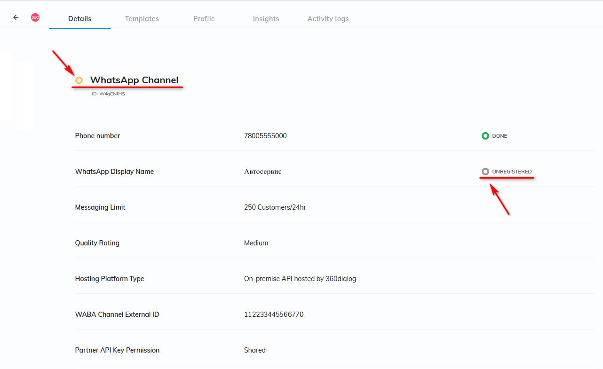
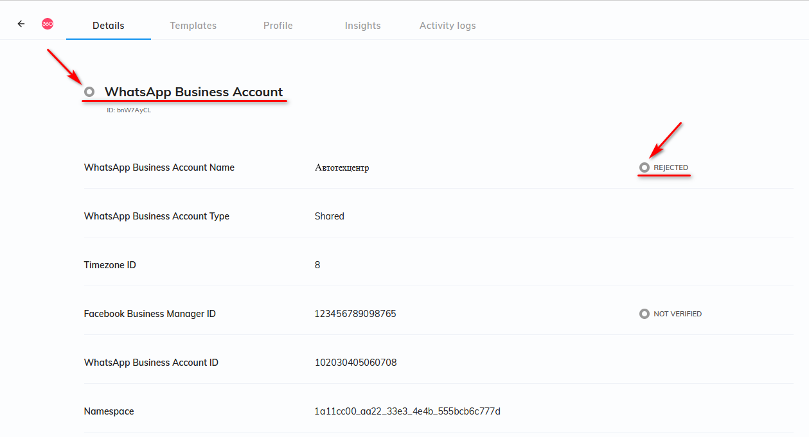
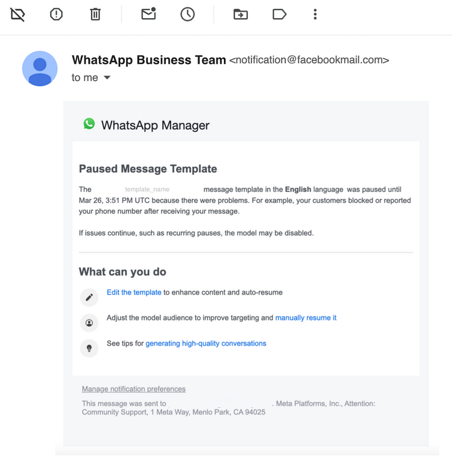

# Возможные проблемы с WABA и их устранение

<table><tr><td><b>Время чтения:</b> 19 мин.</td><td><b>Обновлено:</b> 08.04.2024</td></tr></table>

Источник: https://www.5systems.ru/help/vozmozhnye-problemy-s-waba-i-ikh-ustranenie

## Содержание

1. [Введение](#введение)
2. [Блокировка аккаунта](#блокировка-аккаунта)
   - [Рекомендации по работе с массовой рассылкой в WABA](#рекомендации-по-работе-с-массовой-рассылкой-в-waba)
   - [Рекомендации по устранению проблем](#рекомендации-по-устранению-проблем)
3. [Блокировка шаблона](#блокировка-шаблона)

## Введение

В рамках данной статьи приводятся инструкции по действиям в случае блокировки WABA и рекомендации по снижению вероятности блокировки.

О предварительной настройке работы с WABA см. статьи [Настройка интеграции с WhatsApp Business API](../Настройка%20интеграции%20с%20WhatsApp%20Business%20API%20%28WABA%29/nastroyki-integracii-s-whatsapp-business-api.md) и [Регистрация компании в Facebook\*\* и 360dialog](../Регистрация%20компании%20в%20Facebook%20и%20360dialog/registraciya-kompanii-v-facebook-i-360dialog.md). Также см. другие статьи в разделе "[WhatsApp](https://www.5systems.ru/help/whatsapp)".

## Блокировка аккаунта

### Рекомендации по работе с массовой рассылкой в WABA

Любая рассылка в WABA небезопасна, т.к. получатель всегда может пожаловаться на нежелательное сообщение, а Meta\* заблокирует номер автоматически после нескольких жалоб.

**Как снизить вероятность блокировки**

*Рекомендации по части маркетинга:*

- Настраивайте рекламу таким образом, чтобы пользователь первым писал вам (у него не возникнет кнопка "Пометить как спам").
- Отправляйте сообщения только по вашей "горячей" базе номеров, давших вам согласие на это.
- Не отправляйте одинаковые сообщения, изменяйте их: персонализируйте сообщения (“Привет, %name%”).
- Используйте возможность подписаться и отписаться от ваших сообщений в каждом сообщении. Для этого добавляйте кнопки ответа.
- Минимизируйте наличие ссылки в сообщениях в первое время использования бота.
- Предлагайте пользователям сохранить ваш контакт в телефонную книгу.

*Рекомендации по технической части:*

- Не используйте для массовых рассылок недавно зарегистрированный аккаунт, т.к. он имеет больше вероятности получить временную блокировку с целью дополнительных проверок.
- Не используйте аккаунты, купленные с рук.
- Используйте безопасную авторизацию в личном кабинете.
- Отправляйте сообщения не все сразу, а партиями – через настройку равномерной рассылки. При рассылке следует учитывать лимиты компании на сообщения. Например, если штатный лимит сессий 250 шт. в день, рабочий день 12 часов, то можно позволить ~20 сессий в час. Также следует учитывать регламентные сообщения, на которые тоже расходуются эти сессии – с учетом этого рекомендуем отправлять 1 сообщение в 4 минуты.

### Рекомендации по устранению проблем

**Почему может быть заблокирован аккаунт WABA**

**1)*** Жалобы пользователей на спам *— вероятность блокировки аккаунта в случае подключения официального WABA очень низкая: в случае спама или вирусной рекламы, на которую будут жаловаться пользователи, Meta\* заблокирует не аккаунт, а шаблон. При повторном нарушении могут уменьшить количество доступных переписок в сутки, в некоторых случаях может дойти до блокировки аккаунта.

*Примечание:* В случае подключения интеграции с [пользовательским WhatsApp](../Настройка%20интеграции%20с%20WhatsApp/nastroyka-integracii-s-whatsapp.md) жалобы пользователей с большой вероятностью могут привести к блокировке номера.

Если аккаунт будет заблокирован, то разблокировать номер не получится. Вы не сможете получить ответы ваших клиентов, потеряете базу подписчиков и вам придется подключать новый номер.

**2)*** Нарушение правил торговой политики *– при использования WhatsApp Business API деятельность компании должна соответствовать правилам торговой политики WhatsApp: см. [Торговая политика WhatsApp](https://www.whatsapp.com/legal/commerce-policy/?fbclid=IwAR3GatCssNjTIL4I8pRb84BeSGhtl0LB6l0g8rMJvfFDFNYum5nwKVn30_s). В случае нарушения правил WABA-аккаунт компании может быть заблокирован.

Подробнее прочитать о политике WABA можно в документации на сайте 360dialog: [WABA Policy Enforcement](https://docs.360dialog.com/docs/waba-basics/waba-policy-enforcement), а также на сайте Facebook\*\*: [Обеспечение соблюдения политик платформы WhatsApp Business](https://developers.facebook.com/docs/whatsapp/overview/policy-enforcement/?locale=ru_RU).

**Как понять, что аккаунт заблокирован**

Информацию о том, что аккаунт заблокирован, можно увидеть в своей учетной записи 360dialog Hub или в своем Meta\* Business Manager.

Значок статуса аккаунта должен быть зеленого цвета. Если он стал желтым или серым, значит, аккаунт не работает:

При попытке войти в обычный WhatsApp с этого номера телефона появится сообщение о блокировке аккаунта.

**Что делать, если заблокировали аккаунт**

Решение о блокировке можно обжаловать и запросить проверку. Команда WhatsApp рассматривает обращение и принимает решение о том, действительно ли нарушение имело место. В результате WhatsApp может отменить решение о нарушении.

Чтобы запросить проверку, нужно администратору аккаунта перейти в раздел “[Центр поддержки для бизнеса](https://business.facebook.com/business-support-home/)” (“Business Support”) в Meta\* Business Suite или в Business Manager и нажать “Запросить проверку” (“Request Review”).

В Business Manager откроется новое окно – следует ввести необходимую информацию и нажать “Отправить”. После отправки запрос вместе с соответствующей проблемой перемещаются на вкладку “На проверке”.

При отправке запроса необходимо описать проблему, предоставить подробное описание вашего бизнеса и варианта использования WhatsApp. Это увеличит шансы на успешную апелляцию.

Уведомление о решении по апелляции направляется через Business Manager (обычно в течение 24–48 часов). Обжалованное нарушение может остаться без изменений или быть отменено.

**Предотвращение дальнейших нарушений**

Ознакомьтесь с [Торговой политикой](https://www.whatsapp.com/legal/commerce-policy/) и [Политикой WhatsApp Business](https://l.facebook.com/l.php?u=https%3A%2F%2Fwww.whatsapp.com%2Flegal%2Fbusiness-policy%2F&h=AT1v2IGkZK3yjQLhYgebS0bnJJ5Mptj7uJ_jiw5Gux2vdVb5_1Q5ymxlp5D-qr-C4k8PCo3F4N83zhWrvUveb4oX2qDPedCMoGAeS_vWnMgwcMrCba7eDSzrokqCoNn9NcNs3A) и [статьей](https://l.facebook.com/l.php?u=https%3A%2F%2Ffaq.whatsapp.com%2Fgeneral%2Fwhatsapp-business-api%2Fhow-to-comply-with-the-whatsapp-business-and-commerce-policies&h=AT1XNM0945Z6s1TeYwdkcs0KsVXFjw2dq9vrQmDnowk-n7ihcY8KN7mkzU9tZJ3LuySJeWaBATICDwhMPH2AgltI_vHn7MTM4u_ddn0pLtpRFt4WQ2uSGe1Oc0aHVICCWhJ9aw), где содержатся ответы на часто задаваемые вопросы об этих политиках.

Оперативно устраните нарушения и скорректируйте свои действия на платформе, чтобы избежать повторной блокировки.

*При возникновении сложностей с подачей апелляции обращайтесь в техподдержку 5SYSTEMS.*

Если аккаунт заблокирован окончательно, то есть возможность зарегистрировать новый аккаунт Facebook\*\* Business Manager с новым номером телефона. Необходимо полностью повторить процедуру регистрации: см. *[статью](../Регистрация%20компании%20в%20Facebook%20и%20360dialog/registraciya-kompanii-v-facebook-i-360dialog.md#регистрация-в-360dialog)*.

## Блокировка шаблона

*раздел в разработке*

**Рейтинг прочтения шаблонов**

С 1 апреля 2024 года Meta\* включили показатели прочтения шаблонов в качестве ключевого фактора, определяющего качество шаблонов маркетинговых сообщений, в дополнение к традиционным показателям, таким как блокировки и пересылки.

Это означает, что Meta\* [временно блокирует маркетинговые сообщения](https://docs.360dialog.com/partner/messaging/template-messages#template-pausing) с низким рейтингом прочтения, давая компании время пересмотреть/отредактировать шаблоны с низким коэффициентом вовлеченности. Подробнее см. в [документации](https://docs.360dialog.com/partner/messaging/template-messages#template-read-rates).

**Как отслеживать результативность и успех кампании**

При проведении кампании необходимо следовать нескольким рекомендациям, чтобы обеспечить ее эффективность и соответствие правилам политики Meta\*. Подробнее см. в [документации](https://docs.360dialog.com/partner/messaging/checklist-for-message-broadcasts-and-campaigns).

Meta\* отправляет уведомления по электронной почте с подробной информацией о любых изменениях статуса шаблона или учетной записи WhatsApp Business. Если вы получили подобное электронное письмо,** рекомендуем принять меры как можно скорее, чтобы избежать дальнейших осложнений.**

**Что делать с помеченными шаблонами**

Качество шаблона определяется сочетанием сигналов качества, полученных в ходе общения между компаниями и пользователями. Например, сигналы обратной связи с пользователем, такие как частота и скорость чтения, блокировки, отчеты и причины, по которым пользователи блокируют компанию.

При получении уведомления *status_change* для любого шаблонного сообщения:

- **Отредактируйте шаблон** , чтобы он соответствовал рекомендациям Meta\*, и повторно отправьте его на проверку.
- **Создайте новый шаблон** с улучшенным содержанием и пройдите новое утверждение.
- **Запросите проверку через сервис проверки качества учетной записи.** Пользователи WABA с общим доступом могут обжаловать отклонение непосредственно через Business Manager. Представители аккаунта WABA могут обратиться в службу поддержки 360Dialog за помощью в подаче апелляций. Подробнее см. в [документации](https://docs.360dialog.com/partner/messaging/template-messages#template-statuses).

*\*Meta признана экстремистской организацией, запрещенной на территории Российской Федерации.*

*\*\*Facebook является продуктом компании Meta, признанной экстремистской организацией, запрещенной на территории Российской Федерации.*

---

**Теги:** WhatsApp, WABA, проблемы, ошибки, устранение неполадок

