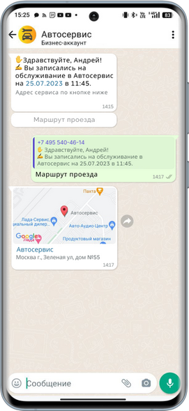
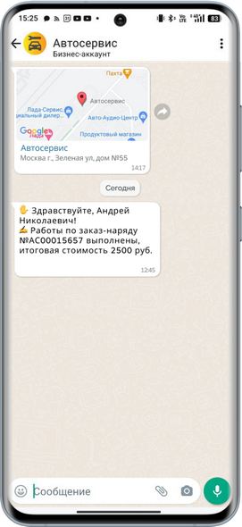
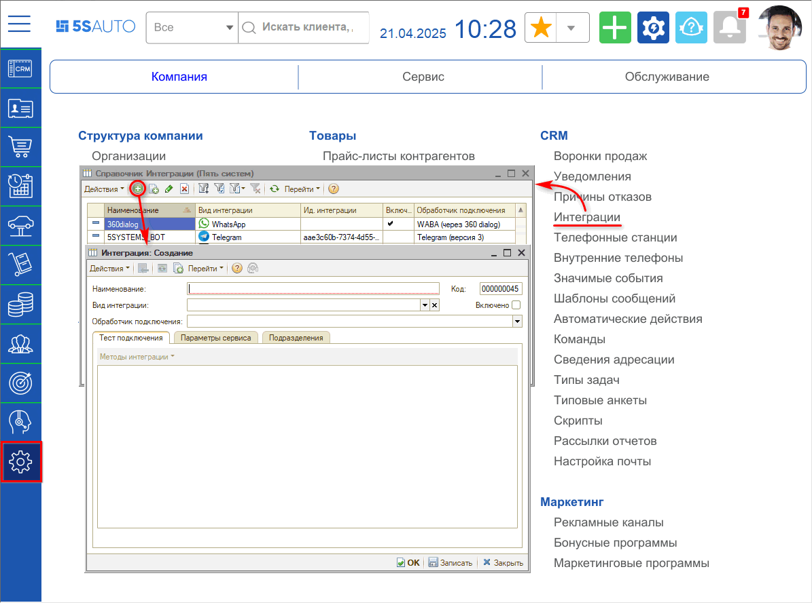
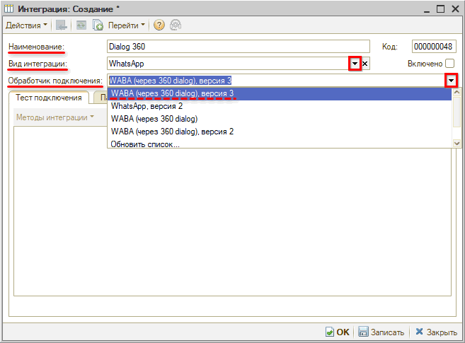
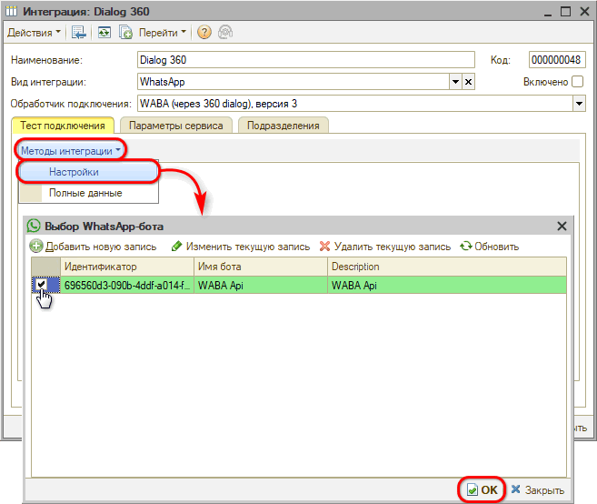
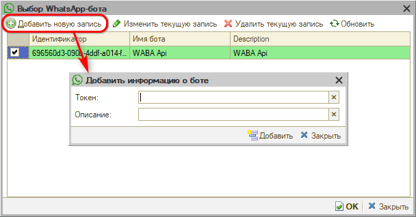
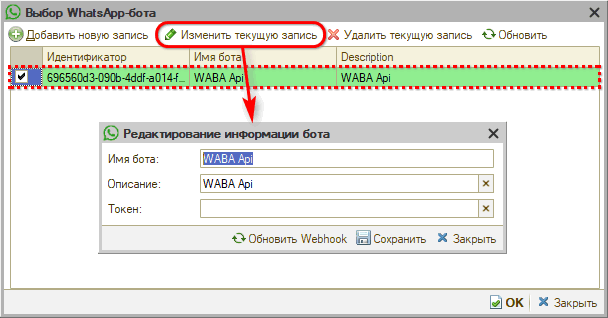
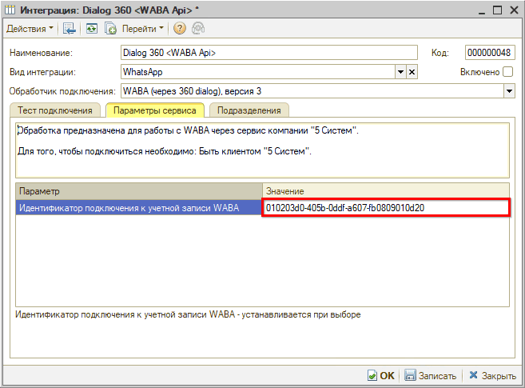
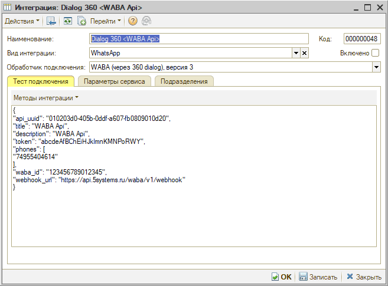

# Настройки интеграции с WhatsApp Business API

<table><tr><td><b>Время чтения:</b> 9 мин.</td><td><b>Обновлено:</b> 14.05.2025</td></tr></table>

Источник: https://www.5systems.ru/help/nastroyki-integracii-s-whatsapp-business-api

> *Функционал доступен начиная с релиза 2.8.2 в рамках [отдельной подписки "Интеграция с WhatsApp Business API (WABA)"](https://www.5systems.ru/services/integraciya-s-whatsapp-business-api-waba) либо в рамках [комплексной подписки "Контакт-центр 5S Chat"](https://www.5systems.ru/services/kontakt-centr-5s-chat) (актуальные тарифы см. в [Каталоге услуг](https://www.5systems.ru/services?field_tags_target_id%5B21%5D=21&sort_by=created&sort_order=ASC))*

## Содержание

1. [Введение](#введение)
2. [Основные шаги настройки](#основные-шаги-настройки)
   - [Шаг 1: Регистрация компании в Facebook\*\* и 360 Dialog](#шаг-1-регистрация-компании-в-facebook-и-360-dialog)
   - [Шаг 2: Настройка интеграции в программе](#шаг-2-настройка-интеграции-в-программе)
   - [Шаг 3: Загрузка и согласование шаблонов по умолчанию](#шаг-3-загрузка-и-согласование-шаблонов-по-умолчанию)
3. [Настройка интеграции в программе](#настройка-интеграции-в-программе)
   - [1) Создание интеграции](#1-создание-интеграции)
   - [2) Основные реквизиты](#2-основные-реквизиты)
   - [3) Подключение бота](#3-подключение-бота)
   - [4) Тест подключения](#4-тест-подключения)

## Введение

***WhatsApp Business API (WABA)*** – это официальное решение Meta\* для интеграции WhatsApp с CRM-системами.

Подключить WhatsApp к 5S AUTO можно двумя способами: с помощью интеграции с [*пользовательским WhatsApp*](../Настройка%20интеграции%20с%20WhatsApp/nastroyka-integracii-s-whatsapp.md) и через *WhatsApp Business API (WABA).* Отличия, преимущества и ограничения обоих методов см. в статье “[Сравнение возможностей WABA и пользовательского WhatsApp](../Сравнение%20возможностей%20WABA%20и%20пользовательского%20WhatsApp/sravnenie-vozmozhnostey-waba-i-polzovatelskogo-whatsapp.md)”*.*

Только интеграция с WABA позволяет пользователям 5S AUTO полноценно использовать все функции канала WhatsApp для общения с клиентами:

- автоматизировать взаимодействие с клиентами с помощью бота (подробнее см. [статью](../Возможности%20бота%20WhatsApp%20Business%20API/vozmozhnosti-bota-whatsapp-business-api.md));
- делать массовые рассылки;
- добавлять в сообщения кнопки и опции;
- верифицировать бизнес-аккаунт для повышения доверия клиентов;
- оформлять профиль компании более детально (подробнее см. [статью](../Оформление%20аккаунта%20WhatsApp%20Business%20API/oformlenie-akkaunta-whatsapp-business-api.md));
- использовать стартовое меню для начала общения с ботом новых пользователей;
- использовать команды – меню быстрых действий для перехода в ЛК приложения 5S Link, записи на ремонт, просмотра бонусного счета и др.;
- общаться с клиентами через контакт-центр 5S Chat и т.д.

Есть возможность отправлять клиентам сообщения в свободной форме (как и через пользовательский WhatsApp), а также преднастроенные шаблоны сообщений с интерактивными кнопками, изображениями, вложениями и ссылками.

Шаблоны должны соответствовать определенным категориям и предварительно пройти модерацию в Meta\*. Использовать можно только шаблоны после получения ими определенного статуса. Подробно о диалоговой системе WABA и настройке шаблонов описано в статье *“[Настройка шаблонов WhatsApp Business API](../../Настройка%20шаблонов%20WhatsApp%20Business%20API/nastroyka-shablonov-whatsapp-business-api.md)”.*

Сообщения на основе шаблонов можно отправлять вручную либо настроить автоматическую отправку. Например, отправлять сообщения о готовности заказ-наряда:

*Примечание:* Также см. другие статьи в разделе “[WhatsApp](https://www.5systems.ru/help/whatsapp)”.

## Основные шаги настройки

Для работы с WABA вам понадобится номер телефона, к которому у вас есть доступ и возможность получения СМС-сообщений. К номеру телефона не должен быть привязан аккаунт пользовательского WhatsApp (как отвязать номер, см. в [статье](../Регистрация%20компании%20в%20Facebook%20и%20360dialog/registraciya-kompanii-v-facebook-i-360dialog.md#шаг-3-регистрация-номера-waba)). На один номер телефона можно зарегистрировать одну учетную запись WABA.

Для подключения интеграции с WABA первым делом необходимо подать заявку на портале 5SYSTEMS. После оплаты услуги начинается настройка.

### Шаг 1: Регистрация компании в Facebook\*\* и 360 Dialog

Подробную инструкцию см. в статье [Регистрация компании в Facebook\*\* и 360dialog](../Регистрация%20компании%20в%20Facebook%20и%20360dialog/registraciya-kompanii-v-facebook-i-360dialog.md).

1. *Регистрация на стороне Facebook\*\*:* должны быть доступны учетные записи – личная и Facebook\*\* Business Manager (см. в [статье](../Регистрация%20компании%20в%20Facebook%20и%20360dialog/registraciya-kompanii-v-facebook-i-360dialog.md#регистрация-компании-в-facebook-business-manager)).
2. *Подключение номера WABA в 360 Dialog:* требуется перейти по реферальной ссылке, предоставляемой специалистами 5SYSTEMS, создать аккаунт и зарегистрировать номер телефона (см. в [статье](../Регистрация%20компании%20в%20Facebook%20и%20360dialog/registraciya-kompanii-v-facebook-i-360dialog.md#регистрация-в-360dialog)).
3. *Подтверждение компании в Facebook\*\** – данный шаг не является обязательным (подробнее см. в [статье](../Регистрация%20компании%20в%20Facebook%20и%20360dialog/registraciya-kompanii-v-facebook-i-360dialog.md#подтверждение-компании)).

*Примечание: Действия 1-3 выполняются компанией самостоятельно.*

*Внимание!* Не покупайте готовые аккаунты с рук – очень высок риск блокировки.

4. *Создание бота* – действие выполняется специалистами 5SYSTEMS (см. статьи: [Возможности бота WhatsApp Business API](../Возможности%20бота%20WhatsApp%20Business%20API/vozmozhnosti-bota-whatsapp-business-api.md), [Способы перехода в чат WhatsApp](../Способы%20перехода%20в%20чат%20WhatsApp/sposoby-perekhoda-v-chat-whatsapp.md)).
5. *Оформление аккаунта* – производится в настройках личного кабинета на сайте 360 Dialog либо в ЛК Meta\* Business Suite (см. статью [Оформление аккаунта WhatsApp Business API](../Оформление%20аккаунта%20WhatsApp%20Business%20API/oformlenie-akkaunta-whatsapp-business-api.md)). Данное действие компания может выполнить самостоятельно либо обратиться к специалистам 5SYSTEMS и предоставить данные для оформления профиля: описание компании, сайт, изображение и т.д.

Результатом шага 1 является получение ***токена*** *(API Key),* который затем используется специалистами 5SYSTEMS для [настройки интеграции](#настройка-интеграции-в-программе) в 5S AUTO.

### Шаг 2: Настройка интеграции в программе

В программе необходимо создать интеграцию с WhatsApp Business API, заполнить параметры и вставить полученный на предыдущем шаге *токен* – подробнее см. раздел *[ниже](#настройка-интеграции-в-программе).*

### Шаг 3: Загрузка и согласование шаблонов по умолчанию

Для работы с WABA каждая компания обязательно должна согласовать у WhatsApp несколько основных преднастроенных [шаблонов](../../Настройка%20шаблонов%20WhatsApp%20Business%20API/nastroyka-shablonov-whatsapp-business-api.md).

Действия по данному шагу *выполняет специалист техподдержки 5SYSTEMS* на этапе начальной настройки.

## Настройка интеграции в программе

Предварительно в программе должна быть настроена интеграция с [API 5S AUTO](https://5systems.ru/help/api-5s-auto).

Также должен быть получен параметр *API Key* при регистрации в 360 Dialog – см. *[выше](#шаг-1-регистрация-компании-в-facebook-и-360-dialog).*

### 1) Создание интеграции

Для настройки интеграции следует перейти в справочник "Интеграции" – *Администрирование → Компания → CRM → Интеграции* – и создать новый элемент справочника:

### 2) Основные реквизиты

Необходимо заполнить основные реквизиты интеграции:

1. *Наименование:* заполняется автоматически в формате *“Dialog 360 <наименование бота>”* – значение “Dialog 360” устанавливается при выборе обработчика подключения, значение в угловых скобках подтягивается при выборе бота, см. *[ниже](#3-подключение-бота).*
2. *Вид интеграции:* следует выбрать *“WhatsApp”.*
3. *Обработчик подключения:* следует выбрать обработчик *“WABA (через 360 dialog), версия 3”.*

После этого следует *записать интеграцию* и перезайти в карточку.

### 3) Подключение бота

На вкладке *“Тест подключения”* следует нажать кнопку *“Методы интеграции → Настройки”.* В открывшемся окне выбрать уже существующий WhatsApp-бот:

либо добавить новый:

Следует заполнить токен и описание и нажать кнопку “Добавить”.

При необходимости можно изменить данные о боте:

После нажатия на форме выбора бота кнопки “ОК” автоматически заполняется параметр “Идентификатор подключения к учетной записи WABA” на вкладке “Параметры сервиса”:

После того, как произведены все настройки, необходимо установить галочку ***“Включено”*** и ***записать интеграцию*** нажатием кнопки *“Записать”* или *“ОК”.*

### 4) Тест подключения

При необходимости можно получить полные данные о подключении – для этого следует на вкладке “Тест подключения” нажать кнопку *Методы интеграции → Полные данные:*

*\*Meta признана экстремистской организацией, запрещенной на территории Российской Федерации.*

*\*\*Facebook является продуктом компании Meta, признанной экстремистской организацией, запрещенной на территории Российской Федерации.*

---

**Теги:** WhatsApp, WABA, интеграция, настройка, 360dialog, токен

