

# Настройка интеграции с WhatsApp

<table><tr><td><b>Время чтения:</b> 12 мин.</td><td><b>Обновлено:</b> 20.05.2025</td></tr></table>

Источник: https://www.5systems.ru/help/nastroyka-integracii-s-whatsapp

> *Функционал доступен начиная с **релиза 2.8.3** в рамках **комплексной** **подписки "[Контакт-центр 5S Chat](https://www.5systems.ru/services/kontakt-centr-5s-chat)"** (актуальные тарифы см. в [Каталоге услуг](https://www.5systems.ru/services?field_tags_target_id%5B21%5D=21&sort_by=created&sort_order=ASC))*

## Содержание

1. [Введение](#введение)
2. [Настройка](#настройка)
   - [1. Создание интеграции](#1-создание-интеграции)
   - [2. Основные реквизиты](#2-основные-реквизиты)
   - [3. Подключение аккаунта WhatsApp](#3-подключение-аккаунта-whatsapp)
      - [1) Выбор учетной записи](#1-выбор-учетной-записи)
      - [2) Связь с устройством](#2-связь-с-устройством)
   - [4. Запись интеграции](#4-запись-интеграции)
   - [5. Тест подключения](#5-тест-подключения)
   - [6. Редактирование аккаунта](#6-редактирование-аккаунта)

## Введение

Подключить **WhatsApp** к 5S AUTO можно двумя способами: с помощью интеграции с *пользовательским WhatsApp* и через *WhatsApp Business API (WABA).* Отличия, преимущества и ограничения обоих методов см. в статье “[Сравнение возможностей WABA и пользовательского WhatsApp](../Сравнение%20возможностей%20WABA%20и%20пользовательского%20WhatsApp/sravnenie-vozmozhnostey-waba-i-polzovatelskogo-whatsapp.md)”.

Например, возможности бота, массовые рассылки и использование шаблонов сообщений с кнопками возможны только при использовании официального решения WABA (см. статью “[Возможности бота WhatsApp Business API](../Возможности%20бота%20WhatsApp%20Business%20API/vozmozhnosti-bota-whatsapp-business-api.md)” и другие статьи в разделе “[WhatsApp](https://www.5systems.ru/help/whatsapp)”).

В рамках текущей статьи описана настройка интеграции с *пользовательским* WhatsApp. Он более прост в подключении, чем WABA, но имеет ограничения в использовании функционала.

Для работы с интеграцией предварительно у клиентов также должно быть установлено приложение WhatsApp.

## Настройка

### 1. Создание интеграции

Для настройки интеграции следует перейти в справочник *"Интеграции" – Администрирование → Компания → CRM → Интеграции* – и создать новый элемент справочника:

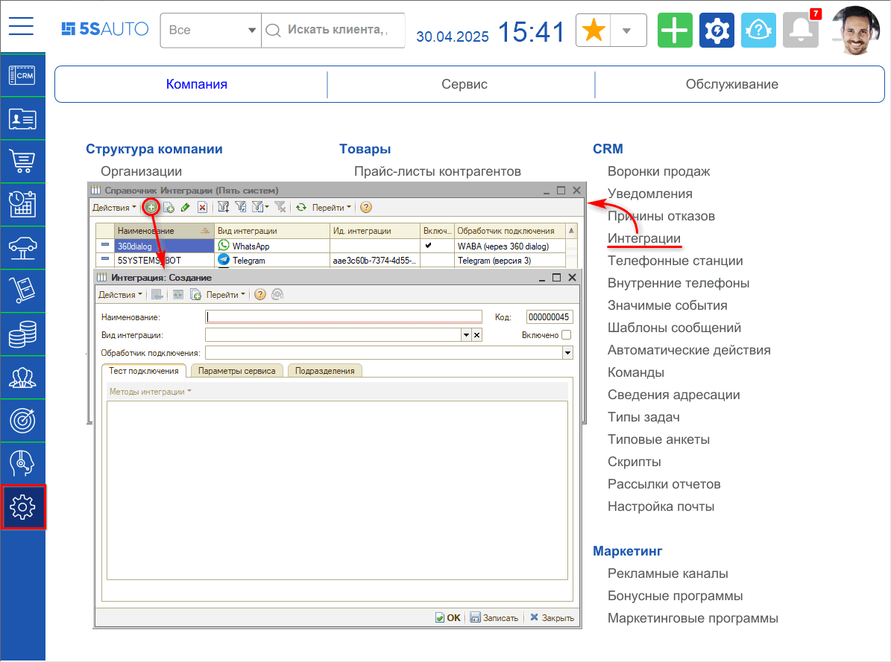

### 2. Основные реквизиты

Необходимо заполнить основные реквизиты интеграции:

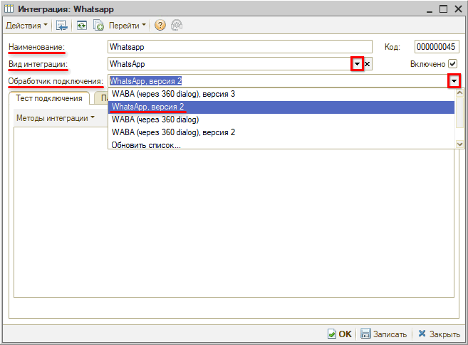

**1.** *Наименование:* заполняется автоматически в формате *“Whatsapp <наименование аккаунта>”* – значение “*Whatsapp*” устанавливается при выборе обработчика подключения, значение в угловых скобках подтягивается при выборе аккаунта, см. *[ниже](#3-подключение-аккаунта-whatsapp).*

**2.** *Вид интеграции:* следует выбрать *“WhatsApp”.*

**3.** *Обработчик подключения:* следует выбрать обработчик *“WhatsApp, версия 2”.*

После этого следует *записать* интеграцию и перезайти в карточку.

### 3. Подключение аккаунта WhatsApp

#### 1) Выбор учетной записи

На вкладке *“Тест подключения”* следует нажать кнопку *“Методы интеграции → Настройки”.* В открывшемся окне выбрать уже существующую учетную запись WhatsApp:

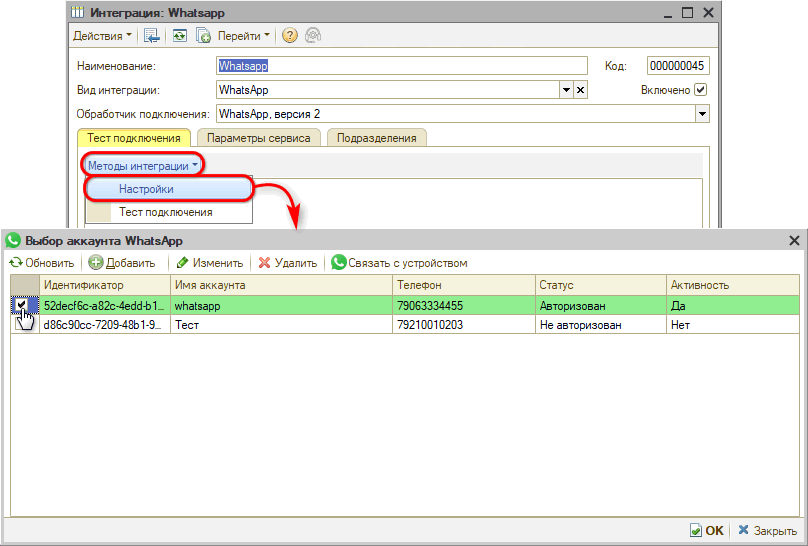

либо добавить новую:

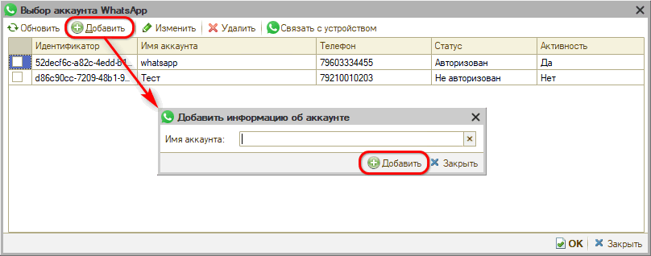

Следует заполнить имя аккаунта и нажать кнопку “Добавить”:

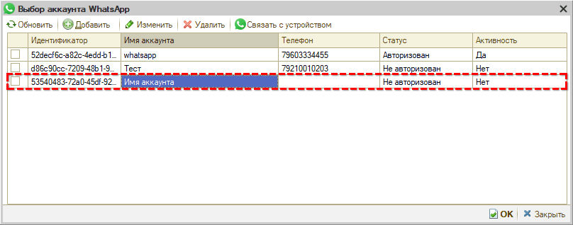

#### 2) Связь с устройством

Далее необходимо связать аккаунт с устройством. Для этого следует выбрать нужный аккаунт, *выделить* его галочкой и нажать кнопку *“Связать с устройством”* – при этом открывается окно *“Связывание с устройством”:*

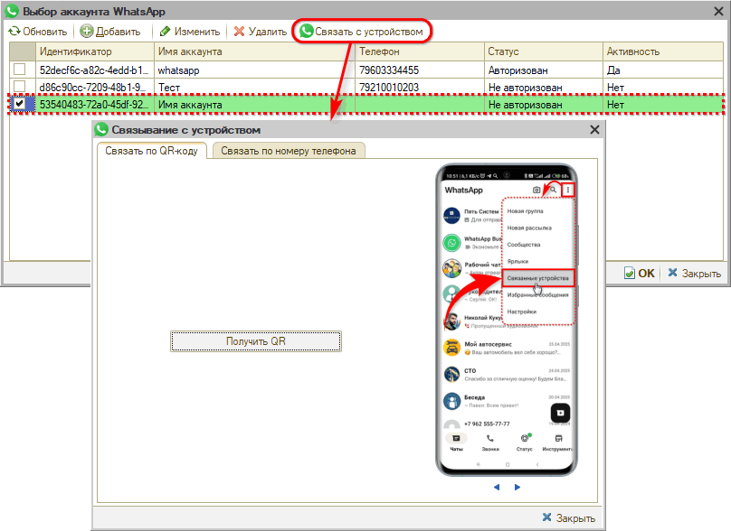

Связать аккаунт с устройством можно сделать двумя способами: по QR-коду или подтверждением по номеру телефона.

**Способ 1. По QR-коду**

На форме “Связывание с устройством” на вкладке *“Связать по QR-коду”* следует нажать кнопку *“Получить QR”:*

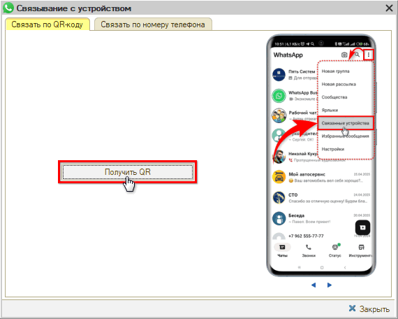

В результате будет выведен QR-код для сканирования:

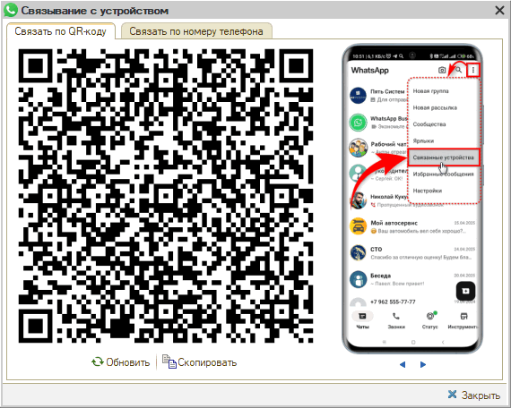

Далее необходимо на своем устройстве открыть приложение WhatsApp, нажать на 3 точки в верхнем правом углу, в открывшемся меню перейти в раздел “Связанные устройства” и нажать кнопку “Связывание устройства”:

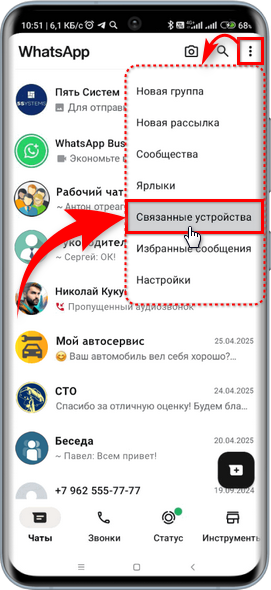 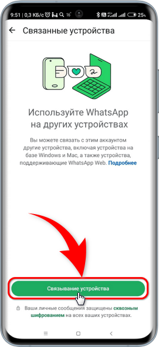

Далее следует подключиться к Wi-Fi либо подтвердить использование мобильного интернета:

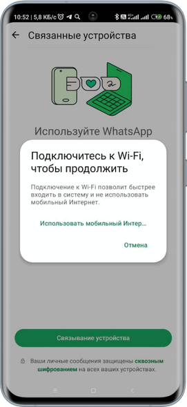

После этого открывается страница “Сканировать QR-код”:

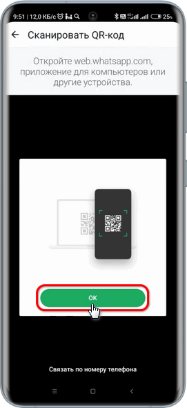

Следует нажать кнопку “ОК” и отсканировать с монитора выведенный ранее QR-код (см. [выше](#qr_kod)).

*Примечание:* Приложению должен быть предоставлен доступ к камере.

**Способ 2. Подтверждение по номеру телефона**

На форме “Связывание с устройством” на вкладке *“Связать по номеру телефона”* следует ввести телефонный номер устройства и нажать кнопку *“Получить код”:*

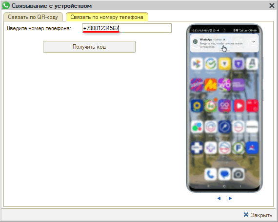

При этом на форму будет выведен код для привязки устройства:

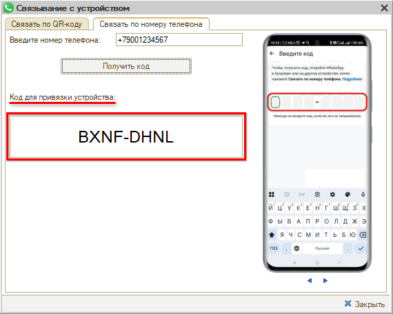

На устройстве будет получено Push-сообщение *“Введите код, чтобы связать новое устройство”:*

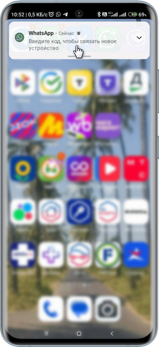

*\*Примечание: Если код не приходит, рекомендуем обновить версию приложения WhatsApp на устройстве, а также проверить обновление операционной системы смартфона.*

В приложении WhatsApp на устройстве следует перейти в раздел связывания устройств на страницу *“Сканировать QR-код” (см. [выше](#pereh_k_svyaz))* и нажать внизу экрана кнопку *“Связать по номеру телефона”:*

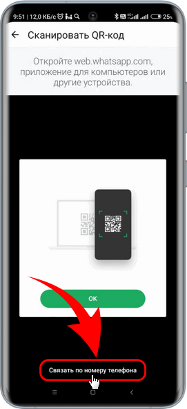

На открывшейся странице необходимо ввести полученный ранее *код* с формы привязки устройства в программе (см. [выше](#kod_d_privyaz)):

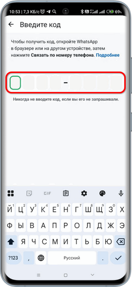

После успешной установки связи у аккаунта подтягивается телефон, статус меняется на *“Авторизован”,* значение параметра *“Активность”* меняется на *“Да”:*

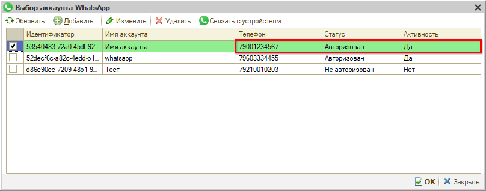

На вкладке *“Параметры сервиса”* автоматически заполняется параметр *“Идентификатор подключения к учетной записи WABA”:*

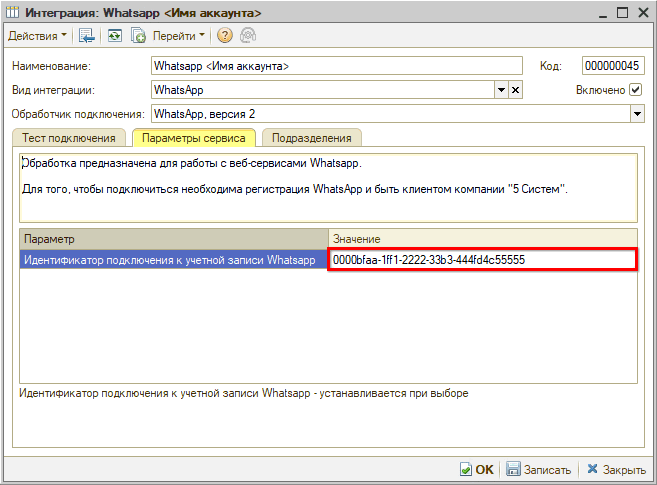

*Примечание:* В случае если в процессе привязки неправильно ввести код на устройстве, процесс регистрации будет временно заблокирован. При повторном нажатии кнопки "Получить код" будет выходить ошибка в программе, получить новый код можно будет минимум через 90 секунд.

### 4. Запись интеграции

После того, как произведены все настройки, необходимо установить *галочку “Включено”* и ***записать*** интеграцию нажатием кнопки *“Записать”* или *“ОК”:*

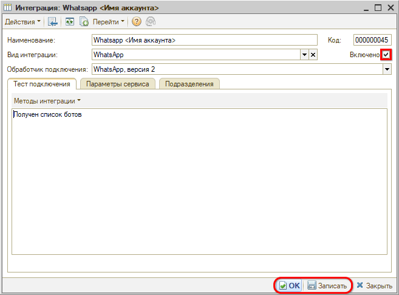

### 5. Тест подключения

При нажатии кнопки *“Методы интеграции → Тест подключения”* выводится информация о подключенном аккаунте:

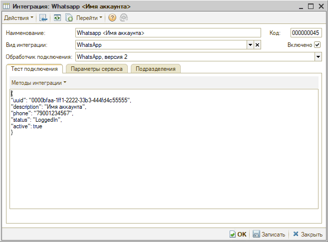

### 6. Редактирование аккаунта

Для изменения информации об аккаунте следует выделить нужный аккаунт, нажать кнопку *“Изменить”,* внести необходимые изменения и *сохранить:*

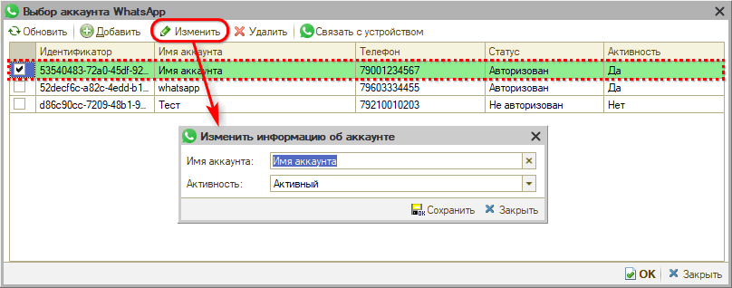

---

**Теги:** WhatsApp, интеграция, настройка, пользовательский аккаунт, мессенджеры

