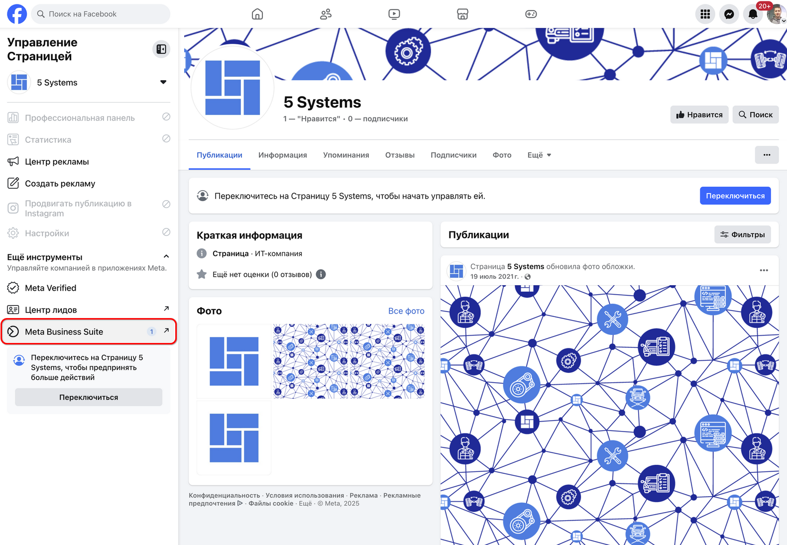
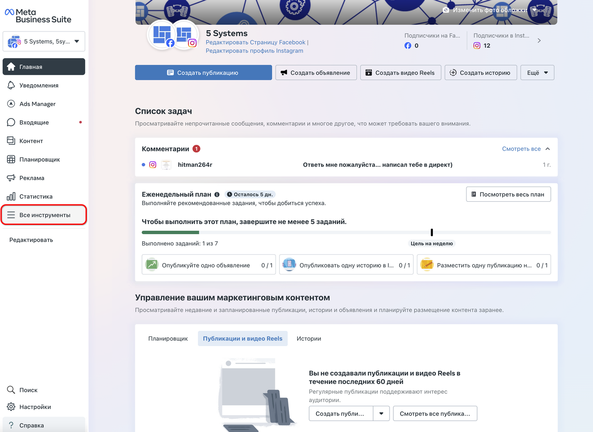
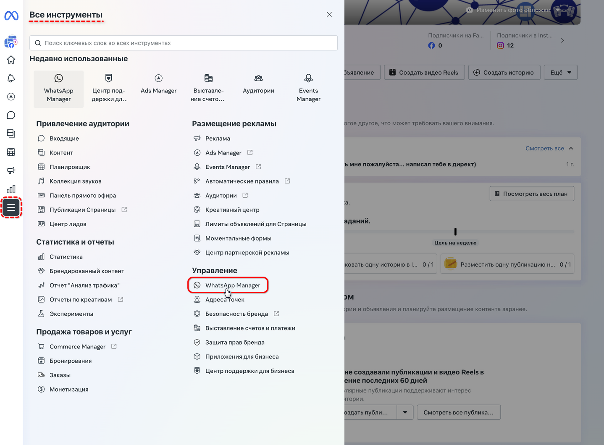
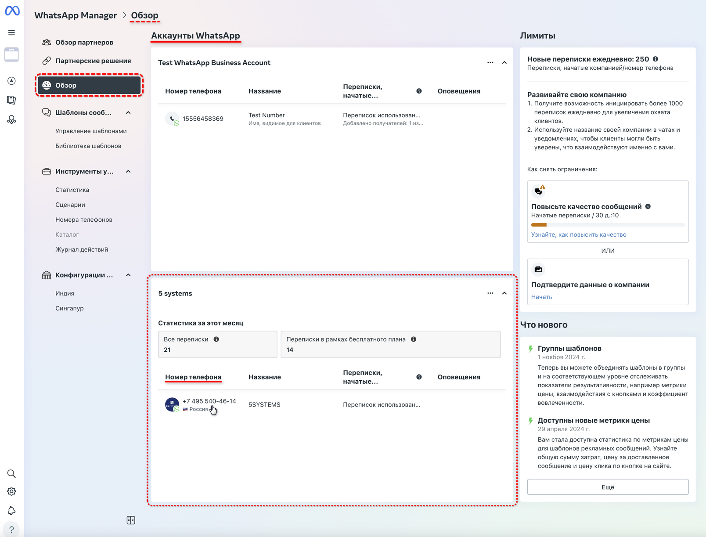
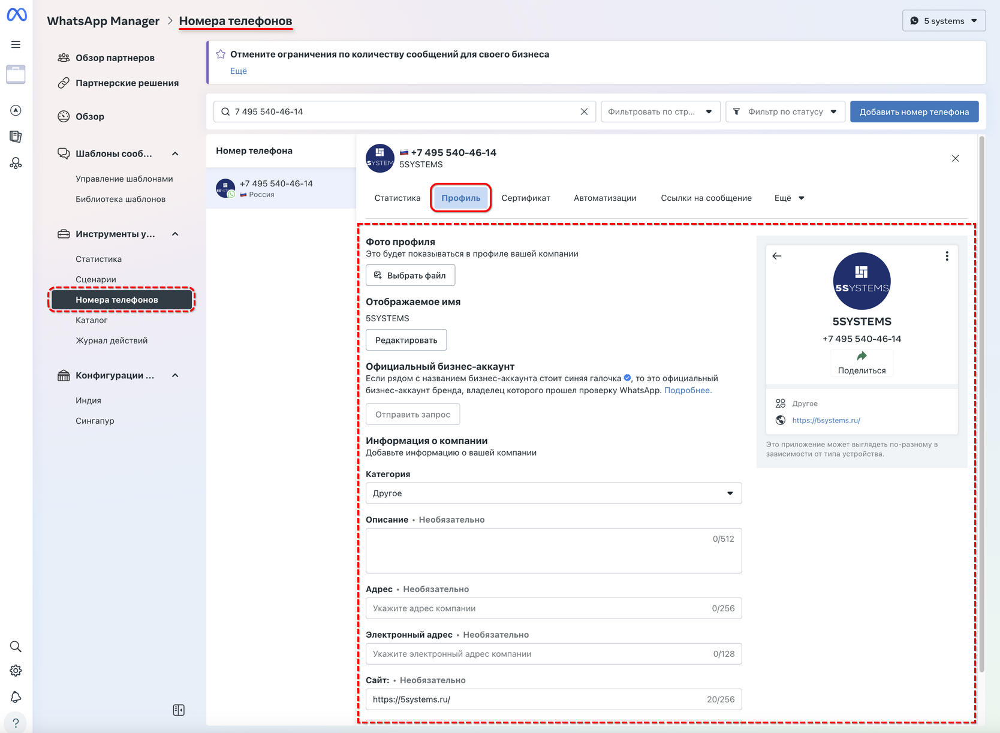
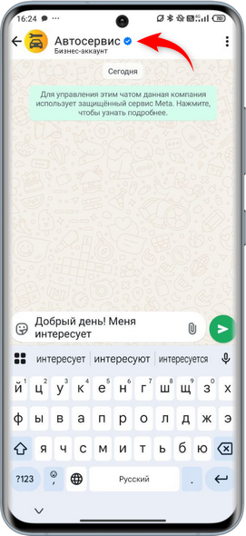

# Оформление аккаунта WhatsApp Business API

<table><tr><td><b>Время чтения:</b> 5 мин.</td><td><b>Обновлено:</b> 14.05.2025</td></tr></table>

Источник: https://www.5systems.ru/help/oformlenie-akkaunta-whatsapp-business-api

> *Функционал доступен начиная с релиза 2.8.2 в рамках [отдельной подписки](https://www.5systems.ru/services/integraciya-s-whatsapp-business-api-waba) либо в рамках [комплексной подписки "Контакт-центр 5S Chat"](https://www.5systems.ru/services/kontakt-centr-5s-chat) (актуальные тарифы см. в [Каталоге услуг](https://www.5systems.ru/services?field_tags_target_id%5B21%5D=21&sort_by=created&sort_order=ASC))*

## Содержание

1. [Введение](#введение)
2. [Переход к настройкам](#переход-к-настройкам)
3. [Заполнение профиля](#заполнение-профиля)
4. [Подтверждение компании в Facebook](#подтверждение-компании-в-facebook)

## Введение

Использование интеграции с **WhatsApp Business API (WABA)** позволяет настроить оформление профиля – задать имя компании, адрес, сайт и другие важные сведения, которые клиенты будут видеть при переходе на страницу компании в приложении WhatsApp. Все настройки производятся в ЛК Meta\* Business Suite, также можно произвести данные настройки через ЛК 360 Dialog.

См. основную статью “[Возможности бота WhatsApp Business API](../Возможности%20бота%20WhatsApp%20Business%20API/vozmozhnosti-bota-whatsapp-business-api.md)”, а также “[Настройки интеграции с WhatsApp Business API](../Настройка%20интеграции%20с%20WhatsApp%20Business%20API%20%28WABA%29/nastroyki-integracii-s-whatsapp-business-api.md)”.

## Переход к настройкам

Оформление аккаунта производится в настройках личного кабинета Meta\* Business Suite.

Перейти в данный раздел можно через ЛК в Facebook\*\*:

Далее следует открыть раздел “Все инструменты”:

И перейти в “WhatsApp Manager”:

На открывшейся странице “WhatsApp Manager” перейти в раздел “Обзор”. В открывшемся разделе “Аккаунты WhatsApp” кликнуть на номер телефона нужного аккаунта:

В открывшемся разделе “Номера телефонов” перейти на вкладку ***“Профиль”**.* На данной вкладке производится настройка внешнего вида бота WhatsApp Business API:

## Заполнение профиля

Следует задать для бота следующие настройки:

1. Загрузить *Фото профиля;*
2. Задать *Отображаемое имя;*
3. Заполнить *Информацию о компании:*
- Выбрать *Категорию;*
- Заполнить *Описание;*
- Указать *Адрес;*
- Заполнить *Сайт* и т.д.

Справа на странице раздела отображается предпросмотр профиля – как будет выглядеть страница бота для пользователей WhatsApp:

*Команды* появятся автоматически после [настройки интеграции с WhatsApp Business API](../Настройка%20интеграции%20с%20WhatsApp%20Business%20API%20%28WABA%29/nastroyki-integracii-s-whatsapp-business-api.md) в 5S AUTO – в данном случае они будут работать согласно *общей логике.* Также есть возможность настройки *индивидуальной логики* работы бота – в этом случае можно добавить дополнительные команды в разделе "Номера телефонов" (см. [выше](#nomera_telef)) на вкладке "Автоматизации" (подробнее см. [статью](../Возможности%20бота%20WhatsApp%20Business%20API/vozmozhnosti-bota-whatsapp-business-api.md)).

## Подтверждение компании в Facebook

*Подтверждение аккаунта*  – это информация о том, что данный профиль принадлежит подлинной компании и является официальным бизнес-аккаунтом, прошедшим проверку WhatsApp.

Подтверждение аккаунта дает дополнительные преимущества:

- значок синяя (ранее зеленая) “галочка” , который отображается рядом с именем компании в профиле, в списке чатов у клиентов и в самом чате;
- расширение лимитов инициируемых компанией переписок;
- больший уровень статуса и доверия у конечных пользователей.

Подробнее см. раздел “[Подтверждение компании](../Регистрация%20компании%20в%20Facebook%20и%20360dialog/registraciya-kompanii-v-facebook-i-360dialog.md#подтверждение-компании)” в статье “[Регистрация компании в Facebook\*\* и 360dialog](../Регистрация%20компании%20в%20Facebook%20и%20360dialog/registraciya-kompanii-v-facebook-i-360dialog.md)”, а также информацию на [сайте WhatsApp](https://faq.whatsapp.com/794517045178057/?locale=ru_RU).

*\*Meta признана экстремистской организацией, запрещенной на территории Российской Федерации.*

*\*\*Facebook является продуктом компании Meta, признанной экстремистской организацией, запрещенной на территории Российской Федерации.*

---

**Теги:** WhatsApp, WABA, аккаунт, оформление, профиль компании

