

# Пример индивидуальной настройки WABA

<table><tr><td><b>Время чтения:</b> 24 мин.</td><td><b>Обновлено:</b> 04.09.2026</td></tr></table>

Источник: https://www.5systems.ru/help/primer-individualnoy-nastroyki-waba

## Содержание

1. [Введение](#введение)
2. [Пример реализации отправки шаблонов сообщений](#пример-реализации-отправки-шаблонов-сообщений)
3. [Настройка шаблонов](#настройка-шаблонов)
   - [Кнопки и Опции](#кнопки-и-опции)
   - [1. Настройка шаблона с кнопками](#1-настройка-шаблона-с-кнопками)
   - [2. Настройка шаблона с опциями](#2-настройка-шаблона-с-опциями)
4. [Обработчики нажатия кнопок в диалогах](#обработчики-нажатия-кнопок-в-диалогах)

## Введение

В системе реализована возможность отправки клиенту шаблонов сообщений через WhatsApp – подробное описание см. в статье [Настройка шаблонов WhatsApp Business API](../../Настройка%20шаблонов%20WhatsApp%20Business%20API/nastroyka-shablonov-whatsapp-business-api.md). В данной статье рассматривается пример реализации этой функции.

## Пример реализации отправки шаблонов сообщений

Например, клиент инициирует диалог, отправив на номер компании сообщение “Привет”. В ответ он получает следующее автоматическое сообщение:

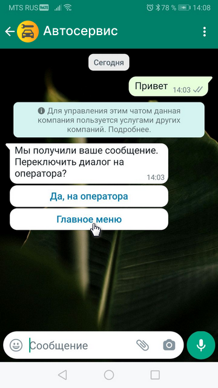

При выборе кнопки “*Главное меню”* клиент получает следующее автоматическое сообщение:

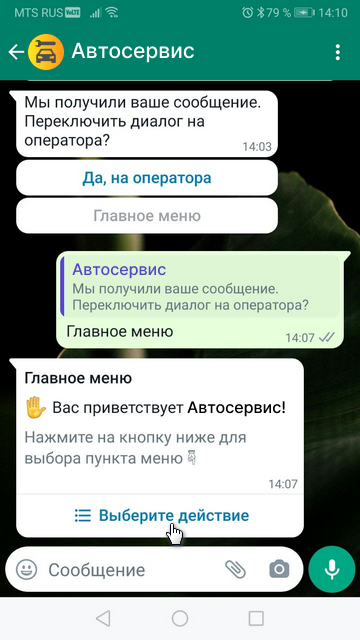

Далее клиент нажимает кнопку “Выберите действие” и переходит к выбору нужного пункта меню:

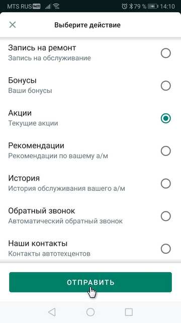

Например, клиент выбирает вариант “Акции” и нажимает “Отправить”. В ответ клиенту приходит новое сообщение с перечнем действующих акций – можно выбрать интересующую акцию:

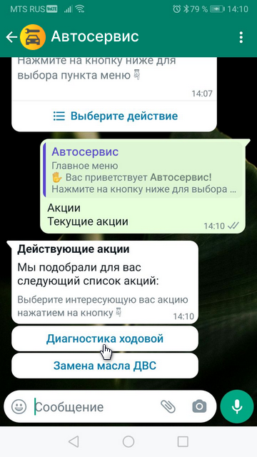

В следующем сообщении клиент получает информацию об этой акции, а также может выбрать дальнейшее действие – можно записаться по акции, либо перейти к списку акций, либо вернуться в главное меню:

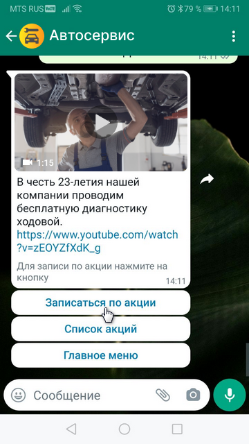

*Примечание:* Клиент может изначально вместо *Главного меню* выбрать вариант *“Переключить диалог на оператора”* и общаться не с ботом, а с реальным менеджером.

Канал доставки WhatsApp задается при настройке шаблонов автоматических сообщений в действии на значимое событие (например, “Записаны на ремонт”):

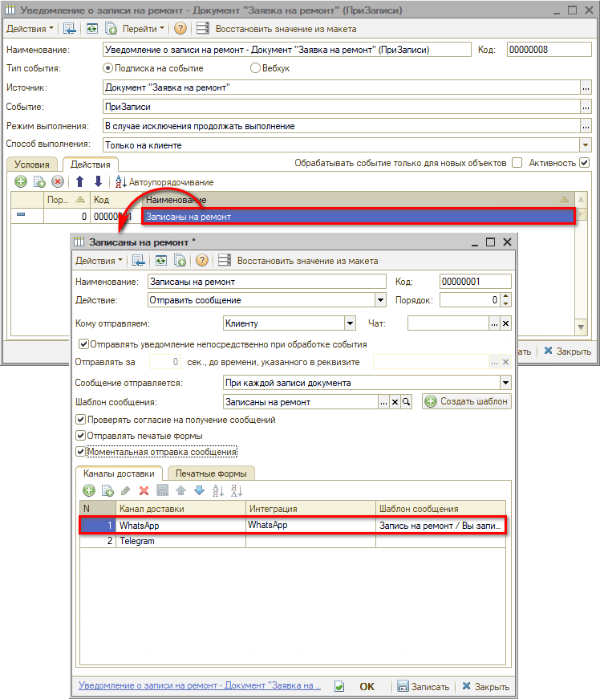

Для WhatsApp в табличной части добавлены две колонки: *Интеграция* и *Шаблон сообщения*. Интеграция позволяет указать конкретную интеграцию, через которую будут отправляться сообщения (например, подключено два WhatsApp – через который из них должны будут отправляться автоматические сообщения). В столбце “Шаблон сообщения” можно указать, какой конкретно шаблон будет использоваться для WhatsApp. Для всех остальных каналов будет браться шаблон по умолчанию.

## Настройка шаблонов

Как перейти к настройке шаблонов сообщений для WABA, см. в статье "[Настройка шаблонов WhatsApp Business API](../../Настройка%20шаблонов%20WhatsApp%20Business%20API/nastroyka-shablonov-whatsapp-business-api.md#переход-к-настройке)".

Для сообщений, отправляемых по WhatsApp, реализован специальный шаблон – он имеет заголовок, тело, подвал и т.д.:

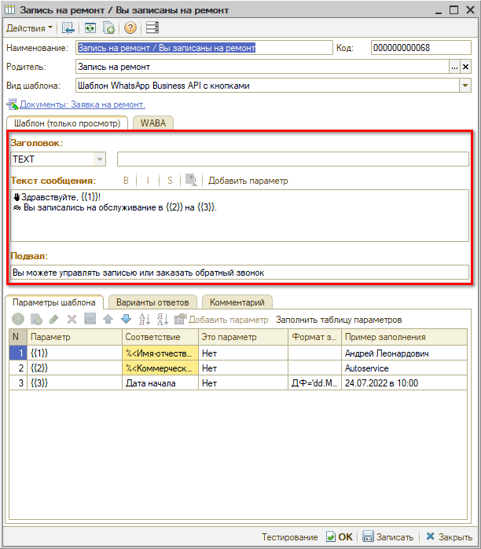

Наполнение шаблона и отправка его на согласование производится прямо внутри программы: то есть, чтобы создать шаблон или посмотреть его статус, не нужно заходить в интерфейс Facebook или WhatsApp.

В настройке шаблона есть параметр *Вид шаблона:*

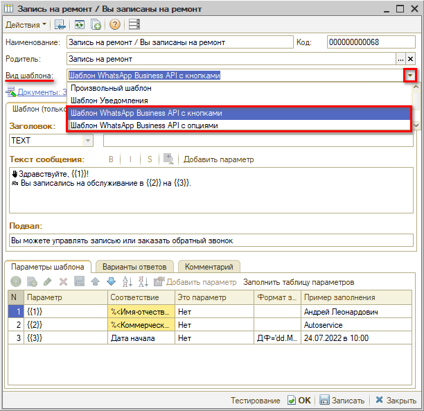

Данный реквизит имеет 4 доступных значения, для WhatsApp используются два последних вида:

- Шаблон WhatsApp Business API с кнопками;
- Шаблон WhatsApp Business API с опциями.

### Кнопки и Опции

Пример отображения сообщения с Кнопкам в WhatsApp:

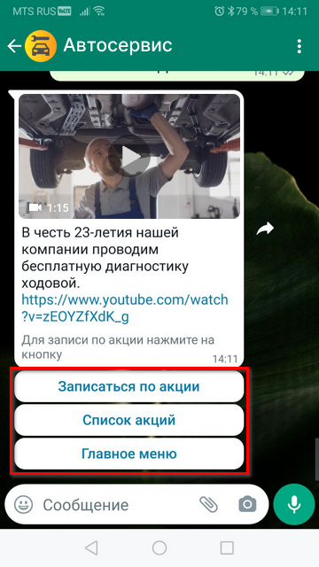

У кнопок есть ограничение: их всего может быть максимум 3. Если нужно меню с большим списком, выбор заказ-наряда и т.д. необходимо использовать опции.

Например, *Выберите действие* – это опция:

 &nbsp;&nbsp;&nbsp; 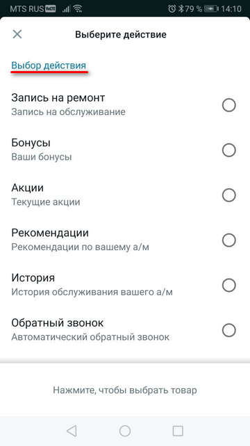

Если требуется выбрать из 2 или 3-х вариантов – можно использовать кнопки.

У шаблонов с кнопками есть следующие нюансы:

1. Приветственное сообщение, которое мы отправляем клиенту, должно быть *обязательно* шаблоном с кнопками:

   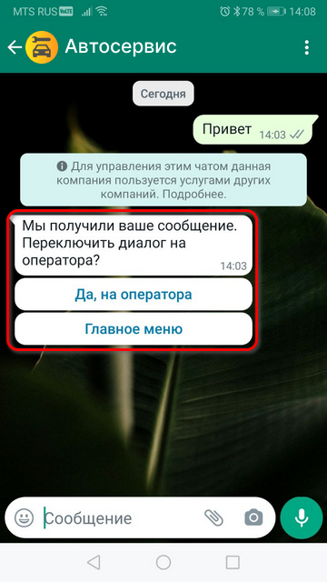

2. Тип кнопки задается в параметрах шаблона на вкладке “Варианты ответов”:

   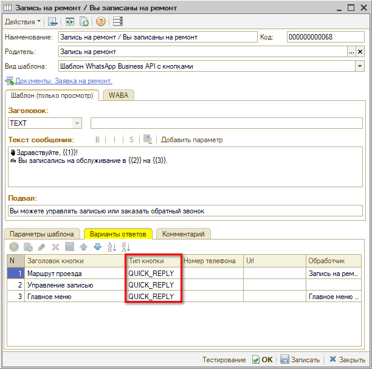

Некоторые комбинации типов кнопки недопустимы.

Данный шаблон находится в режиме просмотра *(*на вкладке “Шаблон” написано: “*только просмотр”*), т.к. его статус утвержден *(“approved”):*

**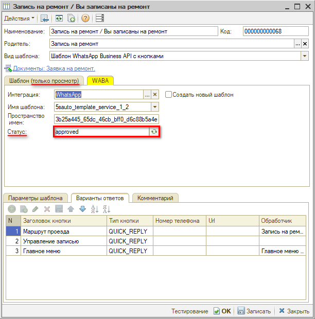**

Статус подтягивается с сервера WhatsApp.

### 1. Настройка шаблона с кнопками

#### Вкладка Шаблон

На вкладке “Шаблон” находятся следующие параметры:

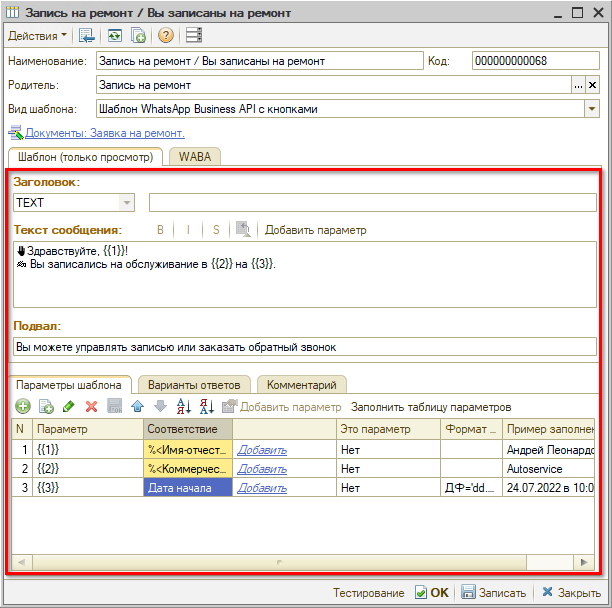

1. *Заголовок*: может меняться, в данном случае – пустой. 
   У *Заголовка* есть 4 варианта:  
   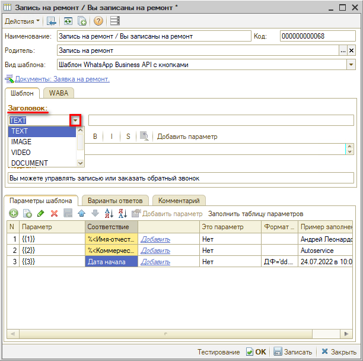  
   **1.** TEXT; 
   **2.** IMAGE; 
   **3.** VIDEO; 
   **4.** DOCUMENT.
2. *Текст сообщения* содержит специальные символы, а также цифры в фигурных скобках {{1}} – это параметры шаблона, они задаются на вкладке “Параметры”:  
   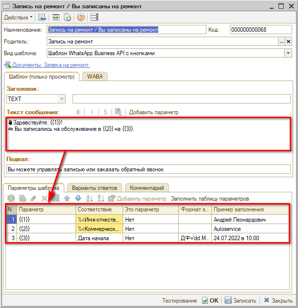  
   В столбце “Соответствие” задается либо *Произвольное действие,* либо *Реквизит объекта* (объект в данном случае – Заявка на ремонт, реквизит – Дата начала):  
   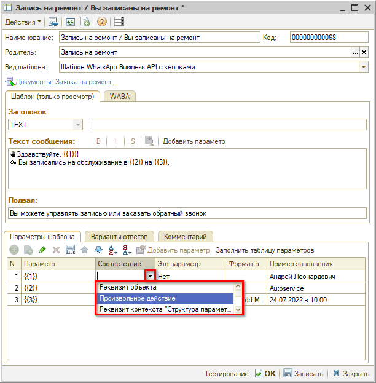  
   Можно также задать *Формат вывода* (для Даты начала) и *Примеры заполнения* в соответствующих столбцах. 
   На вкладке “Варианты ответов” задается список кнопок, которые в данном шаблоне присутствуют:  
   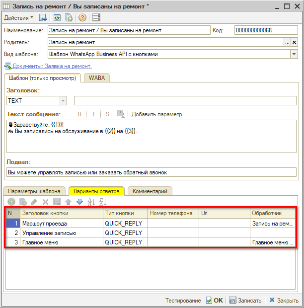  
   Кнопки имеют следующие параметры: 
   **1.** *Заголовок кнопки;* 
   **2.** *Тип кнопки:* QUICK_REPLY – это быстрый ответ; 
   **3.** Заданы *Обработчики* – это значимые события, которые будут вызываться при нажатии на эти кнопки, чтобы отправить клиенту новое сообщение.

### Вкладка WABA

Вкладка WABA видна только для вида шаблона для WhatsApp *с кнопками*. На вкладке содержатся следующие параметры шаблона:

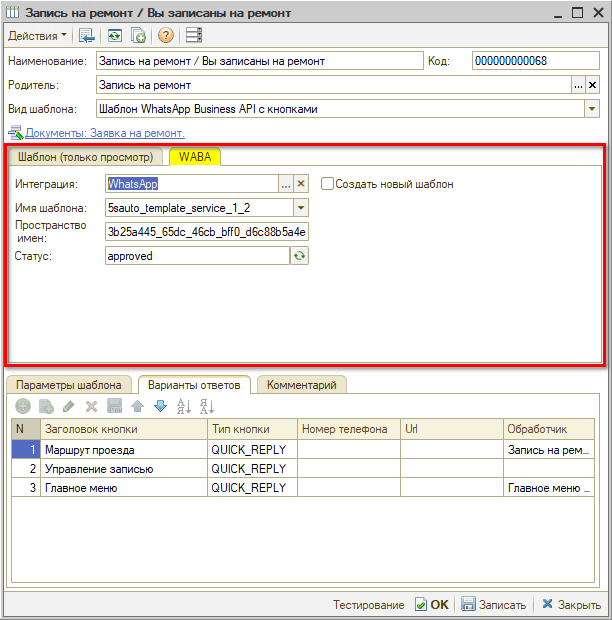

- *Интеграция*;
- *Имя шаблона* – в данном поле производится выбор шаблона из списка ранее созданных. 
  Нажатием на кнопку со стрелкой открывается список всех шаблонов, предварительно созданных в интерфейсе WhatsApp:

  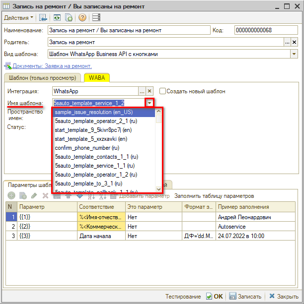

- *Пространство имен* – служебная информация;
- *Статус* – подтягивается с сервера WhatsApp, статус можно обновлять:

  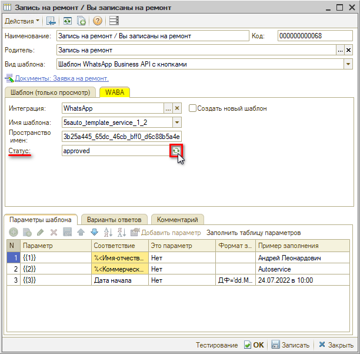

Галочка “*Создать новый шаблон*” используется, если требуется внести какие-либо изменения в текущий шаблон, либо создать новый. Для этого на вкладке “Шаблон” в текст и параметры шаблона следует внести необходимые изменения, затем на вкладке “WABA” нажать кнопку “Отправить на модерацию” (появляется при активации галочки):

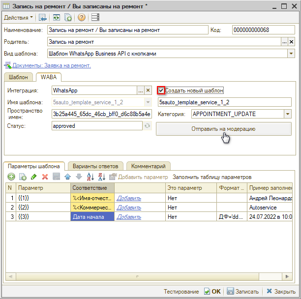

В течение 10-15 минут шаблон становится доступен для использования (проверка выполняется роботами).

### 2. Настройка шаблона с опциями

Пример шаблона *с опциями* – шаблон *Главное меню:*

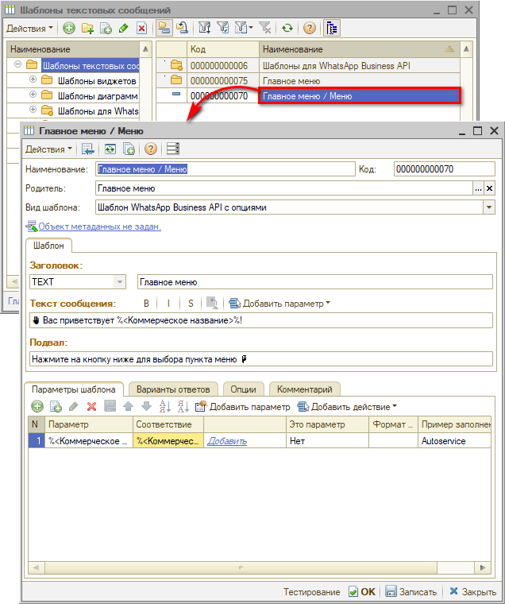

В целом структура шаблона похожа на шаблон с кнопками, но данный шаблон не требуется утверждать, поэтому нет вкладки WABA.

*Параметры шаблона* задаются и настраиваются аналогично.

*Варианты ответов* – в данном случае указывается название и тип кнопки, которая будет видна в шаблоне:

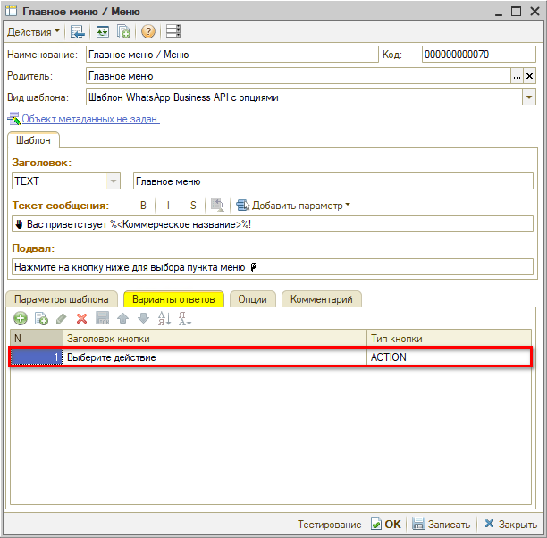

Отображение сообщения с опциями в WhatsApp:

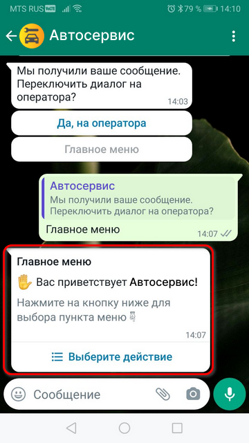

Вкладка “Опции” активна только для шаблонов с опциями:

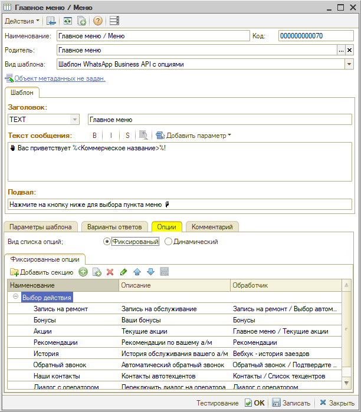

Параметр *Вида списка опций* имеет два варианта значений: Фиксированный или Динамический.

При выборе *Динамического* вида списка появляется вкладка “Динамические опции” для настройки параметров:

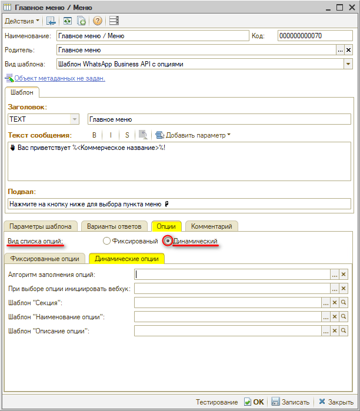

Данный вид списка опций предназначен для программного наполнения опций – например, для формирования списка заказ-нарядов, т.е. истории обслуживания клиента, или списка акций – т.е. когда наполнение списка опций должно производиться определенным образом.

Для Главного меню используется *фиксированный* набор опций:

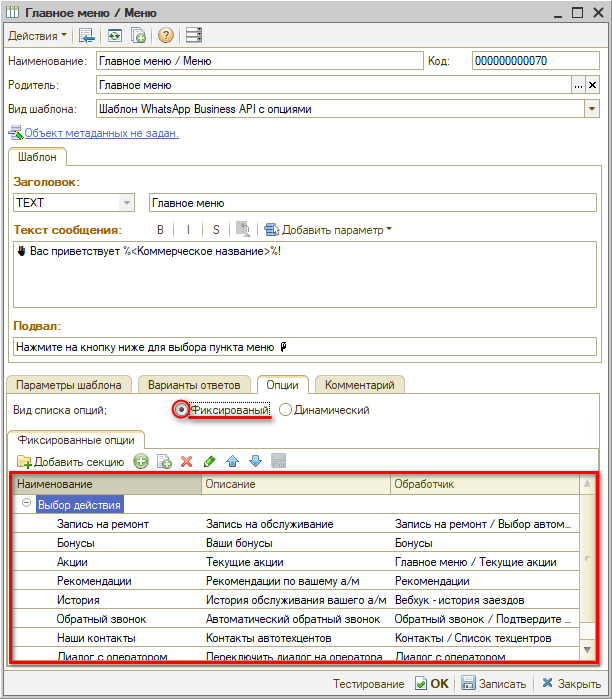

Список опций задается в таблице, указывается *Наименование*, *Описание* и *Обработчик*, который будет вызываться.

## Обработчики нажатия кнопок в диалогах

При нажатии в сообщении в WatsApp на опцию “Акции” вызывается обработчик “Главное меню / Текущие акции”:

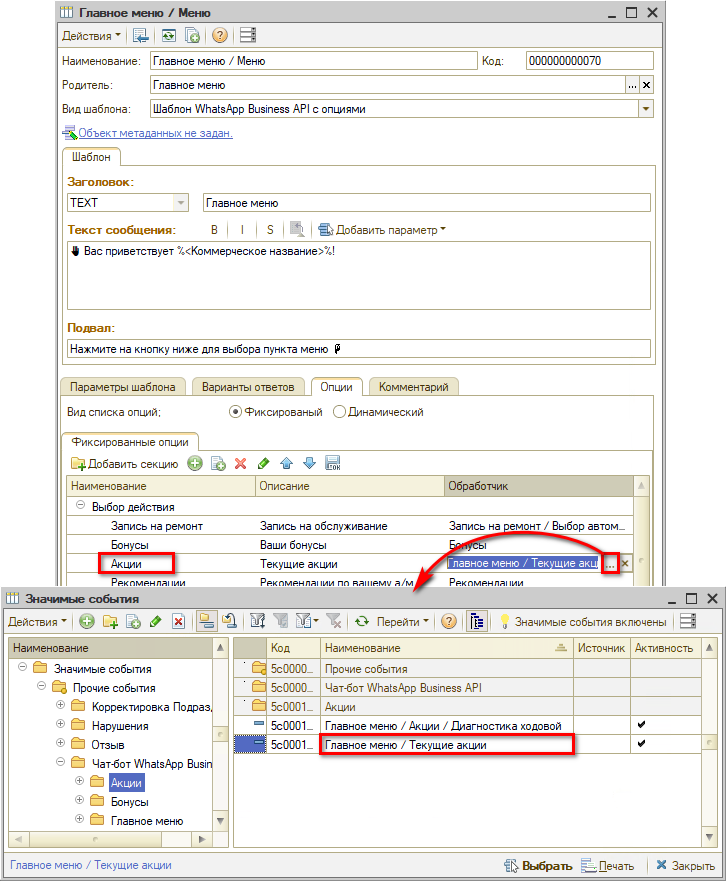

*Главное меню / Текущие акции* – это пример значимого события с *типом события* “Вебхук\*”:

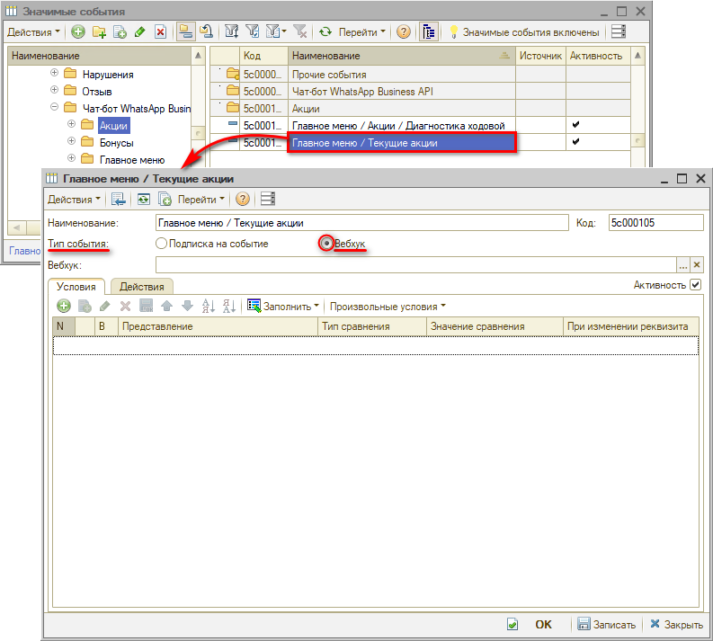

\**Вебхук* - это способ отправки уведомлений пользователю, когда приходит запрос с веб-страницы или веб-приложения, т.е. механизм оповещения системы о внешних событиях из интернета (например, когда клиент отправляет заявку на сайте).

Условий выполнения в данном случае не задано. Имеется одно действие – отправить в WhatsApp шаблон “Текущие акции”:

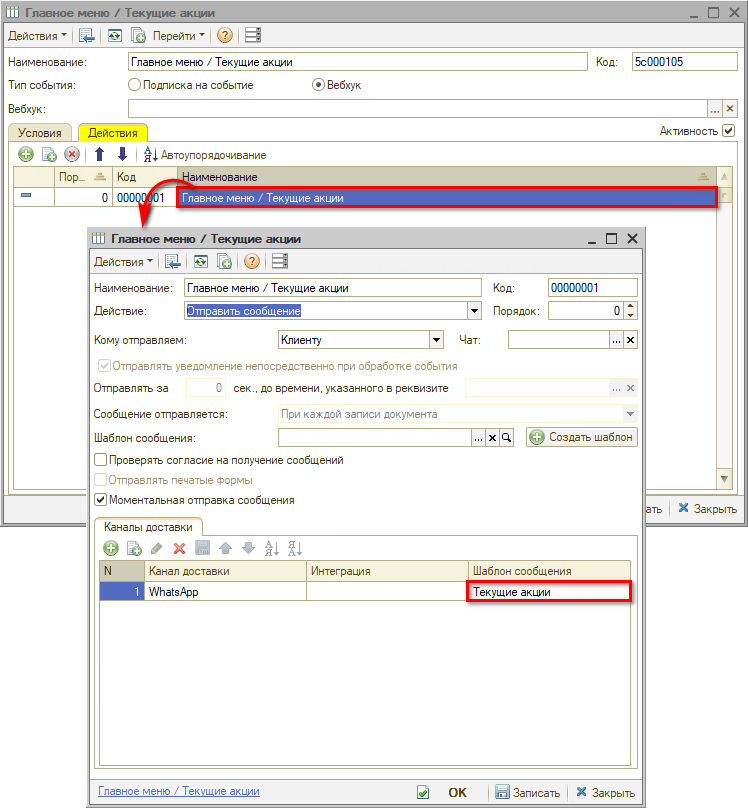

Это уже другое сообщение, которое получит клиент:

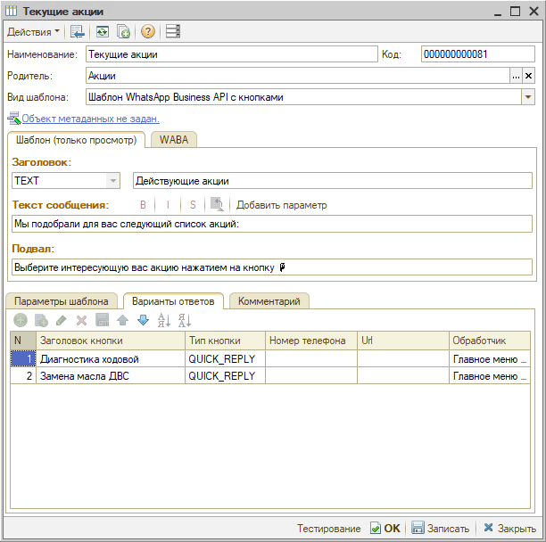

Таким образом, когда программа получает входящий вебхук, она отправляет клиенту новое сообщение.

---

**Теги:** WhatsApp, WABA, индивидуальная настройка, пример, шаблоны

