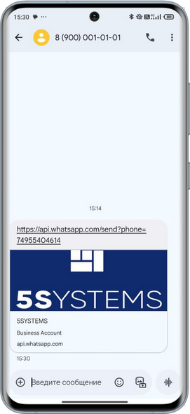
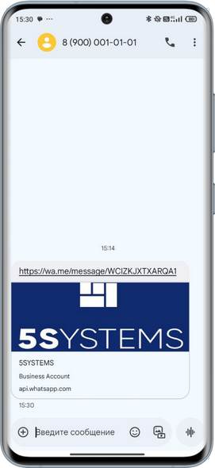
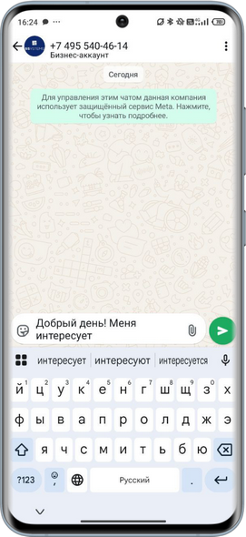
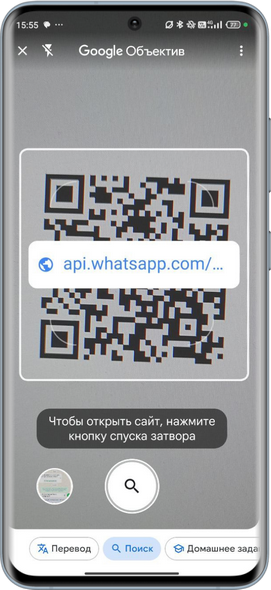
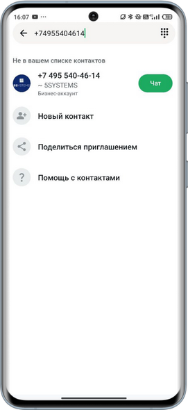
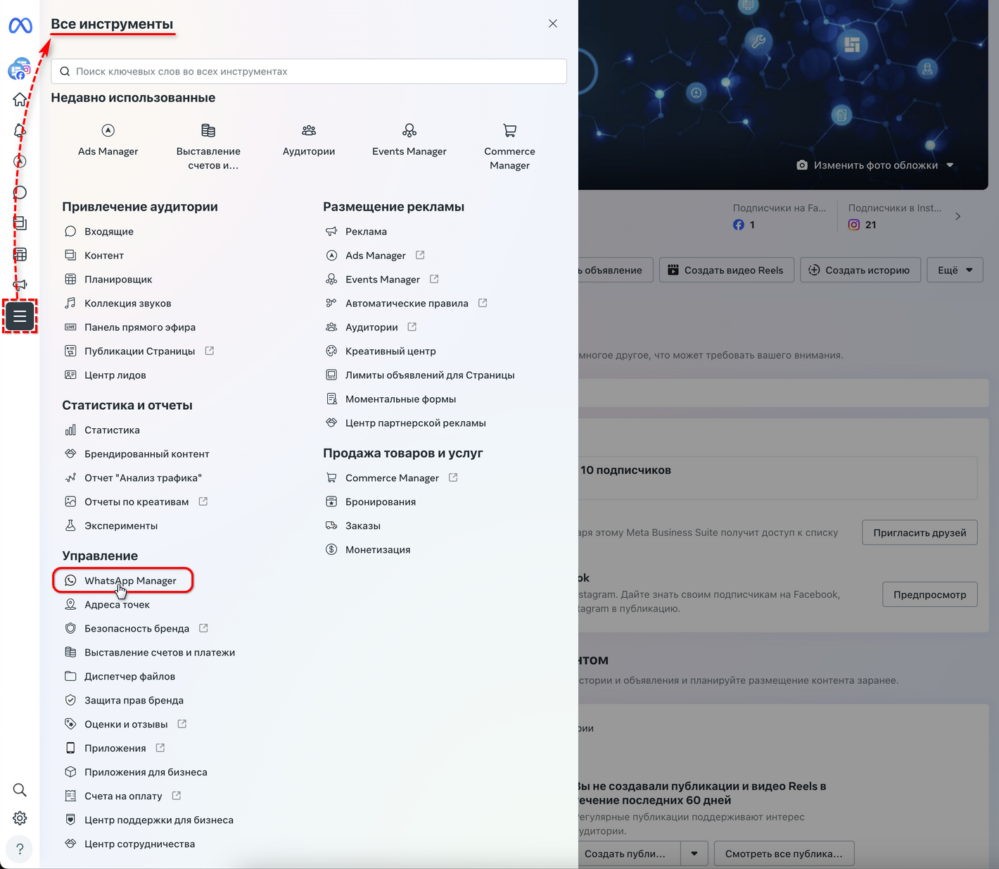
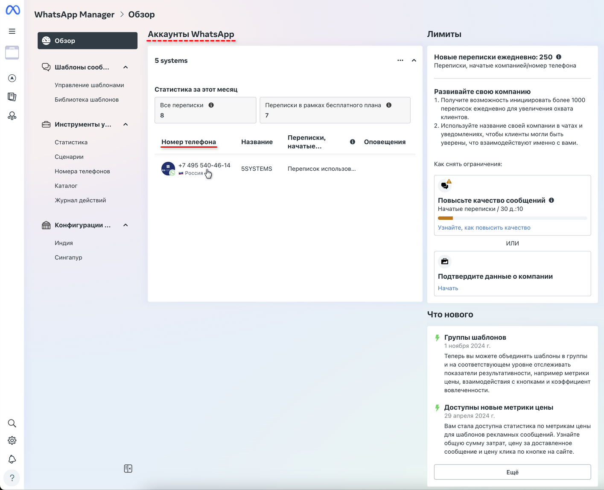
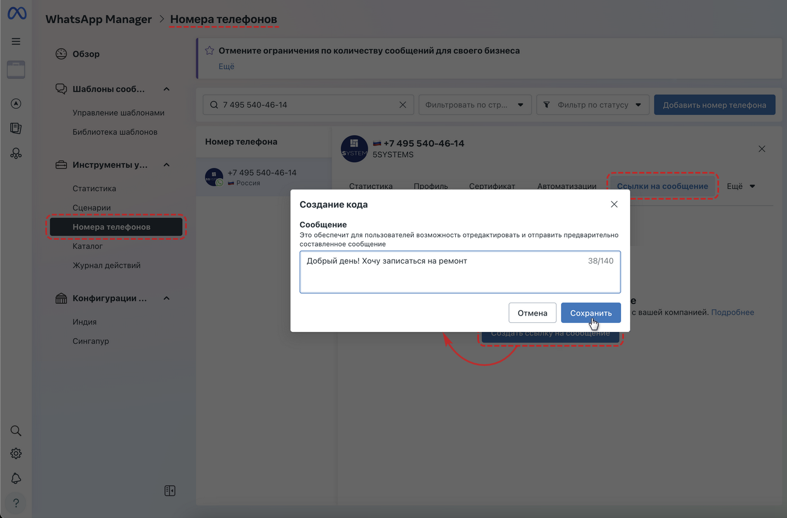
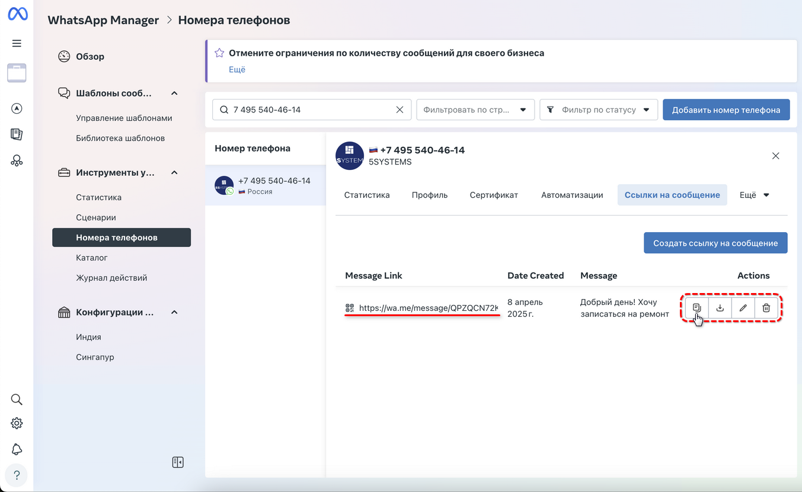

# Способы перехода в чат WhatsApp

<table><tr><td><b>Время чтения:</b> 5 мин.</td><td><b>Обновлено:</b> 14.05.2025</td></tr></table>

Источник: https://www.5systems.ru/help/sposoby-perekhoda-v-chat-whatsapp

## Содержание

1. [Введение](#введение)
2. [Способы перехода пользователя в чат](#способы-перехода-пользователя-в-чат)
   - [1. Ссылка по номеру телефона](#1-ссылка-по-номеру-телефона)
   - [2. Ссылка на сообщение для WhatsApp Business API](#2-ссылка-на-сообщение-для-whatsapp-business-api)
   - [3. Ссылка в виде QR-кода](#3-ссылка-в-виде-qr-кода)
   - [4. Поиск чата по номеру телефона](#4-поиск-чата-по-номеру-телефона)
3. [Создание ссылки на сообщение (только для WABA)](#создание-ссылки-на-сообщение-только-для-waba)

## Введение

В текущей статье описаны способы перехода клиентов в чат [*пользовательского WhatsApp*](../Настройка%20интеграции%20с%20WhatsApp/nastroyka-integracii-s-whatsapp.md) компании и в чат *[WhatsApp Business API (WABA)](../Настройка%20интеграции%20с%20WhatsApp%20Business%20API%20%28WABA%29/nastroyki-integracii-s-whatsapp-business-api.md).*

Также см. статьи:

- [Возможности бота WhatsApp Business API](../Возможности%20бота%20WhatsApp%20Business%20API/vozmozhnosti-bota-whatsapp-business-api.md);
- [Настройки интеграции с WhatsApp Business API](../Настройка%20интеграции%20с%20WhatsApp%20Business%20API%20%28WABA%29/nastroyki-integracii-s-whatsapp-business-api.md);
- [Оформление аккаунта WhatsApp Business API](../Оформление%20аккаунта%20WhatsApp%20Business%20API/oformlenie-akkaunta-whatsapp-business-api.md);
- [Настройка интеграции с WhatsApp](../Настройка%20интеграции%20с%20WhatsApp/nastroyka-integracii-s-whatsapp.md)

и другие статьи в разделе “[WhatsApp](https://www.5systems.ru/help/whatsapp)”.

Для работы с чатом WhatsApp и WABA предварительно у клиентов должно быть установлено приложение WhatsApp.

## Способы перехода пользователя в чат

### 1. Ссылка по номеру телефона

Данный способ универсален для WABA и пользовательского WhatsApp.

Компания отправляет клиенту ссылку на чат в сообщении либо размещает ссылку на сайте. Клиент переходит по ссылке и открывает чат на своем устройстве.

Пример пригласительной ссылки по номеру телефона: *[https://api.whatsapp.com/send?phone=79000000000](https://api.whatsapp.com/send?phone=790000000%D0%A5%D0%A5)*

### 2. Ссылка на сообщение для WhatsApp Business API

Короткая ссылка на сообщение используется *только для WABA. *

Пример короткой ссылки: *[https://wa.me/message/WCIZKJXTXARQA1](https://wa.me/message/WCIZKJXTXARQA1)*

Ссылка создается в разделе “WhatsApp Manager” ЛК Meta\* Business Suite – инструкцию см. [*ниже*](#создание-ссылки-на-сообщение-только-для-waba)*.*

### 3. Ссылка в виде QR-кода

Приветственную ссылку можно упаковать в QR-код. Клиент сканирует QR-код и переходит в чат.

Сгенерировать QR-код можно при помощи специальных сервисов, например: [qrcoder.ru](http://qrcoder.ru), [qrcode-monkey.com/ru](http://qrcode-monkey.com/ru), [code-qr.ru](http://code-qr.ru).

В генераторе следует ввести ссылку на свой ранее созданный чат вида *“https://wa.me/message/…”* или *“https://api.whatsapp.com/send?phone=…”* и создать код. Созданный QR-код можно вывести на монитор, разместить на сайте, либо распечатать и расположить в любом удобном для сканирования клиентами месте.

### 4. Поиск чата по номеру телефона

Клиент самостоятельно находит чат через поиск в WhatsApp по номеру телефона компании и переходит в него:

## Создание ссылки на сообщение (только для WABA)

Есть возможность настроить специальную короткую ссылку на чат WhatsApp Business API с предварительно составленным текстом сообщения, который пользователь может отредактировать и отправить компании.

При этом компания получит входящее сообщение, и при ответе на него в свободной форме (не шаблоном) запустится бесплатное (в рамках базовой абонентской платы) 24-часовое окно диалога.

*Примечание:* Такой же диалог откроется, если клиент самостоятельно найдет чат компании по номеру телефона, напишет интересующий его вопрос, и получит ответное сообщение.

Подробнее о диалоговой системе WABA и об отличиях в инициации диалогов компанией и пользователями см. в статье “[Настройка шаблонов WhatsApp Business API](../../Настройка%20шаблонов%20WhatsApp%20Business%20API/nastroyka-shablonov-whatsapp-business-api.md#диалоговая-система-waba)”.

Чтобы настроить ссылку с шаблоном для отправки пользователем следует в ЛК Meta\* Business Suite в разделе “Все инструменты” перейти в раздел “WhatsApp Manager”:

Перейти в настройки аккаунта нажатием на номер телефона:

В открывшемся разделе “Номера телефонов” следует перейти на вкладку “Ссылки на сообщение”. Здесь можно задать текст предварительно составленного сообщения для отправки пользователем, например: *“Добрый день! Хочу записаться на ремонт”.*

Созданную ссылку можно скопировать и использовать для приглашения клиентов в чат WABA (см. [выше](#2-ссылка-на-сообщение-для-whatsapp-business-api)):

*\*Meta признана экстремистской организацией, запрещенной на территории Российской Федерации.*

---

**Теги:** WhatsApp, чат, переход в чат, ссылка, мессенджеры

