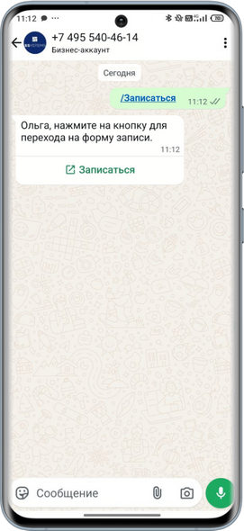
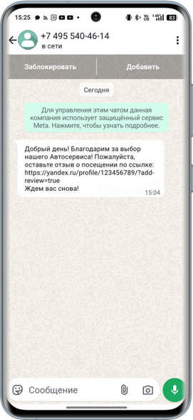
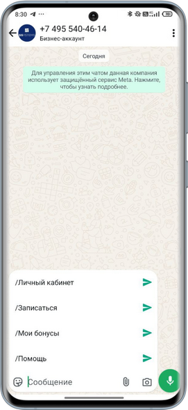
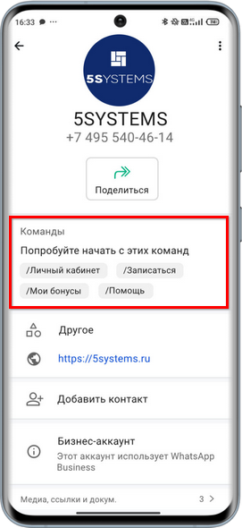

# Сравнение возможностей WABA и пользовательского WhatsApp

<table><tr><td><b>Время чтения:</b> 8 мин.</td><td><b>Обновлено:</b> 21.05.2025</td></tr></table>

Источник: https://www.5systems.ru/help/sravnenie-vozmozhnostey-waba-i-polzovatelskogo-whatsapp

> *Функционал доступен начиная с релиза 2.8.3.*

## Содержание

1. [Введение](#введение)
2. [Сравнение возможностей](#сравнение-возможностей)

## Введение

Подключить **WhatsApp** к 5S AUTO можно двумя способами: с помощью интеграции с [пользовательским WhatsApp](../Настройка%20интеграции%20с%20WhatsApp/nastroyka-integracii-s-whatsapp.md) и через официальное решение Meta\* – [WhatsApp Business API (WABA)](../Настройка%20интеграции%20с%20WhatsApp%20Business%20API%20%28WABA%29/nastroyki-integracii-s-whatsapp-business-api.md).

Оба решения позволяют вести переписку с клиентами из программы, но процесс подключения, возможности и задачи у них разные.

Подключение *официального WhatsApp Business API* – более трудоемкий и длительный процесс, но данная интеграция позволяет полноценно использовать все функции канала WhatsApp для общения с клиентами.

При работе с WhatsApp при любом способе подключения необходимо принять и не нарушать [Политику обмена сообщениями](https://www.whatsapp.com/legal/business-policy/?content_id=Y5bHWD0s3UAXyGs) и [Правила торговой политики](https://www.whatsapp.com/legal/commerce-policy/?content_id=tgSfxhlLZbd6wmi).

## Сравнение возможностей

<table><tr><td></td><td><b>Интеграция с Whatsapp Business API (WABA)</b></td><td><b>Интеграция с пользовательским WhatsApp</b></td></tr><tr><td colspan="3"><b><i>1. Переписка с клиентами</i></b></td></tr><tr><td><b>1.1. Массовые рассылки</b></td><td>Возможность массовых рассылок и оповещений на любую аудиторию – нужно только согласовать <a href="https://www.5systems.ru/help/nastroyka-shablonov-whatsapp-business-api">шаблон</a>. До 100 000 сообщений в сутки с одного аккаунта. Лимит количества сообщений зависит от истории использования канала и наличия верификации компании <i>(см. <a href="https://www.5systems.ru/help/registraciya-kompanii-v-facebook-i-360dialog#podtvkomp">статью</a>)</i></td><td>Делать массовые рассылки рискованно. За спам и подозрение в автоматизации аккаунт с очень высокой вероятностью быстро заблокируют</td></tr><tr><td><b>1.2. Интерактивные сообщения</b></td><td>Возможность добавления кнопок для быстрого отклика клиента:   Подробнее см. в статье “<a href="https://www.5systems.ru/help/primer-individualnoy-nastroyki-waba">Пример индивидуальной настройки WABA</a>”</td><td>Нет возможности использовать кнопки в сообщениях</td></tr><tr><td><b>1.3. Отправка гиперссылок</b></td><td>Возможность отправки кликабельных гиперссылок (например, на приложение <a href="https://www.5systems.ru/help/nastroyka-prilozheniya-5s-link-v2">5S Link</a>):  </td><td>При отправке гиперссылки в чат клиент не сможет по ней перейти, <i>пока не добавит контакт в адресную книгу:</i>  </td></tr><tr><td><b>1.4. Тарификация</b></td><td>Каждый диалог тарифицируется. Стоимость зависит от того, кто первым начал общение: подписчик или компания, и от типа сообщения. Подробнее см. в статье “<a href="https://www.5systems.ru/help/nastroyka-shablonov-whatsapp-business-api#dialogsys">Настройка шаблонов WhatsApp Business API</a>”</td><td>Чтобы начать в WhatsApp переписку, нужен только номер телефона клиента. Компания может инициировать переписку с клиентом бесплатно и без ограничения в 24 часа</td></tr><tr><td><b>1.5. Вероятность блокировки аккаунта</b></td><td>Очень низкая. Ограничение только на вирусную рекламу – но даже в этом случае заблокируют не аккаунт, а шаблон. При повторном нарушении могут уменьшить количество доступных переписок в сутки. Подробнее см. статью “<a href="https://www.5systems.ru/help/vozmozhnye-problemy-s-waba-i-ikh-ustranenie">Возможные проблемы с WABA и их устранение</a>”</td><td>При попытке массовых рассылок – высокая. Кроме того, если пользователь захочет с вами связаться через время, а номер будет уже заблокирован, вы потеряете с ним контакт</td></tr><tr><td colspan="3"><b><i>2. Взаимодействие с ботом</i></b></td></tr><tr><td><b>2.1. Автоматизация</b></td><td>Автоматизация обслуживания клиентов с помощью <b><i>бота</i></b> – бот может отвечать на стандартные вопросы пользователей моментально и в любое время суток, выдавать информацию по запросам, а также собирать от клиентов обратную связь. Подробнее см. статью “<a href="https://www.5systems.ru/help/vozmozhnosti-bota-whatsapp-business-api">Возможности бота WhatsApp Business API</a>”</td><td>Автоматизация возможна, но с учетом ограничений, описанных в других пунктах текущей статьи. Шаблоны и готовые ответы могут использоваться, но только текстовые с картинкой</td></tr><tr><td><b>2.2. Стартовое меню</b></td><td>Стартовое меню для начала общения с ботом нового пользователя:   Подробнее см. в <a href="https://www.5systems.ru/help/vozmozhnosti-bota-whatsapp-business-api#menu">статье</a></td><td>Не предусмотрено</td></tr><tr><td colspan="3"><b><i>3. Профиль компании</i></b></td></tr><tr><td><b>3.1. Синяя галочка</b></td><td>Синяя галочка  <i>(ранее зеленая)</i> и имя компании в профиле WhatsApp после верификации в Facebook**. Больший уровень статуса и доверия клиентов. Пользователю не нужно добавлять номер в контакты: он всегда видит официальное название компании. Подробнее см. в <a href="https://www.5systems.ru/help/oformlenie-akkaunta-whatsapp-business-api#podtv_v_fb">статье</a></td><td>Верификация компании не предусмотрена. Данные аккаунта компании смогут видеть пользователи, сохранившие номер в своей адресной книге. Если номер не сохранен, клиенты будут видеть только номер телефона компании</td></tr><tr><td><b>3.2. Меню быстрых действий</b></td><td>Использование команд для перехода в ЛК приложения <a href="https://www.5systems.ru/help/nastroyka-prilozheniya-5s-link-v2">5S Link</a>, записи на ремонт, просмотра бонусного счета и т.д.:   Подробнее см. в <a href="https://www.5systems.ru/help/vozmozhnosti-bota-whatsapp-business-api#komandy">статье</a></td><td>Не предусмотрено</td></tr><tr><td colspan="3"><b><i>4. Подключение</i></b></td></tr><tr><td><b>4.1. Надежность работы</b></td><td>Подключение WABA происходит через официальный ключ API – это самый надежный и стабильный способ работы с WhatsApp</td><td>На стабильность работы с WhatsApp влияют обновления мессенджера. Разработчикам нужно некоторое время, чтобы адаптировать работу сервиса под обновления</td></tr><tr><td><b>4.2. Стабильность подключения</b></td><td>Телефон с приложением WhatsApp не нужен, нет проблемы внезапно слетающей авторизации. Требуется только подключить номер один раз при создании интеграции</td><td>Facebook** может разлогинить из привязанных устройств. Это происходит, если в бизнес-аккаунт WhatsApp с телефона не входили более 14 дней, если были перебои сети, если аккаунт заподозрили в спаме или в случае бана. Тогда компания на какое-то время останется без связи, придется повторять процедуру подключения, сканировать QR-код или даже писать в поддержку</td></tr><tr><td><b>4.3. Простота и скорость подключения</b></td><td>Само подключение WABA занимает несколько минут <i>(при наличии действующей учетной записи в Facebook\</i>* и Facebook** Business Manager).<i> Также требуется время на создание и согласование <a href="https://5systems.ru/help/nastroyka-shablonov-whatsapp-business-api">шаблонов</a>. Чтобы переписываться без ограничений, нужно потратить время на верификацию – подтверждения компании нужно ждать 3-4 дня. Подробнее см. статью “<a href="https://www.5systems.ru/help/registraciya-kompanii-v-facebook-i-360dialog">Регистрация компании в Facebook\</i>* и 360dialog</a>”</td><td>Подключение занимает несколько минут. Никаких документов для верификации собирать не нужно – требуется зарегистрироваться, протестировать сервис, настроить интеграцию и можно сразу переписываться с клиентами</td></tr></table>

*\*Meta признана экстремистской организацией, запрещенной на территории Российской Федерации.*

*\*\*Facebook является продуктом компании Meta, признанной экстремистской организацией, запрещенной на территории Российской Федерации.*

---

**Теги:** WhatsApp, WABA, сравнение, возможности, пользовательский аккаунт

