

# Интеграция с ABCP

<table><tr><td><b>Время чтения:</b> 19 мин.</td><td><b>Обновлено:</b> 04.09.2026</td></tr></table>

Источник: https://www.5systems.ru/help/integraciya-s-abcp

## Содержание

1. [Введение](#введение)
2. [Справочник Интеграции](#справочник-интеграции)
3. [Обработка обмена](#обработка-обмена)
   - [Обзор интерфейса](#обзор-интерфейса)
   - [Вкладка Оплаты](#вкладка-оплаты)
   - [Вкладка Заказы](#вкладка-заказы)
   - [Вкладка Контрагенты](#вкладка-контрагенты)
4. [Настройка обмена](#настройка-обмена)
   - [Описание вкладок формы настройки](#описание-вкладок-формы-настройки)
5. [Выгрузка складских остатков](#выгрузка-складских-остатков)
   - [1. Создание прайс-листа](#1-создание-прайс-листа)
   - [2. Настройка на сайте ABCP](#2-настройка-на-сайте-abcp)
   - [3. Настройка фонового задания](#3-настройка-фонового-задания)

******  ***Статья для опытных пользователей***

## Введение

[*ABCP*](https://www.abcp.ru/) – это платформа для создания интернет-магазинов автозапчастей. На одной платформе реализовано множество возможностей: интернет-магазин, онлайн-касса, прием платежей, интеграция с поставщиками, управление складом, CRM, телефония и многое другое.

Продажа запчастей через интернет-магазины имеет свою специфику: сотни тысяч наименований и производителей, понятие взаимозаменяемости деталей, – огромный каталог ассортимента усложняет создание интернет-магазина с нуля. Также есть задача подбора по каталогам, проценки у поставщиков и прочие особенности.

ABCP предоставляет такие инструменты и является лидером рынка в данном направлении.

*Интеграция 5S AUTO с ABCP\** предназначена для автоматизации обмена данными между 1С и ABCP. Функционал позволяет получать заказы в 1С в реальном времени, обмениваться статусами заказов и балансом клиентов с сайтом на платформе ABCP. Двухсторонний обмен данными с сайтом происходит как в ручном так и в автоматическом режиме.

Настройку и сопоставление параметров нужно будет сделать один раз, затем обмен документов будет производиться автоматически, но также можно в любой момент зайти в обработку и произвести ручной обмен.

Для настройки понадобится административный доступ в личный кабинет ABCP.

С сайта в учетную систему 1С загружается:

- Информация по новым зарегистрированным покупателям;
- Информация по новым зарегистрированным заказам покупателей;
- Информация по заказанной на сайте номенклатуре;
- Информация по оплатам на сайте;
- Автоматическое создание поступления на склад по выбранному статусу.

  Из учетной системы 1С на сайт выгружается:

- Информация по номенклатуре с актуальными остатками на складах – чтобы покупатель мог видеть наличие запчастей, которые он заказывает.
- Информация по актуальным взаиморасчетам с покупателями – чтобы покупатель мог видеть, сколько он должен оплатить.
- Информация по актуальному товарному состоянию заказов покупателей – чтобы покупатель мог видеть, как идет обработка его заказа, и планировать свою работу.

*\*Примечание:* Интеграция на текущий момент работает только с *API ABCP 1.0 (с версией 1.0).*

## Справочник Интеграции

Интеграция с ABCP создается в специальном справочнике интеграций в программе – *Администрирование → Компания → CRM → Интеграции:*

*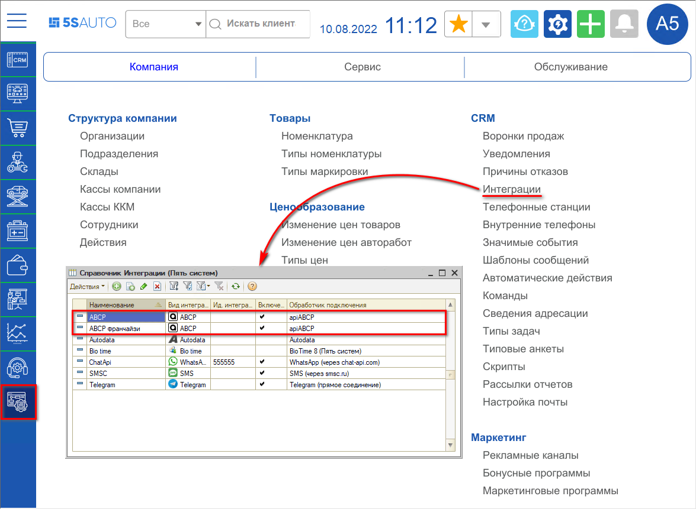*

Настроек интеграции с abcp может быть несколько, например, если компания работает с разными интернет-магазинами.

В карточке интеграции настраиваются следующие ***параметры:***

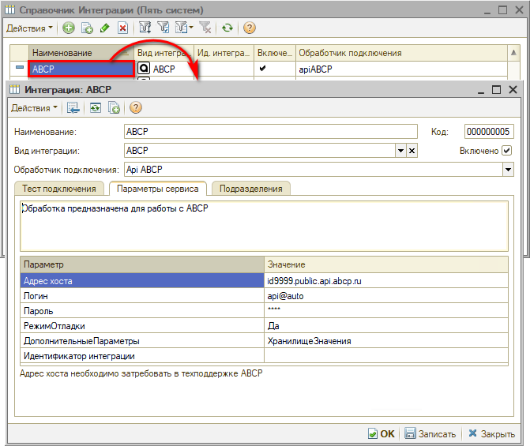

- Адрес хоста;
- Логин;
- Пароль;
- Режим Отладки;
- Дополнительные параметры.

На вкладке “Тест подключения” производится выбор ***Методов интеграции*:**

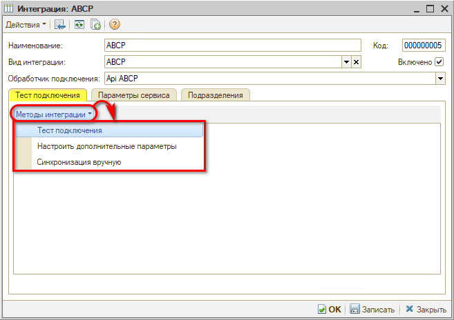

1. *Тест подключения*: 
   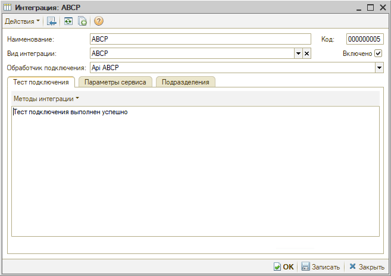
2. *Настроить дополнительные параметры –* открывается форма, на которой настраивается ряд дополнительных параметров (см. ниже раздел *Настройка обмена*): 
   
3. *Синхронизация вручную* – открыть обработку для синхронизации вручную (см. далее).

## Обработка обмена

Вызвать обработку для ручного обмена помимо карточки интеграции (см. выше) можно из меню интерфейса – *Склад и запчасти → Продажи → Обработки → Обмен с ABCP\*:*

**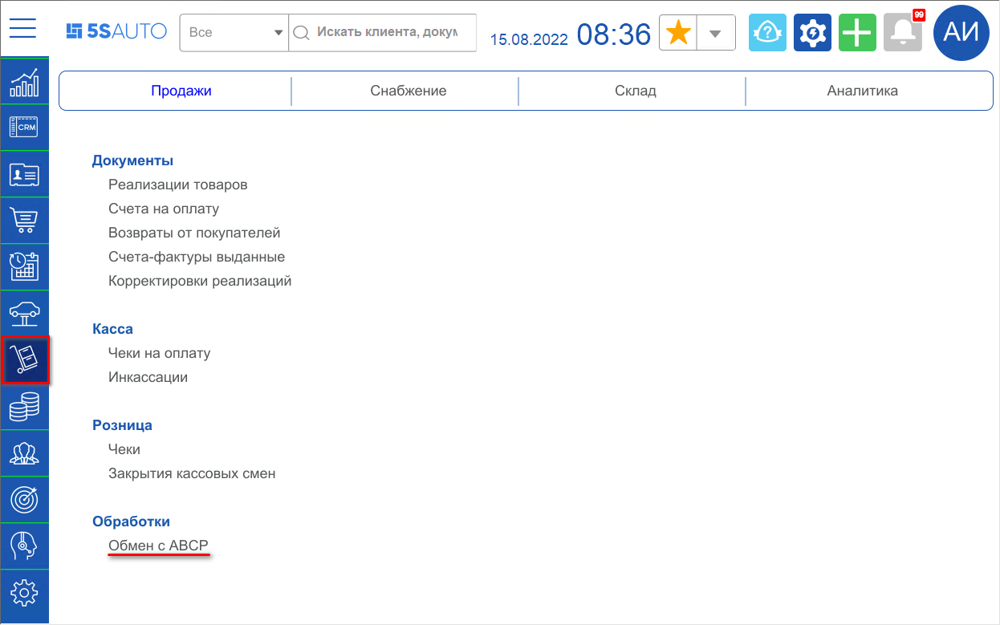**

а также из формы настроек обмена по кнопке ссылке “Открыть форму обработки” в поле “Действия”.

*\*Примечание: В случае если данного пункта меню нет на рабочем столе, можно добавить его вручную – см. статью "[Настройка рабочего стола](https://www.5systems.ru/help/nastroyka-rabochego-stola#nastrrazdelov)".*

### Обзор интерфейса

Нажатием на кнопку “Выбор” в верхнем поле обработки производится выбор интеграции, через которую необходимо выполнять обмен (если интеграций с ABCP несколько):

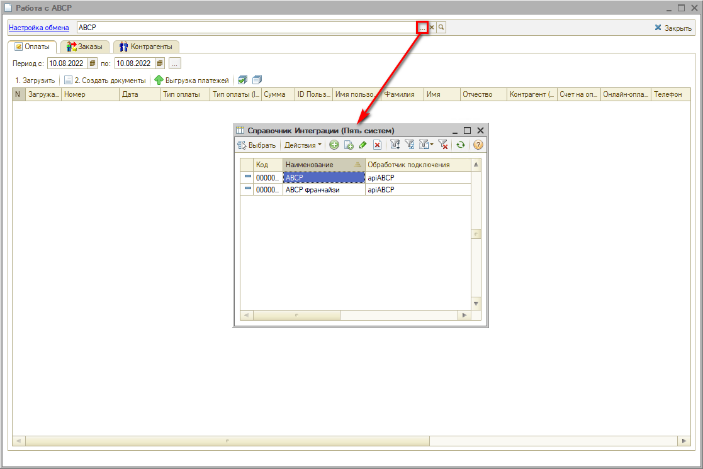

Нажатием на ссылку “Настройка обмена” можно открыть форму настройки обмена (см. описание ниже):

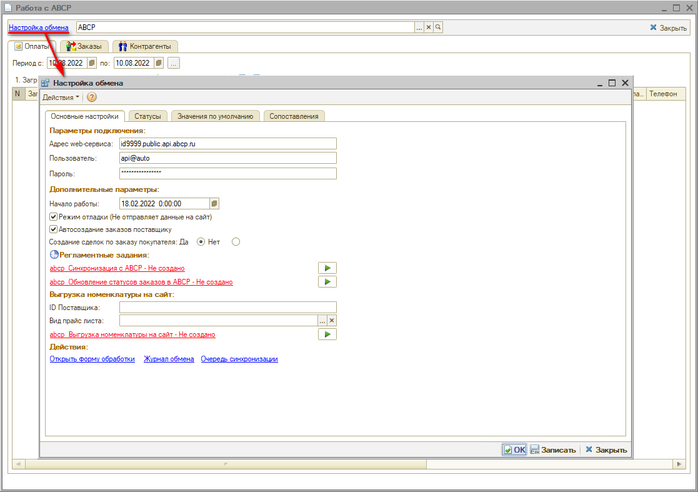

### Вкладка Оплаты

Для обмена данными используются кнопки:

1. Кнопка *“Загрузить”* 
   Сначала необходимо заполнить таблицу пришедшими оплатами. При нажатии на кнопку “Загрузить” система задает вопрос: 
   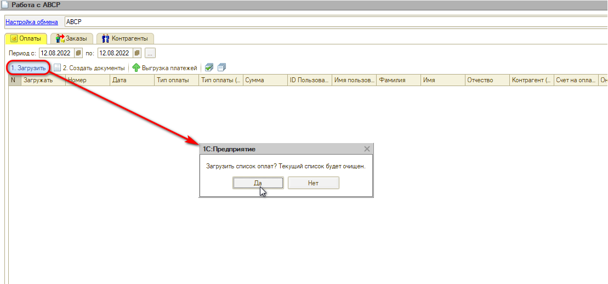 
   После нажатия “Да” таблица заполняется оплатами за указанную дату: 
   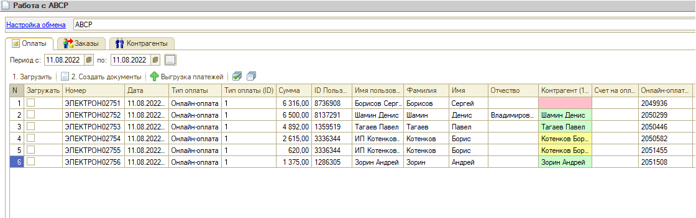
2. Кнопка *“Создать документы”* 
   В заполненной форме требуется отметить галочками нужные заказы – все или выборочно – и нажать кнопку “Создать документы”: 
   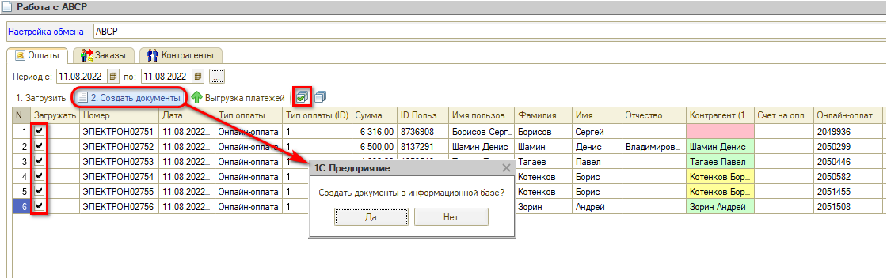 
   После нажатия кнопки “Да” в системе будут созданы *счета на оплату* и *чеки на оплату* по отмеченным позициям: 
   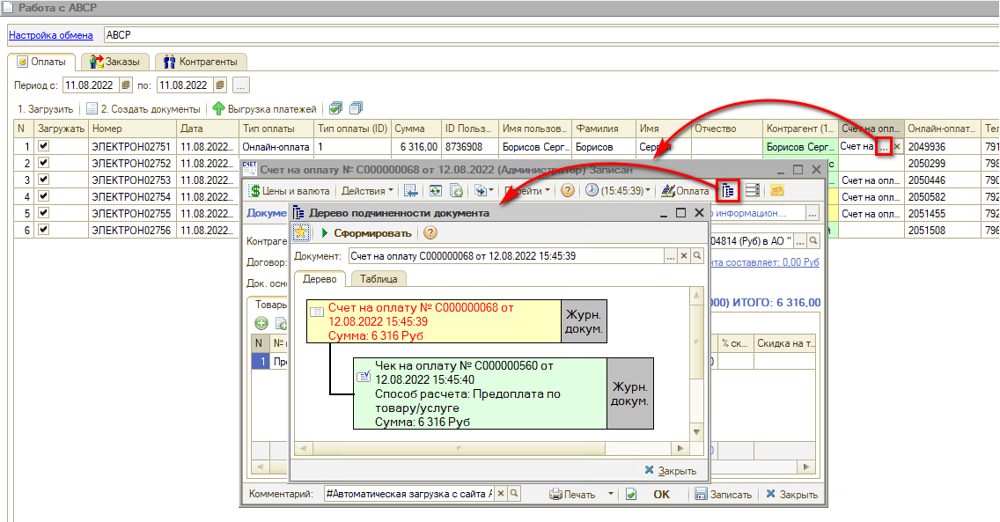
3. Кнопка *“Выгрузка платежей” –* позволяет выгрузить платежи из 1С на сайт.

### Вкладка Заказы

Для обмена данными используются две кнопки:

1. Кнопка *“Загрузить”* 
   Сначала необходимо заполнить таблицу пришедшими заказами. При нажатии на кнопку “Загрузить” система задает вопрос: 
   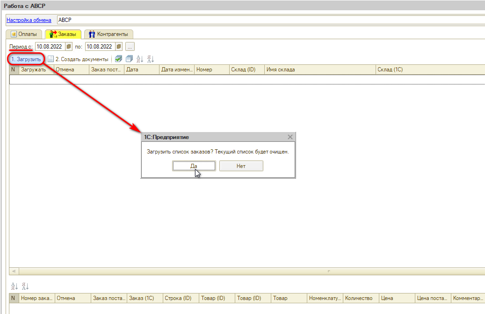 
   После нажатия “Да” таблица заполняется заказами за указанную дату: 
   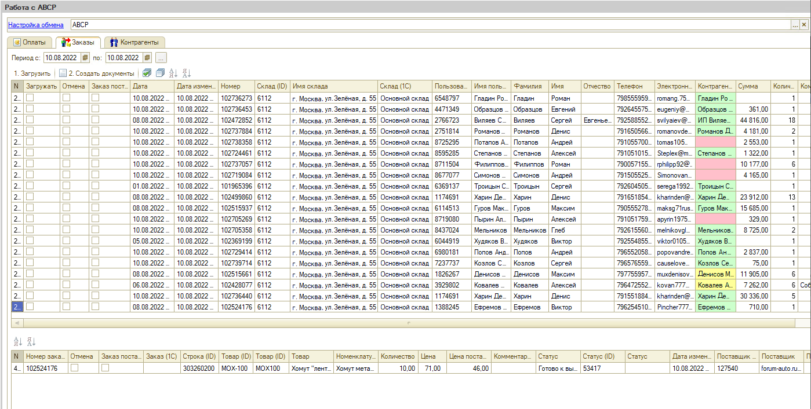 
   При выделении строки отображается подробное содержимое заказов в нижней части формы.
2. Кнопка *“Создать документы”* 
   В заполненной форме требуется отметить галочками все или некоторые нужные заказы и нажать кнопку “Создать документы”: 
   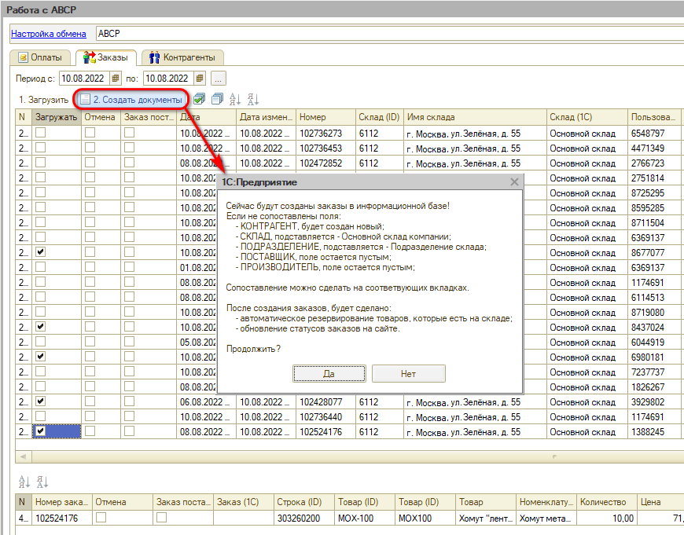 
   После нажатия кнопки “Да” в системе будут созданы заказы покупателей по отмеченным позициям: 
   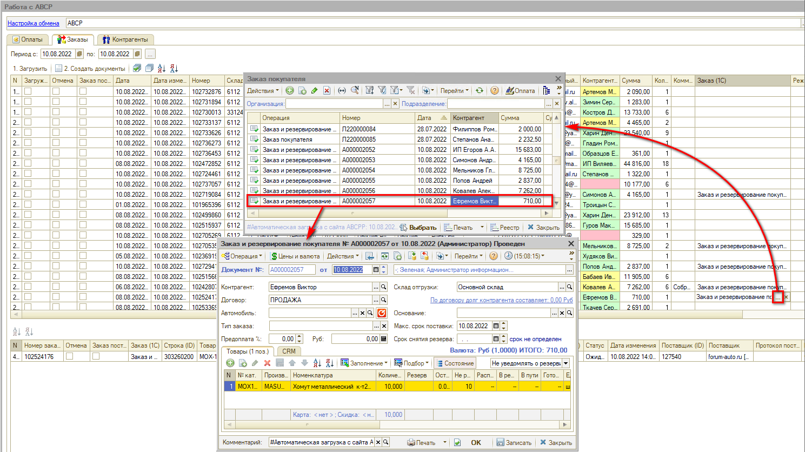

### Вкладка Контрагенты

Вкладка “Контрагенты” предназначена для сопоставления контрагентов, загруженных с сайта, с имеющимися в программе контрагентами:

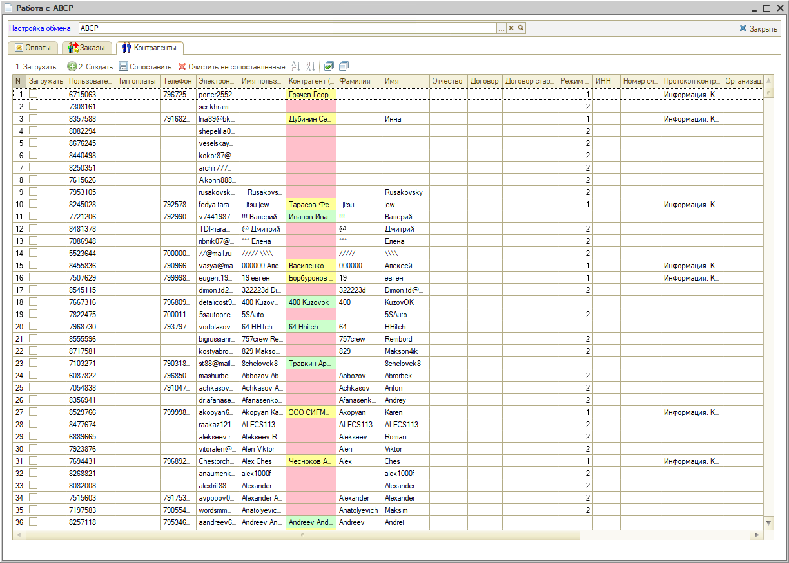

У контрагентов, которых требуется сопоставить, должен быть заполнен столбец "Контрагент" – необходимо отметить их галочками в столбце “Загружать” и нажать кнопку “Сопоставить”.

Если данных контрагентов нет в базе – следует создать для них новые карточки в программе: нужно также выделить их галочками в столбце “Загружать” и нажать кнопку “Создать”. Для создания контрагентов обязательно должно быть заполнено либо "Имя пользователя", либо ФИО. Если клиент уже создан или сопоставлен, то нового клиента система не создаст, а сопоставит этих клиентов.

## Настройка обмена

Форму настройки обмена можно вызвать из следующих мест программы:

- из самой формы обработки обмена нажатием на кнопку-ссылку “Настройка обмена” (см. выше раздел “Обработка обмена → Обзор интерфейса”);
- из формы интеграции: *Методы интеграции → Настроить дополнительные параметры* (см. выше раздел “Справочник интеграции”).

  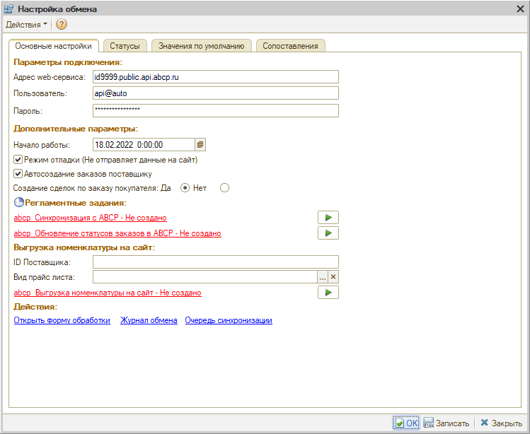

### Описание вкладок формы настройки

1. Вкладка “Основные настройки”:
   1. *Параметры подключения к web-сервису*: Адрес web-сервиса, Пользователь и Пароль. Они задаются в настройках личного кабинета на сайте ABCP: 
      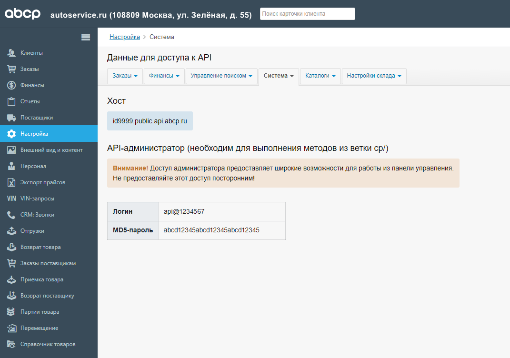
   2. *Дополнительные параметры*: 
      *1. Начало работы* – с какой даты начинать обмен: обычно ставится текущее число (загружать со старых дат не имеет смысла). 
      *2. Режим отладки* – используется на этапе настройки, без отправки данных на сайт (оплаты загружаться не будут). 
      *3. Автосоздание заказов поставщику* – по заказам, которые были размещены у поставщиков через ABCP, в 1С будут создаваться заказы поставщикам. 
      *4. Создание сделок по заказу покупателя* – при выборе *"Да"* (отметка стоит по умолчанию) будут автоматически создаваться сделки по заказам покупателя.
   3. *Регламентные задания,* которые в автоматическом режиме производят обмен: 
      *1. Синхронизация с ABCP* – загружает заказы и оплаты; 
      *2. Обновление статусов заказов в ABCP*. При нажатии на регламентное задание открывается его форма – можно настроить расписание, с какой периодичностью они должны запускаться, и поставить галочку “Использование”: 
      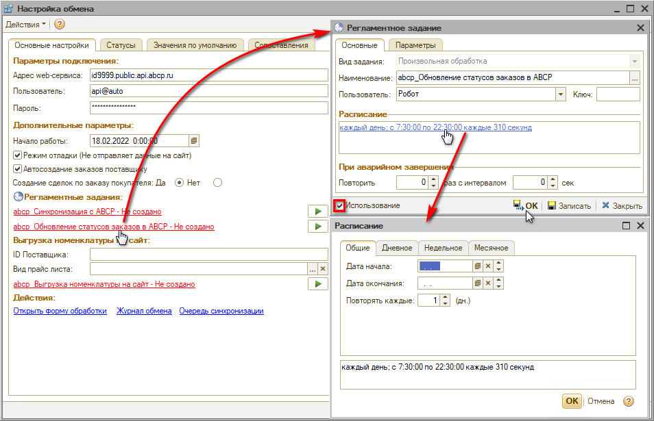 
      В приведенном примере: каждые 310 секунд (5 мин. 10 сек.) обработка будет запускаться и загружать заказы. 
      После включения регламентных заданий обмен данными будет производиться автоматически. 
      При нажатии на кнопку “Play”  будет выполнен ручной запуск фонового задания.
   4. *Действия:* 
      *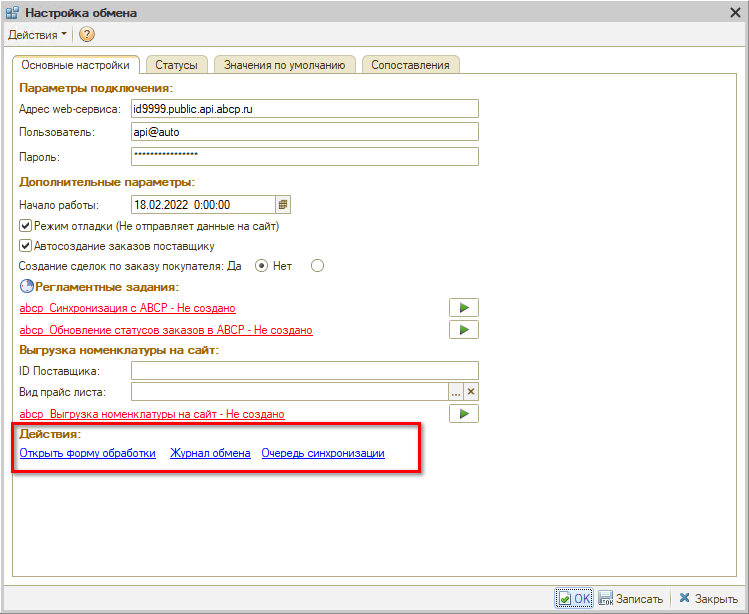* 
      *1. Открыть форму обработки* – можно открыть форму обработки вручную, например, чтобы загрузить заказы за текущую дату (см. *Обработка обмена → Заказы)*; 
      *2. Журнал обмена* представляет собой лог загрузки: 
      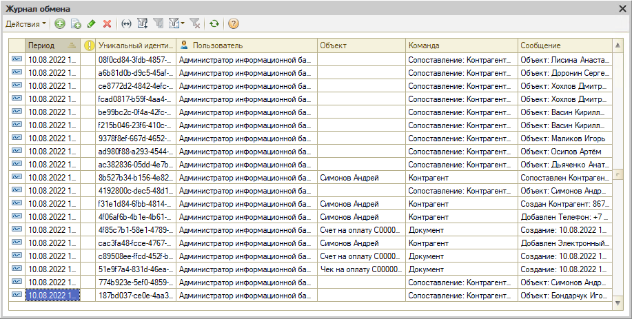 
      *3. Очередь синхронизации* – это документы, которые стоят в очереди на отправку в ABCP (до следующего запуска регламентного задания): 
      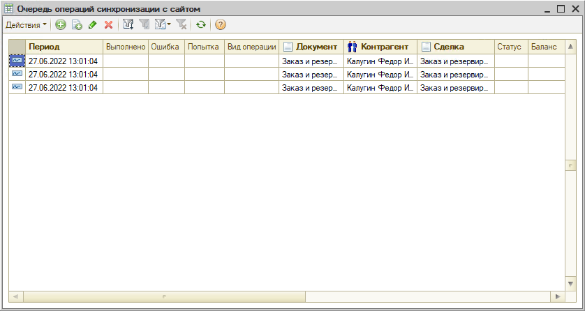
2. Вкладка “Статусы” содержит таблицу сопоставления статусов заказов на сайте со списком внутренних статусов в программе: 
   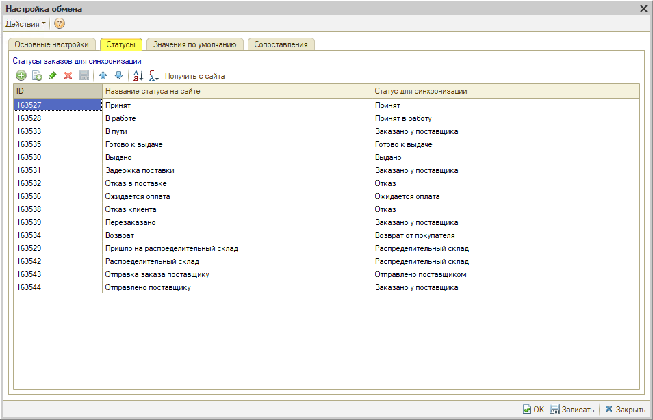 
   Статусы на сайте настраиваются в разделе “Настройка → Заказы”: 
   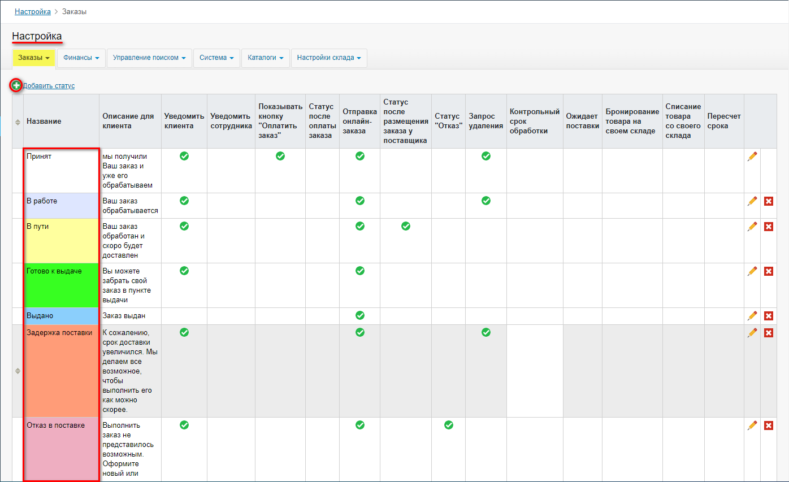 
   Статусы в программе при первоначальной загрузке подгружаются по кнопке “Получить с сайта”, затем производится сопоставление – в колонке “Статус для синхронизации” необходимо выбрать в выпадающем списке один из типовых статусов: 
   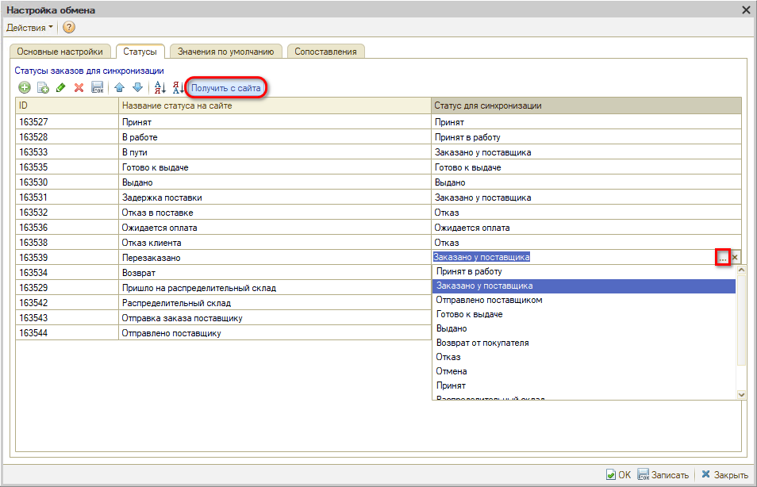
3. Вкладка “Значения по умолчанию”: 
   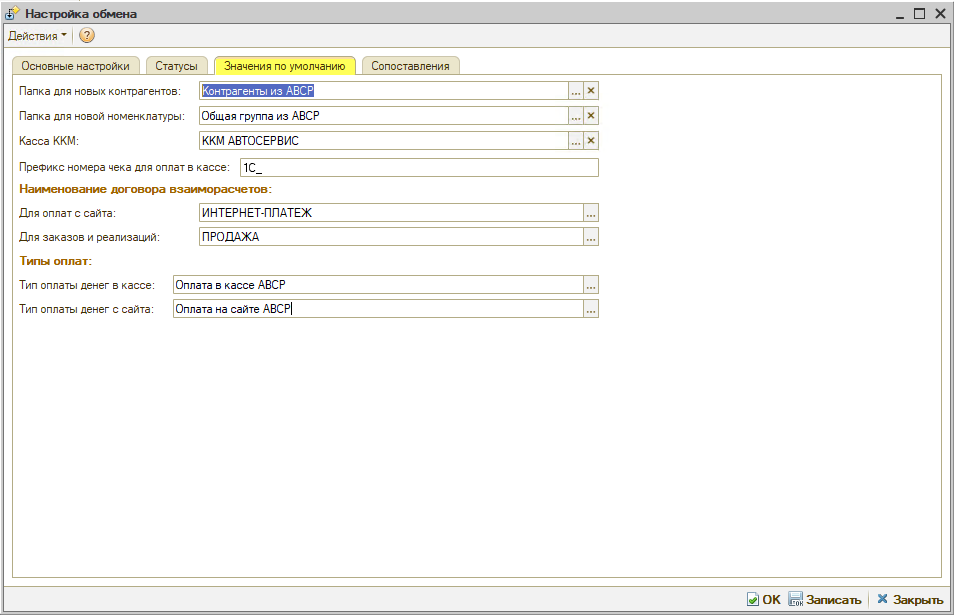 
   Вкладка содержит следующие ***параметры:*** 
   *1. Папка для новых контрагентов* – задается группа, в которой будут создаваться новые карточки контрагентов при загрузке с ABCP: рекомендуется заранее создать для них отдельную папку; 
   *2. Папка для новой номенклатуры* – определяется группа, в которой будут создаваться новые карточки номенклатуры, если в ABCP формируется заказ на номенклатуру, которой нет в базе; 
   *3. Касса ККМ* – производится выбор кассы ККМ, по которой будут проводиться оплаты, которые клиенты делают на сайте; 
   *4. Префикс номера чека для оплаты в кассе;* 
   ***Наименование договора взаиморасчетов:*** 
   *5. Договор взаиморасчетов для оплат с сайта*; 
   6\. *Договор взаиморасчетов для заказов и реализаций;* 
   ***Типы оплат:*** 
   *7. Тип оплаты денег в кассе* — Оплата в кассе ABCP; 
   *8. Тип оплаты денег с сайта* — Оплата на сайте ABCP.
4. Вкладка “Сопоставления”: 
   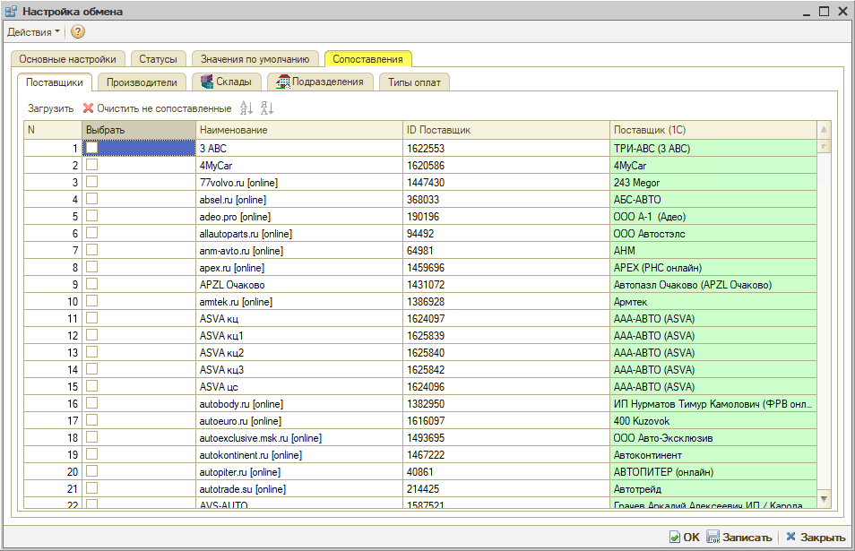 
   При настройке интеграции требуется внимательно произвести сопоставление по всем вкладкам: нажатием на кнопку “Загрузить” загружаются данные с сайта ABCP, выбираются соответствующие им данные в программе и производится синхронизация. Если значений много, загрузка может занять некоторое время. 
   Зеленым цветом выделяются те данные, которые синхронизированы с базой. Если значение не заполнено, и ячейка выделена розовым цветом – значит, соответствующее значение не найдено в базе: можно выбрать его вручную либо создать в программе новый элемент. Желтым выделены значения, по которым установлено частичное совпадение: требуется проверить и сопоставить. 
   ***Сопоставление производится по вкладкам:*** 
   1\. *Поставщики* на сайте сопоставляются с контрагентами, которые есть в программе: таким образом, когда заказ поставщика формируется на сайте, программа определяет, на какого контрагента требуется его создать. Не обязательно заполнять всех не найденных в базе поставщиков: можно только тех, с которыми точно будем работать; 
   2\. *Склады* – производится сопоставление складов между 1С и ABCP; 
   3\. *Подразделения;* 
   4\. *Производители;* 
   5\. *Типы оплат*. 
   Если при сопоставлении в программу не подгружаются склады и подразделения, то в ЛК ABCP необходимо перейти на вкладку "Настройка → Заказы" и установить галочку "Показывать офисы при выборе самовывоза".

Таким образом, в обработку требуется зайти только один раз для настройки обмена и сопоставления параметров. Затем обмен документов будет производиться автоматически, но при необходимости можно в любой момент зайти в обработку и произвести обмен данных вручную.

## Выгрузка складских остатков

### 1. Создание прайс-листа

Предварительно необходимо создать и настроить отдельный прайс-лист для обмена с ABCP. Это выполняется посредством механизма *"Выгрузка прайс-листов"* (подробнее см. [статью](https://5systems.ru/help/vygruzka-prays-listov)).

Файл должен быть в формате *txt:*

*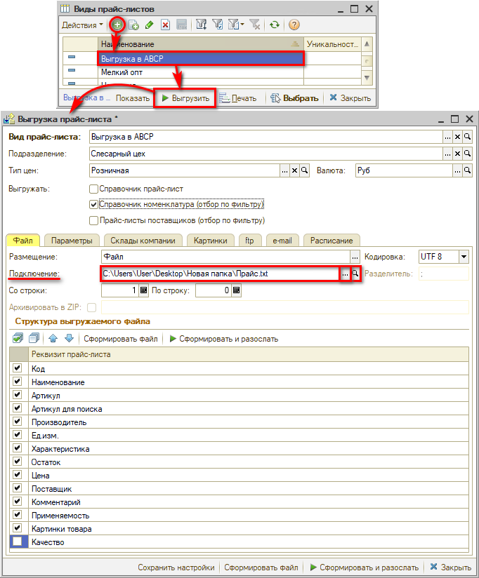*

*Примечание:* Для первой выгрузки можно создать пустой файл txt, выбрать его в поле “Подключение” и нажать кнопку “Сформировать файл” на нижней панели. Сформируется файл прайс-листа, который нужно будет вручную загрузить на сайт ABCP один раз при настройке – затем выгрузка будет производиться автоматически.

На вкладке “Склады компании” подгружаются склады, привязанные к подразделению – следует снять лишние галочки и оставить только те склады, по которым нужно делать выгрузку:

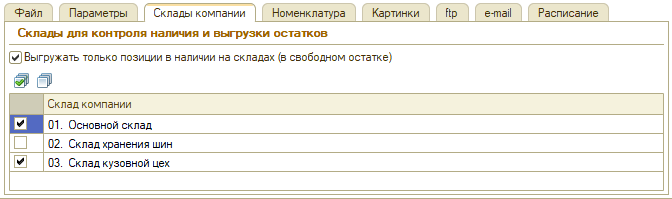

На вкладке “Номенклатура” следует выбрать группы справочника, какую именно номенклатуру нужно выгружать (иначе будет выгружаться вся номенклатура):

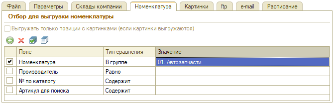

### 2. Настройка на сайте ABCP

Для выгрузки складских остатков в фоновом режиме предварительно должны быть произведены настройки на сайте ABCP: в разделе “Поставщики” необходимо создать отдельного поставщика. Для этого нужно выбрать вариант добавления “Из файла” и загрузить подготовленный ранее файл:

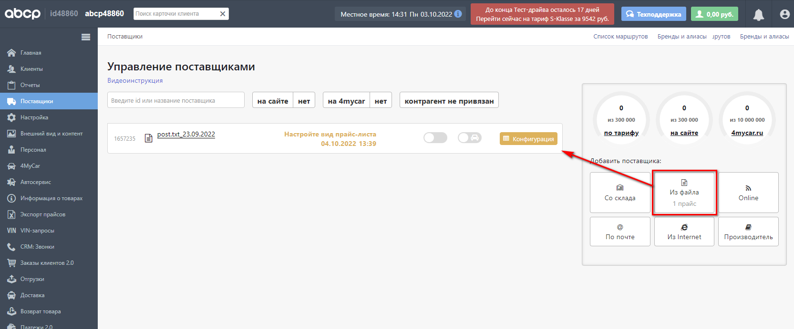

Специальных требований к прайс-листу нет, есть только обычные: наличие колонок с ценой, брендом, каталожным номером, описанием, наличием.

Поставщику следует задать наименование, ID поставщику будет присвоен автоматически.

В разделе *"Поставщики" → "Обн." → "Конфигурация прайс-листа"* настраивается конфигурация загружаемого прайс-листа, т.е. требуется настроить вид прайс-листа, установив соответствие колонок таблицы:

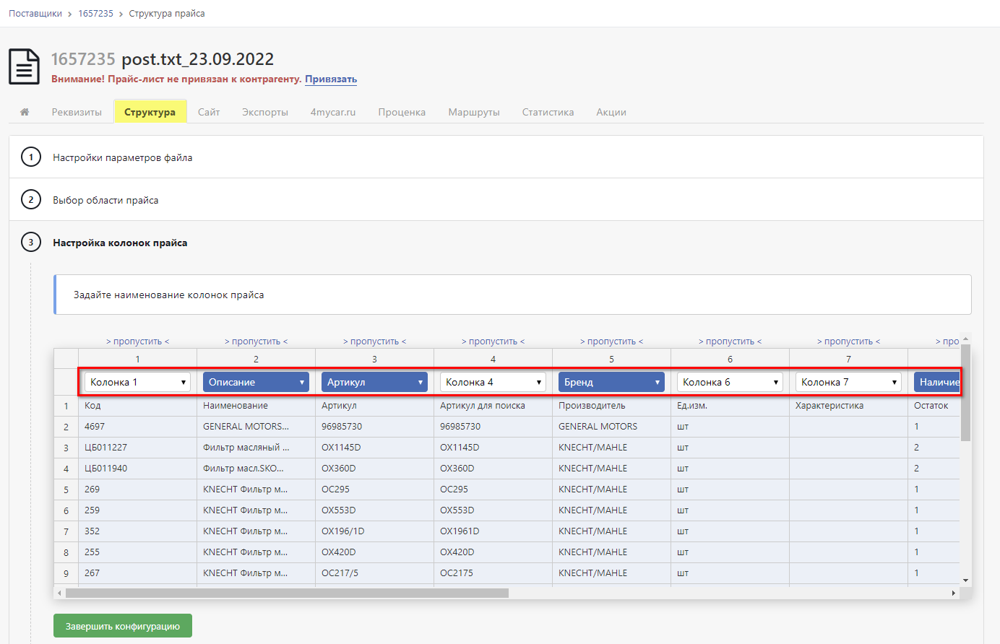

### 3. Настройка фонового задания

В *Настройках обмена* обработки в разделе “Выгрузка номенклатуры на сайт” необходимо:

1. ввести *ID поставщика*, который был присвоен прайс-листу при настройке на сайте;
2. выбрать *Вид прайс-листа*, созданный ранее:

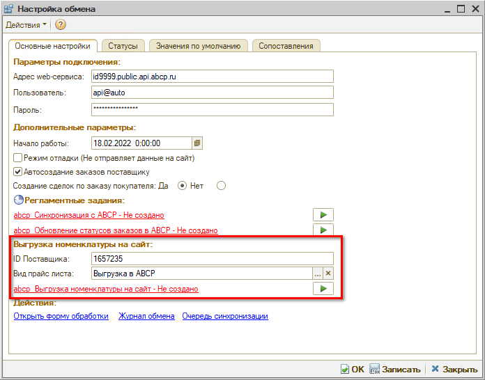

Затем следует настроить регламентное задание “Выгрузка номенклатуры на сайт”, указать пользователя и задать расписание либо запустить вручную:

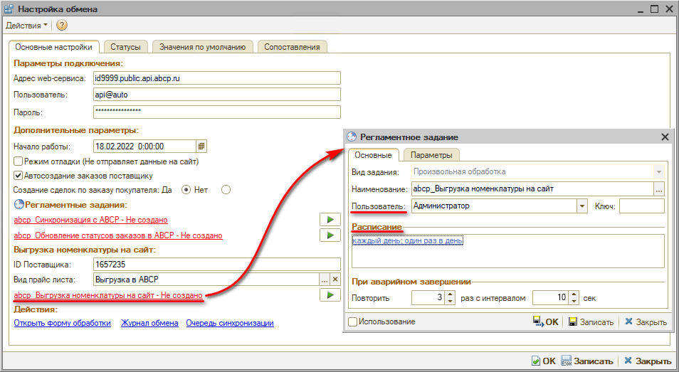

После запуска регламентного задания на сайте под именем поставщика появляется надпись *“Обновлен по API”:*

*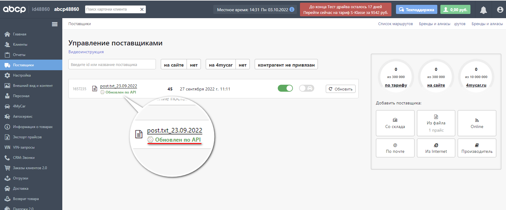*

---

**Теги:** ABCP, интернет-магазин, интеграция, заказы, синхронизация

