

# Интеграция с Telegram

<table><tr><td><b>Время чтения:</b> 25 мин.</td><td><b>Обновлено:</b> 03.09.2024</td></tr></table>

Источник: https://www.5systems.ru/help/integraciya-s-telegram

> *Функционал доступен начиная с релиза 2.8.1 в рамках **[отдельной подписки совместно с приложением 5S LINK](https://www.5systems.ru/services/prilozhenie-5s-link)** либо в рамках [комплексной подписки "Контакт-центр 5S Chat"](https://www.5systems.ru/services/kontakt-centr-5s-chat) (актуальные тарифы см. в [Каталоге услуг](https://www.5systems.ru/services?field_tags_target_id%5B21%5D=21&sort_by=created&sort_order=ASC))*

## Содержание

1. [Введение](#введение)
2. [Работа с ботом](#работа-с-ботом)
   - [1. Запуск бота пользователем](#1-запуск-бота-пользователем)
      - [Способы перехода в Telegram-бот](#способы-перехода-в-telegram-бот)
      - [Авторизация](#авторизация)
   - [2. Описание возможностей](#2-описание-возможностей)
      - [1) Web-приложение 5S LINK](#1-web-приложение-5s-link)
      - [2) Переписка с клиентами](#2-переписка-с-клиентами)
3. [Настройка](#настройка)
   - [1. Создание Telegram-бота](#1-создание-telegram-бота)
   - [2. Оформление бота](#2-оформление-бота)
      - [1) Фото профиля](#1-фото-профиля)
      - [2) Информация о боте](#2-информация-о-боте)
      - [3) Приветственное описание](#3-приветственное-описание)
   - [3. Настройка интеграции в программе](#3-настройка-интеграции-в-программе)
      - [1) Создание интеграции](#1-создание-интеграции)
      - [2) Основные реквизиты](#2-основные-реквизиты)
      - [3) Добавление и выбор ботов](#3-добавление-и-выбор-ботов)
      - [4) Редактирование и удаление ботов](#4-редактирование-и-удаление-ботов)
      - [5) Параметры сервиса](#5-параметры-сервиса)

## Введение

***Бот Telegram*** представляет собой специальный аккаунт, который автоматически обрабатывает запросы, отправляемые пользователями в чат, и присылает в ответ на них сообщения.

Боты применяются для автоматизации обслуживания клиентов – они могут отвечать на стандартные вопросы пользователей моментально и в любое время суток, выдавать информацию по запросам, а также собирать от клиентов обратную связь.

Интеграция 5S AUTO с Telegram позволяет сотрудникам компании общаться с клиентом через бот:

а также отправлять автоматические сообщения:

Также интеграция дает возможность пользователю взаимодействовать через бот Telegram с функционалом *веб-приложения [5S LINK](https://www.5systems.ru/taxonomy/term/225) *– описание возможностей см. *[ниже](#2-описание-возможностей).*

## Работа с ботом

### 1. Запуск бота пользователем

Предварительно у клиента должен быть установлен Telegram.

#### Способы перехода в Telegram-бот

**1) Переход по ссылке**

Компания отправляет клиенту ссылку на бот в сообщении либо размещает ссылку на сайте. Клиент переходит по ссылке и открывает бот на своем устройстве:

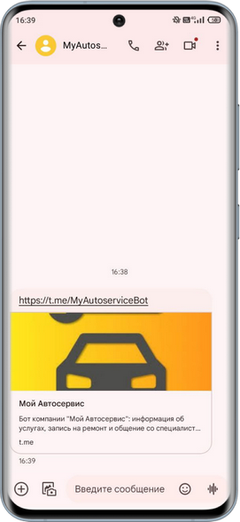

**2) Сканирование QR-кода**

Предварительно необходимо сгенерировать QR-код при помощи специальных сервисов, например: [qrcoder.ru](http://qrcoder.ru/), [qrcode-monkey.com/ru](https://www.qrcode-monkey.com/ru/), [code-qr.ru](https://code-qr.ru/).

В генераторе следует ввести ссылку на свой ранее созданный бот вида *“https://t.me/<имя бота>”* и создать код. Созданный QR-код можно вывести на монитор, разместить на сайте, либо распечатать и расположить в любом удобном для сканирования клиентами месте.

Кроме того, QR-код можно сгенерировать прямо в Telegram и вывести его на экран смартфона либо отправить другому пользователю:

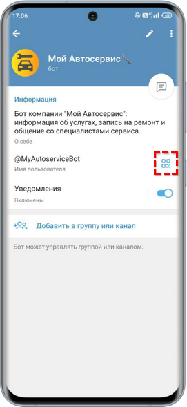

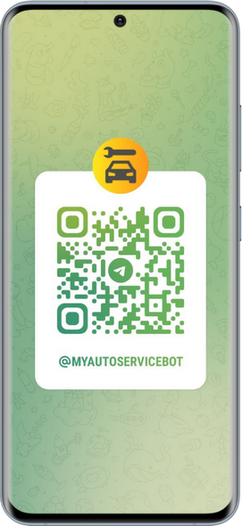

Клиент при помощи камеры своего мобильного телефона сканирует QR-код и переходит по найденной ссылке в бот.

**3) Поиск бота в Telegram**

Клиент самостоятельно находит бота в Telegram через поиск наименованию:

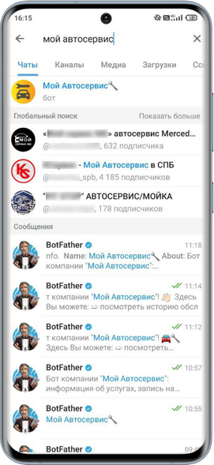

После перехода в бот клиент нажимает кнопку запуска или отправляет команду */start:*

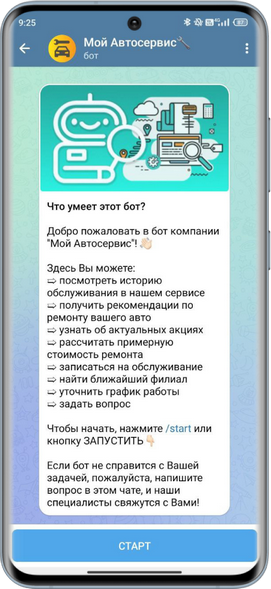

#### Авторизация

Для авторизации у бота нужно нажать кнопку *“Отправить мой телефон”:*

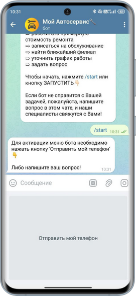

После авторизации становится активной кнопка *“Меню”:*

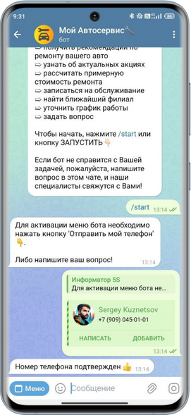

Также см. видео:

### 2. Описание возможностей

#### 1) Web-приложение 5S LINK

При нажатии кнопки “Меню” производится переход пользователя в ***веб-приложение [5S LINK](https://www.5systems.ru/taxonomy/term/225):***

При помощи приложения пользователь имеет возможность:

- авторизоваться удобным способом: по звонку, Telegram или sms;
- просматривать информацию о своих автомобилях, историю обслуживания и рекомендации;
- добавлять а/м по фото гос.номера или СТС;
- добавлять в корзину услуги и товары из каталога и записываться на сервис;
- отслеживать текущие заказы и заявки с их статусами, оплачивать через СБП;
- видеть актуальные акции;
- находить контакты сервиса, открыть карту с отметкой ближайшего филиала и построить маршрут;
- отслеживать информацию о своих бонусных баллах, подтверждать списание и делиться ими через QR-код;
- вести переписку с сервисом в чате;
- просматривать и редактировать информацию в своем профиле, выбирать светлую или темную тему.

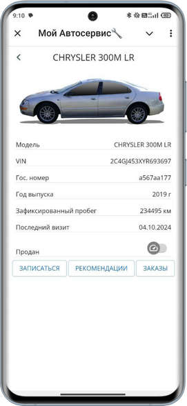

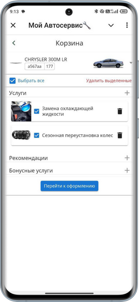

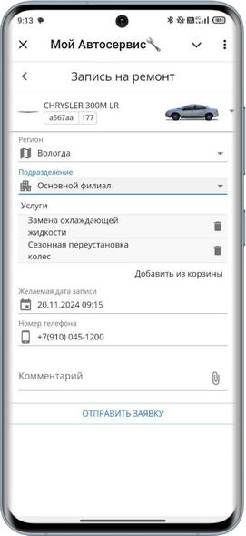

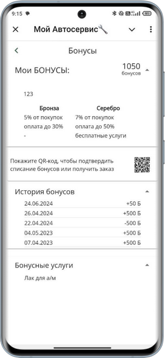

#### 2) Переписка с клиентами

Есть возможность отправлять клиентам сообщения в свободной форме, а также преднастроенные шаблоны сообщений с интерактивными кнопками, изображениями, вложениями и ссылками. О настройке шаблонов Telegram см. *статью (в разработке)*.

Сообщения на основе шаблонов можно отправлять вручную либо настроить автоматическую отправку*.* Например, отправлять [платежную ссылку](https://www.5systems.ru/help/rabota-s-sbp) для окончательной оплаты готового заказ-наряда:

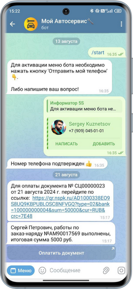

## Настройка

### 1. Создание Telegram-бота

Каждая компания создает бот самостоятельно, для того чтобы быть его владельцем и иметь доступ к персональным настройкам.

Для создания бота в Telegram необходимо выполнить следующие шаги:

**Шаг 1.** Откройте мессенджер Telegram, войдите в вашу учетную запись или создайте новую.

**Шаг 2.** Через поиск найдите профиль *@BotFather* или перейдите по ссылке [https://telegram.me/BotFather](https://telegram.me/BotFather) – это официальный сервис для создания и управления телеграм-ботами:

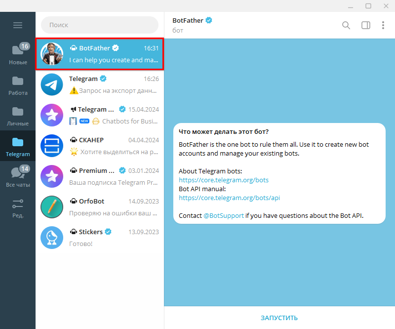

У официального бота Telegram стоит подтверждающий знак возле имени в виде специальной галочки

.

**Шаг 3.** Нажмите кнопку “ЗАПУСТИТЬ” или введите в диалоге команду */start. *

В ответ вы получите список команд по управлению ботом:

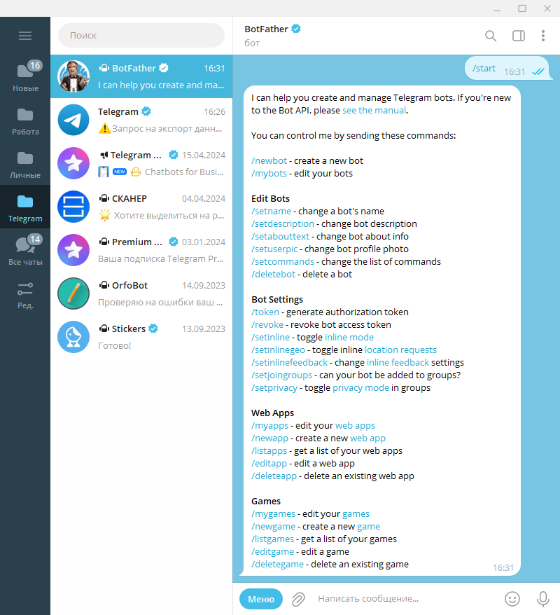

Вызывать команды можно также через кнопку “Меню”.

**Шаг 4.** Нажмите ссылку или введите команду */newbot,* чтобы создать бота:

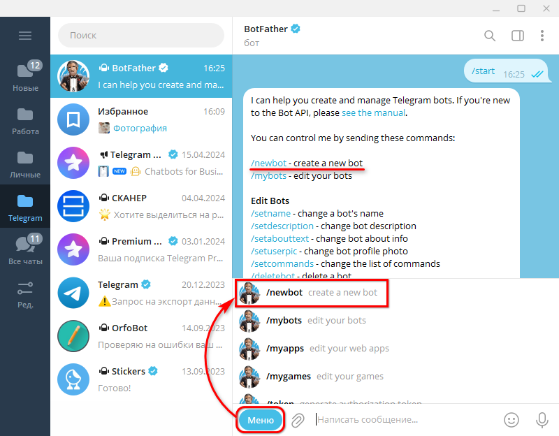

**Шаг 5.** Укажите *название бота (name)* – это имя, которое пользователи будут видеть в списке контактов. Обычно используется наименование компании либо можно задать произвольное название.

Оно должно быть понятным и запоминающимся, но отражать суть бота – чтобы по этому имени было легко найти бот. Название может быть любым, можно дублировать уже существующие имена. В имени бота можно использовать любые символы, в том числе эмодзи. Это название можно впоследствии поменять.

**Шаг 6.** Укажите системное *имя бота (имя пользователя, username)* – это имя будет ником после знака @. Это короткое имя, используемое в поиске, упоминаниях и ссылках t.me.

Требования к имени пользователя:

- должно быть уникальным, не повторять существующие в базе. Если имя уже занято, вы увидите подсказку:

“Sorry, this username is already taken. Please try something different”;

- иметь длину от 5 до 32 символов;
- состоять только из латинских символов, цифр и подчеркиваний;
- заканчиваться словом “bot”, например, “tetris_bot” или “TetrisBot” – это требование Telegram,

чтобы пользователи могли отличать обычные профили от ботов.

***Важно:*** В отличие от названия бота* имя пользователя нельзя изменить позже* – поэтому выбирайте его *внимательно!*

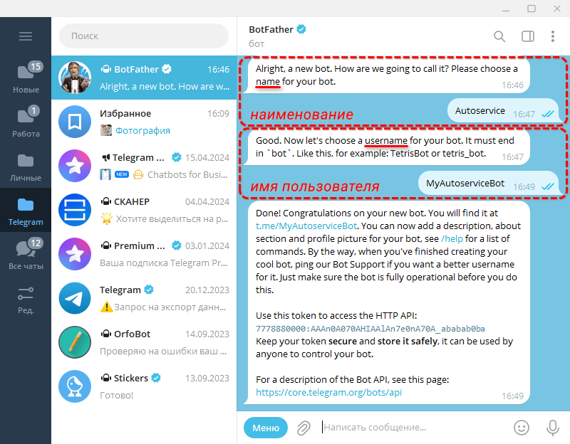

**Шаг 7.** После успешного создания бота вы получите ***токен ***для доступа к боту и ссылки на официальную документацию по разработке ботов для Telegram.

*Сохраните токен* – он понадобится для дальнейшей настройки параметров интеграции в программе.

***Важно! ***Токен следует держать в секрете. С его помощью можно полностью управлять ботом и сообщениями, которые он отправляет. Посторонние лица, не имеющие отношения к разработке вашего бота, не должны его знать.

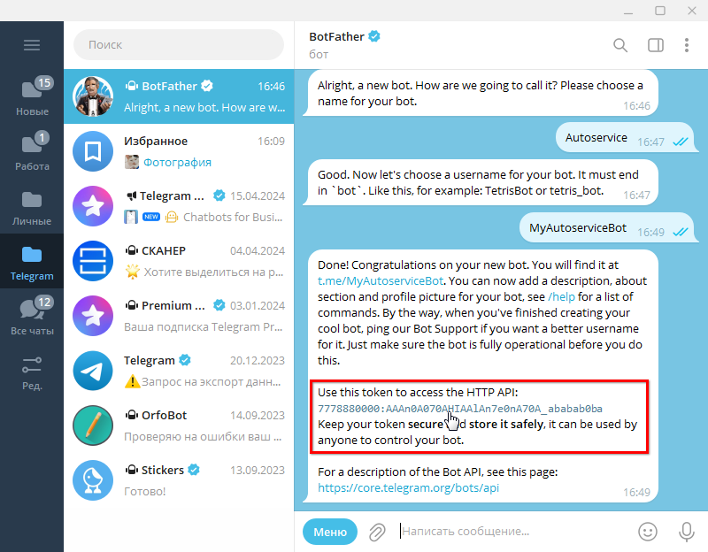

Узнать токен своего бота можно по команде */token.* Если ваш существующий токен скомпрометирован, используйте команду */revoke* для генерации нового – при этом старый токен перестанет работать.

На данном этапе *создание бота завершено,* теперь необходимо также настроить его внешнее оформление.

### 2. Оформление бота

Для того чтобы бот был понятным и удобным для пользователей, узнаваемым и привлекательным среди прочих аккаунтов, а также эффективным по своему назначению, его необходимо оформить – добавить фото профиля, информацию и приветственное сообщение с описанием возможностей, которое будут видеть новые пользователи.

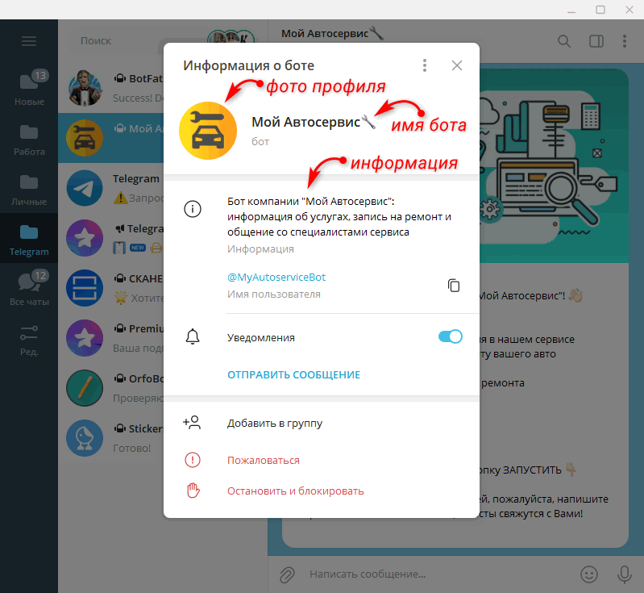

К оформлению внешнего вида бота можно перейти через *BotFathe*r двумя способами:

**1)** Воспользоваться меню по команде */start:*

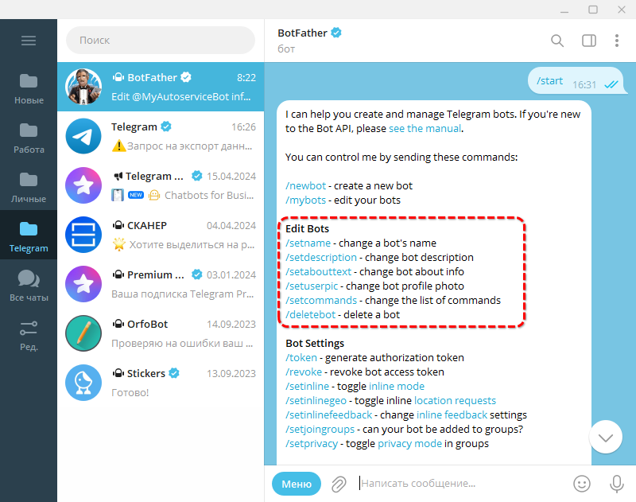

Для оформления используются команды:

- */setname* – меняет название бота;
- */setdescription* – меняет приветственное описание бота для новых пользователей, подробнее см. [ниже](#3-приветственное-описание);
- */setabouttext* – меняет описание, которое отображается в профиле бота, см. [ниже](#2-информация-о-боте);
- */setuserpic* – меняет фото профиля, см. [ниже](#1-фото-профиля);
- */deletebot *– удаляет бота и освобождает юзернейм, действие не может быть отменено.

**2)** Выбрать в меню или ввести команду */mybots* и выбрать из списка созданного ранее бота – при этом откроется меню управления им:

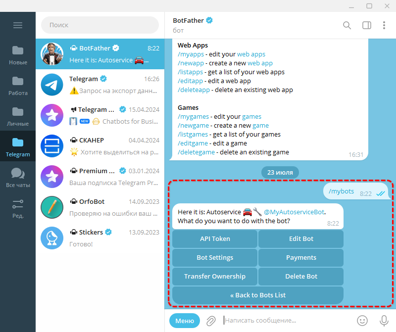

Далее необходимо перейти в раздел *Edit Bot:*

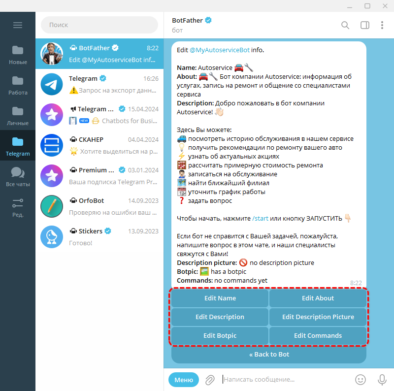

Команды в данном разделе:

- *Edit Name *– изменить название бота;
- *Edit About *– изменить описание в профиле бота, см. [ниже](#2-информация-о-боте);
- *Edit Description* – изменить приветственное сообщение бота, см. [ниже](#3-приветственное-описание);
- *Edit Description Picture* – изменить приветственное изображение бота, см. [*ниже*](#kartinka);
- *Edit Botpic* – изменить изображение бота, см. [ниже](#1-фото-профиля).

Все эти данные можно обновлять в любой момент и неограниченное количество раз.

#### 1) Фото профиля

В качестве *фото профиля* для бота рекомендуется выбрать что-то уникальное и оригинальное, чтобы пользователи могли легко найти его в списке чатов. Как правило, используется логотип компании, также можно создать картинку на основе фирменных цветов.

Для изображений есть ограничения:

- формат файла jpg или png;
- квадратное изображение не меньше 300×300px и не больше 1280 на 1280 px;
- учитывайте, что Telegram обрезает углы, поэтому используйте изображение, где все важное в центре.

Базовые правила для фото профиля: рекомендуется использовать минимум цветов – 2-3 достаточно, лучше выбрать контрастные цвета, за основу можно взять белый или черный.

Для установки фото профиля можно использовать команду */setuserpic* или кнопку *Edit Botpic.* Изображение следует отправить BotFather *в виде фото,* а не файла:

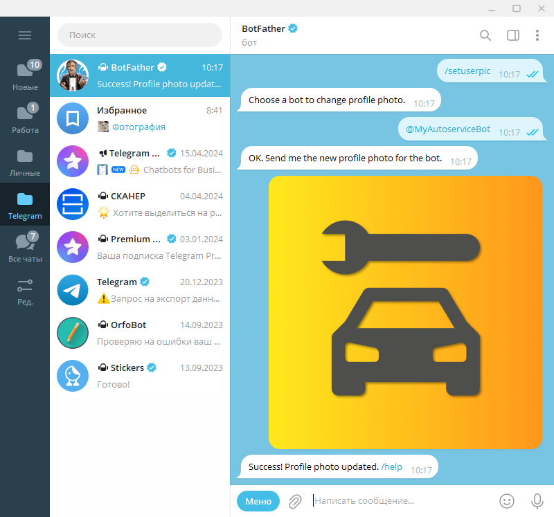

Чтобы проверить, как выглядит установленное фото профиля, можно перейти на страницу бота и нажать “Показать профиль” – см. скриншот [выше](#2-оформление-бота).

#### 2) Информация о боте

*Описание бота* – короткий текст, который отображается под названием бота на странице профиля, см. пример на скриншоте *[выше](#2-оформление-бота).* Информация позволяет напомнить пользователям, чей это бот и какова его цель.

В описании также отображается публичная ссылка на бот, чтобы пользователи могли легко делиться им с другими людьми. Текст описания будет отправляться вместе с этой ссылкой:

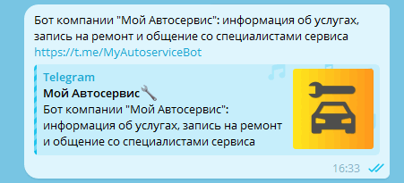

Лимит данного описания – 120 символов. Можно добавить в него ссылку на сайт своей компании или другой связанный канал либо оставить контакт реального сотрудника для связи.

Для добавления или изменения текста описания можно использовать в *BotFather* команду */setabouttext* или кнопку *Edit About.*

#### 3) Приветственное описание

*Описание возможностей* бота в Telegram — это текст в разделе “Что умеет этот бот?”, который видят пользователи, еще не запустившие диалог с ботом. Если человек пользовался ботом и остановил его, то при следующем открытии диалога он снова увидит данное описание.

Правильная настройка этого поля позволяет пользователям сразу получить представление о том, что пользователь может сделать при помощи вашего бота – описание должно быть кратким, точным и по теме.

Есть ограничение в 512 символов. Рекомендуется писать тезисно – в одном коротком предложении одна мысль, отделять смысловые блоки абзацами, можно использовать маркеры или статичные эмодзи.

Для добавления или изменения текста приветственного описания можно использовать в *BotFather* команду */setdescription* или кнопку *Edit Description.*

***Пример приветственного описания:***

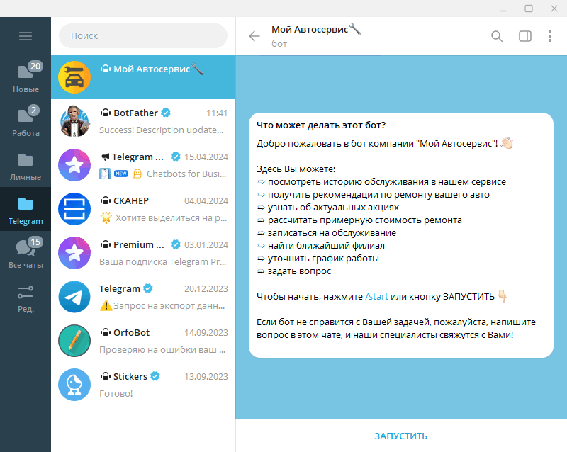

*“Добро пожаловать в бот компании Autoservice! Здесь Вы можете:*

➯* посмотреть историю обслуживания в нашем сервисе*

➯* получить рекомендации по ремонту вашего авто*

➯* узнать об актуальных акциях*

➯* рассчитать примерную стоимость ремонта*

➯* записаться на обслуживание*

➯* найти ближайший филиал*

➯* уточнить график работы*

➯* задать вопрос*

*Чтобы начать, нажмите /start или кнопку ЗАПУСТИТЬ* ⇩

*Если бот не справится с Вашей задачей, пожалуйста, напишите вопрос в этом чате, и наши специалисты свяжутся с Вами!”*

***Изображение в приветственном описании***

В приветственное описание также можно добавить изображение.

Для добавления или изменения картинки в приветственном описании следует в BotFather перейти в раздел *Edit Bot* – см. [*выше*](#mybots) – и нажать кнопку *Edit Description Picture.*

*BotFather* попросит загрузить изображение, соответствующее определенным требованиям: можно использовать картинки размером 640×360px или gif размером 320×180 px, 640×360 px или 960×540 px. Изображение следует отправлять в виде фото, а не в виде файла.

Бот уведомит о том, что картинка загружена успешно:

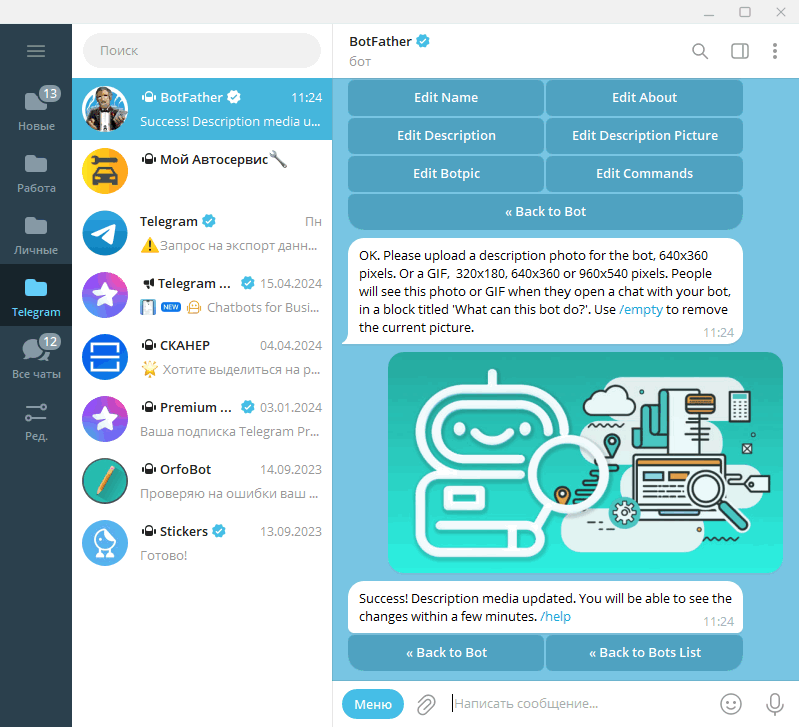

Для просмотра результата следует перейти в создаваемый бот – картинка будет добавлена к приветственному описанию:

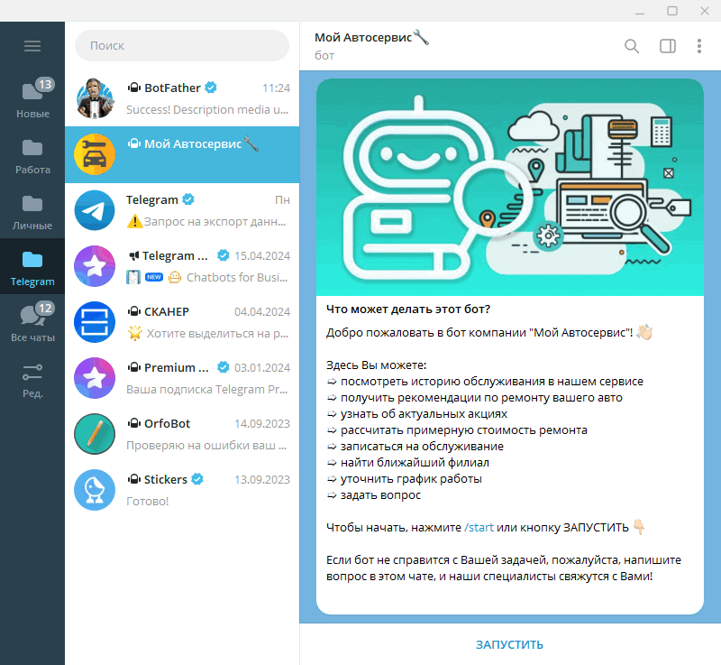

После создания бота в Telegram следует перейти к настройке интеграции в программе.

### 3. Настройка интеграции в программе

Предварительно в программе должна быть настроена интеграция с [API 5S AUTO](https://5systems.ru/help/api-5s-auto).

#### 1) Создание интеграции

Для настройки интеграции следует перейти в справочник "Интеграции" – *Администрирование → Компания → CRM → Интеграции* – и создать новый элемент справочника:

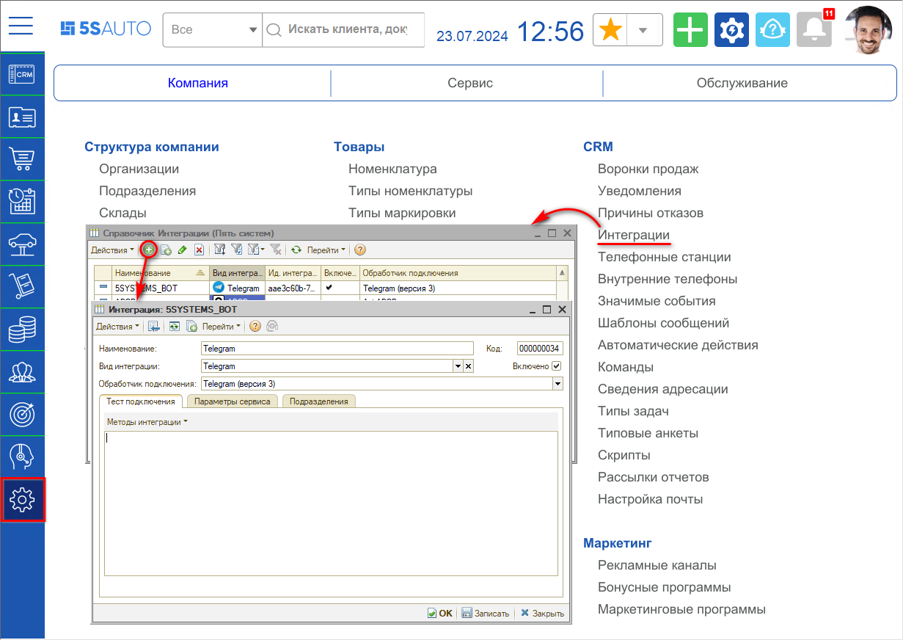

#### 2) Основные реквизиты

Необходимо заполнить основные реквизиты интеграции:

**1. ***Наименование:* заполняется автоматически в формате *“Telegram <наименование бота>”* – значение “Telegram” устанавливается при выборе обработчика подключения, значение в угловых скобках подтягивается при выборе бота, см. [ниже](#vybrat);

**2. ***Вид интеграции:* следует выбрать “Telegram”;

**3. ***Обработчик подключения:* следует выбрать обработчик “Telegram (версия 3)”.

#### 3) Добавление и выбор ботов

У компании может быть создано несколько ботов, например, по разным направлениям деятельности сервиса. Для каждого бота необходимо создать отдельный элемент справочника интеграции.

Переход к списку ботов осуществляется через кнопку *“Методы интеграции → Настройки”.* Открывается окно “Выбор Телеграм-бота”. В таблицу следует добавить ранее созданный бот Telegram – для этого нужно нажать кнопку “Добавить новую запись”.

В окно добавления бота необходимо ввести *токен, *который был сгенерирован при создании бота в Telegram – см. *[выше](#token),* а также задать описание бота и нажать кнопку “Добавить”:

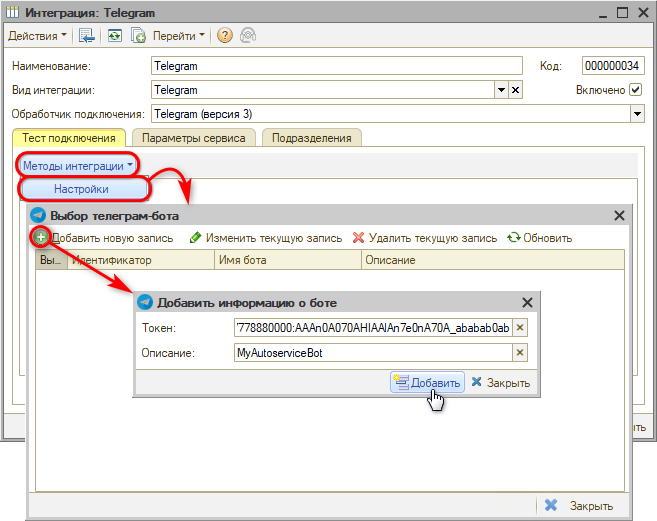

При сохранении информации о боте автоматически генерируется идентификатор интеграции и подтягивается на вкладку “Параметры сервиса” – см. *[ниже](#5-параметры-сервиса).*

В строке с добавленным ботом следует установить галочку в колонке “Выбрать” – при этом строка подсвечивается зеленым цветом – и сохранить настройки нажатием на кнопку “Ок”. При этом описание бота подтягивается в наименование интеграции в формате *“Telegram <описание бота>”:*

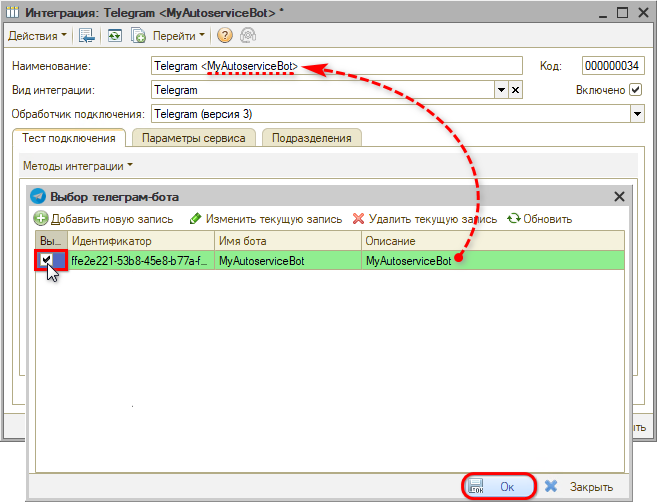

#### 4) Редактирование и удаление ботов

Добавленные в таблицу записи при необходимости можно редактировать – для этого следует выделить курсором нужную строку, нажать на верхней панели кнопку “Изменить текущую запись”, ввести токен, внести нужные изменения и сохранить:

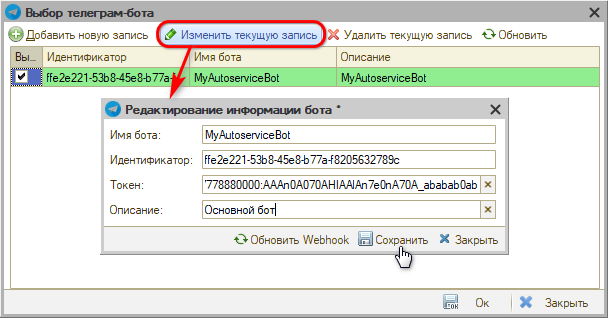

Кнопка *“Обновить Webhook”* используется для восстановления адреса веб-хука, например, если настройки были сбиты при подключении к другим сервисам с использованием API Telegram.

Также запись из списка можно *удалить* – для этого необходимо выделить курсором нужную строку, нажать на верхней панели кнопку “Удалить текущую запись” и подтвердить удаление.

#### 5) Параметры сервиса

На вкладку “Параметры сервиса” подтягивается автоматически сгенерированный идентификатор интеграции. Заполнять параметры на данной вкладке не требуется:

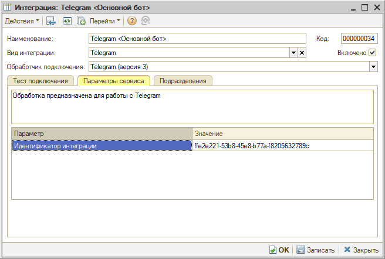

После того, как произведены все настройки, необходимо установить галочку “Включено” и записать интеграцию нажатием кнопки “Записать” или “ОК”.

---

**Теги:** Telegram, интеграция, чат-бот, BotFather, токен, мессенджеры

