

# Интеграция с мессенджером MAX

<table><tr><td><b>Время чтения:</b> 26 мин.</td><td><b>Обновлено:</b> 06.03.2026</td></tr></table>

Источник: https://www.5systems.ru/help/integraciya-s-messendzherom-max

> *Функционал доступен начиная с релиза 2.8.3 в рамках [комплексной подписки "Контакт-центр 5S Chat"](https://www.5systems.ru/services/kontakt-centr-5s-chat) (актуальные тарифы см. в [Каталоге услуг](https://www.5systems.ru/services?field_tags_target_id%5B21%5D=21&sort_by=created&sort_order=ASC))*

## Содержание

1. [Введение](#введение)
2. [Работа с ботом](#работа-с-ботом)
   - [1. Запуск бота пользователем](#1-запуск-бота-пользователем)
   - [2. Возможности](#2-возможности)
      - [1) Web-приложение 5S LINK](#1-web-приложение-5s-link)
      - [2) Переписка с клиентами](#2-переписка-с-клиентами)
3. [Принцип работы интеграции](#принцип-работы-интеграции)
4. [Настройка](#настройка)
   - [1. Подключение компании к платформе MAX](#1-подключение-компании-к-платформе-max)
   - [2. Создание бота MAX](#2-создание-бота-max)
   - [3. Настройка интеграции в программе](#3-настройка-интеграции-в-программе)
   - [4. Шаблоны сообщений](#4-шаблоны-сообщений)

## Введение

Бот MAX представляет собой специальный аккаунт, который автоматически обрабатывает запросы, отправляемые пользователями в чат, и присылает в ответ на них сообщения.

Интеграция 5S AUTO с [MAX](https://max.ru/) позволяет сотрудникам компании общаться с клиентом через бот а также отправлять автоматические сообщения.

Также интеграция дает возможность пользователю взаимодействовать через бот MAX с функционалом веб-приложения [5S LINK](https://www.5systems.ru/taxonomy/term/225) – описание возможностей см. [ниже](#1-web-приложение-5s-link).

Предварительно у клиента должно быть установлено приложение MAX.

## Работа с ботом

### 1. Запуск бота пользователем

#### Способы перехода в бот MAX

**1) Переход по ссылке**

Компания отправляет клиенту ссылку на бот в сообщении либо размещает ссылку на своем сайте. Клиент переходит по ссылке и открывает бот на своем устройстве:

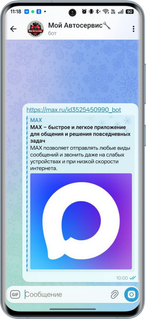

Также есть возможность пригласить по ссылке пользователей прямо из MAX:

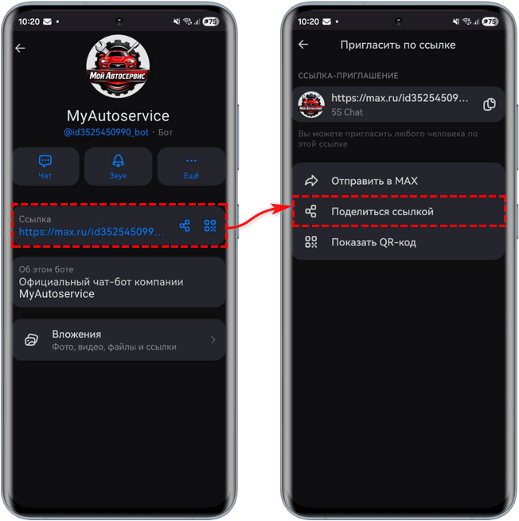

**2) Сканирование QR-кода**

Предварительно необходимо сгенерировать QR-код при помощи специальных сервисов, например: [qrcoder.ru](http://qrcoder.ru/), [qrcode-monkey.com/ru](https://www.qrcode-monkey.com/ru/), [code-qr.ru](https://code-qr.ru/).

В генераторе следует ввести ссылку на свой ранее созданный бот вида *“https://max.ru/id<ИНН>_bot”* и создать код. Созданный QR-код можно вывести на монитор, разместить на сайте, либо распечатать и расположить в любом удобном для сканирования клиентами месте.

Кроме того, QR-код можно сгенерировать прямо в MAX и вывести его на экран смартфона либо отправить другому пользователю:

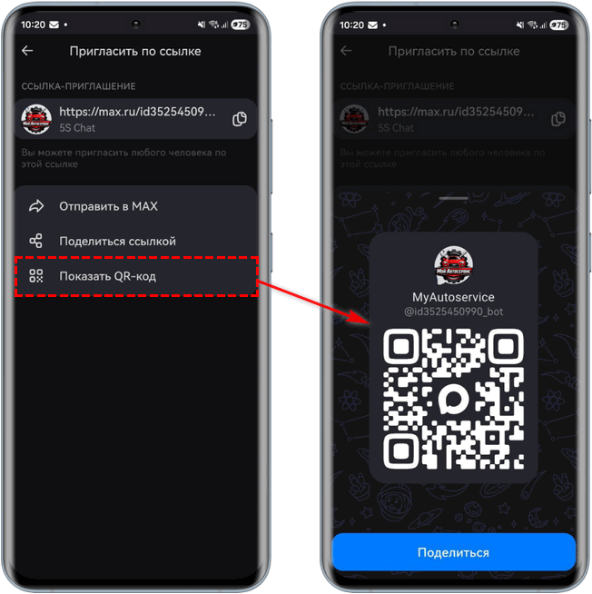

**3) Поиск бота в MAX**

Клиент самостоятельно находит бота в MAX через поиск наименованию:

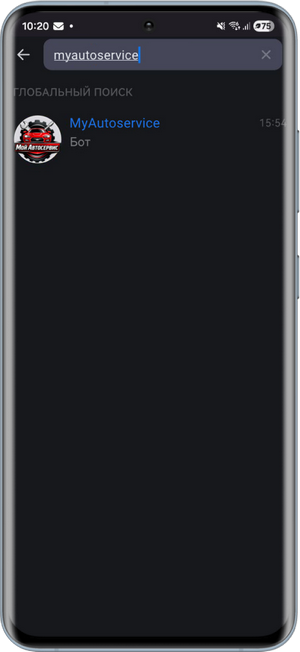

После перехода в бот клиент нажимает кнопку запуска “Начать” и получает приветственное сообщение:

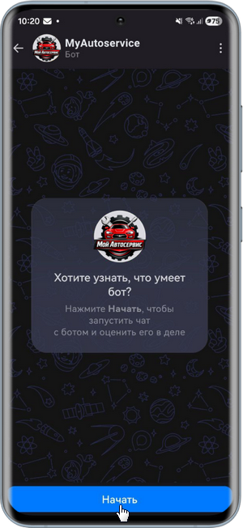 &nbsp;&nbsp;&nbsp;&nbsp;&nbsp;&nbsp; 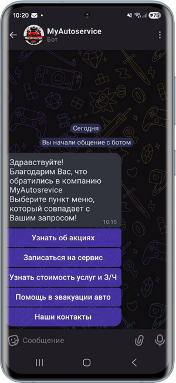

#### Авторизация

Для *авторизации* у бота и дальнейшего использования приложения 5S LINK пользователю потребуется подтвердить *согласие на обработку персональных данных* и получение сообщений от бота – для этого нужно нажать кнопку *“Согласиться и отправить мой телефон”:*

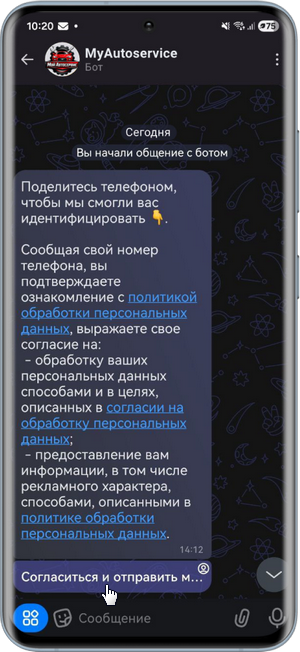 &nbsp;&nbsp;&nbsp;&nbsp;&nbsp;&nbsp; 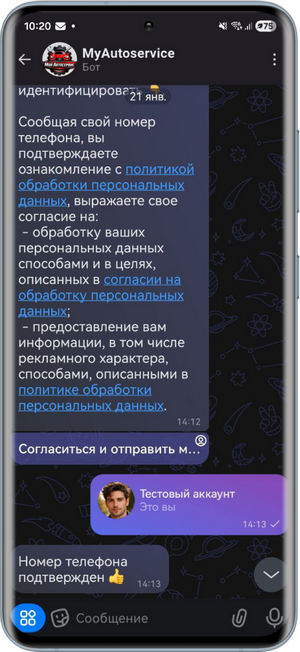

*Примечание:* В случае если пользователь не подтвердит номер телефона, то при нажатии кнопки перехода в приложение ему снова придет запрос подтверждения – без подтверждения телефона будет невозможно перейти в 5S LINK.

### 2. Возможности

#### 1) Web-приложение 5S LINK

При нажатии кнопки “Меню” производится переход пользователя в веб-приложение [5S LINK](https://www.5systems.ru/taxonomy/term/225). Если клиент повторный, подтягивается информация по его автомобилям, истории обслуживания, текущим документам, заказам, бонусам и т.д.:

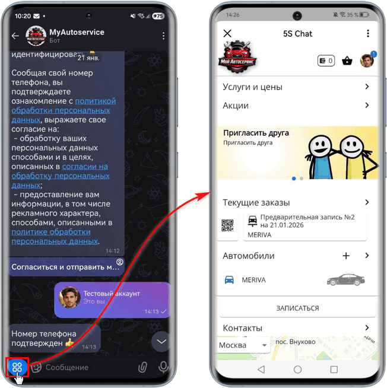

При помощи приложения пользователь имеет возможность:

- просматривать информацию о своих автомобилях, историю обслуживания и рекомендации;
- добавлять а/м по фото гос.номера или СТС;
- добавлять в корзину услуги и товары из каталога и записываться на сервис;
- отслеживать текущие заказы и заявки с их статусами, оплачивать через СБП;
- видеть актуальные акции;
- находить контакты сервиса, открыть карту с отметкой ближайшего филиала и построить маршрут;
- отслеживать информацию о своих бонусных баллах, подтверждать списание и делиться ими через QR-код;
- вести переписку с сервисом в чате приложения;
- просматривать и редактировать информацию в своем профиле, выбирать светлую или темную тему.

Подробнее о приложении 5S Link см. [статью](https://www.5systems.ru/help/nastroyka-prilozheniya-5s-link-v2).

#### 2) Переписка с клиентами

Есть возможность отправлять клиентам сообщения в свободной форме, а также *шаблоны* сообщений с интерактивными кнопками, изображениями, вложениями и ссылками. О настройке шаблонов MAX см. [ниже](#4-шаблоны-сообщений):

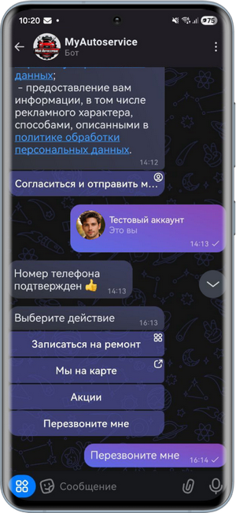

Сообщения на основе шаблонов можно отправлять вручную либо есть возможность настроить автоматическую отправку.

## Принцип работы интеграции

Когда клиент пишет компании сообщение в чат-боте MAX, в системе создается новая [сделка](../../CRM/Работа%20со%20сделкой/rabota-so-sdelkoy.md), в нее подтягивается диалог:

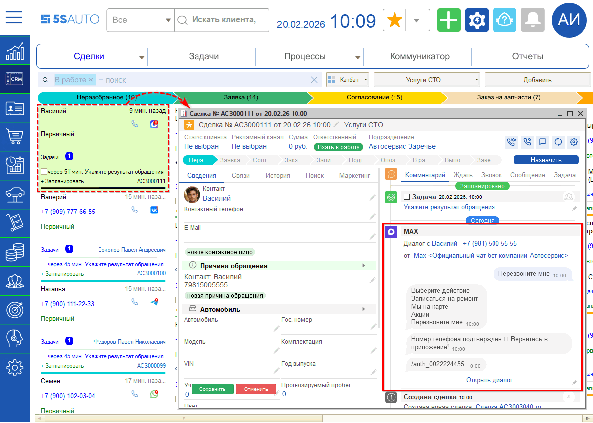

В системе автоматически создается [внешний пользователь](https://www.5systems.ru/help/vneshnie-polzovateli), имя и фамилия клиента определяются по профилю пользователя MAX. После создания [карточки клиента](../../Работа%20с%20клиентами/Контрагенты%20и%20контакты/kontragenty-i-kontakty.md) эти данные присваиваются ему.

*Примечание:* При необходимости можно уточнить данные у клиента в переписке, т.к. в профиле могут быть указаны ненастоящие имя и фамилия.

После этого следует идентифицировать клиента – для этого на вкладке “Поиск” в сделке ввести данные клиента и нажать кнопку “Найти”:

1. Если клиент повторный, то он будет найден в базе;
2. Если клиент первичный, следует записать карточку нового клиента (см. статью [Идентификация клиента на форме сделки](../../Работа%20с%20клиентами/Идентификация%20клиента%20на%20форме%20Сделки/identifikaciya-klienta-na-forme-sdelki.md)).

Также в системе создается чат с клиентом, идентификатор клиента MAX ID записывается в чат. Чат MAX подтягивается в карточку клиента и становится доступен на вкладке “Чаты”, а также в разделе диалогов (см. статью "[Чаты клиента](../../CRM/Чаты%20клиента/chaty-klienta.md)"):

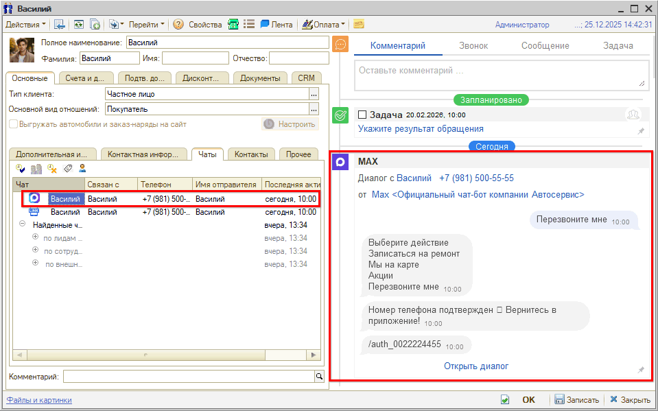

Переписка с клиентом ведется через [Ленту событий](../../Работа%20с%20клиентами/Лента%20событий/lenta-sobytiy.md), открытую из формы сделки либо из карточки клиента:

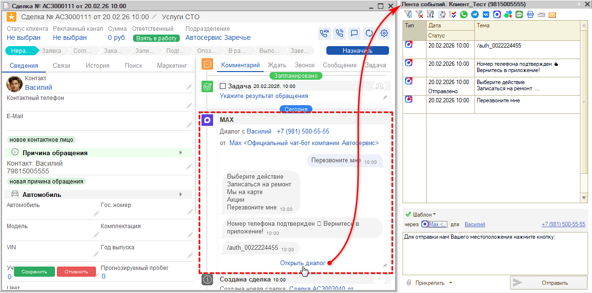

В случае если у компании настроено несколько интеграций с MAX, то при отправке сообщения нужно будет выбирать ту интеграцию, через которую его следует отправить.

Есть возможность использовать шаблоны сообщений, например, для отправки сообщения с кнопкой, нажатием на которую клиент может перейти в [веб-приложение](https://www.5systems.ru/help/nastroyka-prilozheniya-5s-link-v2). Подробнее см. ниже в разделе "[Шаблоны сообщений](#4-шаблоны-сообщений)".

## Настройка

### 1. Подключение компании к платформе MAX

Для *подключения компании к платформе MAX* требуется зарегистрироваться (или войти на платформу по уже имеющимся учетным данным), создать и верифицировать профиль организации.

**Шаг 1. Регистрация на платформе**

На [сайте сервиса](https://max.ru/) перейдите в раздел *“Для бизнеса”:*

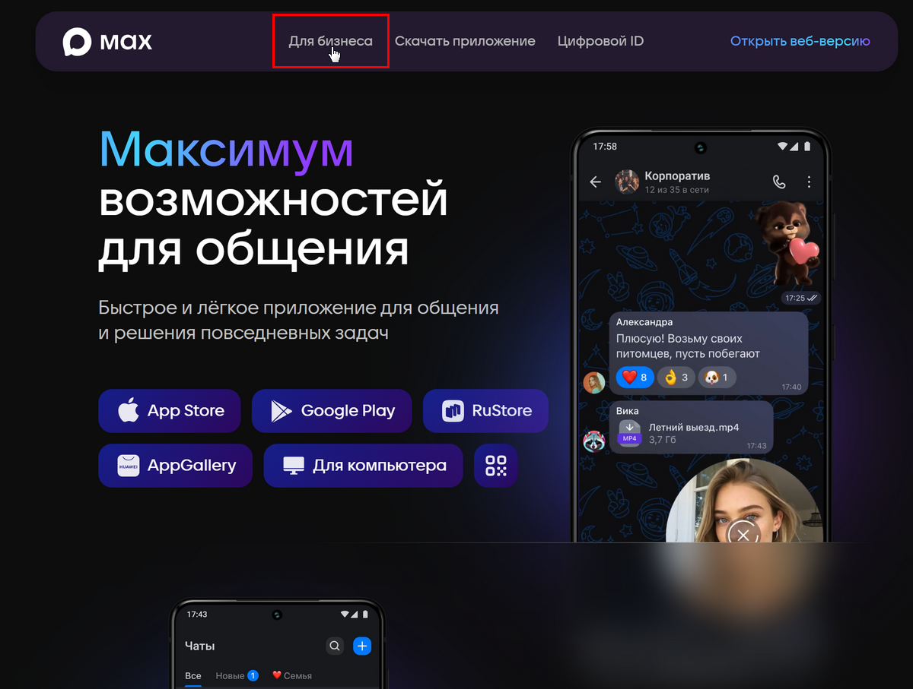

В [разделе “Для бизнеса”](https://business.max.ru/) нажмите кнопку *“Войти на платформу”:*

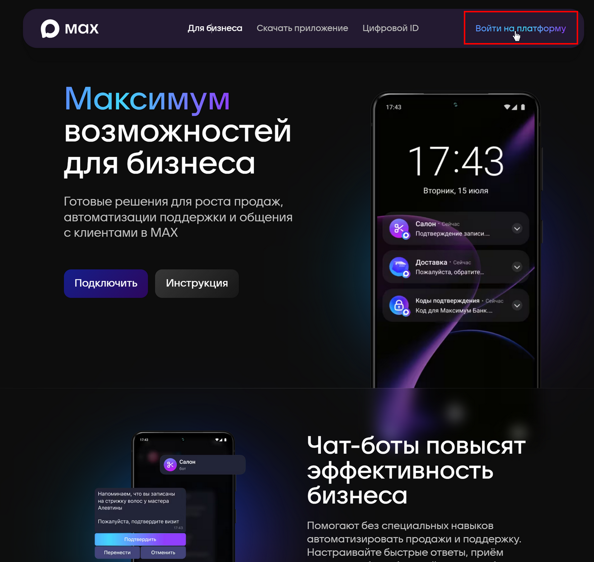

Либо перейдите по ссылке: [business.max.ru/self](https://business.max.ru/self).

Для *регистрации* требуется номер телефона – рекомендуется использовать корпоративный номер организации:

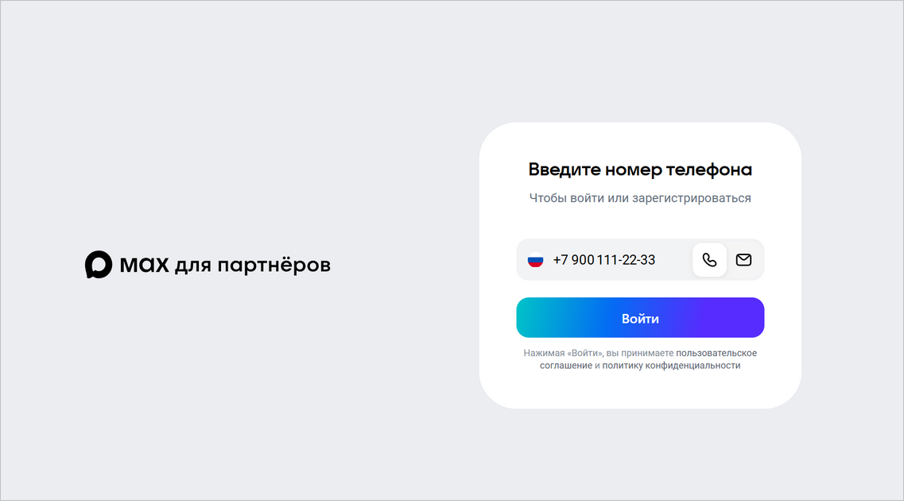

Также потребуется подтверждение входа по коду из SMS.

**Шаг 2. Создание и верификация профиля организации**

Для доступа к сервисам платформы потребуется *создать профиль организации* и *пройти верификацию.*

Верификация организации возможна 2-мя способами:

1. *Через Госуслуги*

   Для верификации через Госуслуги у вас должен быть создан личный кабинет организации. Верификацию организации может пройти только пользователь с ролью “Руководитель”.

2. *Через банковские сервисы (Alfa ID, T-Business ID, СберБизнес ID)*

В выбранном банке должен быть открыт расчетный счет, владельцем которого вы являетесь.

После успешного *подключения к платформе MAX* можно переходить к созданию бота.

Подробнее см. статью на сайте сервиса [MAX для бизнеса](https://business.max.ru/): “[Подключение к платформе и создание профиля организации](https://dev.max.ru/docs/maxbusiness/connection?utm_source=b2bmax&utm_medium=documentation_1_screen&utm_campaign=landing)”.

### 2. Создание бота MAX

Подробное описание создания и оформлении бота см. в [документации](https://dev.max.ru/docs/chatbots/bots-create) на сайте MAX.

#### 1) Создание и оформление бота

Боты создаются в профиле организации на платформе MAX для партнеров. Возможность создания бота появляется после подключения к платформе, добавления там организации и ее верификации.

Для создания бота следует в профиле организации в блоке *“Чат-боты”* нажать кнопку *“Создать”:*

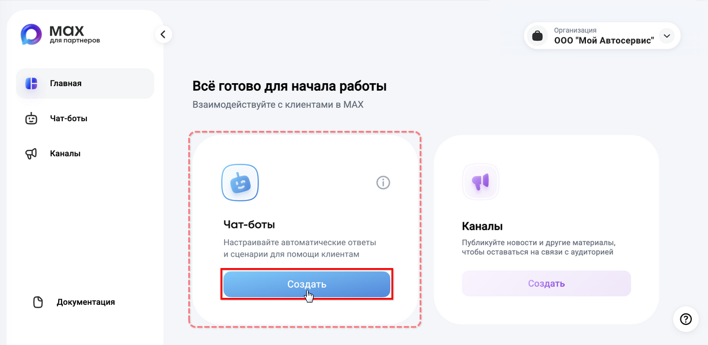

В карточке бота следует *заполнить информацию* и нажать кнопку *“Создать”:*

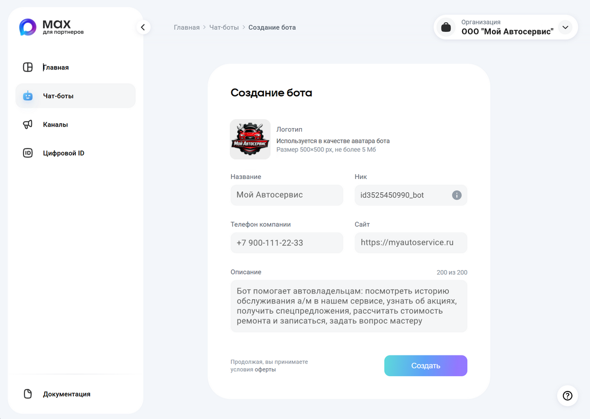

Обязательными являются *параметры* “Логотип”, “Имя бота”, “Ник” и “Описание”. Ник создается автоматически по шаблону *idИНН_bot.* Остальные поля требуется заполнить самостоятельно. После создания можно редактировать все данные, кроме ника.

1. *Логотип* будет использоваться в качестве аватара бизнес-аккаунта, а также [web-приложения](#1-web-приложение-5s-link).
2. *Имя бота* – это название, которое будет отображаться в MAX.
3. *Ник* – это никнейм, который будет отображаться в публичной ссылке на бот в формате *https://max.ru//idИНН_bot.*

   Выбрать или изменить ник пока нельзя. Когда появится такая возможность, ник должен будет соответствовать требованиям:

- должен начинаться с маленькой буквы, без @
- должен заканчиваться на “_bot” или “bot”. Если не указать, к введенному значению имени бота автоматически будет добавлено “_bot”
- длина: 11-60 символов, включая “_bot” / “bot”
- допустимые символы: латиница, цифры и “_”
4. *Описание* – описание для пользователей, где может быть указано, какие задачи решает бот: что умеет, чем полезен, как связаться с его владельцем или поддержкой.

Подробное описание всех параметров см. на [сайте](https://dev.max.ru/docs/chatbots/bots-create#%D0%9D%D0%B0%D1%81%D1%82%D1%80%D0%BE%D0%B9%D0%BA%D0%B8%20%D0%B1%D0%BE%D1%82%D0%B0).

После нажатия кнопки “Создать” бот создан и находится на модерации, появляется статус “На модерации”.

Для одной организации доступно создание 5 ботов. Как добавить еще одного бота – см. на [сайте](https://dev.max.ru/docs/chatbots/bots-create#%D0%9A%D0%B0%D0%BA%20%D0%B4%D0%BE%D0%B1%D0%B0%D0%B2%D0%B8%D1%82%D1%8C%20%D0%B5%D1%89%D1%91%20%D0%BE%D0%B4%D0%BD%D0%BE%D0%B3%D0%BE%20%D0%B1%D0%BE%D1%82%D0%B0).

Для изменения основных настроек бота следует нажать кнопку перехода к настройкам бота справа на панели управления ботом:

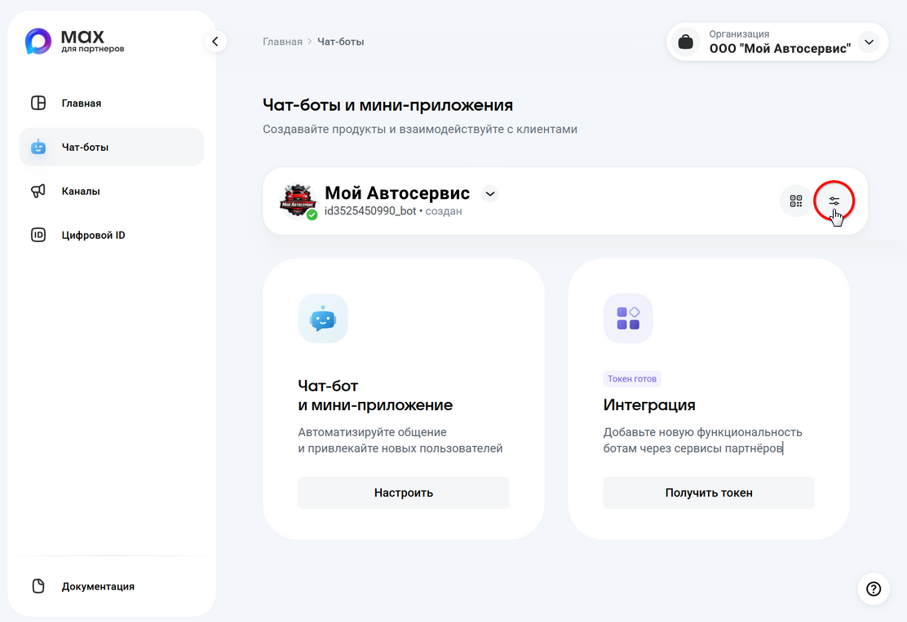

В открывшемся окне следует внести нужные изменения и сохранить – бот будет отправлен на повторную модерацию:

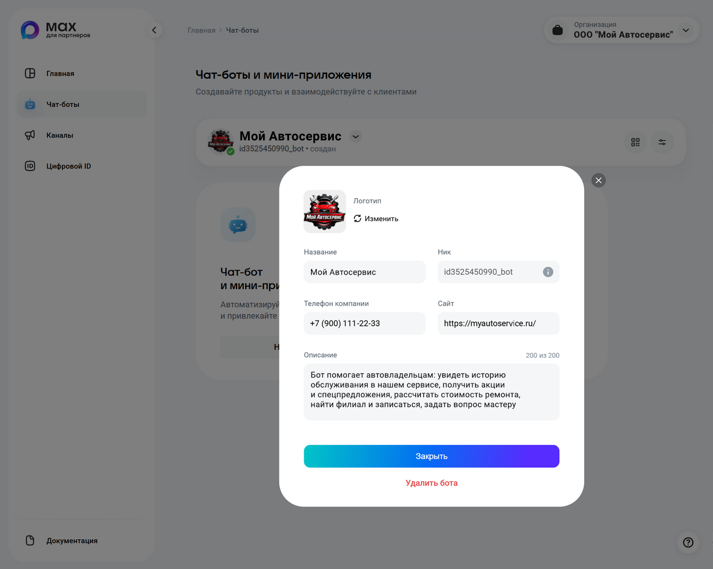

#### 2) Модерация

Каждый бот должен пройти модерацию. Проверка занимает до 48 часов, учет ведется по рабочим дням. Ход модерации можно отслеживать по [статусам](https://dev.max.ru/docs/chatbots/bots-create#%D0%A1%D1%82%D0%B0%D1%82%D1%83%D1%81%D1%8B%20%D0%BC%D0%BE%D0%B4%D0%B5%D1%80%D0%B0%D1%86%D0%B8%D0%B8). После успешной модерации бот получает статус “Создан”:

- бот становится доступен пользователям через поиск в MAX;
- компания получает доступ к расширенным настройкам бота, в том числе возможность подключить приложение и настроить сценарии диалогов.

После того, как бот пройдет модерацию, можно переходить к расширенным настройкам.

#### 3) Настройка бота

После модерации становятся доступны *расширенные настройки* бота и мини-приложений. Также есть возможность настроить сценарии диалогов – см. на [сайте](https://dev.max.ru/docs/chatbots/bots-nocode/create).

Для перехода к расширенным настройкам следует в разделе *“Чат-боты → Чат-бот и мини-приложение”* нажать кнопку *“Настроить”:*

К *расширенным настройкам* бота относится управление приватностью бота и кнопка запуска мини-приложения – см. ниже в разделе “[Подключение приложения](#podkl_prilozh)”:

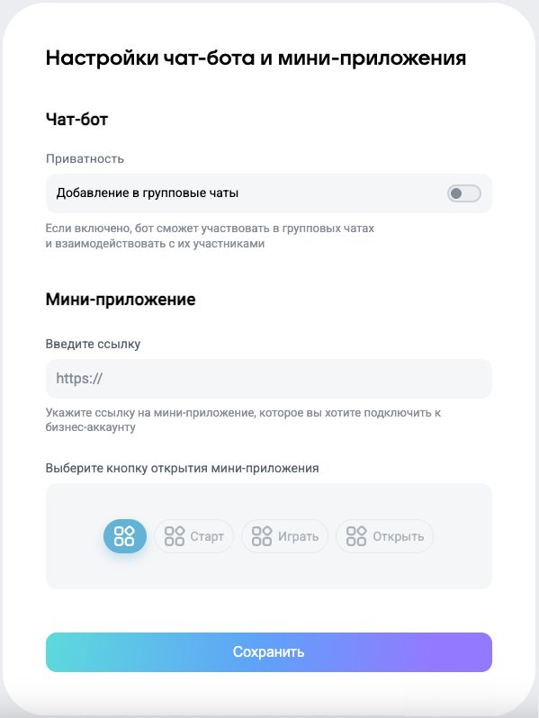

#### 4) Получение токена

После модерации становится доступным *токен* – уникальный идентификатор бота, с помощью которого он будет взаимодействовать с API MAX.

Токен можно найти в разделе *“Интеграция → Получить токен”:*

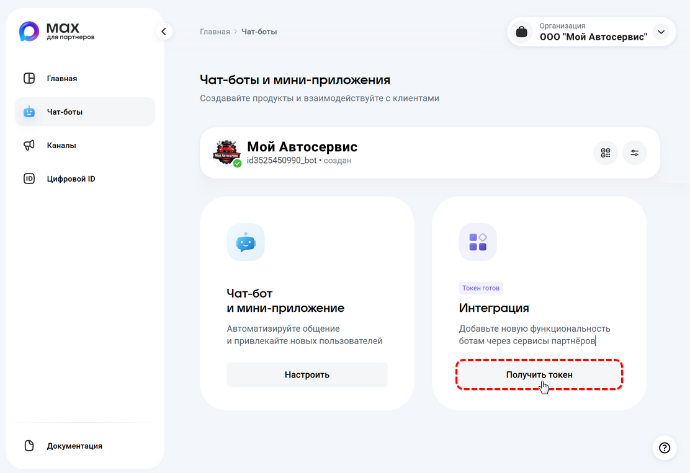

В поле “Токен” следует нажать кнопку *“Скопировать”:*

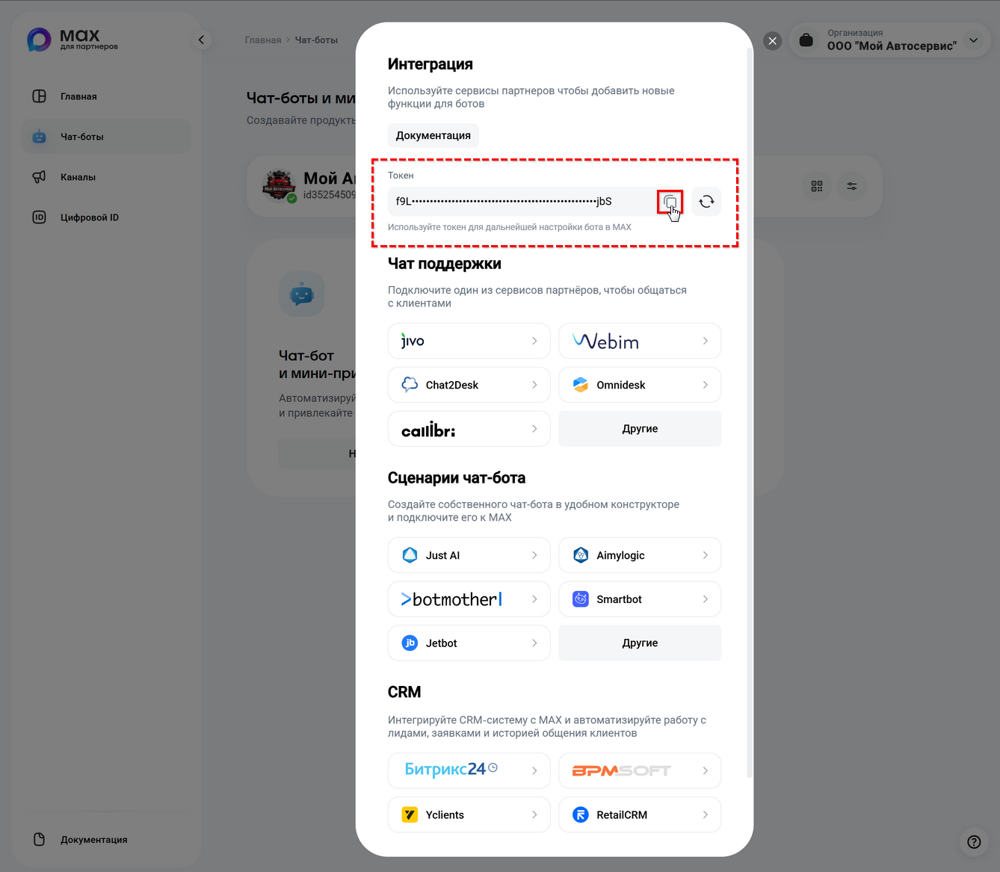

Токен используется для дальнейшей настройки интеграции в программе – см. [ниже](#3-добавление-и-выбор-ботов).

*Примечание:* Токен – это прямой доступ к боту. Не рекомендуется хранить его в открытых источниках или передавать посторонним – они могут завладеть ботом и управлять им от вашего имени. При подозрении на то, что токен скомпрометирован, следует обновить его и изменить настройки бота в программе.

#### 5) Получение ссылки на бота

После успешного создания бота и настройки можно *поделиться* с пользователями QR-кодом или ссылкой на бота – на платформе справа от названия бота следует нажать на значок QR-кода, скачать QR или скопировать ссылку:

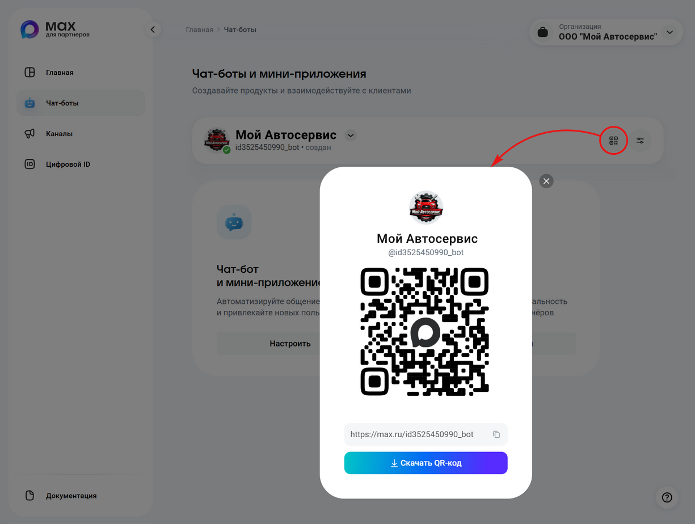

### 3. Настройка интеграции в программе

Предварительно в программе должна быть настроена интеграция с [API 5S AUTO](https://5systems.ru/help/api-5s-auto).

#### 1) Создание интеграции

Для настройки интеграции следует перейти в справочник "Интеграции" – *Администрирование → Компания → CRM → Интеграции* – и создать новый элемент справочника:

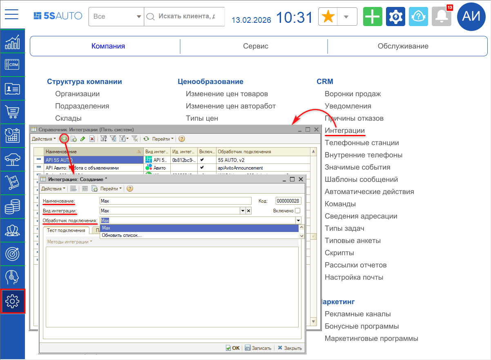

#### 2) Основные реквизиты

Необходимо заполнить основные реквизиты интеграции:

1. *Наименование:* заполняется автоматически в формате *“Max <наименование бота>”* – значение “Max” устанавливается при выборе обработчика подключения, значение в угловых скобках подтягивается при выборе бота, см. [ниже](#vybor_bota);
2. *Вид интеграции:* следует выбрать “Max”;
3. *Обработчик подключения:* следует выбрать обработчик “Max”.

#### 3) Добавление и выбор ботов

У компании может быть создано несколько ботов, например, по разным направлениям деятельности сервиса. Для каждого бота необходимо создать *отдельный* элемент справочника интеграции.

Переход к списку ботов осуществляется через кнопку *“Методы интеграции → Настройки”.* Открывается окно *“Выбор аккаунта Max”.*

В таблицу следует добавить ранее созданный бот Max – для этого нужно нажать кнопку *“Добавить”* на функциональной панели.

В окно добавления бота необходимо ввести токен, который был сгенерирован при создании бота в Max – см. [выше](#4-получение-токена), а также задать описание бота и нажать кнопку “Добавить” на нижней панели формы:

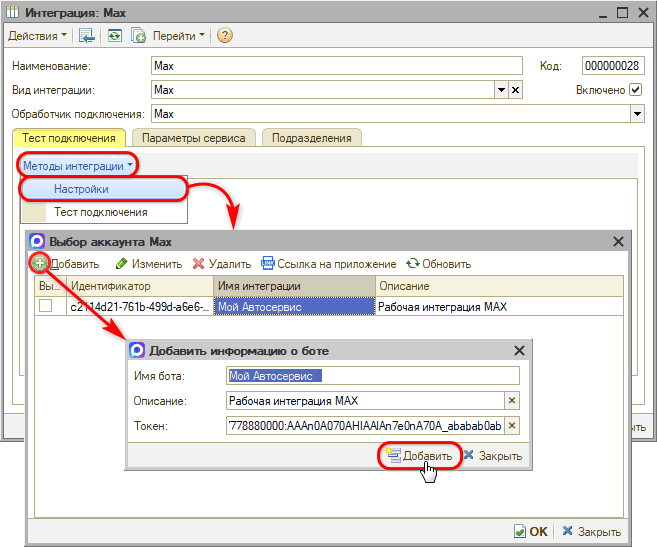

При сохранении информации о боте автоматически генерируется идентификатор интеграции и подтягивается на вкладку “Параметры сервиса” – см. [ниже](#5-параметры-сервиса).

В строке с добавленным ботом следует установить галочку в колонке “Выбрать” – при этом строка подсвечивается зеленым цветом – и сохранить настройки нажатием на кнопку “Ок”. При этом описание бота подтягивается в наименование интеграции в формате *“Max <описание бота>”:*

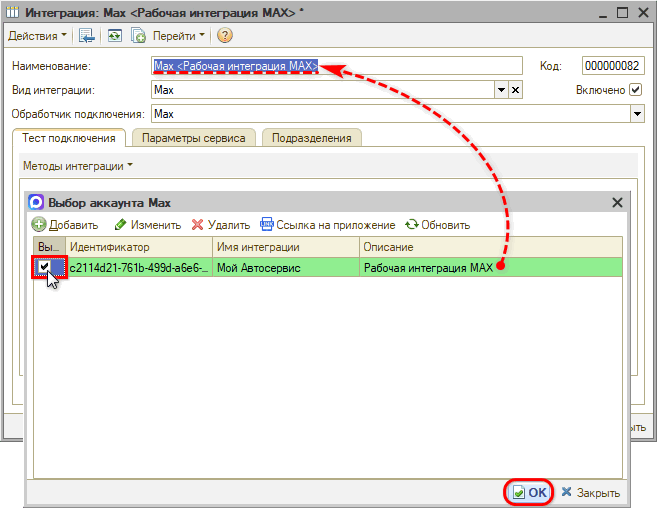

#### 4) Редактирование и удаление ботов

Добавленные в таблицу записи при необходимости можно редактировать – для этого следует выделить курсором нужную строку, нажать на верхней панели кнопку “Изменить”, ввести токен, внести нужные изменения и сохранить:

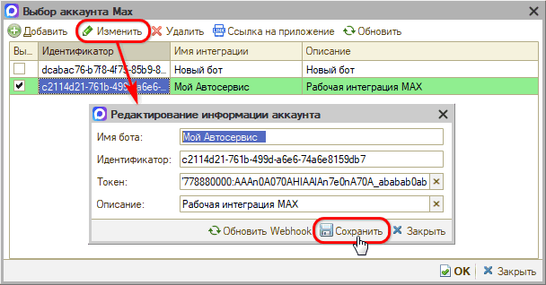

Кнопка *“Обновить Webhook”* используется для восстановления адреса веб-хука, например, если настройки были сбиты при подключении к другим сервисам с использованием API MAX.

Также запись из списка можно *удалить* – для этого необходимо выделить курсором нужную строку, нажать на верхней панели кнопку “Удалить” и подтвердить удаление.

#### 5) Параметры сервиса

В случае использования одной интеграции с MAX заполнять параметры на вкладке *“Параметры сервиса”* не требуется. Интеграция с API 5S AUTO используется автоматически. Значение параметра *“Идентификатор интеграции”* заполняется автоматически при выборе бота – см. [выше](#vybor_bota):

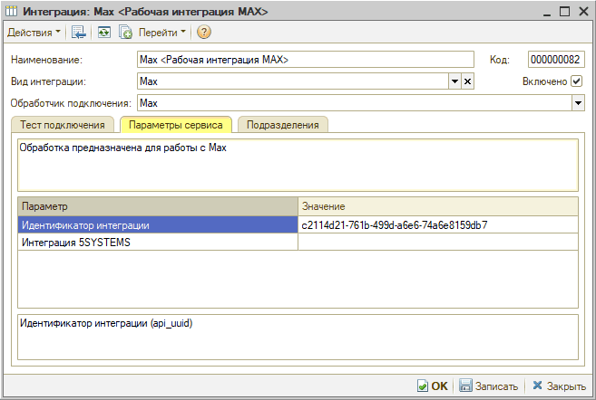

*Примечание:* В случае использования нескольких интеграций с API 5S AUTO требуется выбрать нужную интеграцию в параметре “Интеграция 5SYSTEMS”.

После того, как произведены все настройки, необходимо установить галочку ***“Включено”*** и *записать* интеграцию нажатием кнопки ***“Записать”*** или ***“ОК”**.*

Для проверки корректности подключения следует на вкладке “Тест подключения” нажать кнопку *“Методы интеграции → Тест подключения”.* В случае успешного теста выводится информация с данными подключения.

#### 6) Настройка адреса приложения

**Получение ссылки на приложение**

Для подключения к боту приложения 5S LINK требуется получить ссылку на приложение – для этого следует нажать кнопку *“Ссылка на приложение”* и в открывшемся окне кнопку *“Скопировать”:*

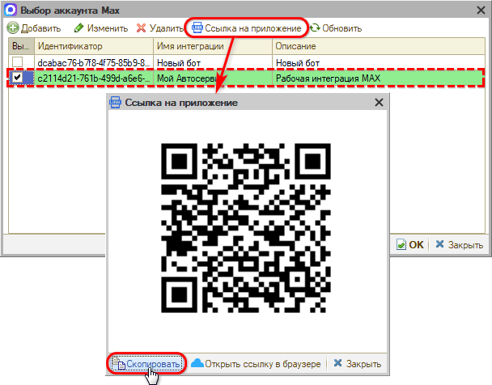

Скопированную ссылку следует вставить в разделе *“Настройка чат-бота и мини-приложения → Мини-приложение”* в профиле платформы “MAX для партнеров” – см. [далее](#podkl_prilozh).

**Подключение приложения**

Настройка подключения веб-приложения [5S Link](https://www.5systems.ru/help/nastroyka-prilozheniya-5s-link-v2) производится на [платформе MAX для партнеров](https://business.max.ru/self). См. также инструкцию на сайте: [Как добавить приложение в MAX](https://dev.max.ru/docs/webapps/introduction#%D0%9A%D0%B0%D0%BA%20%D0%B4%D0%BE%D0%B1%D0%B0%D0%B2%D0%B8%D1%82%D1%8C%20%D0%BF%D1%80%D0%B8%D0%BB%D0%BE%D0%B6%D0%B5%D0%BD%D0%B8%D0%B5%20%D0%B2%20MAX).

1. Откройте [платформу MAX для партнеров](https://business.max.ru/self), перейдите в профиль организации
2. Если у вас несколько ботов, в левом верхнем углу выберите нужный
3. Перейдите в раздел *“Чат-бот и мини-приложение → Настроить”:*

   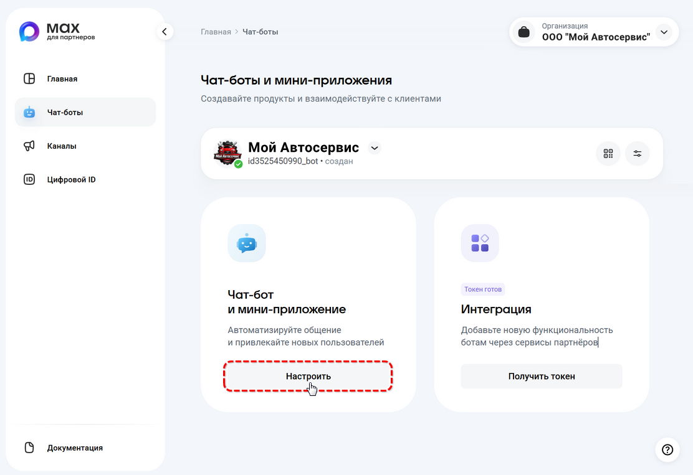

4. Вставьте в поле для ссылки URL мини-приложения – адрес, полученный в настройках интеграции в программе нажатием на кнопку *“Ссылка на приложение → Скопировать”* – см. [выше](#ssylka_na_prilozh):

   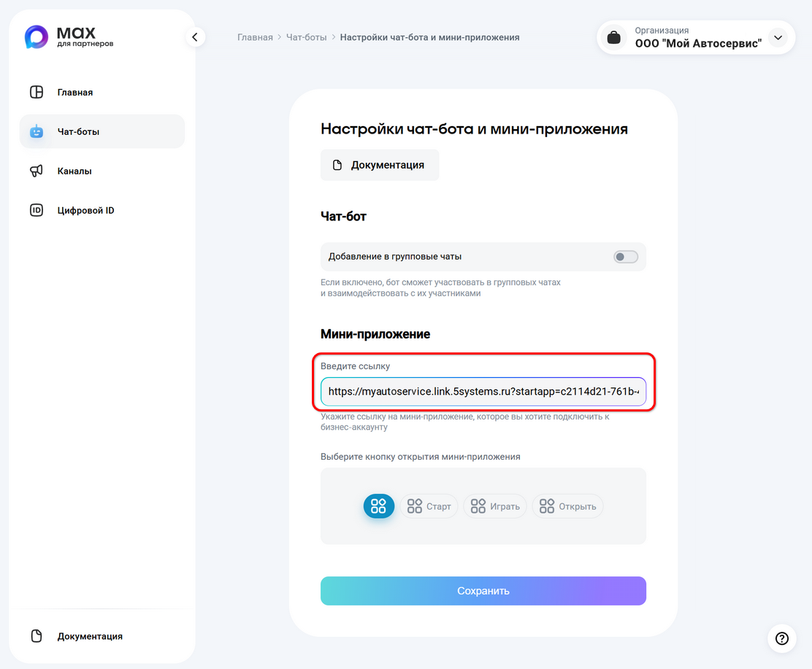

5. Выберите вид кнопки открытия мини-приложения без названия или оставьте кнопку без подписи по умолчанию
6. Нажмите *“Сохранить”*

Кнопка запуска приложения появится в чате с ботом:

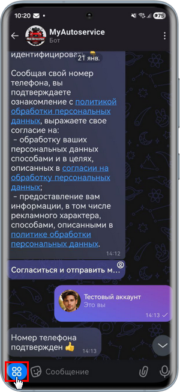

### 4. Шаблоны сообщений

#### 1) Возможности

Отправлять клиентам сообщения через бот MAX можно в свободной форме, а также использовать специальные *шаблоны сообщений.*

Например, есть возможность настроить кнопки со ссылками, ведущими на различные ресурсы – в приложение, на карту, на сайт компании и другие:

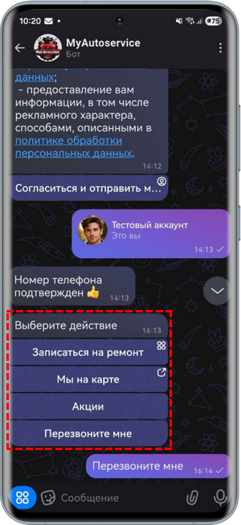

#### 2) Создание шаблона

Для создания шаблонов сообщений MAX следует перейти в справочник “Шаблоны сообщений” через меню программы *“Администрирование → Компания → CRM → Шаблоны сообщений”:*

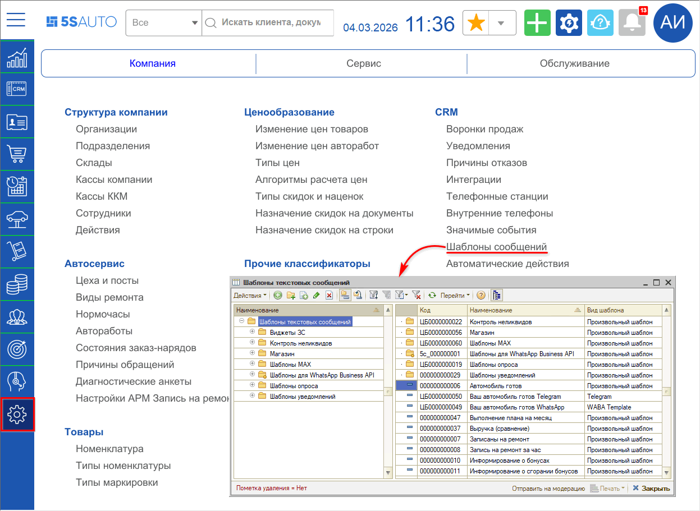

Для группировки шаблонов MAX можно создать отдельную папку в справочнике и задать для нее вариант использования MAX – в этом случае при добавлении нового элемента в группу вид шаблона будет заполняться автоматически:

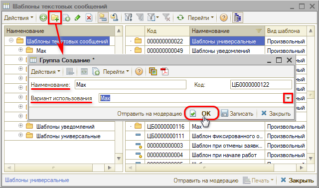

Новый шаблон создается нажатием на кнопку “Создать” либо “Скопировать”:

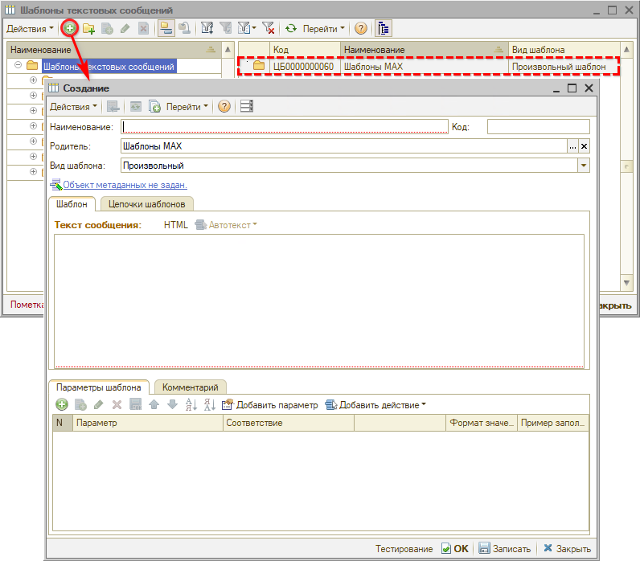

#### 3) Настройка шаблона

Настройка базовых параметров шаблона производится типовым для конфигурации 5S AUTO способом – см. статью [Шаблоны сообщений](../Шаблоны%20сообщений/shablony-soobscheniy.md).

В случае использования разных шаблонов для переписки с клиентами в MAX рекомендуется понятно прописать *наименование* каждого шаблона, чтобы не путаться при выборе нужного шаблона при отправке сообщения из ленты.

На вкладке *“Шаблон”* требуется задать *текст сообщения:*

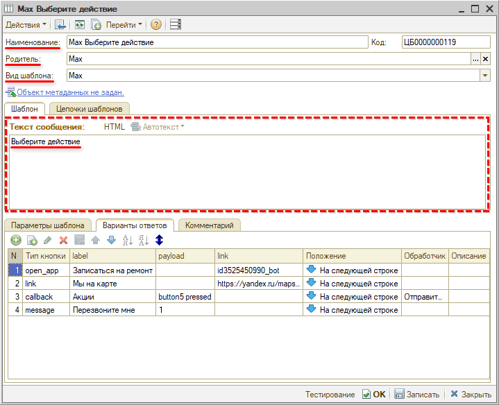

Есть возможность задать параметры шаблона для подстановки в текст сообщения данных о клиенте, документе и других – подробнее см. в [статье](../Шаблоны%20сообщений/shablony-soobscheniy.md).

Для сообщений, отправляемых через MAX, реализован специальный *вид шаблона.* При выборе вида “MAX” на форме настройки появляется дополнительная вкладка *“Варианты ответов”.* На данной вкладке производится настройка кнопок для шаблона сообщения – см. [далее](#4-настройка-кнопок).

#### 4) Настройка кнопок

См. описание типов кнопок в [документации](https://dev.max.ru/docs-api#%D0%9A%D0%BB%D0%B0%D0%B2%D0%B8%D0%B0%D1%82%D1%83%D1%80%D0%B0) MAX.

Добавление интерактивных кнопок для шаблона сообщения производится на вкладке *“Варианты ответов”:*

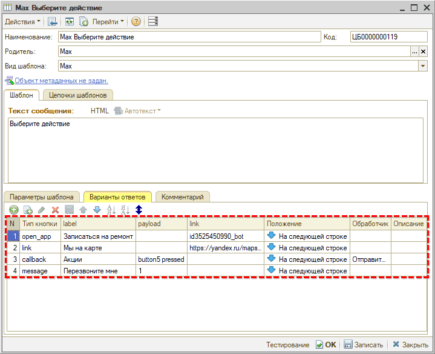

***Параметры кнопок:***

1. *Тип кнопки* – см. [ниже](#tipy_knopok)
2. *label* – текст, который будет написан на кнопке
3. *payload* – служебное поле настройки для встраивания в кнопку дополнительных параметров, например, для автоматического выполнения определенных действий
4. *link* – ссылка для перехода при нажатии на кнопку
5. *Положение* – в случае, если кнопок две и больше, настраивается их взаимное расположение:
- *На следующей строке* – кнопка будет расположена под предыдущей кнопкой;
- *В той же строке* – кнопка будет расположена справа от предыдущей кнопки.

  Порядок расположения кнопок в сообщении можно изменить с помощью кнопок перемещения строк на панели управления: .

6. *Обработчик* – служебное поле для настройки отправки автоматических сообщений с помощью механизма действий на значимые события
7. *Описание* – возможность добавить описание

Предусмотрено несколько ***типов кнопок:***

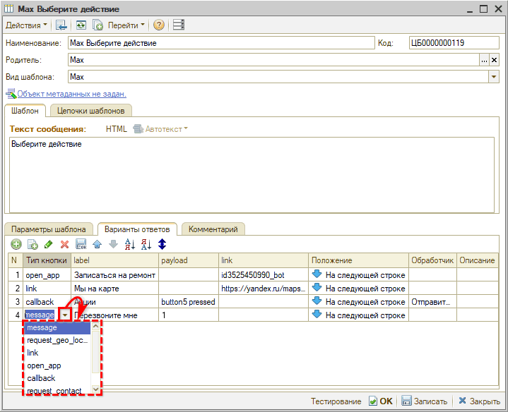

1. *message* – при нажатии кнопки боту отправляется текстовое сообщение от клиента, текст сообщения является значением, введенным на вкладке “label”.
2. *request_geo_location* – при нажатии кнопки открывается окно с информацией о местоположении пользователя, чтобы он мог поделиться координатами в чате. Например, клиент может отправить свою геолокацию для того, чтобы воспользоваться услугами эвакуатора:

   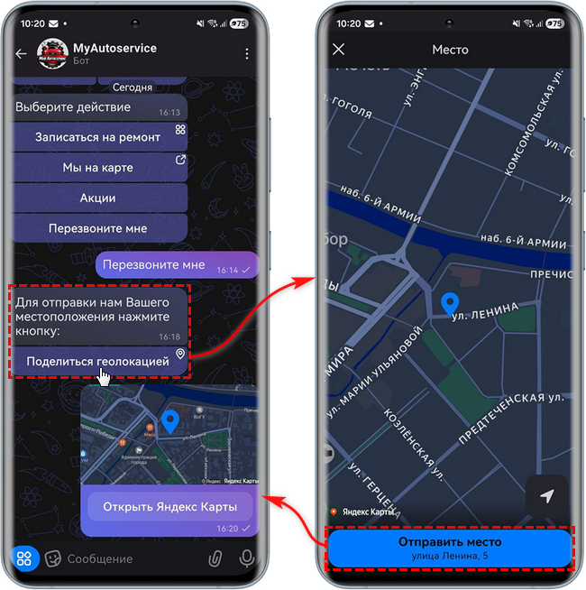

3. *link* – кнопка открывает ссылку в новой вкладке. Например, можно отправлять пользователям ссылку с местоположением филиала на Яндекс Картах или на определенную страницу сайта компании:

   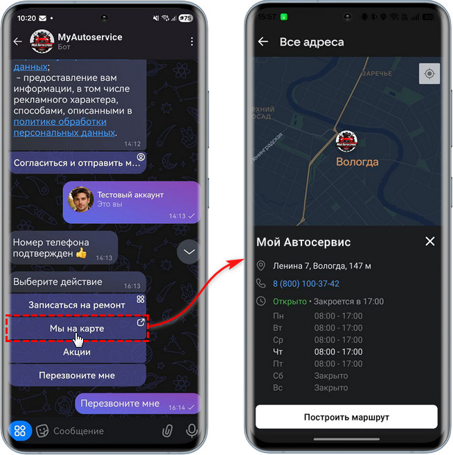

4. *open_app* – кнопка открывает приложение 5S LINK:

   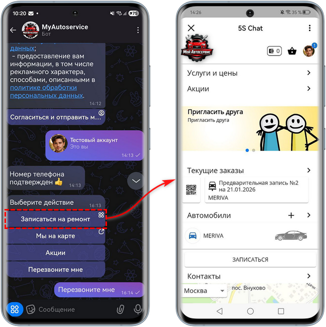

5. *request_contact* – запрашивает у пользователя его контакт и номер телефона:

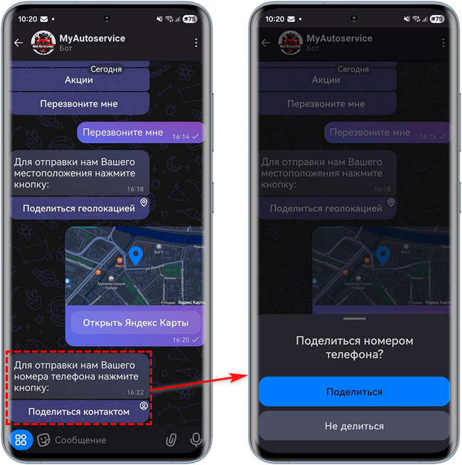

После добавления кнопок шаблон следует *записать.*

#### 5) Настройка заменяемости

На вкладке “Цепочки шаблонов” необходимо добавить строку с идентификатором шаблона и установить параметр *“Использовать для отправки из ленты”* в значение *“Да”:*

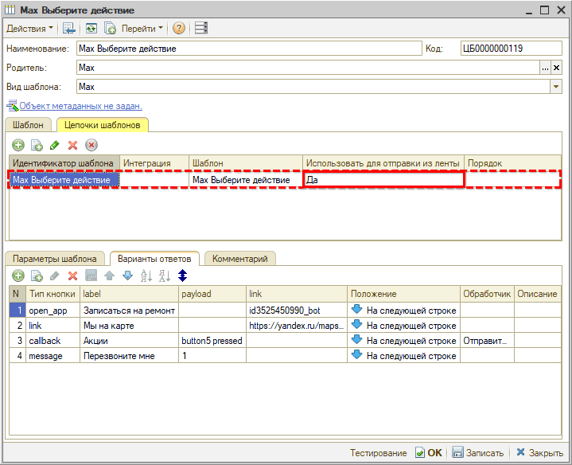

Подробнее см. в статьях *“[Шаблоны сообщений → Настройка заменяемости](../Шаблоны%20сообщений/shablony-soobscheniy.md#настройка-заменяемости)”* и *“[Лента событий → Использование шаблона для отправки сообщения](../../Работа%20с%20клиентами/Лента%20событий/lenta-sobytiy.md#использование-шаблона-для-отправки-сообщения)”.*

Созданный шаблон необходимо записать, затем его можно выбирать при отправке сообщения клиенту через [Ленту событий](../../Работа%20с%20клиентами/Лента%20событий/lenta-sobytiy.md#использование-шаблона-для-отправки-сообщения).

Также есть возможность настроить *[автоматическую отправку сообщений](../Настройка%20автоматической%20отправки%20сообщений%20через%20мессенджеры/nastroyka-avtomaticheskoy-otpravki-soobscheniy-cherez-messendzhery.md)* по значимым событиям. Логика настройки отправки автоматических сообщений общая для конфигурации 5S AUTO: см. статью “[Настройка автоматической отправки сообщений через мессенджеры](../Настройка%20автоматической%20отправки%20сообщений%20через%20мессенджеры/nastroyka-avtomaticheskoy-otpravki-soobscheniy-cherez-messendzhery.md)”.

---

**Теги:** MAX, интеграция, мессенджер, чат-бот, токен

