

# Интеграция с мессенджером Авито

<table><tr><td><b>Время чтения:</b> 9 мин.</td><td><b>Обновлено:</b> 26.06.2025</td></tr></table>

Источник: https://www.5systems.ru/help/integraciya-s-messendzherom-avito

> *Функционал доступен начиная с **релиза 2.8.3** в рамках **комплексной** **подписки "[Контакт-центр 5S Chat](https://www.5systems.ru/services/kontakt-centr-5s-chat)"** (актуальные тарифы см. в [Каталоге услуг](https://www.5systems.ru/services?field_tags_target_id%5B21%5D=21&sort_by=created&sort_order=ASC))*

## Содержание

1. [Введение](#введение)
2. [Принцип работы](#принцип-работы)
3. [Настройка на стороне Авито](#настройка-на-стороне-авито)
4. [Настройка интеграции в программе](#настройка-интеграции-в-программе)
   - [1. Создание интеграции](#1-создание-интеграции)
   - [2. Основные реквизиты](#2-основные-реквизиты)
   - [3. Параметры сервиса](#3-параметры-сервиса)
   - [4. Настройка подключения](#4-настройка-подключения)

## Введение

Интеграция с *платформой объявлений* ***Авито*** позволяет вести переписку с клиентами по объявлениям непосредственно в программе 5S AUTO и в [контакт-центре 5S Chat](../Контакт-центр%205S%20Chat/kontakt-centr-5s-chat.md). Интеграция актуальна для автосервисов и магазинов запчастей, которые используют сервис Авито для привлечения клиентов.

Для подключения интеграции 5S AUTO с API Авито учетная запись компании должна быть бизнес-аккаунтом “[Avito Pro](https://support.avito.ru/sections/123)”. Для того, чтобы профиль изменился на “Avito Pro”, требуется подключить один из [тарифов](https://support.avito.ru/articles/2095), а также пройти [проверку как ИП, юрлицо или самозанятый](https://support.avito.ru/sections/17).

Также см. [правила Авито](https://www.avito.ru/legal/), в т.ч. требования к объявлениям, и другие инструкции на [сайте](https://support.avito.ru/categories/10) сервиса.

## Принцип работы

Когда клиент пишет сообщение по объявлению в Авито, в системе создается новая [сделка](../../CRM/Работа%20со%20сделкой/rabota-so-sdelkoy.md), в нее подтягивается диалог:

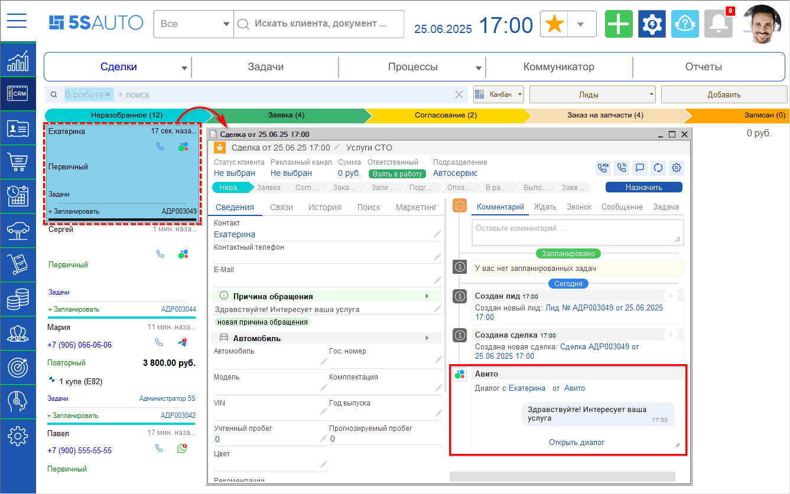

*Примечание:* Если один клиент напишет по разным объявлениям – будут созданы разные чаты в контакт-центре (функционал в разработке), но сделка в программе будет одна.

Переписка с клиентом ведется через [Ленту событий](../../Работа%20с%20клиентами/Лента%20событий/lenta-sobytiy.md), открытую из формы сделки:

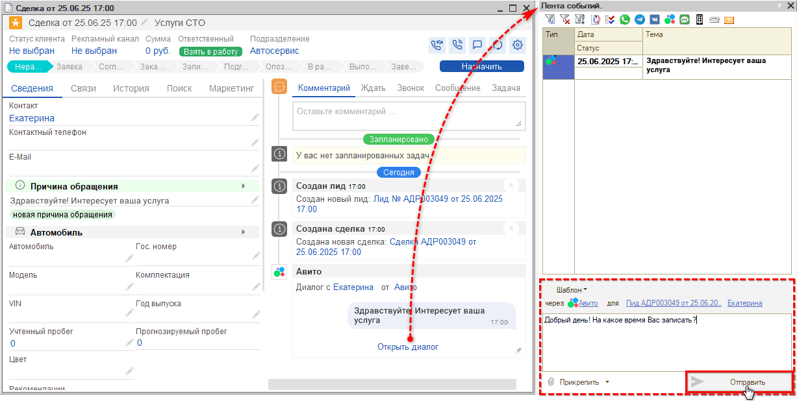

*Примечание:* В Авито действуют ограничения на тип отправляемого контента: сообщение может быть только текстовым или содержать изображение. Отправка видео- и аудиофайлов через личные сообщения не поддерживается – при попытке их отправить будет автоматически выводиться сообщение об ошибке.

## Настройка на стороне Авито

Для подключения интеграции 5S AUTO с API Авито требуются персональные ключи доступа *Client_id* и *Client_secret.*

Для получения ключей доступа сначала необходимо пройти проверку и подключить один из [тарифов](https://www.avito.ru/business/tariffs). После подключения тарифа профиль меняется на [Avito Pro](https://support.avito.ru/sections/123), становятся доступны дополнительные разделы настройки, а также появляется возможность сгенерировать ключи доступа.

Для получения ключей следует перейти в раздел *“Профиль и настройки → Интеграции и API”* (либо перейти по ссылке [https://www.avito.ru/professionals/api](https://www.avito.ru/professionals/api)):

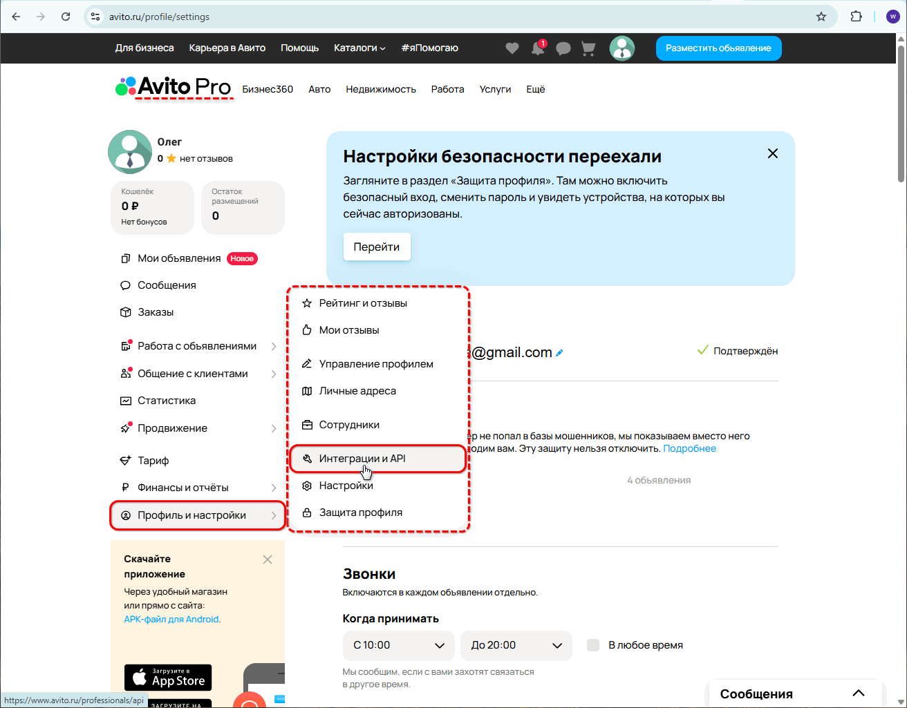

Внизу раздела следует нажать кнопку *“Получить ключи”:*

В результате будут сгенерированы ключи для подключения API – ***Client_id** и **Client_secret**:*

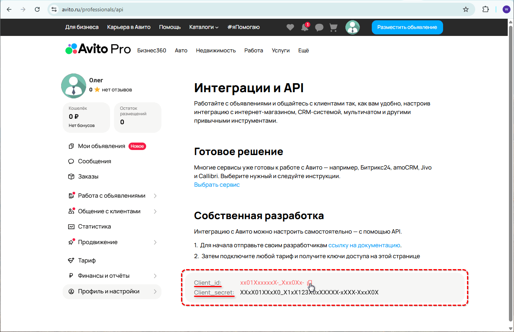

Данные ключи необходимо *скопировать и сохранить в безопасном месте* – они потребуются для дальнейшей настройки подключения интеграции в программе (см. [ниже](#4-настройка-подключения)).

## Настройка интеграции в программе

Предварительно в программе должна быть настроена интеграция с [API 5S AUTO](https://5systems.ru/help/api-5s-auto), а также получены *ключи доступа* в ЛК сайта Авито (см. [выше](#keys)).

### 1. Создание интеграции

Для настройки интеграции с API Авито необходимо перейти в справочник “Интеграции” в программе *Администрирование → Компания → CRM → Интеграции* и создать в нем новый элемент:

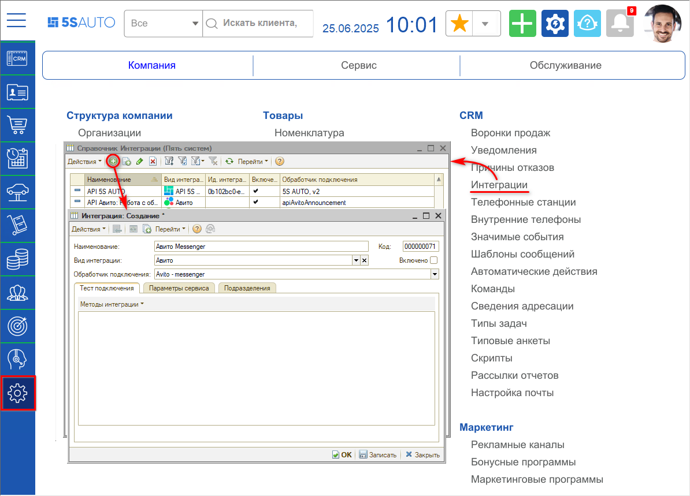

### 2. Основные реквизиты

Необходимо заполнить следующие реквизиты:

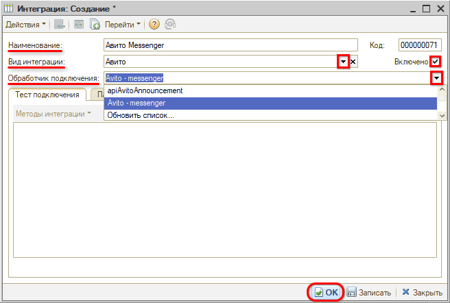

1. *Наименование интеграции* – будет заполнено автоматически после выбора обработчика подключения, можно задать свое при необходимости;
2. Выбрать *вид интеграции* – “Авито”;
3. Выбрать *обработчик подключения* – "AvitoMessenger".

После заполнения следует установить галочку *“Включено”,* *записать* изменения и перезайти в карточку.

### 3. Параметры сервиса

Далее следует перейти на вкладку *“Параметры сервиса”,* выбрать интеграцию с API 5S AUTO и *записать:*

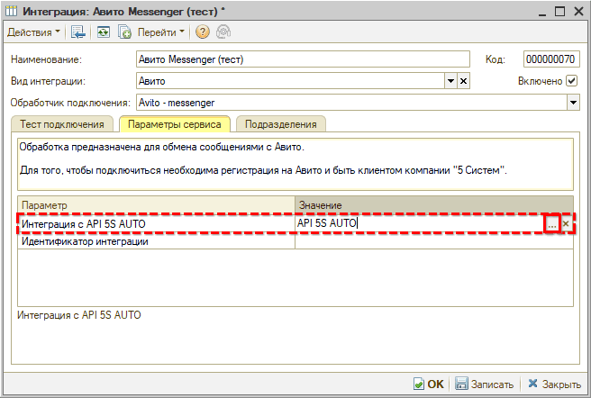

### 4. Настройка подключения

Переход к *настройкам подключения* осуществляется через кнопку *“Методы интеграции → Настройки подключения”.* Открывается окно “Настройки подключения к Авито”. В таблицу следует *добавить новую запись:*

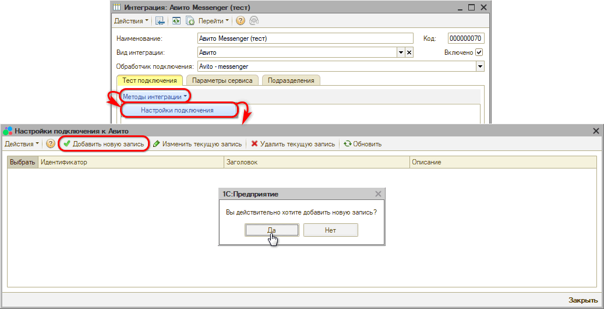

Необходимо задать следующие *параметры подключения:* наименование, описание, а также ввести ключи ***Client ID** и **Client secret**,* полученные в ЛК на сайте Авито (см. [выше](#keys)), и нажать кнопку “Создать”:

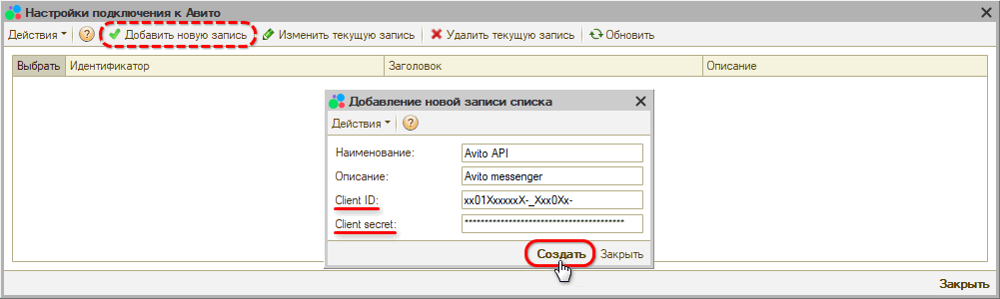

В строке с добавленной настройкой следует установить галочку в колонке *“Выбрать”* – при этом выбранная строка подсвечивается зеленым цветом:

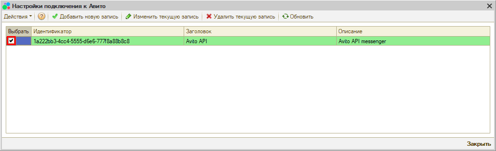

После закрытия окна выбора настройки подключения автоматически производится *тест подключения* – должно появиться сообщение *“Метод выполнен успешно”:*

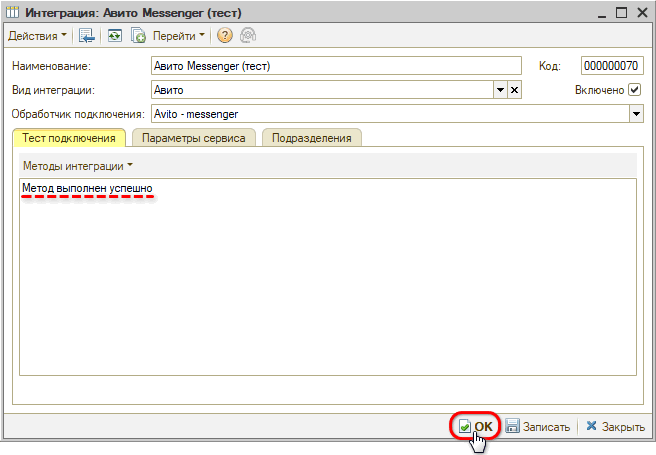

После того, как произведены все настройки, необходимо *записать* интеграцию нажатием кнопки *“Записать”* или *“ОК”.*

Настройки подключения при необходимости можно редактировать или удалить – для этого следует выделить в таблице нужную строку и использовать кнопки “Изменить текущую запись” или “Удалить текущую запись”.

---

**Теги:** Авито, интеграция, мессенджер, чаты, объявления

