

# Интеграция с пользовательским MAX

<table><tr><td><b>Время чтения:</b> 12 мин.</td><td><b>Обновлено:</b> 03.07.2026</td></tr></table>

Источник: https://www.5systems.ru/help/integraciya-s-polzovatelskim-max

> *Функционал доступен начиная с релиза 2.8.4 в рамках [подписки "Контакт-центр 5S Chat"](https://www.5systems.ru/services/kontakt-centr-5s-chat) (актуальные тарифы см. в [Каталоге услуг](https://www.5systems.ru/services?field_tags_target_id%5B21%5D=21&sort_by=created&sort_order=ASC)) *

## Содержание

1. [Введение](#введение)
2. [Работа с интеграцией](#работа-с-интеграцией)
   - [Принцип работы интеграции](#принцип-работы-интеграции)
   - [Работа в программе](#работа-в-программе)
3. [Настройка](#настройка)
   - [1. Подключение GREEN-API: MAX](#1-подключение-green-api-max)
      - [Шаг 1. Регистрация в ЛК GREEN-API](#шаг-1-регистрация-в-лк-green-api)
      - [Шаг 2. Создание и авторизация инстанса](#шаг-2-создание-и-авторизация-инстанса)
      - [Шаг 3. Получение параметров доступа к инстансу](#шаг-3-получение-параметров-доступа-к-инстансу)
   - [2. Настройка интеграции в программе](#2-настройка-интеграции-в-программе)
      - [1) Создание интеграции](#1-создание-интеграции)
      - [2) Основные реквизиты](#2-основные-реквизиты)
      - [3) Добавление и выбор аккаунтов](#3-добавление-и-выбор-аккаунтов)
      - [4) Параметры сервиса](#4-параметры-сервиса)
      - [5) Активация и проверка подключения](#5-активация-и-проверка-подключения)
      - [6) Редактирование бота](#6-редактирование-бота)

## Введение

Интеграция с ***пользовательской версией мессенджера MAX*** – это *неофициальная* интеграция, имитирующая подключение с мобильного устройства. Интеграцию удобно использовать для отправки сервисных сообщений *первичным клиентам* (уведомления о записи, согласование заказа и визита).

Подключение выполняется через сервис GREEN-API: [https://green-api.com/max](https://green-api.com/max).

***Ограничения:***

- нельзя применять для массовых рассылок, иначе последует бан;
- требуется *прогрев номера* – это постепенное создание истории активности, чтобы алгоритмы платформы идентифицировали аккаунт как живого пользователя. Новый, “холодный” профиль без прогрева уязвим к блокировкам за спам или подозрительную активность (см. [подробнее](https://green-api.com/v3/docs/faq/how-to-reduce-risk-of-blocking/#001));
- не рекомендуется использовать в качестве основного канала для работы с повторными клиентами (т.к. имеется риск блокировки либо изменения политики MAX).

*Также рекомендуются для изучения статьи сервиса GREEN-API: *

- [За что аккаунт MAX может получить блокировку](https://green-api.com/v3/docs/faq/reasons-for-blocking-MAX-account/)
- [Какие типы блокировки может наложить MAX](https://green-api.com/v3/docs/faq/what-types-of-blocking-can-max-impose/)
- [Как снизить риск блокировки MAX](https://green-api.com/v3/docs/faq/how-to-reduce-risk-of-blocking/)

Для дальнейшего взаимодействия с клиентом, а также для работы с повторными клиентами рекомендуется использовать *официальную интеграцию с МАХ* – см. основную статью “[Интеграция с мессенджером MAX](../Интеграция%20с%20мессенджером%20MAX/integraciya-s-messendzherom-max.md)”. Официальная интеграция с МАХ позволяет общаться с клиентом через *бот,* отправлять *автоматические сообщения,* а также дает возможность пользователю взаимодействовать через бот MAX с функционалом *веб-приложения [5S LINK](https://www.5systems.ru/help/nastroyka-prilozheniya-5s-link-v2).*

## Работа с интеграцией

### Принцип работы интеграции

Интеграция с мессенджером MAX через сервис [GREEN-API](https://green-api.com/max) использует технологию, имитирующую подключение с физического мобильного устройства. Для платформы MAX отправка и получение сообщений со стороны шлюза выглядит как работа реального пользователя с мобильного приложения или MAX Web.

Вместо имени контакта пользователь видит номер телефона компании, под номером телефона мессенджер подтягивает имя из профиля компании, в качестве аватара отображается фото из профиля. Вверху чата мессенджер MAX выводит системное уведомление о том, что этого номера нет в списке контактов пользователя, а также кнопки "Добавить в контакты" и "Сообщить о спаме":

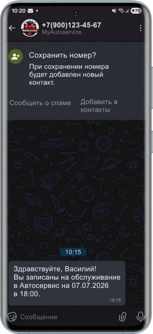

***Основное преимущество** данной интеграции* – система позволяет компании писать клиенту *первыми:* достаточно знать номер телефона клиента, и чтобы он был зарегистрирован в MAX. В отличие от официальной интеграции с MAX, через которую нельзя инициировать диалог с клиентом, пока он не авторизуется у бота.

### Работа в программе

С точки зрения работы с интеграцией с пользовательским MAX в программе логика действий *аналогична работе с официальной интеграцией* – см. в статье “[Интеграция с мессенджером MAX](../Интеграция%20с%20мессенджером%20MAX/integraciya-s-messendzherom-max.md#принцип-работы-интеграции)”.

Перед тем, как писать клиенту, требуется уточнить, есть ли у него MAX.

Для отправки сообщения требуется *указывать интеграцию Max-user.* Пример отправки сообщения из Сделки:

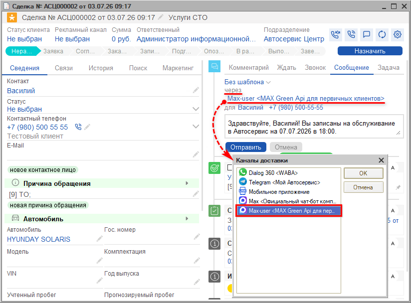

После успешной отправки сообщения в системе создается чат с клиентом, подтягивается в карточку клиента и становится доступен на вкладке “Чаты”, а также в разделе диалогов (см. статью "[Чаты клиента](../../CRM/Чаты%20клиента/chaty-klienta.md)").

Далее можно перейти в [Ленту событий](../../Работа%20с%20клиентами/Лента%20событий/lenta-sobytiy.md) и вести переписку через нее:

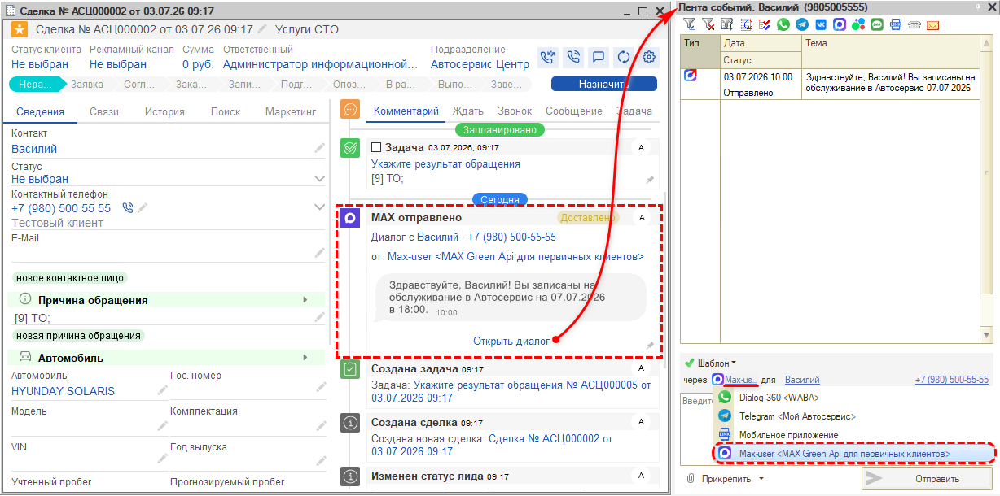

Также есть возможность вести переписку с клиентами через данную интеграцию в [Контакт-центре 5S Chat](../Контакт-центр%205S%20Chat/kontakt-centr-5s-chat.md):

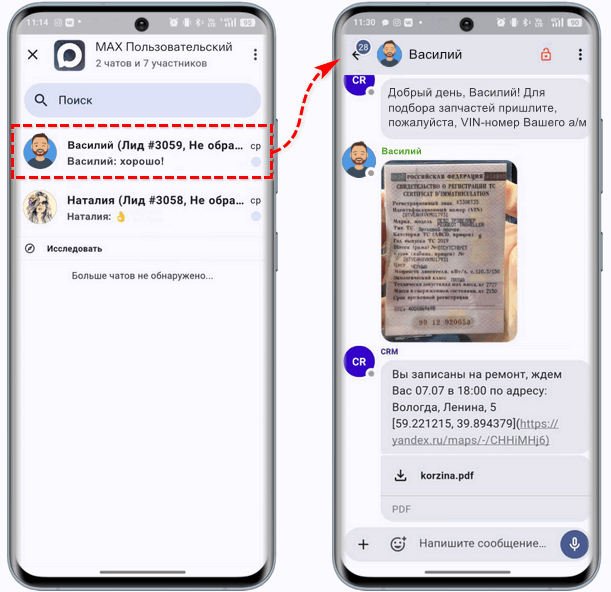

## Настройка

### 1. Подключение GREEN-API: MAX

#### Шаг 1. Регистрация в ЛК GREEN-API

Подробную инструкцию см. на сайте сервиса GREEN-API: [Что нужно знать перед началом работы с API мессенджера MAX](https://green-api.com/v3/docs/before-start/).

Первым делом необходимо зарегистрироваться в [личном кабинете GREEN-API](https://console.green-api.com/). Требуется создать инстанс MAX и пройти авторизацию, а также оплатить тариф (для начала можно использовать тестовый бесплатный тариф).

#### Шаг 2. Создание и авторизация инстанса

*Инстанс* – это уникальный номер шлюза для отправки и получения сообщений через мессенджер MAX. Используется для организации HTTP API мессенджера MAX.

Для создания инстанса требуется в [личном кабинете](https://console.green-api.com/instanceList) нажать на кнопку “Создать инстанс” или “Создать MAX”, затем на следующей странице выбрать и оплатить тарифный план:

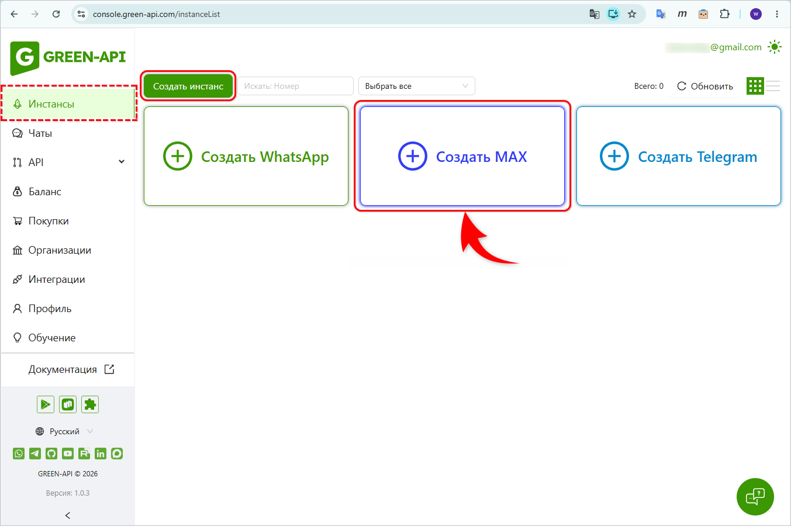

Для просмотра созданных инстансов следует перейти в соответствующий раздел бокового меню.

Для работы с GREEN-API требуется *авторизовать инстанс.* Авторизация выполняется в ЛК путем получения QR-кода мессенджера [MAX](https://max.ru/) или методом [QR](https://green-api.com/v3/docs/api/account/QR/). Инструкцию см. в [статье](https://green-api.com/v3/docs/before-start/#authorization):

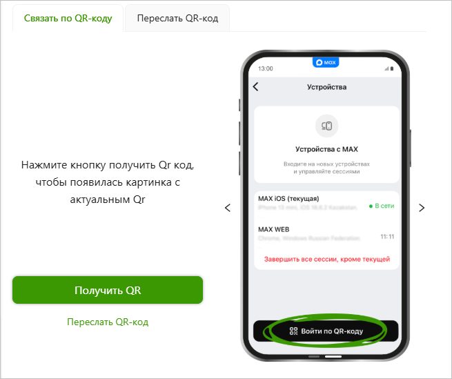

#### Шаг 3. Получение параметров доступа к инстансу

Далее требуется получить *параметры доступа к инстансу* – они требуются для выполнения запросов HTTP API мессенджера MAX. Найти данные параметры можно в *[личном кабинете](https://console.green-api.com/) → вкладка “Инстансы”* на боковой панели *→ перейти на страницу нужного инстанса:*

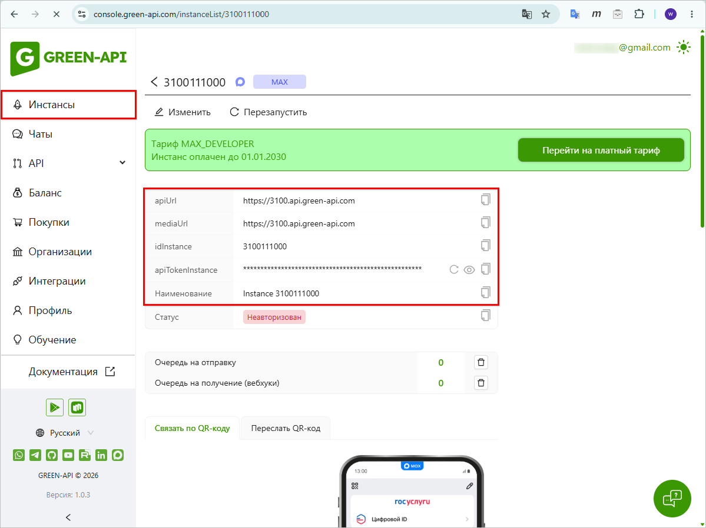

***Параметры доступа к инстансу:***

- *apiUrl* – ссылка на хост API;
- *mediaUrl* – ссылка на хост API для отправки файлов;
- *idInstance* – уникальный номер инстанса;
- *apiTokenInstance* – ключ доступа инстанса.

Ключ доступа инстанса можно сменить при необходимости, например, в случае его компрометации. Сменить токен можно в личном кабинете самостоятельно или обратившись в техподдержку.

Данные параметры необходимы для подключения интеграции в программе. Требуется скопировать их и вставить в соответствующие поля на форме настройки подключения – см. [ниже](#param_podkl).

### 2. Настройка интеграции в программе

Предварительно в программе должна быть настроена интеграция с [API 5S AUTO](https://5systems.ru/help/api-5s-auto), а также получены параметры доступа к инстансу в ЛК GREEN API (см. [выше](#шаг-3-получение-параметров-доступа-к-инстансу)).

#### 1) Создание интеграции

Для настройки интеграции следует перейти в справочник "Интеграции" – *Администрирование → Компания → CRM → Интеграции *– и создать новый элемент справочника:

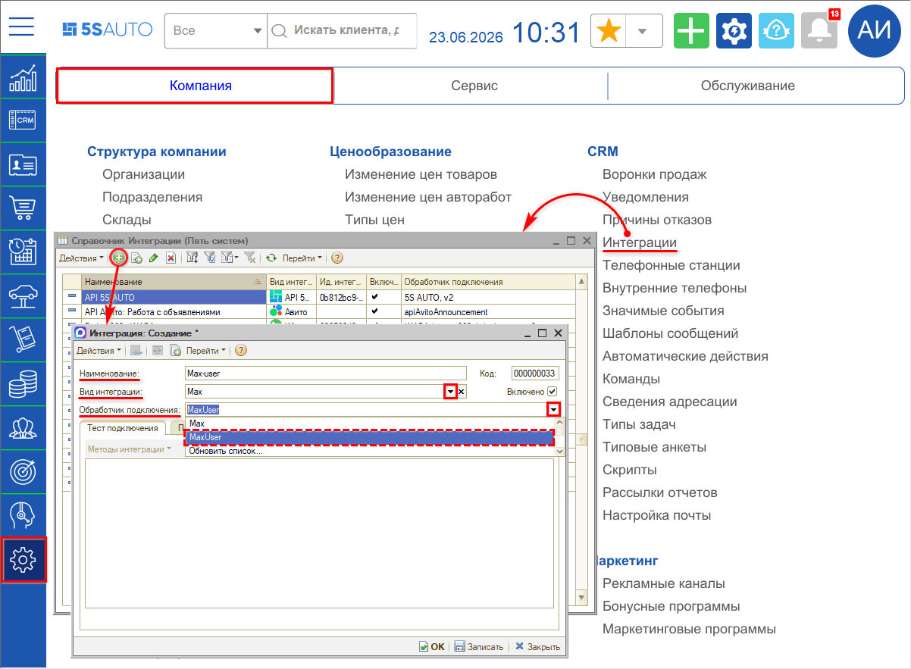

#### 2) Основные реквизиты

Необходимо заполнить *основные реквизиты интеграции:*

**1.** ***Наименование:*** заполняется автоматически в формате *“Max-user <наименование аккаунта>”* – значение “Max-user” устанавливается при выборе обработчика подключения, значение в угловых скобках подтягивается при выборе аккаунта, см. [ниже](#vybor_akk);

**2.** ***Вид интеграции:*** следует выбрать “Max”;

**3.** ***Обработчик подключения:*** выбрать обработчик “MaxUser”.

#### 3) Добавление и выбор аккаунтов

У компании может быть создано несколько аккаунтов, например, по разным направлениям деятельности сервиса. Для каждого аккаунта необходимо создать *отдельный* элемент справочника интеграции.

Переход к списку аккаунтов осуществляется через кнопку *“Методы интеграции → Настройки”.* Открывается окно *“Выбор аккаунта Max”.*

В таблицу следует добавить новый аккаунт – для этого нужно нажать кнопку *“Добавить”* на функциональной панели.

На форме добавления аккаунта необходимо ввести *параметры доступа к инстансу,* полученные ранее в Личном кабинете GREEN API (см. [выше](#шаг-3-получение-параметров-доступа-к-инстансу)):

- ***Токен*** – ключ доступа инстанса, параметр *apiTokenInstance* из ЛК;
- ***api_url*** – ссылка на хост API, параметр *apiUrl* из ЛК;
- ***media_url*** – ссылка на хост API для отправки файлов, параметр *mediaUrl* из ЛК;
- ***instance*** – уникальный номер инстанса, параметр *idInstancel* из ЛК;
- ***Имя бота*** – следует задать имя аккаунта, например, “MAX для первичных клиентов”;
- ***Описание*** – следует задать описание аккаунта (описание автоматически подтянется в наименование интеграции при выборе аккаунта – см. [ниже](#vybor_akk)).

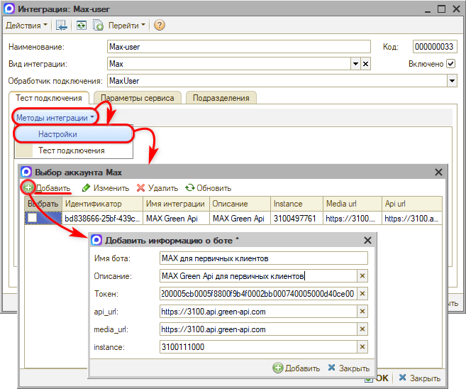

После заполнения параметров нажать кнопку *“Добавить”* на нижней панели формы.

При сохранении информации о боте автоматически генерируется *идентификатор интеграции* и подтягивается на вкладку “Параметры сервиса” – см. [ниже](#4-параметры-сервиса). Также идентификатор выводится на форме редактирования аккаунта.

В строке с добавленным аккаунтом следует установить галочку в колонке *“Выбрать”* – при этом строка подсвечивается зеленым цветом – и сохранить настройки нажатием на кнопку *“Ок”.* При этом описание аккаунта подтягивается в наименование интеграции в формате *“Max-user <описание аккаунта>”:*

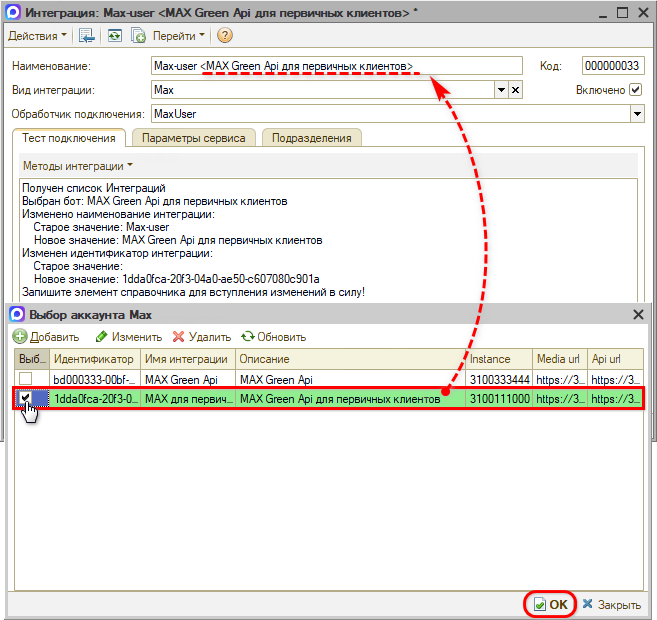

#### 4) Параметры сервиса

В случае использования одной интеграции с MAX-user заполнять параметры на вкладке *“Параметры сервиса”* не требуется. Значение параметра “Идентификатор интеграции” подтягивается автоматически при выборе аккаунта – см. [выше](#vybor_akk). Интеграция с API 5S AUTO используется также автоматически:

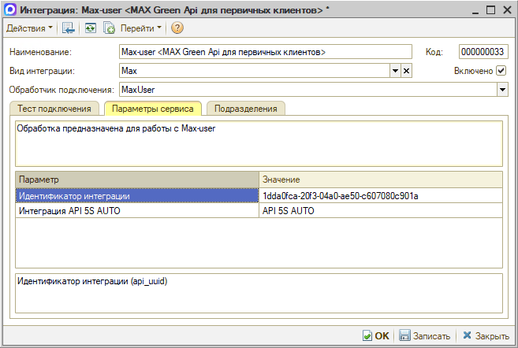

*Примечание:* В случае использования нескольких интеграций с API 5S AUTO требуется выбрать нужную интеграцию в параметре *“Интеграция с API 5S AUTO”.*

#### 5) Активация и проверка подключения

После того как произведены все настройки, необходимо установить галочку ***“Включено”*** и *записать *интеграцию нажатием кнопок ***“Записать”*** или ***“ОК”**.*

Для проверки корректности подключения следует на вкладке *“Тест подключения”* нажать кнопку *“Методы интеграции → Тест подключения”.* В случае успешного теста выводится информация с данными о подключении.

#### 6) Редактирование бота

Добавленные в таблицу записи при необходимости можно редактировать – для этого следует выделить курсором нужную строку, нажать на верхней панели кнопку “Изменить”, ввести токен, внести нужные изменения и сохранить:

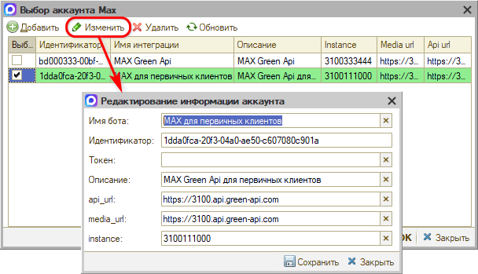

Также запись из списка можно удалить – для этого необходимо выделить курсором нужную строку, нажать на верхней панели кнопку “Удалить” и подтвердить удаление.

---

**Теги:** MAX, пользовательский аккаунт, интеграция, мессенджер

