

# Интеграция с сообществом ВКонтакте (VK)

<table><tr><td><b>Время чтения:</b> 26 мин.</td><td><b>Обновлено:</b> 05.12.2025</td></tr></table>

Источник: https://www.5systems.ru/help/integraciya-s-soobschestvom-vkontakte-vk

> *Функционал доступен начиная с **релиза 2.8.3** в рамках **комплексной** **подписки "[Контакт-центр 5S Chat](https://www.5systems.ru/services/kontakt-centr-5s-chat)"** (актуальные тарифы см. в [Каталоге услуг](https://www.5systems.ru/services?field_tags_target_id%5B21%5D=21&sort_by=created&sort_order=ASC))*

## Содержание

1. [Введение](#введение)
2. [Работа с сообществом VK](#работа-с-сообществом-vk)
   - [1. Способы перехода в сообщество](#1-способы-перехода-в-сообщество)
   - [2. Переход в чат](#2-переход-в-чат)
   - [3. Переход в приложение](#3-переход-в-приложение)
   - [4. Переписка с клиентами](#4-переписка-с-клиентами)
3. [Принцип работы интеграции](#принцип-работы-интеграции)
4. [Настройка](#настройка)
   - [1. Настройка на стороне ВКонтакте](#1-настройка-на-стороне-вконтакте)
      - [1) Настройка возможностей ботов](#1-настройка-возможностей-ботов)
      - [2) Получение ключа доступа](#2-получение-ключа-доступа)
      - [3) Типы событий](#3-типы-событий)
   - [2. Настройка интеграции в программе](#2-настройка-интеграции-в-программе)
      - [1) Создание интеграции](#1-создание-интеграции)
      - [2) Основные реквизиты](#2-основные-реквизиты)
      - [3) Параметры сервиса](#3-параметры-сервиса)
      - [4) Настройка подключения](#4-настройка-подключения)
      - [5) Редактирование настройки](#5-редактирование-настройки)
   - [3. Подключение приложения 5S Link в сообщество](#3-подключение-приложения-5s-link-в-сообщество)
      - [1) Получение ссылки в программе](#1-получение-ссылки-в-программе)
      - [2) Добавление приложения в сообщество](#2-добавление-приложения-в-сообщество)
      - [4) Оформление приложения](#4-оформление-приложения)
   - [4. Подключение шаблонов сообщений](#4-подключение-шаблонов-сообщений)
      - [1) Возможности](#1-возможности)
      - [2) Создание шаблона](#2-создание-шаблона)
      - [3) Настройка сообщений с кнопками](#3-настройка-сообщений-с-кнопками)
   - [4) Настройка заменяемости](#4-настройка-заменяемости)

## Введение

Интеграция с сообществом **ВКонтакте (VK)** требуется в случае, если у автосервиса или магазина запчастей есть сообщество в данном сервисе, где участники пишут компании сообщения. Интеграция позволяет вести переписку с клиентами в автоматическом режиме непосредственно через программу 5S AUTO и [контакт-центр 5S Chat](../Контакт-центр%205S%20Chat/kontakt-centr-5s-chat.md).

Работа с сообщениями сообщества настраивается с использованием *API ВКонтакте,* для настройки интеграции требуется сгенерировать *ключ доступа* в параметрах сообщества.

Для переписки с клиентами через мессенджер ВКонтакте требуется чтобы клиент первым написал в сообщения сообщества, и чтобы у него не был настроен запрет получать сообщения от сообществ, иначе отправить ему сообщение будет невозможно.

## Работа с сообществом VK

Интеграция предназначена для взаимодействия с клиентами – пользователями VK. Предварительно клиент должен быть авторизован на сайте или в приложении ВКонтакте.

### 1. Способы перехода в сообщество

**1) Переход по ссылке**

Компания отправляет клиенту ссылку на сообщество VK в сообщении либо размещает ссылку на сайте. Клиент на своем устройстве переходит по ссылке в сообщество:

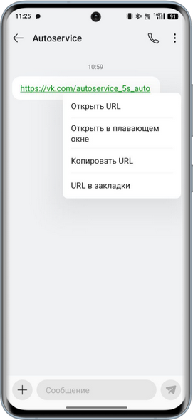 &nbsp;&nbsp;&nbsp;&nbsp;&nbsp;&nbsp; 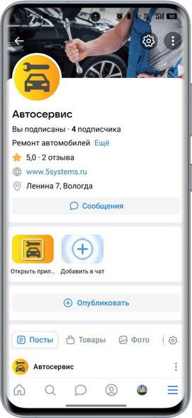

**2) Сканирование QR-кода**

QR-код можно сгенерировать прямо в VK и вывести его на экран смартфона либо отправить другому пользователю:

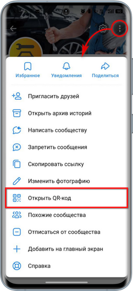 &nbsp;&nbsp;&nbsp;&nbsp;&nbsp;&nbsp; 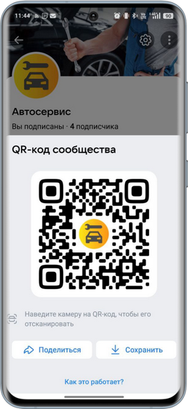

Также можно сгенерировать QR-код при помощи специальных сервисов, например: [qrcoder.ru](http://qrcoder.ru/), [qrcode-monkey.com/ru](https://qrcode-monkey.com/ru), [code-qr.ru](https://code-qr.ru).

Созданный QR-код можно вывести на монитор, разместить на сайте, либо распечатать и расположить в любом удобном для сканирования клиентами месте.

Клиент при помощи камеры своего мобильного телефона сканирует QR-код и переходит по найденной ссылке в сообщество.

**3) Поиск сообщества**

Клиент самостоятельно находит сообщество компании VK через поиск наименованию.

### 2. Переход в чат

После перехода в сообщество любым из способов клиент нажимает кнопку *“Сообщения”* и открывает чат с компанией:

При первом переходе клиента в сообщения сообщества у него будет отображаться кнопка "Начать":

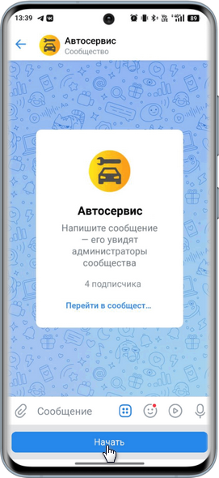

После ее нажатия, а также при последующих переходах в чат с компанией у клиента будет отображаться кнопка *"Меню"* для перехода в ЛК веб-приложения 5S LINK – см. [ниже](#kn_menu).

*Примечание:* В случае если у клиента уже был чат с сообществом, кнопка "Начать" у него отображаться не будет. Для того, чтобы у него появилась кнопка "Меню", следует либо клиенту самостоятельно написать в чат команду "Начать", либо компании сделать для старых клиентов рассылку сообщений с кнопкой, нажатием на которую в чат отправится текст "Начать".

### 3. Переход в приложение

Перейти в *веб-приложение 5S LINK* клиент может следующими способами:

**1)** нажать на кнопку “Открыть приложение” в меню сообщества:

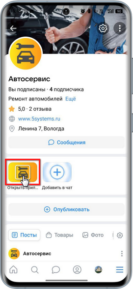

**2)** нажать кнопку “Меню” в чате с сообществом:

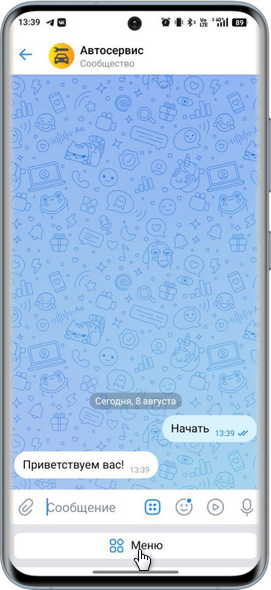

**3)** нажать кнопку перехода в приложение в сообщении, полученном в чате:

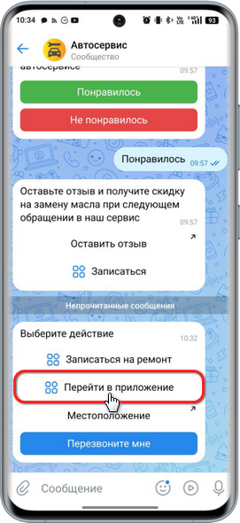

Для этого предварительно требуется подключить и настроить специальные шаблоны сообщений – см. [ниже](#4-подключение-шаблонов-сообщений).

**4)** перейти по ссылке на приложение, например, отправленной в сообщении, либо размещенной на сайте.

При нажатии любой из этих кнопок или ссылки у клиента открывается приложение [5S Link](https://www.5systems.ru/help/nastroyka-prilozheniya-5s-link-v2).

**Авторизация клиента в приложении**

При первом входе приложение *запрашивает номер телефона* клиента для *авторизации* – от клиента требуется предоставить разрешение:

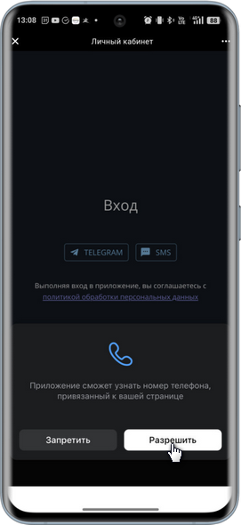

Если клиент повторный, подтягивается информация по его автомобилям, истории обслуживания, текущим документам, заказам, бонусам и т.д.:

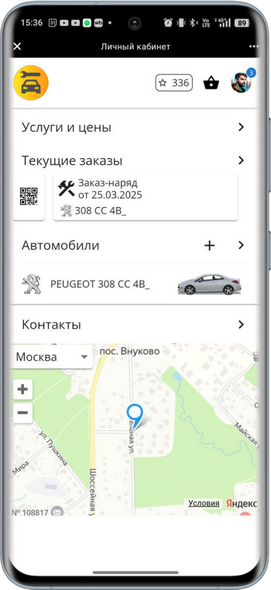

**Возможности**

При помощи приложения пользователь имеет возможность:

- просматривать информацию о своих автомобилях, историю обслуживания и рекомендации;
- добавлять а/м по фото гос.номера или СТС;
- добавлять в корзину услуги и товары из каталога и записываться на сервис;
- отслеживать текущие заказы и заявки с их статусами, оплачивать через СБП;
- видеть актуальные акции;
- находить контакты сервиса, открыть карту с отметкой ближайшего филиала и построить маршрут;
- отслеживать информацию о своих бонусных баллах, подтверждать списание и делиться ими через QR-код;
- вести переписку с сервисом в чате приложения;
- просматривать и редактировать информацию в своем профиле, выбирать светлую или темную тему.

Подробнее о приложении 5S Link см. [статью](https://www.5systems.ru/help/nastroyka-prilozheniya-5s-link-v2).

### 4. Переписка с клиентами

Есть возможность подключить и настроить шаблоны сообщений для отправки клиентам через сообщения сообщества ВКонтакте. Можно настроить кнопки со ссылками, ведущими на различные ресурсы – в приложение, на карту, страницу с отзывами и другие:

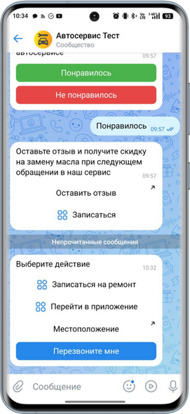 &nbsp;&nbsp;&nbsp;&nbsp;&nbsp;&nbsp; 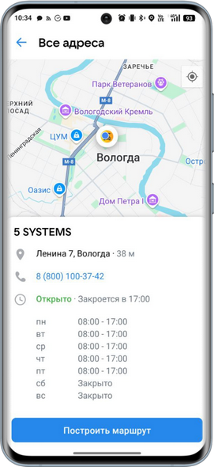

Сообщения на основе шаблонов можно отправлять вручную либо есть возможность настроить автоматическую отправку.

## Принцип работы интеграции

Когда клиент пишет компании сообщение в группе ВКонтакте, в системе создается новая [сделка](../../CRM/Работа%20со%20сделкой/rabota-so-sdelkoy.md), в нее подтягивается диалог:

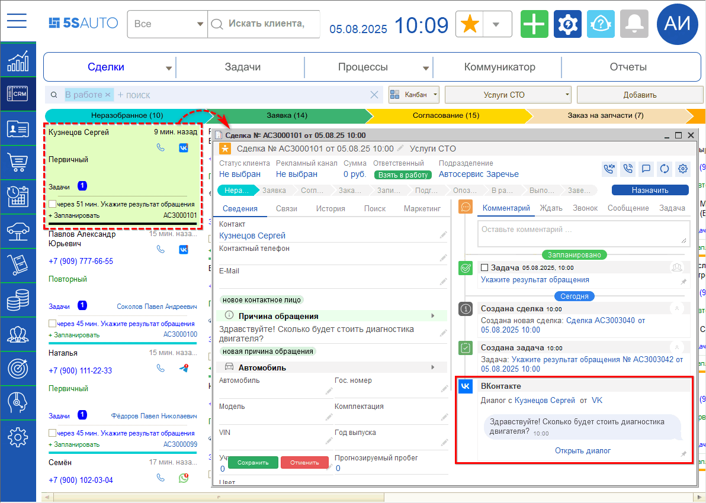

В системе автоматически создается *[внешний пользователь](https://www.5systems.ru/help/vneshnie-polzovateli),* имя и фамилия клиента определяются по профилю пользователя ВКонтакте. После создания [карточки клиента](../../Работа%20с%20клиентами/Контрагенты%20и%20контакты/kontragenty-i-kontakty.md) эти данные присваиваются ему.

*Примечание:* При необходимости можно уточнить данные у клиента в переписке, т.к. в профиле могут быть указаны ненастоящие имя и фамилия.

После этого следует идентифицировать клиента – для этого на вкладке “Поиск” в сделке ввести данные клиента и нажать кнопку “Найти”:

**1)** Если клиент повторный, то он будет найден в базе;

**2)** Если клиент первичный, следует записать карточку нового клиента (см. статью [Идентификация клиента на форме сделки](../../Работа%20с%20клиентами/Идентификация%20клиента%20на%20форме%20Сделки/identifikaciya-klienta-na-forme-sdelki.md)).

Также в системе создается *чат* с клиентом, идентификатор клиента VK ID записывается в чат. Чат ВКонтакте подтягивается в *карточку клиента* и становится доступен на вкладке “Чаты”, а также в разделе диалогов (см. статью [Чаты клиента](../../CRM/Чаты%20клиента/chaty-klienta.md)):

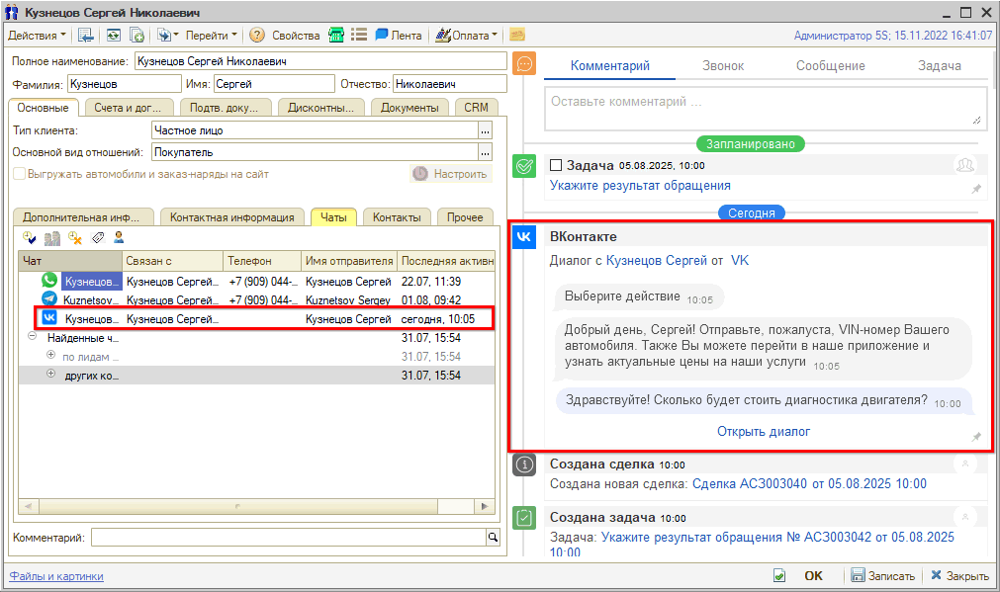

Переписка с клиентом ведется через *[Ленту событий](../../Работа%20с%20клиентами/Лента%20событий/lenta-sobytiy.md),* открытую из формы сделки либо из карточки клиента:

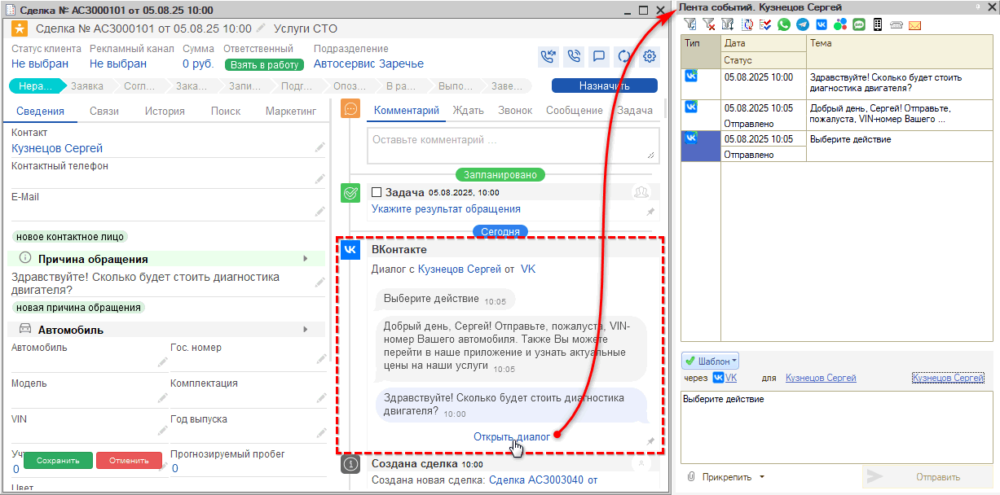

В случае если у компании настроено несколько интеграций с ВКонтакте, то при отправке сообщения нужно будет выбирать нужную интеграцию, через которую его следует отправить.

Есть возможность использовать шаблоны сообщений, например, для отправки сообщения с кнопкой, нажатием на которую клиент может перейти в [веб-приложение](https://www.5systems.ru/help/nastroyka-prilozheniya-5s-link-v2). Подробнее см. ниже в разделе *"[Подключение шаблонов сообщений](#4-подключение-шаблонов-сообщений)".*

## Настройка

### 1. Настройка на стороне ВКонтакте

См. описание настройки на сайте сервиса: [https://dev.vk.com/ru/api/community-messages/getting-started#API_для_сообщений_сообществ](https://dev.vk.com/ru/api/community-messages/getting-started#API%20%D0%B4%D0%BB%D1%8F%20%D1%81%D0%BE%D0%BE%D0%B1%D1%89%D0%B5%D0%BD%D0%B8%D0%B9%20%D1%81%D0%BE%D0%BE%D0%B1%D1%89%D0%B5%D1%81%D1%82%D0%B2).

#### 1) Настройка возможностей ботов

В настройках сообщества в разделе “Сообщения” следует перейти в подраздел *“Настройки для бота”:*

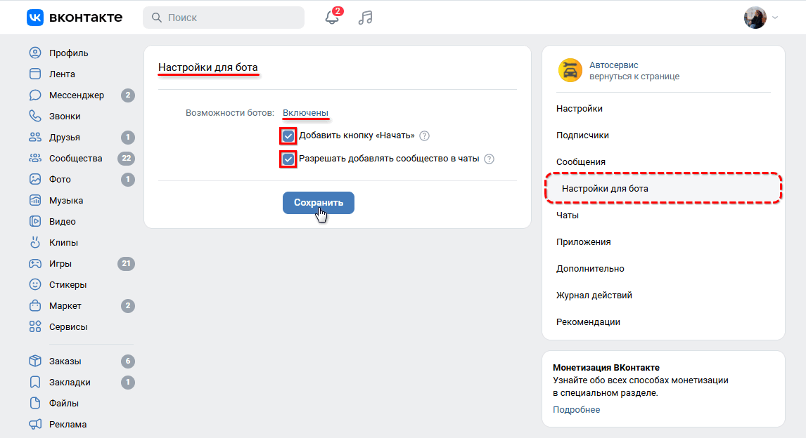

Необходимо *включить* возможности ботов, затем установить галочки напротив всех возможностей и *сохранить* изменения.

*Примечание:* При включении настройки *"Добавить кнопку «‎Начать»"* в чате появляется кнопка "Начать" – см. *[выше](#nachat).*

#### 2) Получение ключа доступа

Для подключения интеграции 5S AUTO с сообществом ВКонтакте требуется получить специальный ***ключ доступа*** – это строка, включающая латинские буквы и цифры. Ключ доступа необходим для работы с API от имени сообщества.

Для получения ключа доступа требуется в разделе управления сообществом “ВКонтакте” перейти на вкладку *“Дополнительно → Работа с API”.* На вкладке “Ключи доступа” необходимо нажать кнопку *“Создать ключ”:*

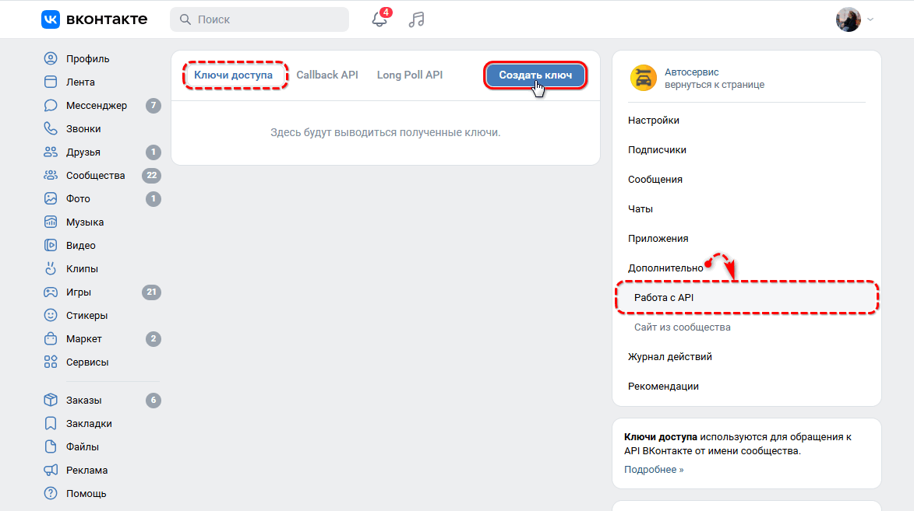

На следующем шаге требуется выбрать необходимые права для нового ключа и нажать кнопку *“Создать”:*

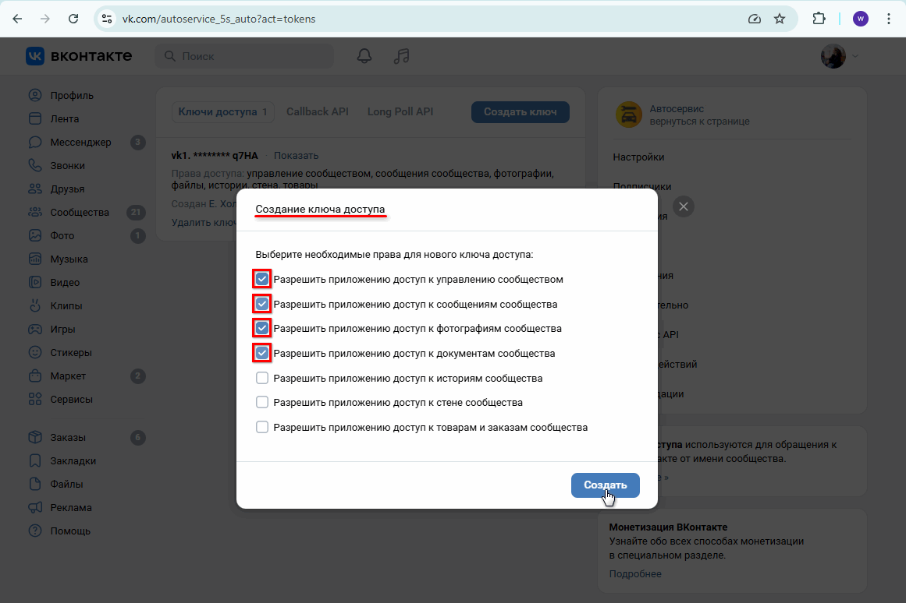

*Обязательными* являются  права доступа *к управлению сообществом* и *к сообщениям сообщества*– без них невозможно создать бота. Также рекомендуется разрешить доступ *к фотографиям сообщества* – для отправки изображений во вложении, и *к документам* – для отправки любых других файлов.

*Примечание:* Может быть создано несколько ключей с разными правами доступа.

Созданный ключ затем выводится на вкладке *“Ключи доступа”.* Необходимо его ***скопировать и сохранить в безопасном месте*** – он потребуется для дальнейшей настройки подключения интеграции в программе (см. [ниже](#4-настройка-подключения)):

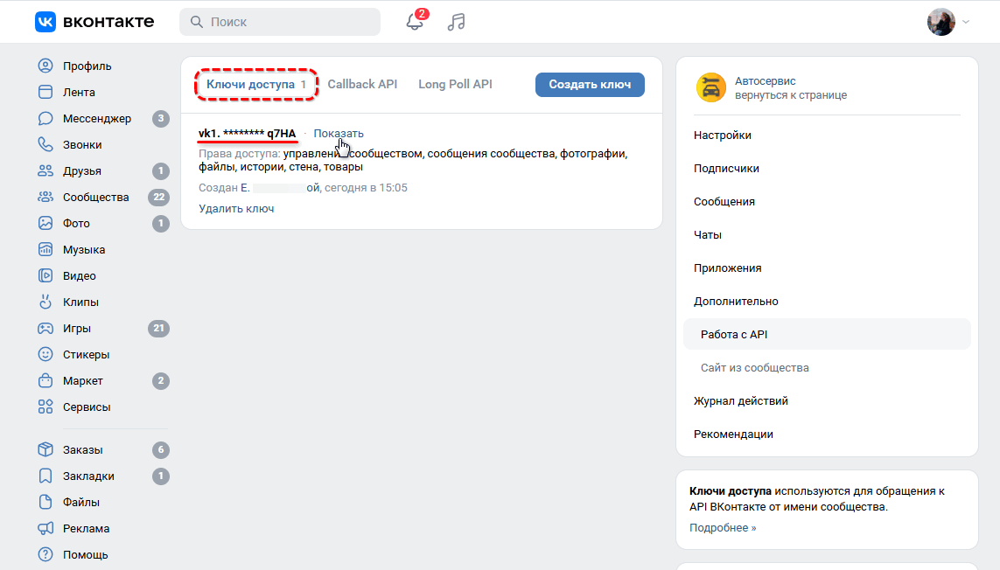

*Примечание:* Ключи нельзя размещать публично – узнав его, третье лицо может обращаться к API ВКонтакте от имени вашего сообщества. Если ключ был скомпрометирован, необходимо удалить его из списка – после этого он станет недействителен – затем сгенерировать новый ключ и изменить настройки интеграции в программе.

#### 3) Типы событий

В настройках сообщества ВКонтакте на вкладке *“Callback API → Типы событий”\** должны быть установлены отметки у всех событий в блоке “Сообщения”:

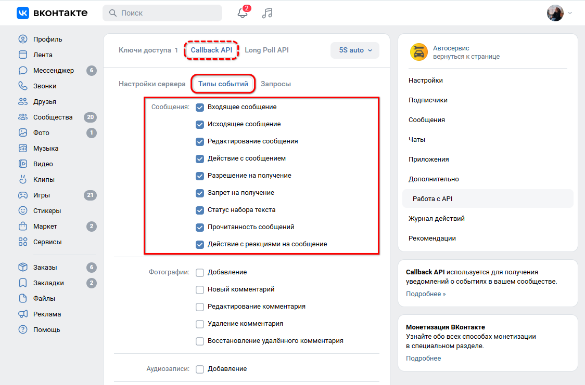

*\*Примечание:* Настройки callback-сервера, в том числе типы событий будут отображаться только после создания бота в программе (см. [ниже](#4-настройка-подключения)). После указания токена производится его проверка микросервисом: если токен действителен, и ему предоставлены необходимые права, микросервис сам создает callback-сервер (либо ищет созданный ранее) и проставляет у него нужные права.

### 2. Настройка интеграции в программе

Предварительно в программе должна быть настроена интеграция с [API 5S AUTO](https://5systems.ru/help/api-5s-auto), а также получен *ключ доступа* в сообществе ВКонтакте (см. [выше](#2-получение-ключа-доступа)).

#### 1) Создание интеграции

Для настройки интеграции с сообществом ВКонтакте необходимо перейти в справочник “Интеграции” в программе *Администрирование → Компания → CRM → Интеграции* и создать в нем новый элемент:

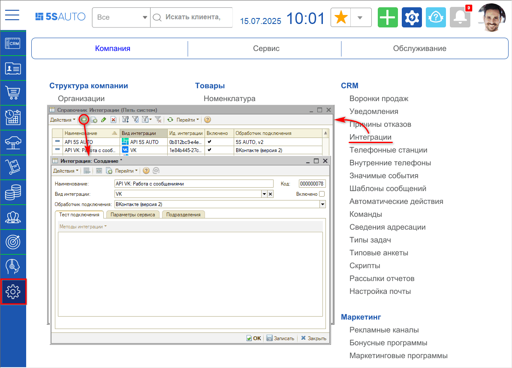

#### 2) Основные реквизиты

Необходимо заполнить следующие реквизиты:

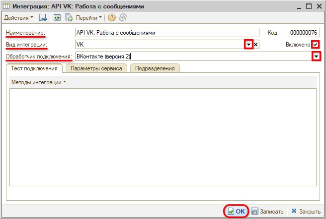

1. *Наименование интеграции* – будет заполнено автоматически после выбора обработчика подключения, можно задать свое при необходимости.

   *Примечание:* В случае использования нескольких интеграций с ВКонтакте рекомендуется четко прописывать их наименования, чтобы впоследствии не путаться при выборе интеграции в ленте событий для отправки сообщения;

2. Выбрать *вид интеграции* – “VK”;
3. Выбрать *обработчик подключения* – "ВКонтакте (версия 2)";

После заполнения следует установить галочку *“Включено”* и *записать* изменения.

#### 3) Параметры сервиса

Далее следует перейти на вкладку *“Параметры сервиса”,* выбрать интеграцию с API 5S AUTO и *записать:*

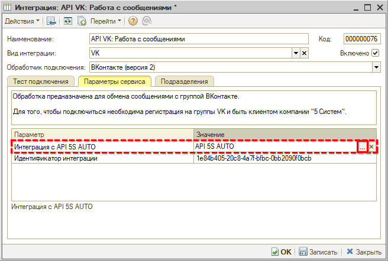

#### 4) Настройка подключения

Переход к настройкам подключения осуществляется через кнопку *“Методы интеграции → Настройки подключения”.* Открывается окно *“Настройки подключения к группе VK”.* В таблицу следует добавить новую запись:

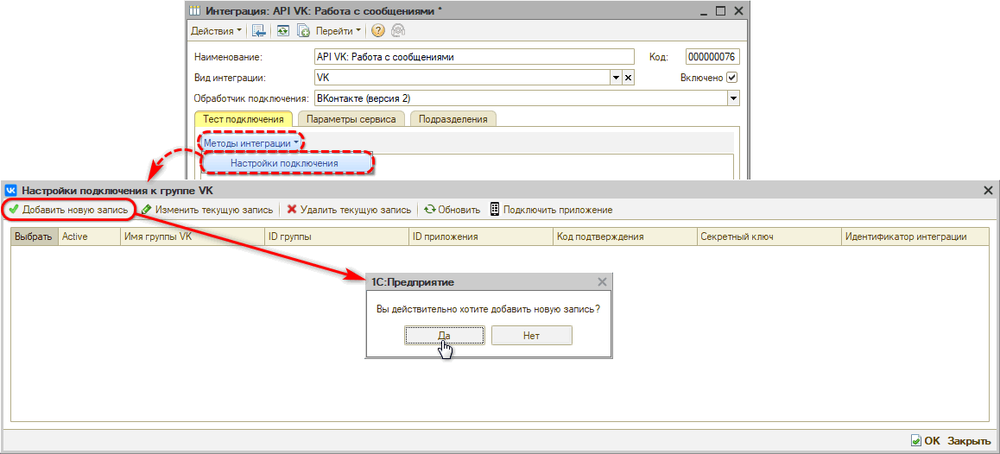

Для добавления новой записи требуется вставить скопированный ***ключ доступа**,* полученный в параметрах сообщества ВКонтакте (см. [выше](#2-получение-ключа-доступа)) и нажать кнопку “Создать”:

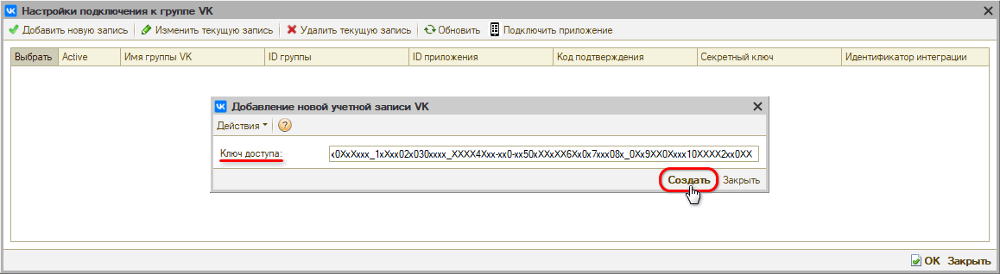

*Примечание:* После ввода в программе ключа доступа в настройках сообщества появляется выбор сервера: должен быть автоматически установлен сервер *“5S auto”* – см. ниже раздел “[Редактирование настройки](#5-редактирование-настройки)”.

В строке с добавленной настройкой следует установить галочку в колонке *“Выбрать”* – при этом выбранная строка подсвечивается зеленым цветом, и нажать *“Ок”:*

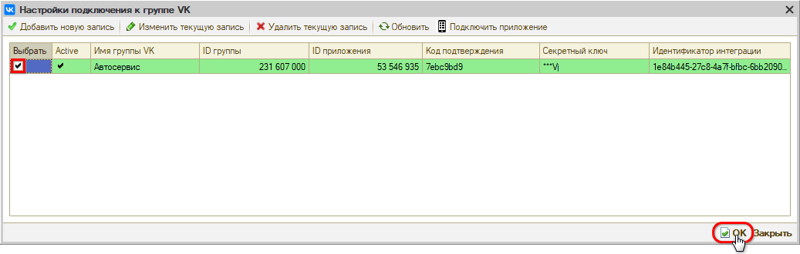

После закрытия окна выбора настройки подключения автоматически производится *тест подключения* – должно появиться сообщение *“Метод выполнен успешно”:*

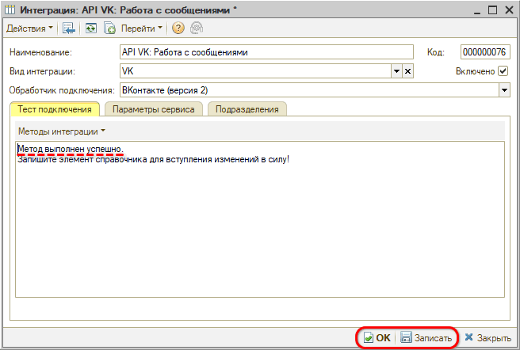

После того, как произведены все настройки, необходимо записать интеграцию нажатием кнопки ***“Записать”*** или ***“ОК”**.*

Затем следует перейти к подключению в сообщество приложения 5S Link – см. [ниже](#3-подключение-приложения-5s-link-в-сообщество).

У компании может быть создано несколько сообществ, например, по разным направлениям деятельности сервиса. Для каждого сообщества необходимо создать отдельный элемент справочника интеграции.

#### 5) Редактирование настройки

Настройки подключения при необходимости можно *редактировать* – например, в случае получения нового *ключа доступа* или изменения *секретного ключа.*

Для изменения учетной записи следует в таблице настроек выделить нужную строку, нажать кнопку *“Изменить текущую запись”* и подтвердить действие. Открывается окно *“Редактирование учетной записи VK”:*

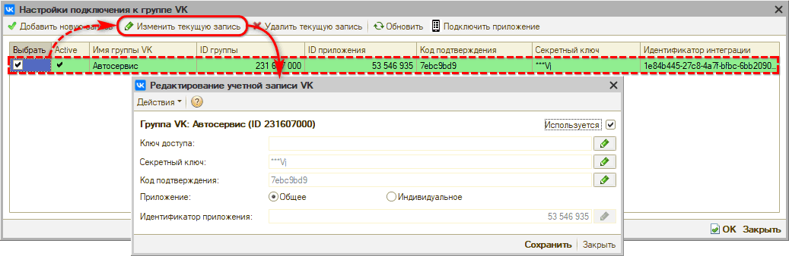

В данном окне следует ввести все измененные данные. *Ключ доступа* можно скопировать в настройках сообщества в разделе *“Работа с API → Ключи доступа”.* Для просмотра остальных параметров следует перейти на вкладку “Callback API” и переключиться на сервер “5S auto”:

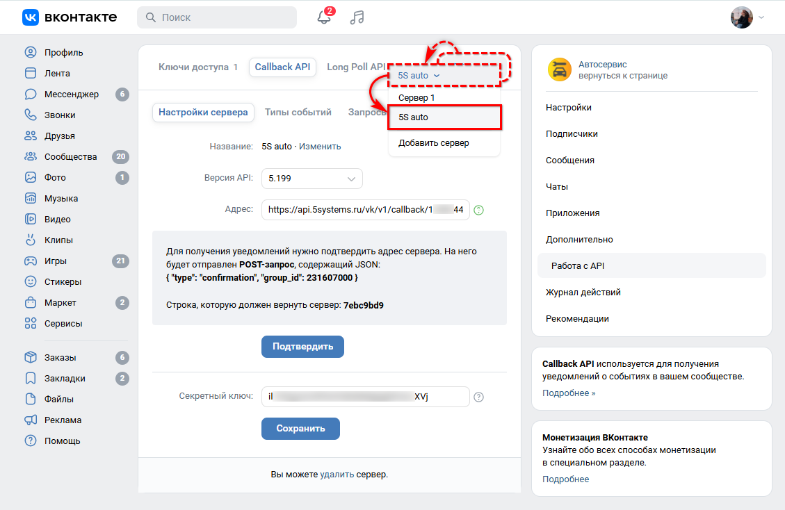

Рядом с параметром “Адрес” должен отображаться зеленый значок “Адрес подтвержден”, при нажатии кнопки “Подтвердить” не должно выходить сообщение об ошибке подключения:

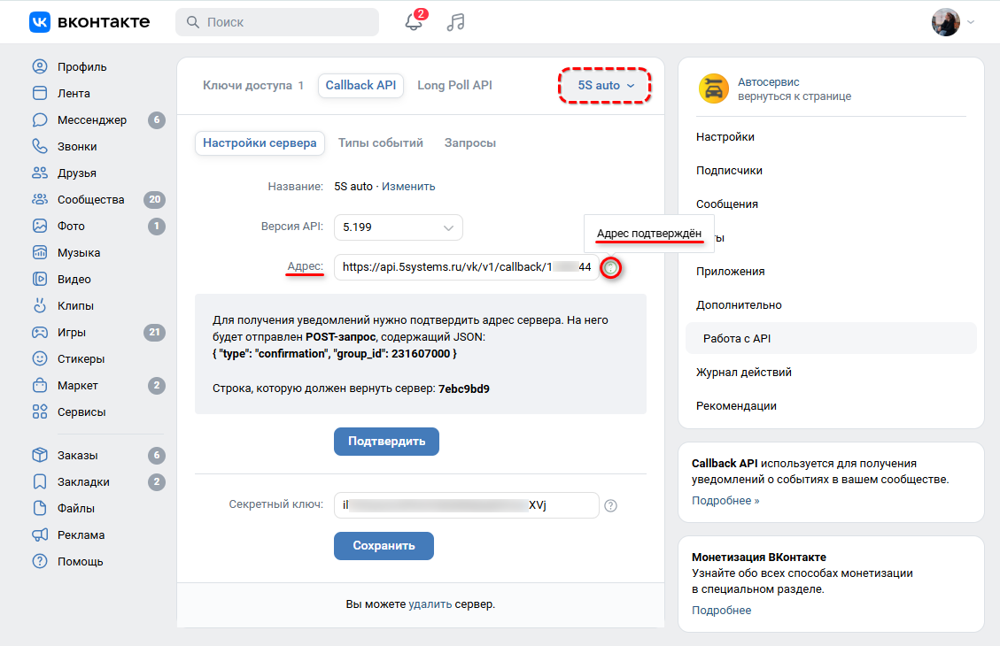

**Параметры:**

- *Секретный ключ* – значение параметра “Секретный ключ”. Следует предварительно задать значение ключа и сохранить. Секретный ключ может включать латинские буквы и цифры – всего до 50 символов. Он нужен для исключения подделки запросов. Секретный ключ не должен публиковаться в открытом доступе!
- *Код подтверждения* – значение параметра “Строка, которую должен вернуть сервер”.
- *Идентификатор приложения* – данный параметр требуется указывать при подключении приложения 5S Link с брендовым оформлением в стилистике компании (см. [статью](../Создание%20приложения%20компании%20в%20VK/sozdanie-prilozheniya-kompanii-v-vk.md)). В этом случае требуется в настройках подключения в программе в параметре "Приложение" переключить индикатор на “Индивидуальное” и ввести ID своего приложения VK.

  *Примечание:* Стандартное приложение 5S Link подключается автоматически при настройке интеграции, заполнять идентификатор не требуется.

Все изменения учетной записи необходимо *сохранить* и нажать кнопку *“ОК”* в окне выбора настройки подключения:

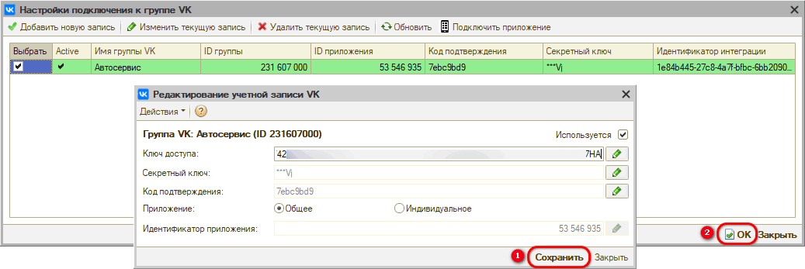

Также настройку подключения при необходимости можно *удалить* – для этого следует выделить в таблице нужную строку и нажать кнопку “Удалить текущую запись”.

### 3. Подключение приложения 5S Link в сообщество

#### 1) Получение ссылки в программе

Для подключения [веб-приложения 5S Link](https://www.5systems.ru/help/nastroyka-prilozheniya-5s-link-v2) в сообщество ВКонтакте первым делом требуется в настройках подключения к сообществу (см. [выше](#4-настройка-подключения)) нажать кнопку *“Подключить приложение”* – открывается окно *“Авторизация”:*

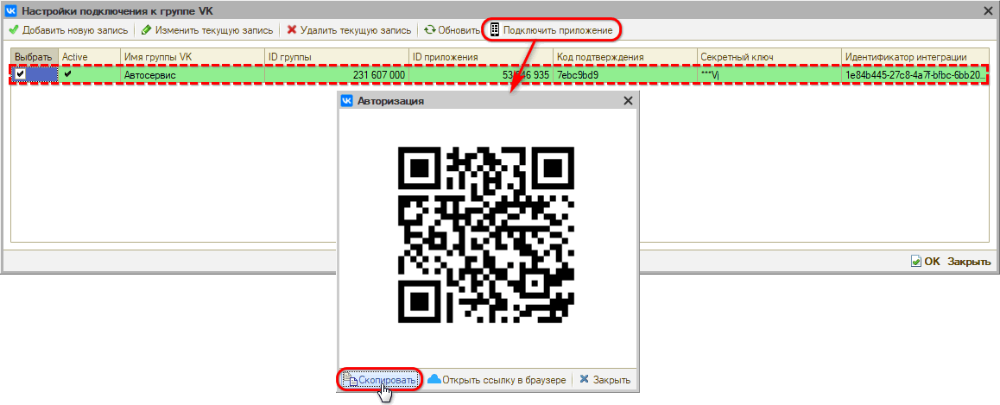

Следует скопировать ссылку нажатием на кнопку “Скопировать” и открыть ее в браузере.

#### 2) Добавление приложения в сообщество

Для настройки подключения в браузере должен быть выполнен вход на сайт “ВКонтакте” пользователем, который является администратором сообщества.

При переходе по ссылке, полученной на предыдущем шаге, открывается страница ВКонтакте с добавляемым приложением и списком сообществ, которыми управляет текущий пользователь.

Требуется выбрать нужное сообщество и нажать кнопку “Добавить”:

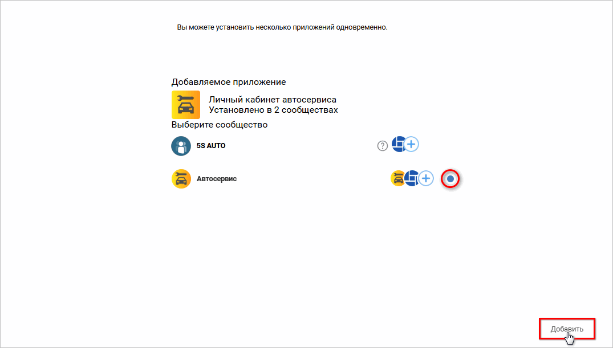

Выходит сообщение об успешном добавлении приложения "Личный кабинет автосервиса" в сообщество:

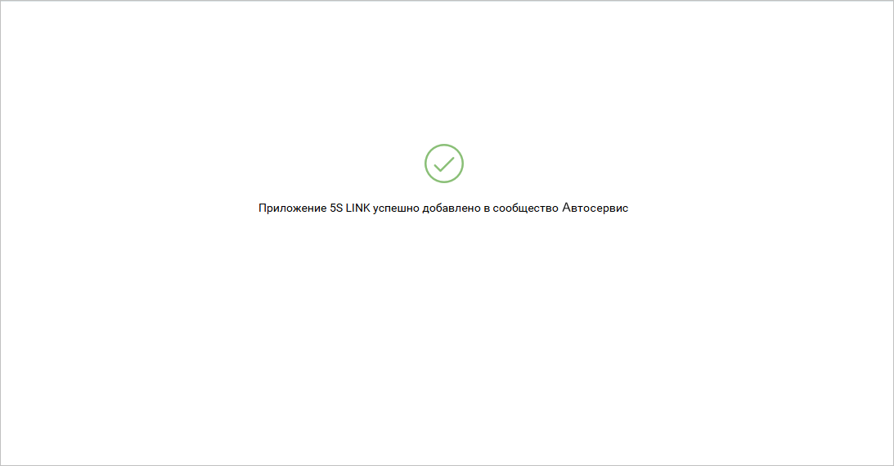

В меню сообщества при этом появляется кнопка открытия приложения:

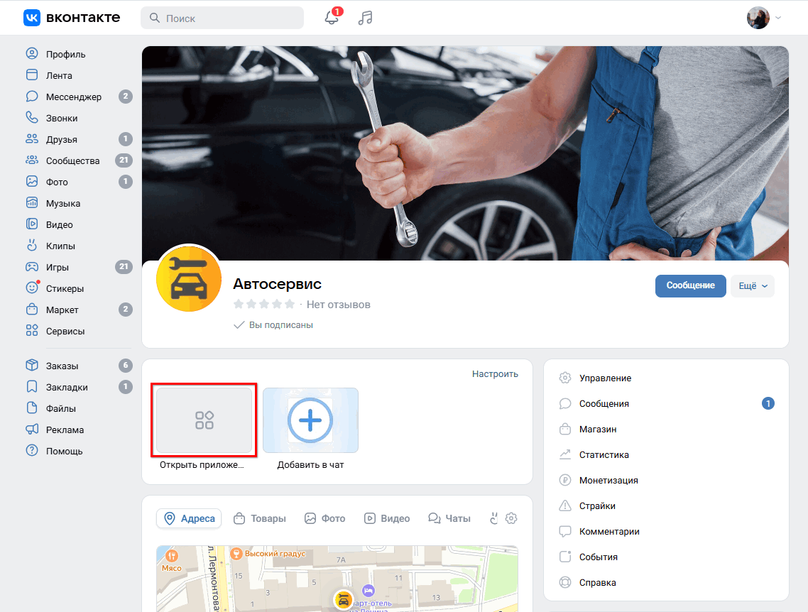

Для кнопки есть возможность добавить обложку через настройки пунктов меню – см. в статье “[Создание приложения компании VK](../Создание%20приложения%20компании%20в%20VK/sozdanie-prilozheniya-kompanii-v-vk.md#3-настройка-обложки-для-кнопки)”, а также [инструкцию](https://expert.vk.com/articles/kak-sdelat-menyu-soobschestva-vkontakte/?utm_source=vk&utm_medium=onboarding&utm_campaign=articles&utm_content=kak-sdelat-menyu-soobschestva-vkontakte) на сайте сервиса. *Скачать предлагаемую в примере статьи обложку можно по [ссылке](https://www.5systems.ru/sites/default/files/help/2025/%D0%9E%D0%B1%D0%BB%D0%BE%D0%B6%D0%BA%D0%B0_%D0%BF%D1%80%D0%B8%D0%BB%D0%BE%D0%B6%D0%B5%D0%BD%D0%B8%D1%8F_VK.zip).*

Также есть возможность добавить ссылку для перехода в ЛК веб-приложения в сообщениях, отправляемых через сообщество ВКонтакте. Для этого предварительно требуется подключить и настроить шаблоны сообщений – см. [ниже](#4-подключение-шаблонов-сообщений).

При переходе клиента по ссылке через кнопку в меню сообщества, в чате или в сообщении у него открывается приложение [5S Link](https://www.5systems.ru/help/nastroyka-prilozheniya-5s-link-v2). Далее клиенту необходимо пройти авторизацию по номеру телефона. Если клиент повторный, подтягивается информация по его автомобилям, истории обслуживания и т.д. – см. *[выше](#autoriz).*

Подробнее о приложении 5S Link см. [статью](https://www.5systems.ru/help/nastroyka-prilozheniya-5s-link-v2).

#### 4) Оформление приложения

По умолчанию приложение подключается в стандартном виде, без оформления. Есть возможность создать брендовое приложение, оформленное в фирменном стиле компании – см. статью “[Создание приложения компании в VK](../Создание%20приложения%20компании%20в%20VK/sozdanie-prilozheniya-kompanii-v-vk.md)”.

### 4. Подключение шаблонов сообщений

#### 1) Возможности

Есть возможность подключить и настроить шаблоны сообщений для отправки клиентам через сообщения сообщества ВКонтакте. Можно настроить кнопки со ссылками, ведущими на различные ресурсы – в приложение, на карту, страницу с отзывами и другие:

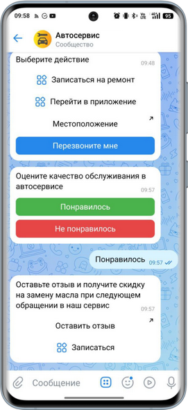

#### 2) Создание шаблона

Логика настройки отправки автоматических сообщений общая для конфигурации 5S AUTO (см. статьи [Шаблоны сообщений](../Шаблоны%20сообщений/shablony-soobscheniy.md), [Настройка автоматической отправки сообщений через мессенджеры](../Настройка%20автоматической%20отправки%20сообщений%20через%20мессенджеры/nastroyka-avtomaticheskoy-otpravki-soobscheniy-cherez-messendzhery.md)).

Для сообщества VK предусмотрены шаблоны специального вида, для них создана отдельная папка в справочнике.

Для добавления шаблона требуется создать новый элемент в группе справочника, выбрать вид шаблона “VK”:

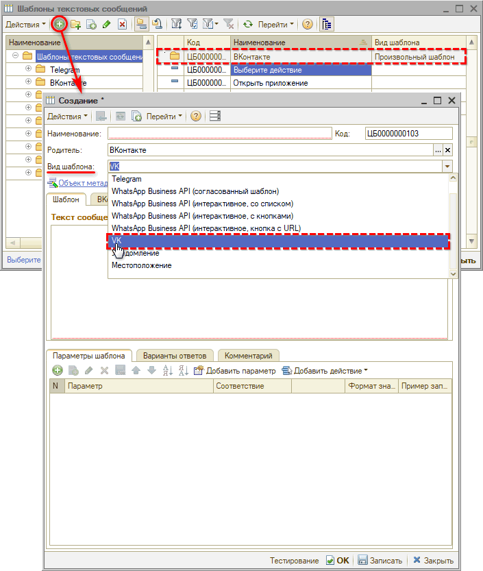

В случае использования разных шаблонов для переписки с клиентами в сообществе ВКонтакте рекомендуется понятно прописать наименование каждого шаблона, чтобы не путаться при выборе нужного шаблона при отправке сообщения из ленты.

На вкладке “Шаблон” требуется задать текст сообщения:

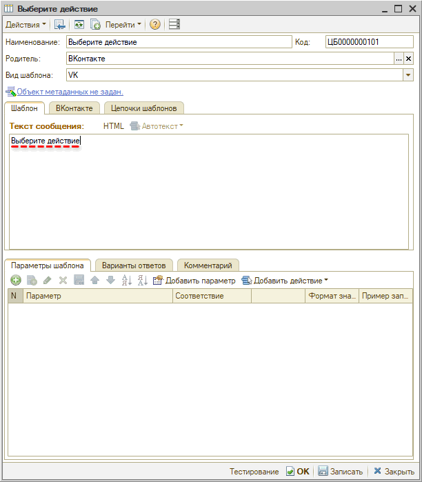

Есть возможность задать параметры шаблона для подстановки в текст сообщения данных о клиенте, документе и других – подробнее см. в [статье](../Шаблоны%20сообщений/shablony-soobscheniy.md).

#### 3) Настройка сообщений с кнопками

Для сообщений с кнопками необходимо на вкладке “ВКонтакте” установить отметку *“Показывать клавиатуру в поле сообщения”:*

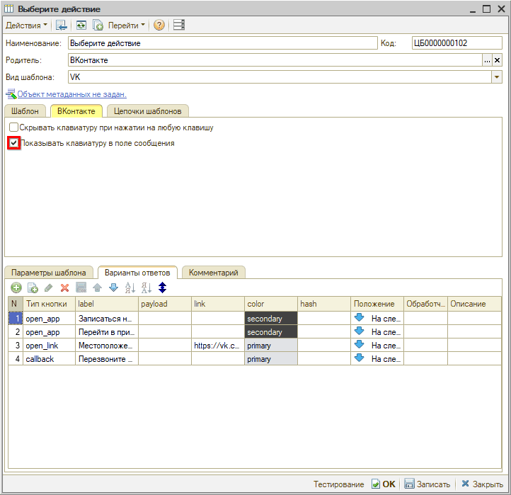

*Добавление кнопок* производится в нижней части формы настройки шаблона на вкладке *“Варианты ответов”:*

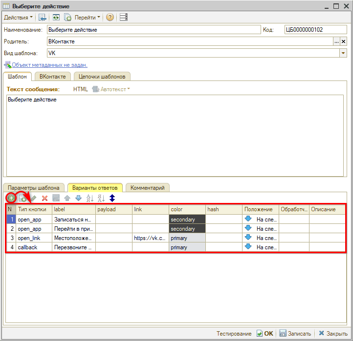

**1. Типы кнопок**

Реализованы следующие типы кнопок:

- *text* – текстовая кнопка, при нажатии клиентом которой в чат будет отправлено сообщение с текстом, написанным на кнопке;
- *open_app* – кнопка со ссылкой на [приложение 5S Link](#3-подключение-приложения-5s-link-в-сообщество);
- *open_link* – кнопка со ссылкой, для использования требуется в столбце *“link”* вставить ссылку, по которой требуется перенаправить клиента, например, на карту с местоположением филиала или на страницу с отзывами:

  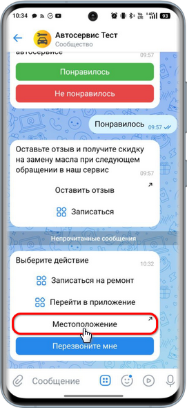 &nbsp;&nbsp;&nbsp; 

  Можно использовать ссылки на страницы сообщества ВКонтакте, а также на другие сайты.

- *calback* – кнопка может быть использована для настройки механизма обратного звонка с помощью специальных веб-хуков;
- *location* – есть возможность использования кнопки отправки клиентом в чат информации о своем местоположении;
- *vkpay* – в настоящее время не используется.

  Параметры “payload” и “hash” представляют собой служебные поля настройки, используются для встраивания в кнопку открытия приложения токена доступа или раздела приложения, который требуется открыть.

**2. Наименование кнопки**

В столбце *“label”* требуется задать *наименование* кнопки, которое будут видеть клиенты.

*Примечание:* Для некоторых типов кнопок, например, “location”, наименование устанавливается автоматически, без возможности задать произвольное наименование.

**3. Цвет кнопок**

Настройка цвета доступна *только для текстового типа кнопок.* Выбор цвета производится в ячейке столбца “color”:

*●   Основное действие (primary)* – синий;

*●   Обычная кнопка (secondary)* – белый;

*●   Согласиться / Подтвердить (positive)* – зеленый;

*●   Отклонить / Удалить (negative)* – красный.

Для остальных типов кнопок автоматически устанавливается стандартный прозрачный цвет.

**4. Расположение кнопок**

В столбце “Положение” есть возможность выбора варианта расположения кнопки относительно предыдущей кнопки:

*●   На следующей строке* – кнопка будет расположена под предыдущей кнопкой;

*●   В той же строке* – кнопка будет расположена справа от предыдущей кнопки.

Порядок расположения кнопок в сообщении можно изменить с помощью кнопок перемещения строк на панели управления:  .

После добавления кнопок шаблон следует *записать.*

### 4) Настройка заменяемости

На вкладке *“Цепочки шаблонов”* необходимо добавить строку с идентификатором шаблона и установить параметр *“Использовать для отправки из ленты”* в значение *“Да”:*

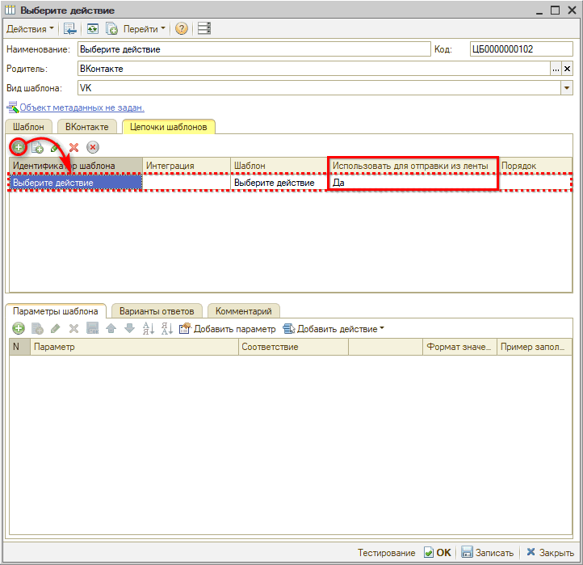

Подробнее см. в статьях *“[Шаблоны сообщений → Настройка заменяемости](../Шаблоны%20сообщений/shablony-soobscheniy.md#настройка-заменяемости)”* и *“[Лента событий → Использование шаблона для отправки сообщения](../../Работа%20с%20клиентами/Лента%20событий/lenta-sobytiy.md#использование-шаблона-для-отправки-сообщения)”.*

Созданный шаблон необходимо ***записать**,* затем его можно выбирать при отправке сообщения клиенту через [Ленту событий](../../Работа%20с%20клиентами/Лента%20событий/lenta-sobytiy.md#использование-шаблона-для-отправки-сообщения), а также есть возможность настроить [автоматическую отправку сообщений](../Настройка%20автоматической%20отправки%20сообщений%20через%20мессенджеры/nastroyka-avtomaticheskoy-otpravki-soobscheniy-cherez-messendzhery.md) по значимым событиям.

---

**Теги:** ВКонтакте, VK, интеграция, сообщество, чаты, мессенджеры, токен

