

# Контакт-центр 5S Chat

<table><tr><td><b>Время чтения:</b> 14 мин.</td><td><b>Обновлено:</b> 09.02.2026</td></tr></table>

Источник: https://www.5systems.ru/help/kontakt-centr-5s-chat

> *Функционал доступен начиная с **релиза 2.8.3** в рамках* ***комплексной** **подписки "[Контакт-центр 5S Chat](https://www.5systems.ru/services/kontakt-centr-5s-chat)"** (актуальные тарифы см. в [Каталоге услуг](https://www.5systems.ru/services?field_tags_target_id%5B21%5D=21&sort_by=created&sort_order=ASC))*

## Содержание

1. [Введение](#введение)
2. [Начало работы](#начало-работы)
   - [1. Подключение услуги](#1-подключение-услуги)
   - [2. Установка приложения](#2-установка-приложения)
      - [1) Для Android](#1-для-android)
      - [2) Для iOs](#2-для-ios)
      - [3) Для Web](#3-для-web)
   - [3. Вход в приложение](#3-вход-в-приложение)
3. [Возможности](#возможности)
   - [1. Пространства и комнаты](#1-пространства-и-комнаты)
   - [2. Переписка в комнате](#2-переписка-в-комнате)
   - [3. Интеграция с CRM](#3-интеграция-с-crm)
      - [1) Наименование чата](#1-наименование-чата)
      - [2) Список участников](#2-список-участников)
      - [3) Архивирование комнаты](#3-архивирование-комнаты)
      - [4) Отметка о прочтении](#4-отметка-о-прочтении)
   - [4. Внутренние чаты компании](#4-внутренние-чаты-компании)
   - [5. Обмен файлами](#5-обмен-файлами)
4. [Настройки в программе](#настройки-в-программе)
5. [Технология Matrix](#технология-matrix)

## Введение

**Контакт-центр 5S Chat** – это приложение для пользователей 5S AUTO, представляющее собой *мультиканальный мессенджер* для взаимодействия с *текущими чатами.*

Существуют следующие *способы подключения к сервису:*

**1)** *с телефона:*

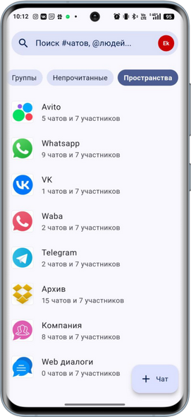

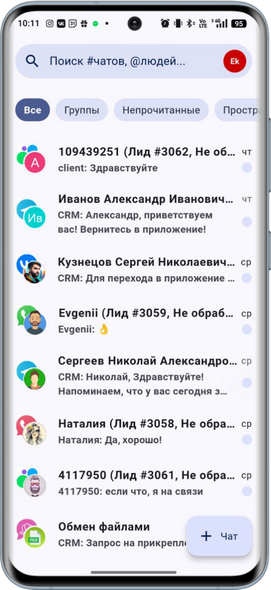

**2)** *с компьютера через браузер:*

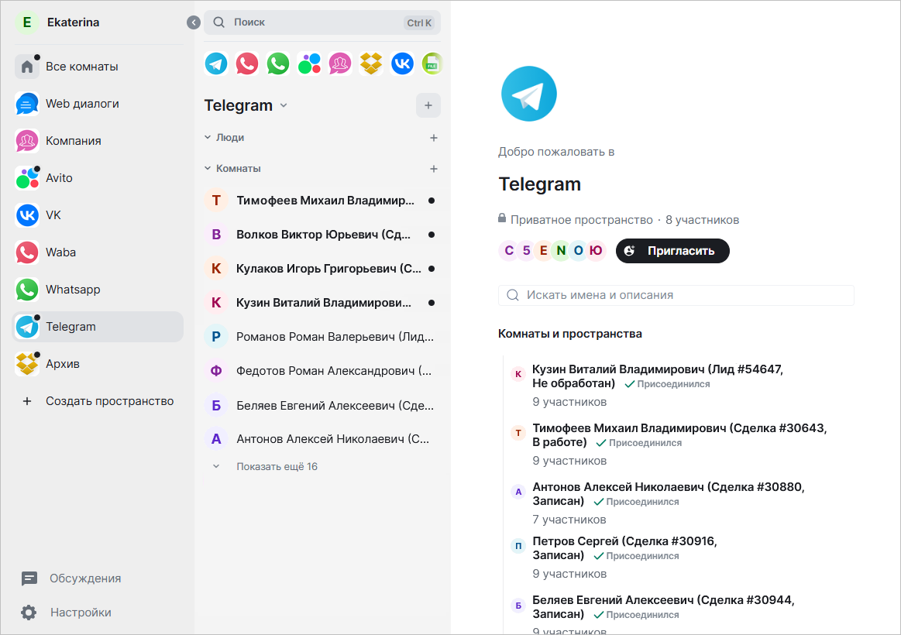

**3)** *с компьютера через установленное приложение.*

Сообщения, написанные в чате, автоматически отправляются клиенту через подключенную интеграцию с мессенджером, в котором идет общение. И наоборот, полученные от клиента сообщения отображаются в чате.

Список чатов, статусы сообщений, список участников синхронизированы с данными 5S AUTO – вся переписка также отображается в чатах в программе.

## Начало работы

### 1. Подключение услуги

Сервис 5S Chat доступен клиентам 5SYSTEMS после его подключения через отдел продаж. Услуга оплачивается по отдельному тарифу – см. [актуальные расценки](https://www.5systems.ru/services/kontakt-centr-5s-chat) на сайте.

### 2. Установка приложения

Приложение разработано на основе протокола [Matrix](https://matrix.org) – см. описание в разделе *[ниже](#технология-matrix).*

Работа с контакт-центром 5S Chat осуществляется через любой совместимый клиент. Такими клиентами, например, являются:

**1.** [Клиент для Android](https://play.google.com/store/apps/details?id=com.fivesystems.fluffychat) на базе [FluffyChat](https://fluffychat.im/);

**2.** [Клиент для iOs](https://apps.apple.com/ru/app/element-messenger/id1083446067) на базе [Element.io](http://element.io);

**3.** [Клиент для Web](https://element.5systems.ru/) на базе [Element.io](http://element.io).

В случае работы с контакт-центром с телефона первым делом требуется установить приложение “5S Chat”.

В случае работы с компьютерной версией 5S Chat через браузер установка приложения на устройство не требуется.

#### 1) Для Android

Для работы с контакт-центром со смартфона на Android скачать специальное приложение для клиентов компании 5SYSTEMS “5S Chat” можно с Google Play по [ссылке](https://play.google.com/store/apps/details?id=com.fivesystems.fluffychat).

После установки можно будет заходить в приложение через ярлык на рабочем столе устройства:

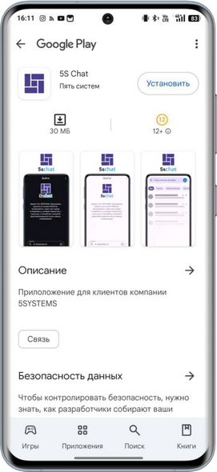

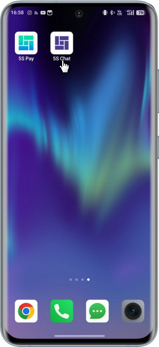

#### 2) Для iOs

Для работы с контакт-центром с iPhone скачать приложение 5S Chat на базе [Element.io](http://element.io) можно на App Store по ссылке: [https://apps.apple.com/ru/app/element-messenger/id1083446067](https://apps.apple.com/ru/app/element-messenger/id1083446067).

При авторизации потребуется указать сервер *m.5systems.ru.*

#### 3) Для Web

Открыть веб-приложение 5S Chat в браузере компьютера можно по [ссылке](https://element.5systems.ru/).

### 3. Вход в приложение

Войти в 5S Chat можно с телефона через установленное приложение (см. [выше](#1-для-android)), либо с компьютера через браузер, открыв страницу [https://element.5systems.ru/](https://element.5systems.ru/).

Далее требуется авторизация через сервер *m.5systems.ru* под учетной записью [5S Cloud](https://www.5systems.ru/help/sozdanie-i-redaktirovanie-polzovateley-5s-cloud) – следует нажать кнопку “Продолжить”:

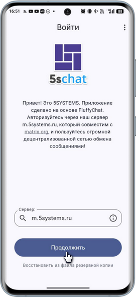

Затем ввести учетные данные [пользователя 5S Cloud](https://www.5systems.ru/help/sozdanie-i-redaktirovanie-polzovateley-5s-cloud) – имя и пароль:

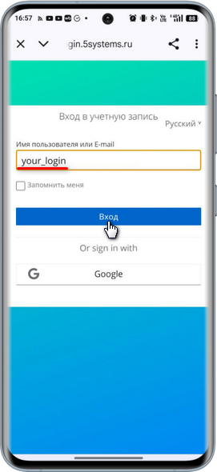

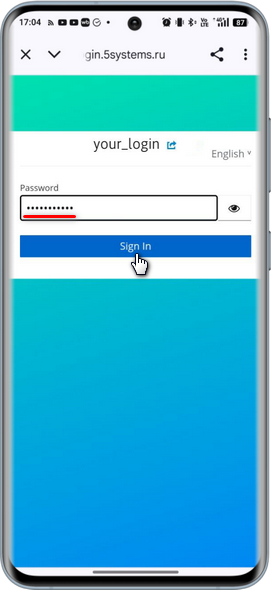

Далее происходит переход к авторизации на сервере Matrix – следует нажать *“Продолжить” (“Continue”):*

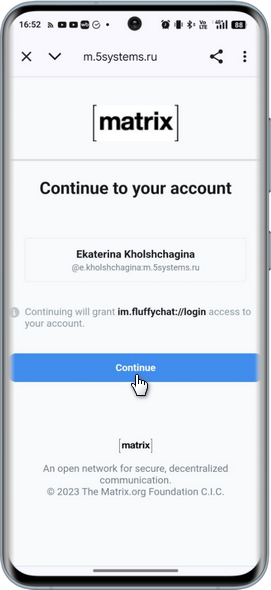

После успешной авторизации открывается главная страница приложения 5S Chat со всеми чатами:

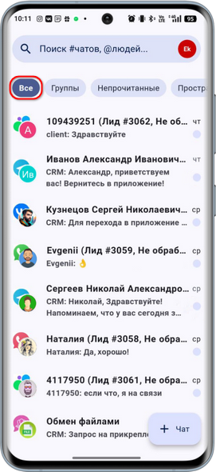

## Возможности

### 1. Пространства и комнаты

Чаты в контакт-центре сгруппированы в *“пространства”* и *“комнаты”.*

Пространства представляют собой каналы переписки – MAX, ВКонтакте, Telegram и т.д., также внутренний чат компании, Web-диалоги и архив:

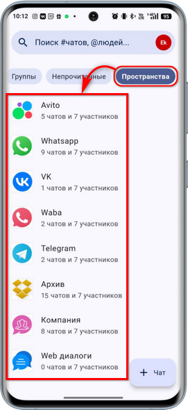

При переходе в определенное пространство отображаются комнаты – т.е. все чаты по данному каналу переписки:

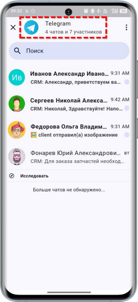

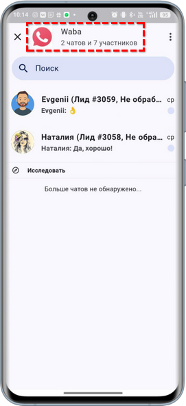

Наименование комнаты формируется по принципу: *Имя клиента (Сделка #<номер сделки> + Статус сделки)* – см. [ниже](#1-наименование-чата).

### 2. Переписка в комнате

Через комнату происходит переписка с клиентом:

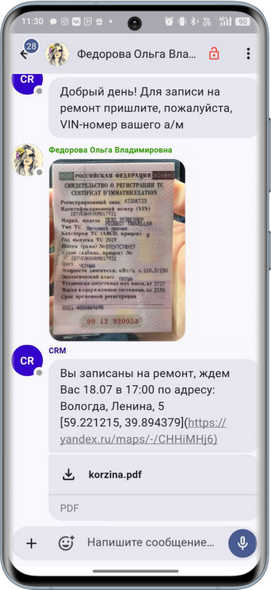

Есть возможность отправлять в переписке ссылки, изображения, видео, документы и прочие файлы (в случае если мессенджер поддерживает такой тип сообщений).

Для отправки файлов через 5S Chat следует нажать на кнопку “+” на нижней панели и выбрать нужный пункт выпадающего меню:

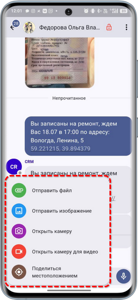

### 3. Интеграция с CRM

При входе пользователя в приложение на главной странице у него отображаются только *актуальные* комнаты, т.е. чаты только по *сделкам,* находящемся *в работе.*

#### 1) Наименование чата

Наименование комнаты, т.е. чата, строится следующим образом:

***Имя клиента (Сделка #<номер сделки> + Статус сделки)***

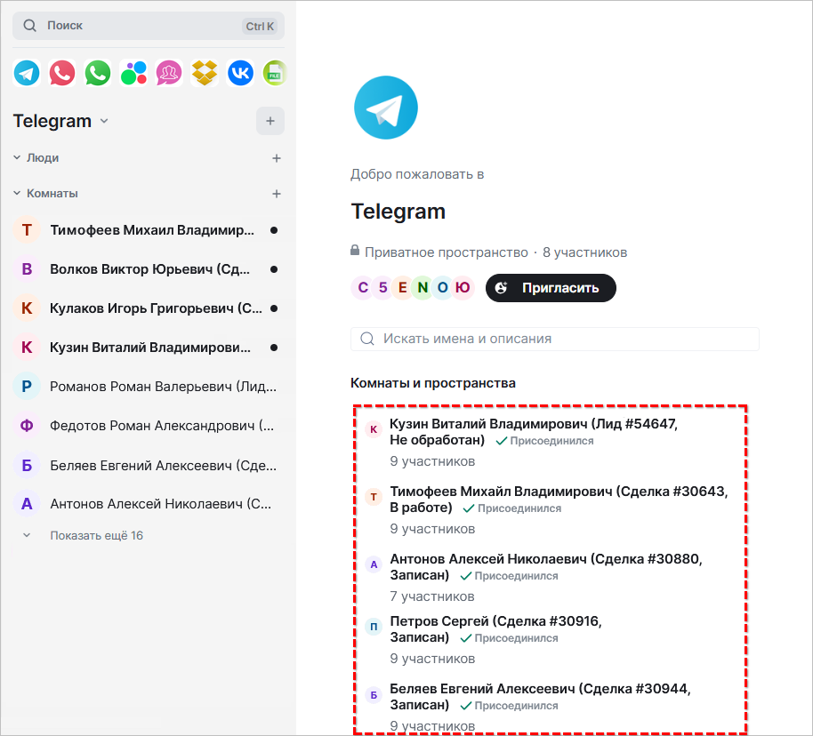

Данные подтягиваются из сделки в программе. Событие срабатывает при смене этапа сделки, а также при смене контрагента в сделке – например, при идентификации повторного клиента в сделке подтягиваются его полные ФИО из карточки контрагента в программе.

#### 2) Список участников

В число участников чата (“Людей” в “Комнате”) включается *ответственный по сделке,* а также другие пользователи. Логика определения списка участников зависит от *подразделения* сделки и настроек *[сведений адресации](https://www.5systems.ru/help/adresaciya-zadach-v-crm-po-ispolnitelyam).*

Например, в чат включаются все пользователи с должностью “Оператор кол-центра”, принадлежащие к подразделению сделки.

Другие пользователи – не являющиеся ответственными и не входящие в данное подразделение, – не будут видеть новый чат.

При изменении  ответственного или подразделения меняется список участников.

#### 3) Архивирование комнаты

При закрытии сделки, а также при отсутствии новых сообщений в чате в течение 14 дней комната автоматически перемещается в *архив:*

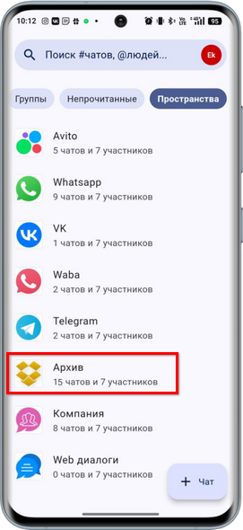

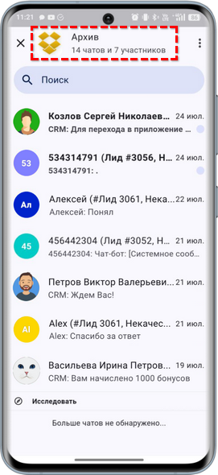

В случае если клиент повторно напишет в чат, произойдет восстановление комнаты из архива.

#### 4) Отметка о прочтении

Отметка о прочтении сообщения в чате сотрудником через приложение попадает в 5S AUTO, и наоборот, при прочтении сообщения сотрудником в программе отметка также передается в 5S Chat.

### 4. Внутренние чаты компании

Отдельное пространство *“Компания”* позволяет вести переписку в общем чате для сотрудников компании, создавать новые внутренние чаты, а также обмениваться файлами:

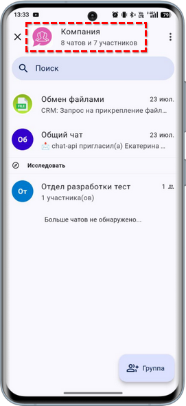

Есть возможность создавать новые комнаты для общения сотрудников компании *(функционал в разработке!):*

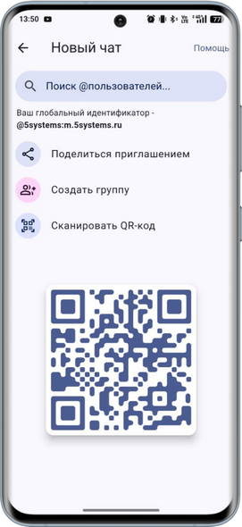

### 5. Обмен файлами

В переписках с клиентами у сотрудников есть возможность обмениваться вложениями – файлами фото, видео, сканов документов и т.д.

Все вложения в переписках с клиентами через 5S Chat попадает на облако 5SYSTEMS.

У каждой компании-клиента 5SYSTEMS есть свой лимит дискового пространства в облаке по умолчанию. При заполнении лимита происходит ротация файлов – старые файлы удаляются из памяти, освобождая место для новых. В случае необходимости есть возможность приобрести  больший объем.

Для отправки вложений используется комната *“Обмен файлами”* в пространстве *“Компания”.*

Мастер отправляет из программы запрос на прикрепление файла к документу:

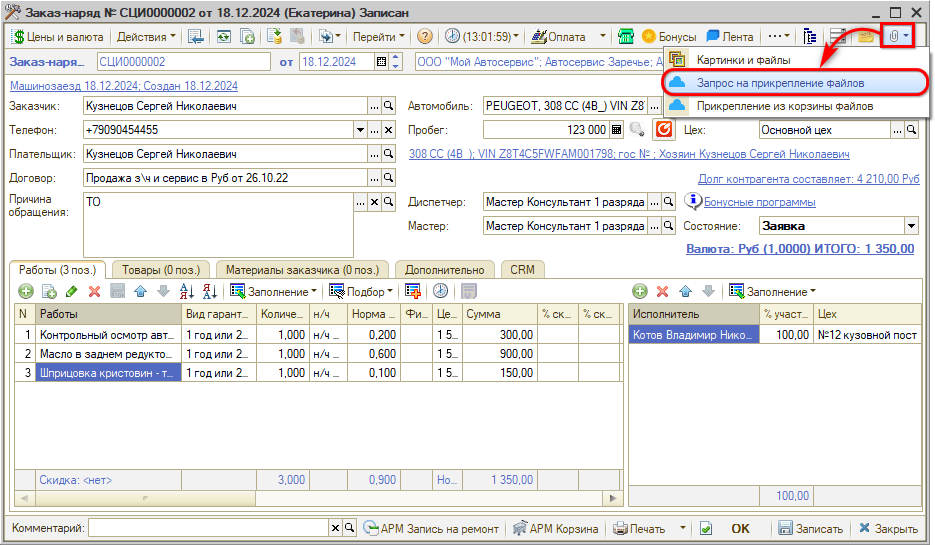

Участники комнаты “Обмен файлами” в 5S Chat отправляют в чат изображение:

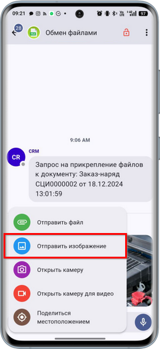

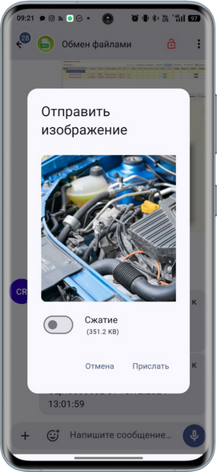

Отправленное изображение сохраняется в облачном хранилище файлов. Для прикрепления к документу в программе следует нажать кнопку *“Открыть картинки и файлы → Прикрепление из корзины файлов”.* В таблице необходимо выбрать и выделить нужную картинку и нажать кнопку *“Прикрепить”:*

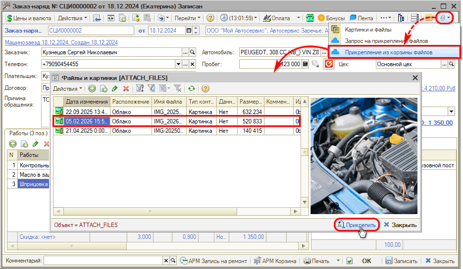

При этом файл прикрепляется к текущему документу и переносится в таблицу “Файлы и картинки”:

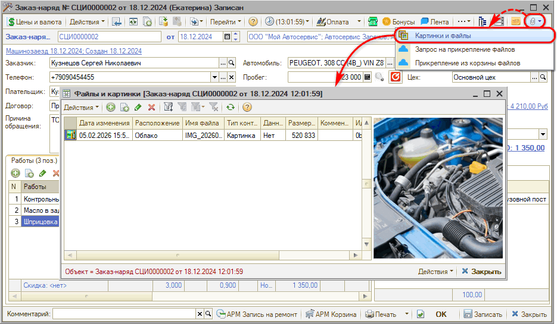

Прикрепленный к документу файл можно отправить клиенту через [Ленту событий](../../Работа%20с%20клиентами/Лента%20событий/lenta-sobytiy.md):

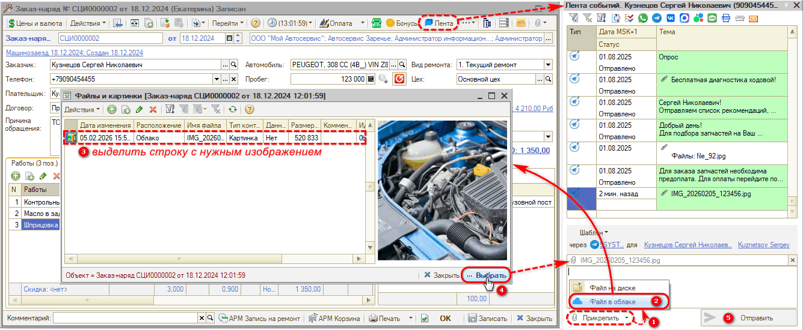

## Настройки в программе

1. **Настройка интеграции с API 5S AUTO**

   Для работы с 5S Chat предварительно в программе должна быть настроена интеграция с [API 5S AUTO](https://www.5systems.ru/help/api-5s-auto).

2. **Настройка пользователя 5S Cloud**

   Для доступа в приложение потребуется ввести логин и пароль пользователя [5S Cloud](https://www.5systems.ru/help/sozdanie-i-redaktirovanie-polzovateley-5s-cloud).

3. **Настройка интеграции с каналами связи**

   Для использования разных каналов связи – [MAX](../Интеграция%20с%20мессенджером%20MAX/integraciya-s-messendzherom-max.md), [пользовательский MAX](../Интеграция%20с%20пользовательским%20MAX/integraciya-s-polzovatelskim-max.md), [ВКонтакте](../Интеграция%20с%20сообществом%20ВКонтакте%20%28VK%29/integraciya-s-soobschestvom-vkontakte-vk.md), [Telegram](../Интеграция%20с%20Telegram/integraciya-s-telegram.md), [WABA](../WhatsApp/Настройка%20интеграции%20с%20WhatsApp%20Business%20API%20%28WABA%29/nastroyki-integracii-s-whatsapp-business-api.md), [WhatsApp](../WhatsApp/Настройка%20интеграции%20с%20WhatsApp/nastroyka-integracii-s-whatsapp.md), [Авито](../Интеграция%20с%20мессенджером%20Авито/integraciya-s-messendzherom-avito.md) и т.д. – требуется предварительно настроить интеграцию с ними.

## Технология Matrix

Приложение 5S Chat разработано на основе [Matrix](https://matrix.org) – открытого протокола мгновенного обмена сообщениями и файлами. Это децентрализованный клиент-серверный протокол с передачей сообщений между серверами.

Клиентские приложения для обмена сообщениями [FluffyChat](https://fluffychat.im/) и [Element.io](https://element.io/), на основе которых сделан 5S Chat, работают по данному протоколу.

Возможны *способы входа* в приложение через любой из совместимых клиентов:

1. Через [Element.io](https://element.io/):

   **1)** для Web – открыть веб-приложение 5S Chat можно по [ссылке](https://element.5systems.ru/);

   **2)** для Android – скачать приложение 5S Chat для клиентов компании 5SYSTEMS на Google Play можно по ссылке: [https://play.google.com/store/apps/details?id=im.vector.app](https://play.google.com/store/apps/details?id=im.vector.app).

   При авторизации потребуется указать сервер m.5systems.ru.

   **3)** для iOs – для работы с контакт-центром с iPhone скачать приложение 5S Chat на App Store можно по ссылке: [https://apps.apple.com/ru/app/element-messenger/id1083446067](https://apps.apple.com/ru/app/element-messenger/id1083446067)

   При авторизации потребуется указать сервер m.5systems.ru.

   **4)** для Windows – скачать приложение для установки на компьютер с Windows можно на сайте [https://element.io/app](https://element.io/app);

   **5)** для Mac – скачать приложение для установки на компьютер Mac можно на сайте [https://element.io/app](https://element.io/app).

2. Через [FluffyChat](https://fluffychat.im/) – для телефона на Android.

   *Скачать* приложение 5S Chat для клиентов компании 5SYSTEMS на Google Play можно по *[ссылке](https://play.google.com/store/apps/details?id=com.fivesystems.fluffychat).*

Далее при любом способе входа требуется авторизация через сервер *m.5systems.ru* под учетной записью 5S Cloud – см. [выше](#3-вход-в-приложение).

Для работы с 5S Chat в 5S AUTO предварительно должен быть сделан ряд настроек в программе – см. [выше](#настройки-в-программе).

---

**Теги:** 5S Chat, контакт-центр, чаты, операторы, мессенджеры

