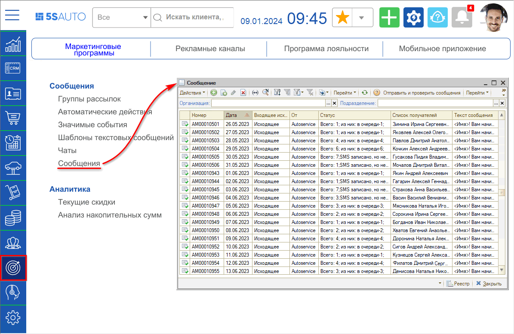
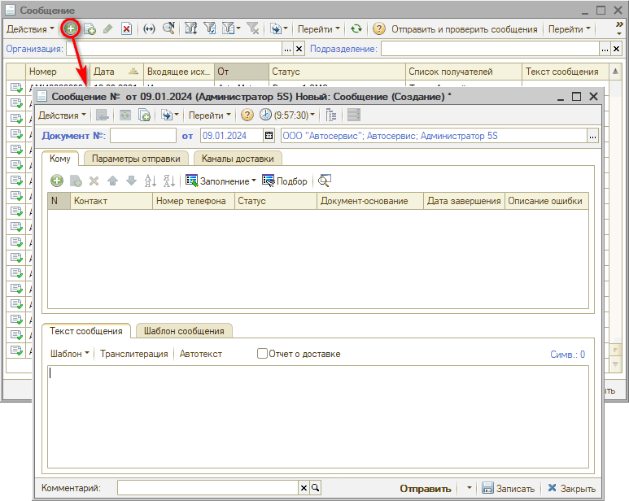
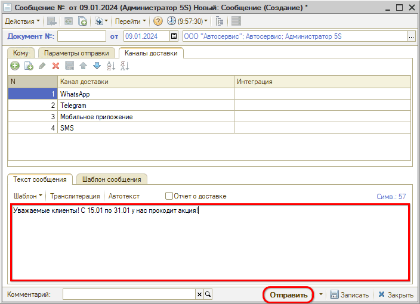
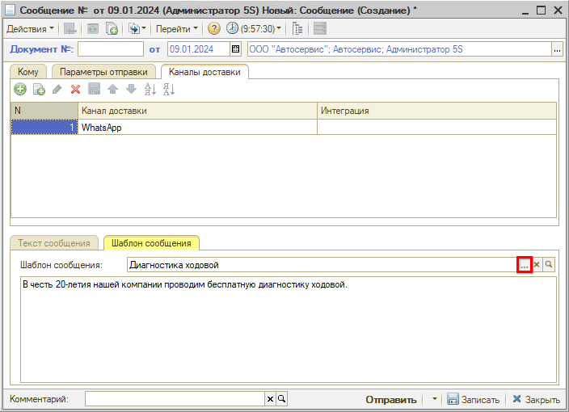
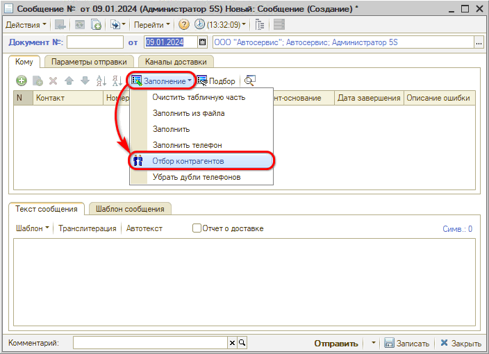
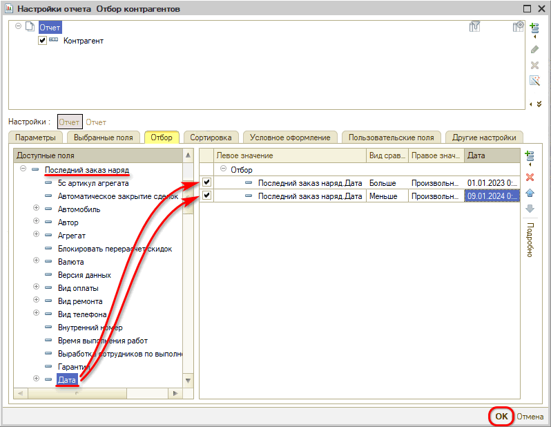
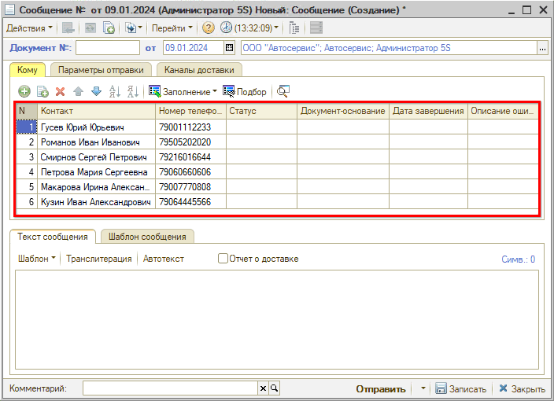
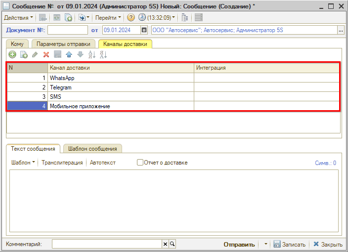
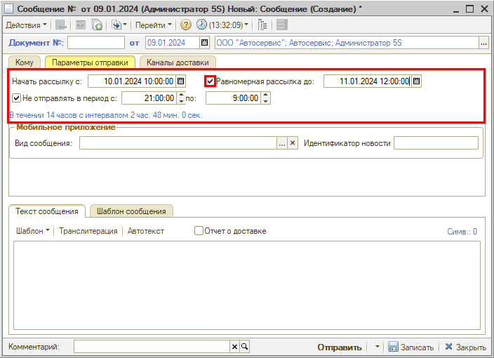

# Массовая рассылка сообщений по выборке клиентов

<table><tr><td><b>Время чтения:</b> 13 мин.</td><td><b>Обновлено:</b> 09.01.2024</td></tr></table>

Источник: https://www.5systems.ru/help/massovaya-rassylka-soobscheniy-po-vyborke-klientov

## Содержание

1. [Введение](#введение)
2. [Массовая рассылка сообщений по выборке клиентов](#массовая-рассылка-сообщений-по-выборке-клиентов)
   - [Создание рассылки](#создание-рассылки)
   - [Выборка клиентов](#выборка-клиентов)
   - [Настройка каналов доставки](#настройка-каналов-доставки)
   - [Параметры отправки](#параметры-отправки)

## Введение

Для реализации маркетинговых кампаний по рассылке предложений клиентам в программе предусмотрен специальный механизм. Данный механизм позволяет отправлять сообщения через push-сообщения в мобильном приложении, мессенджеры, SMS с выборкой клиентов по различным параметрам.

## Массовая рассылка сообщений по выборке клиентов

### Создание рассылки

Чтобы создать рассылку перейдите в меню программы: *Маркетинг → Маркетинговые программы → Сообщения → Сообщения* или через типовое меню *Документы → Сообщения → Сообщение:*

Создайте новый элемент:

Настройте рассылку сообщения:

1. Укажите адресатов – можно добавить записи вручную или воспользоваться [*отбором*](#выборка-клиентов).
2. Выберите *[каналы](#настройка-каналов-доставки) доставки*.
3. При необходимости задайте [*параметры отправки*](#параметры-отправки).
4. Напишите текст сообщения и нажмите кнопку "Отправить":  
   

*Примечание:* При рассылке через WABA необходимо также настроить специальный *шаблон сообщения*. Если с клиентами не начат диалог, то рассылать можно только *подтвержденный шаблон* сообщения. В случае массовой рассылки с большей вероятностью диалог не начат, поэтому нужно создать шаблон, дождаться его подтверждения и после этого выбрать его на соответствующей вкладке:

Подробнее см. статью *[Настройка шаблонов WhatsApp Business API](../Настройка%20шаблонов%20WhatsApp%20Business%20API/nastroyka-shablonov-whatsapp-business-api.md).*

### Выборка клиентов

В программе реализована выборка клиентов для рассылки по данным из отчета "Отбор контрагентов". Для того, чтобы сформировать данную выборку:

1. Перейдите в меню "Заполнение → Отбор контрагентов":  
   
2. В окне с настройками отчета укажите параметры отбора (см. примеры в статье [*Отчет "Отбор по контрагентам"*](https://5systems.ru/help/otchet-otbor-po-kontragentam)) и нажмите кнопку "ОК":  
   

В результате в таблицу на вкладке "Кому" будет выведен список клиентов, удовлетворяющих параметрам отбора:

### Настройка каналов доставки

На вкладке "Каналы доставки" обязательно укажите, куда отправлять сообщения:

Если указано несколько мессенджеров, то логика отправки сообщений следующая:

1. Система пытается отправить сообщение на канал доставки №1 (в приведенном примере – WhatsApp). 
   Если сообщение отправлено и клиент прочитал его, то на другие каналы сообщение не отправляется.
2. Если сообщение не отправлено или клиент не прочитал его в течение 10 минут, то система отправляет сообщение на канал доставки №2 (в приведенном примере – Telegram). 
   Если сообщение отправлено и клиент прочитал его, то на другие каналы сообщение не отправляется.
3. Если сообщение не отправлено или клиент не прочитал его в течение 10 минут, то система отправляет сообщение на канал доставки №3 (в приведенном примере – SMS).

***Обратите внимание!*** Для отправки сообщений через указанные каналы доставки должна быть настроена интеграция с ними в программе.

### Параметры отправки

***Описание параметров:***

| Параметр | Описание |
| --- | --- |
| **Начать рассылку с** | Дата и время, когда начнется рассылка |
| **Не отправлять в период с** | При включенной опции устанавливается интервал времени, когда не следует производить рассылку. По умолчанию устанавливается время с 21:00 до 9:00. Настройка необходима, чтобы не беспокоить людей в ночное время. |
| **Равномерная рассылка до** | При включенной опции рассылка происходит равномерно в пределах указанного интервала времени: с *Начать рассылку с* до *Равномерная рассылка до*, учитывая время, в которое указано не отправлять сообщения в параметре *Не отправлять в период с*. Необходимо, когда рассылка планируется на большое количество клиентов, чтобы: - исключить пиковую нагрузку на операторов колл-центров при звонках клиентов, отреагировавших на предложение из рассылки, - не допустить блокировку от WhatsApp или SMSC, которые могут идентифицировать рассылку как спам. |

---

**Теги:** массовая рассылка, выборка клиентов, шаблоны сообщений, мессенджеры, sms, рассылка

