# Настройка автоматической отправки сообщений через мессенджеры

<table><tr><td><b>Время чтения:</b> 14 мин.</td><td><b>Обновлено:</b> 16.09.2026</td></tr></table>

Источник: https://www.5systems.ru/help/nastroyka-avtomaticheskoy-otpravki-soobscheniy-cherez-messendzhery

## Содержание

1. [Введение](#введение)
2. [Настройка значимого события](#настройка-значимого-события)
3. [Настройка действия для отправки сообщения](#настройка-действия-для-отправки-сообщения)
4. [Список всех отправленных сообщений](#список-всех-отправленных-сообщений)

## Введение

В 1С предусмотрен типовой механизм обработки значимых событий по различным объектам конфигурации: документы, справочники и т.п. При возникновении настроенного события и исполнения условий, наложенных на объект, могут быть выполнены различные действия: создание объектов, напоминания, отправка электронного письма и т.д.

В 5S AUTO помимо этого реализовано действие по отправке сообщений через мессенджеры. В рамках данной статьи рассмотрим настройку нового действия. Для примера возьмем такой случай: как только автомобиль клиента в автосервисе готов к выдаче, будем автоматически отправлять клиенту сообщение о том, что автомобиль готов.

## Настройка значимого события

Перейдем в справочник "Значимые события" – *Администрирование → Компания → CRM → Значимые события* (или через типовое меню: *CRM → Сообщения → Значимые события):*

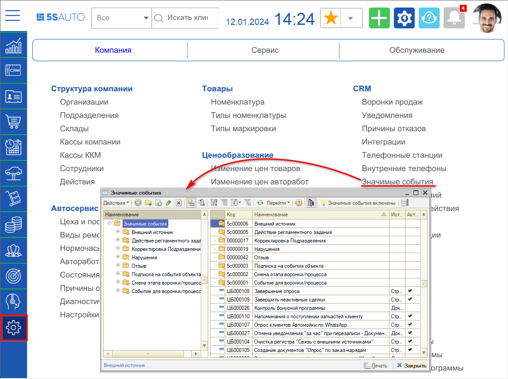

Создадим новую запись:

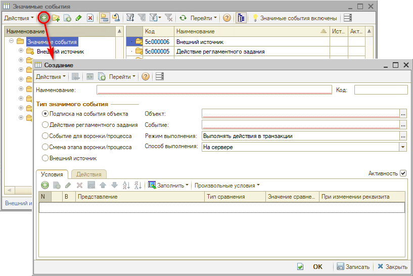

Считаем, что автомобиль готов к выдаче, если после проведения документа "Заказ-наряд" состояние документа стало "Выполнен". Поэтому:

1. пишем наименование события "Автомобиль готов",
2. в качестве источника выбираем документ "Заказ-наряд",
3. в качестве события выбираем "После проведения",
4. устанавливаем режим "В случае исключения продолжать выполнение": 
   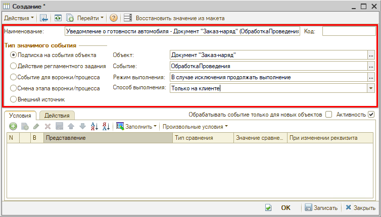

В качестве условия укажем, что состояние документа должно быть равно значению "Выполнен". Для этого добавим условие:

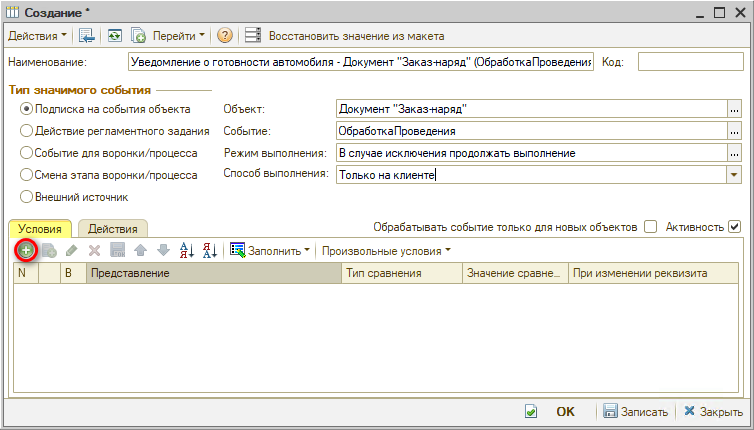

В появившейся строке с условием в качестве представления укажем поле "Состояние заказ-наряда":

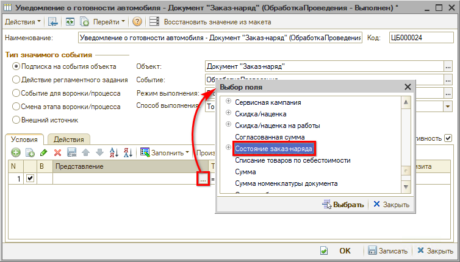

В качестве значения сравнения выберем состояние "Выполнен":

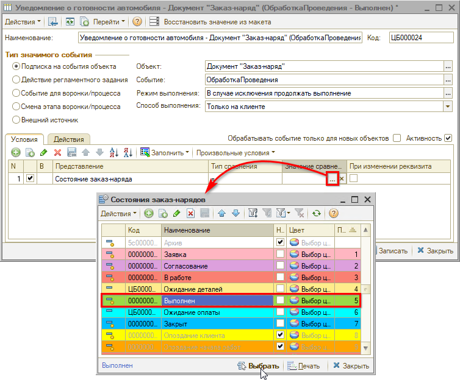

Установим флажок "При изменении реквизита":

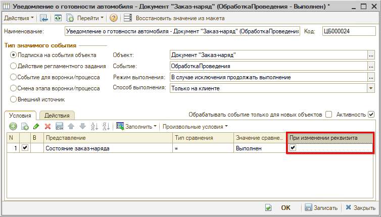

На данном этапе заполнены все основные параметры и заданы условия для возникновения события. Теперь необходимо сохранить изменения, нажав на кнопку "Записать", и перейти к настройке самого действия.

## Настройка действия для отправки сообщения

Перейдем на вкладку "Действия" и создадим действие:

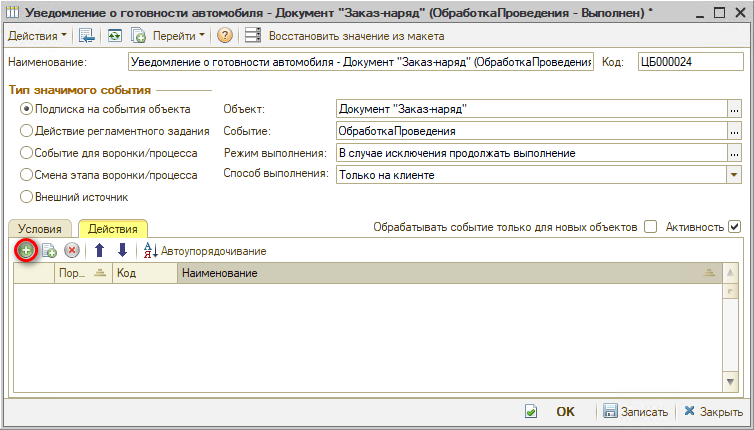

На форме создания выберем действие "Отправить сообщение" и заполним наименование:

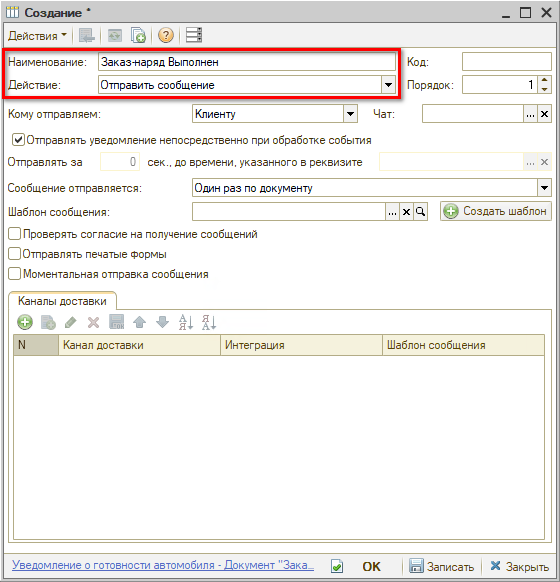

Зададим шаблон сообщения, на основе которого будет формироваться текст сообщения. Можно создать шаблон заранее и выбрать его, а можно создать шаблон непосредственно из формы создания действия (как настроить шаблон см. *[Шаблоны сообщений](../Шаблоны%20сообщений/shablony-soobscheniy.md)*). Выберем уже преднастроенный шаблон:

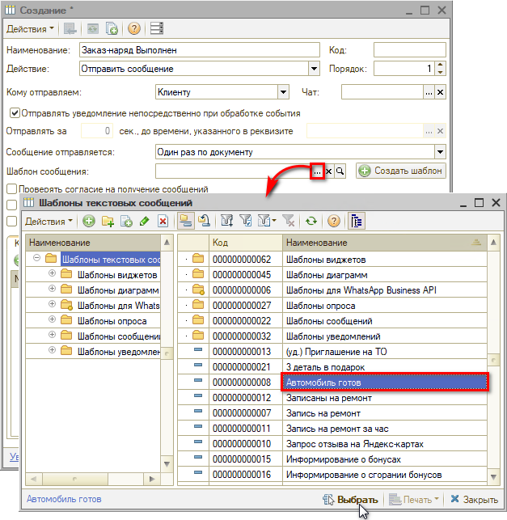

Теперь зададим мессенджеры, через которые будет отправляться сообщение. Для этого добавим канал доставки:

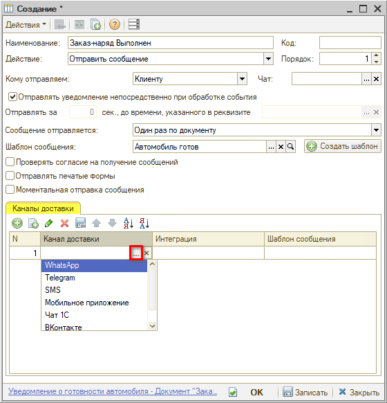

В качестве канала доставки №1 выберем WhatsApp.

Можно указать несколько мессенджеров:

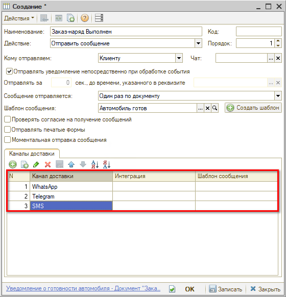

Если указано несколько мессенджеров, то логика отправки сообщений следующая:

1. Система пытается отправить сообщение на канал доставки №1 (в нашем случае WhatsApp). 
   \- Если сообщение отправлено и клиент прочитал его, то на другие каналы сообщение не отправляется.
2. Если сообщение не отправлено или клиент не прочитал его в течение 10 минут, то Система отправляет сообщение на канал доставки №2 (в нашем случае Telegram). 
   \- Если сообщение отправлено и клиент прочитал его, то на другие каналы сообщение не отправляется.
3. Если сообщение не отправлено или клиент не прочитал его в течение 10 минут, то Система отправляет сообщение на канал доставки №3 (в нашем случае SMS).

При необходимости, помимо самого текста сообщения, можно отправлять еще и печатную форму документа. Для этого достаточно установить флажок "Отправлять печатные формы" и на вкладке "Печатные формы" выбрать какую печатную форму отправлять:

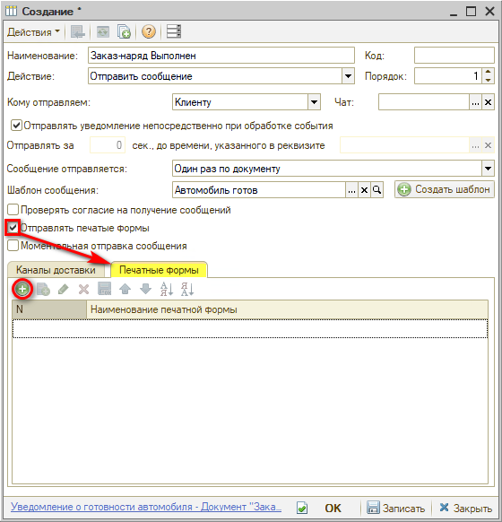

Готово! Осталось сохранить изменения, нажав кнопку "ОК".

## Список всех отправленных сообщений

Полный список сообщений, отправленных клиентам вручную и автоматически, хранится в регистре **«Сообщения»**. Откройте его через верхнее типовое меню: *CRM → Сообщения → Сообщения*.

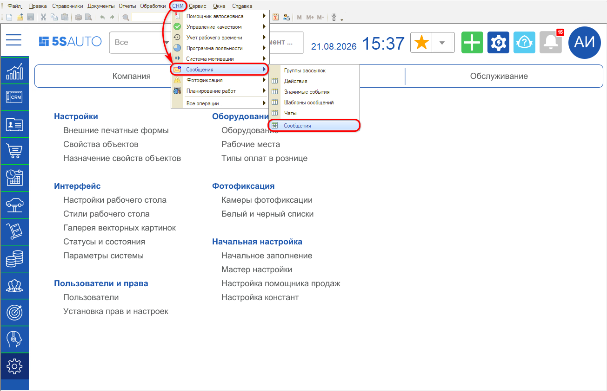

По каждому сообщению в регистре видно период, чат, контрагента, дату отправки, статус, канал, документ-основание, текст сообщения и тип уведомления. Нужное сообщение можно найти по контрагенту, времени отправки и другим параметрам.

Чтобы оставить только нужные записи, нажмите на колонке правой кнопкой мыши и выберите **«Отбор по значению в текущей колонке»**. Например, так можно отобрать все сообщения по типу уведомления – о записи на ремонт или о выполнении заказ-наряда.

В [ленте событий](../../Работа%20с%20клиентами/Лента%20событий/lenta-sobytiy.md) и в карточке сделки отображаются только сообщения по конкретному клиенту или сделке, а в регистре – все сообщения по всем клиентам.

---

**Теги:** автоматическая отправка, мессенджеры, значимые события, шаблоны сообщений, регистр сообщений, отправленные сообщения, настройка
