

# Настройка шаблонов WhatsApp Business API

<table><tr><td><b>Время чтения:</b> 29 мин.</td><td><b>Обновлено:</b> 19.09.2025</td></tr></table>

Источник: https://www.5systems.ru/help/nastroyka-shablonov-whatsapp-business-api

## Содержание

- [Введение](#введение)
- [Диалоговая система WABA](#диалоговая-система-waba)
  - [Варианты инициализации диалогов](#варианты-инициализации-диалогов)
  - [Категории шаблонов](#категории-шаблонов)
  - [Критерии открытия диалога](#критерии-открытия-диалога)
  - [Дополнительно](#дополнительно)
- [Настройка шаблонов](#настройка-шаблонов)
  - [Переход к настройке](#переход-к-настройке)
  - [1. Начало диалога](#1-начало-диалога)
  - [2. Печатная форма](#2-печатная-форма)
  - [3. Запись на ремонт](#3-запись-на-ремонт)
    - [1) «Вы записаны на ремонт»](#1-вы-записаны-на-ремонт)
    - [2) «Напоминание о записи»](#2-напоминание-о-записи)
  - [4. Заказ-наряд готов](#4-заказ-наряд-готов)
- [Лимиты текста сообщения](#лимиты-текста-сообщения)

## Введение

В статье рассматриваются принципы диалоговой системы учета сообщений на платформе [WhatsApp Business API](https://www.5systems.ru/help/nastroyki-integracii-s-whatsapp-business-api), а также виды преднастроенных в программе шаблонов сообщений и специфика их настройки в зависимости от назначения и категории.

## Диалоговая система WABA

С 1 февраля 2022 года в WhatsApp Business API действует диалоговая система учета сообщений (Conversation model).

**Диалог**, или переписка, — это цепочка сообщений, отправленных в течение 24-часового сеанса между компанией и клиентом. О критериях открытия диалога см. [ниже](#критерии-открытия-диалога).

Введена следующая система тарификации: WhatsApp взимает плату за диалоговые сессии. Каждая инициация диалога в мессенджере открывает 24-часовое окно, в течение которого можно отправлять неограниченное количество уже бесплатных сообщений в свободной форме или шаблонов категории «Услуги». Окно обслуживания закрывается по истечении 24 часов с момента последнего сообщения клиента.

*Примечание:* за каждый отправленный шаблон категории «Маркетинг» с 1 июля 2025 года взимается отдельная оплата независимо от того, есть ли уже открытое окно обслуживания маркетинговой или любой другой категории.

Подробно о том, как работает плата за переписки на платформе WhatsApp Business, см. на сайте Meta[\*](#сноска-meta): [Pricing — WhatsApp Business Platform](https://developers.facebook.com/docs/whatsapp/pricing) (возможно, потребуется VPN).

### Варианты инициализации диалогов

Диалог может быть инициирован как компанией, так и клиентом.

**1. Диалоги, инициированные компанией**, открываются в случае отправки сообщения компанией на номер клиента и получения от него ответного сообщения. Первое сообщение от компании должно быть на базе утвержденного шаблона — шаблоны тарифицируются согласно [категориям](#категории-шаблонов). Окно обслуживания открывается с момента получения ответного сообщения от клиента и действует в течение 24 часов: то есть компания отправляет первое сообщение на основе шаблона и ждет ответа клиента — написания ответного сообщения либо нажатия кнопки в чат-боте.

В этом случае компания платит за первое отправленное сообщение[\*\*](#сноска-оплата), затем нужно дождаться, чтобы клиент ответил на него. Для каждого шаблона при согласовании должна быть выбрана категория.

**2. Диалоги, инициированные клиентом**, открываются в случае отправки пользователем сообщения в адрес компании. Сеанс общения начинается с момента ответа компанией на сообщение пользователя и действует в течение 24 часов. Ответ должен быть в свободной форме, а не на основе шаблона.

В рамках открывшегося диалогового окна компания может отправлять сообщения клиенту в свободной форме. Если клиент пишет первым, диалог будет бесплатным.

*Примечание:* если компания не ответит на сообщение пользователя, диалоговое окно не откроется. Если с момента сообщения от пользователя прошло 24 часа, компания может ответить только шаблонным сообщением, и оно будет тарифицироваться как диалог, начатый компанией.

\*\* Оплата взимается в момент доставки сообщения, а не отправки.

### Категории шаблонов

Диалоги в WABA распределяются по следующим категориям, которые необходимо будет выбирать при настройке для согласования шаблона сообщения:

- **Маркетинг** — промоакции, предложения, запрос оценки сервиса без привязки к конкретному заказу, информационные сообщения и приглашения для клиентов, которые подразумевают ответ или какое-либо действие со стороны клиента. А также сообщения в свободной форме, не подходящие под другие категории — например, шаблон для приглашения клиента к диалогу. Это самая дорогая категория диалогов, и их отправка всегда оплачивается.
- **Услуги** — диалоги, которые сопровождают конкретный согласованный запрос или транзакцию либо информируют клиента о текущей транзакции, то есть помогают клиенту получить или завершить уже начатую услугу. Это могут быть подтверждения транзакций, обновления транзакций и уведомления после покупки. Стоимость диалогов категории «Услуги» дешевле, чем «Маркетинг», и оплачиваются они только в случае отправки вне открытого диалогового окна. В частности, к этой категории относятся уведомления клиенту о записи на ремонт, напоминание о записи, уведомление о готовности заказ-наряда.
- **Аутентификация** — диалоги, которые позволяют выполнять аутентификацию пользователей с помощью одноразовых кодов, например в процессе многошагового входа (подтверждение аккаунта, восстановление аккаунта и т. д.). Это самая дешевая категория диалогов, всегда оплачиваются отдельно. *Примечание:* на данный момент для настройки шаблонов в программе эта категория не используется.
- **Сервис**, или **Обслуживание**, — диалоговые сессии, которые помогают решать вопросы клиентов, то есть диалоги, инициированные клиентом. Эту категорию нельзя выбрать при настройке шаблона: ее видно только в детализации сообщений в личном кабинете «360dialog».

Подробную информацию о категориях диалогов и о том, как выбрать подходящую категорию при создании шаблона, см. в руководстве по шаблонам сообщений на официальном сайте Meta[\*](#сноска-meta): [Template Categorization — WhatsApp Business Platform](https://developers.facebook.com/docs/whatsapp/updates-to-pricing/new-template-guidelines).

Диалоговые сессии категории «Маркетинг», «Услуги» и «Аутентификация» можно открывать только сообщениями на базе шаблонов. Диалоговые сессии категории «Обслуживание» можно открывать только сообщениями в свободной форме — см. далее.

*Примечание:* актуальную стоимость отправки шаблонов различных категорий можно уточнить у вашего персонального менеджера. Также см. информацию на [сайте WhatsApp](https://business.whatsapp.com/products/platform-pricing).

### Критерии открытия диалога

**1. Диалоговое окно**, или окно обслуживания клиента, — это 24-часовой период, в течение которого можно бесплатно переписываться с клиентом. Диалоговое окно открывается в двух случаях:

- когда компания написала клиенту первой и клиент прислал ответное сообщение;
- когда пользователь первым написал компании и компания отправила ответное сообщение.

В пределах диалогового окна компания может отправлять клиенту сообщения в свободной форме в любом количестве. Вне этого окна можно отправлять только сообщения на базе шаблонов. По истечении 24 часов вновь начатый диалог потребуется оплачивать заново.

Если после отправки компанией первого сообщения на основе шаблона не дождаться ответа клиента, а написать следом новое сообщение, то при попытке отправить сообщение в свободной форме будет выходить ошибка, а при повторной отправке шаблона будет взиматься плата за каждый отправленный шаблон.

**2. Диалоговая сессия категории «Маркетинг», «Услуги» или «Аутентификация»** открывается, когда компания отправляет клиенту сообщение на базе шаблона соответствующей категории.

Если между компанией и клиентом открыт диалог категории «Услуги», то при отправке в течение 24 часов еще одного сообщения на базе шаблона «Услуги» новая диалоговая сессия не откроется. Однако если отправить клиенту сообщение на базе шаблона «Маркетинг», откроется новая сессия этой категории, и будут два открытых диалога.

*Примечание:* за каждый отправленный шаблон с предприятия взимается оплата, за исключением шаблонов категории «Услуги» (Utility), отправленных уже в рамках открытого окна обслуживания.

Например, если компания отправит пользователю маркетинговый шаблон, а затем два шаблона категории «Услуги», с нее будет списано три платежа (один за «Маркетинг», два за «Услуги»). Однако если два шаблона категории «Услуги» будут отправлены в течение открытого периода обслуживания клиентов, с компании будет списана только плата за первое маркетинговое сообщение.

Если окно обслуживания клиента закрылось, то есть прошло 24 часа с момента последнего сообщения от пользователя, то при новой отправке шаблона сообщения любой категории с компании будет списана соответствующая оплата.

**3. Диалоговая сессия категории «Обслуживание»** открывается, когда компания отправляет клиенту ответное сообщение в свободной форме в рамках окна обслуживания и между ними нет никаких других открытых диалогов.

Если между компанией и клиентом существует открытая диалоговая сессия какой-либо категории и в течение 24 часов компания отправит клиенту сообщение в свободной форме, новый диалог не откроется. Однако если открытых диалогов нет и клиент напишет сообщение (при этом откроется окно обслуживания клиента), на которое компания ответит в течение 24 часов сообщением в свободной форме, откроется новая сессия категории «Обслуживание».

**4. Продолжительность сессий** категории «Маркетинг», «Услуги», «Аутентификация» и «Обслуживание» составляет 24 часа, если они не закрываются в результате открытия диалога с бесплатной точкой входа.

Диалоговые сессии, начатые через бесплатные точки входа, длятся 72 часа (3 дня). К бесплатным точкам входа относятся:

- реклама с призывом перейти по ссылке в WhatsApp (Ads that click to WhatsApp);
- кнопка действия на странице Facebook[\*\*\*](#сноска-facebook) (Facebook Page CTA).

Обратите внимание, что сессия будет бесплатной, если клиент перешел с оплаченного рекламного сообщения в Facebook[\*\*\*](#сноска-facebook) или Instagram[\*\*\*](#сноска-facebook). Подробнее о бесплатных точках входа и о критериях, определяющих момент открытия диалога, см. на сайте Meta[\*](#сноска-meta): [Pricing — WhatsApp Business Platform](https://developers.facebook.com/docs/whatsapp/pricing).

Также см. информацию о новых условиях тарификации с 1 июля 2025 года:

- [Расценки на платформе WhatsApp Business](https://developers.facebook.com/docs/whatsapp/pricing/) на сайте Meta[\*](#сноска-meta);
- [Messaging → Sending & Receiving Messages → Conversations](https://docs.360dialog.com/partner/messaging/sending-and-receiving-messages/conversations) на сайте 360Dialog.

### Дополнительно

**Ограничения на количество сообщений маркетингового шаблона для каждого пользователя.** С 1 апреля 2024 года введено ограничение на количество маркетинговых диалогов, которые пользователь может получить от любой компании в течение определенного периода времени.

Ограничение применяется только к маркетинговым шаблонам, которые открывают новый диалог. Если между компанией и пользователем WhatsApp уже открыт маркетинговый диалог, сообщения маркетингового шаблона, отправленные пользователю, не будут затронуты.

Лимит определяется Meta[\*](#сноска-meta) и основан на количестве маркетинговых шаблонных сообщений, которые человек уже получил от какой-либо компании, и не связан конкретно с бизнесом компании. Дополнительную информацию см. в [документации 360 Dialog](https://docs.360dialog.com/partner/messaging/template-messages/sending-template-messages#per-user-marketing-template-message-limits).

> \* Meta признана экстремистской организацией, запрещенной на территории Российской Федерации.
>
> \*\*\* Facebook и Instagram являются продуктами компании Meta, признанной экстремистской организацией, запрещенной на территории Российской Федерации.

## Настройка шаблонов

### Переход к настройке

Справочник **«Шаблоны сообщений»** находится в меню программы: *Администрирование → Компания → CRM → Шаблоны сообщений*:

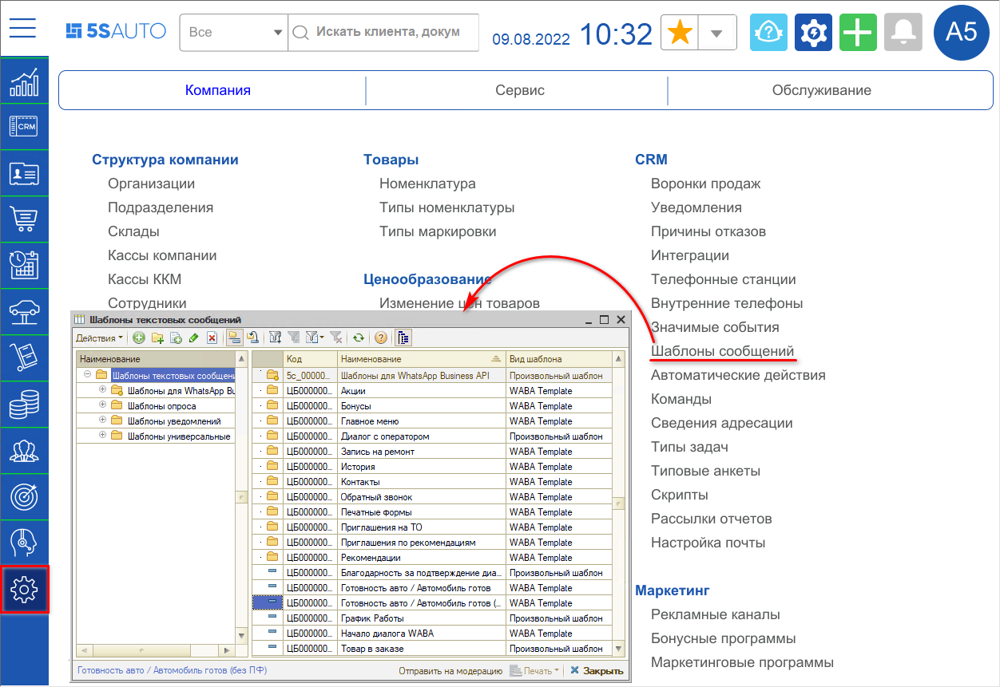

Для шаблонов сообщений WhatsApp Business API создана отдельная группа:

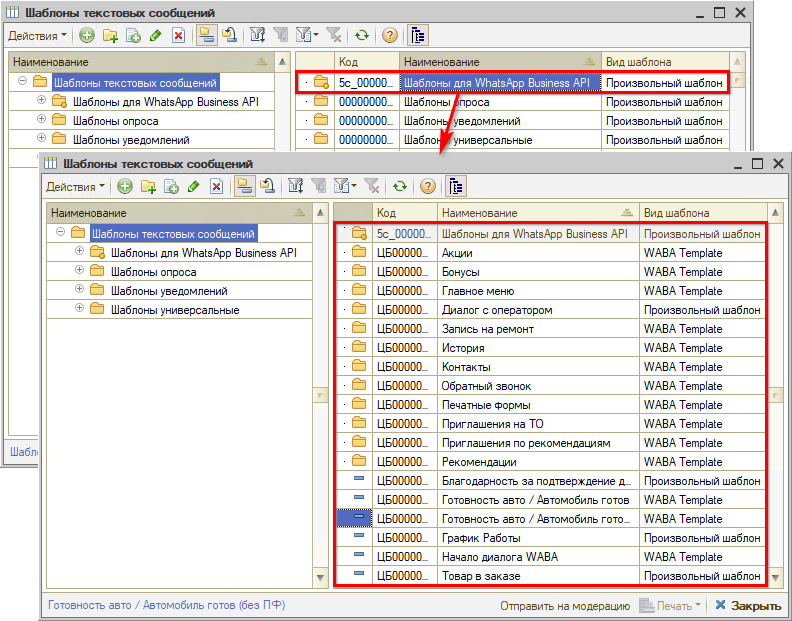

Шаблоны в группе для удобства разбиты по веткам логики бота. Например, группа «Запись на ремонт» содержит шаблоны «Вы записаны на ремонт», «Выбор автомобиля», «Выбор услуг», «Напоминание о записи», «Подтвердите заявку» и «Управление записью»:

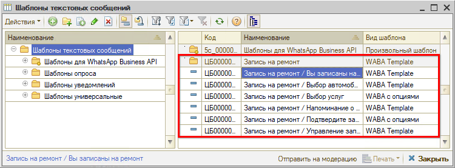

Логика настройки отправки автоматических сообщений общая для конфигурации 5S AUTO — см. статью «[Настройка автоматической отправки сообщений через мессенджеры](https://www.5systems.ru/help/nastroyka-avtomaticheskoy-otpravki-soobscheniy-cherez-messendzhery)».

Для сообщений, отправляемых по WhatsApp, реализован специальный шаблон — он имеет заголовок, тело, подвал и т. д.:

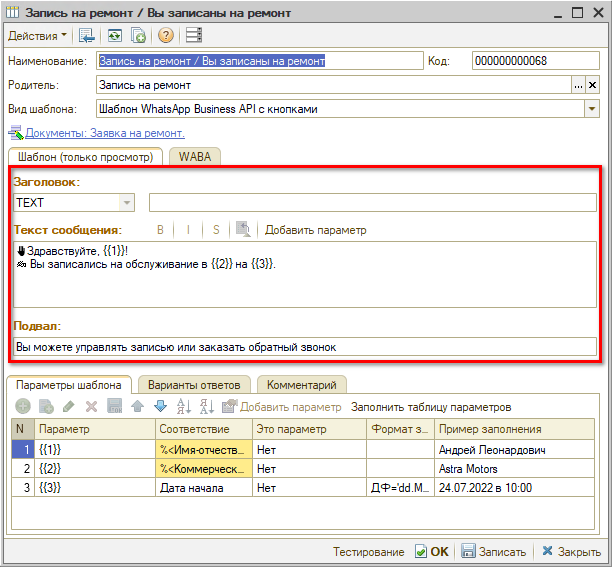

Наполнение шаблона и отправка его на согласование производятся прямо внутри программы: чтобы создать шаблон или посмотреть его статус, не нужно заходить в интерфейс Facebook[\*\*\*](#сноска-facebook) или WhatsApp.

В системе предустановлены стандартные шаблоны сообщений WABA:

1. [Начало диалога](#1-начало-диалога);
2. [Печатная форма](#2-печатная-форма);
3. [Запись на ремонт](#3-запись-на-ремонт);
4. [Заказ-наряд готов](#4-заказ-наряд-готов).

В соответствии с политикой WABA в каждом шаблоне необходимо установить [категорию](#категории-шаблонов): для шаблонов «Начало диалога» и «Печатная форма» должна быть установлена категория **«Маркетинг»**, для шаблонов «Запись на ремонт» и «Заказ-наряд готов» — категория **«Услуги»**.

Эти шаблоны являются преднастроенными в программе, но при необходимости можно внести в них изменения.

### 1. Начало диалога

Шаблон требуется, чтобы начать диалог с клиентом. Для начала диалога клиенту отправляется приветственное сообщение по согласованному шаблону:

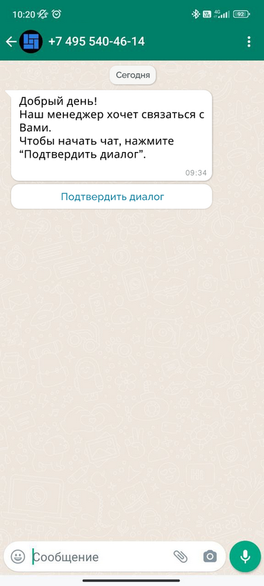

Клиент нажимает кнопку **«Подтвердить диалог»** и получает в ответ автоматическое сообщение:

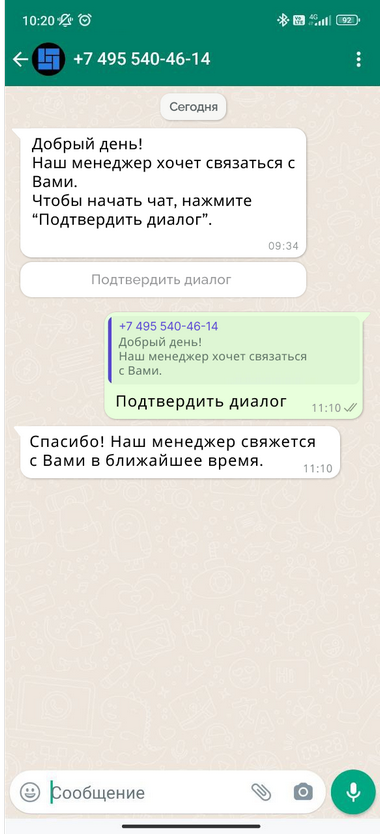

**Особенности настройки шаблона.** Шаблон «Начало диалога WABA» должен выглядеть следующим образом:

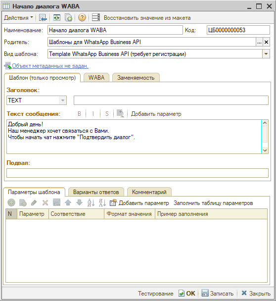

При необходимости можно вносить изменения в шаблон: перейдите на вкладку **WABA** и установите галочку **«Создать новый шаблон»** — это обязательно для возможности редактирования и отправки нового шаблона на модерацию:

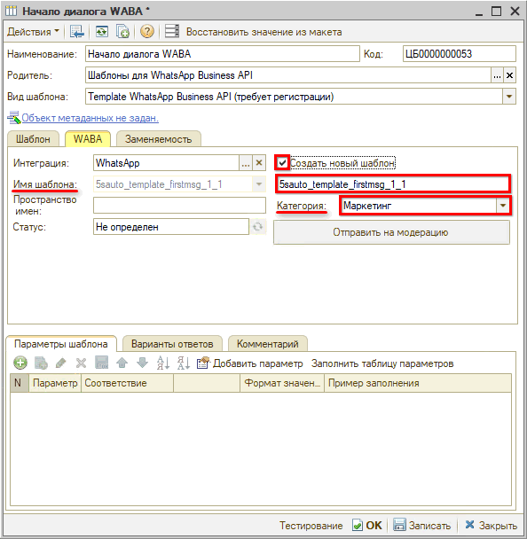

Для нового шаблона необходимо присвоить уникальное **имя шаблона** — оно должно быть написано латиницей, строчными буквами.

Для шаблона «Начало диалога» требуется выбрать категорию **«Маркетинг»**.

Для предустановленных шаблонов настроены кнопки ответов по умолчанию — в рассматриваемом примере это кнопка «Подтвердить диалог»:

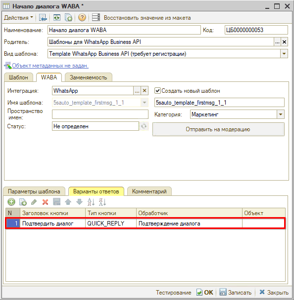

Шаблон ответа также можно изменить: перейдите через обработчик **«Подтверждение диалога» → действие «Подтверждение диалога» → шаблон «Благодарность за подтверждение диалога»**:

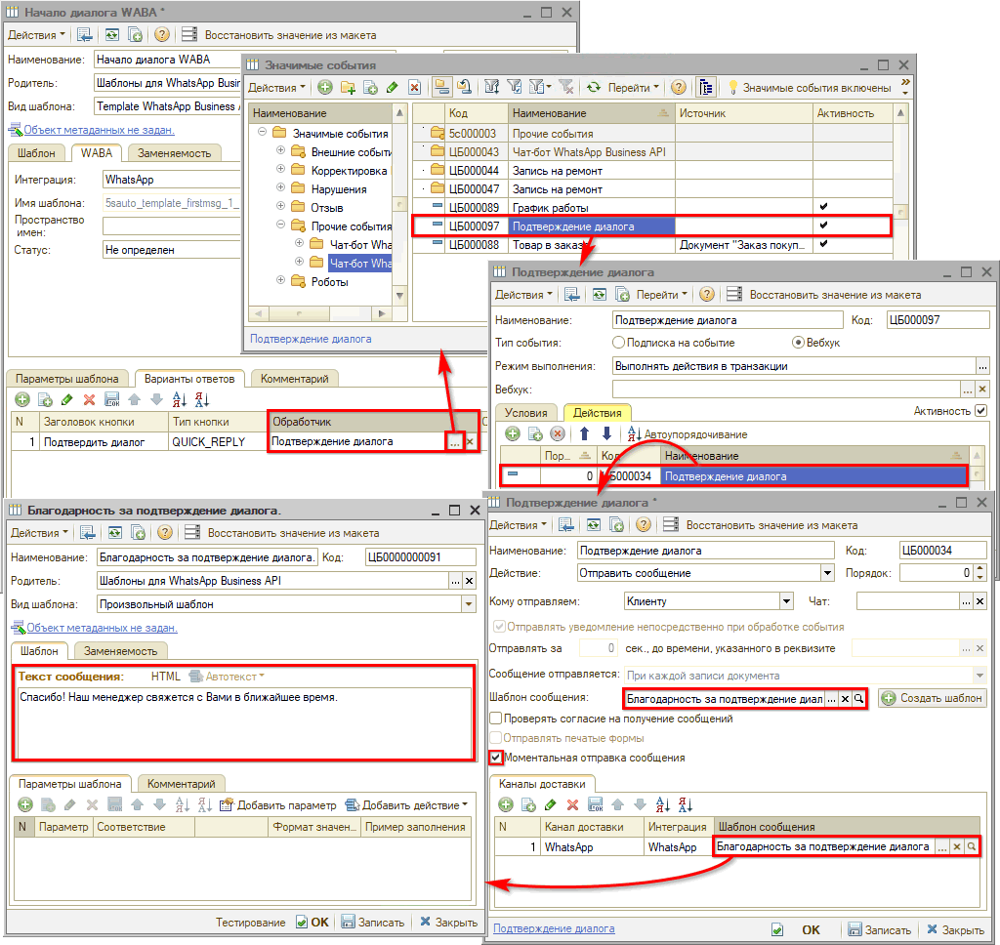

В поле **«Текст сообщения»** можно изменить текст.

После внесения изменений шаблон необходимо снова отправить на модерацию: **«Записать» → «Отправить на модерацию» → «Записать»** повторно.

После отправки на модерацию шаблону будут присвоены значение параметра **«Пространство имен»**, а также значение статуса **submitted**:

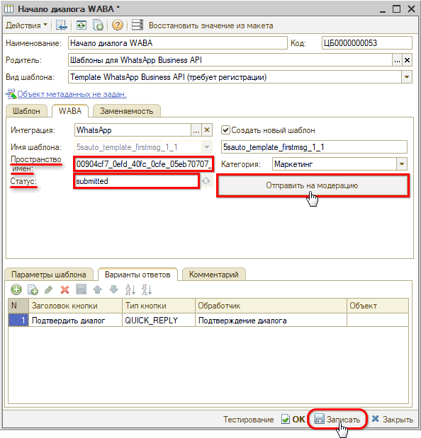

После первичной проверки статус изменится на **pending**. Затем в течение дня статус изменится либо на **approved** («подтвержден»), либо на **rejected** («отклонен»).

Если шаблон отклонен, посмотрите причину в комментарии шаблона, исправьте ошибки и повторно отправьте на модерацию.

> **Внимание!** При отправке шаблона на подтверждение у него автоматически проверяется категория. Если она не соответствует заявленной, подставляется категория, которую WABA считает верной (ранее при несоответствии категории приходил отказ). То есть категория в шаблоне будет автоматически изменена на ту, которую WABA считает подходящей.

Шаблон начинает работать только при статусе **approved**.

Чтобы начать диалог в свободной форме с клиентом, необходимо отправить ему приглашение на диалог, то есть инициировать диалог. Для этого из сделки либо из карточки контрагента отправьте клиенту сообщение на основе данного шаблона:

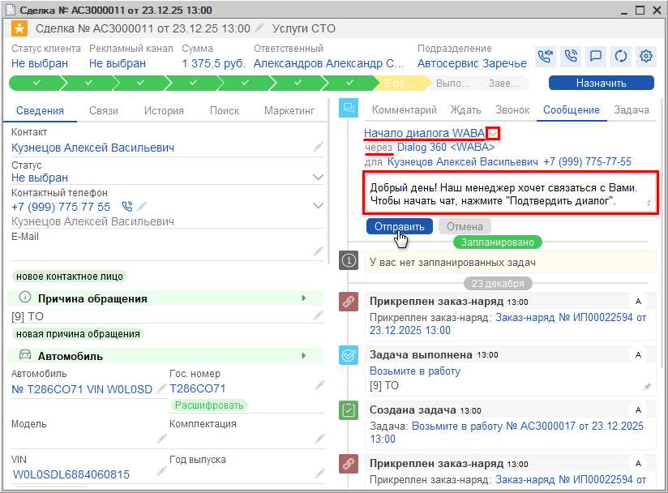

Клиент должен нажать в сообщении кнопку «Подтвердить диалог» — после этого начинается сессия 24 часа (см. [выше](#критерии-открытия-диалога)), то есть можно будет писать клиенту в свободном формате в течение суток.

### 2. Печатная форма

Шаблон требуется, чтобы отправлять клиентам печатные формы.

**Особенности настройки шаблона.** Шаблон должен иметь следующий вид:

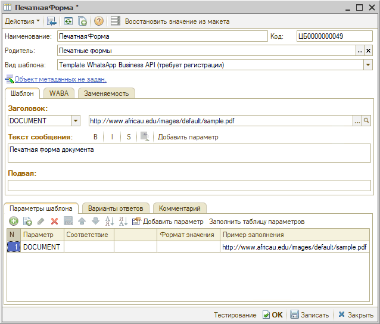

*Примечание:* шаблон «Печатная форма» не рекомендуется изменять, особенно наименование!

При необходимости внесения изменений действуйте аналогично настройкам шаблона «Начало диалога», рассмотренным [выше](#1-начало-диалога). Для шаблона «Печатная форма» должна быть выбрана категория **«Маркетинг»**. После внесения изменений шаблон также необходимо записать, нажать «Отправить на модерацию» и повторно записать:

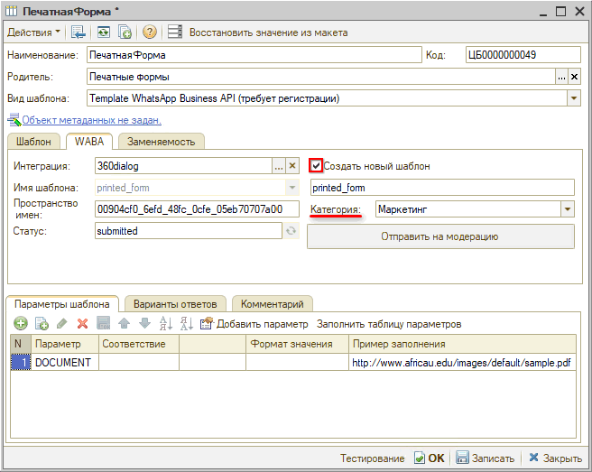

### 3. Запись на ремонт

Шаблон имеет два подвида: «Запись на ремонт / Вы записаны на ремонт» и «Запись на ремонт / Напоминание о записи».

#### 1) «Вы записаны на ремонт»

Шаблон используется для уведомления клиента о записи на ремонт — создается при записи документа «Заявка на ремонт» с видом «План ремонта».

Также в шаблоне есть кнопка **«Маршрут проезда»**, которая отправляет клиенту геометку подразделения, где находится цех:

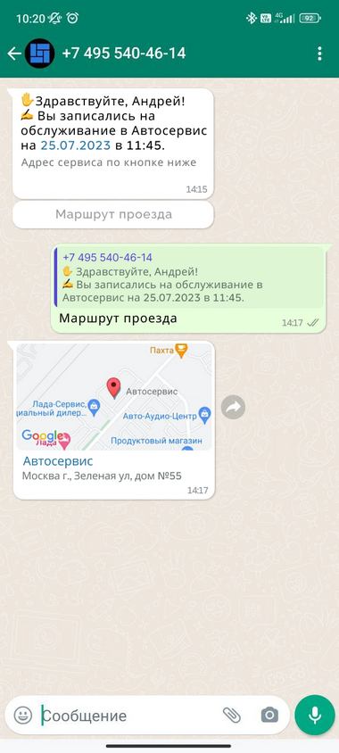

**Особенности настройки шаблона.** По умолчанию шаблон в программе выглядит следующим образом:

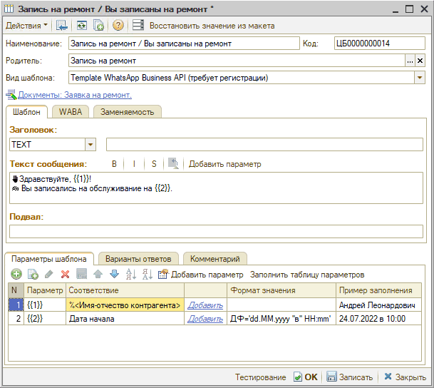

Настройка производится аналогично шаблону «Начало диалога» — см. [выше](#1-начало-диалога):

Для шаблона «Запись на ремонт» должна быть выбрана категория **«Услуги»**.

Все настройки заданы по умолчанию. При необходимости внесения изменений в шаблон установите галочку «Создать новый шаблон», внесите изменения, запишите, нажмите «Отправить на модерацию» и повторно запишите.

В частности, может потребоваться настройка кнопки «Маршрут проезда» — для этого перейдите на вкладку **«Варианты ответов»**:

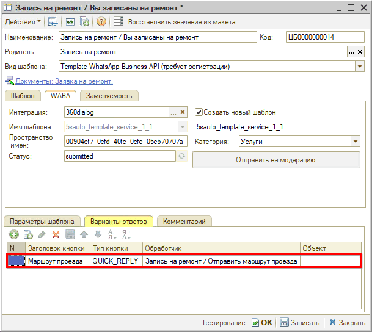

Необходимо проверить, чтобы в настройках обработчика была указана интеграция, а также выбрано действие **«Местоположение»**:

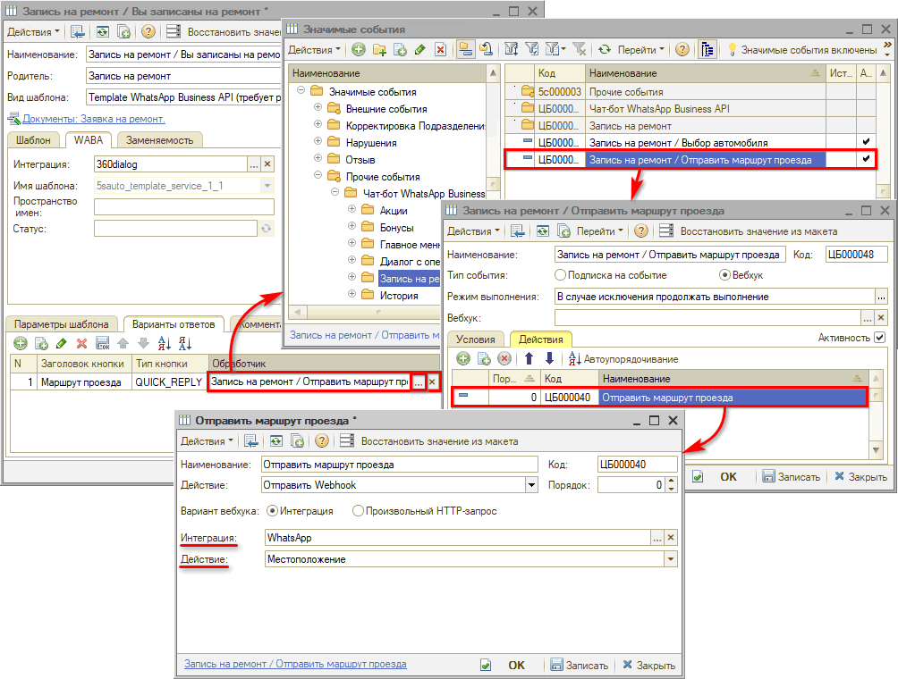

Координаты местоположения задаются в настройках подразделения компании — их рекомендуется брать из Google Maps:

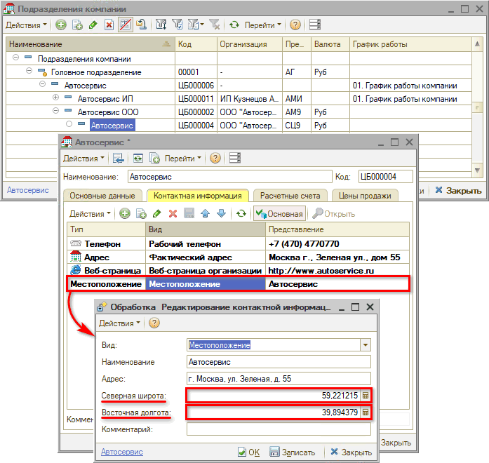

После подтверждения шаблона нужно настроить значимое событие по автоматической отправке сообщений **«Уведомление о записи на ремонт»**:

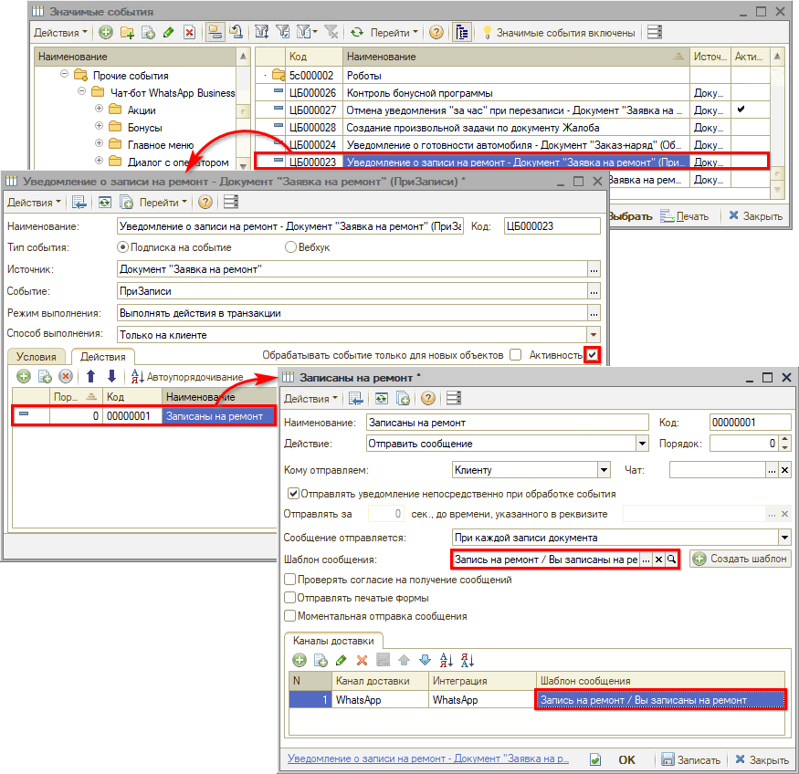

В настройках значимого события должна стоять галочка **«Активность»**. В действии на значимое событие в поле **«Шаблон сообщения»** — в параметрах и в таблице — необходимо указать данный шаблон.

Аналогичные настройки производятся для шаблонов «Напоминание о записи» и «Заказ-наряд готов» — см. далее.

#### 2) «Напоминание о записи»

Напоминание о записи на ремонт приходит клиенту за определенное время до заезда — по умолчанию за 1 час:

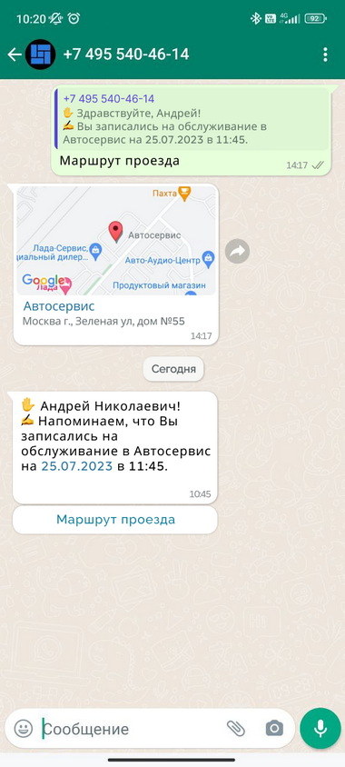

**Особенности настройки шаблона.** Настройка шаблона «Запись на ремонт / Напоминание о записи» производится полностью аналогично настройке шаблона «Вы записаны на ремонт», отличается только текст сообщения и настройка времени отправки уведомления:

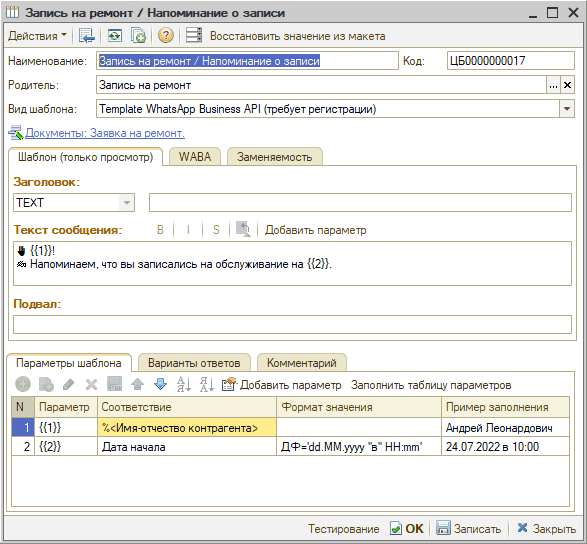

Все настройки также заданы по умолчанию. Категория также должна быть установлена **«Услуги»**. При необходимости внесения изменений в шаблон действуйте аналогично настройке шаблона «Начало диалога» — см. [выше](#1-начало-диалога):

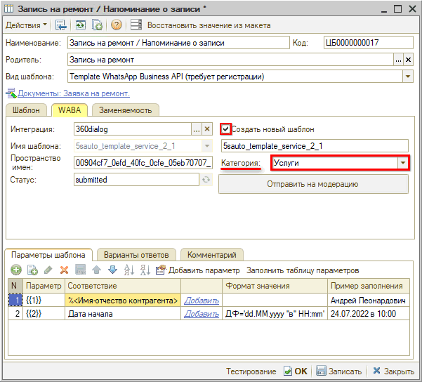

Кнопка **«Отправить маршрут проезда»** настраивается так же, как для шаблона «Вы записаны на ремонт» (см. [выше](#1-вы-записаны-на-ремонт)):

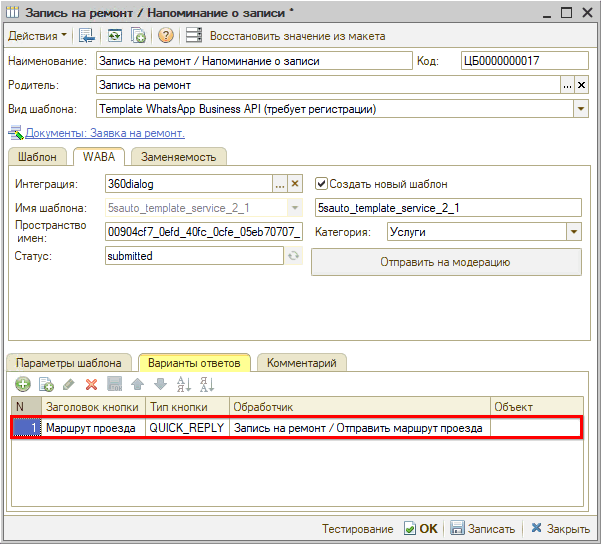

После подтверждения шаблона следует настроить значимое событие по автоматической отправке сообщений **«Уведомление о записи на ремонт за 1 час»**. В отличие от настройки «Уведомления о записи на ремонт» (см. выше), для шаблона «Напоминание о записи» должно быть указано значение параметра **«Отправлять за …»** — по умолчанию задано время 3600 сек. до времени записи:

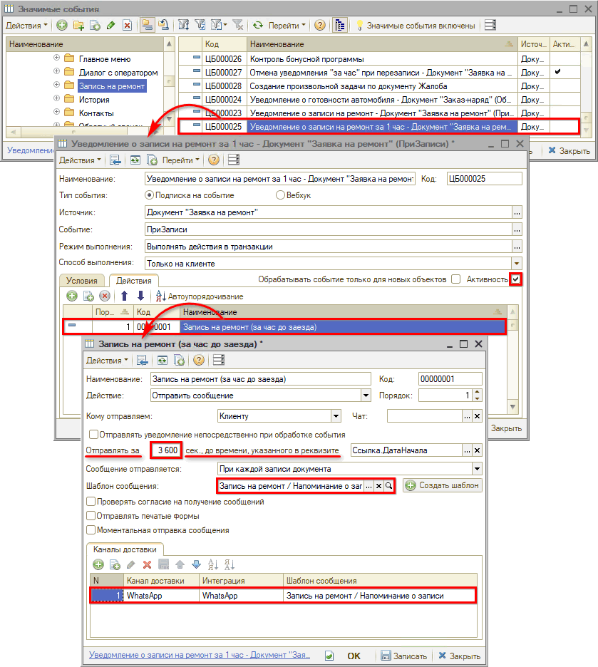

### 4. Заказ-наряд готов

Шаблон требуется, чтобы отправлять клиенту уведомление о готовности автомобиля. Сообщение отправляется при смене статуса заказ-наряда в состояние «Выполнен»:

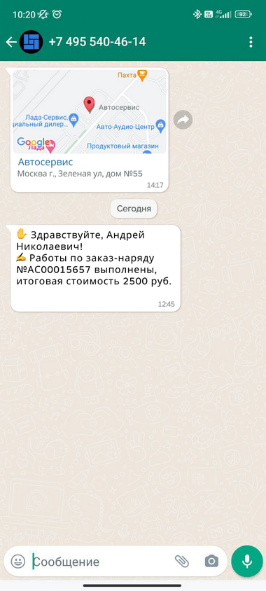

**Особенности настройки шаблона.** По умолчанию шаблон в программе выглядит следующим образом:

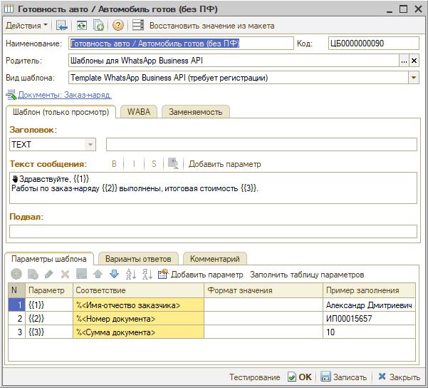

Настройки также заданы по умолчанию. Для этого шаблона должна быть установлена категория **«Услуги»**. При необходимости внесения изменений в шаблон действуйте аналогично настройке шаблона «Начало диалога» — см. [выше](#1-начало-диалога):

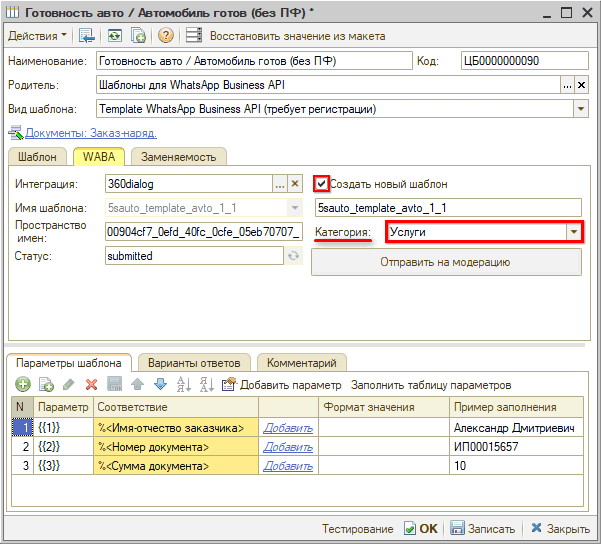

После подтверждения шаблона следует настроить значимое событие по автоматической отправке уведомлений о готовности заказ-наряда — настройка производится аналогично «Уведомлению о записи на ремонт» (см. [выше](#1-вы-записаны-на-ремонт)):

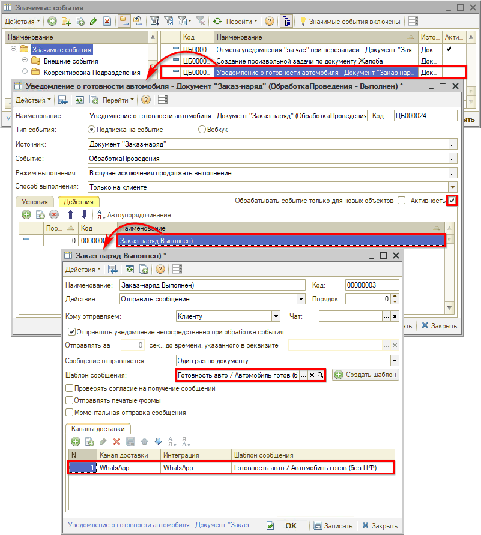

## Лимиты текста сообщения

С 1 июля 2025 года действуют следующие ограничения:

- **Максимум 550 символов** (вместо прежних 1024). *Примечание:* подставные переменные (имя, номер документа и т. д.) не учитываются в этот лимит.
- **До 10 эмодзи.** В случае превышения шаблон может не пройти модерацию.
- Клиент видит только **первые 5 строк**, остальное скрыто за кнопкой «Читать далее».

Рекомендуется писать кратко, самое важное выносить в начало текста.

*Примечание:* следите за обновлениями требований на официальных ресурсах сервиса, так как они могут меняться.

---

**Теги:** WhatsApp, WABA, WhatsApp Business API, чаты, шаблоны сообщений, диалоговая система, категории шаблонов, модерация шаблонов, значимые события, тарификация, 360dialog

