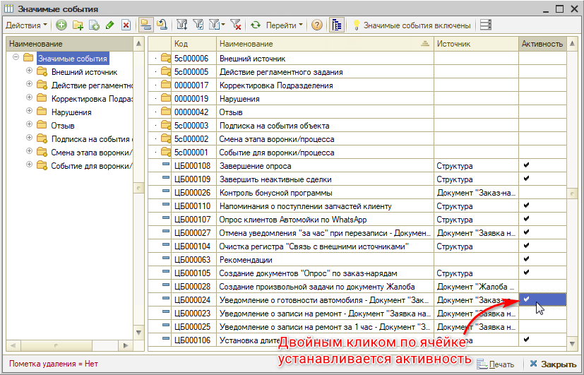
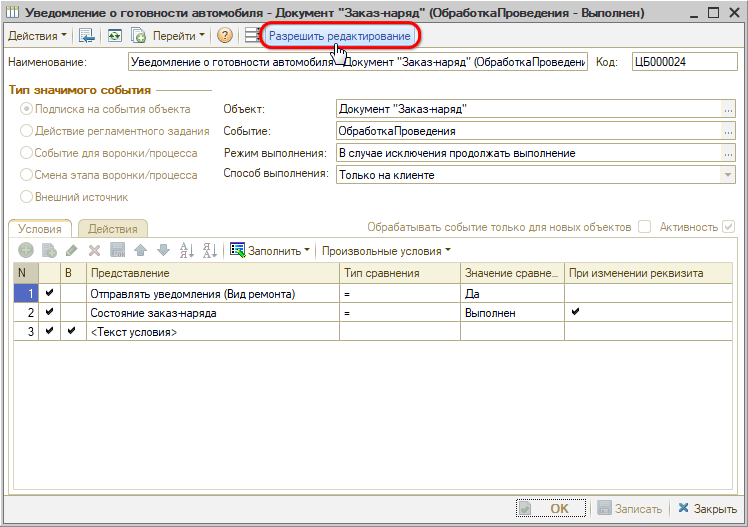
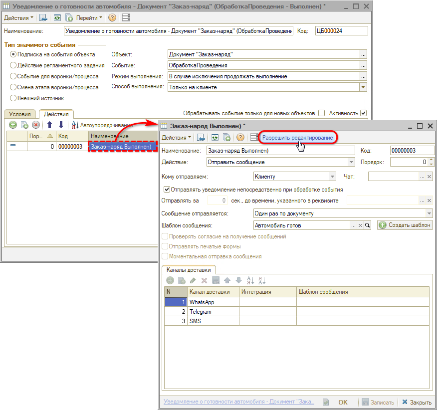
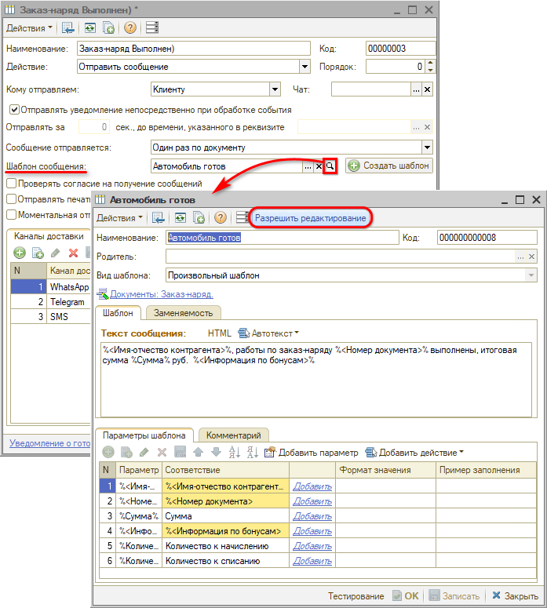
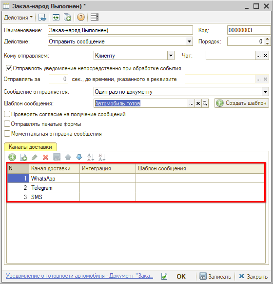
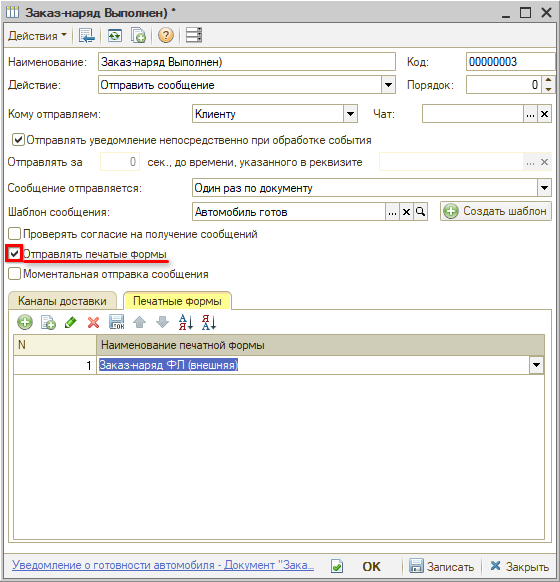
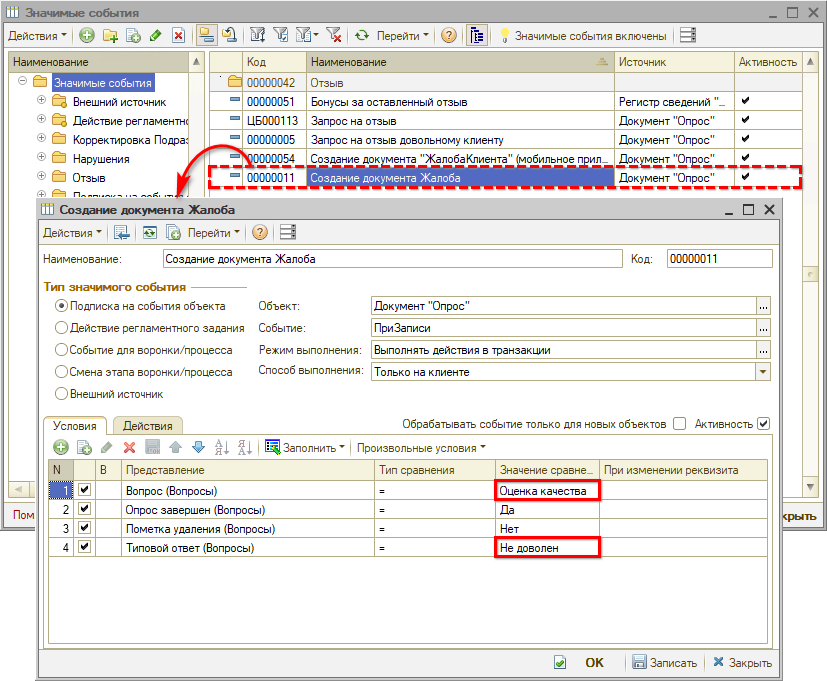

# Преднастроенные значимые события

<table><tr><td><b>Время чтения:</b> 13 мин.</td><td><b>Обновлено:</b> 19.04.2024</td></tr></table>

Источник: https://www.5systems.ru/help/prednastroennye-znachimye-sobytiya

> *Актуально для релиза 2.7.1.*

## Содержание

1. [Введение](#введение)
2. [Настройка значимых событий](#настройка-значимых-событий)
3. [Преднастроенные события](#преднастроенные-события)
   - [1. Событие "Уведомление о готовности автомобиля"](#1-событие-уведомление-о-готовности-автомобиля)
   - [2. Событие "Уведомление о записи на ремонт"](#2-событие-уведомление-о-записи-на-ремонт)
   - [3. Событие "Уведомление о записи на ремонт за 1 час"](#3-событие-уведомление-о-записи-на-ремонт-за-1-час)
   - [4. Событие "Запрос на отзыв довольному клиенту"](#4-событие-запрос-на-отзыв-довольному-клиенту)
   - [5. Событие "Приглашение в Telegram"](#5-событие-приглашение-в-telegram)
   - [6. Событие "Создание документа Жалоба"](#6-событие-создание-документа-жалоба)
   - [7. Событие "Создание документа Нарушение по документу Жалоба"](#7-событие-создание-документа-нарушение-по-документу-жалоба)

## Введение

Значимые события и настройка автоматической отправки сообщений через мессенджеры описаны в статье [*Настройка автоматической отправки сообщений через мессенджеры*](../Настройка%20автоматической%20отправки%20сообщений%20через%20мессенджеры/nastroyka-avtomaticheskoy-otpravki-soobscheniy-cherez-messendzhery.md).

В рамках данной статьи рассматриваются изначально преднастроенные значимые события, при возникновении которых осуществляется отправка сообщений.

## Настройка значимых событий

Для включения преднастроенного значимого события достаточно дважды кликнуть левой клавишей мыши на колонку "Активность" в справочнике "Значимые события":

Для настройки параметров значимых событий предусмотрен [*Мастер настройки системы*](https://5systems.ru/help/master-nastroyki-sistemy#nastr_otpr_sbsch).

Если необходимо настроить какие-либо параметры, которые не регулируются *Мастером настройки системы*, то на форме Значимого события необходимо нажать кнопку "Разрешить редактирование":

Можно изменить следующие параметры:

1. Изменить шаблон текста сообщения — для этого сначала нужно перейти к редактированию действия:  
     
   затем открыть для редактирования шаблон сообщения:  
    
2. Указать другой состав и порядок каналов доставки сообщения:  
    
3. Включить/выключить отправку печатных форм документов или изменить отправляемые печатные формы:  
   

## Преднастроенные события

### 1. Событие "Уведомление о готовности автомобиля"

Как только документ "Заказ-наряд" переходит в состояние "Выполнен" клиенту приходит сообщение о том, что автомобиль готов к выдаче, и итоговая смета выполненных работ.

### 2. Событие "Уведомление о записи на ремонт"

При изменении даты начала ремонта в АРМ "Запись на ремонт" клиенту приходит сообщение о том, что изменилось время ремонта.

### 3. Событие "Уведомление о записи на ремонт за 1 час"

Аналогично событию "Запись на ремонт" отправляется сообщение об изменении даты начала записи на ремонт. Но сообщение отправляется, только если с текущего момента до даты начала ремонта более 1 часа. Это необходимо, чтобы лишний раз не отправлять сообщение, ведь клиент и так планирует вскоре приехать.

### 4. Событие "Запрос на отзыв довольному клиенту"

Если в ходе завершения работы по ремонту в Заказ-наряде установлена отметка о том, что клиент "Доволен ремонтом", то клиенту отправляется сообщение с просьбой оставить отзыв на Яндекс.Картах или других сервисах. Для данного события необходимо указать ссылку на сервис в тексте шаблона сообщения перед его активированием.

Подробнее см. статью "[Запрос на отзыв довольного клиента об автосервисе](https://5systems.ru/help/zapros-na-otzyv-dovolnogo-klienta-ob-avtoservise)".

### 5. Событие "Приглашение в Telegram"

При записи нового Заказ-наряда, если у клиента нет еще чата с *[Telegram](../Интеграция%20с%20Telegram/integraciya-s-telegram.md)*, клиенту отправляется сообщение с приглашением в чат с Telegram-ботом.

### 6. Событие "Создание документа Жалоба"

При записи документа *["Опрос"](https://5systems.ru/help/opros-klienta-o-kachestve-obsluzhivaniya)*, в котором указано недовольство клиента качеством обслуживания, автоматически создается документ [*"Жалоба"*](https://5systems.ru/help/obrabotka-zhalob-ot-klientov).

У данного события при необходимости можно изменить вопрос и ответ, на основе которых будет создаваться документ "Жалоба". Для этого можно изменить значения для параметров условий наступления события:

### 7. Событие "Создание документа Нарушение по документу Жалоба"

При записи документа [*"Жалоба"*](https://5systems.ru/help/obrabotka-zhalob-ot-klientov), в котором установлено:

1. Состояние = "Проверена"
2. Жалоба справедлива = "Да"

Автоматически открывается для создания документ [*"Нарушение"*](https://5systems.ru/help/vyyavlenie-i-razbor-narusheniy).

---

**Теги:** значимые события, автоматическая отправка сообщений, шаблоны сообщений, уведомления клиента, мессенджеры

