

# Рассылка отчетов через мессенджеры

<table><tr><td><b>Время чтения:</b> 12 мин.</td><td><b>Обновлено:</b> 23.06.2022</td></tr></table>

Источник: https://www.5systems.ru/help/rassylka-otchetov-cherez-messendzhery

## Содержание

1. [Введение](#введение)
2. [Создание рассылки](#создание-рассылки)
3. [Отчеты для рассылки](#отчеты-для-рассылки)
4. [Расписание](#расписание)
5. [Доставка через мессенджер](#доставка-через-мессенджер)
6. [Дополнительные параметры](#дополнительные-параметры)

## Введение

В 1С предусмотрен типовой механизм рассылки отчетов по e-mail. Посмотреть видеоинструкцию по настройке можно на канале [YouTube](https://youtu.be/SXk1cTt0kWg).

В 5S AUTO реализован дополнительный механизм рассылки отчетов через мессенджеры: MAX, Telegram, WhatsApp и т.д.

## Создание рассылки

Для настройки рассылки через мессенджеры откроем справочник "Рассылки отчетов":

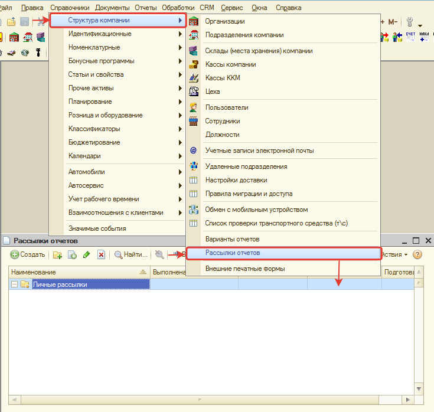

Создадим новую рассылку:

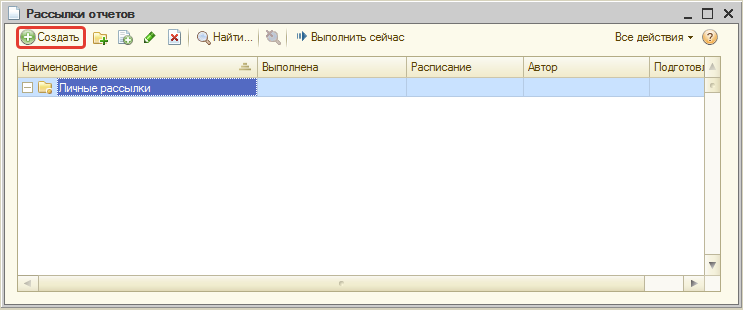

Заполним форму новой рассылки. Вот так она выглядит:

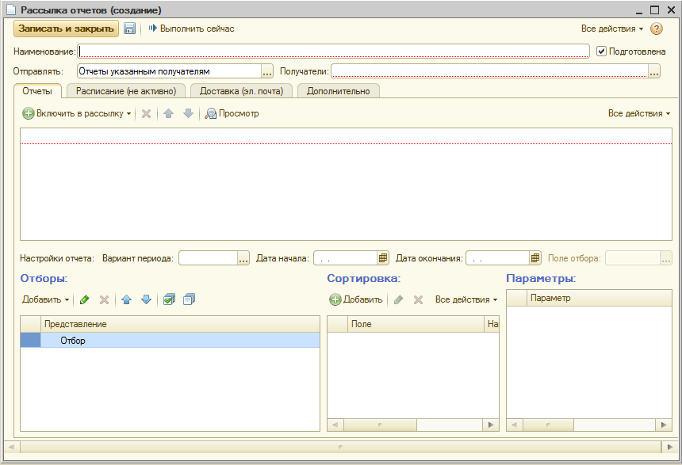

## Отчеты для рассылки

Тип отправки в случае рассылки через мессенджеры не меняем, оставляем значение "Отчеты указанным получателям". В качестве получателей выберем значение "Контрагенты":

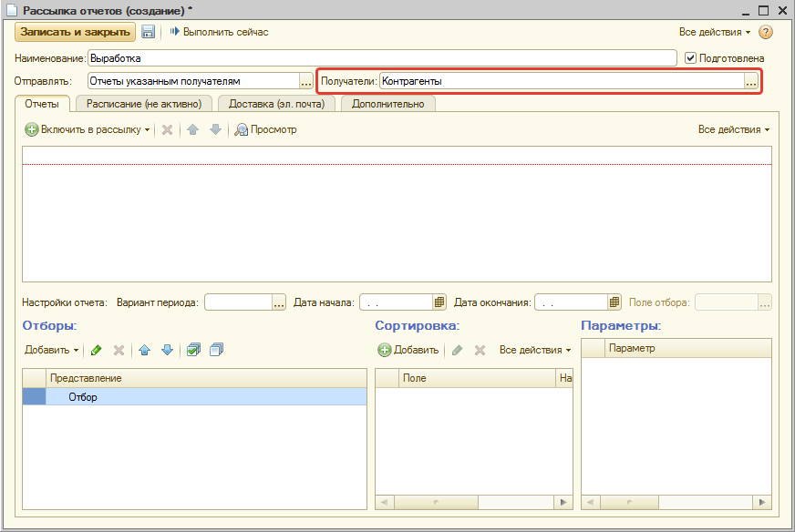

Добавим преднастроенные варианты отчетов для рассылки:

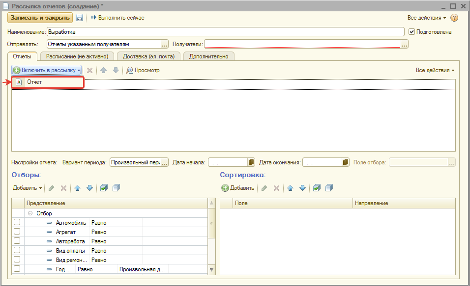

Для примера будем отправлять вариант отчета по выработке автосервиса:

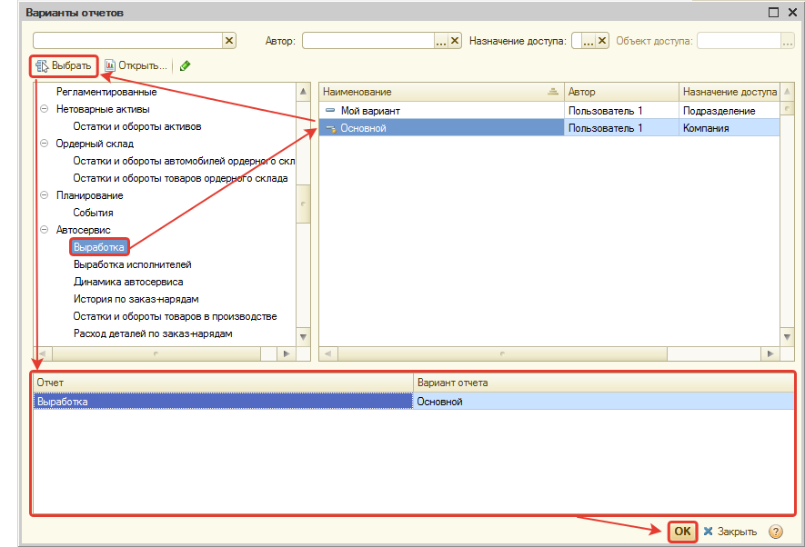

По добавленному варианту отчета при необходимости можно установить отборы и сортировку:

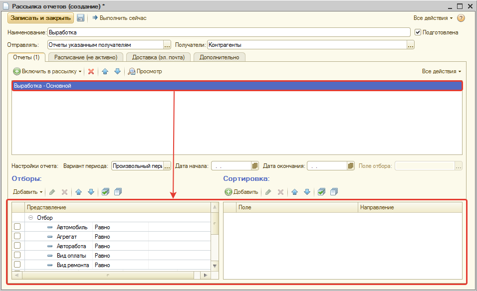

Установим период формирования отчета, например, "Вчера":

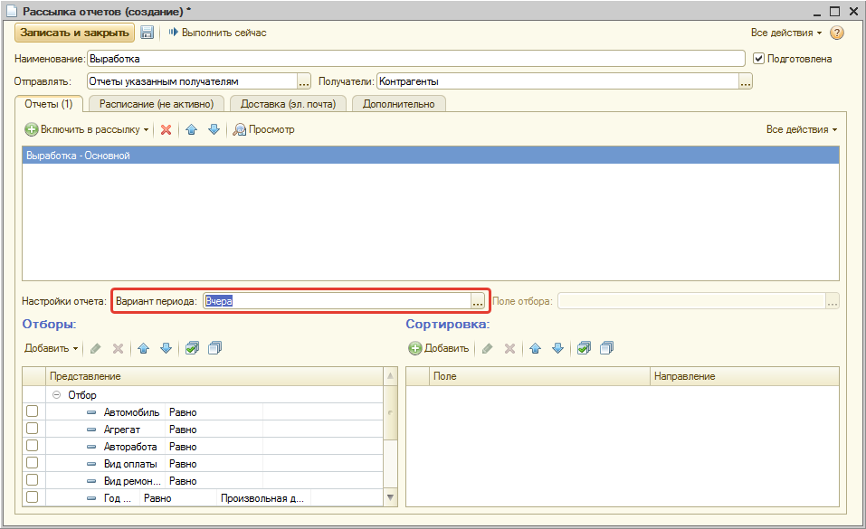

## Расписание

На второй вкладке "Расписание" можно настроить расписание для автоматического формирования рассылки. Настроим ежедневную рассылку:

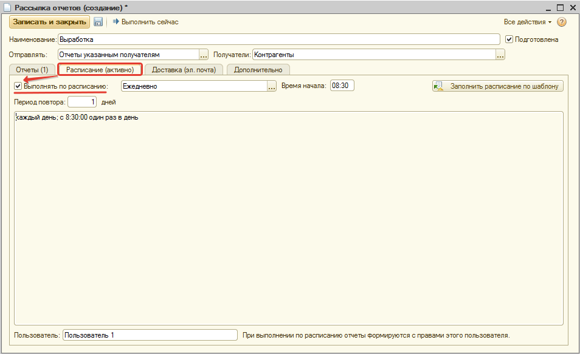

## Доставка через мессенджер

На третьей вкладке "Доставка" настроим отправку рассылки через мессенджеры.

Установим флажок у параметра "Отправлять через мессенджер", а у параметров "Отправлять по электронной почте" и "Публиковать" снимем флажок:

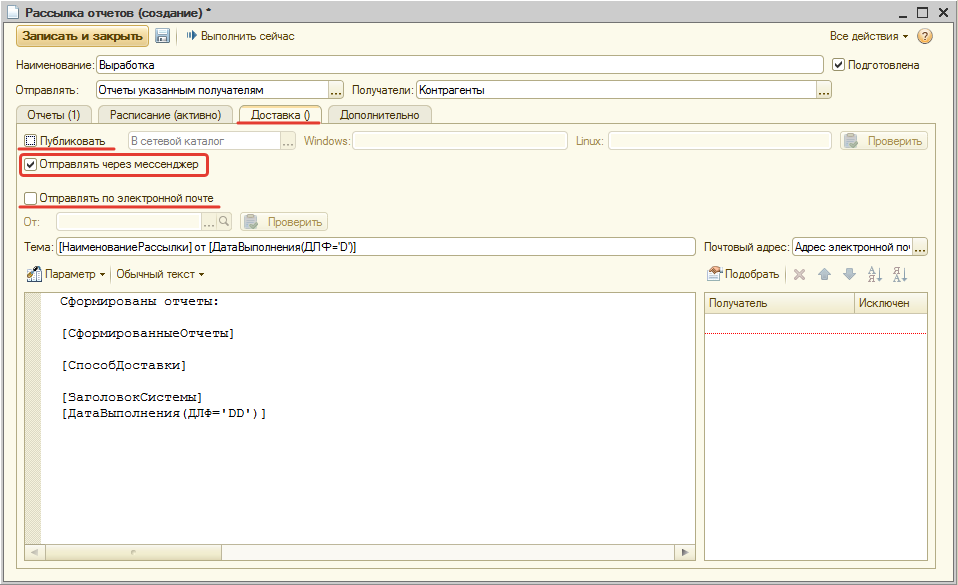

Добавим контрагентов, которым будет рассылаться отчет. При нажатии на кнопку "Подобрать" открывается справочник, в соответствии со значением, выбранным в параметре "Получатели" – если в качестве получателей выбраны контрагенты, открывается справочник "Контрагенты".

Необходимо выбрать контрагентов, для которых создан чат с мессенджером:

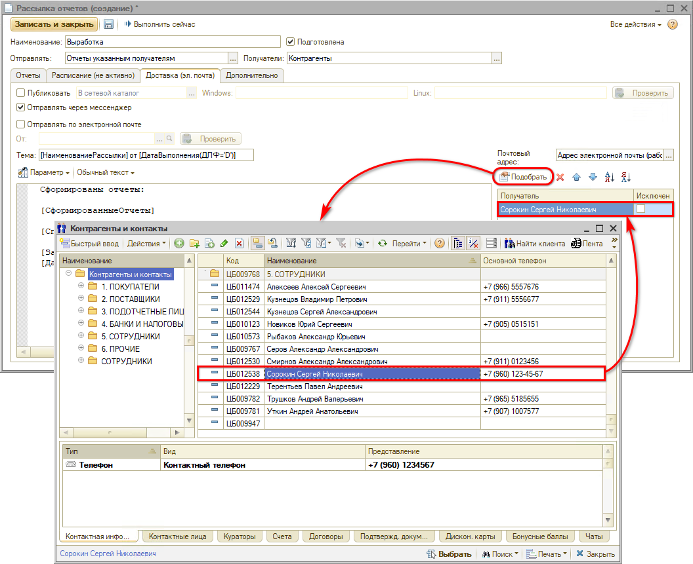

## Дополнительные параметры

На четвертой вкладке "Дополнительно" выберем формат файла с отчетом, который будет присылаться в рассылке:

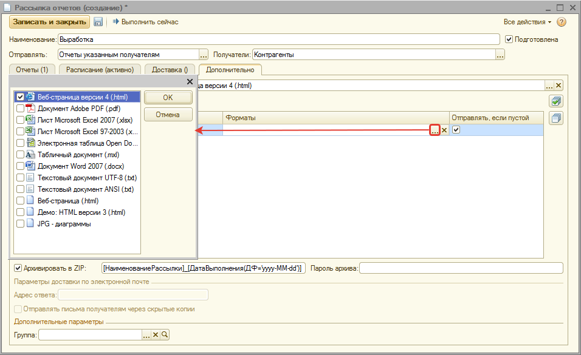

При необходимости можно помещать файлы с отчетами в архив ZIP и устанавливать на него пароль:

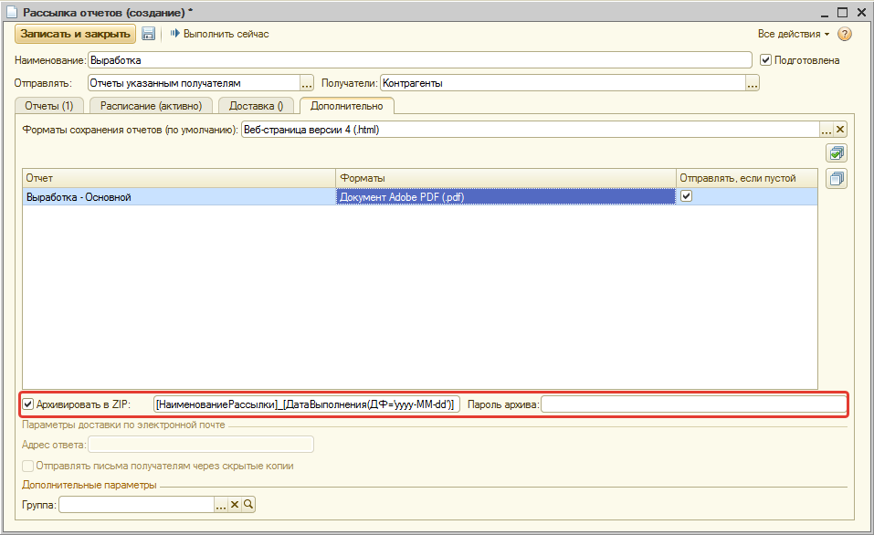

Готово! Все настройки внесены, теперь просто сохраним, нажав кнопку "Записать и закрыть".

---

**Теги:** рассылка отчетов, мессенджеры, отчеты, регламентное задание, telegram, whatsapp, автоматическая отправка

