

# Создание приложения компании в VK

<table><tr><td><b>Время чтения:</b> 14 мин.</td><td><b>Обновлено:</b> 08.08.2025</td></tr></table>

Источник: https://www.5systems.ru/help/sozdanie-prilozheniya-kompanii-v-vk

> *Функционал доступен начиная с **релиза 2.8.3** в рамках **комплексной** **подписки "[Контакт-центр 5S Chat](https://www.5systems.ru/services/kontakt-centr-5s-chat)"** (актуальные тарифы см. в [Каталоге услуг](https://www.5systems.ru/services?field_tags_target_id%5B21%5D=21&sort_by=created&sort_order=ASC))*

## Содержание

1. [Введение](#введение)
2. [Настройка](#настройка)
   - [1. Создание приложения VK](#1-создание-приложения-vk)
      - [1) Регистрация приложения](#1-регистрация-приложения)
      - [2) Информация о приложении](#2-информация-о-приложении)
      - [3) Настройка размещения приложения](#3-настройка-размещения-приложения)
      - [4) Оформление приложения](#4-оформление-приложения)
      - [5) Модерация](#5-модерация)
   - [2. Добавление приложения в сообщество](#2-добавление-приложения-в-сообщество)
   - [3. Настройка обложки для кнопки](#3-настройка-обложки-для-кнопки)
   - [4. Настройка интеграции в программе](#4-настройка-интеграции-в-программе)

## Введение

См. основную статью: [Интеграция с сообществом ВКонтакте (VK)](../Интеграция%20с%20сообществом%20ВКонтакте%20%28VK%29/integraciya-s-soobschestvom-vkontakte-vk.md).

В процессе настройки интеграции с сообществом компании VK предусмотрено подключение веб-приложения [5S Link](https://www.5systems.ru/help/nastroyka-prilozheniya-5s-link-v2). По умолчанию подключается приложение в стандартном виде без оформления. При необходимости подключения брендового приложения требуется произвести дополнительные настройки.

См. документацию на сайте VK:

- [https://dev.vk.com/ru/mini-apps/settings/general/information](https://dev.vk.com/ru/mini-apps/settings/general/information)
- [https://dev.vk.com/ru/mini-apps/getting-started#2.%20Зарегистрируйте%20мини-приложение%20ВКонтакте](https://dev.vk.com/ru/mini-apps/getting-started#2.%20%D0%97%D0%B0%D1%80%D0%B5%D0%B3%D0%B8%D1%81%D1%82%D1%80%D0%B8%D1%80%D1%83%D0%B9%D1%82%D0%B5%20%D0%BC%D0%B8%D0%BD%D0%B8-%D0%BF%D1%80%D0%B8%D0%BB%D0%BE%D0%B6%D0%B5%D0%BD%D0%B8%D0%B5%20%D0%92%D0%9A%D0%BE%D0%BD%D1%82%D0%B0%D0%BA%D1%82%D0%B5)

## Настройка

### 1. Создание приложения VK

#### 1) Регистрация приложения

Для создания приложения необходимо перейти на портал разработчиков [dev.vk.com](http://dev.vk.com) и нажать кнопку *“Создать приложение”:*

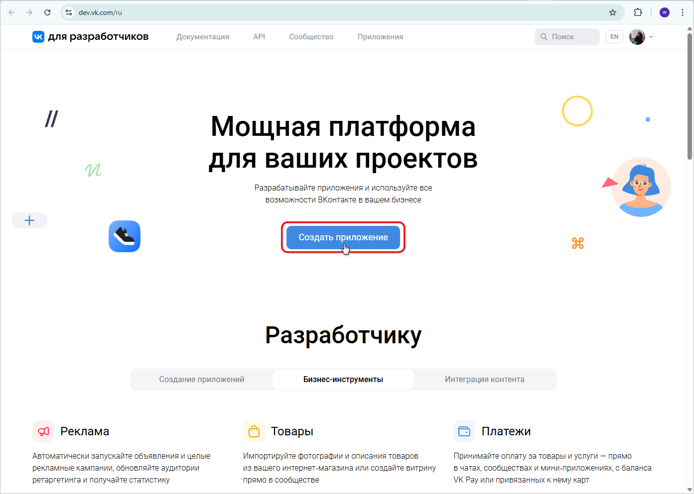

В появившемся окне создания приложения требуется ввести название приложения и выбрать категорию:

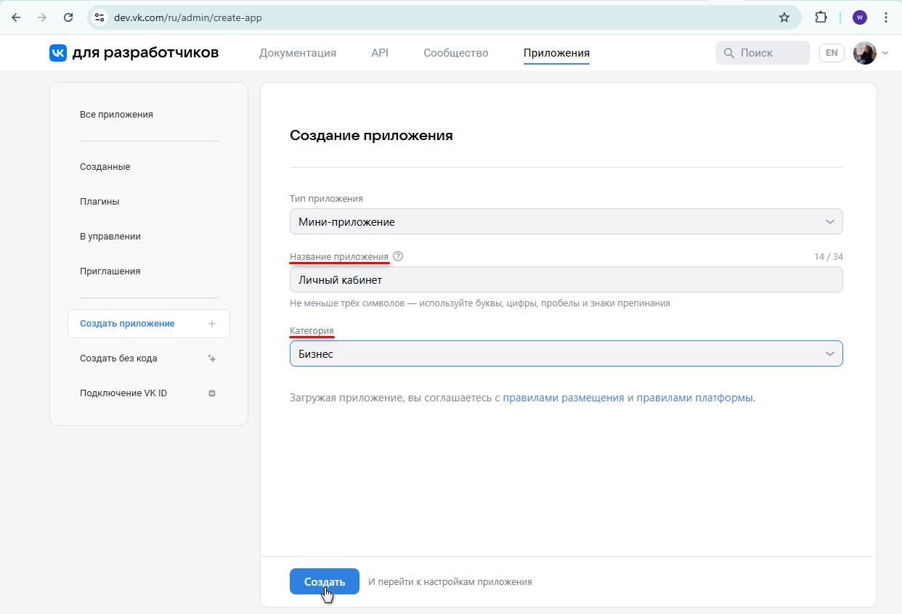

После заполнения реквизитов следует нажать кнопку *“Создать”.* Во всплывающем окне “Подтверждение действия” необходимо выбрать способ подтверждения и одобрить действие.

Регистрация приложения завершена. Откроется панель управления приложением:

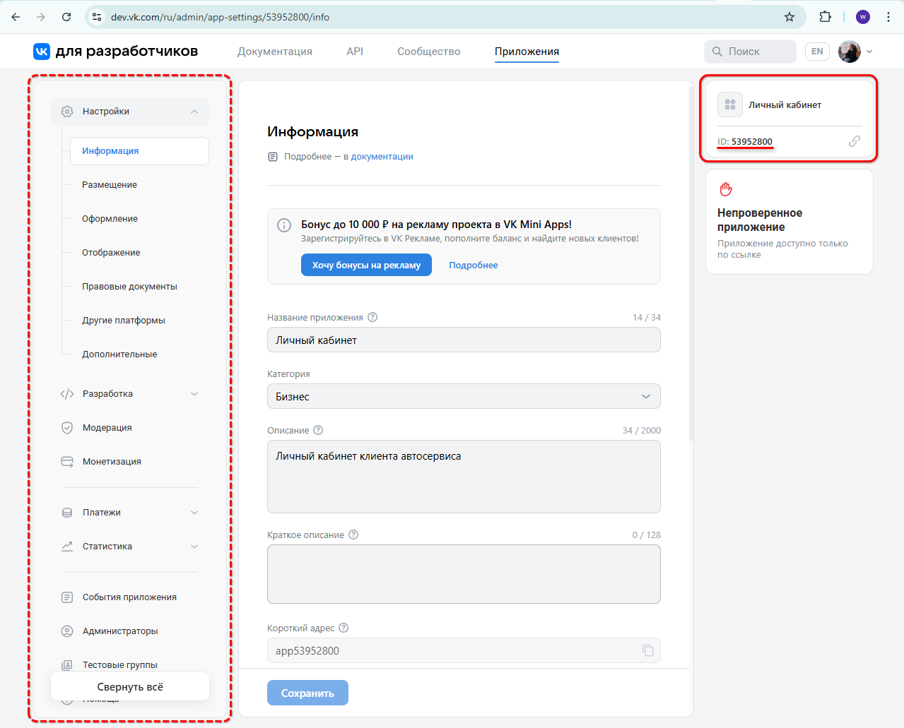

При регистрации приложения платформа автоматически генерирует его ***идентификатор**.* Он будет необходим для дальнейшей настройки интеграции (см. [ниже](#4-настройка-интеграции-в-программе)).

#### 2) Информация о приложении

В разделе *“Информация”* следует заполнить описание и краткое описание приложения:

- *Описание* отображается в разделе *“О приложении”* (см. [ниже](#inf)). Здесь рекомендуется пояснить, для чего можно использовать приложение и кому оно пригодится;
- *Краткое описание* видно пользователям на экране запуска и в каталоге сервисов (см. [ниже](#opisanie)). Здесь рекомендуется описать задачу, которую решает приложение, и добавить призыв к действию.

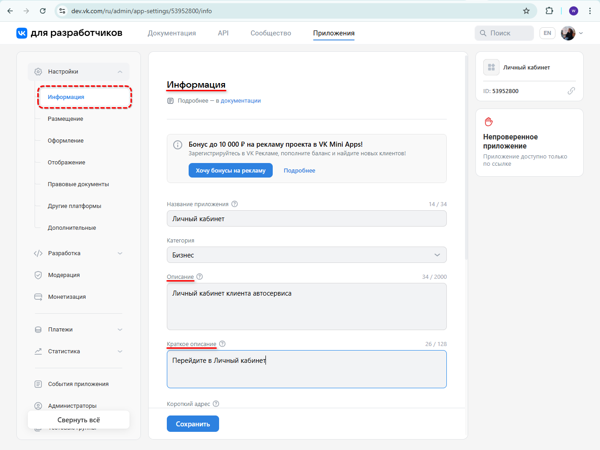

Ниже на этой же странице следует заполнить параметр *“Официальное сообщество”* – выбрать сообщество своей компании:

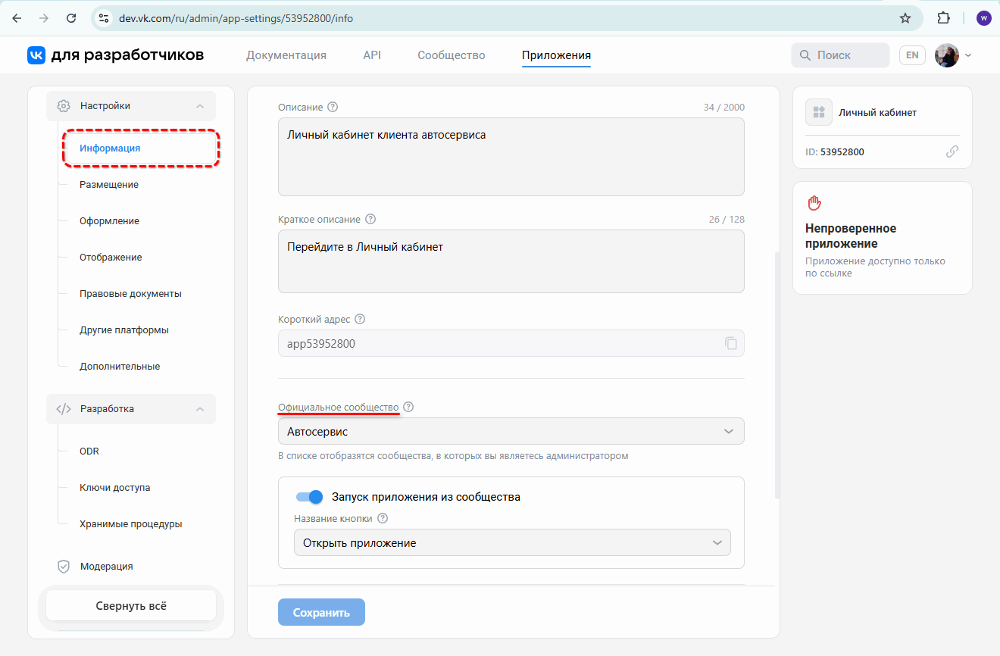

От имени официального сообщества можно будет публиковать новости и писать пользователям в личные сообщения, также выбранное сообщество будет указано в строке “Автор приложения”/"Разработчик" (см. [ниже](#razrab)).

Также необходимо активировать переключатель *“Запуск приложения из сообщества”* и выбрать название кнопки, например *“Открыть приложение”:*

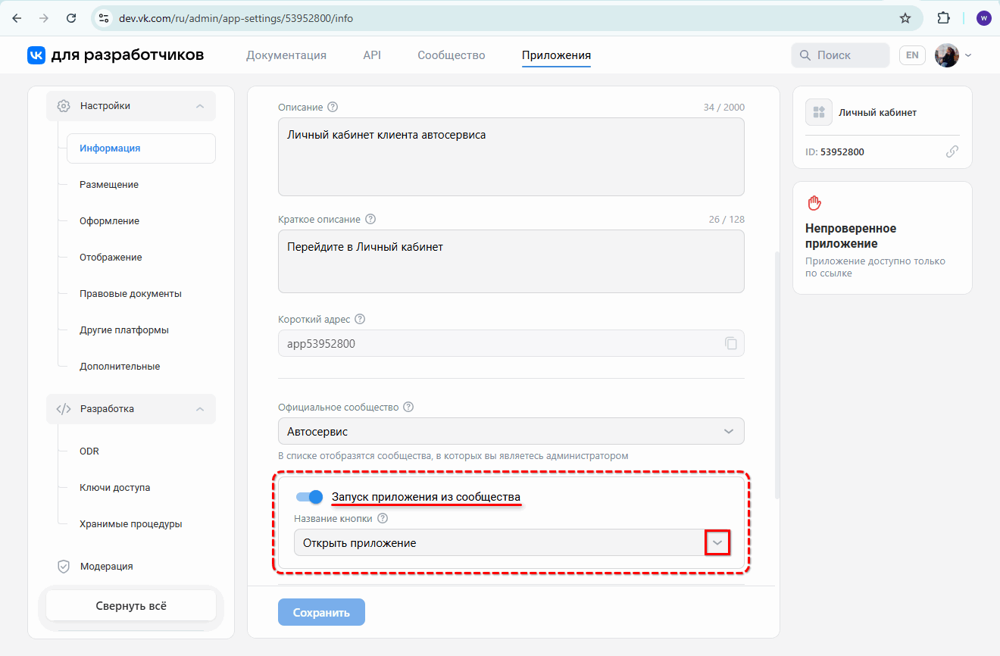

Данная настройка необходима для добавления приложения в сообщество, выбранное название будет отображаться на кнопке запуска приложения в меню в верхней части сообщества под обложкой и названием – см. ниже в разделе “[Добавление приложения в сообщество](#2-добавление-приложения-в-сообщество)”.

Внесенные изменения необходимо записать нажатием на кнопку *“Сохранить”* внизу раздела настройки “Информация”.

#### 3) Настройка размещения приложения

Для дальнейшей настройки следует перейти в раздел *“Размещение”.*

В блоке *“Состояние для пользователей”* необходимо переключить состояние на *“Включено”:*

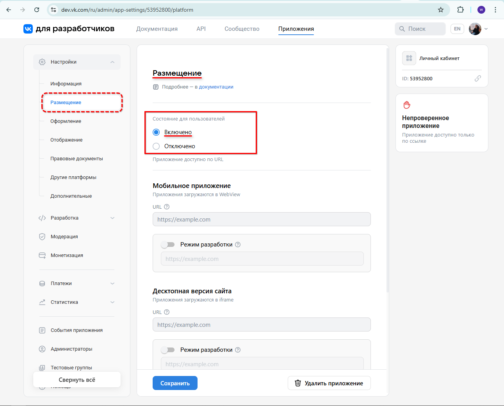

В блоках *“Мобильное приложение”, “Десктопная версия сайта”* и *“Мобильная версия сайта”* необходимо прописать *URL-адрес приложения 5S Link* (см. в статье *“[Настройка приложения 5S LINK v2 → DNS-имя](https://www.5systems.ru/help/nastroyka-prilozheniya-5s-link-v2#dns)”):*

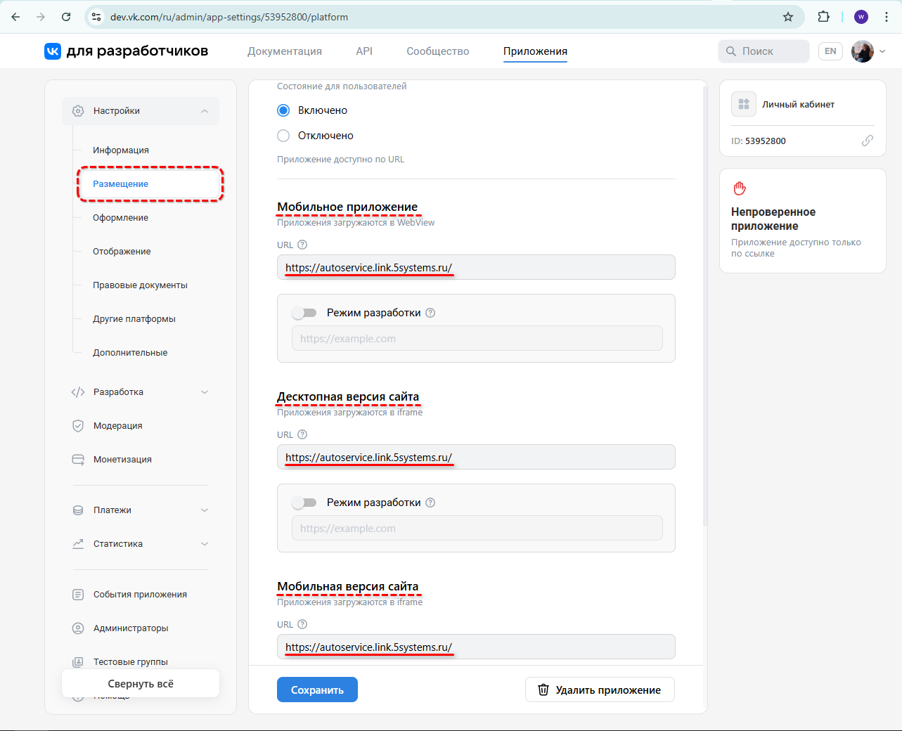

Внесенные изменения необходимо *записать* нажатием на кнопку *“Сохранить”* внизу раздела.

#### 4) Оформление приложения

Далее следует перейти в раздел *“Оформление”:*

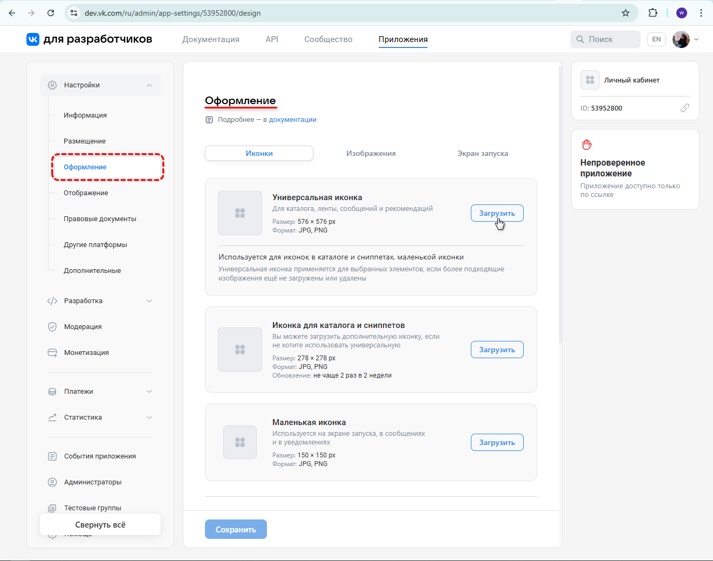

В данном разделе необходимо загрузить все иконки и обложки для узнаваемости приложения (см. [ниже](#brendir_pril)). Требования к размерам и форматам изображений прописаны в разделе для каждого вида иконок.

*Примечание:* При загрузке “Универсальной иконки” маленькие подгружаются автоматически.

Можно использовать логотип компании или другое изображение в стилистике вашего бренда:

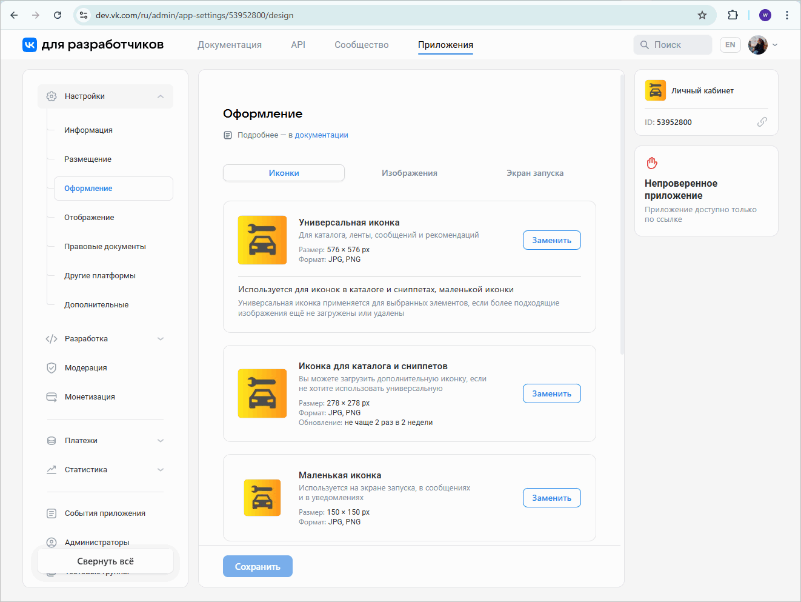

На вкладке *“Изображения”* необходимо загрузить следующие изображения:

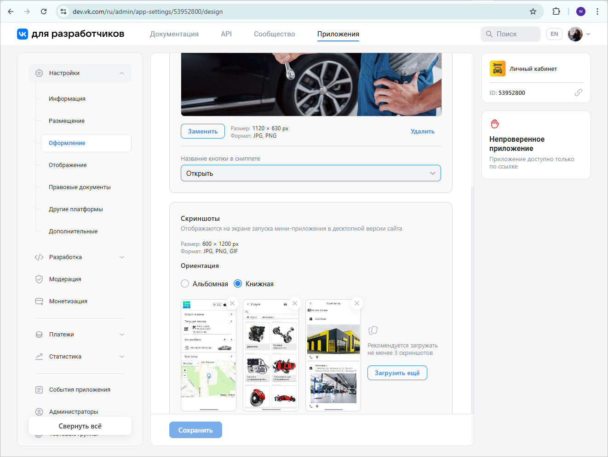

- *Большой сниппет* – изображение, которое отображается, если ссылку на приложение публикуют на стене пользователя или сообщества;
-  *Скриншоты* – изображения, которые отображаются во всплывающей карточке мини-приложения, на экране “О приложении” в каталоге мини-приложений и на экране “О приложении” в каталоге плагинов для сообществ:

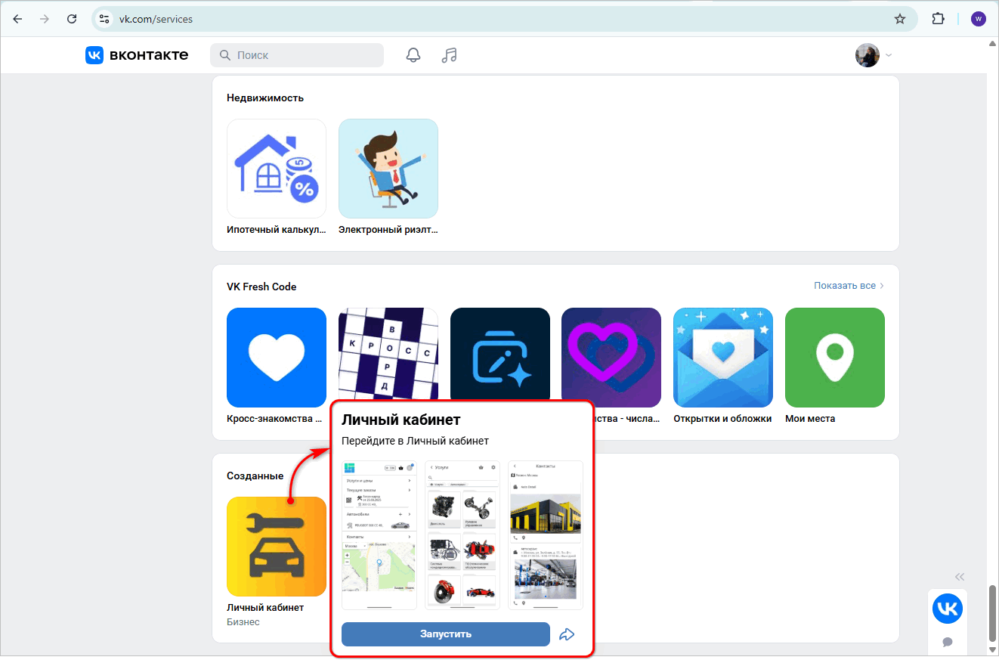

Требования к размерам и форматам изображений указаны в каждом разделе настройки. Подробное описание см. на сайте сервиса:

- [https://dev.vk.com/ru/mini-apps/settings/general/design#Изображения](https://dev.vk.com/ru/mini-apps/settings/general/design#%D0%98%D0%B7%D0%BE%D0%B1%D1%80%D0%B0%D0%B6%D0%B5%D0%BD%D0%B8%D1%8F);
- [https://dev.vk.com/ru/mini-apps/settings/design-examples#Карточка%20мини-приложения](https://dev.vk.com/ru/mini-apps/settings/design-examples#%D0%9A%D0%B0%D1%80%D1%82%D0%BE%D1%87%D0%BA%D0%B0%20%D0%BC%D0%B8%D0%BD%D0%B8-%D0%BF%D1%80%D0%B8%D0%BB%D0%BE%D0%B6%D0%B5%D0%BD%D0%B8%D1%8F).

#### 5) Модерация

Требования к обязательным настройкам приложения прописаны в разделе *“Модерация”:*

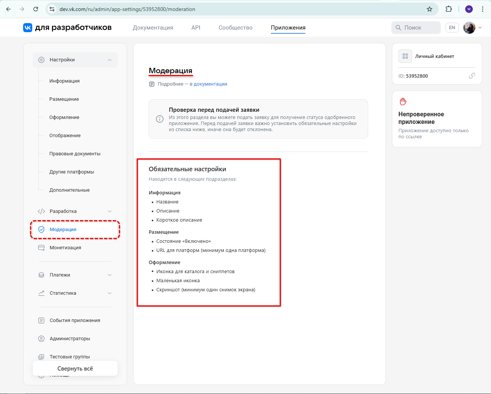

После завершения всех обязательных настроек данный раздел выглядит следующим образом:

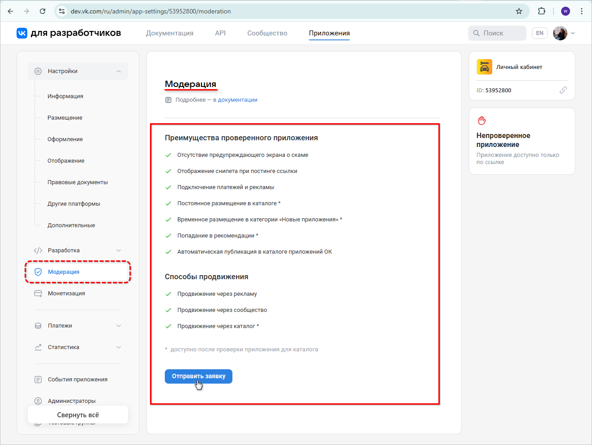

При нажатии кнопки *“Отправить заявку”* производится переход к заполнению заявки на модерацию. Проверка приложения и подтверждение может занять несколько часов.

В случае успешного подтверждения приложения приходит оповещение от техподдержки VK (перейти к переписке можно по кнопке в разделе *“Модерация” → блок “Тикет”),* *статус проверки* заявок по платформам изменяется на “Проверено”, статус приложения – на *“Проверенное приложение”:*

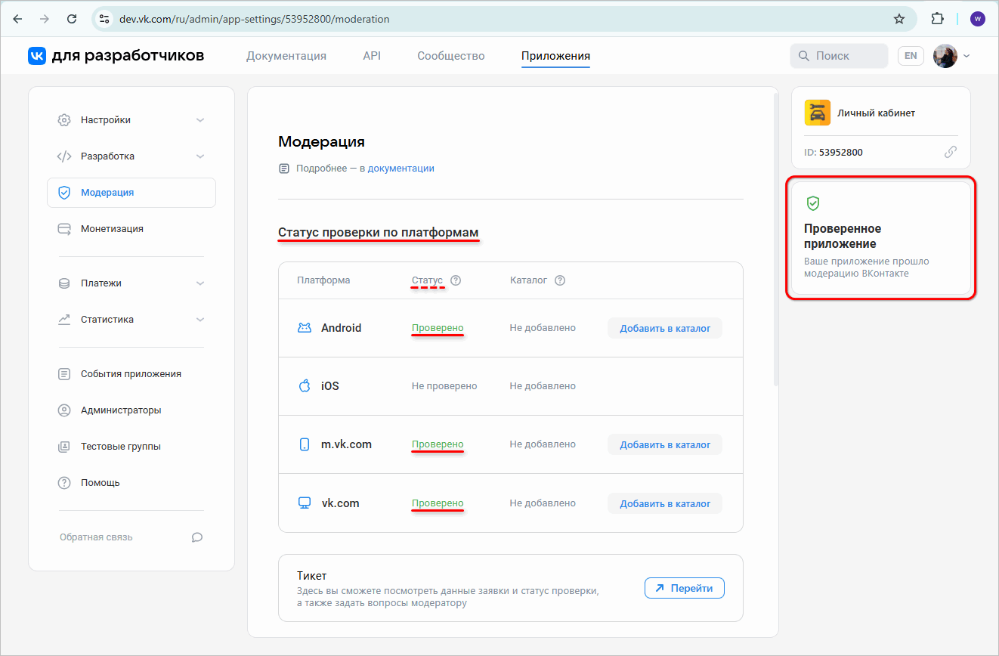

После этого можно переходить к *подключению созданного приложения в сообщество* (см. [далее](#2-добавление-приложения-в-сообщество)).

### 2. Добавление приложения в сообщество

Для подключения приложения в сообщество следует открыть созданное приложение в браузере и перейти по кнопке *“Действия → Добавить в сообщество”:*

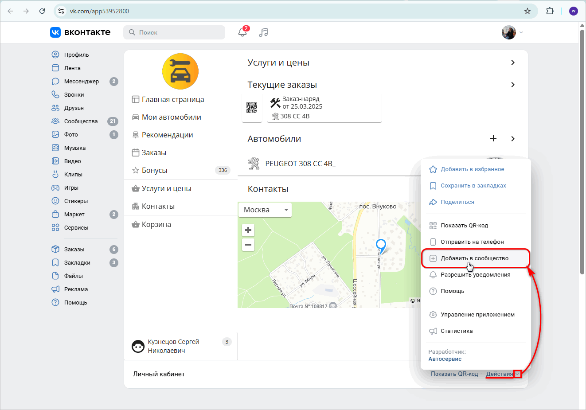

Открывается страница в контексте добавляемого приложения со списком сообществ, в которых текущий пользователь является администратором. Требуется выбрать нужное сообщество и нажать кнопку *“Добавить”:*

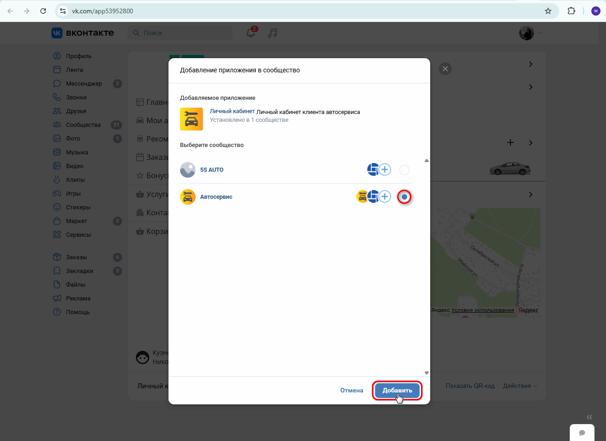

Выходит сообщение об успешном добавлении приложения 5S Link в сообщество.

В меню сообщества (под обложкой и названием) появляется *кнопка запуска приложения:*

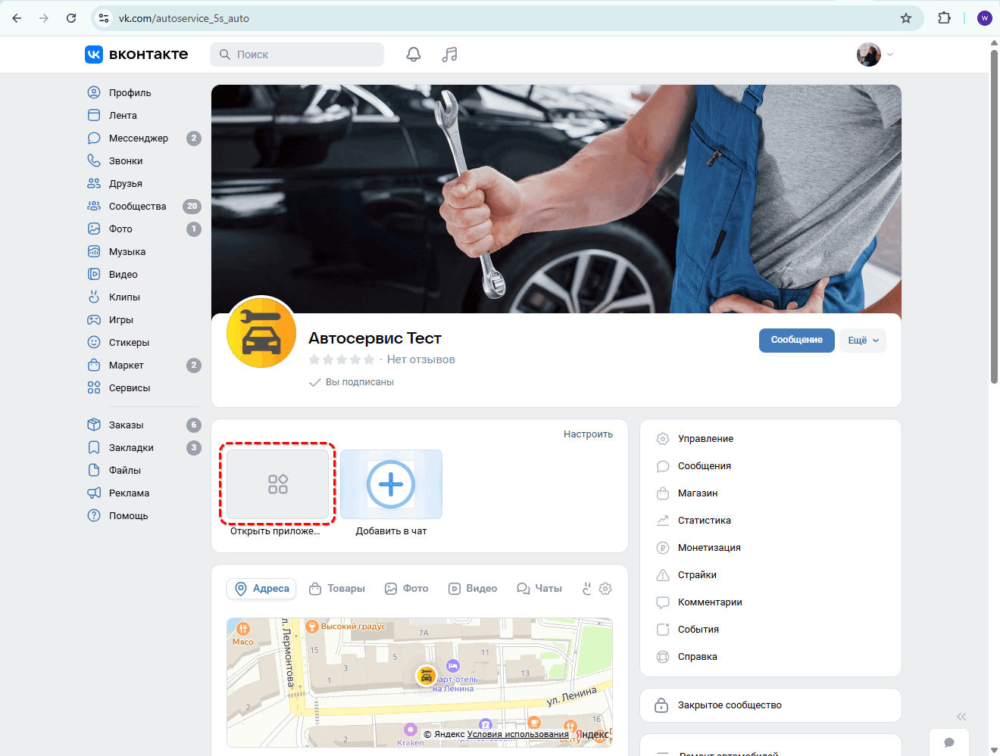

### 3. Настройка обложки для кнопки

Для кнопки есть возможность добавить *обложку* через *настройки пунктов меню* – см. [инструкцию](https://expert.vk.com/articles/kak-sdelat-menyu-soobschestva-vkontakte/?utm_source=vk&utm_medium=onboarding&utm_campaign=articles&utm_content=kak-sdelat-menyu-soobschestva-vkontakte) на сайте сервиса.

*Меню* – это навигационный блок вверху страницы сообщества, который содержит основные тематические разделы. Пункты располагаются в карусели и визуально напоминают кнопки. Меню может быть не только функциональным, но и поддерживать визуальную концепцию сообщества.

Для настройки меню следует нажать кнопку *“Настроить”* в данном блоке либо перейти в раздел сообщества *“Управление → Меню”:*

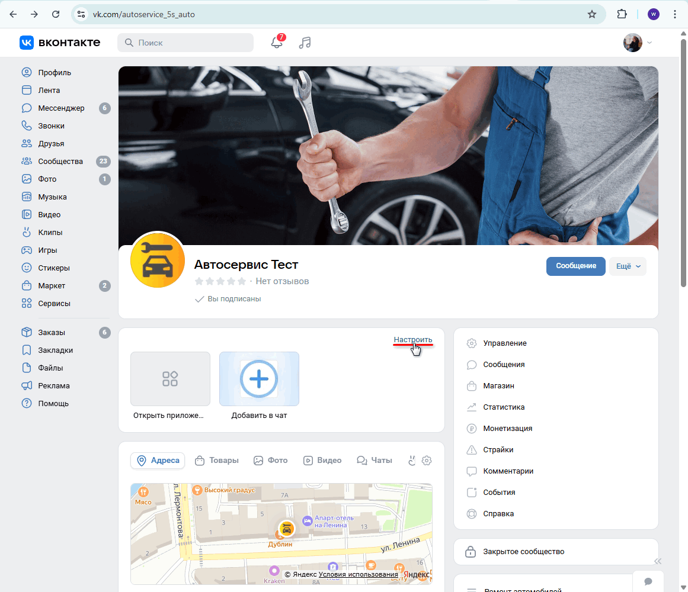

*Примечание:* Настраивать меню можно только через компьютерную версию сайта VK.

Открывается страница настройки пунктов меню. Напротив пункта с приложением нужно нажать кнопку *“Изменить”* – при этом разворачиваются параметры настройки:

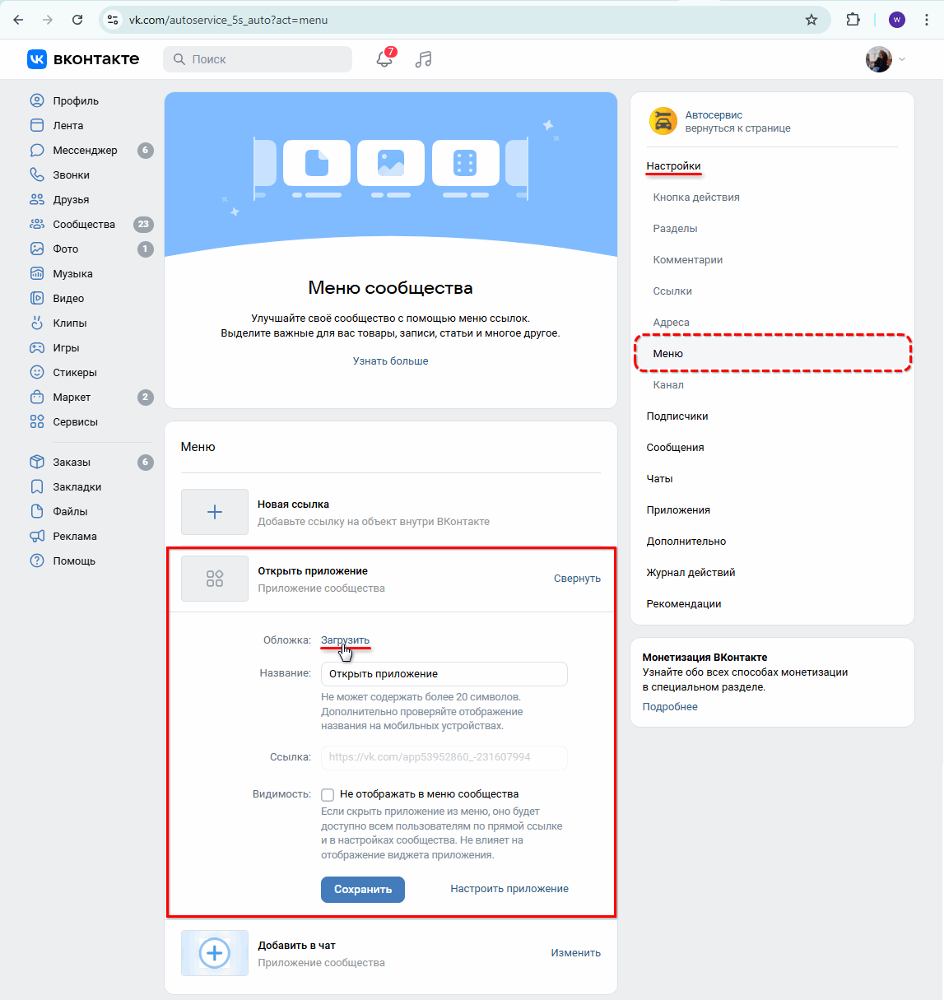

Есть возможность изменить *название пункта меню* – описание длиной до 20 символов, и добавить *обложку* – иконку, фото или картинку:

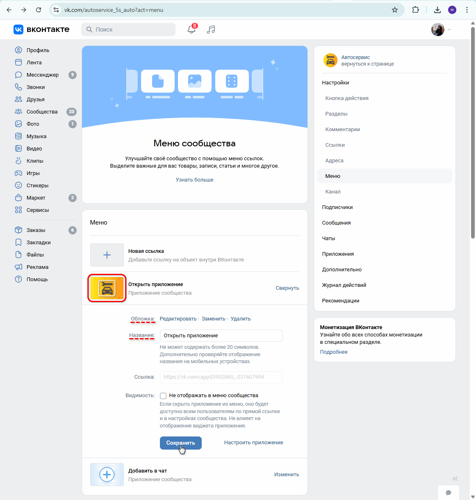

*Скачать предлагаемую в примере обложку можно по ссылке: [Обложка для меню](https://www.5systems.ru/sites/default/files/help/2025/%D0%9E%D0%B1%D0%BB%D0%BE%D0%B6%D0%BA%D0%B0_%D0%BF%D1%80%D0%B8%D0%BB%D0%BE%D0%B6%D0%B5%D0%BD%D0%B8%D1%8F_VK.zip).*

Также есть возможность сделать обложку в индивидуальном оформлении своей компании. Обычно меню стилизуют под общее оформление сообщества. Если нет возможности привлечь профессионального дизайнера, можно сделать обложки самостоятельно в любом удобном редакторе изображений.

Также есть специализированные веб-сервисы, в которых можно самостоятельно разработать обложки для меню, например, [вкменю.рф](https://xn--b1agoig6h.xn--p1ai/), одобренный VK. В конструкторе обложек можно выбрать цвет, сделать надпись одним из встроенных шрифтов, использовать иконки ВКонтакте.

ВКонтакте разрешает использовать в меню иллюстрации с минимальным *разрешением* 376х256 пикселей. Можно загружать файлы в *форматах* JPG, GIF или PNG.

Несколько советов для тех, кто создает обложки самостоятельно:

- Используйте иллюстрации с минимальным количеством деталей и максимально простыми шрифтами. Разглядывать мелочи на экране смартфона пользователям будет сложно.
- Если планируете сделать навигационную панель из иконок, оформите их в виде кнопок. Посетители сообщества подсознательно захотят на них нажать.
- Протестируйте обложки и названия на компьютере и мобильном устройстве. В разных версиях они могут отображаться некорректно, поэтому лучше сразу увидеть ошибки и заменить элементы.

В результате загруженная обложка появится на кнопке перехода в приложение в меню сообщества:

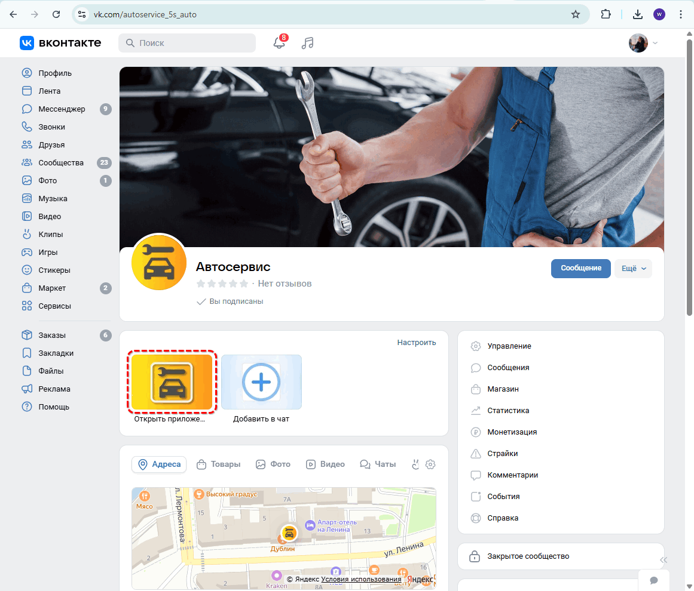

### 4. Настройка интеграции в программе

После подключения приложения в сообществе требуется изменить *настройки интеграции* с сообществом VK в программе.

Для этого следует скопировать *ID приложения* ВКонтакте:

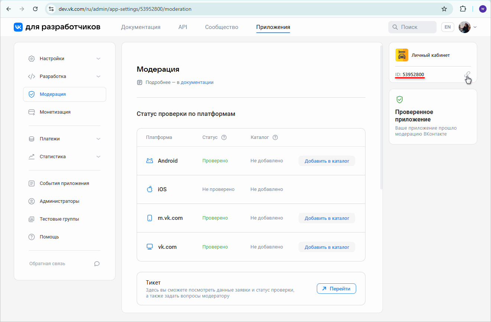

Затем перейти в программе в настройках *интеграции с VK* к *редактированию учетной записи* (подробнее см. в [основной статье](../Интеграция%20с%20сообществом%20ВКонтакте%20%28VK%29/integraciya-s-soobschestvom-vkontakte-vk.md#5-редактирование-настройки)), переключить флаг *“Приложение → Индивидуальное”* и ввести скопированный ID в поле *“Идентификатор приложения”:*

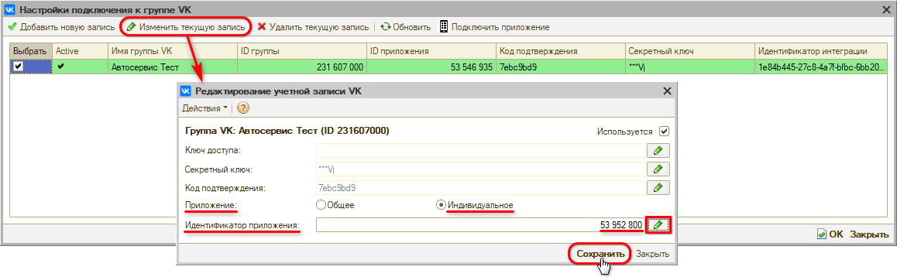

Внесенные изменения необходимо *сохранить* и нажать кнопку *“ОК”* в окне выбора настройки подключения.

После этого при переходе клиентами в приложение по кнопке в меню сообщества, в чате или в сообщении они будут видеть брендированное приложение с фирменными иконками компании, заданным наименованием приложения и указанием названия сообщества в строке “Разработчик приложения”.

***Примеры отображения:***

**1)** Иконка на странице загрузки:

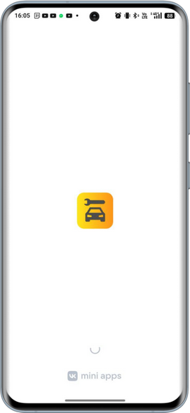

**2)** Информация о приложении:

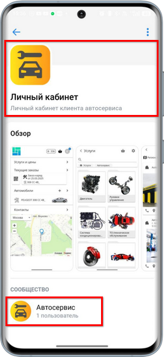

**3)** Информация о разработчике приложения:

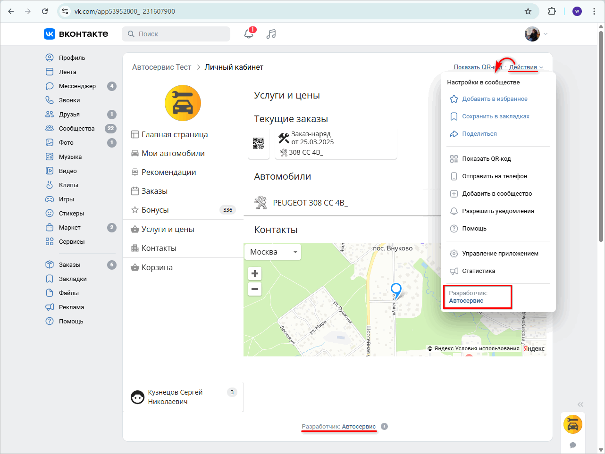

---

**Теги:** ВКонтакте, VK, приложение компании, ключ доступа, интеграция

