

# Шаблоны сообщений

<table><tr><td><b>Время чтения:</b> 16 мин.</td><td><b>Обновлено:</b> 18.01.2024</td></tr></table>

Источник: https://www.5systems.ru/help/shablony-soobscheniy

## Содержание

1. [Введение](#введение)
2. [Настройка соответствий](#настройка-соответствий)
   - [Соответствие по реквизиту](#соответствие-по-реквизиту)
   - [Соответствие через действие](#соответствие-через-действие)
      - [Создание действия](#создание-действия)
3. [Использование соответствий в тексте шаблона](#использование-соответствий-в-тексте-шаблона)
4. [Тестирование шаблона](#тестирование-шаблона)
5. [Настройка заменяемости](#настройка-заменяемости)

## Введение

Для отправки сообщений клиентам вручную или автоматически в программе используются преднастроенные ***шаблоны сообщений***.

*Примечание: В данной статье рассматривается настройка типичных шаблонов сообщений. Настройка шаблонов WhatsApp Business API имеет свои специфические особенности, которым посвящена отдельная статья "[Настройка шаблонов WhatsApp Business API](../Настройка%20шаблонов%20WhatsApp%20Business%20API/nastroyka-shablonov-whatsapp-business-api.md)".*

Шаблоны сообщений создаются и настраиваются в справочнике "Шаблоны текстовых сообщений" *(Администрирование → Компания → CRM → Шаблоны сообщений):*

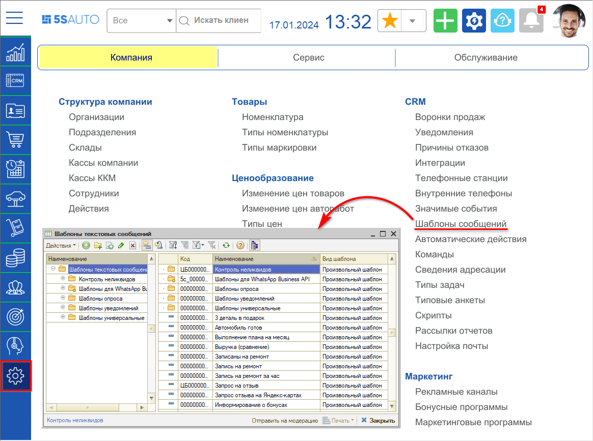

При настройке шаблона обязательно указывается наименование и текст сообщения. Для того, чтобы сформировать текст сообщения на основе данных о клиенте, документе или других данных, первоначально необходимо задать параметры шаблона в табличной части (см. [*Настройка соответствий*](#настройка-соответствий)*):*

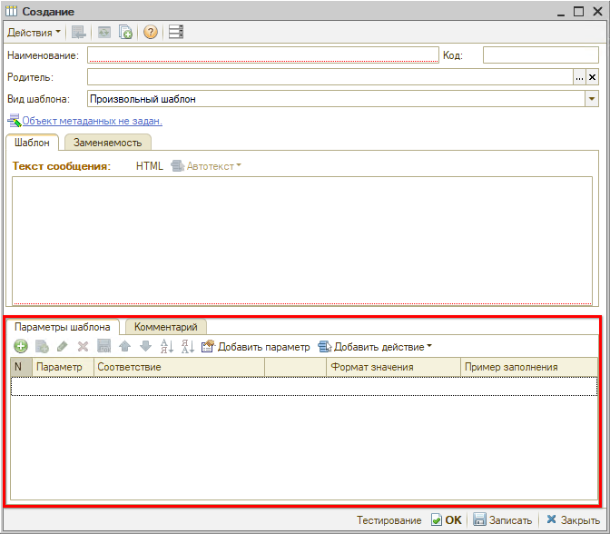

После настройки соответствий возможно их [использование в тексте сообщения](#использование-соответствий-в-тексте-шаблона).

## Настройка соответствий

Соответствие можно задать через *реквизит* какого-то одного объекта системы (справочник, документ, обработка, бизнес-процесс) ИЛИ через *действие*.

### Соответствие по реквизиту

Соответствие по реквизиту удобно использовать при создании шаблона для автоматической отправки сообщений по значимым событиям: изменение состояния документа, изменение реквизита в справочнике. В этом случае устанавливается объект метаданных тот же, что в значимом событии. В качестве соответствий добавляются реквизиты выбранного объекта.

Рассмотрим пример создания соответствий для значимого события "Автомобиль готов": автомобиль готов к выдаче, если после проведения документа "Заказ-наряд" состояние документа стало "Выполнен".

В качестве объекта метаданных выберем *Документы → Заказ-наряд:*

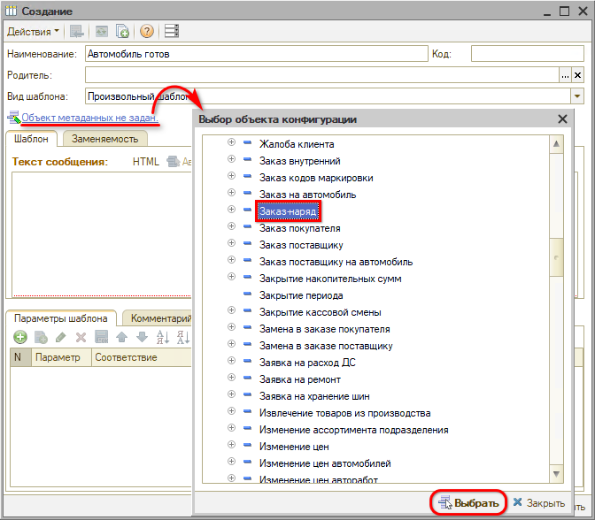

Далее следует добавить в таблицу реквизиты объекта.

Выберите *тип соответствия* "Реквизит объекта", в списке реквизитов выберите подходящий реквизит заказ-наряда:

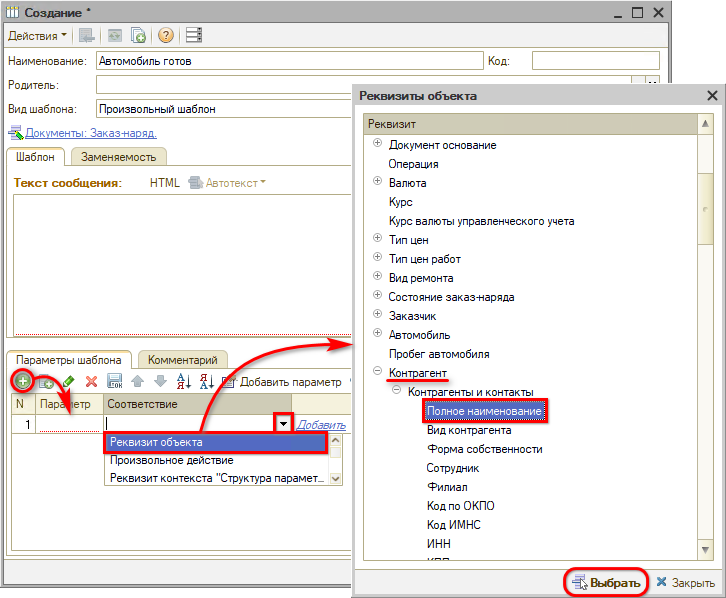

В итоге автоматически заполняется строка с соответствием:

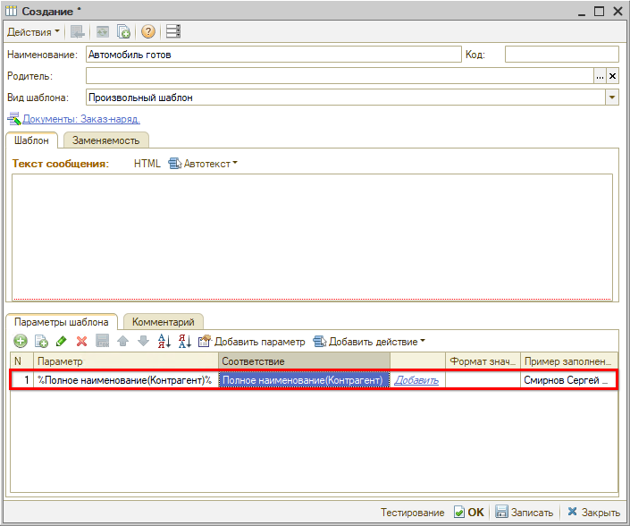

Таким же образом добавим еще несколько реквизитов, которые могут понадобиться для формирования текста сообщения:

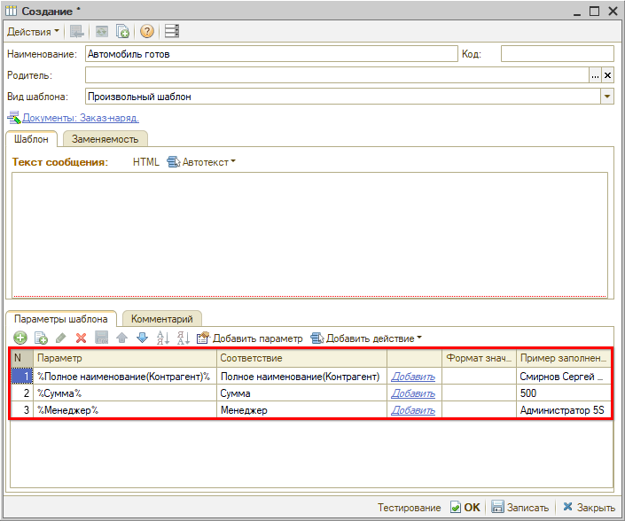

Готово! Теперь можно использовать добавленные значения для составления текста сообщения.

### Соответствие через действие

Если шаблон создается для ручной отправки сообщений клиентам через *Ленту событий* или если среди реквизитов объекта нет подходящего, то в соответствии используются произвольные действия, которые могут сформировать нужные данные.

Произвольные действия — преднастроенные значения в справочнике "Действия", где описывается алгоритм выбора значения для автоподстановки (автотекста).

Среди преднастроенных произвольных действий можно выбрать, например, номер заказ-наряда:

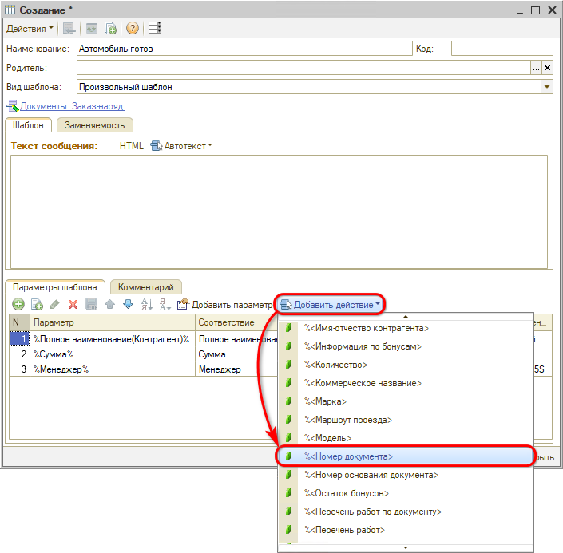

В результате, автоматически добавляется строка в табличную часть "Соответствие" с типом "Произвольное действие":

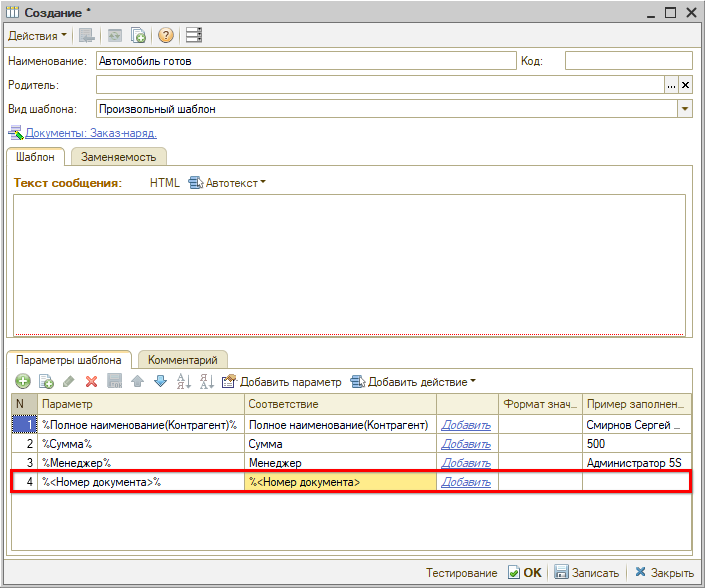

Если среди преднастроенных произвольных действий нет подходящего для формирования текста сообщения, то можно *создать его самостоятельно* через справочник "Действия". Разобраться с тем, как формируется автотекст для действия тоже можно в данном справочнике.

#### Создание действия

Для создания действия перейдите в справочник "Действия" *(Администрирование → Компания → Структура компании → Действия)* и добавьте новый элемент.

На форме создания действия задайте наименование и представление: так действие будет отображаться при выборе в шаблоне. Напишите код 1С, который будет формировать значение для автоподстановки. Для написания кода можно использовать примеры:

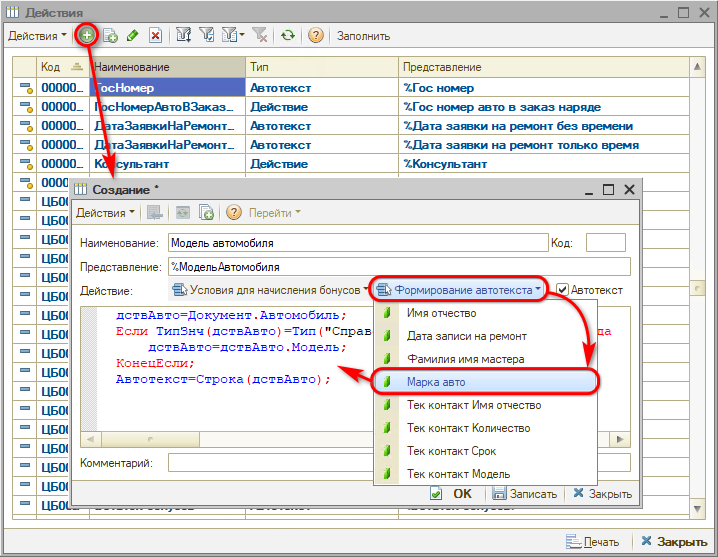

Сохраните изменения.

## Использование соответствий в тексте шаблона

После того как добавлены соответствия, можно использовать их в тексте сообщения шаблона.

Для добавления соответствия есть 2 способа:

1. Нажать кнопку-ссылку "Добавить" рядом с соответствием:

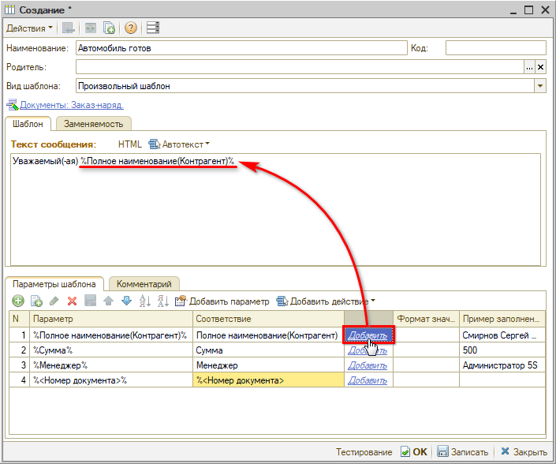

2. Выбрать соответствие в меню "Автотекст":

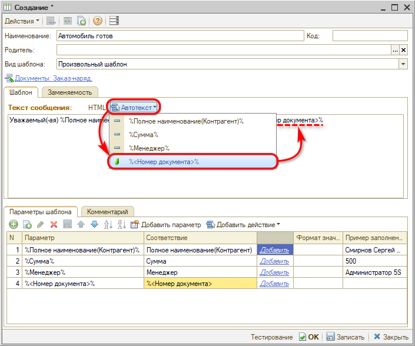

В результате добавления соответствия в тексте сообщения отобразится его "мнемоника", вместо которой в тексте сообщения для пользователя или в процессе тестирования автоматически подставится нужное значение.

После формирования текста сообщения, запишите изменения:

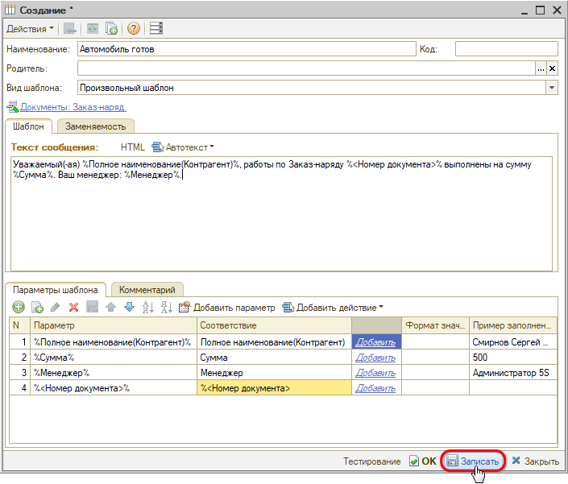

Сохраненные изменения можно протестировать.

## Тестирование шаблона

Чтобы посмотреть как будет выглядеть сообщение, когда вместо соответствий автоматически подставятся реальные значения, воспользуйтесь кнопкой "Тестирование". В результате отобразится текст с автоподстановкой на основе последнего заказ-наряда:

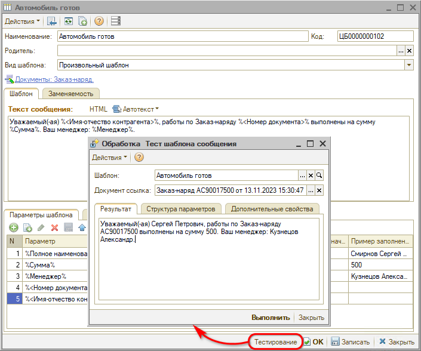

В поле "Документ-основание" можно выбрать другое значение и нажать кнопку "Выполнить" для просмотра текста с автоподстановкой по нему.

## Настройка заменяемости

Для использования шаблона при отправке сообщений через [Ленту событий](../../Работа%20с%20клиентами/Лента%20событий/lenta-sobytiy.md) необходимо произвести настройку на вкладке "Заменяемость" — добавить новую строку, в которую автоматически подтянется шаблон, и включить параметр *"Использовать для отправки из ленты":*

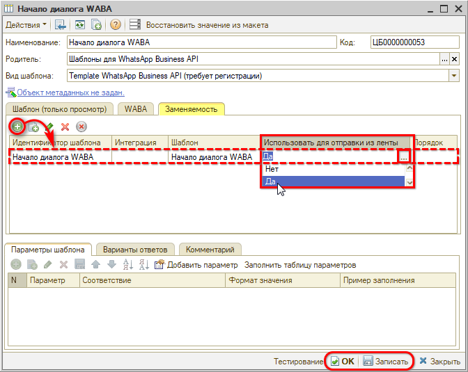

Подробнее см. в статье *[Лента событий → Использование шаблона для отправки сообщения](../../Работа%20с%20клиентами/Лента%20событий/lenta-sobytiy.md#использование-шаблона-для-отправки-сообщения)*.

---

**Теги:** шаблоны сообщений, значимые события, параметры шаблона, рассылка, мессенджеры

