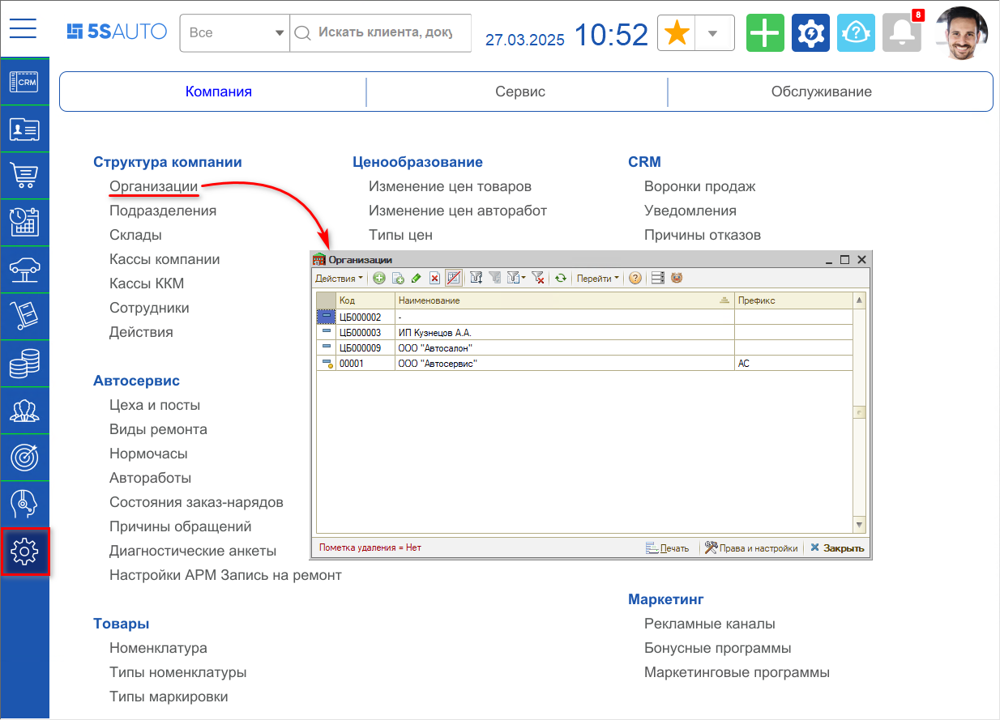
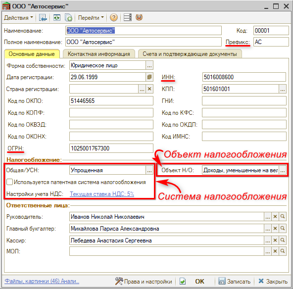
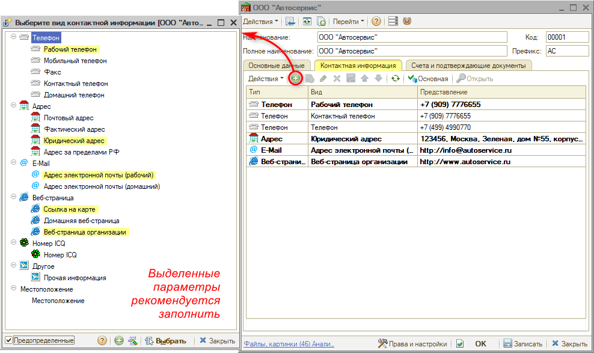
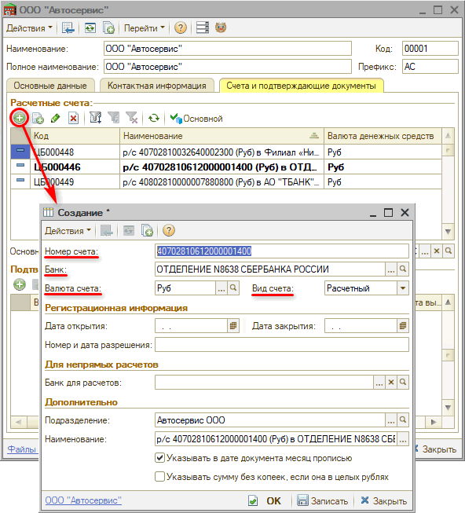
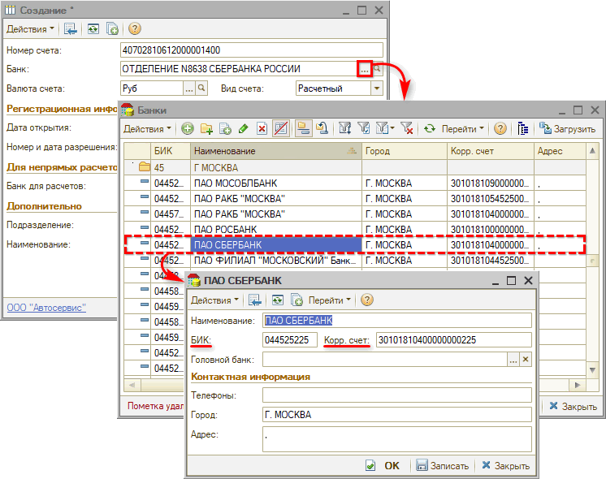
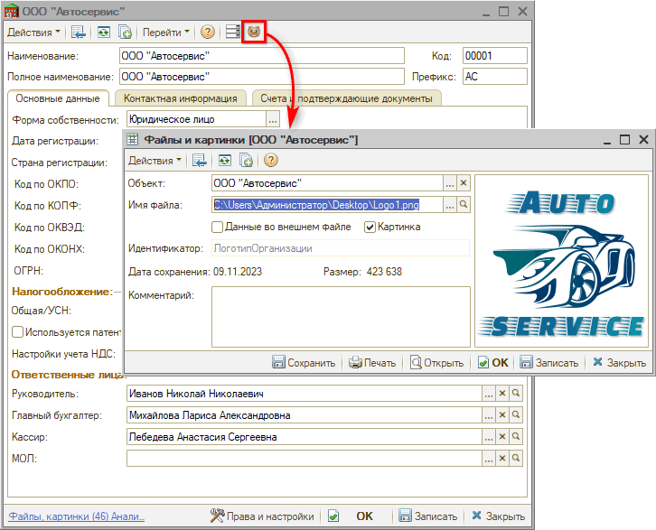
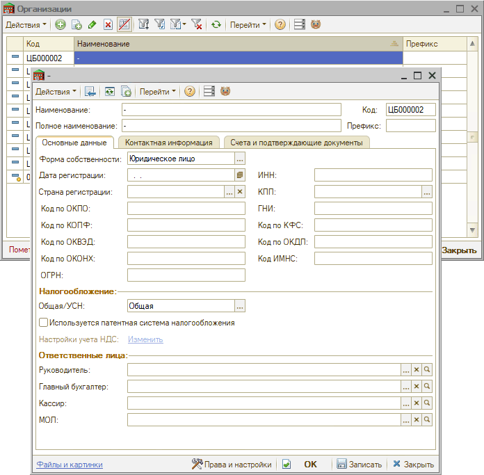
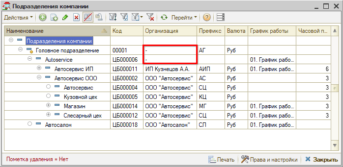

# Справочник "Организации"

<table><tr><td><b>Время чтения:</b> 7 мин.</td><td><b>Обновлено:</b> 27.03.2025</td></tr></table>

Источник: https://www.5systems.ru/help/spravochnik-organizacii

## Содержание

1. [Введение](#введение)
2. [Добавление организации](#добавление-организации)
   - [1. Переход к справочнику "Организации"](#переход-к-справочнику-организации)
   - [2. Основные данные](#основные-данные)
   - [3. Контактная информация](#контактная-информация)
   - [4. Банковские реквизиты](#банковские-реквизиты)
   - [5. Логотип организации](#логотип-организации)
3. [Предопределенный элемент справочника "Организации"](#предопределенный-элемент-справочника-организации)

## Введение

Справочник **"Организации"** содержит список организаций, по которым может производиться учет по компании.

Организациями могут быть:

- юридическое лицо;
- частный предприниматель;
- частное лицо.

В справочнике хранится вся информация, которая идентифицирует организации, а также содержатся дополнительные сведения, необходимые для ведения учета.

## Добавление организации

### Переход к справочнику "Организации"

Справочник "Организации" находится в разделе меню *Администрирование → Компания → Структура компании → Организации:*

### Основные данные

Следует задать *наименование* и *полное наименование* организации. Для каждой организации может быть назначен *префикс* номера документов, который будет использоваться при создании документов в программе.

На вкладке **"Основные данные"** необходимо заполнить данные: форма собственности, ИНН, ОГРН, систему налогообложения[\*](#snoska):

*\*Подробнее см. урок "[Как настроить систему налогообложения](../../../../lessons/Урок%202.%20Структура%20компании/Как%20настроить%20систему%20налогообложения/kak-nastroit-sistemu-nalogooblozheniya.md)".*

Параметры *Руководитель*, *Главный бухгалтер*, *Кассир* и *МОЛ* в поле “Ответственные лица” не обязательны для заполнения.

### Контактная информация

На вкладке **"Контактная информация"** необходимо заполнить рабочий и контактный телефон, юридический и фактический адрес, ссылку на карту, сайт организации и электронную почту:

### Банковские реквизиты

На вкладке **"Счета и подтверждающие документы"** необходимо добавить *банковские реквизиты.*

Справочник "Банковские счета" содержит счета всех юридических и физических лиц: собственных и сторонних.

Для каждого контрагента или собственной организации можно выбрать *основной* банковский счет, который будет подтягиваться по умолчанию в платежные документы.

При добавлении расчетного счета обязательными для заполнения параметрами являются *Номер счета, Банк, Валюта счета, Вид счета:*

Банк следует выбрать из справочника “Банки” (расположение в меню программы: *Финансы → вкладка “Касса и банк” → раздел "Прочее"):*

### Логотип организации

Для организации есть возможность добавить *логотип,* который будет отображаться в печатных формах. Для этого следует нажать на кнопку “Логотип организации” и загрузить файл изображения:

## Предопределенный элемент справочника "Организации"

В справочнике “Организации” обязательно должен быть *предопределенный элемент “-”*, который не следует трогать и изменять. Предопределенный элемент “-” необходим для простого и беспроблемного добавления новых подразделений с разными организациями и их типами налогообложения:

Организация "-" добавляется к сгруппированным по определенным факторам подразделениям:

---

**Теги:** структура компании, организации, справочник, реквизиты, администрирование

