

# Справочник "Подразделения компании"

<table><tr><td><b>Время чтения:</b> 23 мин.</td><td><b>Обновлено:</b> 31.03.2025</td></tr></table>

Источник: https://www.5systems.ru/help/spravochnik-podrazdeleniya-kompanii

## Содержание

1. [Введение](#введение)
2. [Создание головного подразделения](#создание-головного-подразделения)
3. [Создание структурного подразделения](#создание-структурного-подразделения)
   - [1. Основные данные](#1-основные-данные)
   - [2. Контактная информация](#2-контактная-информация)
   - [3. Цены продажи](#3-цены-продажи)
   - [Примеры](#примеры)

## Введение

Справочник **"Подразделения компании"** содержит фактическую организационную структуру автоматизируемой информационной базы компании. Справочник представляет собой иерархию элементов. Подразделение заполняется во всех документах, оформляемых в информационной базе. Подразделение используется в качестве дополнительного аналитического признака во многих отчетах.

Для каждого подразделения может быть назначен *префикс* номера документов. Это позволяет вести раздельную нумерацию для документов, оформленных от имени разных подразделений.

Настройку начинают с *головного подразделения,* при этом изменять в нем не рекомендуется ничего кроме названия, валюты и автоматической установки цен продажи.

Если вы решили группировать подразделения по признакам, например, по адресу, то у подразделений, которые будут выступать названием группы необходимо ставить организацию "-".

## Создание головного подразделения

Для создания подразделения необходимо перейти в справочник *"Подразделения компании" –* *Администрирование → Компания → Структура компании → Подразделения:*

В самой верхней строке находится неизменяемый элемент списка подразделений.

Предопределенным элементом будет головное подразделение, у которого в параметрах должно быть указана организация "-" (предопределенная). Делается это для обеспечения возможности расширения в будущем и для возможности новым подразделениям установить соответствующее юридическое лицо - организацию. Для конечных подразделений устанавливаются соответствующие организации.

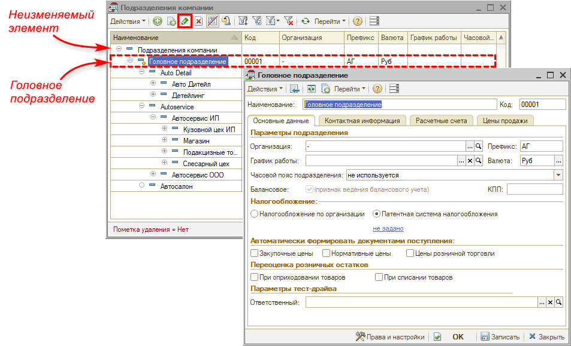

## Создание структурного подразделения

Новый элемент справочника "Подразделения" создается нажатием кнопки "Добавить". Следует задать наименование создаваемого подразделения.

### 1. Основные данные

В поле *"Параметры подразделения"* следует указать организацию, к которой относится данное подразделение, выбрать *график* работы компании, а также заполнить *префикс* и *валюту*. Префиксы рекомендуется указывать в соответствии с организацией подразделения и дополнять их буквой названия подразделения или другим признаком.

В разделе *"Налогообложение"* необходимо выбрать либо налогообложение по организации, либо патентную систему налогообложения и указать патент:

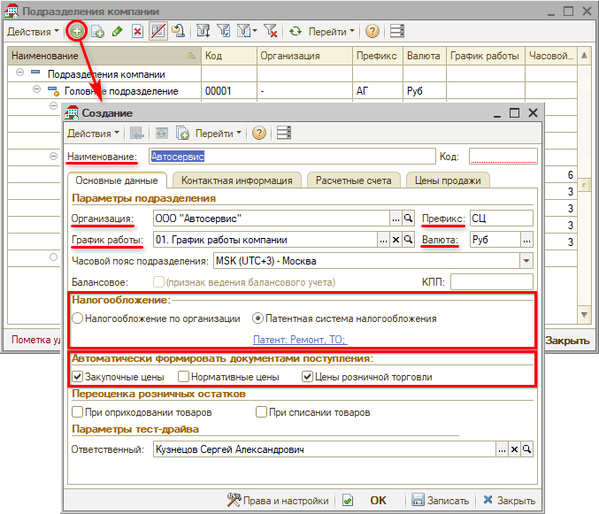

Также может потребоваться настройка подакцизного подразделения (в случае реализации подакцизных товаров) – см. [статью](../../Практики/Особенности%20реализации%20подакцизных%20товаров/osobennosti-realizacii-podakciznykh-tovarov.md), и настройка разделения пробития услуг и товаров по подразделениям (при наличии патента на автоработы) – см. [статью](https://www.5systems.ru/help/kak-nastroit-sistemu-nalogooblozheniya).

В разделе *"Автоматически формировать документами поступления"* следует указать цены, которые будут формироваться автоматически.

### 2. Контактная информация

Во вкладке *"Контактная информация"* следует заполнить данные: рабочий и контактный телефон, юридический и фактический адрес, ссылку на карту, координаты местоположения, сайт организации и электронную почту. В некоторые печатные формы подтягивается как *Фактический*, так и *Юридический адрес*, поэтому необходимо заполнять их оба. Если адрес тот же – следует его просто продублировать.

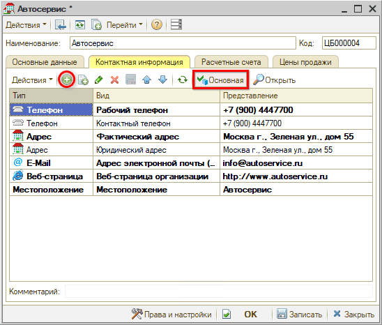

### 3. Цены продажи

На вкладке "Цены продажи" можно установить автоматическое формирование *цен продажи* для подразделения. Следует отметить "галочкой", какие цены будут формироваться автоматически. В графе "Для подразделения компании" рекомендуется указывать головное подразделение.

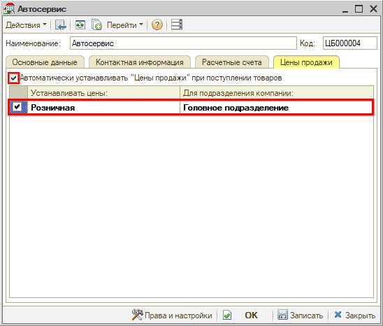

### Примеры

**Пример 1.**

Одна организация с ОСН либо УСН, автосервис с магазином или без него. Один филиал. Вне зависимости от формы собственности. При наличии автосервиса и магазина, можно разделить их на два подразделения, но не обязательно.

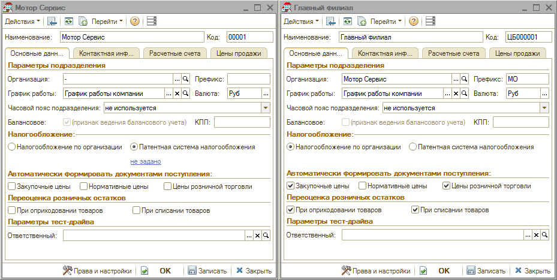

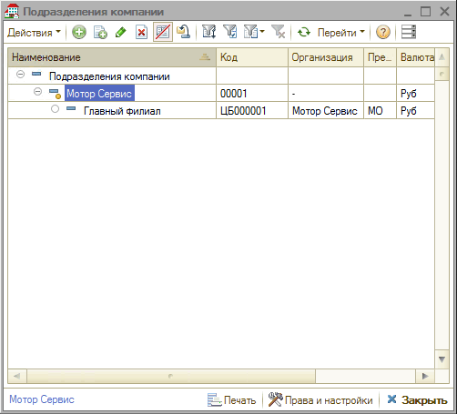

Разделение на магазин и автосервис обычно делается при разном времени работы, контактных данных.

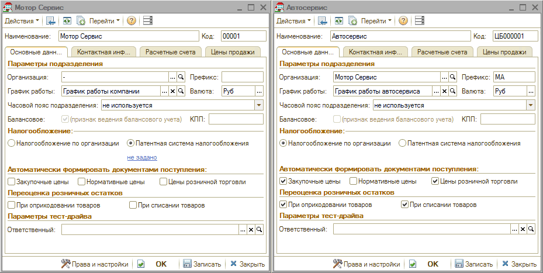

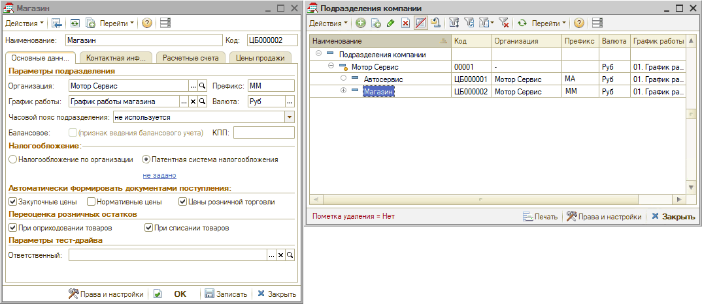

**Пример 2.**

Одна организация с ОСН либо УСН, автосервис с магазином или без него. Два филиала. Вне зависимости от формы собственности. При наличии автосервиса и магазина, можно разделить их на два подразделения, но не обязательно.

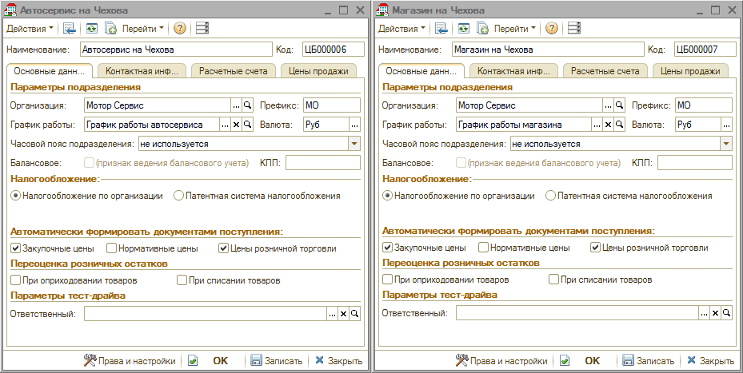

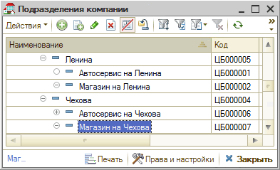

**Пример 3.**

Одна организация с УСН и Патентом, автосервис с магазином. Один филиал. Налогообложение: УСН с Патентом.

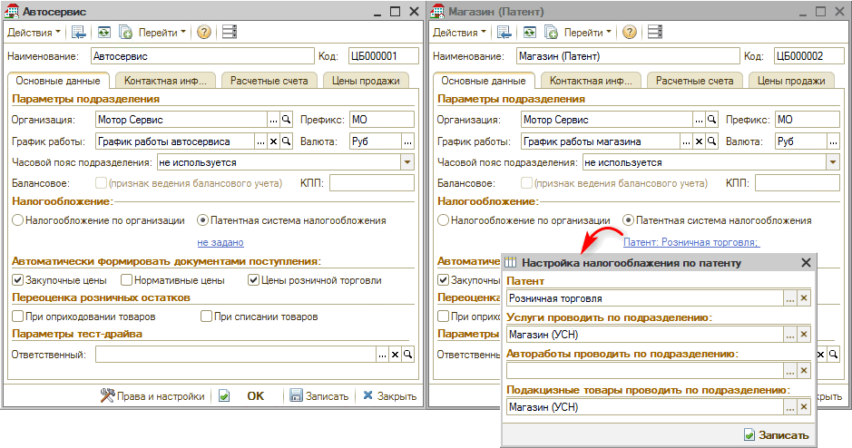

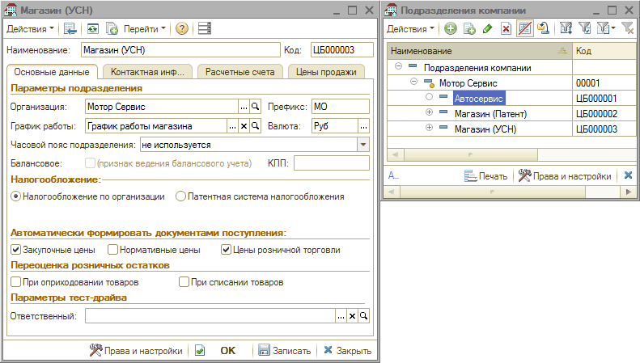

Либо так:

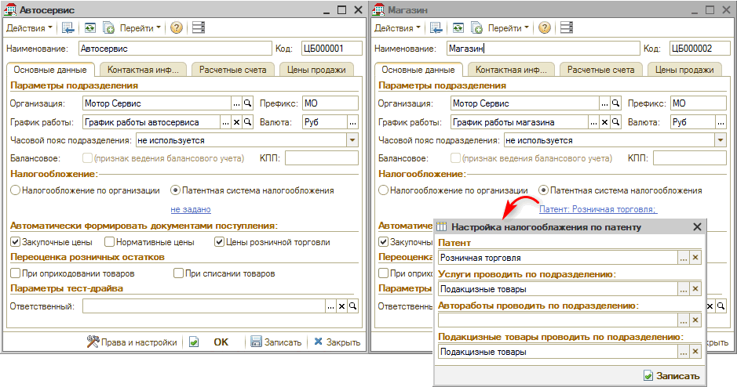

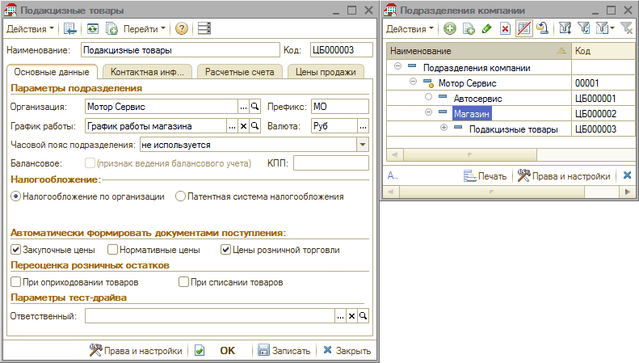

**Пример 4.**

Одна организация с УСН и Патентом, автосервис с магазином. Два филиала. Налогообложение: УСН с Патентом.

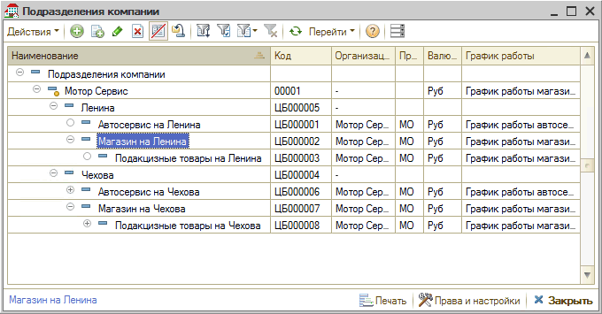

Были разделены Автосервис и Магазин. Из-за того, что масла и другие подакцизные товары не входят в Патент, было создано дополнительное подразделение Магазин с УСН от организации. В подразделении Магазин (Патент) было указано подразделение, которое система будет использовать для подакцизных товаров.

Для подразделений на второй улице аналогично.

Создан тип номенклатуры "Масла" с фактором "Подакцизный товар". Создано значимое событие на смену подразделения с Автосервиса на Магазин, если записывается документ "Реализация товаров".

**Пример 5.**

Две организации с ОСН либо УСН, автосервисы с наличием магазина или без, по одному филиалу на организацию. ОСН либо УСН в зависимости от наличия магазина или автосервиса.

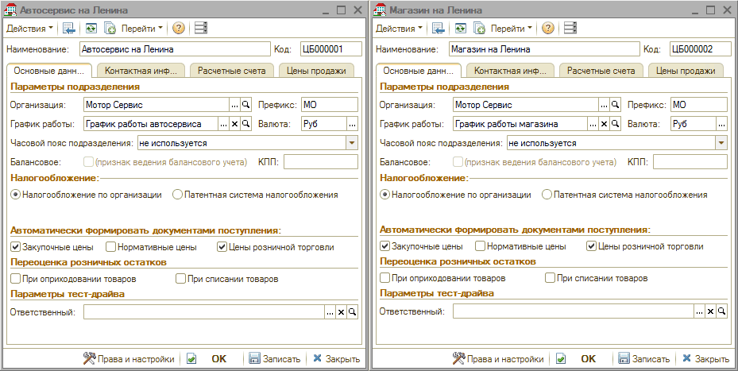

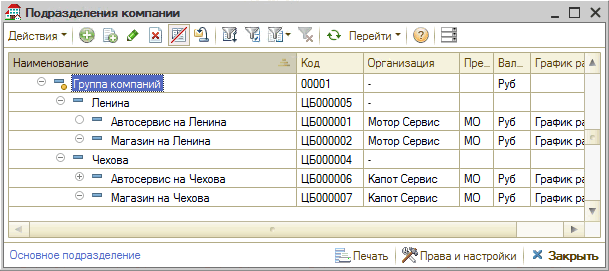

**Пример 6.**

Две организации с разным налогообложением (ООО и ИП) с 2 филиалами, есть Патент и Магазин. 
У ООО система налогообложения - ОСН. 
У ИП на Тэцевской Патент, на Гудованцева УСН. 
На Тэцевской: автосервис + магазин запчастей. На Гудованцева: магазин запчастей.

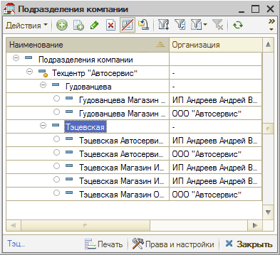

Из-за наличия патента и магазина пришлось создавать дополнительные подразделения.

Тэцевская Магазин ИП (УСН) - то подразделение, по которому будут пробиваться подакцизные товары.

Тэцевская ООО было разделено на Автосервис и Магазин для подобия на Тэцевская ООО, но можно было это и не делать.

Настроен тип номенклатуры Масла, как подакцизный. Добавлены два значимых события, что меняют подразделения с автосервиса на магазин, если это просто продажа товара.

Все конечные подразделения автоматически устанавливают цены продажи по головному подразделению.

Если подразделений несколько, то их можно группировать по разным факторам. Факторами могут быть такие как: одинаковый фактический или юридический адрес, одна организация, наличие Патента и т.д.

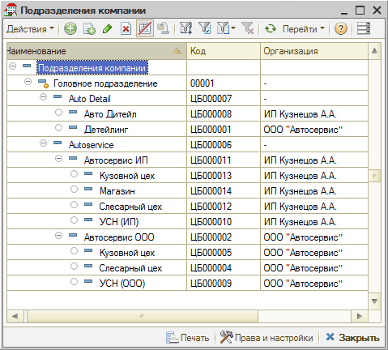

Выше можно увидеть примеры реализации подакцизных подразделений.

В примерах 3, 4 и 6 есть описание и необходимые настройки.

С особенностями реализации подакцизных товаров можно ознакомиться по [*ссылке*](../../Практики/Особенности%20реализации%20подакцизных%20товаров/osobennosti-realizacii-podakciznykh-tovarov.md).

---

**Теги:** структура компании, подразделения, справочник, настройка, администрирование

