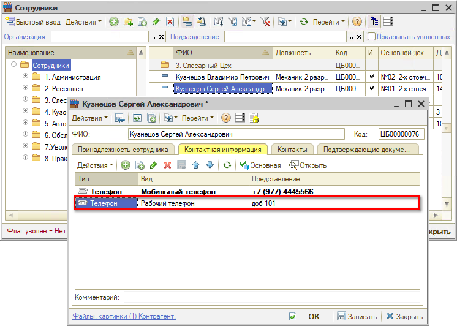
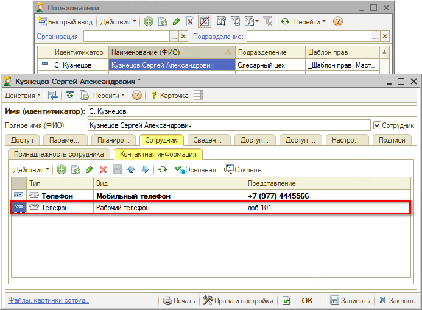
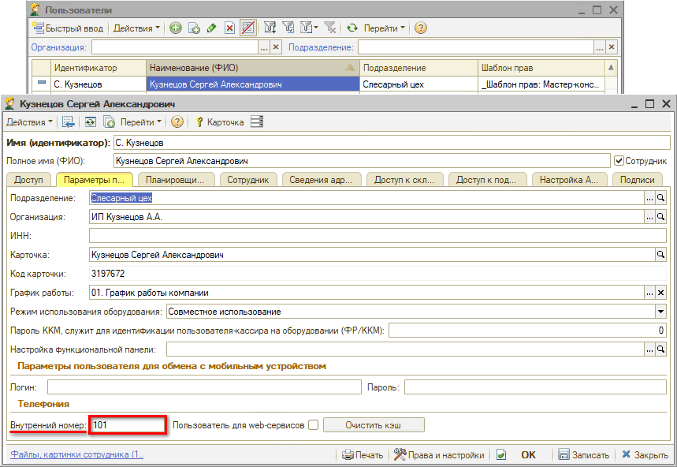
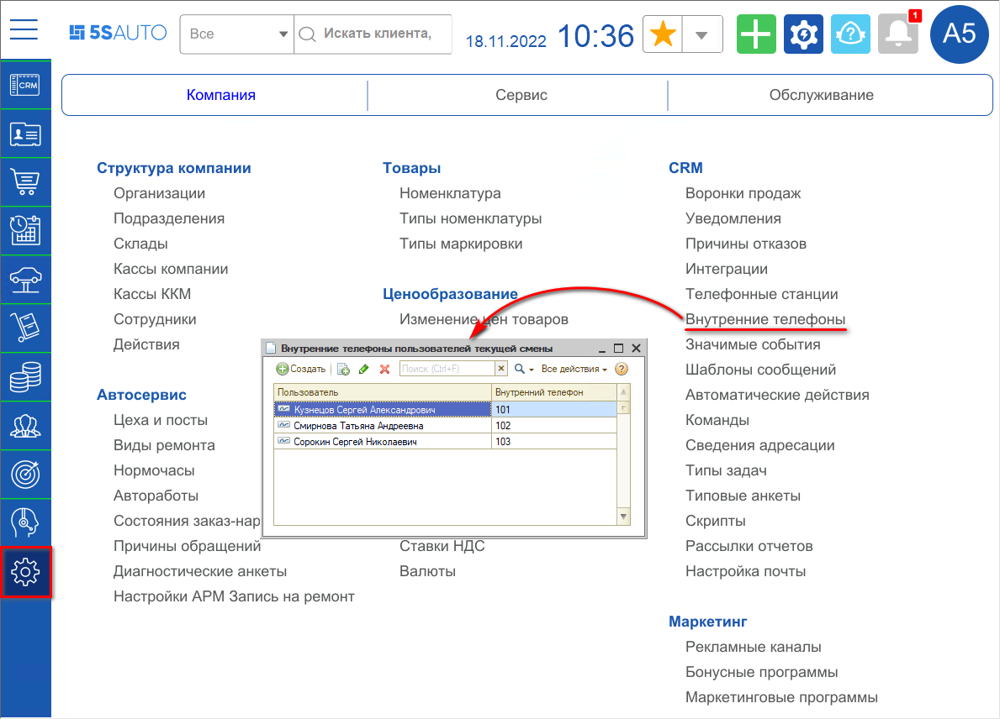

# Настройка внутренних телефонов сотрудников

<table><tr><td><b>Время чтения:</b> 9 мин.</td><td><b>Обновлено:</b> 11.04.2025</td></tr></table>

Источник: https://www.5systems.ru/help/nastroyka-vnutrennikh-telefonov-sotrudnikov

## Содержание

1. [Описание](#описание)
2. [Настройка постоянного внутреннего номера](#настройка-постоянного-внутреннего-номера)
   - [1) Номер телефона сотрудника](#1-номер-телефона-сотрудника)
   - [2) Номер телефона пользователя](#2-номер-телефона-пользователя)
3. [Настройка меняющегося внутреннего номера](#настройка-меняющегося-внутреннего-номера)

## Описание

Для адресации звонков сотрудникам необходимо закрепить за ними номера внутренних телефонов.

Если у сотрудника номер внутреннего телефона не меняется в течение смены, то необходимо установить ему *постоянный номер телефона*.

Если у сотрудника постоянно меняется внутренний номер телефона от смены к смене, то необходимо устанавливать ему *номер телефона при каждом открытии смены*.

## Настройка постоянного внутреннего номера

Постоянный номер телефона закрепляется либо за *сотрудником*, либо за *пользователем*.

Если сотрудник пользуется базой программы под одним пользователем или под несколькими пользователями, но при этом номер телефона у него не меняется, то закрепить номер телефона нужно за *сотрудником*.

Если сотрудник пользуется базой программы под несколькими пользователями и при этом номер телефона у него меняется, то закрепить номер телефона нужно за *пользователем*. Например, *сотрудник Иванов Иван* работает в *Цехе 1* под *пользователем Иванов Иван 1* с номером телефона 112, а в цехе *Цехе 2* под *пользователем Иванов Иван 2* с номером телефона 212.

### 1) Номер телефона сотрудника

Задать внутренний номер телефона сотруднику можно 2 способами:

1. Через карточку сотрудника:

   

2. Через карточку пользователя:

   

### 2) Номер телефона пользователя

Задать внутренний номер пользователя можно в карточке пользователя:

## Настройка меняющегося внутреннего номера

Для установки внутренних номеров телефон на смену необходимо при открытии каждой смены заполнять регистр сведений *"Внутренние телефоны пользователей текущей смены".*

Данный регистр можно открыть через меню интерфейса *Администрирование → Компания → CRM →* *Внутренние телефоны* или через стандартное меню *CRM → Все операции → Регистры сведений →* *Внутренние телефоны пользователей:*

---

**Теги:** телефония, внутренний номер, сотрудники, пользователи, настройка
