# Настройка интеграции с телефонией MANGO OFFICE

<table><tr><td><b>Время чтения:</b> 13 мин.</td><td><b>Обновлено:</b> 26.03.2026</td></tr></table>

Источник: https://www.5systems.ru/help/nastroyka-integracii-s-telefoniey-mango-office

> *Актуально начиная с версии релиза 5S AUTO **2.8.3**.*

## Содержание

1. [Введение](#введение)
2. [Настройка на стороне сервиса](#настройка-на-стороне-сервиса)
   - [1. Создание подключения](#1-создание-подключения)
      - [Шаг 1. Переход в Личный кабинет](#шаг-1-переход-в-личный-кабинет)
      - [Шаг 2. Подключение Виртуальной АТС](#шаг-2-подключение-виртуальной-атс)
      - [Шаг 3. Получение кода и ключа доступа](#шаг-3-получение-кода-и-ключа-доступа)
      - [Шаг 4. Добавление адреса API виртуальной АТС](#шаг-4-добавление-адреса-api-виртуальной-атс)
      - [Шаг 5. Настройка фильтрации по номерам](#шаг-5-настройка-фильтрации-по-номерам)
   - [2. Настройка звонков на номера сотрудников](#2-настройка-звонков-на-номера-сотрудников)
3. [Настройка интеграции в программе](#настройка-интеграции-в-программе)
   - [1. Создание интеграции](#1-создание-интеграции)
   - [2. Параметры сервиса](#2-параметры-сервиса)
   - [3. Подключение телефонной станции](#3-подключение-телефонной-станции)
   - [4. Активация интеграции](#4-активация-интеграции)
   - [5. Получение адреса внешней системы](#5-получение-адреса-внешней-системы)

## Введение

В статье описан процесс подключения и настройки интеграции 5S AUTO с **виртуальной АТС MANGO OFFICE**.

Возможности интеграции с системами телефонии:

- фиксация всех входящих и исходящих звонков;
- контроль пропущенных вызовов;
- маршрутизация звонков на ответственных сотрудников;
- совершение звонков непосредственно из программы;
- прослушивание записей разговоров.

Также см. [документацию](https://static.mango-office.ru/project-im/medialibrary/d3b/d3b7d95aef2826768f96fe47fe063d45/MangoOffice_VPBX_API.pdf) сервиса MANGO OFFICE.

## Настройка на стороне сервиса

### 1. Создание подключения

#### Шаг 1. Переход в Личный кабинет

Войти в Личный кабинет можно двумя способами: по ссылке [https://lk.mango-office.ru](https://lk.mango-office.ru) или через главную страницу сайта [www.mango-office.ru](http://www.mango-office.ru).

Требуется ввести регистрационные данные – логин и пароль, полученные на электронную почту при заключении договора с “MANGO OFFICE” – и нажать кнопку “Войти”. Подробнее см. [инструкцию](https://www.mango-office.ru/support/virtualnaya_ats/nastroyka_uslug/lichnyy_kabinet/) на сайте сервиса.

#### Шаг 2. Подключение Виртуальной АТС

В Личном кабинете следует перейти в раздел *“Интеграции”:*

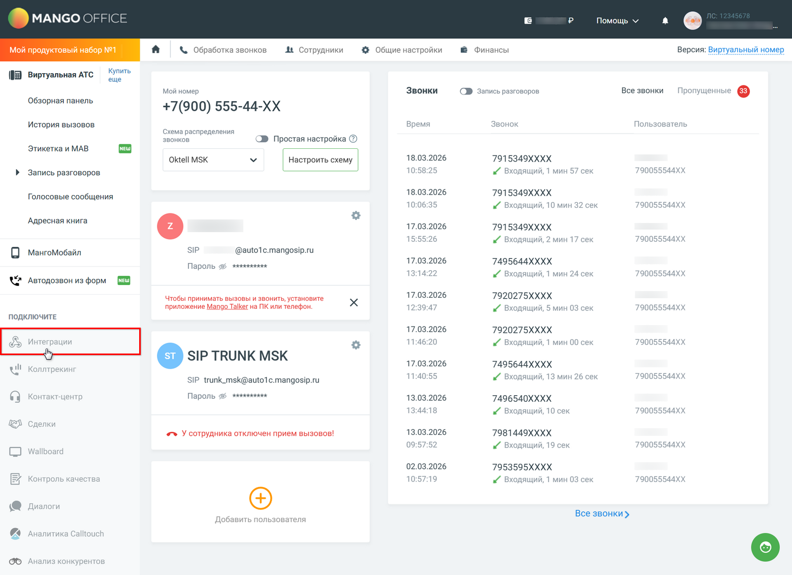

В разделе “Интеграции” перейти в блок *“API коннектор”:*

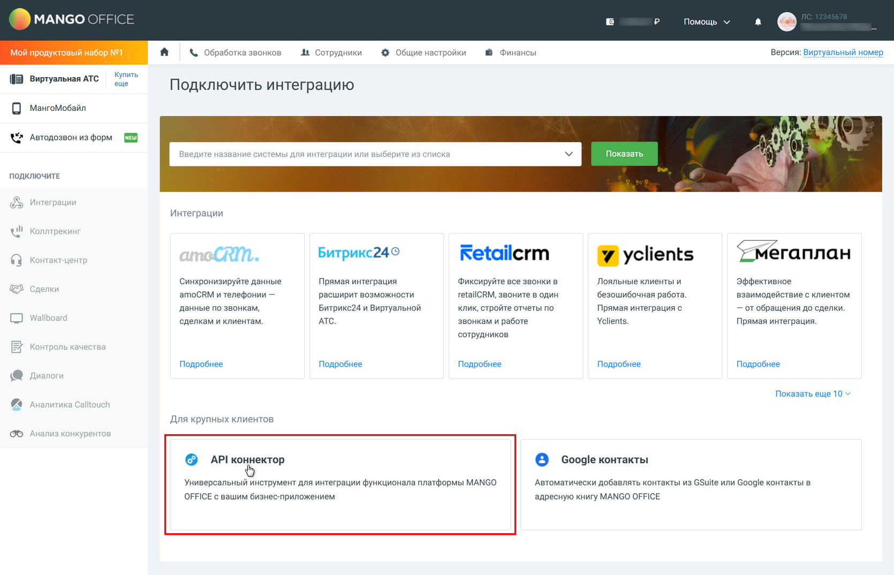

В разделе “API коннектор” следует нажать кнопку *“Подключить API коннектор”,* на открывшейся панели подтвердить принятие условий подключения услуги и нажать кнопку *“Подключить”:*

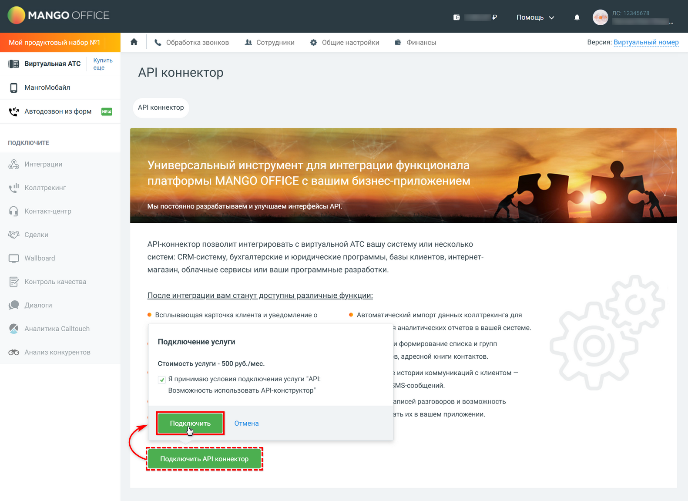

#### Шаг 3. Получение кода и ключа доступа

На открывшейся странице “API коннектор” необходимо скопировать и сохранить значения параметров ***“Уникальный код вашей АТС”*** и ***“Ключ для создания подписи”*** – они понадобятся при настройке интеграции в программе (см. [ниже](#2-параметры-подключения)):

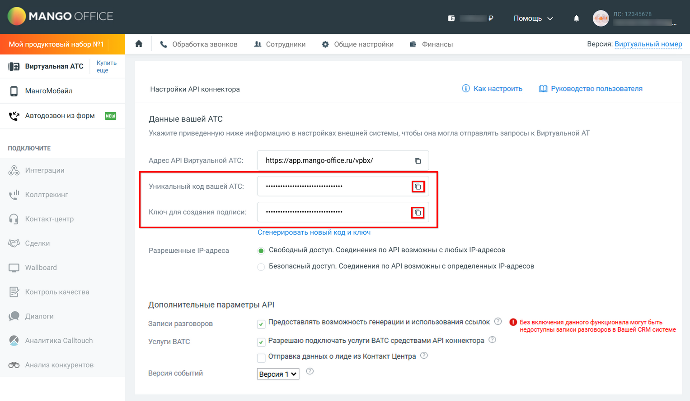

#### Шаг 4. Добавление адреса API виртуальной АТС

Далее необходимо прокрутить страницу “API коннектор” ниже до раздела *“Внешние системы”* и прописать ***адрес внешней системы**,* который следует получить в процессе настройки интеграции в программе – см. [ниже](#5-получение-адреса-внешней-системы):

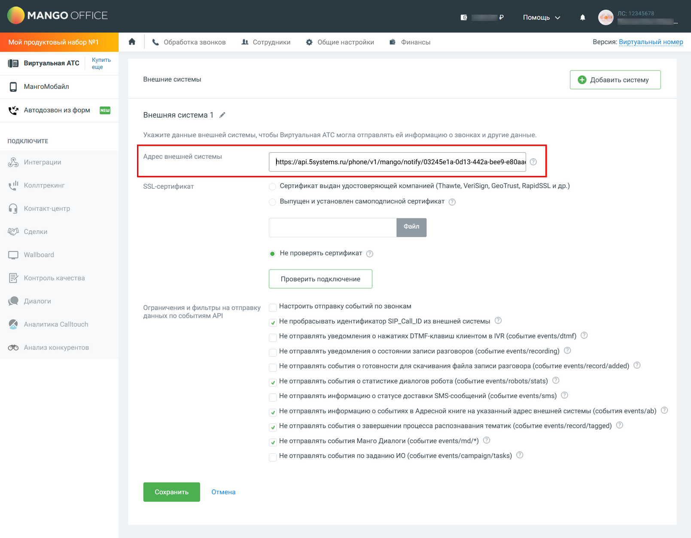

#### Шаг 5. Настройка фильтрации по номерам

В этом же блоке, в случае если у компании настроено подключение нескольких телефонных номеров, есть возможность установить фильтр по номерам на отправку событий по звонкам:

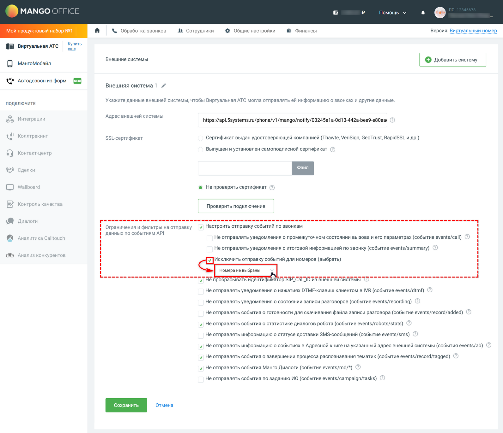

### 2. Настройка звонков на номера сотрудников

Функция *“умной” маршрутизации* направляет входящий вызов непосредственно на внутренний номер ответственного сотрудника, минуя общую логику распределения входящих звонков. В связи с этим важно заранее настроить порядок звонков на номера сотрудников и учесть отсутствие ответа. При отсутствии такой настройки звонок, переадресованный сотрудника, не будет возвращаться при отсутствии ответа, а просто завершится – в итоге звонок клиента останется без ответа.

В Личном кабинете MANGO OFFICE есть возможность задать правила дозвона в карточках сотрудников.

На скриншоте ниже приведен *пример настройки* – ждать ответа сотрудника 20 секунд, после чего звонок перейдет на номер телефона “100”:

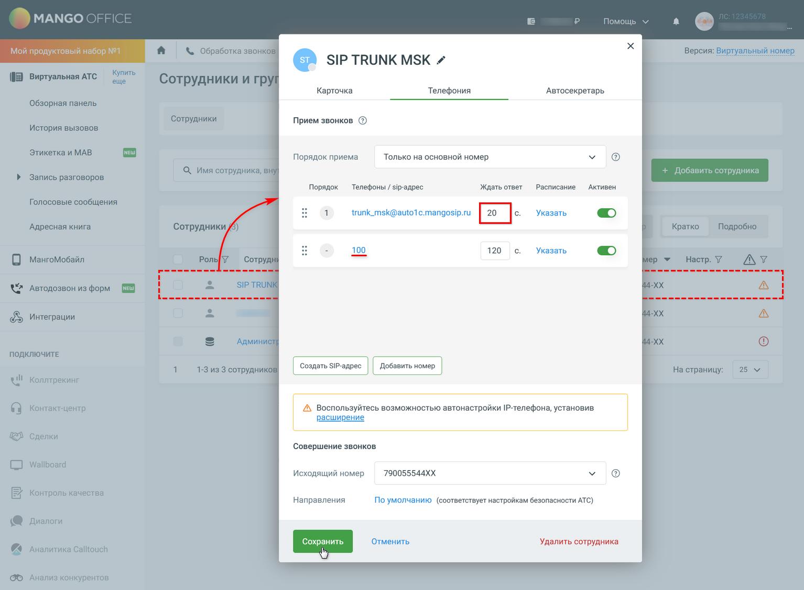

*Примечание:* Внутренние номера в Виртуальной АТС должны совпадать с [внутренними номерами](../Настройка%20внутренних%20телефонов%20сотрудников/nastroyka-vnutrennikh-telefonov-sotrudnikov.md), указанными для этих сотрудников в программе:

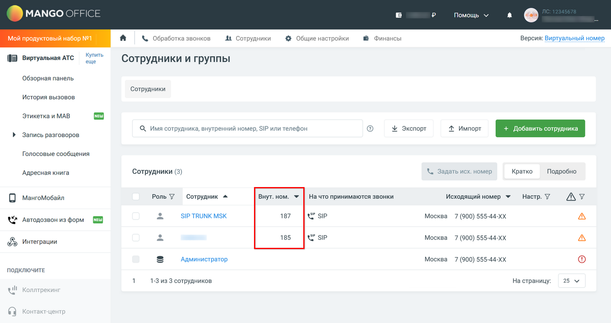

Все произведенные настройки необходимо ***сохранить**.*

## Настройка интеграции в программе

### 1. Создание интеграции

Для настройки интеграции с телефонией следует перейти в *справочник "Интеграции" – Администрирование → Компания → CRM → Интеграции* – и создать новый элемент справочника. Выбрать ***вид интеграции** “Телефония”:*

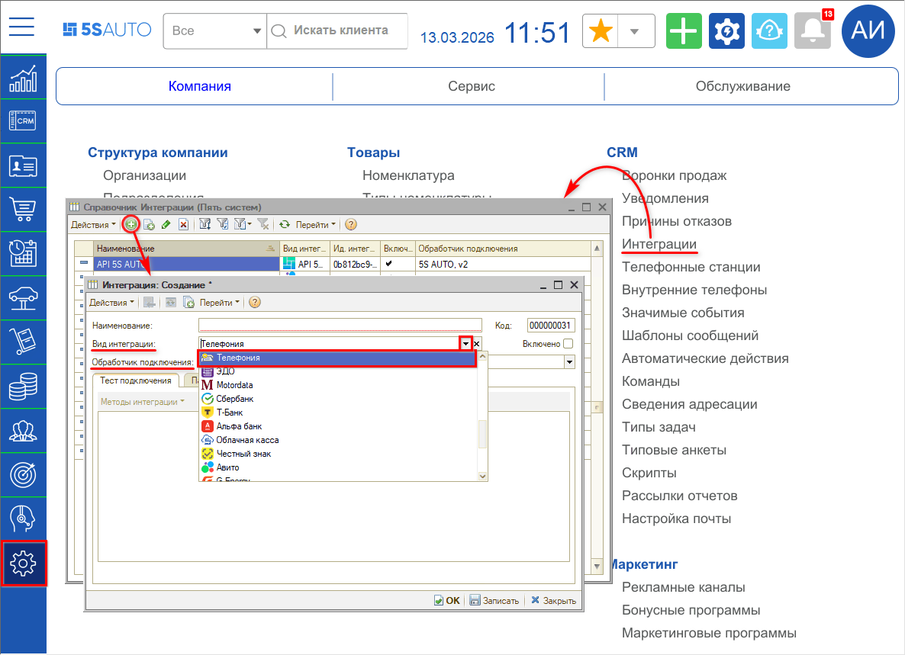

В параметре ***“Обработчик подключения”*** следует выбрать обработчик – *Mango Office:*

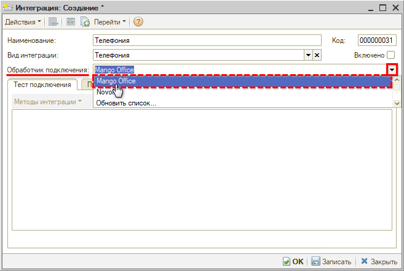

Созданную интеграцию следует *записать.*

### 2. Параметры сервиса

На вкладке *“Параметры сервиса”* собраны следующие параметры:

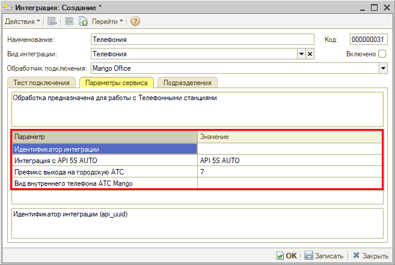

- *Идентификатор интеграции* – параметр заполняется автоматически после выбора аккаунта телефонной станции (см. [ниже](#3-выбор-настройки-подключения)).
- *Интеграция с API 5S AUTO* – следует выбрать интеграцию с [API 5S AUTO](../../Администрирование%20и%20настройка%20системы/API%205S%20AUTO/api-5s-auto.md).
- *Префикс выхода на городскую АТС* – параметр указывает, какой префикс добавляется к 10-значному номеру клиента для звонка, значение “7” устанавливается по умолчанию.
- *Вид внутреннего телефона АТС* – настройка определяет, где искать внутренний номер пользователя на данной АТС. Используется только в случае интеграции с 2-мя и более различными АТС, и если у пользователя несколько телефонов. В этом случае для перевода звонков на сотрудника требуется для каждой интеграции указать свой вид телефона из справочника *“Виды контактной информации”,* например, для одной АТС указать вид “Рабочий телефон”, для другой – “Контактный телефон”. 
  По умолчанию параметр не должен быть заполнен – в этом случае для перевода звонков на сотрудника будет использоваться телефон из регистра “Внутренние телефоны пользователей текущей смены” либо из карточки пользователя или сотрудника – подробнее см. в статье “[Настройка внутренних телефонов сотрудников](../Настройка%20внутренних%20телефонов%20сотрудников/nastroyka-vnutrennikh-telefonov-sotrudnikov.md)”.

### 3. Подключение телефонной станции

#### 1) Добавление новой настройки подключения

Для добавления подключения телефонной станции следует на вкладке *“Тест подключения”* перейти в *“Методы интеграции → Настройки”* и нажать кнопку *“Добавить новую запись”:*

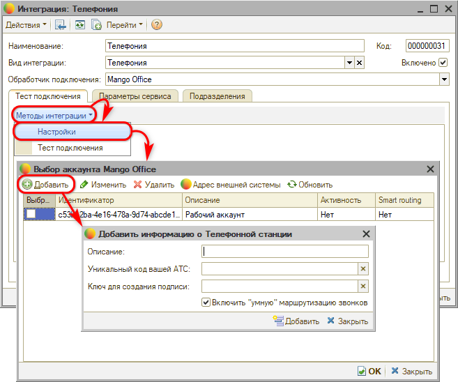

#### 2) Параметры подключения

На форме добавления нового подключения телефонной станции следует заполнить *описание* подключения – оно будет отображаться в наименовании интеграции (см. [ниже](#3-выбор-настройки-подключения)).

Также необходимо ввести следующие ***параметры**,* полученные в Личном кабинете при подключении виртуальной АТС – см. [выше](#шаг-3-получение-кода-и-ключа-доступа):

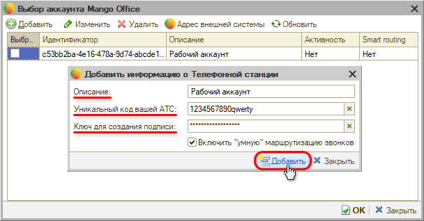

- *Уникальный код вашей АТС* – уникальный код доступа к API для идентификации внешней системы, от которой отправляется запрос.
- *Ключ для создания подписи* – уникальный ключ для создания подписей сообщений.

Далее необходимо нажать кнопку *“Добавить”* – в таблицу выбора аккаунта будет добавлена новая строка.

**“Умная” маршрутизация**

Телефония MANGO OFFICE имеет свои особенности адресации звонков, настройка которой производится в ЛК сервиса – см. [выше](#2-настройка-звонков-на-номера-сотрудников).

Для данного оператора можно отключить [”умную” маршрутизацию](../../Работа%20с%20клиентами/Умная%20маршрутизация%20входящего%20звонка/umnaya-marshrutizaciya-vkhodyaschego-zvonka.md) 5S AUTO – для этого следует снять отметку *“Включить “умную” маршрутизацию звонков”* в настройках интеграции:

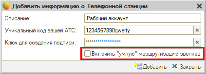

#### 3) Выбор настройки подключения

Созданную настройку подключения необходимо выбрать – установить галочку в столбце *“Выбрать”* в нужной строке и сохранить настройку:

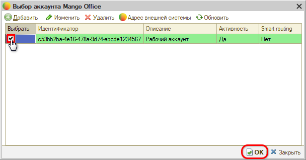

После выбора подключения и нажатия кнопки “ОК” описание аккаунта подтягивается в наименование интеграции в формате *“Телефония <описание аккаунта>”:*

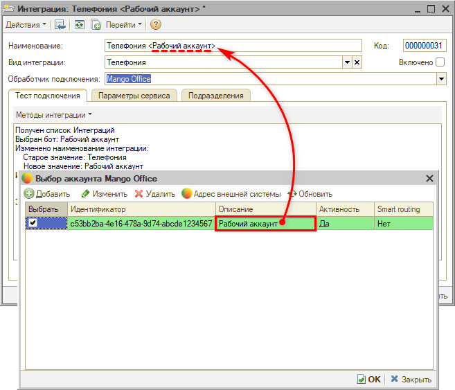

#### 4) Редактирование настройки подключения

Для *редактирования* настройки подключения АТС следует выделить строку с нужной настройкой, нажать кнопку *“Изменить текущую запись”,* внести необходимые изменения и сохранить:

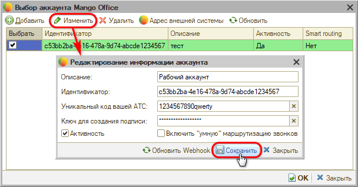

#### 5) Удаление настройки подключения

Для *удаления* настройки подключения АТС следует выделить строку с нужной настройкой, нажать кнопку “Удалить текущую запись” и подтвердить удаление нажатием кнопки “Удалить”.

### 4. Активация интеграции

После выполнения всех необходимых настроек следует *активировать* интеграцию – для этого нужно установить галочку *“Включено”* и нажать кнопку *“ОК”:*

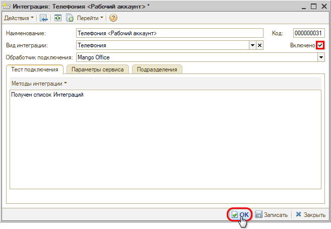

### 5. Получение адреса внешней системы

Для настройки подключения виртуальной АТС в Личном кабинете сервиса MANGO OFFICE требуется прописать ***адрес внешней системы**.*

Адрес представляет собой ссылку вида *“https:/api.5systems.ru/phone/v1/mango/notify/ab123cd4-e5f6-78g9-a123-b456c7de8f90/c53bb2ba-4e16-478a-9d74-abcde1234567”.*

Для того, чтобы получить адрес, следует в настройках выбора аккаунта нажать кнопку *“Адрес внешней системы”,* и в открывшемся окне – кнопку *“Скопировать”:*

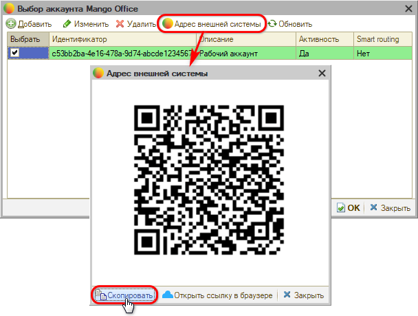

Полученную ссылку необходимо вставить в ЛК MANGO OFFICE в разделе *Интеграции → API коннектор → Внешние системы → Адрес внешней системы* – см. [выше](#шаг-4-добавление-адреса-api-виртуальной-атс).

---

**Теги:** телефония, mango office, интеграция, настройка, api, внутренние номера
