# Настройка интеграции с телефонией Novofon

<table><tr><td><b>Время чтения:</b> 12 мин.</td><td><b>Обновлено:</b> 27.03.2026</td></tr></table>

Источник: https://www.5systems.ru/help/nastroyka-integracii-s-telefoniey-novofon

> *Актуально начиная с версии релиза 5S AUTO **2.8.3**.*

## Содержание

1. [Введение](#введение)
2. [Настройка на стороне сервиса](#настройка-на-стороне-сервиса)
   - [1. Создание подключения](#1-создание-подключения)
      - [Шаг 1. Переход в личный кабинет](#шаг-1-переход-в-личный-кабинет)
      - [Шаг 2. Подключение интеграции](#шаг-2-подключение-интеграции)
   - [2. Создание API-ключа](#2-создание-api-ключа)
   - [3. Настройка записи разговора](#3-настройка-записи-разговора)
3. [Настройка интеграции в программе](#настройка-интеграции-в-программе)
   - [1. Создание интеграции](#1-создание-интеграции)
   - [2. Параметры сервиса](#2-параметры-сервиса)
   - [3. Подключение телефонной станции](#3-подключение-телефонной-станции)
   - [4. Активация интеграции](#4-активация-интеграции)
   - [5. Получение URL для уведомлений](#5-получение-url-для-уведомлений)

## Введение

В статье описан процесс подключения и настройки интеграции 5S AUTO с **виртуальной АТС Novofon**.

Возможности интеграции с системами телефонии:

- фиксация всех входящих и исходящих звонков;
- контроль пропущенных вызовов;
- маршрутизация звонков на ответственных сотрудников;
- совершение звонков непосредственно из программы;
- прослушивание записей разговоров.

Также см. [инструкции](https://novofon.com/instructions/integration/own-crm/) на сайте сервиса Novofon.

## Настройка на стороне сервиса

### 1. Создание подключения

См. инструкцию “[Интеграция собственной CRM и телефонии Novofon](https://novofon.com/instructions/integration/own-crm/#%D0%9F%D0%BE%D0%B4%D0%B3%D0%BE%D1%82%D0%BE%D0%B2%D0%BA%D0%B0%20%D0%BA%20%D0%B8%D0%BD%D1%82%D0%B5%D0%B3%D1%80%D0%B0%D1%86%D0%B8%D0%B8)” на сайте сервиса.

#### Шаг 1. Переход в личный кабинет

Войти в личный кабинет можно по ссылке [https://novofon.com/sign-up](https://novofon.com/sign-up/).

*Примечание:* Требуется регистрация на сайте, наличие подписанного договора, пополненный счет и подключенный виртуальный номер.

#### Шаг 2. Подключение интеграции

В личном кабинете следует перейти в раздел *“Интеграции”:*

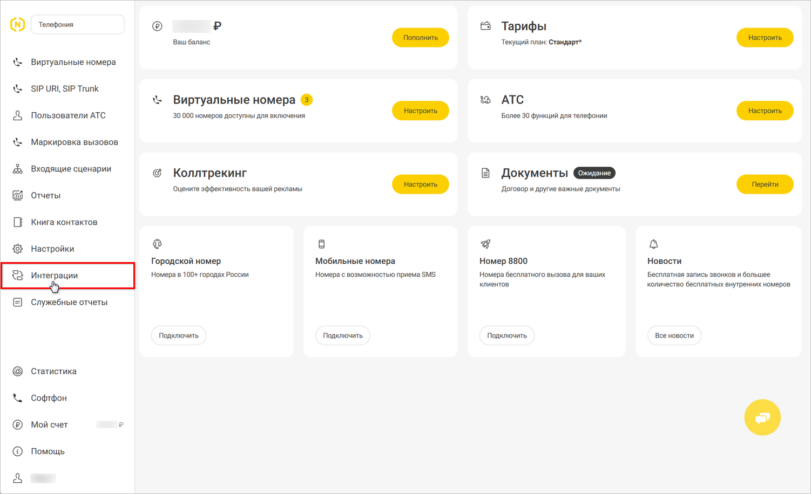

На странице “Каталог интеграций” в блоке “Коммуникации” перейдите в раздел *“Уведомления о событиях”:*

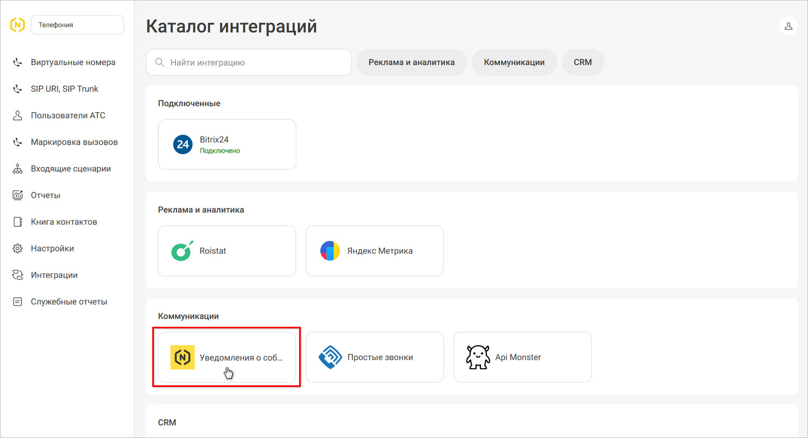

В открывшемся окне в поле *“URL для уведомлений о звонках в АТС”* требуется ввести ***адрес URL для уведомлений**,* который следует получить в процессе настройки интеграции в программе – см. [ниже](#5-получение-url-для-уведомлений):

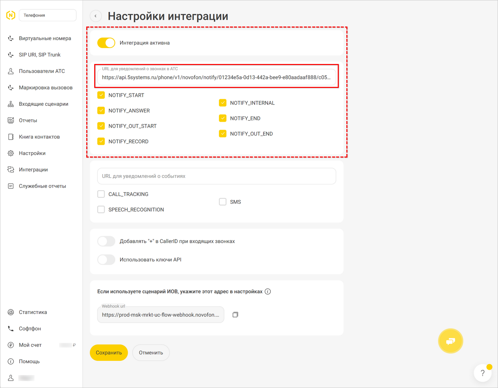

Также следует установить все галочки в верхнем блоке и переключатель *“Интеграция активна”* и *сохранить* изменения.

### 2. Создание API-ключа

Далее следует перейти в раздел *“Пользователи АТС”* и в списке пользователей выбрать *пользователя с ролью “Полный доступ”:*

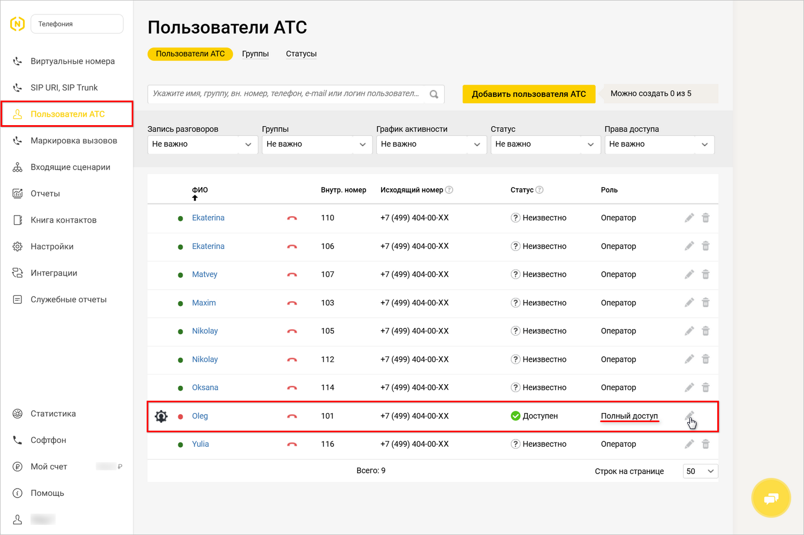

В настройках пользователя следует перейти на вкладку “API”. Необходимо включить настройку "Использовать ключ API", сгенерировать и скопировать параметры ***“Key”*** и ***“Secret”*** – они понадобятся для настройки интеграции в программе (см. [ниже](#2-параметры-подключения)), и *сохранить* настройки:

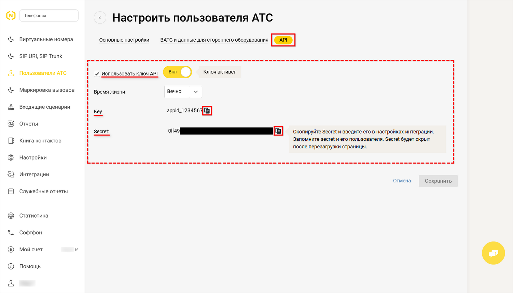

### 3. Настройка записи разговора

Важно чтобы у всех сотрудников была включена *запись разговора “Для всех звонков”:*

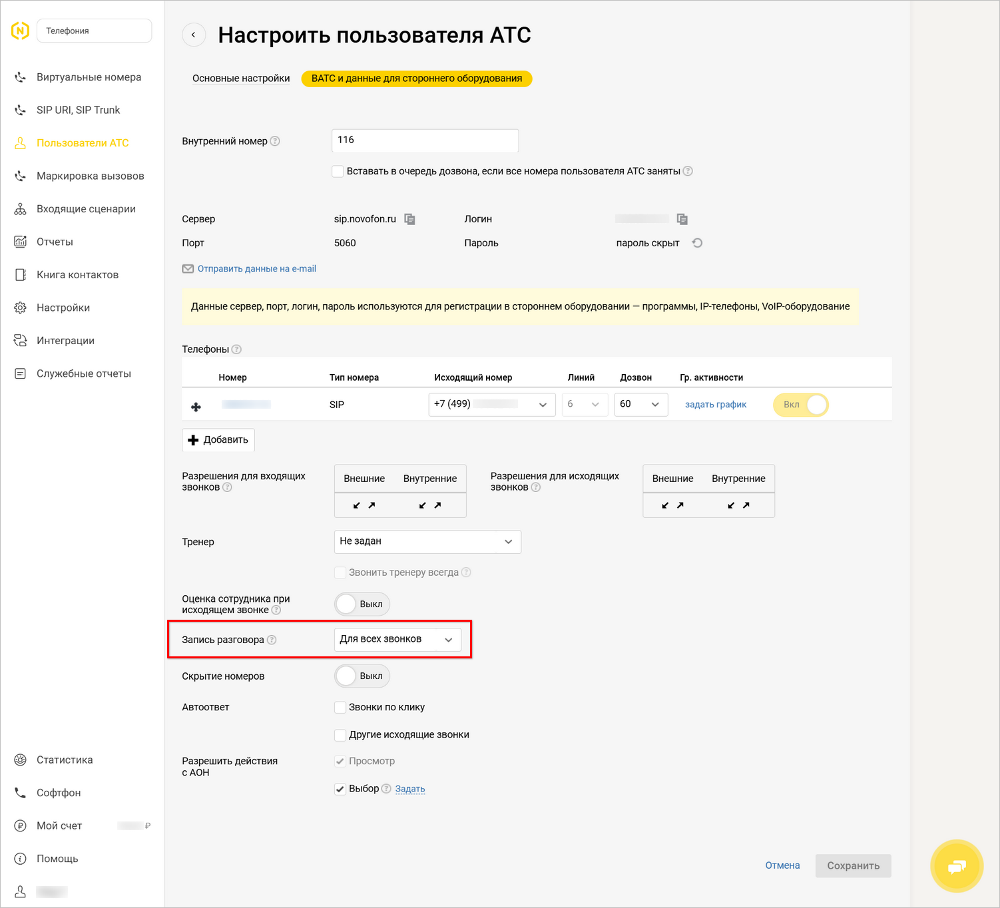

## Настройка интеграции в программе

### 1. Создание интеграции

Для настройки интеграции с телефонией следует перейти в справочник *"Интеграции" – Администрирование → Компания → CRM → Интеграции* – и создать новый элемент справочника.

Выбрать ***вид интеграции** “Телефония”:*

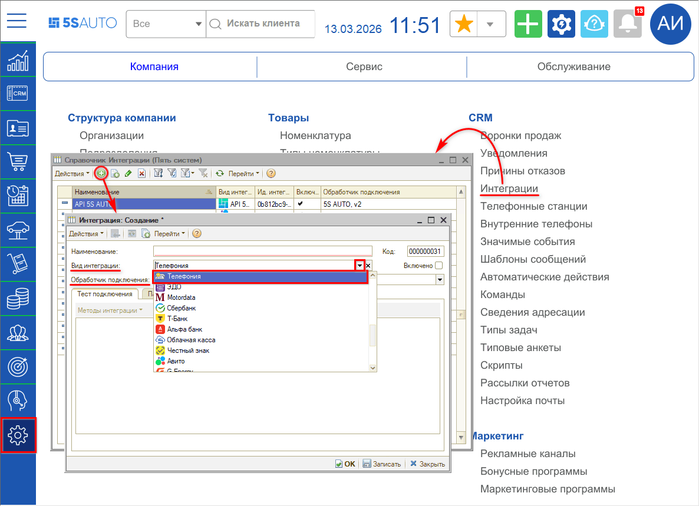

В параметре ***“Обработчик подключения”*** следует выбрать обработчик – *Novofon:*

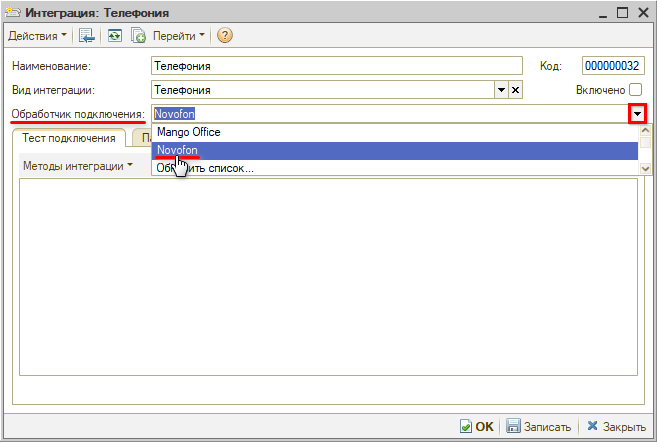

Созданную интеграцию следует *записать.*

### 2. Параметры сервиса

На вкладке *“Параметры сервиса”* находятся следующие параметры:

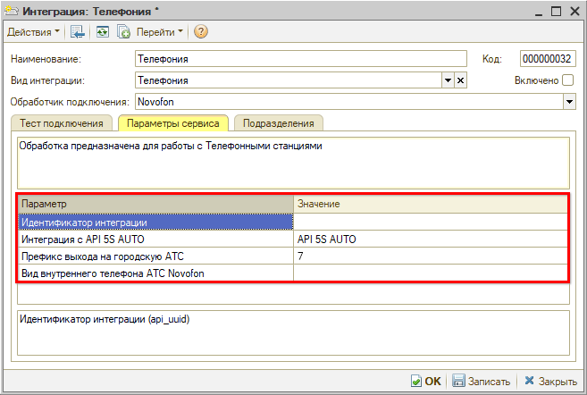

- *Идентификатор интеграции* – параметр заполняется автоматически после выбора аккаунта телефонной станции (см. [ниже](#3-выбор-настройки-подключения)).
- *Интеграция с API 5S AUTO* – следует выбрать интеграцию с [API 5S AUTO](../../Администрирование%20и%20настройка%20системы/API%205S%20AUTO/api-5s-auto.md).
- *Префикс выхода на городскую АТС* – параметр указывает, какой префикс добавляется к 10-значному номеру клиента для звонка, значение “7” устанавливается по умолчанию.
- *Вид внутреннего телефона АТС* – настройка определяет, где искать внутренний номер пользователя на данной АТС. Используется только в случае интеграции с 2-мя и более различными АТС, и если у пользователя несколько телефонов. В этом случае для перевода звонков на сотрудника требуется для каждой интеграции указать свой *вид телефона* из справочника *“Виды контактной информации”,* например, для одной АТС указать вид “Рабочий телефон”, для другой – “Контактный телефон”. 
  По умолчанию параметр не должен быть заполнен – в этом случае для перевода звонков на сотрудника будет использоваться телефон из регистра “Внутренние телефоны пользователей текущей смены” либо из карточки пользователя или сотрудника – подробнее см. в статье “[Настройка внутренних телефонов сотрудников](../Настройка%20внутренних%20телефонов%20сотрудников/nastroyka-vnutrennikh-telefonov-sotrudnikov.md)”.

### 3. Подключение телефонной станции

#### 1) Добавление новой настройки подключения

Для добавления подключения телефонной станции следует на вкладке *“Тест подключения”* перейти в *“Методы интеграции → Настройки”* и нажать кнопку *“Добавить новую запись”:*

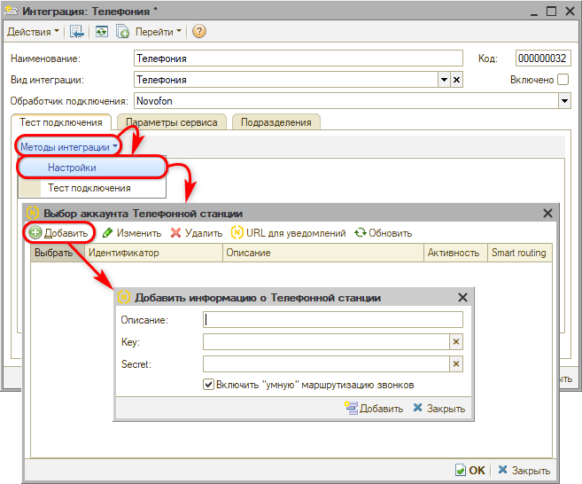

#### 2) Параметры подключения

На форме добавления нового подключения телефонной станции следует заполнить *описание* подключения – оно будет отображаться в наименовании интеграции (см. [ниже](#3-выбор-настройки-подключения)).

Также необходимо ввести следующие ***параметры**,* сгенерированные при создании интеграции в личном кабинете на сайте сервиса – см. [выше](#sozd_klyucha):

- *Key* – API-ключ.
- *Secret* – пароль.

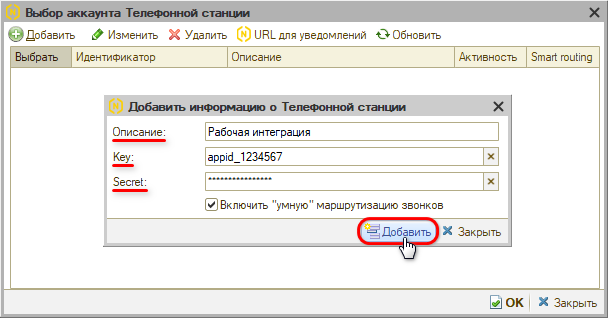

Параметр *“Включить “умную” маршрутизацию звонков”* активирует использование *[”умной” маршрутизации](../../Работа%20с%20клиентами/Умная%20маршрутизация%20входящего%20звонка/umnaya-marshrutizaciya-vkhodyaschego-zvonka.md) звонков* для данной интеграции – по умолчанию признак установлен, есть возможность его отключить.

Далее необходимо нажать кнопку *“Добавить”* – в таблицу выбора аккаунта будет добавлена новая строка.

#### 3) Выбор настройки подключения

Созданную настройку подключения необходимо выбрать – установить галочку в столбце *“Выбрать”* в нужной строке и сохранить настройку:

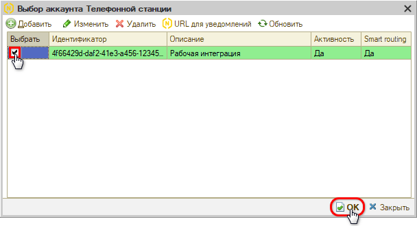

После выбора подключения и нажатия кнопки “ОК” описание аккаунта подтягивается в наименование интеграции в формате *“Телефония <описание аккаунта>”:*

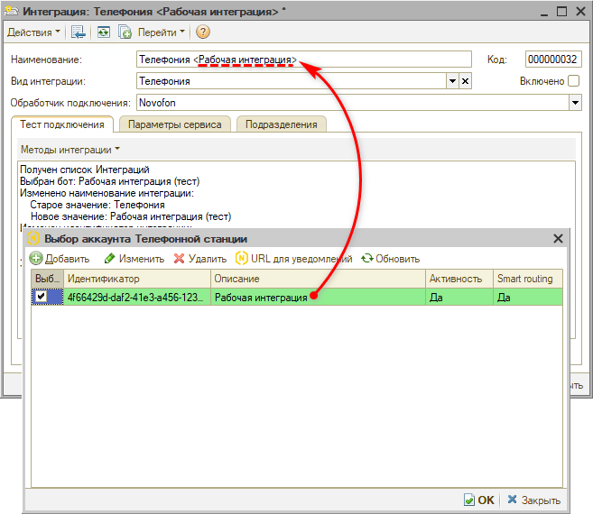

#### 4) Редактирование настройки подключения

Для редактирования настройки подключения АТС следует выделить строку с нужной настройкой, нажать кнопку *“Изменить текущую запись”,* внести необходимые изменения и *сохранить:*

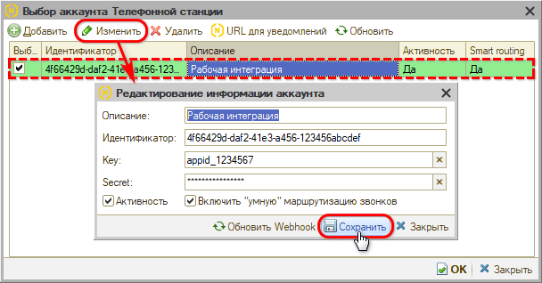

#### 5) Удаление настройки подключения

Для удаления настройки подключения АТС следует выделить строку с нужной настройкой, нажать кнопку *“Удалить текущую запись”* и подтвердить удаление нажатием кнопки “Удалить”.

### 4. Активация интеграции

После выполнения всех необходимых настроек следует *активировать интеграцию* – для этого нужно установить галочку *“Включено”* и нажать кнопку *“ОК”:*

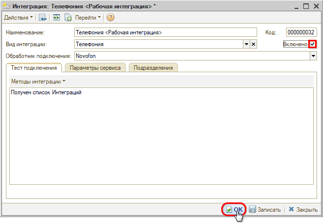

### 5. Получение URL для уведомлений

Для настройки подключения виртуальной АТС в Личном кабинете сервиса требуется прописать *URL для уведомлений* – адрес API внешней АТС.

Адрес представляет собой ссылку вида: “`https://api.5systems.ru/phone/v1/novofon/notify/0b812bc9-e4e2-41b2-a977-d046f3bb0f18/4f66429d-daf2-41e3-a456-123456abcdef`”.

Для того, чтобы получить адрес, следует в настройках выбора аккаунта нажать кнопку *“URL для уведомлений”,* и в открывшемся окне – кнопку *“Скопировать”:*

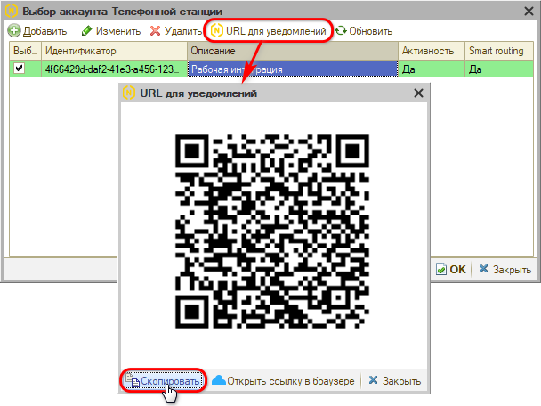

Полученную ссылку необходимо вставить в ЛК в разделе *Интеграции → API коннектор → Внешние системы → Адрес внешней системы* – см. [выше](#lk_url_dlya_uved).

---

**Теги:** телефония, novofon, интеграция, настройка, api-ключ, запись разговора
