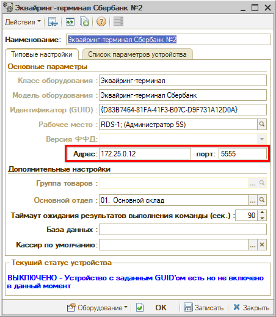

# Настройка подключения терминала эквайринга Сбербанка по сети

<table><tr><td><b>Время чтения:</b> 3 мин.</td><td><b>Обновлено:</b> 27.11.2024</td></tr></table>

Источник: https://www.5systems.ru/help/nastroyka-podklyucheniya-terminala-ekvayringa-sberbanka-po-seti

>  **Статья для опытных пользователей!**

## Содержание

1. [Введение](#введение)
2. [Описание настройки](#описание-настройки)

> *Функционал доступен начиная с релиза **2.8.1**.*

## Введение

Настройка для *сетевых эквайринг-терминалов Сбербанка* позволяет ускорить работу оборудования и сократить время пробития чеков, а также позволяет организовать работу с терминалом для нескольких пользователей.

Для данного режима подключения требуются специальные настройки в драйвере эквайринга, которые исключают работу с терминалом через com-порт.

## Описание настройки

В карточке настройки оборудования “Эквайринг-терминал” модели “Эквайринг-терминал Сбербанк” следует заполнить параметры *“Адрес”* и *“Порт”:*

- *Адрес* – в данном параметре следует указать адрес, по которому доступен сетевой эквайринг-терминал;
- *Порт* – в данном параметре необходимо указать порт, на котором находится эквайринг-терминал.

Для пользователей облачной версии программы настройки выполняются специалистами 5SYSTEMS. Требуется подключение к клиенту, поиск эквайринг-терминала, настройка роутера, настройка видимости для сервера адреса и порта.

Для пользователей, работающих на своем сервере, настройка может различаться в зависимости от того, находится ли сервер в одной сети с эквайринг-терминалом. Если терминал находится в одной сети, а сервер – в другой, тогда потребуется дополнительная настройка маршрутизации трафика.

При смене данных в параметрах “Адрес” и “Порт” необходимо после записи новых настроек перезайти в программу.

После установки настроенного сетевого терминала в параметрах рабочего места пользователя при входе в 1С каждый раз будет срабатывать запрос адреса и порта эквайринга, в результате чего корректно устанавливается оборудование и ускоряется его работа.

---

**Теги:** торговое оборудование, терминал сбербанка, эквайринг, подключение по сети

