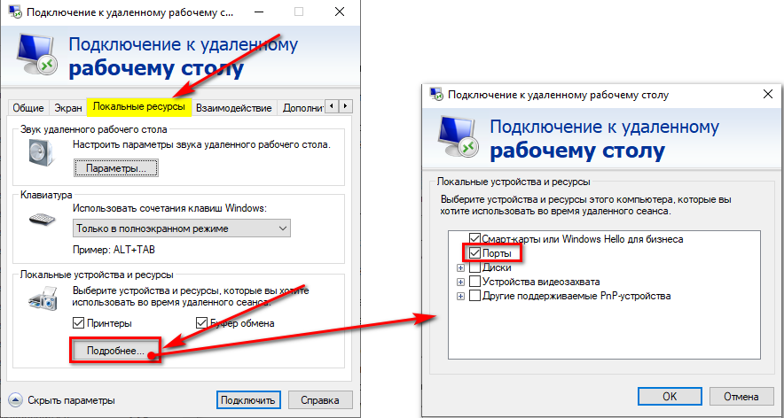
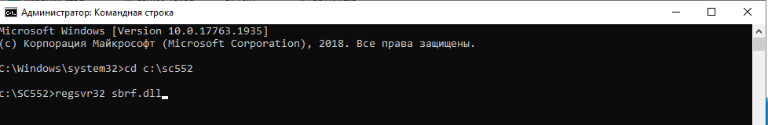
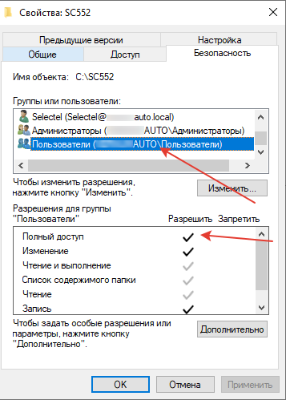

# Настройка терминала, подключенного по com-порту к ПК пользователя

<table><tr><td><b>Время чтения:</b> 5 мин.</td><td><b>Обновлено:</b> 25.11.2024</td></tr></table>

Источник: https://www.5systems.ru/help/nastroyka-terminala-podklyuchennogo-po-com-portu-k-pk-polzovatelya

>  **Статья для опытных пользователей!**

## Содержание

- [1. Настройка терминала на компьютере](#1-настройка-терминала-на-компьютере)
- [2. Настройка терминала на сервере](#2-настройка-терминала-на-сервере)

Также см. статьи: *[Подключение банковского терминала](../../Подключение%20банковского%20терминала/podklyuchenie-bankovskogo-terminala.md), [Установка универсального драйвера Сбербанка](../Установка%20универсального%20драйвера%20Сбербанка/ustanovka-universalnogo-drayvera-sberbanka.md)* и *[Настройка подключения терминала эквайринга Сбербанка по сети](../Настройка%20подключения%20терминала%20эквайринга%20Сбербанка%20по%20сети/nastroyka-podklyucheniya-terminala-ekvayringa-sberbanka-po-seti.md).*

## 1. Настройка терминала на компьютере

**1) Настройка терминала, подключенного по com порту к ПК пользователя**

Сотрудники Сбербанка поместили папку в корень системного диска на ПК пользователя, зарегистрировали, проверили, все работает.

В данном случае необходимо зайти в *Управление компьютером → диспетчер устройств → Порты*

Узнать, на какой порт подключен терминал: это важная информация (например, COM 4).

Запустить LoadParm.exe и сделать сверку. Если запускается, проходит, то переходим к настройке на сервере.

**2) Терминал не настроен на ПК через COM или не работает сверка с ПК пользователя**

Уточняем, точно ли через COM порт. Если да, то обращаемся в техподдержку Сбербанка для перенастройки хотя бы на компьютере пользователя, в идеале на сервере.

В случае отказа ищем драйвера USB для терминала в интернете. Это нужно для отображения терминала как com порт. Устанавливаем, подключенный терминал должен отобразится в диспетчере устройств в портах. Скачиваем папку SC552 из универсального драйвера, ставим на компьютер пользователя, регистрируем библиотеки, настраиваем ini файл (аналогично как на сервере, описание ниже).

Если не через COM, а сетевой, смотрим настройки сервера ниже.

Запускаем LoadParm.exe, запускаем сверку итогов, если она проходит нормально, то драйвер настроен и работает.

## 2. Настройка терминала на сервере

**Проброс портов**

Основной момент: при подключении по rdp или remoteapp должна стоять настройка проброса портов.

Для RDP на вкладке *«Локальные ресурсы → Подробнее»* поставить галочку *«Порты»*. Сохранить. Порт подхватывает при авторизации пользователя на сервере.

Для Remoteapp redirectcomports:i:1

**Копируем папку SC552, которую добавили на ПК сотрудники Сбербанка**

Берем папку SC552 с компьютера пользователя и копируем на сервер на системный диск.

**Регистрируем библиотеки на сервере**

Запускаем cmd от админа. Переходим в папку SC552, регистрируем SBRFCOM.dll и sbrf.dll

Cd c:\\sc552

Regsvr32 sbrf.dll

Regsvr32 SBRFCOM.dll

При этом должно оповестить об успешной регистрации dll. Если же возникает ошибка, то драйвер некорректный. Важно, чтобы обе dll были зарегистрированы.

**Настраиваем pinpad.ini на сервере**

Примерный текст. Номер порта тут должен соответствовать номеру порта терминала на ПК пользователя. (; в начале строки ее закомментирует)

<table><tr><td>При настройке по com</td><td>При настройке на сетевой терминал</td></tr><tr><td>ComPort=4 – PrinterEnd=22 PrinterFile=p – Speed=115200 ShowScreens=1 NewProtocol=1 PrinterEnd=010D0A</td><td>;ComPort=4 EnableUSB=0 PrinterEnd=01 PrinterFile=p PinpadLog=0 Speed=115200 ShowScreens=1 PinpadIPAddr=*.*.*.* PinpadIPPort=5555</td></tr></table>

Обычно текст настроек pinpad.ini на ПК пользователя и на сервере одинаков.

**Проверяем в папке на сервере**

Если запускается и сверка итогов проходит достаточно быстро, то переходим далее.

Если запускается, но при этом возникают проблемы, висит на проверке связи, либо попытки подключения, то скорее всего драйвер (папка sc552) не подходит для этого терминала. Пробуем качать «Последний адекватно работающий драйвер». Настраиваем его и на ПК и на сервере.

Если LoadParm.exe не запускается вообще, то проблема в номере ком порта, если сверили и они одинаковы на пк и сервере, то выйти из пользователя на сервере и зайти снова. Именно выйти из пользователя, а не просто закрыть РДП подключение. Порт подхватывает при авторизации пользователя на сервере.

**Даем доступ к папке**

Механика тут такая: при пробитии чека в 1С, Драйвер под залогиненным пользователем записывает его изначально в файл “p” в папке, потом он идет на кассу. Если у него не будет доступа к папке, то у него не будет в 1С пробиваться чек.

**Проверяем в 1С на сервере**

**Добавляем терминал в справочник «Оборудование», в рабочее место пользователя.**

Запускаем 1С, пробиваем чек на 1 р. по безналу.

<table><tr><td><b><i>Важно: При этом у пользователя право «Разрешить ручную авторизацию безналичных платежей» должно стоять в значении «Нет»*.</i></b></td></tr></table>

*\*Без этого не будет работать.*

Если запрещена ручная авторизация, чек пробивается, не выходит ошибок, напечатался чек на кассе, провелся чек в 1C, то все настроено.

Пробиваем возврат по чеку.

---

**Теги:** торговое оборудование, терминал сбербанка, com-порт, эквайринг, сервер

