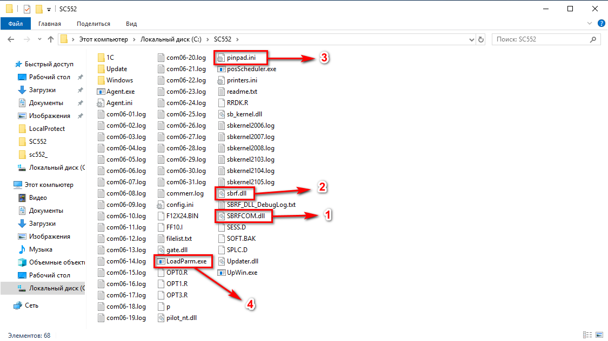
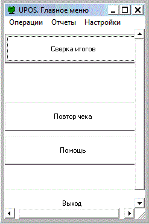

# Установка универсального драйвера Сбербанка

<table><tr><td><b>Время чтения:</b> 4 мин.</td><td><b>Обновлено:</b> 25.11.2024</td></tr></table>

Источник: https://www.5systems.ru/help/ustanovka-universalnogo-drayvera-sberbanka

>  **Статья для опытных пользователей!**

Также см. статьи: *[Подключение банковского терминала](../../Подключение%20банковского%20терминала/podklyuchenie-bankovskogo-terminala.md), [Настройка терминала, подключенного по com-порту к ПК пользователя](../Настройка%20терминала%20по%20com-порту/nastroyka-terminala-podklyuchennogo-po-com-portu-k-pk-polzovatelya.md)* и *[Настройка подключения терминала эквайринга Сбербанка по сети](../Настройка%20подключения%20терминала%20эквайринга%20Сбербанка%20по%20сети/nastroyka-podklyucheniya-terminala-ekvayringa-sberbanka-po-seti.md).*

Настройка терминалов обычно выполняется поставщиками терминала – обычно на компьютере пользователя. Но при работе через RDP или RemoteAPP необходима настройка на сервере. Для разных терминалов нужны разные драйвера. Но для корректной работы на сервере они должны работать через один универсальный драйвер.

Ссылка для скачивания универсального драйвера на сервер для терминала Сбербанка: [https://disk.yandex.ru/d/OflZ1xSITa3rtw](https://disk.yandex.ru/d/OflZ1xSITa3rtw)

Универсальный драйвер представляет собой папку SC552 в корне системного диска.

**Важные файлы:**

1. SBRFCOM.dll – Библиотека, которую нужно зарегистрировать через cmd, для работы с 1C
2. sbrf.dll – Библиотека, которую нужно зарегистрировать через cmd, для работы с терминалом
3. pinpad.ini – Настройки, от правильности которых зависит работоспособность терминала на сервере
4. LoadParm.exe – Утилита сбербанка, для проверки работоспособности через «Сверку итогов»  
   

---

**Теги:** торговое оборудование, драйвер сбербанка, терминал, эквайринг, установка
