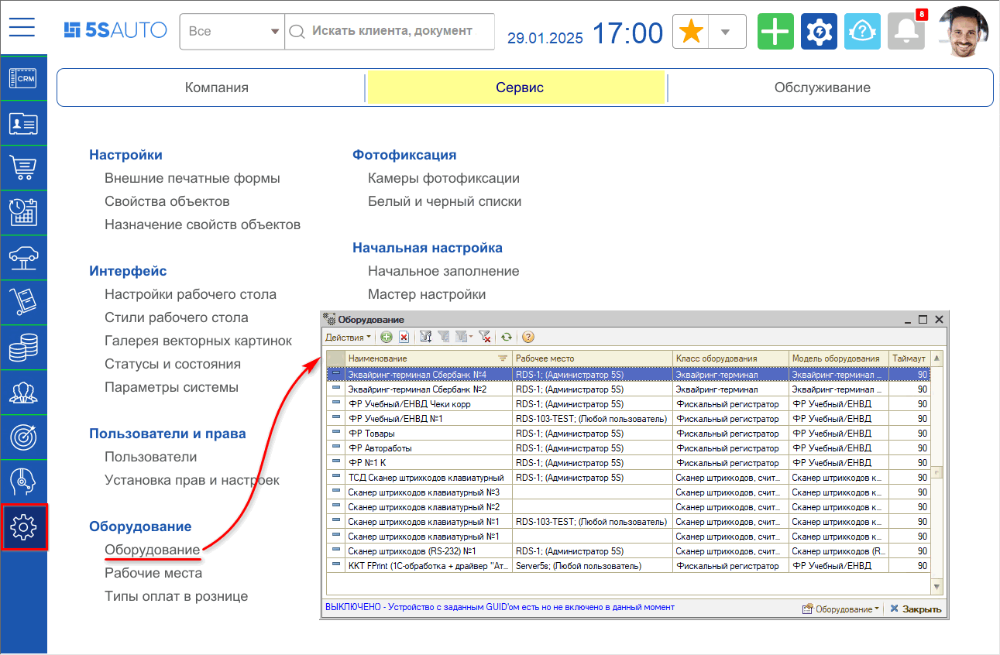
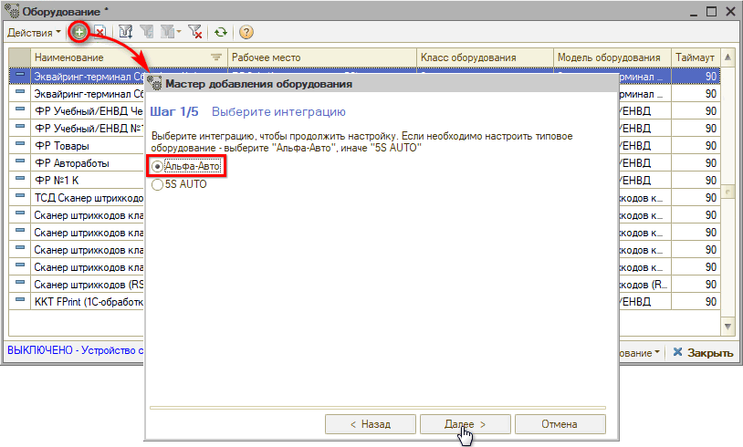
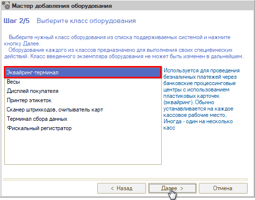
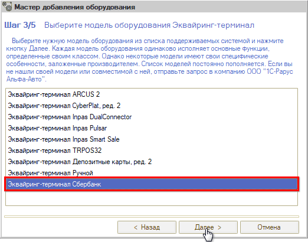
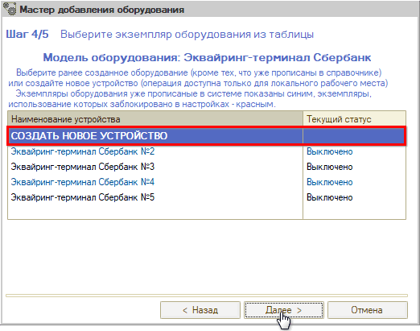
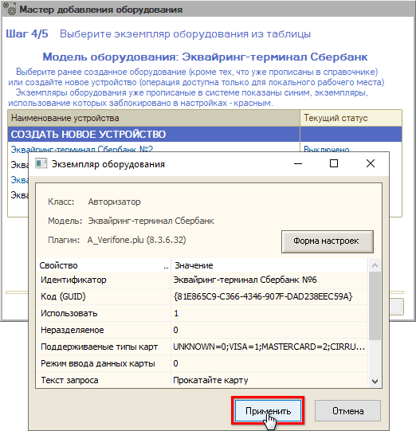
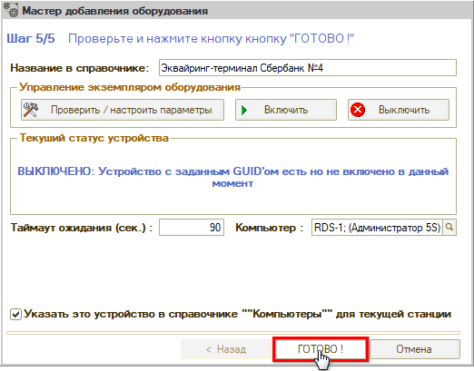
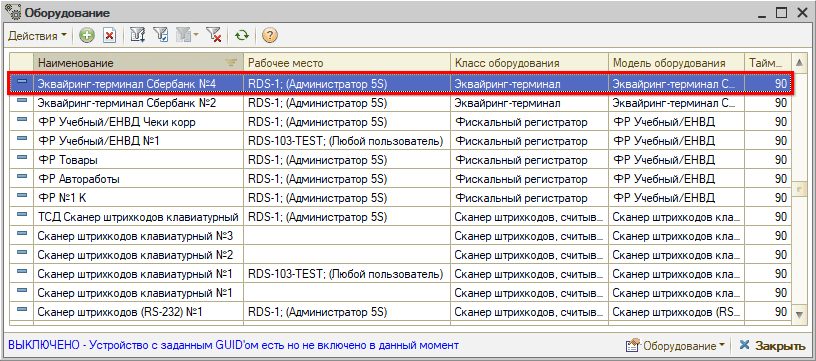
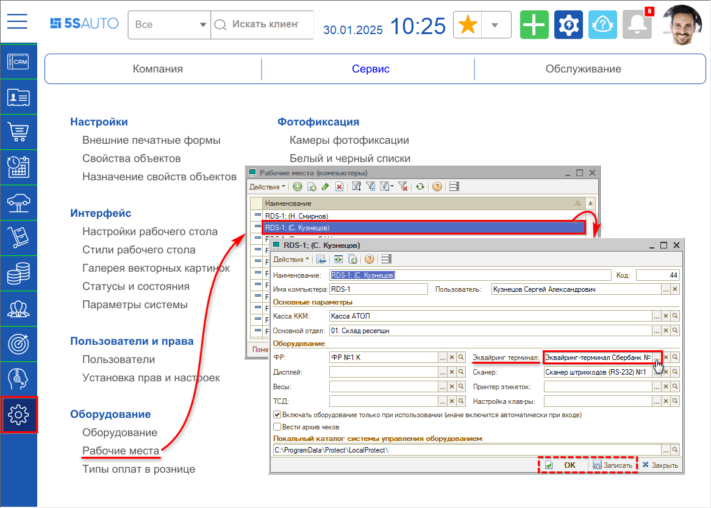

# Подключение банковского терминала

<table><tr><td><b>Время чтения:</b> 9 мин.</td><td><b>Обновлено:</b> 30.01.2025</td></tr></table>

Источник: https://www.5systems.ru/help/podklyuchenie-bankovskogo-terminala

>  **Статья для опытных пользователей!**

## Содержание

1. [Подготовка к настройке](#подготовка-к-настройке)
2. [Подключение терминала](#подключение-терминала)
3. [Настройка терминала в Рабочем месте](#настройка-терминала-в-рабочем-месте)

## Подготовка к настройке

Для того, чтобы настроить банковский терминал, сначала требуется вызвать специалиста Сбербанка (или другого банка) для установки драйверов на компьютер и на сервер (если они еще не установлены). Если этого не сделать, то сервер не будет "видеть" терминал.

## Подключение терминала

Далее требуется зайти под учетной записью Администратора (либо другого пользователя с правами Администратора) в программу.

Переход в справочник "Оборудование" – *Администрирование → Сервис → Оборудование:*

Нажатием на кнопку "Добавить "   открывается *"Мастер добавления оборудования".*

1. На *Шаге 1* требуется выбрать *интеграцию* "Альфа-Авто" и нажать кнопку "Далее":

   

2. На *Шаге 2* требуется выбрать *класс оборудования* "Эквайринг-терминал" и нажать кнопку "Далее":

   

3. На *Шаге 3* следует выбрать нужную *модель оборудования* (обычно эквайринг-терминал Сбербанк или эквайринг-терминал ВТБ) и нажать кнопку "Далее":

   

4. На *Шаге 4* следует *создать новое устройство* – выбрать вариант "СОЗДАТЬ НОВОЕ УСТРОЙСТВО" и нажать кнопку "Далее":

   

   Открывается окно *"Экземпляр оборудования"* – следует нажать кнопку "Применить" (окно при этом закрывается):

   

5. На *Шаге 5* следует в "Мастере добавления оборудования" нажать кнопку "Готово":

   

   В окне справочника "Оборудование" появляется терминал:

   

## Настройка терминала в Рабочем месте

Чтобы терминал работал у определенного пользователя, необходимо проверить, добавлен ли он в *Рабочие места.* Для этого следует перейти в справочник "Рабочие места": *Администрирование → Сервис → Оборудование → Рабочие места*. У каждого пользователя должно быть рабочее место:

В карточке рабочего места в поле "Оборудование" требуется выбрать эквайринг-терминал и установить галочку "*Включать оборудование только при использовании (иначе включится автоматически при входе)"*. То есть, пользователи, которые работают с выбранным здесь в карточке оборудованием, будут его занимать, когда непосредственно будут пробивать и печатать чеки на кассе. Это нужно для того, чтобы не висела ошибка, что занято оборудование, – если через один терминал пробивают чеки несколько пользователей.

Для *эквайринг-терминалов Сбербанка* в зависимости от способа подключения могут потребоваться дальнейшие настройки – см. в *[статьях](../Настройка%20терминалов%20Сбербанка/).*

---

**Теги:** торговое оборудование, банковский терминал, эквайринг, подключение, рабочее место
