

# Подключение кассы ККМ

<table><tr><td><b>Время чтения:</b> 25 мин.</td><td><b>Обновлено:</b> 09.09.2025</td></tr></table>

Источник: https://www.5systems.ru/help/podklyuchenie-kassy-kkm

## Содержание

1. [Введение](#введение)
2. [Подключение учебной кассы](#подключение-учебной-кассы)
3. [Подключение рабочей кассы](#подключение-рабочей-кассы)
   - [1. Настройка оборудования](#настройка-оборудования)
   - [2. Настройка доступа порта через сторонние программы](#настройка-доступа-порта-через-сторонние-программы)
   - [3. Подключение кассы АТОЛ](#подключение-кассы-атол)
   - [4. Подключение кассы Штрих-М](#подключение-кассы-штрих-м)
   - [5. Установка системы защиты оборудования](#установка-системы-защиты-оборудования)
4. [Подключение оборудования к рабочему месту (компьютеру)](#подключение-оборудования-к-рабочему-месту-компьютеру)
5. [Пароль кассира ККМ](#пароль-кассира-ккм)
6. [Ставки НДС и Налоговые группы](#ставки-ндс-и-налоговые-группы)
7. [Совместное использование одной кассы с нескольких компьютеров](#совместное-использование-одной-кассы-с-нескольких-компьютеров)
8. [Работа с несколькими кассами с одного компьютера](#работа-с-несколькими-кассами-с-одного-компьютера)
9. [Настройка права для печати чека, если сумма не кратна количеству](#настройка-права-для-печати-чека-если-сумма-не-кратна-количеству)

## Введение

В рамках данной статьи рассматривается подключение учебной кассы для проведения обучения и тренировок по пробитию чеков и рабочей кассы: АТОЛ, Штрих-М.

## Подключение учебной кассы

Для подключения учебной кассы:

1. Откройте справочник "Оборудование" (меню программы: *Администрирование → Сервис → Оборудование).*
2. Перейдите в мастер добавления оборудования:  
   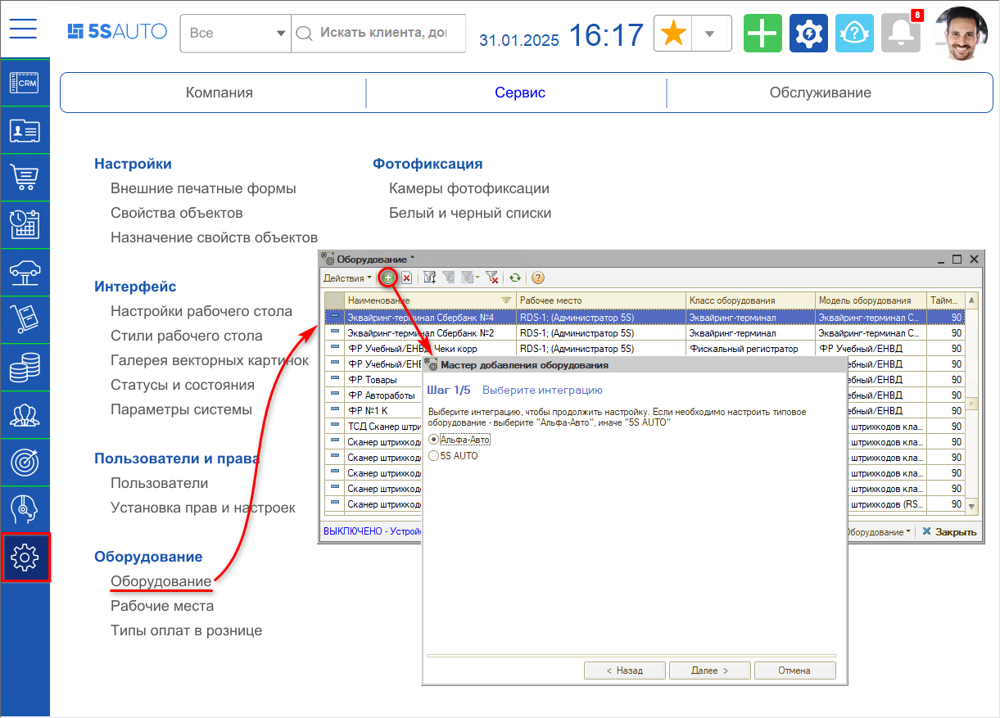
3. В мастере добавления оборудования:
   - 1\. На первом шаге выберите интеграцию "Альфа-Авто":  
         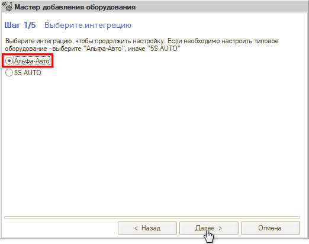
   - 2\. На втором шаге выберите класс оборудования "Фискальный регистратор" и нажмите "Далее":  
         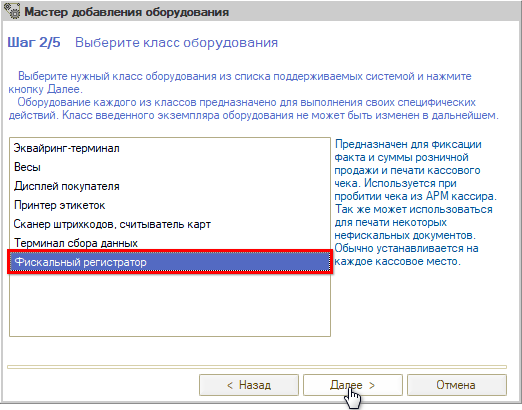
   - 3\. На третьем шаге выберите модель оборудования "ФР Учебный/ЕНВД" и нажмите "Далее":  
         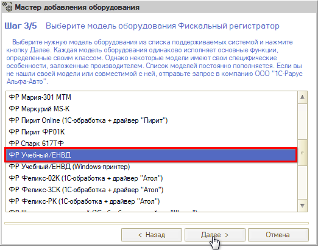
   - 4\. На четвертом шаге выберите устройство "СОЗДАТЬ НОВОЕ УСТРОЙСТВО" и нажмите кнопку далее:  
         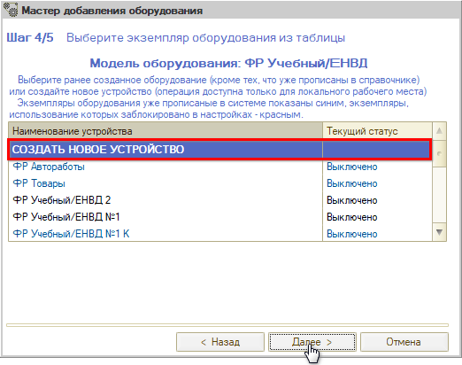
   - 5\. Примените настройки учебного оборудования по умолчанию:  
         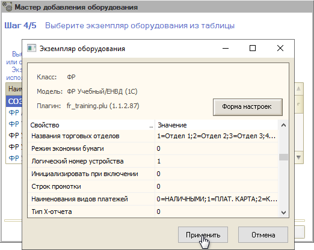
   - 6\. На четвертом шаге нажмите кнопку "ГОТОВО!" для завершения добавления:  
         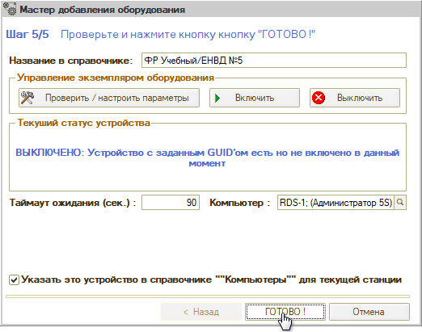

ГОТОВО! Учебное оборудование подключено к [рабочему месту](../Рабочие%20места/rabochie-mesta.md) пользователя, который произвел добавление оборудования. Теперь можно пробовать провести оплату через подключенное учебное оборудование.

ВАЖНО! В настройках оборудования убедитесь, что правильно настроен параметр "Наименования видов платежей" (см. ниже: "*[Настройка оборудования](#настройка-оборудования)").*

## Подключение рабочей кассы

Для подключения рабочей кассы:

1. Откройте справочник "Оборудование" (меню программы: *Администрирование → Сервис → Оборудование).*
2. Перейдите в мастер добавления оборудования – *см. выше.*
3. В мастере добавления оборудования:
   - 1\. На первом шаге выберите интеграцию "Альфа-Авто":  
         
   - 2\. На втором шаге выберите класс оборудования "Фискальный регистратор" и нажмите "Далее":  
         
   - 3\. На третьем шаге выберите модель подключаемого оборудования (см. ниже "*[Подключение кассы АТОЛ](#подключение-кассы-атол)"* или "*[Подключение кассы Штрих-М](#подключение-кассы-штрих-м)")* и нажмите "Далее".
   - 4\. На четвертом шаге выберите устройство "СОЗДАТЬ НОВОЕ УСТРОЙСТВО" и нажмите "Далее".
   - 5\. В открывшемся окне "Экземпляр оборудования" выполните необходимые настройки подключаемого оборудования (см. ниже *"[Настройки оборудования](#настройка-оборудования)")* сразу и нажмите кнопку "Применить" или отложите настройку, просто закрыв окно.
   - 6\. На пятом шаге нажмите кнопку "ГОТОВО!" для завершения добавления.

ГОТОВО! Оборудование подключено.

### Настройка оборудования

Настройки оборудования задаются либо в процессе добавления оборудования, либо по уже добавленному оборудованию:

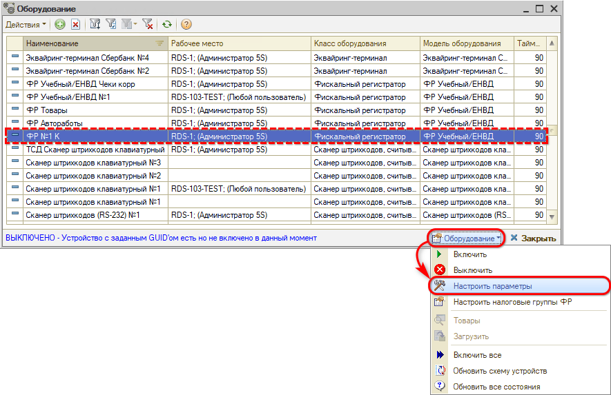

В настройках оборудования как для учебных касс, так и для рабочих важно правильное указание наименований видов платежей (параметр "Наименования видов платежей").

Наименования видов платежей, перечисленные в параметре "Наименования видов платежей", должны быть идентичны заданным значениям наименований в справочнике "Типы оплат в рознице" (меню программы: Администрирование → Сервис → Оборудование → Типы оплат в рознице):

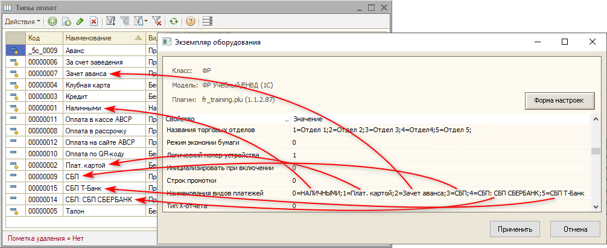

*Обратите внимание!* Чтобы принимать предоплату через кассу, должен быть доступен для выбора вид оплаты "Зачет аванса". Для этого необходимо прописать вид платежа в настройках оборудования:

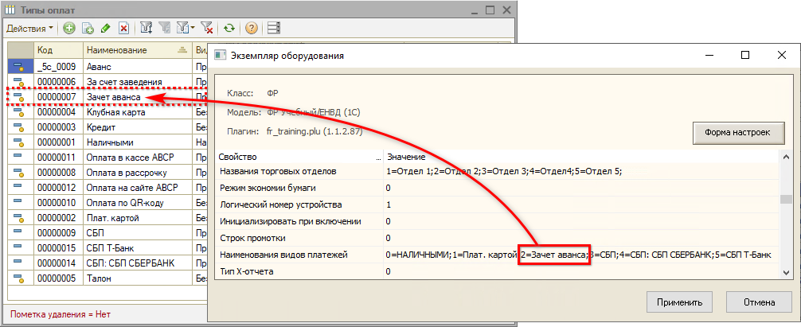

В настройках оборудования необходимо указать способ подключения.

Если касса подключена через USB, то:

1. В параметре Использовать подключение по сети" (АТОЛ)/"Использовать для подключения COM-0, Ethernet-1" (Штрих-М) установите значение 0 (значение по умолчанию).
2. В параметре "Номер порта" укажите номер порта USB, куда подключена касса.

Если касса подключена через компьютерную сеть, то:

1. В параметре "Использовать подключение по сети" (АТОЛ)/"Использовать для подключения COM-0, Ethernet-1" (Штрих-М) установите значение 1.
2. В параметре "IP-адрес хоста" (АТОЛ)/"IP-адрес"(Штрих-М) укажите IP-адрес сети, куда подключена касса.
3. В параметре "TCP порт" укажите номер порта (обычно по умолчанию для касс Штрих-М - 7778, для АТОЛ - 5555).

### Настройка доступа порта через сторонние программы

При подключении кассы через USB может потребоваться создание COM-порта и установка приложения VSPE, чтобы сделать данный порт доступным через сеть:

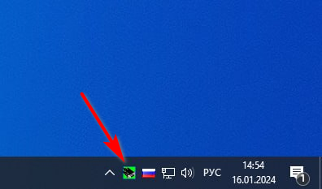

*Примечание:* При запуске программы появляется окно с предложением лицензии – следует нажать "Нет" и убедиться, что в системном трее снизу справа на панели задач появилась иконка программы.

Для того, чтобы сделать данный COM-порт доступным для сервера, также может потребоваться настройка соединения через VPN. Данная программа может быть установлена на компьютер либо на роутер, в зависимости от технических возможностей.

*Примечание:* Настраивается автоматический запуск обеих программ при включении компьютера.

### Подключение кассы АТОЛ

На втором шаге мастера добавления оборудования (см. выше *"[Подключение рабочей кассы](#подключение-рабочей-кассы)")* необходимо выбрать модель оборудования "ККТ FPrint (1С-обработка+драйвер "Атол")":

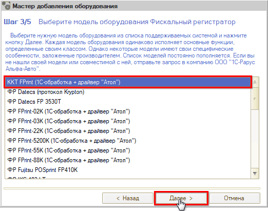

Чтобы данная модель оборудования появилась в списке:

1. должна *быть* *установлена система защиты оборудования текущего релиза 1С-Рарус* *Альфа-Авто* (см. ниже "[*Установка системы защиты оборудования*](#установка-системы-защиты-оборудования)").
2. должен быть установлен *драйвер для оборудования АТОЛ* (см. [далее](#установка-драйвера-оборудования-атол)).

#### Установка драйвера оборудования АТОЛ

Чтобы установить драйвер для кассы АТОЛ:

1. Скачайте актуальный драйвер кассы АТОЛ. Скачать можно *по ссылке:* 
   [https://fs.atol.ru/SitePages/Центр%20загрузки.aspx](https://fs.atol.ru/SitePages/Центр%20загрузки.aspx) 
   *→ Программное обеспечение → ДТО → 10.x → KKT10...-32-bit (32-х битный установщик)*
2. Перейдите к установке драйвера, запустив файл \\installer\\exe\\KKT10-10.5.0.0-windows32-setup.exe. ВАЖНО! запускать необходимо именно 32-битный исполняемый файл.

### Подключение кассы Штрих-М

На втором шаге мастера добавления оборудования (см. выше *"[Подключение рабочей кассы](#подключение-рабочей-кассы)")* необходимо выбрать модель оборудования "ФР ШТРИХ-М-ONLINE (1С-обработка + драйвер "Штрих")":

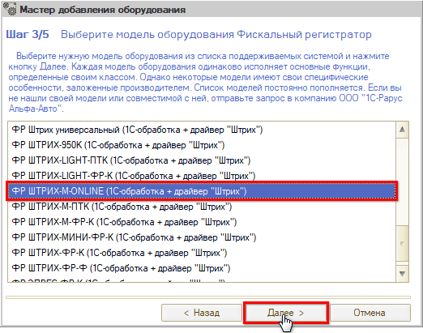

Чтобы данная модель оборудования появилась в списке:

1. должна быть *установлена система защиты оборудования текущего релиза 1С-Рарус Альфа-Авто* (см. ниже *"[Установка системы защиты оборудования](#установка-системы-защиты-оборудования)"*).
2. должен быть установлен *драйвер для оборудования Штрих-М* (см. [далее](#установка-драйвера-оборудования-штрих-м)).

#### Установка драйвера оборудования Штрих-М

Чтобы установить драйвер для кассы Штрих-М:

1. Скачайте актуальный драйвер кассы Штрих-М. Скачать можно *[по ссылке](https://shtrih-m-nsk.ru/technical-library/drayvera-i-proshivki-dlya-on-line-kkm/)* из раздела *"Драйверы для On-Line ККТ":*  
   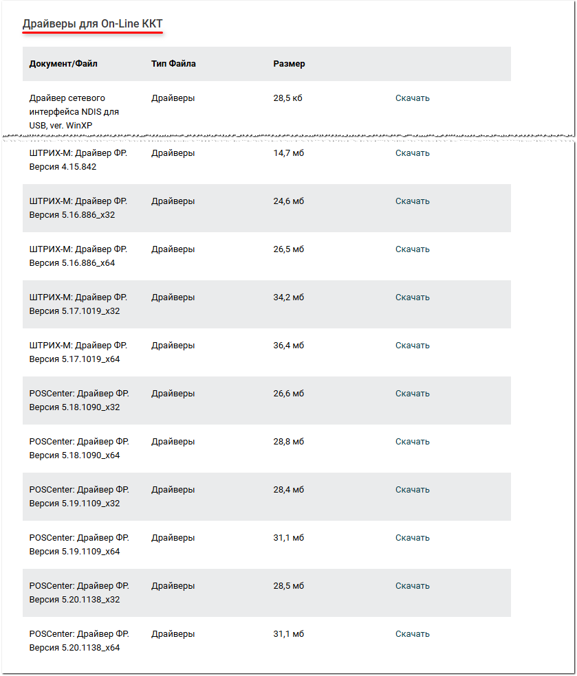  
   *Примечание: Уточнить, какой именно драйвер следует выбрать, можно у специалистов 5SYSTEMS.*
2. Установите скачанный драйвер.

### Установка системы защиты оборудования

Для подключения рабочих касс ККМ необходимо предварительно установить систему защиты оборудования текущего релиза программы 1С-Рарус Альфа-Авто.

В поставке релиза программы 1С-Рарус Альфа-Авто находится файл для установки системы защиты оборудования. Исполняемый файл находится в папке \\EquipmentSetup\\.

ВАЖНО! В процессе установки системы защиты оборудования должны быть закрыты все запущенные программы 1С-Рарус Альфа-Авто на сервере и локальных компьютерах, так как они блокируют каталог для установки.

## Подключение оборудования к рабочему месту (компьютеру)

Для того, чтобы настроенная касса ККМ заработала, она должна быть подключена к [рабочему месту (компьютеру)](../Рабочие%20места/rabochie-mesta.md) пользователя. Подключение осуществляется двумя способами:

1. На четвертом шаге Мастера добавления оборудования по умолчанию подключить оборудование к текущей станции:  
   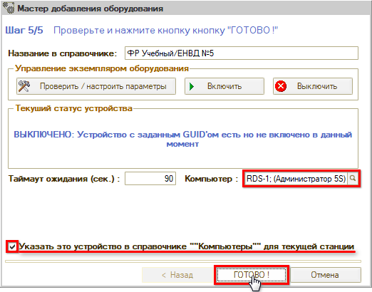
2. У рабочего места выбрать подключенный фискальный регистратор в справочнике "Рабочие места (компьютеры)" (меню программы: Справочники → Розница и оборудование → Рабочие места (компьютеры)):  
   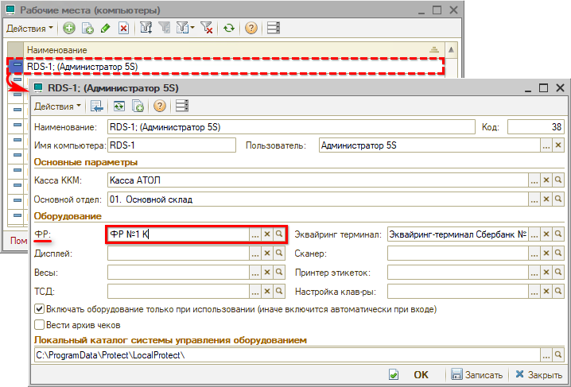  
   Подробнее о настройке рабочего места см. в [статье](../Рабочие%20места/rabochie-mesta.md).

## Пароль кассира ККМ

Для того, чтобы идентифицировать кассира ККМ и синхронизировать работу программы с кассой ККМ с целью пробития чека, в программе необходимо ввести пароль кассира ККМ, заданный ему в *настройках оборудования* (см. [выше](#настройка-оборудования)).

Пароль вводится в карточке пользователя:

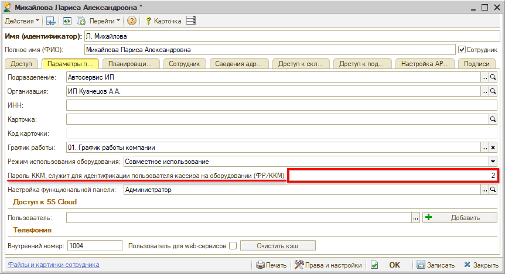

### Пароль кассира ККМ в настройках драйвера оборудования

Пароли кассира можно посмотреть в утилите *Тест драйвера* подключенной кассы ККМ. Чтобы перейти к паролям кассира:

1. Нажмите кнопку "Настройка свойств", в окне "Свойства" перейдите к Таблицам:  
   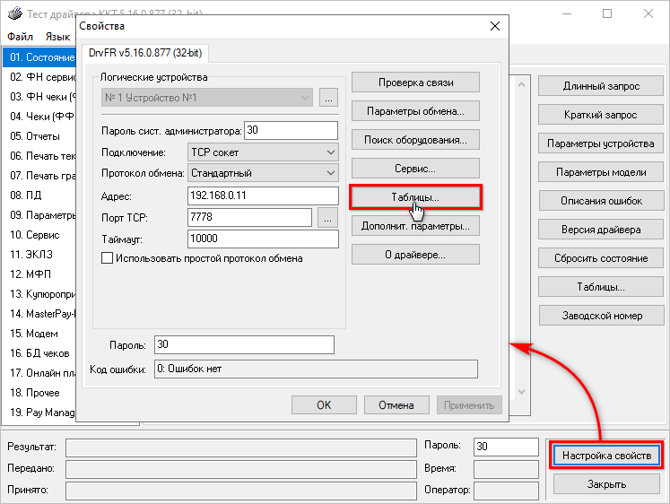
2. Выберите таблицу "Пароли кассиров и администраторов" и нажмите кнопку "Открыть":  
   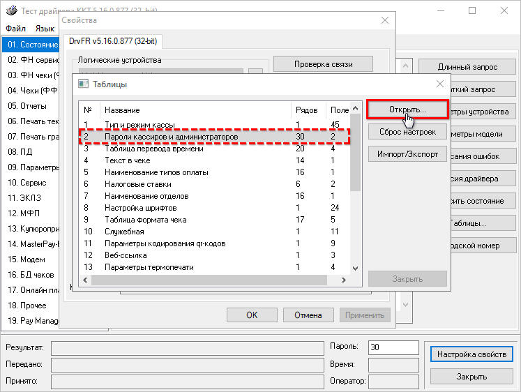
3. В таблице с паролями скопируйте пароль кассира, которого синхронизируете с программой:  
   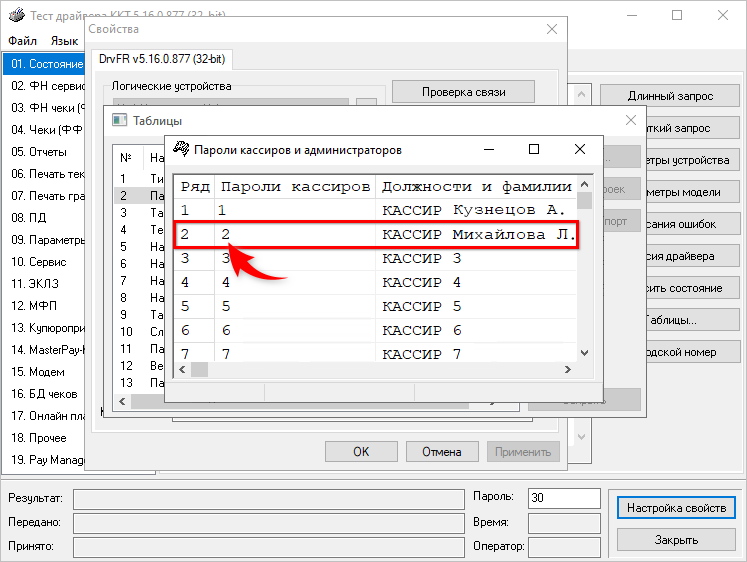

## Ставки НДС и Налоговые группы

*Примечание: Налоговые ставки НДС 5% и 7% действуют с 01.01.2025 г., ставка НДС 22% – с 01.01.2026 г. Текущее описание раздела актуально начиная с версии релиза 2.8.3.12.*

Для того чтобы ставки НДС корректно печатались в чеках, необходимо настроить соответствие ставок НДС в программе со ставками из настроек драйвера ФР.

При настройке номеров налоговых групп требуется учесть, что у ККМ, работающих на разных драйверах (АТОЛ/ШТРИХ-М), ставки НДС находятся под разными налоговыми группами. Без корректной настройки налоговых групп возможны проблемы с ФНС и ОФД.

Также см. статью "[Применение НДС при УСН](../../Практики/Применение%20НДС%20при%20УСН/primenenie-nds-pri-usn.md)".

**1. Настройка справочника ставок НДС**

В программе настройки ставок производятся в справочнике *"Администрирование → Компания → Прочие классификаторы → Ставки НДС":*

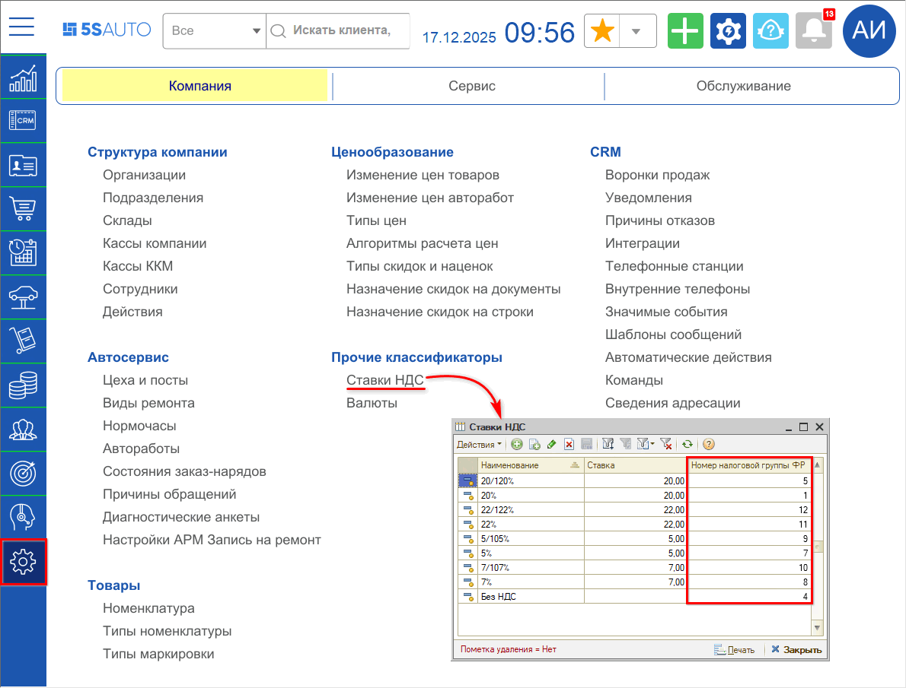

В справочнике "Ставки НДС" необходимо задать *номера налоговых групп,* которые указаны *в настройках драйвера ФР* (на скриншоте пример настройки для кассы “ШТРИХ-М”).

*Важно! Требования к кассам:*

- прошивка кассы должна быть обновлена на актуальную версию;
- обязателен ФФД 1.2 – требуется обновить, если это не было сделано ранее;
- установлен новый драйвер.

***Пример 1.*** Список ставок НДС в Тест драйвере кассы "Штрих-М":

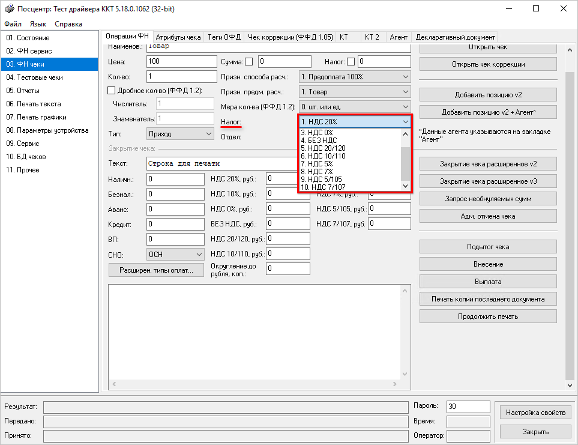

Пример соответствия *номеров налоговых групп* и *ставок НДС* для кассы "ШТРИХ-М":

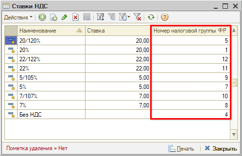

- 1 – 20%;
- 4 – Без НДС;
- 5 – 20/120%;
- 7 – 5%;
- 8 – 7%;
- 9 – 5/105%;
- 10 – 7/107%;
- 11 – 22%;
- 12 – 22/122%

***Пример 2.*** Список ставок НДС в Тест драйвере кассы "Атол":

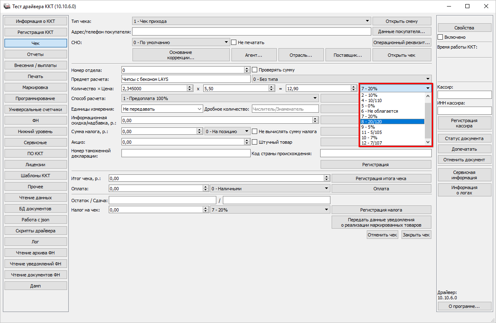

Пример соответствия *номеров налоговых групп* и *ставок НДС* для кассы "АТОЛ":

- 6 – Без НДС;
- 7 – 20%;
- 8 – 20/120%;
- 9 – 5%;
- 10 – 7%;
- 11 – 5/105%;
- 12 – 7/107%;
- 13 – 22%;
- 14 – 22/122%

В случае использования нескольких касс разных производителей (ШТРИХ-М/АТОЛ) номера налоговых групп в настройках ставок НДС будут различаться. В данном случае необходимо дополнительно настроить соответствие налоговых групп в справочнике “Оборудование” – для каждой кассы (см. [далее](#nds_v_oborud)).

*Примечание:* В случае использования касс одного производителя следует настроить налоговые группы в общем справочнике “Ставки НДС”, в оборудовании в данном случае их можно не настраивать.

**2. Настройка в справочнике “Оборудование”**

Настройку *соответствий налоговых групп* следует произвести в справочнике “Оборудование” *для каждого* используемого ФР. Для этого следует активировать строку с нужным оборудованием и перейти по кнопке *“Оборудование → Настроить налоговые группы ФР”:*

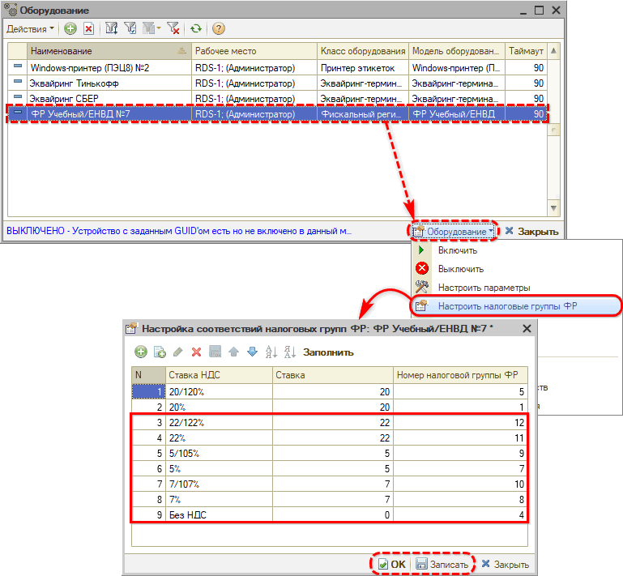

Необходимо указать номера налоговых групп из настроек драйверов ФР. Прошивка кассы должна быть обновлена на актуальную версию и установлен новый драйвер.

Настройка номера налоговой группы в карточке оборудования будет выше по приоритету, чем настройка в справочнике ставок НДС (см. [выше](#spr_stavok_nds)), т.е. налоговая группа будет подтягиваться в кассовые документы в первую очередь из настроек оборудования.

1. Пример настройки для касс “ШТРИХ-М”:

   

2. Пример настройки для касс “АТОЛ”:

   

Чтобы проверить корректность настроек НДС, следует пробить обычный чек и предоплатный чек – на обычном должен быть НДС 22%, а на предоплатном 22/122% – а затем их вернуть.

## Совместное использование одной кассы с нескольких компьютеров

В случае совместного использования одной кассы с нескольких компьютеров необходимо произвести следующие настройки:

1. в карточке пользователя на вкладке "Параметры пользователя" установить *режим использования оборудования "Совместное использование":*

   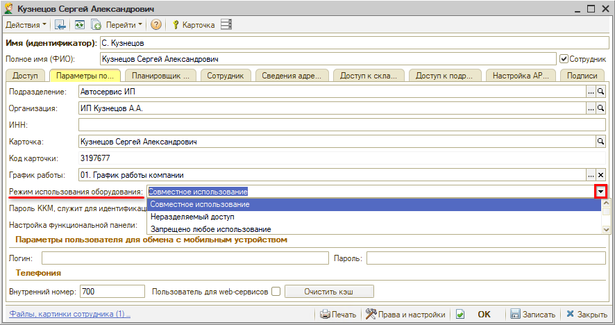

2. в настройках рабочего места установить галочку "Включать оборудование только при использовании":

   

***Внимание!*** Данный режим *замедляет работу касс.* Поэтому, если нет острой необходимости его использования, его рекомендуется отключать. 
Подробнее о настройке рабочего места см. в статье *"[Рабочие места](../Рабочие%20места/rabochie-mesta.md)".*

Для *монопольной работы* с кассой необходимо установить следующие настройки:

1. в карточке пользователя на вкладке "Параметры пользователя" выбрать режим "Неразделяемый доступ":

   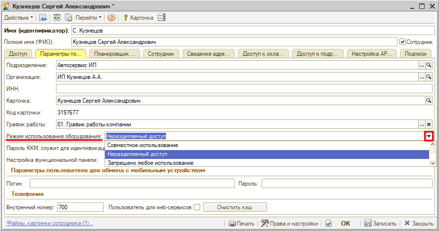

2. в настройках рабочего места снять галочку "Включать оборудование только при использовании":

   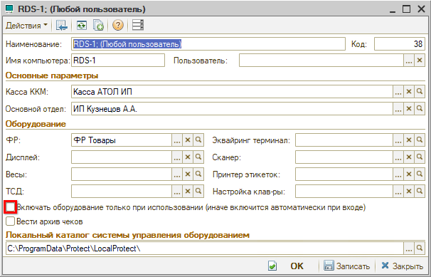

## Работа с несколькими кассами с одного компьютера

По умолчанию, при подключении ККМ работает логика выбора оборудования исходя из настроек [рабочего места](../Рабочие%20места/rabochie-mesta.md).

Для работы с несколькими кассами с одной учетной записи на одном компьютере требуется включить право, которое меняет данную логику.

### Настройка права выбора организации и подразделения в ККМ

[Право](../../Пользователи%20и%20права/Установка%20прав%20и%20настроек%20пользователя/ustanovka-prav-i-nastroek-polzovatelya.md) *"Контроль организации и подразделения в ККМ"* настраивается на компанию:

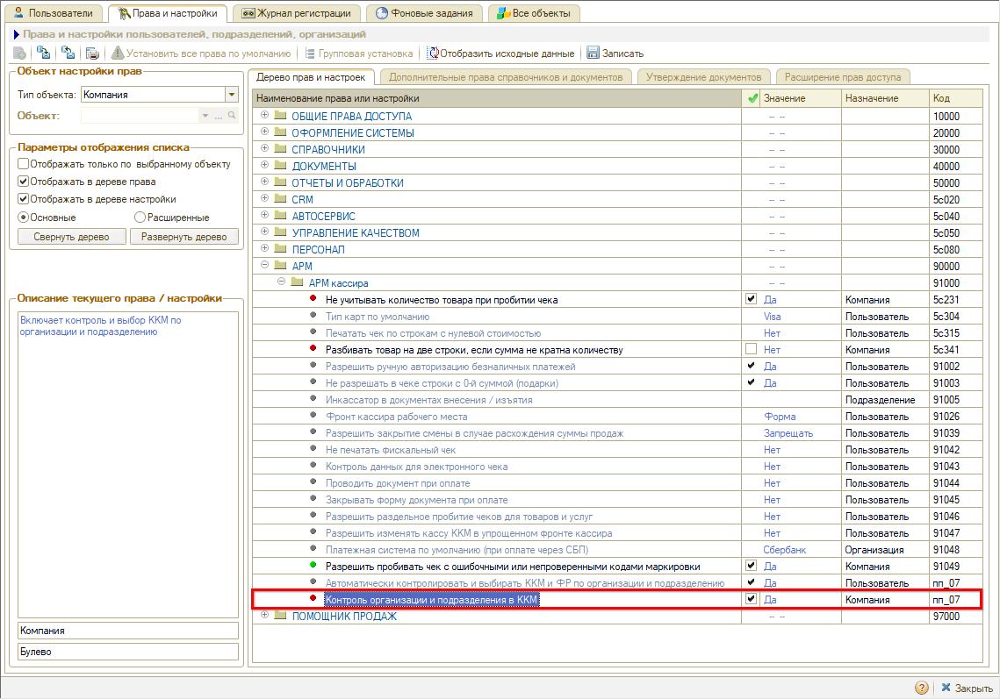

Право включает выбор кассы ККМ по организации и подразделению документа.

Таким образом, если данное право включено (значение "Да"), то меняется логика выбора оборудования: производится поиск кассы, у которой склад (основной отдел) имеет такие же подразделение и организацию, как у текущего документа.

### Настройка оборудования

В справочнике "Оборудование" требуется настроить привязку касс к складам, а от складов будет идти привязка к подразделениям. Организация и подразделение будут подтягиваться в документ "Чек на оплату":

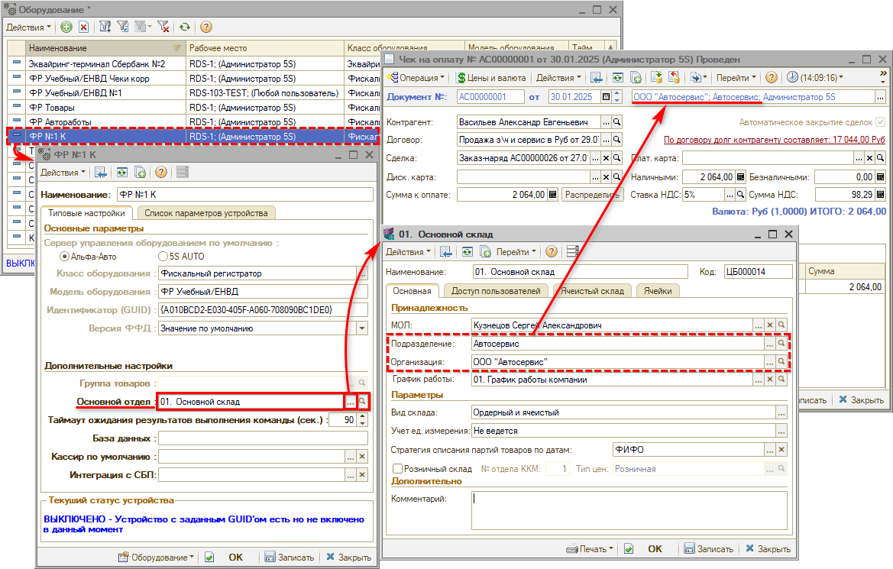

## Настройка права для печати чека, если сумма не кратна количеству

Иногда, если сумма не кратна количеству, чек не будет печататься. В данном случае требуется включить право "Разбивать товар на две строки, если сумма не кратна количеству":

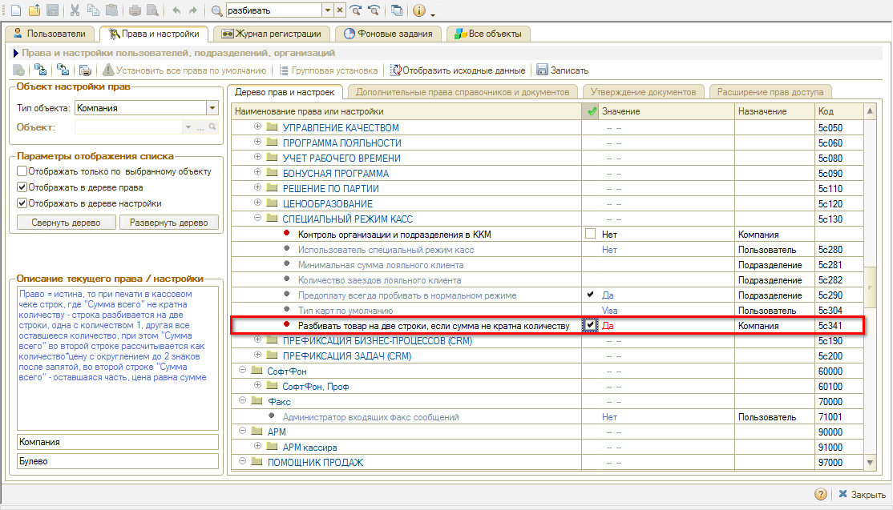

Если установить значение права = "Да", то при печати в кассовом чеке строк, где "Сумма всего" не кратна количеству, строка будет разбиваться на две строки: одна с количеством 1, другая – всё оставшееся количество. При этом "Сумма всего" во второй строке рассчитывается как количество\*цену с округлением до 2 знаков после запятой, во второй строке "Сумма всего" – оставшаяся часть, цена равна сумме.

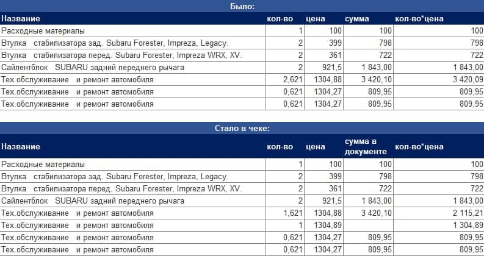

---

**Теги:** торговое оборудование, касса ккм, подключение кассы, атол, штрих-м, драйвер, пароль кассира, ставки ндс

