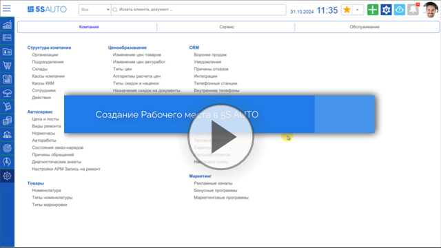
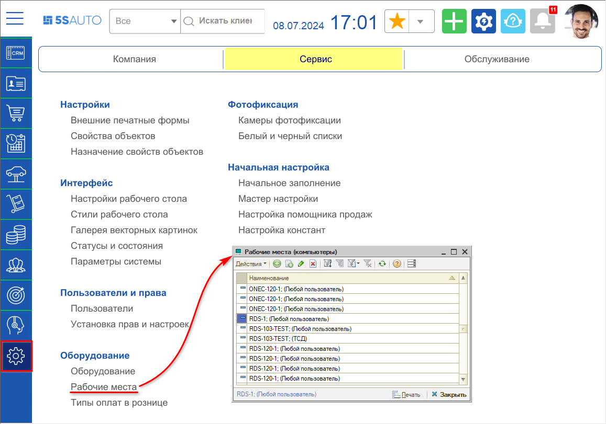
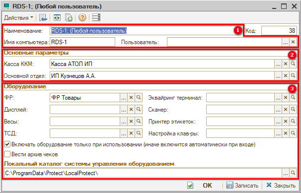

# Рабочие места

<table><tr><td><b>Время чтения:</b> 11 мин.</td><td><b>Обновлено:</b> 11.07.2024</td></tr></table>

Источник: https://www.5systems.ru/help/rabochie-mesta

## Содержание

1. [Введение](#введение)
2. [Настройки рабочего места](#настройки-рабочего-места)
3. [Добавление и редактирование рабочих мест](#добавление-и-редактирование-рабочих-мест)
   - [Добавление рабочего места](#добавление-рабочего-места)
   - [Копирование настроек от одного пользователя к другому](#копирование-настроек-от-одного-пользователя-к-другому)
   - [Редактирование рабочего места](#редактирование-рабочего-места)

## Введение

После создания пользователей (см. статьи: [Пользователи](../../Пользователи%20и%20права/Пользователи/polzovateli.md), [Мастер быстрого ввода пользователей и сотрудников](../../Пользователи%20и%20права/Мастер%20быстрого%20ввода%20пользователей%20и%20сотрудников/master-bystrogo-vvoda-polzovateley-i-sotrudnikov.md)) – т.е. учетных записей для сотрудников для работы в программе – для них требуется создать *рабочие места.*

***Рабочие места (компьютеры)*** – это компьютеры локальной сети, с которых осуществляется доступ к информационной базе. Через рабочее место осуществляется привязка торгового оборудования к пользователю.

Рекомендуется создавать отдельное рабочее место для каждого пользователя, работающего с торговым оборудованием – указать, какие параметры и оборудование будут у него подтягиваться по умолчанию в документы расчетов с клиентами. Если у пользователя настроено отдельное рабочее место, то при входе в программу к нему будет автоматически подтягиваться все привязанное оборудование.

## Настройки рабочего места

Справочник “Рабочие места (компьютеры)” находится в меню интерфейса системы в разделе *Администрирование → Сервис → Оборудование → Рабочие места:*

Карточка рабочего места содержит следующие параметры:

### 1. Реквизиты

Для корректной работы настроек рабочего места важно, чтобы было правильно заполнено имя компьютера и наименование.

***Наименование*** – наименование рабочего места, имеет вид *<Имя сервера; (Пользователь)>.*

***Имя компьютера*** – как правило, это *<Имя сервера>*, обычно заполняется автоматически. В некоторых случаях, если программа развернута непосредственно на рабочем компьютере, а не на удаленном сервере – это будет имя рабочего компьютера.

***Пользователь*** – указывается определенной пользователь программы, к которому будет привязано данное рабочее место.

Изначально создается одно рабочее место с именем: *<Имя сервера; (Любой пользователь)>.* Если не заполнять параметр "Пользователь", то все пользователи, у которых нет отдельного привязанного рабочего места, будут работать с этого рабочего места.

### 2. Основные параметры

***Касса ККМ*** – касса ККМ, к которой по умолчанию относится данный компьютер.

***Основной отдел*** – склад компании, с которого по умолчанию осуществляется продажа товаров в розницу, т.е. с которого списывается товар во Фронте кассира.

Эти данные будут по умолчанию подтягиваться у пользователя в документы расчетов с покупателями.

### 3. Оборудование

К рабочему месту следует привязать необходимое ***торговое оборудование***: ФР – Фискальный регистратор, Весы, ТСД – терминал сбора данных, Эквайринг-терминал для безналичных платежей, Сканер, Принтер этикеток и др. С указанным оборудованием данный компьютер будет работать по умолчанию, также подключенное к нему оборудование может использоваться другими компьютерами, работающими с программой.

При последующих запусках система будет инициализировать все установленное на данном компьютере оборудование, у которого включен признак использования.

***Флаг “Включать оборудование только при использовании”:***

Почти всё оборудование, подключенное к рабочему месту, нельзя использовать одновременно.

По умолчанию при входе пользователя в систему происходит автоматическое включение оборудования, привязанного к данному рабочему месту. Устройство переходит в статус "Включено", а для других пользователей становится недоступно. Если кассир один, то это не имеет значения. Если *кассиров несколько,* и к ним *привязана одна касса* или *один терминал*, это затрудняет работу.

Для совместного использования одного оборудования с нескольких компьютеров следует активировать флажок *“Включать оборудование только при использовании”* – тогда автоматическое подключение привязанного оборудования при входе пользователя в программу происходить не будет.

Оборудование будет включаться, когда один из кассиров будет пробивать чек на "Фронте кассира". При закрытии "Фронта кассира" оборудование автоматически выключится, и следующий кассир сможет так же включить его и пробить чек. То есть, пользователи, которые работают с указанным в карточке рабочего места оборудованием, будут его занимать только непосредственно на время пробития и печати чека на кассе.

*Примечание:* Данный режим замедляет работу касс, поэтому рекомендуется не включать его, если нет острой необходимости.

Подробнее об использовании данной настройки см. в статье [*Подключение кассы ККМ → Совместное использование одной кассы с нескольких компьютеров*](../Подключение%20кассы%20ККМ/podklyuchenie-kassy-kkm.md#совместное-использование-одной-кассы-с-нескольких-компьютеров).

***Флаг “Вести архив чеков”*** – при установке данного флажка при формировании чеков через фронт кассира дополнительно будет вестись архив чеков.

***Локальный каталог системы управления оборудованием*** – путь к папке, которая содержит драйверы торгового оборудования, компоненты и настройки системы защиты, необходимые для работы программы.

## Добавление и редактирование рабочих мест

### Добавление рабочего места

Изначально в справочнике создано одно рабочее место с именем *<Имя сервера; (Любой пользователь)>.*

Создать новое рабочее место можно добавлением нового элемента справочника либо копированием – см. [*ниже*](#копирование-настроек-от-одного-пользователя-к-другому). В новом рабочем месте необходимо выбрать параметры: Пользователь, Касса ККМ и Основной отдел (склад). Для пользователей, работающих с кассой требуется выбрать Фискальный регистратор и Эквайринг терминал, а также указать Принтер этикеток и прочее оборудование при наличии.

### Копирование настроек от одного пользователя к другому

При добавлении нового пользователя *по уже имеющемуся подразделению,* в котором есть работающие с кассой сотрудники, создавать новое рабочее место для этого пользователя рекомендуется путем *копирования.*

Для этого следует в справочнике “Рабочие места” найти пользователя, который работает с оборудованием, работу с которым требуется настроить для нового пользователя, скопировать это рабочее место, изменить параметр “Пользователь” и сохранить.

В случае создания нового пользователя *по новому подразделению* и необходимости добавления *нового созданного Фискального регистратора* также следует создать копированием новое рабочее место, сменить ФР и другое оборудование, Кассу компании, Основной отдел, Пользователя и записать карточку.

При создании рабочего места с нуля – путем добавления нового элемента справочника – дополнительно необходимо *скопировать* с рабочего места другого пользователя параметры *“Имя компьютера”* и *“Локальный каталог системы управления оборудованием”.*

### Редактирование рабочего места

В случае если сотрудник перешел в другое подразделение и у него сменилось оборудование, необходимо изменить данные в его рабочем месте.

Для этого следует перейти к справочнику “Рабочие места” – при этом будет активной строка того рабочего места, которое используется текущим пользователем, с теми Кассой ККМ и ФР, которые применяются им при принятии оплаты.

Для изменения данных необходимо открыть карточку рабочего места, выбрать новые Кассу ККМ, Основной отдел, ФР и другое оборудование, с которым пользователь будет работать, и сохранить изменения.

---

**Теги:** торговое оборудование, рабочие места, настройки рабочего места, оборудование, пользователи
