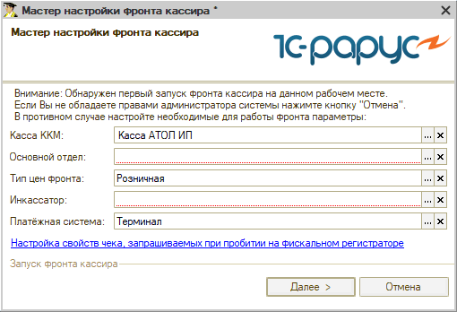
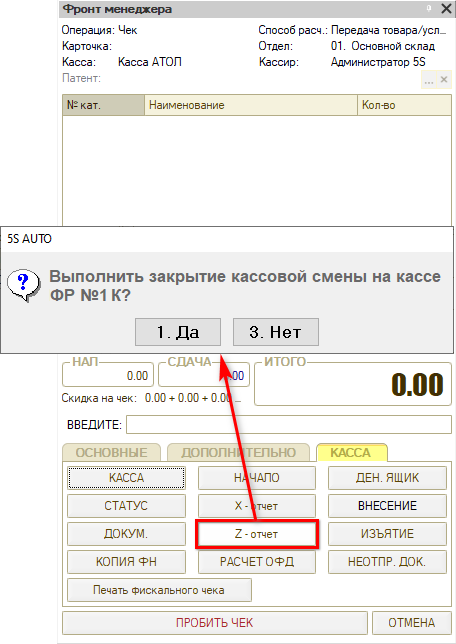
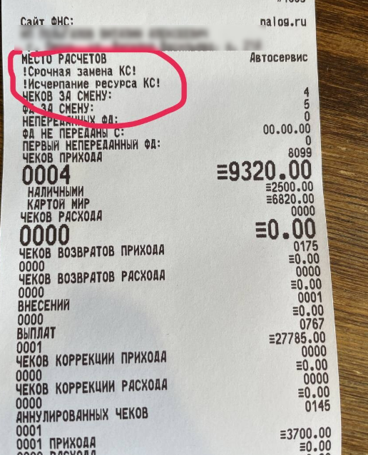
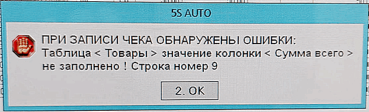
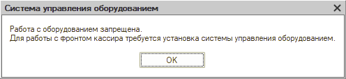
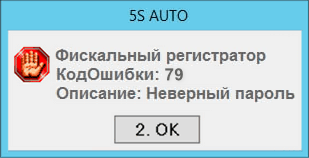
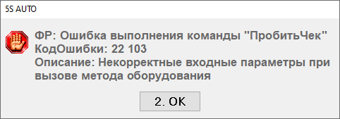
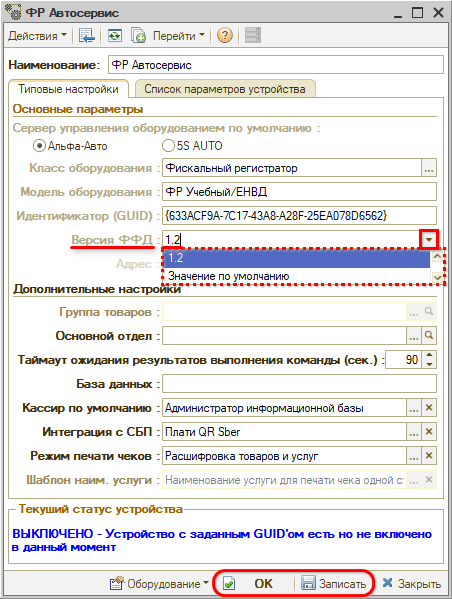

# Решение распространенных ошибок при работе с кассой

<table><tr><td><b>Время чтения:</b> 16 мин.</td><td><b>Обновлено:</b> 24.12.2025</td></tr></table>

Источник: https://www.5systems.ru/help/reshenie-rasprostranennykh-oshibok-pri-rabote-s-kassoy

## Содержание

1. [Касса не включается](#касса-не-включается)
2. [Оборудование не найдено](#оборудование-не-найдено)
3. [В ККТ нет денег для выплаты](#в-ккт-нет-денег-для-выплаты)
4. [Касса (фронт кассира) не открывается](#касса-фронт-кассира-не-открывается)
5. [Расхождение сумм](#расхождение-сумм)
6. [Исчерпан ресурс ФН](#исчерпан-ресурс-фн)
7. [Нулевая сумма в чеке](#нулевая-сумма-в-чеке)
8. [Ошибка при возврате](#ошибка-при-возврате)
9. [Ошибка при печати чека с маркировкой](#ошибка-при-печати-чека-с-маркировкой)
10. [Работа с оборудованием запрещена](#работа-с-оборудованием-запрещена)
11. [Неверный пароль](#неверный-пароль)
12. [Некорректные входные параметры при вызове метода оборудования](#некорректные-входные-параметры-при-вызове-метода-оборудования)
13. [Закончилась кассовая лента](#закончилась-кассовая-лента)

*<Статья дополняется>*

## Касса не включается

При проблемах с подключением кассы программа выдает сообщение об ошибке *"Нет связи"*, например:

Следом за ошибкой "Нет связи" выходят еще две ошибки: *"Фискальный регистратор не установлен"* и *"ФР: Ошибка выполнения команды "Получить состояние" <...> Оборудование не найдено".*

Все приведенные ошибки означают, что касса не работает, не доступна в 1С, либо нет связи с кассой.

Самое первое, что стоит сделать – перезапустить кассу и перезайти в 1С.

Подробное описание см. в отдельной статье [Действия в случае если касса не работает](../../../../tips/Оборудование/Кассы%20ККМ/Ошибки%20включения%20кассы/oshibki-vklyucheniya-kassy.md).

## Оборудование не найдено

Данная ошибка появляется в следующих случаях.

1. У пользователя в рабочем месте не указан путь до компоненты оборудования в поле "Локальный каталог системы управления оборудованием".
2. При подключении к серверу через удаленный рабочий стол был выполнен вход под этим пользователем, в рабочем месте пользователя каталог указан, но при этом на сервере не установлена компонента оборудования. Такое бывает, когда у пользователя изменился компьютер. На конкретном ПК была установлена компонента, через установленное на этом ПК 1С Предприятие пользователь подключался к базе.
3. У пользователя в рабочем месте указан ФР, он включается. Но при открытии фронт кассира ошибка – настройки базы, прав подменяют кассу по организации и подразделению документа.

Помимо указанных прав необходимо сделать корректную настройку рабочего места данного пользователя.

У нового пользователя может появиться такая ошибка, если ККТ не до конца настроен. *Справочники → Розница и оборудование → Рабочие места*, добавляем по аналогии:

Более подробное описание доступно по ссылке: [*https://rarus.ru/press/publications/20190730-metodika-raboty-KKT-v-alfa-avto-avtosalon-avtoservis-avtozapchasti-prof-393386/*](https://rarus.ru/press/publications/20190730-metodika-raboty-KKT-v-alfa-avto-avtosalon-avtoservis-avtozapchasti-prof-393386/)

## В ККТ нет денег для выплаты

При возврате денег при пробитии "Чека" работает контроль на остаток денег в кассе. Если средств недостаточно, пробитие чека невозможно.

Проблема решается внесением суммы, равной либо превышающей ту, которую нужно вернуть – через кнопку на фронте кассира “Внесение”.

## Касса (фронт кассира) не открывается

В случае открытия данной формы проверьте заполнение всех полей:

- Касса ККМ задается в рабочем месте пользователя.
- Основной отдел задается в рабочем месте пользователя.
- Тип цен фронта это право "Тип цен используемый фронтом".
- Инкассатор это право "Основной инкассатор" и "Инкассатор в документах внесения / изъятия".
- Платежная система это право "Основная платежная система".

## Расхождение сумм

Расхождение сумм возникает, когда по чекам в 1С и по пробитым чекам на ФР есть разница.

Если при закрытии смены в кассе ККМ и на ФР обнаруживаются разные суммы, то открывается окно “Расхождение сумм”. Выводятся данные “Оборот по ККМ” и “Оборот по ФР”. Программа, как правило, находит в базе чек на сумму расхождения и выводит его в таблице “Документы”:

**Способы решения:**

1. *Найти разницу и попытаться исправить ситуацию.*  
   Варианты, из-за чего может возникнуть разница:  
   **1)** чек был изменен кем-то из сотрудников – в данном случае следует сравнить все данные с тем, что ушло в ОФД, и по возможности исправить в программе;  
   **2)** пробили чек по постоплате – в данном случае следует сделать возврат и пробить правильно;  
   **3)** чек был помечен на удаление:
   - например, сотрудник перепутал нал и безнал, и вместо того, чтобы сделать возврат, пробил чек заново, а первый чек пометил на удаление;
   - если произошел кассовый сбой: данные ушли в ОФД, а программа посчитала, что чек не пробит, и пометила на удаление. В этом случае можно найти нужный чек по реквизитам и провести, но нужно быть уверенным, что чек точно пробился на ФР. Определить, что чек был помечен на удаление, можно по нумерации (будет пропущен один номер).
2. *Инкассировать все остатки по кассе.*  
   Для того чтобы закрыть смену, следует выполнить следующие действия:  
   **1)** сформировать Z-отчет:  
     
   **2)** нажать на Фронте кассира кнопку "Изъятие" – в программе будет создан документ "Инкассация". Следует перейти в созданный документ и дозаполнить его по всем типам оплаты – можно использовать автозаполнение по кнопке "Заполнить остатками по кассе ККМ" (см. ниже). 
   Либо (например, если сумма “0”) создать документ "Инкассация" вручную:  
     
   И заполнить остатками:  
     
   Документ должен быть заполнен всей суммой, которую выдаст программа, по всем типам оплаты:  
     
   **3)** оформить ПКО на основании созданной Инкассации для учета в системе суммы, снятой наличными (подробнее см. урок "[Учет кассовой выручки](https://www.5systems.ru/help/uchet-kassovoy-vyruchki)").
3. *Закрыть смену не выбирая кассу ККМ.*  
   В случае если критично закрыть смену прямо сейчас, можно просто закрыть смену не выбирая кассу ККМ. В этом случае проверка происходить не будет.  
   Также см. статью [Закрытие кассовой смены](../../Касса/Обработка%20Закрытие%20кассовой%20смены/obrabotka-zakrytie-kassovoy-smeny.md#сверка-итогов) и урок [Как закрыть смену](https://www.5systems.ru/help/kak-zakryt-smenu).

## Исчерпан ресурс ФН

Кончился ресурс фискального накопителя: необходимо обратиться к организации, которая обслуживает ваши кассы, для его замены.

Если ошибка выходит в программе, но в чеках нет информации о том что кончается ФН, то один из возможных вариантов – больше месяца не отправляются чеки в ОФД.

## Нулевая сумма в чеке

Строка без 100% скидки, где сумма всего равна нулю. Всего не может быть равна нулю, кроме случаев, когда это скидка. Касса такие документы не пропускает.

Есть право "Не разрешать в чеке строки с 0-й суммой (подарки)", частично решает проблему.

## Ошибка при возврате

Драйвер кассы не поддерживает корректную работу, рекомендуется откат драйвера ККТ на предыдущую версию.

## Ошибка при печати чека с маркировкой

Длина кода маркировки больше допустимой по символам.

## Работа с оборудованием запрещена

Такая ошибка может возникнуть при работе с любым оборудованием. Это значит, что в рабочем месте не указана “рабочая” папка оборудования.

Пример:

Для того, чтобы оно заработало, требуется указать адрес “рабочей папки” в своем рабочем месте: *C:\\ProgramData\\Protect\\LocalProtect\\ :*

После этого перезайти в систему.

## Неверный пароль

Если выходит такая ошибка при пробитии чека или изъятии денежных средств из кассы, то нужно в карточке пользователя на вкладке "Параметры пользователя" попробовать установить пароль: "30" и после этого перезайти в систему.

## Некорректные входные параметры при вызове метода оборудования

В случае возникновения данной ошибки необходимо в карточке оборудования (ФР) заполнить *версию ФФД:* выбрать значение *"1.2",* записать изменения и перезайти в систему:

## Закончилась кассовая лента

В случае если во время печати чека или закрытии смены закончилась кассовая лента, касса блокируется.

В данной ситуации следует заменить кассовую ленту, затем запустить приложение "Тест драйвера ККТ" и перейти в раздел "ФН".

Варианты действий:

1. нажать на кнопку "Допечатать";
2. нажать кнопку "Отменить документ", затем заново распечатать чек

*Примечание:* В случае если *ККТ не была применена* во время приема оплаты, необходимо после устранения проблем с кассой пробить ***чек коррекции*** – подробнее см. статью *[Использование чека коррекции](../../Касса/Использование%20Чека%20коррекции/ispolzovanie-cheka-korrekcii.md).* В случае *исправления ошибочно пробитых чеков* применение чека коррекции зависит от версии ФФД – подробнее также см. в вышеуказанной статье.

---

**Теги:** торговое оборудование, касса ккм, ошибки кассы, фискальный накопитель, чек
