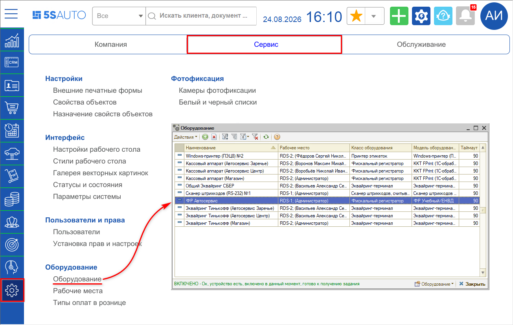
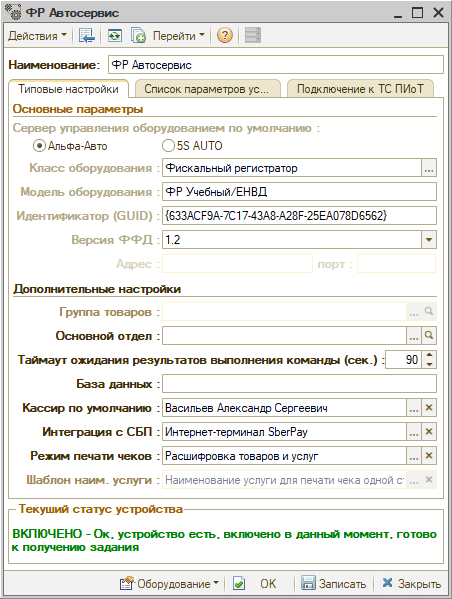
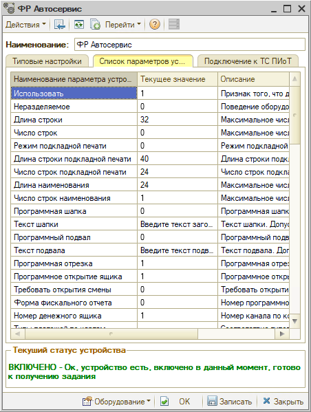
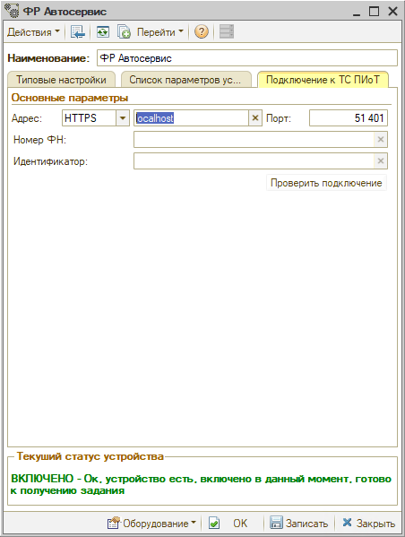
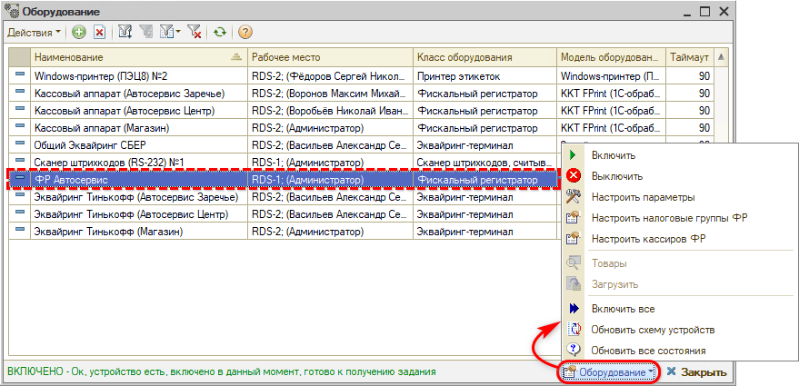
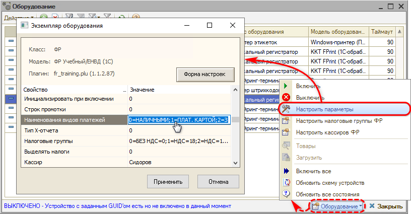
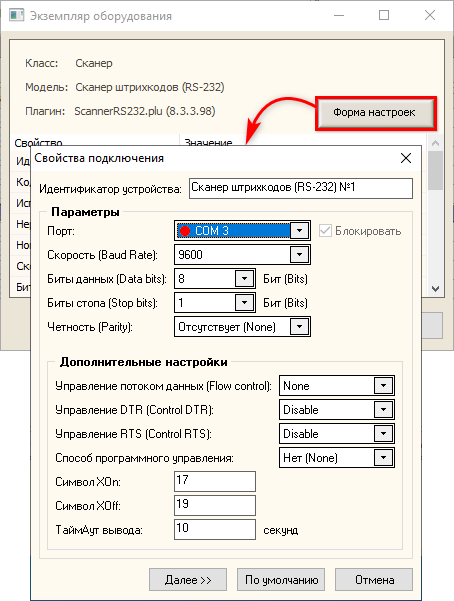

# Справочник «Оборудование»

<table><tr><td><b>Время чтения:</b> 10 мин.</td><td><b>Обновлено:</b> 25.08.2026</td></tr></table>

## Содержание

- [Введение](#введение)
- [Переход](#переход)
- [Карточка оборудования](#карточка-оборудования)
  - [Типовые настройки](#типовые-настройки)
    - [Основные параметры](#основные-параметры)
    - [Дополнительные настройки](#дополнительные-настройки)
  - [Список параметров устройства](#список-параметров-устройства)
  - [Подключение к ТС ПИоТ](#подключение-к-тс-пиот)
- [Текущий статус устройства](#текущий-статус-устройства)
- [Управление оборудованием](#управление-оборудованием)
  - [Действия с оборудованием](#действия-с-оборудованием)
  - [Настройка параметров](#настройка-параметров)
  - [Порядок изменения настроек](#порядок-изменения-настроек)

## Введение

Справочник **«Оборудование»** содержит список оборудования, подключенного к системе, вместе с настройками каждого конкретного экземпляра. Конфигурация поддерживает работу с различными классами торгового оборудования. При запуске система автоматически пытается проинициализировать все оборудование текущего компьютера.

Как добавить новый элемент в справочник, рассказано в отдельных статьях:

- [Подключение кассы ККМ](https://www.5systems.ru/help/podklyuchenie-kassy-kkm) — добавление новой кассы;
- [Печать этикеток](https://www.5systems.ru/help/pechat-etiketok) — добавление принтера этикеток;
- [Подключение банковского терминала](https://www.5systems.ru/help/podklyuchenie-bankovskogo-terminala) — подключение эквайринг-терминала;
- [Подключение сканера штрихкодов](https://www.5systems.ru/help/podklyuchenie-skanera-shtrikhkodov) — подключение сканера штрихкодов (как через COM-порт, так и клавиатурного);
- [Интерфейс для ТСД](https://www.5systems.ru/help/interfeys-dlya-tsd#nastrpodkloborud) — подключение ТСД.

Добавленное оборудование должно быть подключено к [рабочему месту](https://www.5systems.ru/help/rabochie-mesta).

Как правило, настройки оборудования выполняются в процессе подключения, но иногда требуется изменить настройки уже подключенного устройства. В текущей статье рассматриваются реквизиты элемента справочника «Оборудование» и дополнительные настройки параметров.

## Переход

Справочник находится в меню интерфейса: *Администрирование → Сервис → Оборудование*.

Также справочник можно открыть через типовое меню *Справочники → Розница и оборудование → Оборудование*.

## Карточка оборудования

Карточка оборудования открывается двойным кликом по нужной строке справочника. Реквизиты собраны на трех вкладках: **«Типовые настройки»**, **«Список параметров устройства»** и **«Подключение к ТС ПИоТ»**. Внизу формы (на любой вкладке) отображается [текущий статус устройства](#текущий-статус-устройства).

### Типовые настройки

Вкладка открывается по умолчанию и содержит два блока реквизитов — **«Основные параметры»** и **«Дополнительные настройки»**.

Пример карточки оборудования класса «Фискальный регистратор»:

#### Основные параметры

- **Сервер управления оборудованием по умолчанию** — определяет, какой механизм обслуживает устройство:
  - **Альфа-Авто** — выбирается при добавлении нового типового оборудования (ФР, эквайринг и т. д.);
  - **5S AUTO** — выбирается при добавлении специализированного оборудования, например при настройке облачной кассы (см. статью «[Интеграция с Webkassa.KZ](https://www.5systems.ru/help/integraciya-s-webkassakz#nastr_oborud)»). В этом случае в появившемся реквизите потребуется дополнительно выбрать обработчик.
- **Класс оборудования** — основной классификатор видов оборудования, задающий назначение и функции устройства. Программа поддерживает несколько классов: ФР, эквайринг-терминал, сканер штрихкодов, ТСД, весы и другие. Реквизит обязателен для заполнения.
- **Модель оборудования** — конкретная модель для выбранного класса. Реквизит обязателен для заполнения.
- **Идентификатор (GUID)** — уникальный идентификатор устройства, позволяющий однозначно привязать элемент справочника к логическому устройству. Создается автоматически системой настройки оборудования.
- **Версия ФФД** — здесь должна быть выбрана актуальная версия ФФД (на момент написания статьи — «1.2»). Иначе может возникать ошибка «[Некорректные входные параметры при вызове метода оборудования](../../../../tips/Оборудование/Кассы%20ККМ/Некорректные%20входные%20параметры%20при%20вызове%20метода%20оборудования/nekorrektnye-vhodnye-parametry-metoda-oborudovaniya.md)».
- **Адрес** и **Порт** — используются для подключения сетевых эквайринг-терминалов: это адрес и порт, по которым доступен терминал (см. статью «[Настройка подключения терминала эквайринга Сбербанка по сети](https://www.5systems.ru/help/nastroyka-podklyucheniya-terminala-ekvayringa-sberbanka-po-seti)»).

#### Дополнительные настройки

- **Группа товаров** — группа, объединяющая товары, которые загружаются в данное оборудование. Для классов оборудования POS и ТСД реквизит обязателен.
- **Основной отдел** — склад компании, в котором расположено оборудование. Используется по умолчанию при регистрации продаж, выбирается из справочника «Склады (места хранения) компании». Для классов оборудования POS и ТСД реквизит обязателен. Настройка применяется, например:
  - в обработке «Закрытие кассовой смены» — чтобы оборудование фильтровалось по подразделению пользователя (см. статью «[Обработка Закрытие кассовой смены](https://www.5systems.ru/help/obrabotka-zakrytie-kassovoy-smeny#dostoborud)»);
  - при настройке раздельного пробития чеков по товарам и услугам (см. статью «[Разделение чеков ККМ](https://www.5systems.ru/help/razdelenie-chekov-kkm#nastr_oborud)»).
- **Таймаут ожидания результатов выполнения команды (сек.)** — время ожидания ответа от удаленного оборудования при работе в автоматическом режиме, в секундах.
- **База данных** — в конфигурации 5S AUTO *не используется*. Настройка предназначена для РБД (чаще используется аббревиатура РИБ — распределенная информационная база).
- **Кассир по умолчанию** — параметр для оборудования класса ФР. Если реквизит не заполнен, в чеках по этой кассе в качестве кассира печатается текущий пользователь. Если же в чеках нужно печатать определенного сотрудника, выберите его в этом параметре (подробнее см. статью «[Как задать кассира по умолчанию для печати чеков](../../../../tips/Оборудование/Кассы%20ККМ/Как%20задать%20кассира%20по%20умолчанию%20для%20печати%20чеков/kak-zadat-kassira-po-umolchaniyu.md)»).
- **Интеграция с СБП** — интеграция с системой быстрых платежей одного из доступных банков. Пример использования настройки см. в статье «[Настройка приложения 5S Pay](https://www.5systems.ru/help/nastroyka-prilozheniya-5s-pay#nastr_int_spb)».
- **Режим печати чеков** — настройка специальных режимов пробития чеков, подробнее см. в статье «[Режимы печати чеков](https://www.5systems.ru/help/rezhimy-pechati-chekov)».
- **Шаблон наим. услуги** — используется для настройки режима пробития чеков «Одной строкой», подробнее см. в статье «[Режимы печати чеков](https://www.5systems.ru/help/rezhimy-pechati-chekov#dlya_rezh_odnoy_str)».

### Список параметров устройства

Вкладка содержит информацию о параметрах подключения и рабочих режимах оборудования:

Перейти к настройкам параметров оборудования можно по кнопке **«Оборудование»** на нижней панели формы справочника (см. ниже в разделе «[Управление оборудованием](#управление-оборудованием)»).

### Подключение к ТС ПИоТ

На вкладке собраны настройки для подключения ТС ПИоТ — подробное описание см. в статье «[Подключение ТС ПИоТ](https://www.5systems.ru/help/podklyuchenie-ts-piot#nastr_oborud)».

Вкладка отображается только для оборудования класса «Фискальный регистратор».

## Текущий статус устройства

Поле внизу карточки оборудования, в котором отображается состояние этого оборудования на текущий момент. Оно видно на всех вкладках. Статус меняется командами меню **«Оборудование»** (см. [ниже](#действия-с-оборудованием)) и при инициализации оборудования.

В программе предусмотрены следующие варианты состояния:

- *Включено* — оборудование включено и готово к использованию.
- *Отсутствует* — оборудование не обнаружено, следует ввести сведения о нем в систему.
- *Готово* — оборудование включено и заблокировано для работы с других компьютеров (работать можно только с текущего компьютера).
- *Выключено* — оборудование выключено.
- *Недоступно* — нет связи с компьютером, к которому подключено указанное оборудование.
- *Занято* — оборудование включено, но использовать его нельзя: оно заблокировано другим компьютером.
- *Не используется* — оборудование в настоящее время не используется.
- *Нет драйвера* — не установлен драйвер данного оборудования.
- *Запрещено* — использование данного оборудования запрещено.
- *Удалено* — оборудование удалено из системы.

## Управление оборудованием

### Действия с оборудованием

Кнопка **«Оборудование»** на нижней панели формы справочника открывает меню с действиями над выделенным устройством:

- *Включить* — включает выключенное оборудование.
- *Выключить* — выключает включенное оборудование.
- *Настроить параметры* — открывает форму настройки параметров подключения и работы оборудования. Доступно только для устройства в состоянии «Выключено».
- *Настроить налоговые группы ФР* — открывает окно настройки соответствия налоговых групп. Требуется, если используется несколько касс разных производителей (подробнее см. в статье «[Подключение кассы ККМ](https://www.5systems.ru/help/podklyuchenie-kassy-kkm#nds_v_oborud)»).
- *Настроить кассиров ФР* — открывает окно настройки кассиров по умолчанию по текущему оборудованию отдельно для каждого пользователя. Используется, если в чеках требуется печатать определенных сотрудников, а настройки «Кассир по умолчанию» (см. [выше](#дополнительные-настройки)) для этого недостаточно.
- *Товары* — открывает регистр сведений «Товары в оборудовании», в котором можно задать или отредактировать список товаров для загрузки. Активно только для тех видов оборудования, в которые может быть загружен список товаров (например, ТСД или POS-терминал).
- *Загрузить* — открывает обработку «Загрузка оборудования», с помощью которой список товаров, заданный в регистре сведений «Товары в оборудовании», загружается в устройство. Активно только для тех видов оборудования, в которые может быть загружен список товаров.
- *Включить все* — включает все оборудование, подключенное к компьютеру.
- *Обновить схему устройств* — обновляет схему системы защиты и управления оборудованием.
- *Обновить все состояния* — проверяет и обновляет сведения о текущем состоянии оборудования.

### Настройка параметров

Перед изменением настроек оборудование следует отключить кнопкой **«Выключить»**.

Кнопка **«Настроить параметры»** открывает окно настроек экземпляра оборудования. Клик по полю параметра в колонке **«Значение»** активирует его для редактирования — в примере ниже активировано поле наименований видов платежей:

Кнопка **«Форма настроек»** открывает окно **«Свойства подключения»**:

Для установки значений в этом диалоговом окне рекомендуется воспользоваться кнопкой **«По умолчанию»**. Примеры настройки свойств подключения см. в статьях «[Подключение кассы ККМ](https://www.5systems.ru/help/podklyuchenie-kassy-kkm#nastr_oborud)» и «[Печать этикеток](https://www.5systems.ru/help/pechat-etiketok#podkl_pr)».

### Порядок изменения настроек

1. Выделите нужное устройство в справочнике и выключите его: **«Оборудование» → «Выключить»**.
2. Откройте настройки: **«Оборудование» → «Настроить параметры»**.
3. Измените значения нужных параметров — в списке или в окне «Свойства подключения» (кнопка **«Форма настроек»**).
4. Сохраните настройки кнопкой **«Применить»** на нижней панели.
5. Включите оборудование обратно: **«Оборудование» → «Включить»**. После этого новые настройки вступят в силу.

---

**Теги:** оборудование, торговое оборудование, справочник оборудования, класс оборудования, фискальный регистратор, эквайринг-терминал, сканер штрихкодов, ТСД, настройка параметров, свойства подключения, кассир по умолчанию, ТС ПИоТ

