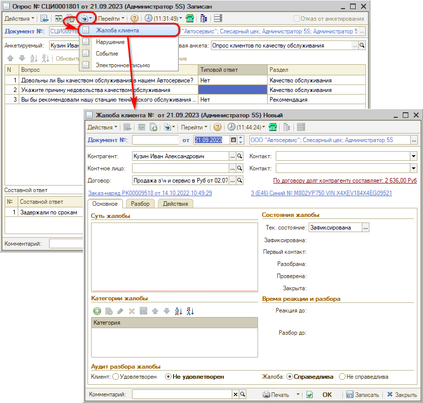
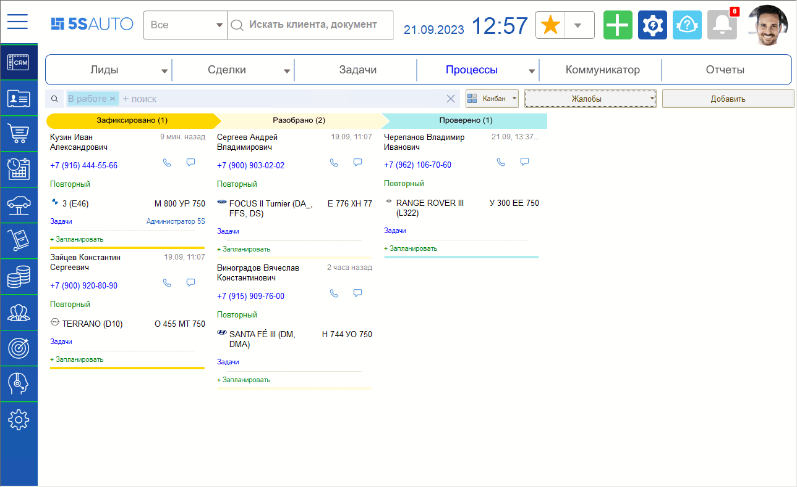
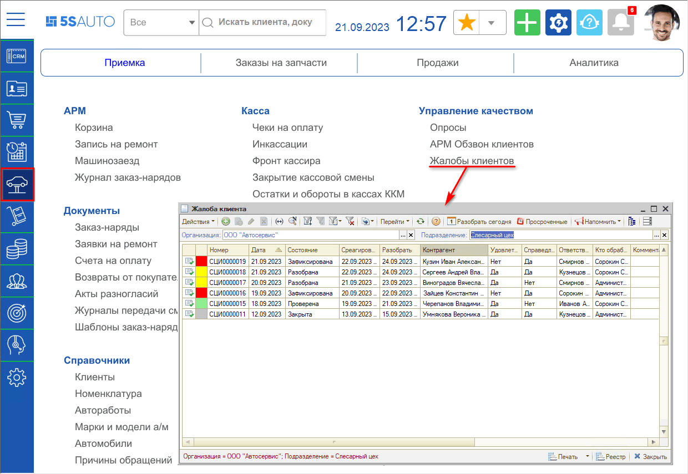
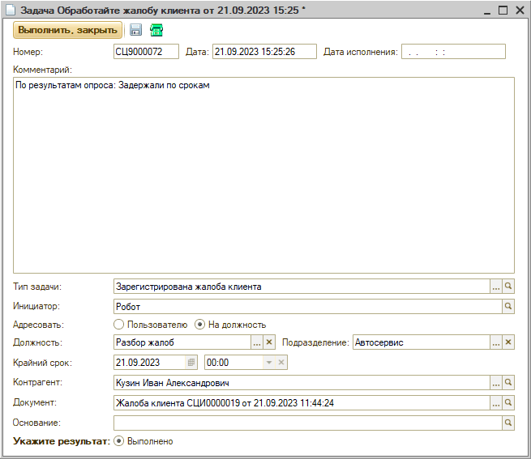
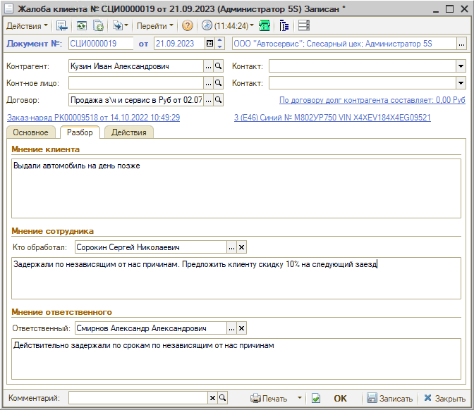
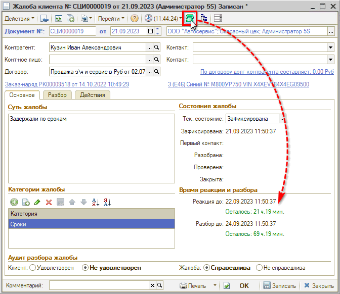
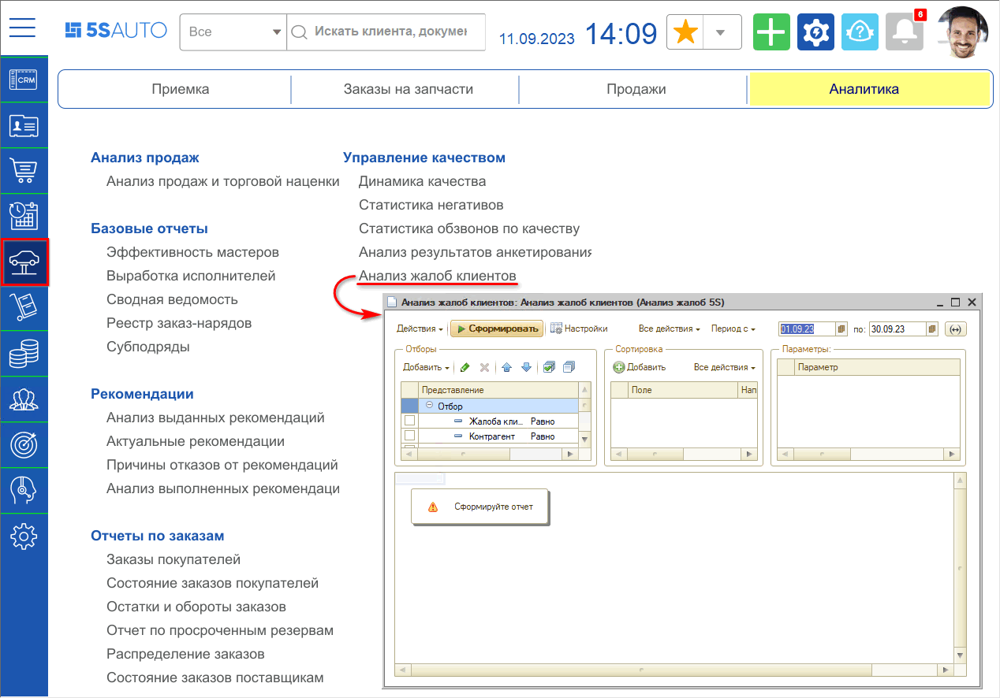
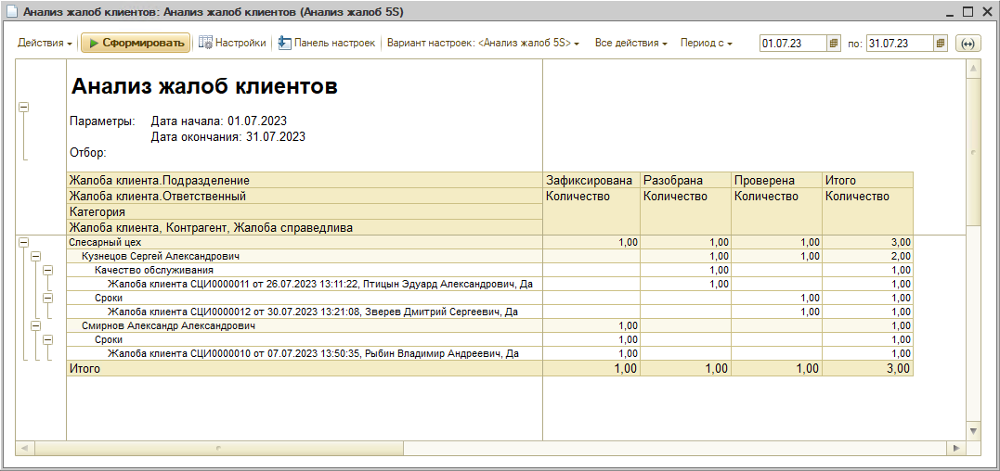

# Обработка жалоб от клиентов

<table><tr><td><b>Время чтения:</b> 12 мин.</td><td><b>Обновлено:</b> 24.06.2022</td></tr></table>

Источник: https://www.5systems.ru/help/obrabotka-zhalob-ot-klientov

## Содержание

1. [Введение](#введение)
2. [Создание жалобы](#создание-жалобы)
3. [Разбор жалоб](#разбор-жалоб)
4. [Отчет “Анализ жалоб клиентов”](#отчет-анализ-жалоб-клиентов)

## Введение

Для повышения качества обслуживания клиентов с целью их удержания в программе предусмотрена работа с документом ***"Жалоба"***.

## Создание жалобы

Документ "Жалоба" может быть создан автоматически[\*](#snoska), либо вручную – например, на основании документа "Опрос":

Чтобы записать создаваемый документ, обязательно следует заполнить суть жалобы, а также следует выбрать категорию жалобы для дальнейшего анализа.

\*Автоматическое создание будет происходить при активизации значимого события "Создание документа Жалоба" (см. [*Преднастроенные значимые события*](../../Сообщения/Преднастроенные%20значимые%20события/prednastroennye-znachimye-sobytiya.md)).

## Разбор жалоб

По выявленным жалобам, зафиксированным в документе "Жалоба", начинает работать управляющий директор или менеджер по качеству.

Для работы с жалобами в программе реализован отдельный канбан процессов:

Также можно открыть нужную жалобу через реестр документов "Жалоба" в меню программы *Автосервис → Приемка → Управление качеством:*

Одновременно с документом "Жалоба" создается задача на обработку жалобы на пользователей с должностью "Разбор жалоб":

Суть работы с документом "Жалоба" заключается в следующем:

1. Проанализировать причину недовольства клиента – суть жалобы.
2. Разобрать причину возникшей ситуации.
3. Выполнить действия по снятию негатива у клиента с целью удержания его.
4. Принять меры, чтобы данная ситуация больше не возникала.

После заполнения мнения ответственного сотрудника и сотрудника, который занимается обработкой жалоб, а также действий по исправлению ситуации разобранную жалобу следует записать.

В случае необходимости можно позвонить клиенту прямо из формы разбора Жалобы:

При звонке автоматически создается событие "Телефонный звонок" и фиксируется время реакции на Жалобу.

## Отчет “Анализ жалоб клиентов”

Типовой отчет *“Анализ жалоб клиентов”* предусмотрен для анализа жалоб клиентов за определенный период по различным критериям.

Руководитель в любой момент может построить отчет и увидеть, на каком этапе разбора находится каждая жалоба клиента, сколько жалоб поступило за определенный временной интервал, их причины.

Отчет находится в разделе меню *“Автосервис → Аналитика → Управление качеством”:*

Следует *задать нужный период* и сформировать отчет:

Можно задать настройки, отборы и уровень группировки.

Колонки отображают состояние жалоб – *Зафиксирована, Разобрана, Проверена, Закрыта,* – и общее количество.

Жалобы группируются по подразделениям и ответственному. Ответственный сотрудник – это сотрудник, на которого зафиксирована жалоба. Также выводится показатель “Категория жалобы” – т.е. причина недовольства клиента.

---

**Теги:** управление качеством, жалобы, обращения клиентов, разбор нарушений, crm
