

# Опрос клиента о качестве обслуживания

<table><tr><td><b>Время чтения:</b> 17 мин.</td><td><b>Обновлено:</b> 24.06.2022</td></tr></table>

Источник: https://www.5systems.ru/help/opros-klienta-o-kachestve-obsluzhivaniya

## Содержание

1. [Введение](#введение)
2. [Предварительная настройка](#предварительная-настройка)
   - [1. Создание анкеты](#1-создание-анкеты)
   - [2. Настройка анкеты для опроса по качеству обслуживания](#2-настройка-анкеты-для-опроса-по-качеству-обслуживания)
   - [3. Настройка сотрудников службы контроля качества](#3-настройка-сотрудников-службы-контроля-качества)
   - [4. Активизация регламентного задания для создания опроса по качеству](#4-активизация-регламентного-задания-для-создания-опроса-по-качеству)
3. [Исполнение задачи "Опросите клиента о качестве обслуживания"](#исполнение-задачи-опросите-клиента-о-качестве-обслуживания)
4. [Опрос клиента о качестве обслуживания через обработку "Выборка для обзвона"](#опрос-клиента-о-качестве-обслуживания-через-обработку-выборка-для-обзвона)
5. [Отчеты по опросам по качеству обслуживания](#отчеты-по-опросам-по-качеству-обслуживания)
   - [1. Отчет “Оценка качества обслуживания”](#отчет-оценка-качества-обслуживания)
   - [2. Отчет “Анализ результатов анкетирования”](#отчет-анализ-результатов-анкетирования)

## Введение

*Опрос клиента по качеству обслуживания* в автосервисе позволяет оценить качество проведенных работ и в дальнейшем обработать жалобы от клиентов на обслуживание.

## Предварительная настройка

Для того, чтобы формировалась задача на опрос по качеству обслуживания, необходимо предварительно выполнить следующие настройки:

1. Создать анкету, на основе которой пользователи будут опрашивать клиентов в справочнике "Типовые анкеты".
2. Настроить анкету для опроса по качеству обслуживания.
3. Настроить пользователей, которые будут производить опрос - сотрудники службы контроля качества.
4. Активизировать регламентное задание на создание опроса по качеству обслуживания.

### 1. Создание анкеты

Для создания анкеты:

1. Перейдите в справочник "Типовые анкеты":  
   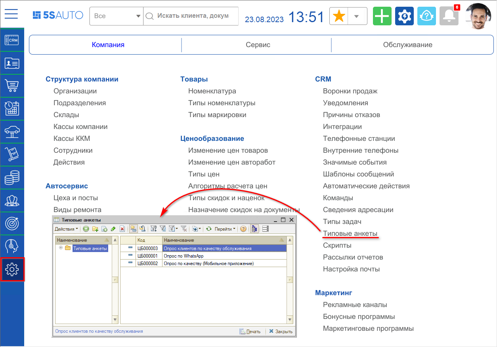
2. Создайте анкету с вопросами для оценки качества обслуживания:  
   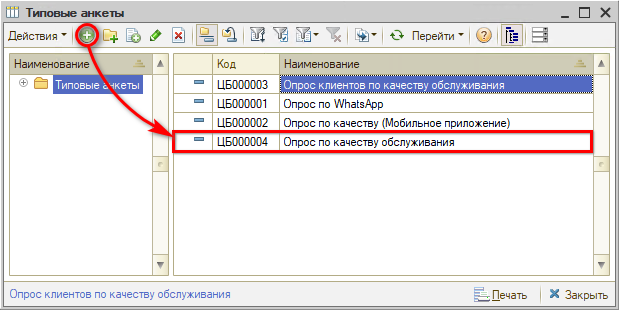

### 2. Настройка анкеты для опроса по качеству обслуживания

В [настройках прав доступа](../../Пользователи%20и%20права/Установка%20прав%20и%20настроек%20пользователя/ustanovka-prav-i-nastroek-polzovatelya.md) укажите какую анкету использовать для опроса по качеству обслуживания. Для этого:

1. Перейдите в *Права и настройки;*
2. Выберите тип объекта "Подразделение";
3. В настройке "УПРАВЛЕНИЕ КАЧЕСТВОМ → Анкета для опроса по качеству" укажите анкету, которую создали (см. *1. Создание анкеты):*  
   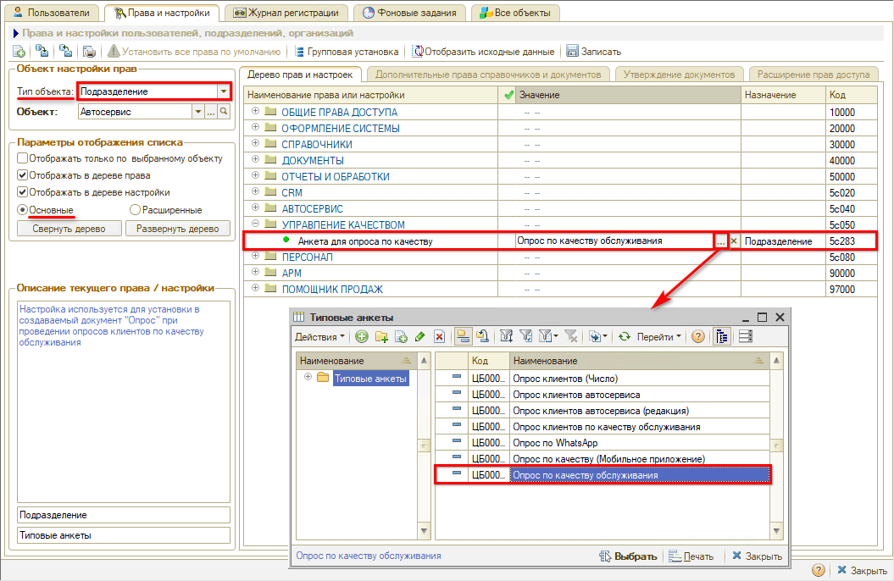
4. Запишите изменения.

### 3. Настройка сотрудников службы контроля качества

Укажите пользователей, которые будут производить опрос по качеству. Для этого назначьте пользователям должность "Сотрудник службы контроля качества" в регистре сведений "Сведения адресации" (см. [*Адресация задач в CRM по исполнителям*](../../Задачи/Адресация%20задач%20в%20CRM%20по%20исполнителям/adresaciya-zadach-v-crm-po-ispolnitelyam.md)).

### 4. Активизация регламентного задания для создания опроса по качеству

Для автоматического создания задач после завершения работы с документом "Заказ-наряд" с целью опроса по качеству обслуживания следует активизировать преднастроенное регламентное задание. Для этого необходимо:

1. Перейти в справочник "Автоматические действия" и найти регламентное задание "Создание документов "Опрос" по заказ-нарядам":  
   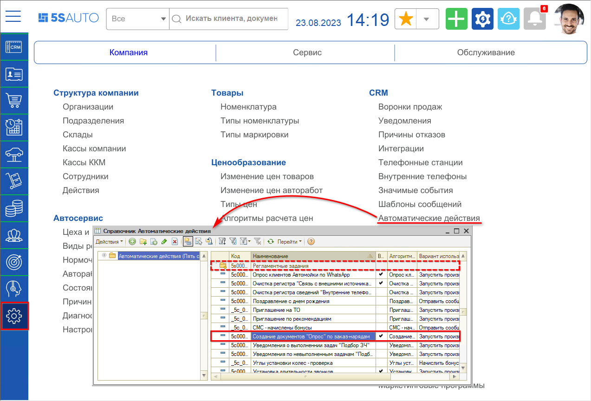
2. Открыть форму регламентного задания, установить флажок "Использовать" и нажать на кнопку "ОК":  
   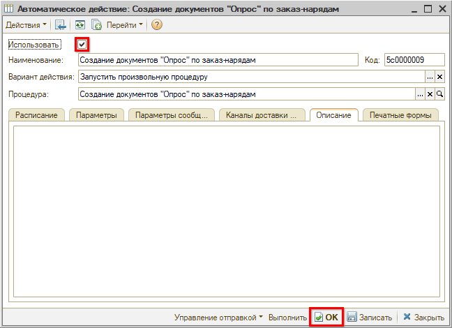

После активизации регламентного задания по завершенным документам "Заказ-наряд" будут ежедневно автоматически создаваться задачи "Опросите клиента о качестве обслуживания". Задачи будут видны пользователям с должностью "Сотрудник службы контроля качества" (см. *3. Настройка сотрудников службы контроля качества)* в АРМ "Рабочий стол". Кроме того созданные задачи для опроса по качеству будут видны в дереве подчиненных документов Заказ-наряда.

## Исполнение задачи "Опросите клиента о качестве обслуживания"

Задачи "Опросите клиента о качестве обслуживания" отображаются на Рабочем столе на вкладке *"Задачи":*

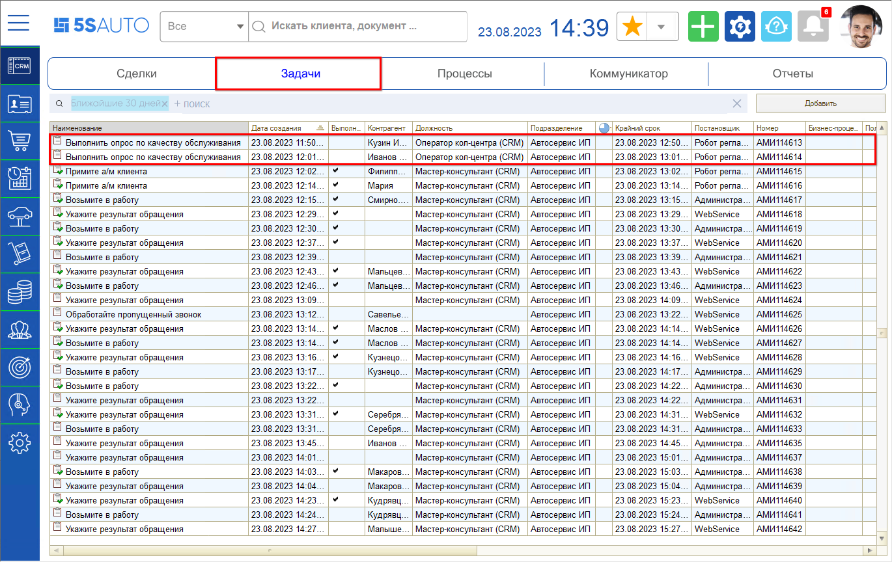

Для исполнения задачи необходимо:

1. Открыть форму задачи.
2. Связаться с клиентом.
3. Создать документ "Опрос":  
   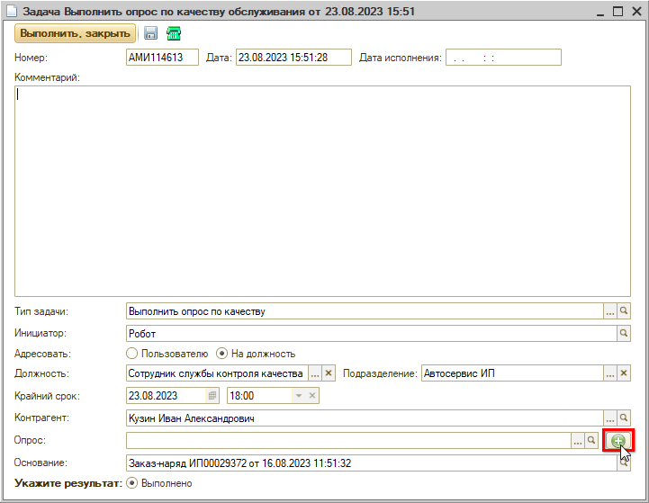
4. Заполнить анкету ответами клиента и записать изменения:  
   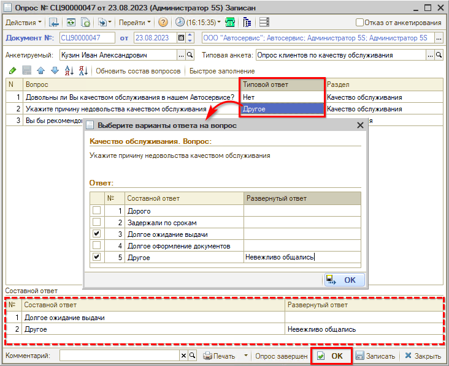
5. Выполнить задачу:  
   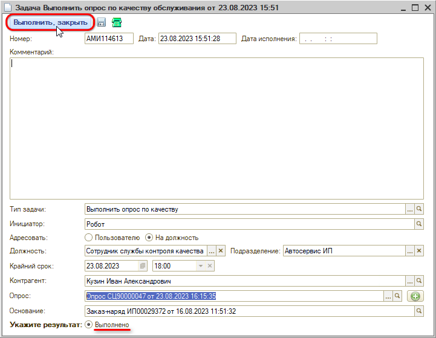

## Опрос клиента о качестве обслуживания через обработку "Выборка для обзвона"

С помощью обработки "Выборка для обзвона" можно массово отобрать клиентов, которых необходимо опросить о качестве обслуживания.

Переход в обработку осуществляется через меню программы "Автосервис → Приемка → Управление качеством → АРМ Обзвон клиентов":

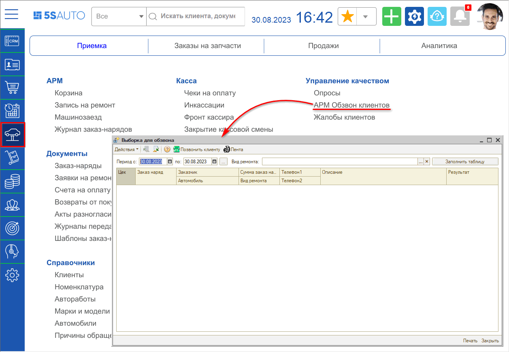

Для начала работы с опросами через обработку укажите период, за который требуется обработать задачи на опрос (по умолчанию устанавливается текущий день), и нажмите кнопку "Заполнить таблицу":

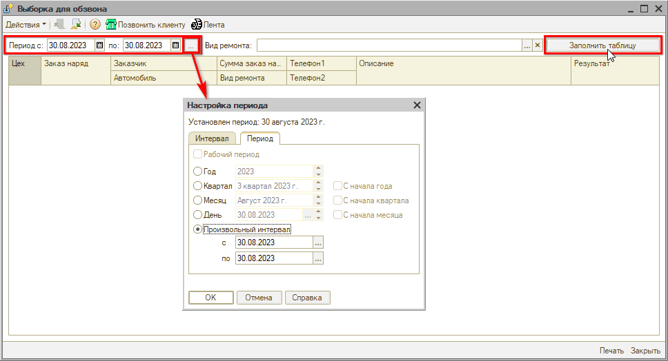

В обработке отобразятся заказ-наряды, по результатам завершения которых необходимо опросить клиентов:

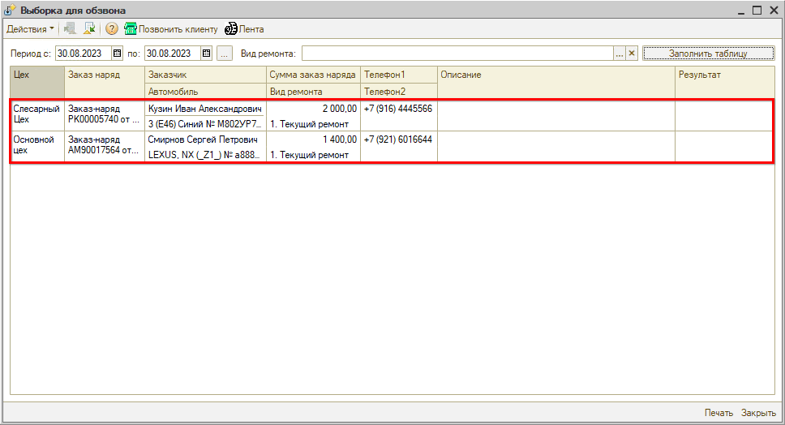

Для опроса по качеству обслуживания свяжитесь с клиентом и дважды кликните на колонку "Результат" для открытия формы опроса, укажите ответы на вопросы анкеты или отказ от опроса и завершите работу с опросом:

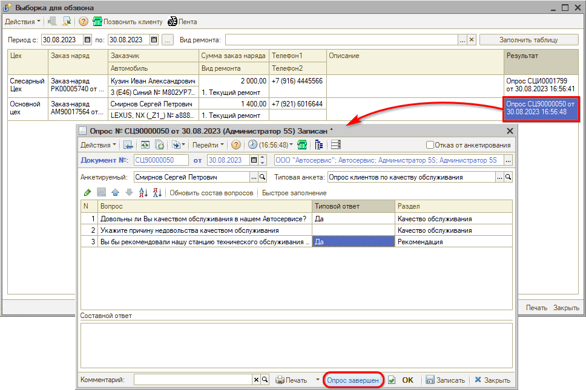

Дополнительно есть возможность просмотреть историю переписки с клиентом через мессенджеры и отправить сообщение:

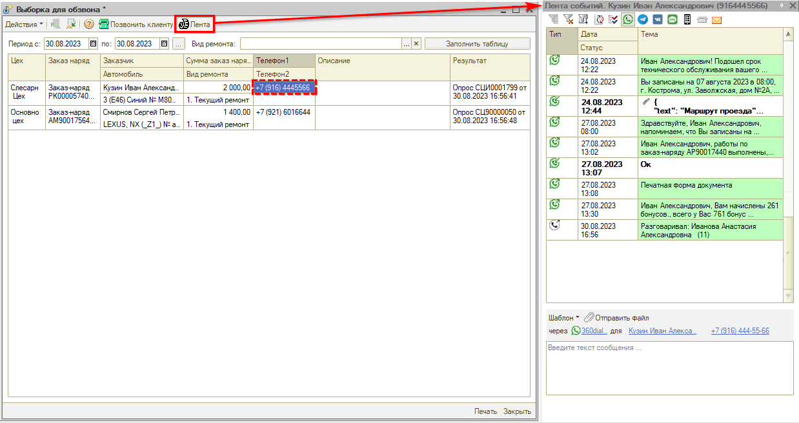

## Отчеты по опросам по качеству обслуживания

### Отчет “Оценка качества обслуживания”

Отчет “Оценка качества обслуживания” помогает оценить результаты проведения постсервисного опроса и разбора жалоб.

Отчет можно открыть через меню программы *"Автосервис → Аналитика → Управление качеством":*

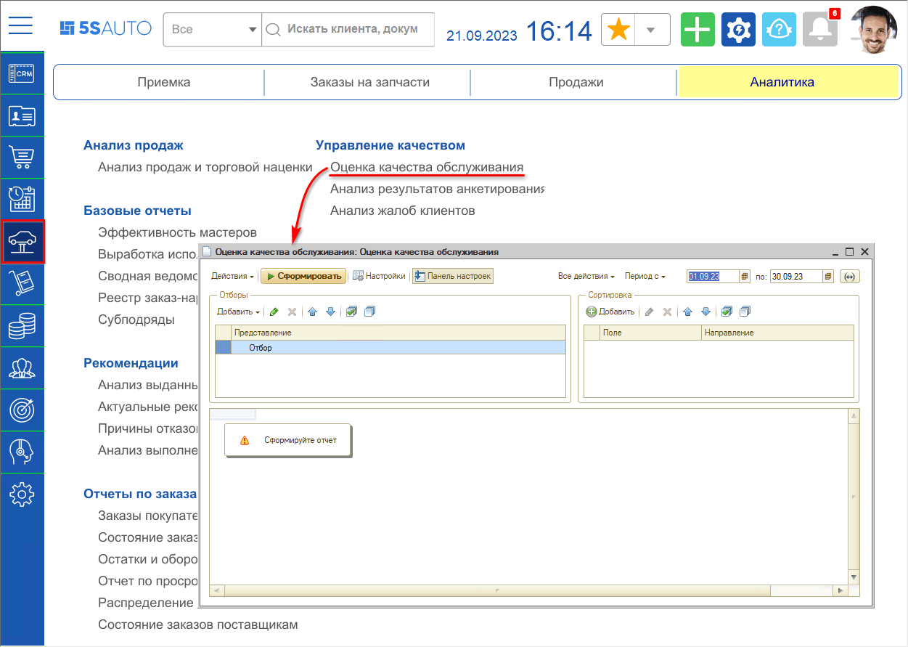

Для формирования отчета необходимо задать период, можно установить отборы по подразделению, фильтры и т.д.:

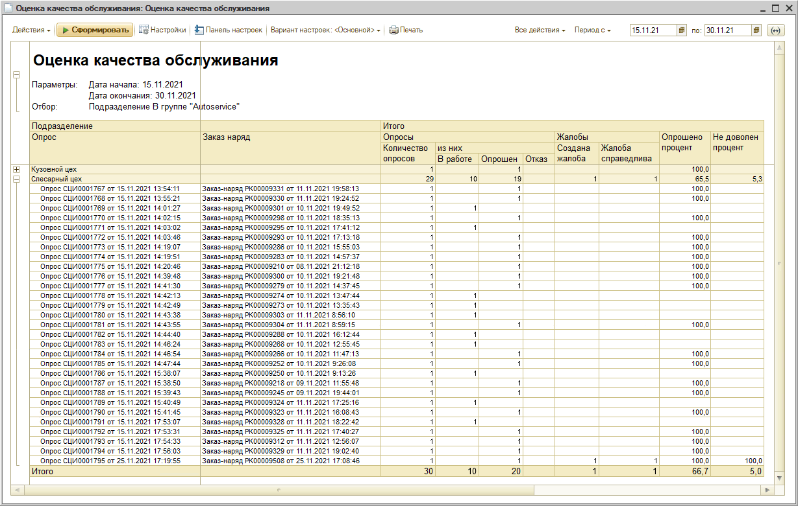

Отчет содержит показатели по документам “Опрос” в разрезе подразделений:

- количество опросов – в работе, завершенных и с отказами;
- количество созданных и разобранных жалоб;
- процент опрошенных и процент недовольных клиентов.

### Отчет “Анализ результатов анкетирования”

Типовой отчет “Анализ результатов анкетирования” также рекомендуется использовать для анализа опросов по качеству обслуживания.

Отчет находится в разделе меню “Автосервис → Аналитика → Управление качеством”:

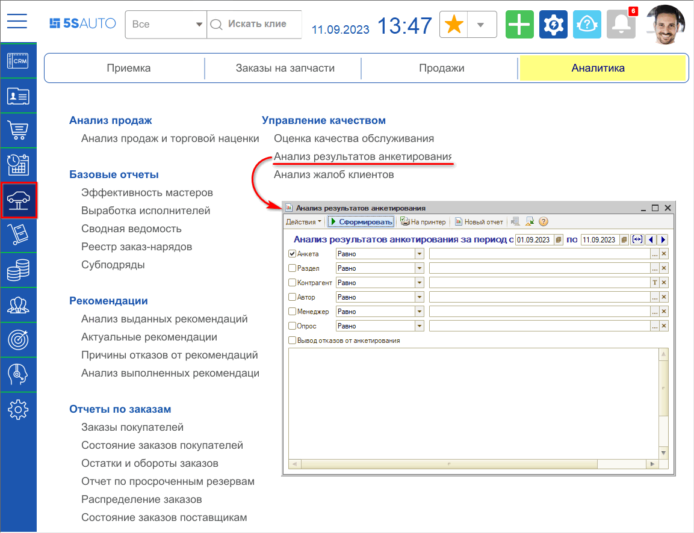

Для просмотра отчета необходимо задать нужный период, выбрать анкету, по которой требуется проанализировать результаты, и нажать кнопку “Сформировать”:

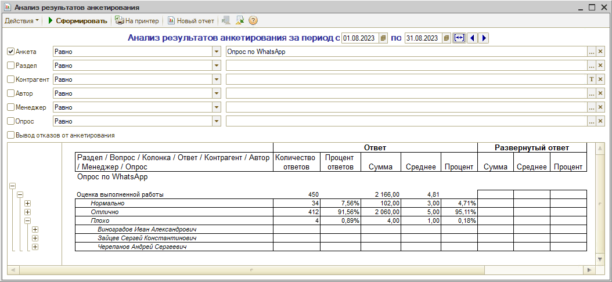

Отображается общая статистика по результатам проведения опроса с использованием выбранной анкеты.

Статистика собирается по группам "Раздел", "Вопрос", "Колонка" и "Ответ", можно раскрыть уровни группировки ”Контрагент”, “Автор”, “Менеджер” и “Опрос”.

Результаты выводятся в виде количества ответов, процента ответов и числовых показателей “веса” ответов. У ответа есть "вес": обычно “Плохо” - это 1, “Нормально” - 3, “Отлично” - 5. Эти значения используются программой для формирования жалоб.

---

**Теги:** управление качеством, опрос клиента, качество обслуживания, оценка, отзывы

