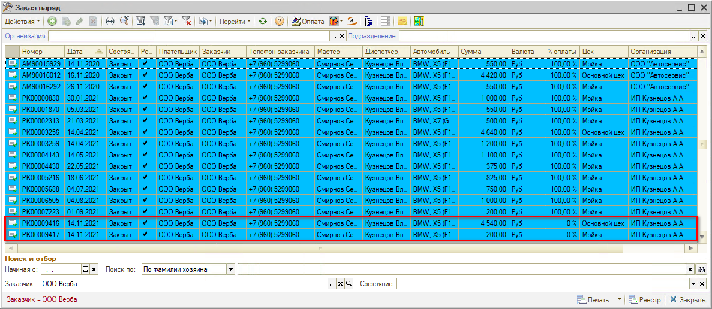
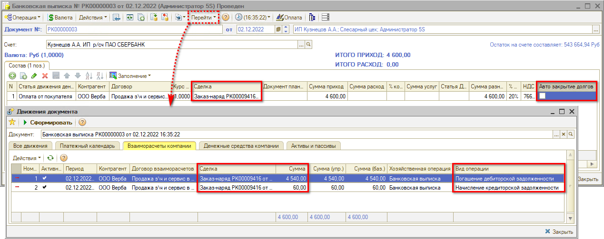
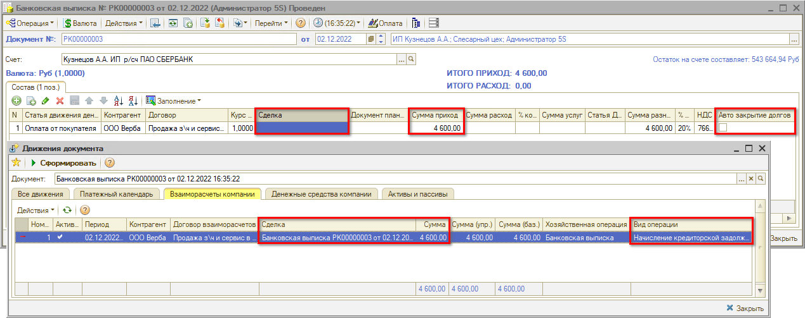
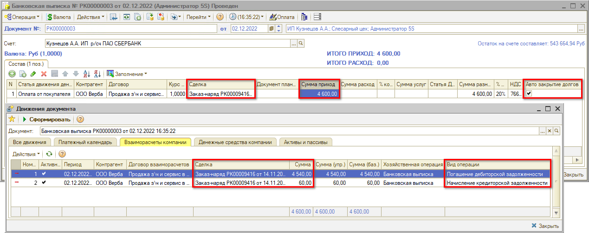

# Автозакрытие сделок и ручная привязка

<table><tr><td><b>Время чтения:</b> 14 мин.</td><td><b>Обновлено:</b> 06.12.2022</td></tr></table>

Источник: https://www.5systems.ru/help/avtozakrytie-sdelok-i-ruchnaya-privyazka

## Содержание

- [Введение](#введение)
- [1. Автоматическое закрытие сделок](#1-автоматическое-закрытие-сделок)
  - [Принципы работы функционала](#принципы-работы-функционала)
- [2. Ручной контроль сделок](#2-ручной-контроль-сделок)
- [Рекомендации по использованию способов закрытия](#рекомендации-по-использованию-способов-закрытия)

## Введение

При ведении взаиморасчетов с клиентами и поставщиками необходимо контролировать *фактическое закрытие сделок:* то есть, отслеживать, что денежные средства, которые мы выдали поставщику или которые поступили нам от клиента, закрыли необходимый документ поступления/продажи. В противном случае сделки в отчетах могут оставаться незакрытыми, и могут возникнуть ситуации *развернутого сальдо* – когда на одном [*договоре контрагента*](../Взаиморасчеты%20с%20контрагентами/vzaimoraschety-s-kontragentami.md) в отчетах одновременно числится и задолженность, и переплата.

Закрытие сделок в системе можно регулировать двумя способами – автоматически либо вручную.

## 1. Автоматическое закрытие сделок

*Флаг “Автоматическое закрытие сделок”* – это признак в договоре взаиморасчетов и в документах движения денежных средств, таких как “Заказ-наряд”, “ПКО”, “РКО”, “Банковская выписка” и др.

Данный флаг задает алгоритм определения, по каким документам следует учесть оплату. Если признак установлен, то при проведении документа оплаты, например, банковской выписки, программа выполняет поиск незакрытых сделок, и относит оплату на эти сделки по ФИФО. То есть, система сама закрывает задолженности/авансы от старого к новому, указывать сделки в документах оплаты при этом не нужно.

Флаг можно установить в карточке договора взаиморасчетов на закладке “Взаиморасчеты”: в этом случае во всех документах, где указан данный договор, будет устанавливаться флаг автозакрытия.

### Принципы работы функционала

1. При выборе договора в документе оплаты признак “Автоматическое закрытие сделок” по умолчанию устанавливается в соответствии с договором.
2. Флажок, установленный в договоре, означает, что при проведении документа оплаты с неуказанной сделкой сумма, проходящая по взаиморасчетам, закроет неоплаченные сделки по данному договору в порядке их создания.
3. В документе оплаты флажок может быть снят либо установлен, независимо от наличия его в договоре, и имеет приоритет перед флажком в договоре.
4. Если в документе оплаты указана сделка, то вся сумма зачисляется на данную сделку. Если флажок снят и не указана сделка, то вся сумма зачисляется на документ оплаты (например, на ПКО: он и будет считаться сделкой).

***Пример:***

Имеется два закрытых и не оплаченных Заказ-наряда на сумму 4540 руб. и 200 руб., оформленные на контрагента, который является юр. лицом:

От контрагента поступает оплата банковским переводом на сумму 4600 руб.

1. *Если флаг автозакрытия сделок не установлен:*
   - 1\. Если в документе оплаты – *Банковской выписке* – указана сделка, т.е. Заказ-наряд, то оплата покроет сумму Заказ-наряда 4540 руб., а оставшаяся часть 60 руб. будет считаться авансом по этой же сделке, т.е. появится переплата:  
         
   - 2\. Если сделка в документе оплаты не заполнена, то вся сумма 4600 руб. распределится на договор взаиморасчетов, а в качестве сделки будет автоматически проставлен сам документ оплаты, т.е. текущая Банковская выписка:  
         
2. *Если флаг автозакрытия установлен:*
   - 1\. Чтобы работало автораспределение, заполнять сделку в Банковской выписке (или ПКО) *не нужно!* Оплата будет автоматически разнесена по сделкам – разным Заказ-нарядам – в порядке их создания, т.е. 4540 руб. закроет первый Заказ-наряд, а оставшиеся 60 руб. будут зачислены на второй:  
         
   - 2\. Если указать сделку, то независимо от того, стоит флаг автозакрытия или нет – вся сумма будет разнесена на данную сделку, т.е. будет переплата 60 руб. по текущему Заказ-наряду:  
         

## 2. Ручной контроль сделок

В случае ручного контроля сделок – т.е. если флаг автозакрытия не используется – система автоматически закрывает только взаимосвязанные сделки, например, когда документ оплаты введен непосредственно на основании продажи. Не связанные с документами продажи оплаты необходимо разносить вручную, указывая конкретную сделку в документе оплаты или используя дополнительные документы “Взаимозачет” или “Корректировка долга”.

Достоинство данного подхода в том, что всегда понятно, на какую именно сделку пришла оплата, а какая еще ждет поступления денежных средств. Недостаток данного подхода – требуется контроль движений с помощью отчетов после создания новых документов оплаты, создание дополнительных взаимозачетов и т.д.

## Рекомендации по использованию способов закрытия

1. Для договоров с покупателями флаг автозакрытия лучше не ставить. Оплата производится, как правило, посредством документа *“Чек на оплату”,* который формируется автоматически по конкретной сделке (например, Заказ-наряду). *Банковская выписка* привязывается к счету на оплату. Автозакрытие в данном случае не используется.
2. При расчетах с поставщиками – наоборот: рекомендуется ставить автозакрытие, чтобы программа сама определяла, по какому документу зачесть оплату в первую очередь.
3. Флаг автозакрытия сделок можно снимать/устанавливать в каждом документе отдельно – но не рекомендуется использовать эту возможность часто, так как взаиморасчеты в данном случае сложнее будет контролировать.
4. Одновременное использование и автозакрытия, и ручного указания сделок, и практики внесения денежных средств задним числом приводит к значительной путанице во взаиморасчетах. Чтобы избежать подобных случаев, рекомендуется использовать *или* автоматический учет, *или* ручной учет в рамках одного договора.
5. Необходимо учитывать, что в случае автозакрытия сделок перепроведение документов (а также использование обработок, которые перепроводят документы, например, “Восстановление последовательностей”) может двигать взаиморасчеты с одной сделки на другую, если менялись даты документов или если оплаты заносились задним числом.

---

**Теги:** взаиморасчеты, сделки, автозакрытие, привязка оплат, контроль

